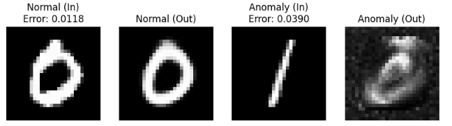

# 目的

本ディレクトリ以下は異常検知の技術に関する実験と結果をレポートします。

## AE

ニューラルネットワークを用いる最もベーシックな手法がAutoEncoderです。

### 1. 圧縮（Encoder）と復元（Decoder）

AEは、入力画像を一度小さなデータにギュッと凝縮し（ **エンコード** ）、そこから元の画像を復元する（ **デコード** ）という構造を持っています。

* **Encoder:** 画像の重要な特徴（形、色、構造）だけを抽出する。
* **Decoder:** 抽出された特徴だけを頼りに、元の画像を再現する。

### 2. 「正常」だけを学習する

学習フェーズでは、正常な画像だけを大量に読み込ませます。

すると、AIは「正常な画像に含まれるパターン（例：傷のない表面、正しい部品の配置）」を効率よく圧縮・復元できるようになります。

### 3. 再構成誤差による判定

学習が終わったAIに、未知の画像を入力します。

* 正常な画像が来た場合:
  学習済みの得意なパターンなので、きれいに復元できます。入力と出力の差（再構成誤差）は小さくなります。
* 異常な画像（汚れや異物）が来た場合:
  AIは「異常なパターン」を知らないため、その部分をうまく再現できません。結果として、入力と出力の差が大きくなります。

> 判定の基準:
>
> 「入力画像」と「AIが描き直した画像」を引き算し、その差が **あらかじめ決めたしきい値（Threshold）** を超えたら「異常」とみなします。

