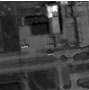
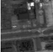
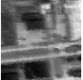

画像（2次元）と時系列信号（1次元）の異常検知において、アルゴリズムのコアとなる数学（RPCAやISTA/LISTAなど）は共通していますが、  **「データの下準備（前処理）」** と **「近傍情報の扱い方」** が大きく異なります。

主な違いを3つのポイントで整理し、時系列版のLISTA実装のイメージを解説します。

### 1. データの次元と「窓」の作り方

* **画像（2次元）**:
* **単位**: 「パッチ」で切り出します（例： ピクセル）。
* **近傍**: 上下左右の2次元的なつながりを重視します。
* **行列$M$** : パッチを1次元に伸ばして列ベクトルとして並べます。
* **時系列（1次元）**:
* **単位**: **「スライディングウィンドウ」**で切り出します。
* **近傍**: 「過去から未来へ」という時間的な連続性のみを重視します。
* **行列$M$**: ある長さ（窓幅）の信号を少しずつずらしながら並べた **「ハンケル行列（Hankel Matrix）」** を作成することが一般的です。

> 1. 行列の構造（定義）
>    ある時系列データ $x = [x_1, x_2, x_3, x_4, x_5, \dots]$ があるとき、窓幅（ウィンドウサイズ）を $L$ としてハンケル行列 $H$ を作ると、以下のようになります。
>
> $$
> H = \begin{bmatrix} 
> x_1 & x_2 & x_3 & \dots \\
> x_2 & x_3 & x_4 & \dots \\
> x_3 & x_4 & x_5 & \dots \\
> \vdots & \vdots & \vdots & \ddots
> \end{bmatrix}
> $$
>
> 特徴: 「左下から右上に向かう対角線（逆対角線）」の要素がすべて同じ値になります。実装上のイメージ: 1段下の行は、上の行を1ステップだけ左にシフトしたものになります。
> 2. なぜ異常検知でハンケル行列を使うのか？時系列データをそのまま1本の線として見るのではなく、ハンケル行列に変換することで、**「データのダイナミクス（背後にある法則性）」**を行列の性質として取り出せるようになります。
> ① 「低ランク性」が利用できる正常な信号（例：きれいな正弦波や一定の周期を持つ振動）からハンケル行列を作ると、その行列のランク（独立な列の数）は非常に小さくなります。
>
> - 正常: 行列は低ランク（特定のパターンが繰り返されるため）。
> - 異常: 突発的なノイズや変化が入ると、行列のランクが急上昇する、あるいはスパースな残差として現れる。
>   ② RPCAとの相性が抜群ここで、あなたが学んだ RPCA（ロバスト主成分分析） が登場します。時系列データをハンケル行列 $H$ に変換し、それを $H = L + S$ に分解すると：$L$ (Low-rank): 周期的な背景振動、安定したトレンド。$S$ (Sparse): 突発的なスパイクノイズ、急な異常動作。というように、きれいに異常を分離できるのです。

### 2. 時系列版 LISTA の実装コード（主要な変更点）

信号データの場合、入力次元は「窓の長さ」になります。以下に時系列データに特化した前処理とモデル適用の流れを示します。

```python
import torch
import numpy as np

def create_segments(signal, window_size, stride=1):
    """時系列信号をスライディングウィンドウで切り出す（パッチ分割の1次元版）"""
    segments = []
    for i in range(0, len(signal) - window_size + 1, stride):
        segments.append(signal[i : i + window_size])
    return torch.tensor(np.array(segments), dtype=torch.float32)

# --- 設定の違い ---
# 画像なら input_dim = patch_size * patch_size (64など)
# 時系列なら input_dim = window_size (時間軸の長さ)
window_size = 50
input_dim = window_size 
hidden_dim = 100 # 辞書のサイズ（基底数）

# モデル自体は以前の LISTA クラスと共通
# model = LISTA(input_dim, hidden_dim)

# --- 推論後の再構成 ---
# 画像なら 2Dに配置し直す (patches_to_image)
# 時系列なら 1列に並べ直す。重なり部分は平均をとるのが一般的。

```

---

### 3. 実装上の決定的な違い

| 比較項目               | 画像（Image）                  | 時系列（Time Series）                        |
| ---------------------- | ------------------------------ | -------------------------------------------- |
| **特徴量抽出**   | 空間的テクスチャ（模様）       | 周期性、トレンド、周波数成分                 |
| **異常の形**     | キズ、異物、点ノイズ（局所的） | スパイク、ドリフト、周期の乱れ               |
| **前処理の工夫** | 色空間の変換 (RGB→Labなど)    | **正規化（スケーリング）が極めて重要** |
| **モデルの拡張** | CNNとの親和性が高い            | **RNN/LSTM/Transformer** との親和性    |

---

### 4. 時系列特有の難しさ：スケーリング

画像は画素値が  と決まっていますが、時系列信号（電圧、振動、株価など）は値の範囲が大きく変動します。
そのため、時系列の LISTA では、各ウィンドウを **「平均0、分散1」に正規化（Z-score）してから入力**し、復元後に元のスケールに戻すという処理が精度向上の鍵となります。

### まとめ

* **計算ロジック（LISTAの層など）は変えなくて良い。**
* **データの切り出し方を「2Dパッチ」から「1Dスライディングウィンドウ」に変える。**
* **出力の統合方法を「2D配置」から「時系列への復元」に変える。**

もし、今お手元に「振動データ」や「音声データ」のような特定の信号データがある場合は、そのデータの特性（周期性があるか、突発的なスパイクか）に合わせて **window_size** を設計するお手伝いができます。どのような信号を想定されていますか？


RPCA（Robust Principal Component Analysis：ロバスト主成分分析）は、観測データを行列 **$X$** としたとき、それを「低ランク行列 **$L$**（本質的な構造）」と「疎な行列 **$S$**（外れ値やノイズ）」の和に分解する手法です。

RPCAの基本となる最適化関数（目的関数）は、以下の**主成分追求（Principal Component Pursuit, PCP）**と呼ばれる凸計画問題として定式化されます。

---

### 1. RPCAの基本最適化関数

本来、ランクを最小化する問題は NP困難ですが、RPCAではそれを計算可能な**凸緩和（Convex Relaxation）**の形で解きます。

$$
\min_{L, S} \quad \|L\|_* + \lambda \|S\|_1 \quad \text{subject to} \quad L + S = X
$$

ここで、各項の意味は以下の通りです。

* **$\|L\|_*$（原子核ノルム / Nuclear Norm）** :
  行列 **$L$** の特異値の和です。行列のランク（**$\text{rank}(L)$**）の凸近似として機能し、**低ランク性**を促進します。
* **$\|S\|_1$（**$L_1$**ノルム）** :
  行列 **$S$** の全要素の絶対値の和です。非ゼロ要素の数（**$L_0$**ノルム）の凸近似として機能し、**疎（スパース）特性**を促進します。
* **$\lambda$（ハイパーパラメータ）** :
  低ランク性と疎性のバランスを調整する重み係数です。一般的には **$\lambda = 1/\sqrt{\max(m, n)}$**（**$m, n$** は行列のサイズ）が理論的な推奨値とされます。

---

### 2. なぜこの関数が重要なのか？

従来の PCA（主成分分析）は、誤差がガウス分布に従うことを前提としており、**「大きな外れ値」に非常に弱い**という弱点がありました。

RPCAの最適化関数に **$L_1$** ノルムが含まれているおかげで、一部の要素が極端に大きな値（スパースなノイズ）を持っていても、それを **$S$** に吸収させることができ、本質的な低ランク構造 **$L$** を正確に抽出できます。

---

### 3. アルゴリズム（解法）

この最適化問題を解くために、実務（Pythonのライブラリ等）では以下のアルゴリズムがよく使われます。

* **ADMM (Alternating Direction Method of Multipliers)** :
  拡張ラグランジュ関数を用いて **$L$** と **$S$** を交互に最適化する手法。
* **IALM (Inexact Augmented Lagrange Multiplier)** :
  ADMMの変種で、計算速度が速く、現在の主流です。

---

### 4. 具体的な応用イメージ

あなたがエンジニアとしてこの関数を扱う際、以下のようなシーンが典型的です。

* **背景差分抽出（ビデオ監視）** :
  ビデオの各フレームを列ベクトルとして並べた行列 **$X$** に対し、**$L$** は「動かない背景（低ランク）」、**$S$** は「動く物体（疎なノイズ）」として分離されます。
* **データクリーニング** :
  センサー故障などによる突発的な異常値を含むデータから、本来のトレンドを復元します。

---

### まとめ

RPCAの核心は、**ランクの近似である「原子核ノルム」**と、**外れ値の指標である「**$L_1$**ノルム」**を組み合わせた最小化問題にあります。

次は、この最適化関数を解くための**「特異値しきい値演算（Singular Value Thresholding）」などの具体的な更新ステップ**について詳しく見てみますか？


RPCAや通常のPCAの背後にある**特異値分解（SVD）**において、**$U, \Sigma, V^T$**（または **$V^*$**）の3つの行列は、元のデータ行列を「空間」「強度」「時間（あるいはサンプル）」の3要素に分解する役割を担っています。

エンジニアとしてデータを扱う際、これらは**「基底」「重み」「係数」**と読み替えると非常に理解しやすくなります。

---

### 1. **$U$** (左特異ベクトル)：データの「形・パターン」

**$U$** の各列ベクトル（**$\mathbf{u}_1, \mathbf{u}_2, \dots$**）は、データに含まれる**主要な形（基底）**を表します。

* **画像データの場合** :
  **$U$** の各列を画像として表示すると、データの「骨格」が見えます。第1列（**$\mathbf{u}_1$**）は最も支配的な背景、第2列以降は光の変化や主要な構造のバリエーションを表します。
* **直交性** :
  **$U$** は直交行列なので、各モードは互いに干渉しない「独立した特徴量」として抽出されます。

---

### 2. **$\Sigma$** (特異値)：データの「重要度・エネルギー」

**$\Sigma$**（コード上ではしばしば `S`）は、対角成分に**特異値**が並んだ対角行列です。

* **意味** :
  各モード（**$U$** の列と **$V^T$** の行のペア）が、元のデータ **$X$** をどれだけ説明しているかという「強さ」を表します。
* **RPCAにおける役割** :
  RPCAの最適化関数 **$\|L\|_*$** は、この **$\Sigma$** の値を小さく（あるいは一部をゼロに）するように働きます。これにより、重要度の低いモードが削ぎ落とされ、本質的な**低ランク構造**だけが残ります。

---

### 3. **$V^T$** (右特異ベクトル)：データの「重み・時間変化」

**$V^T$**（**$V$** の転置）の各行ベクトル（**$\mathbf{v}_1^T, \mathbf{v}_2^T, \dots$**）は、各モードが**「いつ、どのサンプルで、どれくらい現れたか」**という時間的・サンプル的な推移を表します。

* **動画データの場合** :
  横軸をフレーム番号、縦軸を値としてグラフにプロットすると、特定の背景パターンが時間とともにどう変化したか（あるいは一定だったか）を確認できます。
* **座標変換** :
  元のデータを「新しい軸（**$U$**）」に投影したときの座標値だと考えることもできます。

---

### 4. まとめ：行列の掛け算としてのイメージ

元の行列 **$L$** は、これら3つの要素の「和」として再構成されます。

$$
L = \sigma_1 \mathbf{u}_1 \mathbf{v}_1^T + \sigma_2 \mathbf{u}_2 \mathbf{v}_2^T + \dots
$$

| **行列**       | **エンジニア的解釈**   | **視覚的なイメージ**             |
| -------------------- | ---------------------------- | -------------------------------------- |
| **$U$**      | **基底 (Basis)**       | 空間的な「絵」や「パターン」           |
| **$\Sigma$** | **重要度 (Weight)**    | そのパターンの「コントラスト（強さ）」 |
| **$V^T$**    | **係数 (Coefficient)** | タイムラインや「サンプルの寄与度」     |

---

### 視認のヒント

あなたが監視カメラの映像をRPCAで解析しているなら：

* **$U$ の第1列** を見れば、動くものが消えた「背景画像」が手に入ります。
* **$V^T$ の第1行** を見れば、その背景が全フレームを通じて安定しているか（定数に近いか）が分かります。

次は、実際に**NumPyを使って適当な行列を分解し、これらの **$U, S, V^T$** を個別にプロットして、元の行列がどう組み上がるか**をコードで動かしてみますか？


特異値の上位をとってくるとこんな感じとなる



k = 3



k = 10


