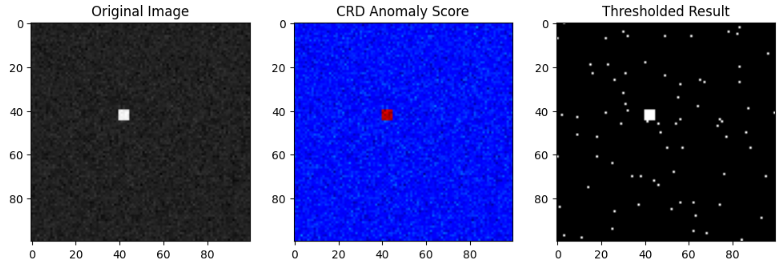
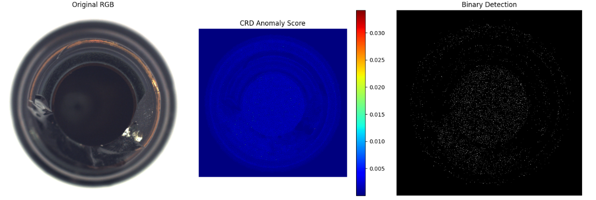

**CRD (Collaborative Representation-based Detector)** は、特にハイパースペクトル画像や工業製品の表面検査において、「背景の複雑な模様」を効率的にモデル化するために開発された異常検知手法です。

同じような背景表現を行う **SRD (Sparse Representation)** の「高い表現力」を維持しつつ、計算時間を大幅に短縮し、より「周囲との関係性」を重視した手法と言えます。

## CRDの核心コンセプト：「お隣さんの協力」

### 計算仮定

CRDの根本にある仮定は、 **「正常な画素であれば、その周囲にある他の正常な画素たちの『線形結合（重み付き合計）』で再現できるはずだ」** というものです。

* **正常な場所**: 周囲の画素（背景）と似た性質を持つため、周りの画素を適当な比率で混ぜ合わせれば、自分自身の値をほぼ完璧に作れます。
* **異常な場所**: 周囲とは明らかに異なる性質（色や質感）を持つため、周りの画素をどう組み合わせても、自分を再現することができず、大きな「誤差」が残ります。

この「周囲の画素たちが協力（Collaborate）して中心を表現する」というプロセスが名前の由来です。

### 仮定の根拠

CRD が「お隣さんの協力（線形結合）で自分を表現できる」と考える根拠は、主に **「データの局所的な相関性」** と **「部分空間（Subspace）仮説」** という2つの数学的・物理的背景に基づいています。

なぜお隣さんを信じて良いのか、その理論的支柱を解説します。

__1. 局所的な平滑性と相関性（Local Smoothness）__

自然画像や工業製品の表面データにおいて、 **「物理的に近い距離にある画素同士は、似たような性質を持つ」** という大原則があります。

* **根拠**: 同じ素材、同じ照明条件下であれば、隣接する数ピクセルの範囲内では反射率やテクスチャの統計量はほぼ一定とみなせます。
* **結論**: したがって、ターゲット画素 $y$ は、そのすぐ外側にある背景画素たちの集まり $D$ の範囲内（分布）に収まっているはずであり、それらを「混ぜ合わせる（協力させる）」ことで容易に再現できるはずだ、という理屈です。

__2. 部分空間仮説（Subspace Hypothesis）__

これは高次元データ解析における非常に強力な概念です。

* **考え方**: 高次元（例えばハイパースペクトルなら数百次元）のデータであっても、特定の「背景」というカテゴリに属するデータは、実は非常に低い次元の **「部分空間（平面のようなもの）」** の上に載っているという仮定です。
* **根拠**: 周囲の画素群 $D$ が形成する部分空間の中にターゲット $y$ が含まれていれば、 $y$ は $D$ の各要素を足し引きしたベクトル（線形結合）として表現可能です。
* **異常の定義**: もしターゲットが異常（キズなど）であれば、それは周囲の背景が作る「部分空間」の外側に存在します。そのため、周囲の画素をどれだけ協力させても $y$ を再現できず、大きな誤差が生じます。

__3. $L_1$（スパース）ではなく $L_2$（協調）である理由__

CRDが「数個の選りすぐり（SRD）」ではなく「全員の協力（CRD）」を重視する根拠は、 **「情報の相互補完」** にあります。

* **SRD（選別）の弱点**: 背景に少しでもノイズが混じると、どの1つを選ぶべきかが不安定になり、再構成誤差が安定しません。
* **CRD（協力）の強み**: 周囲の画素すべてに少しずつ重みを割り振ることで、ノイズの影響を平均化（平滑化）し、背景のモデルをより安定させることができます。
* **数学的根拠**: 特徴量の次元がサンプル数に比べて十分に高い場合、$L_1$によるスパース性よりも、$L_2$による「全要素の協調」の方が、識別において重要であるという研究結果（Rigid Regressionの有効性など）に基づいています。

## 仕組み

### アルゴリズムの数理的イメージ

ターゲット画素を $y$、背景窓の画素を並べた辞書を $D$ とすると、CRDは以下の最小化問題を解きます。

$$
\min_{\alpha} \|y - D\alpha\|_2^2 + \lambda \|\alpha\|_2^2
$$

この式は数学的に「リッジ回帰」と同じ形をしており、以下のような **クローズドフォーム（解析解）** を持ちます。

$$
\alpha = (D^T D + \lambda I)^{-1} D^T y
$$

この $\alpha$（重み）を使って再現した画像と、元の画素 $y$ の差が異常スコアとなります。

### 二重窓（Dual Window）による辞書の構築

CRDでは、画像全体で一つの辞書を作るのではなく、ターゲットとなる画素の **「すぐ外側」** から動的に辞書を作ります。

1. **ターゲット（中心画素）**: 異常かどうかを判定したい点。
2. **ガード窓（Guard Window）**: 中心の異常が辞書に混ざらないようにするための「空白地帯」。
3. **背景窓（Background Window）**: ここに含まれる画素すべてを**「背景辞書 」**として利用します。

### SRD（スパース表現）との決定的な違い

SRDとCRDはどちらも「辞書を使って自分を再現する」手法ですが、 **「重みの付け方」** が数学的に異なります。

| 特徴                   | SRD (Sparse)                                        | **CRD (Collaborative)**                       |
| ---------------------- | --------------------------------------------------- | --------------------------------------------------- |
| **重みのルール** | 辞書から**「少数のパーツだけ」** 選ぶ ( 制約) | 辞書の**「全員で協力」** して再現する ( 制約) |
| **計算方法**     | 反復計算が必要（ISTAなど）で重い                    | **行列演算（逆行列）一発** で解けるため爆速   |
| **得意な背景**   | 特徴的な模様が点在する背景                          | 滑らか、あるいは連続的に変化する背景                |

**なぜCRDの方が有利な場合があるのか？**
SRDは「どれか数個を選び抜く」ため、ノイズに敏感になりがちです。CRDは周囲の画素を「平均的にうまく使う」ため、ノイズに強く、かつ行列演算だけで済むため実用性が非常に高いのです。

### 実装

異常検知を行うpythonコードを以下のレポジトリに保管しています。

https://github.com/Shinichi0713/recommendation-ai/tree/main/anormaly_detect_techs/techs

__実装のポイント解説__

__1. Dual Window (二重窓) の設定:__

- win_out (背景窓): 周囲の「正常なはずの画素」をどれだけ集めるかを決めます。
- win_in (ガード窓): ターゲット（中心）にある異常が背景辞書に混ざらないようにするためのバッファです。これが無いと、異常を異常自身で再現できてしまい、検出漏れが起きます。

__2. 線形結合による近似:__

- コード内の alpha は、周囲の画素 $D$ をどのような比率で混ぜれば $y$ になるかを示す重みです。
- 正常な画素なら、周囲の平均的な色合いと似ているため y - y_hat（残差）は小さくなります。
- 異常な画素は、周囲をどう混ぜてもその色を再現できないため、残差が大きくなります。

__3. 計算の高速化:__

- CRDは本来「行列の逆行列」を解きますが、グレースケール1次元データの場合、計算は非常にシンプルになります。- ハイパースペクトル画像（多次元）の場合は、本格的な np.linalg.inv を用いた行列計算が必要になります。

__実験結果__

背景がほぼ均一の画像の中に一か所色違いの擬似異常を埋め込んだ画像で実験を行いました。

この異常、付近の画像から突然変化が起こることになるので、近隣の画像はある程度、近隣と似た性質があるはず、という前提から外れた **異常** ということになります。

ですのでCRDが得意とする 「局所的な違和感」 をはっきりと検知出来ます。

そして、得意な異常はあくまで局所的な異常です。

以下のように異常がある程度大きい場合は検出できません。

## CRDを選ぶ理由

* **局所適応**: 画像の場所ごとに背景が違っても、その場その場の「お隣さん」を辞書にするので精度が高い。
* **高速性**: 複雑な最適化アルゴリズムが不要。
* **安定性**: 周囲の画素を協調的に使うため、統計的な外れ値（ノイズ）の影響を受けにくい。

## 所感

今回は複雑な模様を持つ背景でも、高速に異常検知を行えるCRDについて扱いました。

先日までに説明した **RPCA** で「大まかな背景」を除去し、取りきれなかった微細な「周囲との違和感」をこの **CRD** で仕留める、という組み合わせは非常に強力です。

異常検知システムを構築する場合は是非ご参考頂ければと思います。
