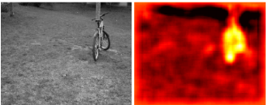

本日は背景辞書を使った異常検知法のうち、分けた背景辞書をさらにクラスタリングすることで、CRDの持つ課題を解決した手法について説明します。

## 概要
その手法の名前は **クラスターベース辞書（Cluster-based Dictionary）** と呼ばれる手法です。
背景をいくつかの「種類（クラスター）」に分けて管理する方法です。

作り方: 画像全体を K-means などでクラスタリングし、「芝生」「コンクリート」「影」といったグループごとの辞書（または平均ベクトル）を作成します。

__特徴:__

- ターゲット画素がどのクラスターに属するかを判定し、対応する辞書だけを使って計算します。
- LRBに近い考え方ですが、近傍を毎回探すのではなく、あらかじめ分類しておくため高速です。
- 得意なケース: 異なる素材が混在する風景写真や、複数の部品が並ぶ工業製品の検査。

## 従来課題

クラスターベース辞書は、主に **「計算コスト（速度）」** , **「背景の多層性（複雑な混ざり具合）」** という、CRDやLRBが抱える実用上の限界を突破するために考案されました。

具体的には、以下の3つの大きな課題を解決しようとしています。

### 1. 「毎回探す・毎回解く」という計算の重さ

CRDやLRBの最大の弱点は、全ピクセルに対して「窓を切り出し、行列の逆行列を解く」という重い処理を繰り返すことです。

* **解決策**: 画像全体をあらかじめいくつかのクラスター（例えば「草地」「道路」「影」）に色やテクスチャで分類しておきます。
* **メリット**: 各ピクセルで計算を行う際、ゼロから辞書を作るのではなく、 **「自分はクラスターAに属するから、クラスターA専用の学習済み辞書を使う」** という選択をするだけで済みます。これにより、処理速度が飛躍的に向上します。

### 2. 「混ざりすぎた背景」による精度の低下

CRDのような局所窓方式では、ターゲットが「草地」と「コンクリート」の境界にある場合、辞書には両方の性質が混ざってしまいます。

* **解決策**: クラスターベースでは、空間的な位置に関わらず、 **「統計的に似ているもの」** だけで辞書を構成します。
* **メリット**: 境界線の上にあるピクセルでも、「草地クラスター」の辞書を使って草地としての整合性をチェックできるため、複数の素材が入り混じる複雑なシーン（都市部の空撮や、部品が密集した基板など）で、背景の「ボケ」を防ぎ、異常を鋭く分離できます。

### 3. 「異常の汚染（Contamination）」への耐性

局所窓方式では、大きな異常の隣のピクセルを計算する際、その異常そのものが「背景辞書」の中に紛れ込んでしまうことが多々あります。

* **解決策**: 異常は通常、画像全体で見れば「稀な存在」です。クラスタリングを行うと、圧倒的多数を占める「正常な背景」が大きなクラスターを形成し、少数の異常はそれらのクラスターから外れるか、非常に小さな独立したグループになります。
* **メリット**: 正常なクラスターから得られた辞書を使って計算することで、 **「異常を使って異常を説明してしまう（見逃し）」** という自己消去現象を構造的に回避しやすくなります。

### クラスターベース辞書の運用フロー

1. **オフライン/事前学習**: 画像全体（または正常なサンプル群）をクラスタリングし、各クラスター  ごとに代表的な基底ベクトル（辞書 ）を構築します。
2. **クラスター割り当て**: 判定したいピクセル  が、どの  に最も近いかを判定します。
3. **再構成と判定**: 選ばれたクラスターの辞書  を用いて協調表現（CRDの計算）を行い、その誤差で異常を判定します。

## 仕組み

クラスターベース辞書（Cluster-based Dictionary）の仕組みは、 **「似た者同士をあらかじめグループ化しておき、そのグループの代表ルールで個々の画素をチェックする」** という、効率的かつ合理的なプロセスです。

__1. 構築フェーズ：背景の「カタログ」作り__

まず、画像全体（または正常な学習用画像）を分析して、その画像に存在する「背景の種類」を自動的に分類します。

- 特徴抽出: 各画素をベクトル（RGBやマルチスペクトル値）として扱います。
- クラスタリング（分類）: K-means などのアルゴリズムを使い、全画素を $K$ 個のクラスターに分けます（例：クラスター1=草、2=水、3=土）。
- サブ辞書の生成: 各クラスターに属する画素の中から、そのクラスターを代表するベクトルを抽出・選定し、各クラスター専用の辞書 $D_c$ を作成します。

__2. 検知フェーズ：代表ルールによる照合__

次に、異常かどうかを判定したいターゲット画素 $y$ を、先ほど作ったカタログと照らし合わせます。

1. クラスター選択: ターゲット画素 $y$ が、どのクラスターの重心に最も近いかを計算し、適用する辞書 $D_c$ を一瞬で決定します。ここがLRBとの違いです。LRBは毎回全候補から探しますが、クラスターベースは「君はクラスター2担当ね」と即決します。

2. 協調表現の計算: 選ばれた辞書 $D_c$ を使い、CRDと同じ数式で重み $\alpha$ を求めます。

$$\alpha = (D_c^T D_c + \lambda I)^{-1} D_c^T y$$

3. 異常スコアの算出:

$$Score = \|y - D_c \alpha\|_2$$

もしターゲットが「クラスター2（水）」に分類されたのに、実際には「油」の成分を含んでいれば、水の辞書 $D_c$ では再現しきれず、誤差（スコア）が大きくなります。

3. なぜこの仕組みが効くのか？（数学的メリット）

空間的制約からの解放: CRDのような「窓」は使いません。画像上の位置が離れていても、同じ「草」であれば同じ辞書で評価します。これにより、窓の中にたまたま異常が混入して辞書が汚染されるリスク（Dictionary Contamination）を大幅に減らせます。逆行列の使い回し: 同じクラスターに属する画素であれば、$(D_c^T D_c + \lambda I)^{-1}$ の部分は一度計算すればそのクラスターの全画素で使い回せます。これが、この手法が爆速である理由です。

__仕組みのイメージ__

- CRD/LRB: 「あなたの周りの数人に、あなたを説明してもらいなさい」
- クラスターベース: 「あなたはこのグループの一員ね。じゃあ、そのグループの代表メンバーの組み合わせで、あなたを再現できるか試すよ」

## 実権

以下レポジトリにコードを保管しています。

https://github.com/Shinichi0713/recommendation-ai/tree/main/anormaly_detect_techs/techs/Cluster_based_Dictionary

##　結論

今回は異常検知の手法で辞書をつくる辞書クラスター手法について説明しました。
この手法の得意はこんなところです。

① 処理速度が圧倒的に速い

CRDやLRBがピクセルごとに数千回の行列計算を行うのに対し、クラスターベースは数個の「クラスター用プロジェクション行列」を使い回します。

理由: 同じクラスターに属する画素は、同じ辞書と逆行列を共有できるため、一括処理（ベクトル演算）が可能だからです。

② 境界線（エッジ）での誤検知が少ない

LRBと同様に、ターゲットが「草地」と「コンクリート」の境目にあっても、自分が属するクラスター（例：草地）の辞書で評価されるため、背景が混ざることによるノイズが出にくいです。

③ 離れた場所にある同じ背景を活用できる

CRDは「窓」の中にサンプルがないと背景を定義できませんが、クラスターベースは画像上のどこかに同じ素材があれば、それを辞書として使えます。

④ 異常の「自己消去（Ghosting）」に強い

異常箇所は統計的に「稀」な存在であるため、大きなクラスターには含まれません。そのため、背景辞書に異常成分が混入する確率が、局所窓方式よりも低くなります。

CRDで精度が出ないような場合、こちらを試してみてください。

## CRDの検知力不足

CRD（Collaborative Representation-based Detector）で異常が検知できない（背景に埋もれてしまう）場合、数学的な「再構成プロセス」のどこかで、**本来異常であるはずの成分が背景としてうまく説明されてしまっている**ことが原因です。

考えられる主な原因を、パラメータ設定とデータの性質の観点から5つに整理しました。

### 1. 正則化パラメータ （ラムダ）が大きすぎる

これが最も多い原因です。

* **理論**:  は重みベクトル  の大きさを抑制する役割を持ちます。 が大きすぎると、背景画素を「協調的」に使う力が強まりすぎて、どんなターゲット  に対しても「背景の平均的な成分」で無理やりフィッティングさせてしまいます。
* **結果**: 異常なスペクトル成分があっても、 による平滑化効果で誤差が小さく抑えられ、異常スコアが伸びなくなります。
* **対策**:  を  から  程度まで段階的に小さくして、再構成の「遊び」を減らしてみてください。

### 2. 内窓（ガード窓）が小さすぎる

異常箇所のサイズに対して、内窓（Guard Window）の設定が適切でないケースです。

* **理論**: 異常箇所のサイズが内窓より大きいと、背景辞書  の中に**異常成分そのもの**が混入してしまいます（Dictionary Contamination）。
* **結果**: 異常を異常自身で説明できてしまうため、再構成誤差（異常スコア）が  に近くなります。これを「自己消去現象」と呼びます。
* **対策**: 内窓のサイズを、想定される異常の最大サイズよりも一回り大きく設定してください。

### 3. 外窓（背景窓）が大きすぎる、または不均一

背景辞書の範囲が広すぎると、検知したい地点とは無関係な素材まで辞書に混ざります。

* **理論**: CRDは「辞書にあるものを組み合わせて再現する」手法です。窓が広すぎて辞書のバリエーションが豊富になりすぎると、異常な色であっても「遠くにある別の色」を組み合わせることで再現できてしまいます。
* **結果**: 背景モデルが汎用的になりすぎ、異常に対する感度が低下します。
* **対策**: 背景の局所性を保つため、外窓を必要最小限（例：内窓＋2〜4ピクセル程度）まで絞ってみてください。

### 4. 異常と背景の「線形従属性」が高い

数学的な性質による問題です。

* **理論**: 異常成分のスペクトルが、背景辞書のスペクトル群の「線形結合（足し算と引き算）」で表現できてしまう場合、CRDでは理論上検知できません。
* **例**: 背景に「赤」と「青」の成分があるとき、異常がその中間色の「紫」だと、背景を混ぜるだけで再現できてしまいます。
* **対策**:
* 線形結合以外の特徴（テクスチャや非線形カーネル）を導入する。
* **LRB**（Local Representation）に切り替えて、背景を「似ているものだけ」に絞り、再現の選択肢を狭める。

### 5. 前処理での情報の欠落

計算前の正規化で、異常のヒントを消してしまっている可能性があります。

* **理論**: 全バンドの平均を引いたり、ノルムで割って「明るさ」の情報を捨てたりすると、**「明るさの変化だけで現れる異常」**が消えてしまいます。
* **結果**: 異常と背景が、正規化後のスペクトル空間で重なってしまいます。
* **対策**: 正規化の手法を変える（例：StandardScalerではなくMinMaxScalerにする）、あるいは明るさ情報を別チャンネルとして保持して計算に加える。

## 原理

クラスターベース辞書が「大きな異常」に対してなぜ強いのか、その秘密は**「空間的な隣人」ではなく「統計的な仲間」を辞書の素材にする**という仕組みにあります。

LRXやCRDのような「窓」を使う手法が**地縁（近所付き合い）**だとすれば、クラスターベース辞書は**趣味のオフ会（属性ベースの集まり）**のようなものです。

その仕組みを3つのステップで紐解きます。

---

### 1. 全域的な「背景カタログ」の作成

まず、画像全体から「この画像にはどんな背景の種類があるか」を洗い出します。

* **仕組み**: 空間的な位置（座標）を無視して、全画素のスペクトル情報を多次元空間にプロットし、**K-means**などのクラスタリングを行います。
* **なぜ異常に強いか**: 巨大な異常であっても、画像全体から見れば面積比率は低いことが多いです。クラスタリングを行うと、圧倒的多数派である「正常な背景」が大きなグループ（クラスター）を作り、異常な画素は**「どのグループにも属さない外れ値」**、あるいは**「非常に小さな独立したグループ」**になります。

---

### 2. クリーンな「背景専用辞書」の構築

次に、各クラスターから「そのクラスターを代表する画素」を抽出して辞書を作ります。

* **仕組み**:
1. 各クラスター  の中から、代表的なスペクトル（重心や分散内の画素）をピックアップします。
2. これをクラスター専用の背景辞書  とします。

* **汚染の回避**: 窓を使わないため、**「ターゲット画素のすぐ隣に大きな異常があるからといって、それを辞書に入れてしまう」というミスが起きません。** 異常な画素は「異常クラスター」にまとめられるか、無視されるため、正常な背景クラスターの辞書  は純粋な背景成分だけで構成されます。

---

### 3. 「よそ者」としての異常検知

実際にターゲット画素  を判定するフェーズです。

* **仕組み**:
1. ターゲット  がどのクラスター  に最も近いか判定します。
2. 選ばれたクラスターの「純粋な背景辞書 」を使って、 を再構成（CRDの計算）します。

* **判定**:
* **正常な画素なら**: 画像のどこか別の場所にある同じ素材の辞書を使って、完璧に再現されます。
* **大きな異常なら**: たとえその周囲がすべて異常で埋まっていても、**辞書の素材は画像全体の統計から選ばれた「正常な背景」**です。そのため、大きな異常を再現する素材が辞書の中に存在せず、再構成誤差が巨大になり、はっきりと検知されます。

---

### まとめ：なぜ大きな異常を逃さないのか？

| 特徴 | 局所窓手法 (LRX/CRD) | クラスターベース手法 |
| --- | --- | --- |
| **辞書の素材選び** | 物理的に「近い」もの | 統計的に「似ている」もの |
| **大きな異常への反応** | 異常を背景として学習してしまう | 異常は「異質なグループ」として隔離される |
| **窓サイズの影響** | **極めて大きい** | **ほぼ受けない** |
| **メリット** | 局所的な照明変化に強い | **巨大な異常や複雑な背景に強い** |

### 実装上のアドバイス

この手法で唯一気をつけるべきは、**「異常があまりにも巨大で、画像面積の半分以上を占める」**ようなケースです。この場合、異常が「最大派閥の背景」としてカタログに登録されてしまいます。

しかし、通常の「背景の中に何らかの異物がある」というシナリオであれば、クラスターベースは窓サイズに悩まされることなく、安定して大きな異常を抜き出すことができます。

