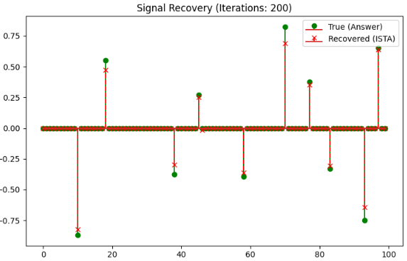
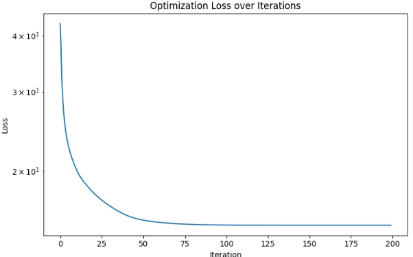

異常検知の背景・スパースを解く手法に用いられるアルゴリズム **ISTA（Iterative Soft-Thresholding Algorithm：反復近傍しきい値アルゴリズム）** について解説します。

一言でいうと、ISTAは **「データの中から、ごく一部の重要な要素だけ（スパース性）を取り出して、元の情報を復元する」** ための計算手法です。


## ISTAが解決したい問題（L1正則化）

現実のデータ（画像や信号）の多くは、適切な基底で表すと、ほとんどの成分が 0 になる **「スパース（スカスカ）」** な性質を持っています。ISTAは、以下の式で表される「Lasso（ラッソ）回帰」のような最適化問題を解くために考案されました。

$$
\min_{x} \left\{ \frac{1}{2} \|y - Ax\|_2^2 + \lambda \|x\|_1 \right\}
$$

* **第1項（データ適合項）：** 観測データ $y$ と、予測 $Ax$ のズレを小さくする。
* **第2項（正則化項）：**   $x$ の成分の多くを $0$ にする（スパースにする）。

## アルゴリズムの仕組み

ISTAは、一気に答えを出すのではなく、以下の2つのステップを何度も繰り返すことで、少しずつ正解の $x$ に近づけていきます。

#### ステップ①：勾配降下（もっともらしくする）

現在の $x$ を、データ $y$ に近づくように少し動かします。

$$
z_k = x_k - \frac{1}{L} A^T (Ax_k - y)
$$

#### ステップ②：ソフトしきい値関数（無理やり削る）

ステップ①で動かした値のうち、 **「絶対値が小さい微小な成分」を強制的に 0 にし、大きな成分だけを残します。** これが「しきい値（Thresholding）」と呼ばれる操作です。

$$x_{k+1} = \eta_{\lambda/L} (z_k)$$

> **ソフトしきい値関数 $\eta$ のイメージ：**
> 設定した値（しきい値）より小さいノイズのような数値はカットし、大きな値も少しだけ中心に引き寄せます。これにより、重要な特徴だけが浮き彫りになります。


## 反復式の収束性
以下の反復式によりスパース信号が算出できる(=計算が収束する)理由は、一言で言うと　**「『データを再現しようとする力』と『値をゼロに削ろうとする力』の押し問答を繰り返しているから」**　です。

反復式は以下で与えられます。

$$
x_{k+1} = \eta_{\theta} (x_k + \frac{1}{L} D^T (y - Dx_k))
$$

* $\eta_{\theta}$: ソフトしきい値関数（小さい値をゼロにする）
* $1/L$: ステップサイズ（学習率のようなもの）

数学的には、ISTAは「L1正則化付き最小二乗法（Lasso）」という問題を解いていますが、その反復式の中身を直感的に分解すると、次の2つのステップが交互に働いていることがわかります。

### データの再現（勾配降下ステップ）

反復式の前半部分 $(x_k + \frac{1}{L} D^T (y - Dx_k))$ に注目してください。

- やっていること: 

今の予測 $Dx_k$ と実際のデータ $y$ を見比べ、足りない部分（残差 $y-Dx_k$）を計算します。そして、その差を埋めるために「どのパーツ（辞書）をどれくらい増やせばいいか」を計算して $x$ に足し合わせます。

結果、とにかく元のデータを100%忠実に再現しようとします。放っておくと $x$ は何でもかんでも値を詰め込もうとします。

### スパース化（ソフトしきい値ステップ）

反復式の外側にある関数 $\eta_{\theta}(\cdot)$ が、魔法の役割を果たします。

- やっていること: 
 
上記で計算された $x$ の各要素に対し、 **「値が小さいものは容赦なく 0 に切り捨て、大きい値も少しだけ 0 方向に引き寄せる」** という処理を行います。これが「ソフトしきい値関数」です。

### なぜこれで「正解」にたどり着くのか？

この2つのステップを何度も繰り返すと、以下のような現象が起きます。

1. 最初は適当に $x$ を決める。
2. 「データを再現するために $x$ を増やせ！」という力（ステップ1）が働く。
3. 「いや、無駄なものは 0 にしろ！」という力（ステップ2）が働く。
4. 何度も繰り返すうちに、「この数個のパーツだけを使えば、データをほぼ完璧に再現できる」という絶妙なバランス地点（最適解）で $x$ が止まります。

この結果として残った $x$ は、本当に重要な情報（＝背景を構成するパーツの指示書）だけがトゲのように立った、スパースな信号になります。

## 実装コード

```python
import numpy as np
import matplotlib.pyplot as plt

def soft_thresholding(x, theta):
    """ソフトしきい値関数: 小さい値を0に、大きい値を0方向に引き寄せる"""
    return np.sign(x) * np.maximum(np.abs(x) - theta, 0)

def ista(y, D, alpha, iterations, theta):
    """
    ISTAアルゴリズム
    y: 観測信号 (input_dim,)
    D: 辞書行列 (input_dim, hidden_dim)
    alpha: ステップサイズ (1 / L, LはD^T Dの最大固有値)
    iterations: 繰り返しの回数
    theta: しきい値 (lambda * alpha)
    """
    x = np.zeros(D.shape[1]) # 推定するスパース信号の初期値
    
    loss_history = []
    
    for i in range(iterations):
        # 1. 勾配計算（データを再現しようとする修正指示）
        # x_next = x + alpha * D.T * (y - D*x)
        residual = y - np.dot(D, x)
        gradient_step = x + alpha * np.dot(D.T, residual)
        
        # 2. ソフトしきい値処理（スパース化：値を0に削る）
        x = soft_thresholding(gradient_step, theta)
        
        # 記録用：再構成誤差の計算
        loss = 0.5 * np.sum((y - np.dot(D, x))**2) + (theta/alpha) * np.sum(np.abs(x))
        loss_history.append(loss)
        
    return x, loss_history

# --- テストデータの準備 ---
np.random.seed(42)
input_dim = 50   # 観測データの次元
hidden_dim = 100 # 辞書の要素数（パーツの数）

# 1. 辞書 D の作成（ランダム）
D = np.random.randn(input_dim, hidden_dim)
# ステップサイズ alpha の計算（収束のために D^T D の最大固有値の逆数より小さくする）
L = np.linalg.norm(D, ord=2)**2
alpha = 1.0 / L

# 2. 真のスパース信号 x_true の作成（10個だけ値があるトゲトゲ信号）
x_true = np.zeros(hidden_dim)
indices = np.random.choice(hidden_dim, 10, replace=False)
x_true[indices] = np.random.randn(10)

# 3. 観測信号 y の作成 (y = Dx + ノイズ)
y = np.dot(D, x_true) + np.random.randn(input_dim) * 0.05

# --- ISTA の実行 ---
iterations = 200
theta = 0.01 # スパース性の強さ
x_recovered, history = ista(y, D, alpha, iterations, theta)

# --- 結果の可視化 ---
plt.figure(figsize=(15, 5))

# 信号の復元具合
plt.subplot(1, 2, 1)
plt.stem(x_true, linefmt='g-', markerfmt='go', label='True (Answer)')
plt.stem(x_recovered, linefmt='r--', markerfmt='rx', label='Recovered (ISTA)')
plt.title(f"Signal Recovery (Iterations: {iterations})")
plt.legend()

# 誤差の収束
plt.subplot(1, 2, 2)
plt.plot(history)
plt.yscale('log')
plt.title("Optimization Loss over Iterations")
plt.xlabel("Iteration")
plt.ylabel("Loss")

plt.tight_layout()
plt.show()
```

### 実行の結果
上記コードを実行した結果は以下の通りです。

信号に擬似的に埋め込んだ異常信号をきっちりと検出することが確認出来ました。



観測信号と、背景行列 + スパースとの差分の推移を示すと以下の通りです。
計算と同時に、差分が収束していくことが確認できました。



## ISTAの弱点

ISTAは非常に優れたアルゴリズムですが、大きな欠点があります。

* **収束が遅い：** 正解にたどり着くまでに、何百回、何千回という反復計算が必要になる。
* **パラメータ設定が難しい：** ステップの幅（学習率）や、しきい値を手動で決めるのが大変。

この弱点の解決がISTAに続くアルゴリズムとして開発されることになります。

## Dの更新の仕方

辞書行列 $D$ をどのように用意するかは、異常検知システムの精度を左右する非常に重要なプロセスです。

大きく分けて、**「数学的に決めてしまう方法」**、**「データから学習する方法」**、そして **「LISTAのようにネットワークの一部として更新する方法」** の3つがあります。


### 数学的に定義する（既定辞書）

自然界の画像や信号には「共通の性質」があるため、あらかじめ設計された数学的な関数をそのまま $D$ として使います。

* **DCT（離散コサイン変換）**: 画像を「様々な周波数の波」の集まりとして表現します。JPEG圧縮などでも使われる、最も標準的な辞書です。
* **ウェーブレット**: 「局所的な変化」を捉えるのが得意な関数です。
* **特徴**: 学習が不要で計算が速いですが、特定の特殊な模様（金属のザラザラなど）には最適化されていません。


### データから学習する（辞書学習 / Dictionary Learning）

正常なデータ（背景画像など）を大量に読み込ませ、「このデータを最も効率よく（スパースに）表現できるパーツは何か？」を計算して $D$ を作ります。代表的なアルゴリズムは K-SVD です。

1. **初期化**: $D$ をランダムな値、または DCT などで初期化。
2. **スパース符号化**: 今の $D$ を使って、各データを再現するための $x$ を求める（ISTAなどを使用）。
3. **辞書の更新**: : 求まった $x$ を固定して、再現誤差 $\|y - Dx\|^2$ が最小になるように $D$ の中身（パーツの形）を書き換える。
4. **繰り返し**: 2と3を何度も繰り返し、そのデータ専用の「最強のパーツ集」を作り上げます。


### 3. LISTAでの算出方法（エンドツーエンド学習）

あなたが関心を持っている **LISTA（深層展開）** の場合、ここが最も画期的です。

* **重みとして扱う**: $D$（あるいは $D$ から派生した $W$）を、ニューラルネットワークの**「重み（Weight）」**として定義します。
* **誤差逆伝播（Backprop）**: 最終的な「異常検知の正解（ラベル）」や「再構成誤差」とのズレを最小化するように、PyTorch などの最適化機能（Adamなど）を使って、$D$ の中身を自動的に調整します。

つまり、人間が「どんなパーツが必要か」を考える必要はなく、 **「キズを見つけやすい背景パーツを勝手に作っておいて」** とAIに丸投げできるのです。


### 4. $D$ が「学習」されるとどうなるか？

学習が進むにつれ、ランダムだった $D$ の各列（パーツ）は、以下のような形に変化していきます。

* **最初は**: ただの砂嵐（ノイズ）。
* **学習後**: 金属の表面の質感を模した「細かい粒々」や、照明の反射を再現する「グラデーション」、縁（エッジ）を表現する「線」などに形を変えていきます。

## Dを自動で更新するアルゴリズム

実はこれが **RPCA** ということになります。

通常、辞書学習は「きれいな正常画像」を使って行いますが、現実には「異常が混ざったデータしかない」というケースも多いです。
その場合、「異常（スパースな外れ値）」を無視しながら、「正常な背景（低ランクな辞書）」を同時に学習する手法がいくつか存在します。

1. __Robust PCA (RPCA) による直接分解__

これが最も基本的な考え方です。「辞書 $D$」という形を明示的に持たず、行列 $X$ を直接「低ランク $L$（背景）」と「スパース $S$（異常）」に分けます。

__仕組み:__

通常の辞書学習（LISTAなど）が「素材（$D$）から背景を組み立てる」のに対し、RPCAは **「データ全体の中に流れる『一貫性』を直接抜き出す」** という手法をとります。

$$
\min_{L, S} \|L\|_* + \lambda \|S\|_1 \quad \text{subject to } X = L + S
$$

（$\|L\|_*$ は行列を低ランクにするための制約です）

__明示的にDを求めない理由__

1. 行列 $L$（背景）そのものが辞書の役割を果たす:

RPCAでは、背景画像 $L$ に「ランク（階数）が低い（Low-rank）」という制約をかけます。数学的に「低ランク」であるということは、「行列の各列（各画像パッチやフレーム）が、ごく少数の基底の組み合わせで表現できる」ことを意味します。
つまり、背景行列 $L$ を求めること自体が、暗黙的に「最適な辞書とその組み合わせ」を同時に求めていることと同じになるのです。

2. 例外が異常

「共通点」と「例外」の引き算:
RPCAは、観測データ $M$ から、データ全体で共通するパターン（$L$）を引いた残りが異常（$S$）である、という **「引き算」の論理** で動きます。そのため、事前に「背景パーツ集」を定義しておく必要がありません。

__計算の前提条件__

① 低ランク性（背景は繰り返される）

「背景 $L$ は低ランクである」という条件です。意味: 背景は、時間的（動画）または空間的（画像の繰り返し模様）に、強い相関や繰り返しを持っていなければなりません。NGな例: 砂嵐のようなノイズ画像や、常に激しく変化し続けるテクスチャは、低ランクと見なせないため背景として抽出できません。

② スパース性（異常は「稀」かつ「鋭い」）

「異常 $S$ はスパース（まばら）である」という条件です。意味: 異常部分は、画像全体の面積に対してごく一部であり、かつその値が背景とはハッキリ異なる（トゲのように立っている）必要があります。NGな例: 画面の半分以上をキズが覆っている場合、RPCAは「それが正常な背景だ」と勘違いしてしまいます。

3. __Robust Dictionary Learning (RDL)__

辞書 $D$ を学習しながら、同時に異常（スパースノイズ）を取り除く手法です。

__仕組み:__

$$
\min_{D, x, S} \|y - Dx - S\|_2^2 + \lambda_1 \|x\|_1 + \lambda_2 \|S\|_1
$$

__アルゴリズムの流れ:__

今の辞書 $D$ で、データを $Dx$（背景）と $S$（異常）に分ける。
見つかった「異常 $S$」を差し引いた、きれいになったはずのデータを使って辞書 $D$ を更新する。これを繰り返す。

__特徴:__ 

異常が含まれるデータセットから、「汚れのない完璧な辞書」を作り上げることができます。

3. Deep Unfolding RPCA / RPCANet (深層展開)
 
あなたがこれまで学んできた手法の「教師なし学習」版です。


__仕組み:__

入力画像 $M$ を入れ、ネットワークの中で $L$ と $S$ を出力します。損失関数（Loss）に「再構成誤差（$M - (L+S)$）」と「$L$ の低ランク性」「$S$ のスパース性」を入れることで、ラベルがなくても学習が進みます。


__特徴:__

画像をパッチ（断片）に分けることで、1枚の画像からでも学習が可能です。 **「学習しながら算出する」** という点では、推論時にもパラメータを微調整する（Test-time Adaptation）手法も存在します。


