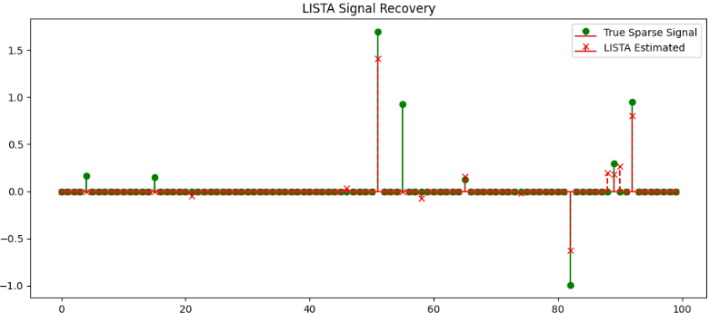

LISTA（Learned Iterative Shrinkage-Thresholding Algorithm）の基礎理論は、一言で言えば **「数学的な最適化アルゴリズムを、ニューラルネットワークの形に焼き直したもの」** です。

1980年代からある数学の知恵と、現代のディープラーニングを融合させたこの理論には、4つの柱があります。

## LISTAの理論

### 1. 根底にある問題：スパース符号化

LISTAが解こうとしているのは、次のような数学の問題（**L1正則化最小二乗法**、通称 **Lasso**）です。

$$
\min_{x} \frac{1}{2} \|y - Dx\|_2^2 + \lambda \|x\|_1
$$

* $y$: 観測されたデータ（例：キズ混じりの画像データ）
* $D$: 辞書行列（背景のパターンなど、データを構成する要素の集まり）
* $x$: 求めたいスパース信号（例：どこにキズがあるかを示すトゲトゲした信号）
* $\lambda$: スパース性をどれくらい重視するかの重み

この式は、 **「データをなるべく再現しつつ（第1項）、かつ結果をなるべくスカスカ（スパース）にする（第2項）」** というトレードオフを解いています。

#### $D$ の素性

__1. なぜ $D$ が「背景」になるのか？__

結論から言うと、 **「辞書 $D$（パーツ集）」を「指示書 $x$（どのパーツを使うか）」に従って組み立てた結果が「背景」になるから** です。

* $D$ (Dictionary) ：背景を構成する「部品（パーツ）」のカタログ。
* $x$ (Sparse Code) ：そのカタログの「何ページ目のパーツを、どれくらい使うか」という指示書。

モデル（LISTAなど）は、入力画像を見て **「この画像の中から背景っぽさを再現するために、の中のどの部品を組み合わせればいいか？」** を計算し、その結果を  に書き込みます。

したがって、 **$D \times x$（部品 $\times$ 指示書）を計算すると、「背景を再現した画像」が出来上がります。**

__2. （スパース信号）とは具体的に何？__

$x$ は、辞書の各パーツに対応した数値が並んだベクトルです。
「スパース（スカスカ）」と言われる理由は、 **「背景を再現するのに、辞書にある全てのパーツを使う必要はなく、ごく一部のパーツだけ選べば十分である」** という前提があるからです。

* **正常な場所**: 背景パーツ $D$ をいくつか選べば（$x$ に値が入れば）、完璧に再現できる。
* **異常（キズ）がある場所**: 手持ちの背景パーツ $D$ をどう組み合わせても、キズの形は作れない。そのため、その場所を無理やり再現しようとしても、指示書 $x$ には適切な値が入らない（または誤差が出る）。

__3.  $x$ が「トゲトゲした信号」と呼ばれる理由__

これは、信号処理のグラフをイメージすると分かりやすいです。

* ほとんどの要素が **0**（そのパーツは使わない）。
* 特定の要素だけが **大きな値**（そのパーツを使う！）。

このグラフを描くと、0の平坦な線の中に、時々鋭い値が立ち上がっているように見えるため、 **「トゲトゲした信号（Spiky Signal）」** と呼ばれます。

__4.  の関係（異常検知の全体像）__

ここで、今までお話ししてきた要素をすべて合体させます。
観測した画像 $y$ は、以下のように分解されます。

$$
y = \underbrace{D x}_{\text{背景 (Low-Rank)}} + \underbrace{S}_{\text{キズ (Sparse)}}
$$

1. $Dx$（背景）: 辞書 $D$ と指示書 $x$ によって作られた「いつもの綺麗な背景」。
2. $S$（キズ）: $Dx$ ではどうしても再現できなかった、入力画像 $y$ との「差分」。

**ここで混乱しやすいポイントの整理：**
実は、モデルの設計によって「どちらを  と呼ぶか」が異なる場合があります。

* **LISTAの場合**: 一般的に $x$ は「背景を構成するための係数」を指します。
* **RPCA（行列分解）の場合**: 分解された後の「キズそのもの（差分）」を $S$ (Sparse component) と呼び、これがトゲトゲした異常成分となります。

__まとめ__

* **$Dx$ が背景な理由**: 背景用パーツ集（$D$）から必要なものを選んで（$x$）、組み立てたものが背景だから。
* **$x$ とは**: 背景を組み立てるための「部品の選択リスト」。
* **異常検知の仕組み**: 「背景パーツだけ（$Dx$）では、キズは描けない。描けずに残ったカスが異常（$S$）だ！」と判断する。

「背景パーツだけ（$Dx$）では、キズは描けない。描けずに残ったカスが異常（$S$）だ！」と判断する。


### 2. 古典的解法：ISTA（設計図）

この問題を解くための伝統的なアルゴリズムが **ISTA** です。次のような「反復式」で計算します。

$$
x_{k+1} = \eta_{\theta} (x_k + \frac{1}{L} D^T (y - Dx_k))
$$

* $\eta_{\theta}$: ソフトしきい値関数（小さい値をゼロにする）
* $1/L$: ステップサイズ（学習率のようなもの）

これは、 **「今の予測で足りない分（残差）を計算し、少しだけ修正して、しきい値でノイズを削る」** という作業を、正解にたどり着くまで何十回も繰り返す手法です。


### 3. 深層展開：LISTAへの進化

2010年、GregorとLeCun（ディープラーニングの父の一人）は、 **「ISTAの  回の反復を、 個の層を持つニューラルネットワークと見なせばいい」** と考えました。

これが **LISTA** です。数式を以下のように書き換えます。

$$
x_{k+1} = \eta_{\theta_k} (W_{1,k} y + W_{2,k} x_k)
$$

#### 従来のISTAとの決定的な違い：

1. 重みの学習化: 数学的に決まっていた $D^T$ や $1/L$ を、学習可能な行列 $W_1, W_2$ に置き換えた。
2. しきい値の学習化: 固定値だった $\theta$ を、各層ごとに最適な値 $\theta_k$ に学習させるようにした。
3. **計算効率の劇的向上**: ISTAが100回計算するところを、LISTAは最適な重みを学習しているため、**わずか5〜10層（5〜10回の計算）**で同等以上の精度を出せる。


### 4. なぜこの理論がすごいのか？（誘導バイアス）

通常のニューラルネットワーク（CNNなど）は、「なぜその結果になったか」がブラックボックスになりがちです。

しかし、LISTAは **「スパース信号を復元する」という明確な数学的構造（誘導バイアス）** をネットワークの形に持っています。

* **構造は数学**: 仕組みが数式に基づいているので、動作が予測しやすい。
* **中身はAI**: 係数はデータから学習するので、現場のデータに最適化される。

### まとめ

LISTAの基礎理論とは、 **「最適化アルゴリズムの手順をAIのレイヤーに翻訳し、データに合わせてその手順のパラメータを最適化する」** という考え方です。

1. **問題設定**: $y \approx Dx$（スパース復元）
2. **手順の雛形**: ISTAの反復式
3. **ネットワーク化**: 各反復を層にし、パラメータを学習可能にする

この理論があるおかげで、少ない計算量で、複雑な背景からキズだけを抜き出すといった高度な処理が可能になっています。


## LISTAのデモ

このデモで行ったのは、  **「ノイズ混じりのぐちゃぐちゃなデータ（観測信号）から、その背後に隠れている『本質的なトゲ（スパース信号）』を、AIが数学の解法を真似して探し出す」** という実験です。

このコードで体験できる「LISTAのすごさ」
数式がネットワークになっている: forward 関数の中の for ループが ISTA の反復計算（＝層）です。

しきい値 theta の自動調整: 各層（反復ステップ）ごとに、AIが「このステップではこれくらい削るのがベストだ」というしきい値を学習しています。

高速な復元: layers=8 というわずか8回の計算で、100次元の複雑なスパース信号をかなり正確に言い当てていることがグラフで確認できるはずです。

```python
import torch
import torch.nn as nn
import torch.nn.functional as F
import torch.optim as optim
import matplotlib.pyplot as plt

# 1. LISTA モデルの定義
class LISTA(nn.Module):
    def __init__(self, input_dim, hidden_dim, layers=5):
        super(LISTA, self).__init__()
        self.layers = layers
        # ISTAの数式: S = soft_threshold(S + W(M - DS))
        # LISTAではこれを簡略化した S = soft_threshold(We * M + S * S_matrix) 等の形式も使われますが
        # ここでは基本に忠実な展開を行います
        self.W = nn.Parameter(torch.randn(layers, hidden_dim, input_dim) * 0.1)
        self.S = nn.Parameter(torch.randn(layers, hidden_dim, hidden_dim) * 0.1)
        self.theta = nn.Parameter(torch.ones(layers, hidden_dim) * 0.01)

    def soft_threshold(self, x, theta):
        # 負の値を softplus で正に変換してからしきい値として使用
        t = F.softplus(theta)
        return torch.sign(x) * torch.relu(torch.abs(x) - t)

    def forward(self, M):
        # M: [batch, input_dim] (観測信号)
        # S: [batch, hidden_dim] (推定されるスパース信号)
        batch_size = M.size(0)
        S = torch.zeros(batch_size, self.S.size(-1)).to(M.device)
    
        for i in range(self.layers):
            # ISTAのステップを層として実行
            # S = soft_threshold(We * M + S_matrix * S, theta)
            z = F.linear(M, self.W[i]) + F.linear(S, self.S[i])
            S = self.soft_threshold(z, self.theta[i])
        
        return S

# 2. データの生成 (スパースな信号を合成)
input_dim = 50
hidden_dim = 100
n_samples = 1000

# 辞書行列 D (ランダム)
D = torch.randn(input_dim, hidden_dim)

# 真のスパース信号 S_true (10%だけ値がある)
S_true = (torch.randn(n_samples, hidden_dim) * (torch.rand(n_samples, hidden_dim) < 0.1).float())

# 観測信号 M = D * S_true
M = torch.matmul(S_true, D.t()) + torch.randn(n_samples, input_dim) * 0.01 # ノイズあり

# 3. 学習の設定
device = torch.device("cuda" if torch.cuda.is_available() else "cpu")
model = LISTA(input_dim, hidden_dim, layers=8).to(device)
optimizer = optim.Adam(model.parameters(), lr=0.005)
criterion = nn.MSELoss()

# 4. トレーニング
M, S_true = M.to(device), S_true.to(device)
print("Training LISTA...")
for epoch in range(200):
    optimizer.zero_grad()
    S_pred = model(M)
    loss = criterion(S_pred, S_true) # 教師あり学習：真のスパース信号に近づける
    loss.backward()
    optimizer.step()
  
    if epoch % 40 == 0:
        print(f"Epoch {epoch}, Loss: {loss.item():.6f}")

# 5. 結果の可視化
model.eval()
with torch.no_grad():
    sample_idx = 0
    S_pred_sample = model(M[sample_idx:sample_idx+1]).cpu().numpy().flatten()
    S_true_sample = S_true[sample_idx].cpu().numpy().flatten()

plt.figure(figsize=(12, 5))
plt.stem(S_true_sample, linefmt='g-', markerfmt='go', label='True Sparse Signal')
plt.stem(S_pred_sample, linefmt='r--', markerfmt='rx', label='LISTA Estimated')
plt.title("LISTA Signal Recovery")
plt.legend()
plt.show()

```


