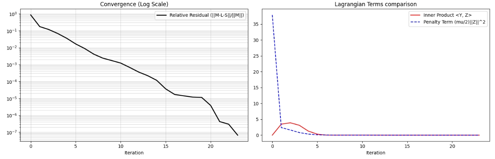

**IALM (Inexact Augmented Lagrange Multiplier method)** は、RPCA（Robust PCA）を解くためのアルゴリズムの中で、現在最も標準的かつ高速なものの一つです。

前のターンで触れた「背景 **$L$** と異常 **$S$** を交互に更新する」仕組みを、より厳密かつ効率的に数学へ落とし込んだものです。

---

### 1. なぜ「Augmented（拡張）」なのか？

通常のラグランジュ未定乗数法に、 **「ペナルティ項（2次項）」** を加えたのが「拡張ラグランジュ法」です。

RPCAの目的関数は本来以下の通りです：

$$
\min_{L, S} \|L\|_* + \lambda \|S\|_1 \quad \text{subject to } M = L + S
$$

1. M (Measurement / Observation)：
 
観測行列 **「私たちが手にしている、加工前の生データ」** です。

中身: 例えば、ある工場のラインを流れる製品の「連続した画像」や、監視カメラの「動画フレーム」を行列として並べたものです。状態: この $M$ の中には、正常な背景と、時折混入する **異常（キズや異物）** が渾然一体となって含まれています。

2. L (Low-rank matrix)：
 
低ランク行列（背景） **「データ全体に共通する、安定したパターン」** です。

役割: 画像でいうところの「動かない背景」や「製品の正常な質感」を担います。数学的性質: $\|L\|_*$（核ノルム）を最小化するということは、行列のランクを低くすることを意味します。これは、 **「背景は常に似たような情報の繰り返しである」** という性質を利用して、ノイズや突発的な変化を削ぎ落とした「理想的な正常画像」を作るステップです。イメージ: 100枚の画像があっても、背景が同じなら、実質的な情報の種類（ランク）はごくわずかである、という考え方です。

3. S (Sparse matrix)：

スパース行列（異常） **「背景では説明できない、突発的でまばらな変化」** です。

役割: これこそが私たちが探している **「異常（キズ、汚れ、異物）」** そのものです。数学的性質: $\|S\|_1$（L1ノルム）を最小化するということは、行列の要素のほとんどを 0 にすることを意味します。これは、 **「異常は画面のほんの一部にしか現れない」** という性質を利用して、背景から浮いたトゲのような成分だけを抽出するステップです。イメージ: 真っ黒な画面（値が0）の中に、異常がある場所だけが白く光っている（値を持つ）状態です。

これに「ルールを破った時のペナルティ（L2誤差）」を加えた式（拡張ラグランジュ関数）を最適化します。

$$
\mathcal{L}(L, S, Y, \mu) = \|L\|_* + \lambda \|S\|_1 + \langle Y, M - L - S \rangle + \frac{\mu}{2} \|M - L - S\|_F^2
$$

* **$Y$** : ルールのズレを監視する重み（ラグランジュ乗数）。
* **$\mu$** : ペナルティの強さを決めるパラメータ。
* **$\| \cdot \|_F^2$** : **$L+S$** が **$M$** からズレているほど、大きな罰を与える項。

>$\langle Y, M - L - S \rangle$  
>専門用語では、この $Y$ をラグランジュ乗数と呼びます。
>1. 「ズレ」に対するペナルティの方向を決める  
>RPCAには $M = L + S$ という絶対のルール（制約）があります。
>しかし、計算の途中段階ではどうしても $M - L - S$ という「ズレ（残差）」が生じてしまいます。
>この項は、そのズレと重み $Y$ を掛け合わせることで、「どの方向にどれくらいズレているか」を評価します。これがあることで、アルゴリズムは「今は $L$ と $S$ を足しても $M$ に足りないから、次はもっと増やそう」といった微調整の方向を判断できるようになります。  
>2. 「累積する反省」の役割  
>IALMなどのアルゴリズムを回す際、この $Y$ はステップごとに以下のように更新されます。
>$$Y_{new} = Y_{old} + \mu (M - L - S)$$
>これは、 **「これまでのループで解消できなかったズレを $Y$ に貯めていく」** という作業です。
>ズレがずっと放置されていると、$Y$ の値がどんどん大きくなります。すると、数式全体の値を最小化しようとする際、この項の影響力が強まり、アルゴリズムは「何としてもこのズレを解消しなければならない！」と強制的に $L$ と $S$ を $M$ に近づけるよう動きます。


### 2. IALM の「Inexact（非厳密）」とは？

IALMの最大の特徴はこの「Inexact（非厳密）」という点にあります。

本来、上記の関数を解くには、**$L$** と **$S$** をそれぞれ何度も更新して完全に収束させてから、次のステップに進む必要があります。しかし、IALMは **「**$L$ を1回、**$S$** を1回だけ更新して、すぐに次のループ（**$\mu$** や **$Y$** の更新）に進んでしまう」**という大胆な戦略をとります。

* **メリット** : 計算量が劇的に減ります。
* **驚きの結果** : 数学的に、このように「不真面目（非厳密）」に計算しても、最終的には正しい最適解に収束することが証明されています。

---

### 3. アルゴリズムの具体的な計算ステップ

1回のループ（Iteration）で行われることは、驚くほどシンプルです。

1. $L$（背景）の更新:
   $M - S_k + \mu_k^{-1} Y_k$ という行列を SVT（特異値しきい値演算） にかけます。
   これにより、背景が持つべき「低ランクな骨組み」を抜き出します。
2. $S$（異常）の更新:
   $M - L_{k+1} + \mu_k^{-1} Y_k$ という行列を ソフトしきい値演算 にかけます。
   これにより、背景で説明できなかった「スパースなトゲ」を抜き出します。
3. $Y$（ズレの監視役）の更新:
   今のズレ $M - L - S$ を $Y$ に足し合わせます。次の回では、このズレを解消するように強い力が働きます。
4. $\mu$（ペナルティの重み）の更新:
   $\mu$ を少しずつ大きくしていきます。これにより、最初は緩やかに、最後は厳格に $M = L + S$ というルールを守らせます。

---

### 4. なぜ異常検知で IALM が好まれるのか？

* **圧倒的な速さ** : 1枚の大きな画像や、数百枚の動画フレームを数秒〜数十秒で分解できます。
* **パラメータ調整が楽** : 基本的に **$\mu$** の増やし方などの標準設定が決まっているため、ユーザーが細かくチューニングしなくても高い精度が出ます。
* **数学的な安心感** : 理論的に収束が保証されているため、アルゴリズムが暴走してデタラメな結果を出すことがほとんどありません。

---

### まとめ

IALMとは、 **「背景（SVT）と異常（しきい値）の抽出を、1回ずつ交代でクイックに行いながら、最終的なつじつまを合わせる高速計算術」** です。

あなたがこれまで見てきた「深層展開（Deep Unfolding）」のネットワークも、実はこの IALM のステップを層として積み重ね、**$\mu$** や **$\lambda$** をAIに学習させているものが多いです。

## 実装

```python

```



