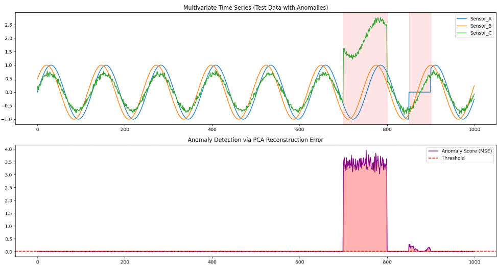

時系列データに対してPCAを用いた異常検知を行う手法について説明します。

まず、時系列データにおけるPCAの役割は、複数のセンサーや多次元の指標から **「正常時の相関関係（動きのパターン）」** を抽出し、そこから外れた動きを検知することです。

主に以下の2つのアプローチで活用されます。

### 1. 多変量時系列データの相関異常検知

複数のセンサー（例：工場の温度、圧力、振動数など）が同時に動いている場合、PCAはそれらの**変数間の関係性**を学習します。

* **仕組み**: 正常なデータから主成分を求め、「正常な空間（主成分部分空間）」を作ります。
* **異常の定義**: 新しいデータが入力された際、そのデータが「正常な空間」からどれだけはみ出しているかを計算します。
* **指標**: 一般的に**SPE（Q統計量）**や**統計量**が使われます。
* **SPE (Squared Prediction Error)**: PCAで復元できなかった残差。センサー間の相関が崩れたときに跳ね上がります。
* ****: 主成分空間内での変動。相関は保たれているが、値そのものが大きく変動したときに反応します。

### 2. 単変量時系列の「形」の異常検知（スライディングウィンドウ）

センサーが1つしかない場合でも、PCAを使って「波形のパターン」の異常を見つけることができます。

* **仕組み**:
1. 時系列データを一定の長さ（ウィンドウ）で切り出し、それをベクトル（1つのデータ点）として扱います。
2. これをずらしながら大量の「波形ベクトル」を作り、PCAを適用します。

* **効果**: PCAは「よくある波形の形」を学習します。突発的なノイズや、普段とは違う周期の動きが現れると、再構成誤差が大きくなり異常として検知できます。

### 画像処理（RPCANet）との共通点

あなたが先ほどまで実装していた **RPCANet（Deep Unfolding RPCA）** も、実は時系列データに応用可能です。

* **低ランク成分 ($L$):** 季節性や長期的なトレンド、複数の変数が連動する「いつもの動き」。
* **スパース成分 ($S$):** 突発的なスパイクノイズや、短期間のシステム故障、サイバー攻撃などによる「急激な変化」。

画像における「キズ」を  で抽出したのと全く同じ論理で、時系列データの「スパイク」を  として抽出できます。

### 実装時の注意点

PCAを時系列に使う際のハードルは **「非定常性（時間の経過とともにデータの性質が変わること）」** です。

* **対策**: 常に最新のデータでPCAの主成分を更新し続ける「逐次PCA (Incremental PCA)」や、移動窓を用いる手法が一般的です。

## 時系列異常検知
PCA（主成分分析）を用いた時系列異常検知の核となる考え方は、 **「データの『いつもの相関関係』が壊れた瞬間を見つける」** というものです。

具体的にどのようなステップで異常をあぶり出しているのか、順を追って解説します。

### 1. 「正常な世界」のルールを学習する

多変量の時系列データ（例：3つのセンサー）があるとき、正常な状態では変数同士が連動して動いていることが多いです（例：温度が上がれば圧力が上がる）。

PCAは、この連動している方向（**主成分軸**）を見つけ出します。

* **主成分空間**: データが最もよく動く「主要な通り道」。
* **残差空間**: 普段はほとんどデータが存在しない「ノイズ程度の動き」しかない場所。

### 2. 低次元に凝縮して、また戻す（再構成）

ここが検知のポイントです。PCAモデルにデータを通すと、以下の処理が行われます。

1. **圧縮（射影）**: 入力データを、学習した数個の主成分だけで表現します。
2. **復元（再構成）**: その圧縮された情報から、元の多次元データに戻そうと試みます。

このとき、 **「正常なルールに従っているデータ」** は、少ない主成分だけでも元の形をほぼ完璧に復元できます。

### 3. 「復元できなかった差分」を異常とする

もし「いつもと違う動き（異常）」が含まれるデータが入力されると、PCAが学習したルール（主成分軸）から大きく外れた位置にプロットされます。

* **正常なデータ**: 主成分のルールに乗っているので、復元した結果と元の値がほぼ一致する。
* **異常なデータ**: ルールから外れているため、主成分空間に無理やり押し込んで復元しても、**元の値とは似ても似つかないもの**になります。

この **「元の値」と「復元された値」のズレ（再構成誤差）** が、先ほどのコードで計算した「異常スコア」の正体です。

### 直感的なイメージ：すり抜けテスト

これを例えるなら、 **「特定の形の穴（主成分）が開いた板」** のようなものです。

* **正常なデータ**: 穴と同じ形をしているので、板をスッと通り抜けます（再構成誤差が小さい）。
* **異常なデータ**: 形が歪んでいるため、穴に引っかかって通り抜けられません。この「引っかかり」がエラーとして検知されるのです。

### まとめると

PCAは時系列の「値そのもの」だけを見ているのではなく、 **「複数の変数が作り出す空間的なバランス（構造）」** を見ています。

1. **正常時**: A, B, C のバランスが良い  再構成できる  スコア低
2. **異常時**: A だけが勝手な動きをする  バランスが崩れる  再構成できない  **スコア高！**

このようにして、たとえ値が正常範囲内であっても「組み合わせとしておかしい」動きを検知できるのがPCAの強みです。

この「再構成して差分を見る」という考え方は、実はあなたが最初に取り組んでいた **LISTA（深層展開）の （入力 － 低ランク ＝ スパース）** という構造と全く同じ原理に基づいています。

## 実験

