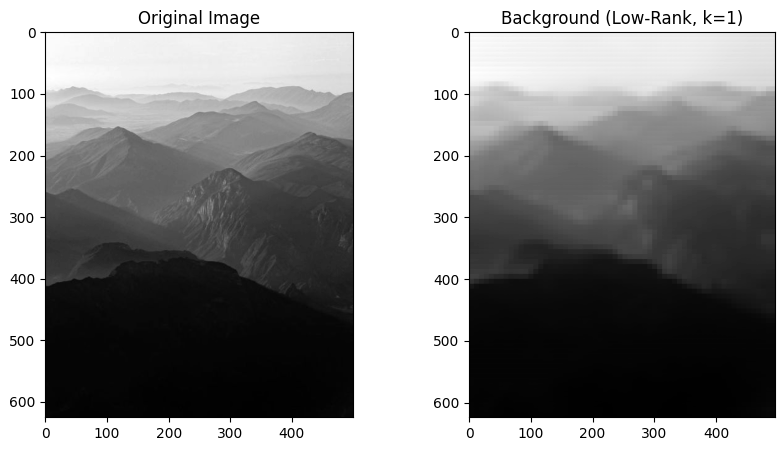

本質から順を追って説明します。
RPCANet やその元になっている **RPCA（Robust PCA）型の行列分解が「なぜ背景と異常を分離できるのか」** は、統計的仮定と最適化目的が明確に定義されています。


## 1. 基本仮定（これがすべて）

RPCA 系手法は、入力データ ( X ) に対して次の **生成モデル仮定** を置きます。

$$
\boxed{
X = L + S
}
$$

* ( L )：**低ランク成分（背景・正常）**
* ( S )：**スパース成分（異常・欠陥・小物体）**

この分解が可能であるための暗黙的仮定は以下です。

### 仮定1：背景は「低ランク」

* 背景は

  * 空間的に滑らか
  * 時間・サンプル間で強く相関
  * 見た目の自由度が低い
* 結果として **線形部分空間に近い** → 行列ランクが小さい

__低ランクとは?__

画像において「滑らか」とは
- 隣り合う画素値が大きく変化しない
- 急峻なエッジや高周波成分が少ない

数学的には **低周波成分が支配的ということ** になります。

フーリエ的に見ると：
- 背景：低周波が多い
- 異常：高周波が多い

低周波成分は 少数の基底で表現できます。


$$
x \approx \sum_{k=1}^{r} a_k \phi_k \quad (r \ll N)
$$

→ **自由度が低い**


画像を列ベクトルとして並べた行列 (X) を考えると：

* 各画像は似た低周波構造
* 列同士が線形結合で表せる

$$
\Rightarrow \text{rank}(X) \text{ が小さい}
$$

__2. 「時間・サンプル間で強く相関」とは何か__

これは **「同じような背景が何度も出てくる」** という意味です。

__動画の場合__

* 背景はほぼ固定
* 動くのは異物だけ

__画像集合の場合__

* 製品の外観はほぼ同じ
* 欠陥だけが違う

数学的に解釈してみます。複数サンプルを並べると：

$$
X = [x_1, x_2, \dots, x_n]
$$

背景成分 (L) は：

$$
x_i \approx U c_i
$$

* (U)：共通基底（少数）
* (c_i)：係数

つまり **すべてのサンプルが同じ低次元部分空間に乗っている**。

相関が強いほど：

* 列ベクトルが似る
* 独立次元が減る

$$
\Rightarrow \text{rank}(L) \ll \min(HW, N)
$$

__3. 「見た目の自由度が低い」とは何か__


「自由度が低い」とは：

> **見た目を決める独立パラメータが少ない**

という意味です。

具体的に言うと、画像が背景だった場合画像の情報は
* 明るさ
* 位置
* わずかな照明変動
→ 数個のパラメータで決まる


自由度が高い情報にあたる異常の場合
* 形状
* 位置
* 向き
* サイズ
* テクスチャ

→ 組合せ爆発 = 自由度が高いということになる。

次元削減の観点としていうと。
背景画像集合を PCA にかけると：

* 第1〜数成分でほぼ再構成可能
* 以降の成分はノイズ

これは：

$$
\text{Intrinsic Dimension} \ll \text{Ambient Dimension}
$$


### 仮定2：異常は「スパース」

* 異常は

  * 出現頻度が低い → 画像の中の出現頻度が背景に対して少数です
  * 画素数が少ない → 上と同じ意味です
  * 位置が不規則 → 背景に比べて突発的に出てくることになります。
* 結果として **画素空間で疎**（L1 正則化に向く）

この 2 つの仮定が成立するときのみ、分離が理論的に可能になります。


## 2. 古典 RPCA の最適化問題

古典的 RPCA は次の凸最適化として定式化されます。

$$
\min_{L,S}
;; |L|_* + \lambda |S|_1
\quad
\text{s.t.}
\quad
X = L + S
$$

* ( |L|_* )：核ノルム（＝ランク最小化の凸緩和）
* ( |S|_1 )：L1 ノルム（＝スパース性誘導）
* ( \lambda )：低ランク vs スパースのトレードオフ

### ロジック

| 項     | 役割                           |
| ----- | ---------------------------- |
| 核ノルム  | 「できるだけ少数の基底で説明できる構造」を背景に押し込む |
| L1ノルム | 「どうしても説明できない局所的ズレ」を異常に押し出す   |

つまり、

> **「全体的・一貫した構造」＝ 背景
> 「局所的・説明困難な残差」＝ 異常**

という役割分担を、数式的に強制しているだけです。


## 3. RPCANet は何を学習しているのか？

### 3.1 RPCA の「最適化過程」をネットワーク化

RPCANet は RPCA の反復解法（例：ISTA / ADMM）を **unrolling** したモデルです。

$$
\text{Iteration} \Rightarrow \text{Network Layer}
$$

各ステージでは概念的に次を行っています。

1. 背景候補 ( L_k ) を更新
2. 残差からスパース成分 ( S_k ) を抽出
3. 次ステージへ伝播

このとき、

* しきい値
* フィルタ
* 重み行列

を **データ駆動で最適化**しています。


### 3.2 学習によって起きていること（直感）

正常データのみで学習すると：

* ネットワークは
  **「よく出現する構造」を L に吸収する**ようになる
* それ以外の構造は
  **S に押し出される**ようにパラメータが調整される

結果として：

* L：正常背景の manifold
* S：その manifold から外れた成分

という分離が成立します。


## 4. なぜ「異常ラベルなし」で検出できるのか？

重要な点です。

### 4.1 異常を直接「学習」していない

異常検出は分類ではありません。

* 学習：**正常分布の表現学習**
* 推論：**再構成できなかった部分を異常とみなす**


### 4.2 異常スコアの正体

典型的には：

$$
\text{Anomaly Score}(x)
=======================

| S(x) |_1
\quad \text{or} \quad
| X - L(x) |
$$

これは：

* 「この画素（領域）は背景モデルで説明できない」
* 「通常の低ランク構造に属さない」

という **逸脱度の測定**です。


## 5. どんな異常が検出でき、できないか

### 検出できる異常

* 小さく局所的
* 出現頻度が低い
* 正常と構造的に異なる

例：

* 表面欠陥
* 微小異物
* 突発的ノイズ
* 小ターゲット


### 検出が難しい異常

* 面積が大きい異常
* 頻繁に出現する異常
* 正常と似た統計構造

例：

* 大きな汚れ
* 繰り返し現れる欠陥
* 正常クラスの一部に見える異常

これは **低ランク仮定が崩れる**ためです。


## 6. AutoEncoder との違い（重要）

| 観点    | RPCA / RPCANet | AutoEncoder  |
| ----- | -------------- | ------------ |
| モデル仮定 | 低ランク + スパース    | 非線形 manifold |
| 異常の表現 | 明示的（S）         | 暗黙的（再構成誤差）   |
| 小異常検出 | 強い             | 弱くなりがち       |
| 解釈性   | 高い             | 低い           |

RPCANet は **「異常をどこに押し出すか」** が構造的に定義されている点が最大の特徴です。


## 7. まとめ（核心）

行列分解型異常検出のロジックは、次の一文に集約できます。

> **データの大部分を説明できる低自由度構造を背景とみなし、それで説明できない局所的成分を異常として分離する**

RPCANet は、この原理を **深層学習で高次元・非線形化した実装**です。


Lowランクにあたる背景画像を、元画像より切り出した場合以下のようになる。




## 基底の分離

SVD（特異値分解）が画像を「低ランク（背景）」と「特異値」に分離する仕組みは、数学的には **「画像を、特徴の重要度順に並んだ小さなパーツの足し算に分解する」** という作業を行っています。
行列（今回の場合は画像パッチの集まり）を  $A$  とすると、SVDは次のように分解します。

それぞれの行列が持つ意味を、画像処理の観点から解説します。
$$A = U \Sigma V^T$$

### 1. 各行列の役割

- **$U$(左特異ベクトル):** 画像の**「垂直方向のパターン」**（基底）を表します。
- **$\Sigma$ (特異値):** 各パターンの**「重要度（強さ）」**を表す対角行列です。値は大きい順に並んでいます。
- **$V^T$(右特異ベクトル):** 画像の**「水平方向のパターン」**（基底）を表します。

### 2. 「低ランク」とは何か？

画像パッチを行列として並べたとき、 **「背景」のようにすべてのパッチに共通して含まれる成分** は、数学的に「相関が強い」状態になります。

1. **情報の圧縮:** 背景はどこを切っても似たような見た目（空、地面、壁など）であるため、少ない情報（低いランク）で表現できます。
2. **特異値の選別:** 特異値  のうち、非常に大きな値を持つ最初の数個（例えば ）だけを使うと、画像の中の「最も支配的で共通した構造」＝**背景**だけが抽出されます。
3. **ノイズ・動体の除去:** 小さな特異値に対応する成分には、動いている物体や細かいノイズが含まれます。これらを切り捨てることで、低ランクな背景画像が浮かび上がります。


### 3. 直感的なイメージ：スタンプの重ね合わせ

画像を再現するプロセスを「スタンプ」に例えると分かりやすいです。

* **ランク1（$k=1$）:** 最も大きな特徴を持つ巨大なスタンプを1回押した状態。これが「背景」です。
* **ランクを上げる:** さらに細部のスタンプを重ねていくことで、動いている人や木々の揺れなどの「細かい変化」が再現されます。

### 4. あなたのコードで行っていること

```python
# k=1（低ランク1）で再構成
low_rank_patches = (U[:, :k] * S[:k]) @ Vt[:k, :]

```

この一行は、 **「一番重要度が高い（特異値が大きい）成分だけを取り出し、それ以外（前景やノイズ）をすべてゼロにして捨てなさい」** という命令です。

その結果、出力される画像からは一時的な変化（動体）が消え、安定して存在している「背景」だけが残る仕組みになっています。


