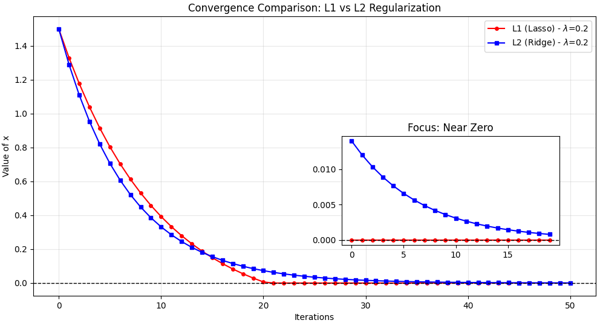

異常検知や機械学習の数式（特に行列分解やRDL）において、 **L1正則化とL2正則化は「データの削り方（ペナルティの与え方）」の違い** を意味します。

これらは、モデルが学習しすぎたり（過学習）、複雑になりすぎたりするのを防ぐ「重石（おもし）」の役割を果たしますが、その「重石の形」によって結果が大きく変わります。

---

### 1. L2正則化（リッジ回帰）

**「値を全体的に、なめらかに小さくする」**のが得意です。

* **計算方法**: 各要素の**2乗**を足し合わせます（$\|x\|_2^2 = x_1^2 + x_2^2 + \dots$）。。
* **特徴**:
* 大きな値を嫌い、全体的に値を小さく抑えようとします。
* しかし、値を**完全に 0 にすることはほとんどありません**。
* 結果として、全ての要素が「小さくて均一な値」を持つようになります。


* **イメージ**: **「みんな少しずつ遠慮して、全体的に大人しくしてね」**という全体主義的なルールです。

---

### 2. L1正則化（Lasso回帰）

**「不要なものをバッサリ切り捨て、0 にする」**のが得意です。これが**スパース性**を生みます。

* **計算方法**: 各要素の**絶対値**を足し合わせます（$\|x\|_1 = |x_1| + |x_2| + \dots$）。
* **特徴**:
* 「重要でない」と判断した要素を**完全に 0** にします。
* 本当に重要な少数の要素だけが、値を持ち（トゲとして立ち）ます。


* **イメージ**: **「必要なやつだけ残れ、あとは全員クビだ！」**という少数精鋭のルールです。

---

### 3. なぜ異常検知で L1（スパース）が使われるのか？

これまでお話ししてきた $x$（背景の指示書） や $S$（異常） に L1正則化が使われるのは、まさにこの「0にする力」が必要だからです。

* ** に L1 を使う理由**:
背景を説明するのに、何千ものパーツ（$D$）を全部使うのではなく、「数個の主要なパーツだけでシンプルに説明させたい」からです。
* ** に L1 を使う理由**:
画像全体がキズだらけなわけではなく、「特定の数ピクセルだけが異常である」という状態を数学的に作り出したいからです。

---

### 4. 直感的な違いの比較表

| 項目 | L1正則化（Lasso） | L2正則化（Ridge） |
| --- | --- | --- |
| **数式** | 絶対値の和 $ | x |
| **効能** | **スパース化（0が増える）** | 平滑化（値が小さく揃う） |
| **役割** | 重要な特徴の選択 | 過学習の抑制・安定化 |
| **異常検知では** | **キズ（）の特定**に必須 | 背景のノイズを抑えるのに補助的に使う |

---

### 5. なぜ L1 は 0 になりやすいのか？（幾何学的な理由）

図で見ると分かりやすいのですが、L2正則化の制約範囲は「円」なのに対し、L1はカドのある「ひし形」をしています。
最適解を探す際、ひし形の**「カド（＝軸の上、つまり値が0の地点）」**にぶつかりやすいため、結果として多くの値が 0 に固定されるのです。

### まとめ

* **L2**：全体的に「シュッと」小さくする（なめらか）。
* **L1**：不要なものを「バサッと」削る（スカスカ＝スパース）。

RDLやLISTAで「異常を抜き出す」と言ったとき、その魔法の正体はこの **L1正則化（絶対値で削る力）** なのです。

この「0にする力」が、ISTAの式の中にある「ソフトしきい値関数」として具体的に実装されているのですが、数式のつながりは見えてきましたでしょうか？

次は、この L1 と L2 を組み合わせて、より高度に背景と異常を分ける手法（Elastic Netなど）について触れてみますか？

## L1が0になりやすい理由

L1正則化がなぜ値を「0」に引き込むのか、数学的な理由は主に**「微分の形（勾配）」**と**「幾何学的なカド」**の2点から説明できます。

特に、最適化アルゴリズム（ISTAなど）の視点で見ると非常に明快です。

---

### 1. 勾配（勢い）が一定であること

値を小さくしようとする「勢い（勾配）」の違いに注目してみましょう。

* L2正則化（$x^2$）の勾配:
$x^2$ を微分すると $2x$ です。つまり、値 $x$ が小さくなるにつれて、小さくしようとする勢いも弱まっていきます。
$x=0.01$ のとき、勢いは $0.02$ です。$x$ が 0 に近づくほど力は 0 に収束し、最終的に「限りなく 0 に近いが、0 にはならない場所」で止まってしまいます。
* L1正則化（$|x|$）の勾配:
$|x|$ を微分（正の範囲で）すると、常に $1$ です。
$x=100$ でも $x=0.01$ でも、0 に向かって押し戻そうとする力は常に一定です。
このため、微小な値になっても勢いが衰えず、そのまま 0 まで一気に押し切ってしまうのです。

---

### 2. 「ソフトしきい値関数」による完全な 0 化

ISTAの式を思い出すと、L1正則化を解くステップでは必ずソフトしきい値関数 $\eta_{\theta}(\cdot)$ が登場します。この関数の数学的な挙動が「0化」の正体です。

L1正則化（$|x|$）を含む最小化問題を解こうとすると、停留点（微分の合計が 0 になる点）は以下の条件を満たします：
「データとの誤差による勾配」が「L1の勾配（一定の $\lambda$）」よりも小さい場合、微分を 0 にできる唯一の点は $x=0$ しか存在しない。

これを視覚化したのが以下のグラフです。一定範囲（ から ）の入力に対して、**出力が完全に 0 になる「デッドゾーン」**が生まれます。

---

### 3. 幾何学的なカド（等高線）

よく教科書で説明される「ひし形」と「円」の図を数学的に解釈します。

* **目的**: 「データとのズレ（$L2$誤差）」と「正則化項」の合計を最小にしたい。
* **L2（円）**: 誤差の等高線が円に触れるとき、接点は軸の上（0の地点）である必要はありません。どこでも滑らかに接します。
* **L1（ひし形）**: 誤差の等高線が外側から広がってくるとき、**一番最初にぶつかるのは「ひし形の尖ったカド（＝軸の上）」である確率が非常に高い**のです。

数学的には、L1のノルム球（ひし形）は「非平滑（なめらかでない）」であり、そのカドにおいてスパースな解が選ばれやすいという性質を持っています。

---

### まとめ

1. **L1** は、値が小さくなっても **「0へ戻そうとする力（勾配）」が衰えない。**
2. その結果、ある閾値以下の値は **完全に 0 へと押し込まれる（デッドゾーン）。**
3. 幾何学的に、**「軸の上（値が0）」にあるカド**で最適解が見つかりやすい。

この「0へ押し切る力」があるからこそ、RDLやRPCANetは「無関係な背景パーツを捨て去り、本当に重要な異常だけを抽出する」ことができるのです。

## 実験

```python
import numpy as np
import matplotlib.pyplot as plt

def soft_threshold(x, lam):
    """L1正則化で使われる近接演算（ソフトしきい値）"""
    return np.sign(x) * np.maximum(np.abs(x) - lam, 0)

def l2_update(x, grad, lam, lr):
    """L2正則化（リッジ）の更新式"""
    # 勾配に 2*lam*x が加わる
    return x - lr * (grad + 2 * lam * x)

# パラメータ設定
initial_x = 1.5   # 初期値
target_x = 0.0    # データの勾配が 0 を指す地点（本来ここへ行きたい）
lr = 0.1          # 学習率
lam = 0.2         # 正則化の強さ
iterations = 50

# 履歴の保存
x_l1_hist = [initial_x]
x_l2_hist = [initial_x]

curr_x_l1 = initial_x
curr_x_l2 = initial_x

for i in range(iterations):
    # シンプルな2乗誤差の勾配 (x - target_x)
    grad_l1 = curr_x_l1 - target_x
    grad_l2 = curr_x_l2 - target_x
    
    # L1更新: 勾配降下した後にソフトしきい値を適用 (ISTAの基本形)
    curr_x_l1 = soft_threshold(curr_x_l1 - lr * grad_l1, lr * lam)
    
    # L2更新: 通常の勾配降下
    curr_x_l2 = l2_update(curr_x_l2, grad_l2, lam, lr)
    
    x_l1_hist.append(curr_x_l1)
    x_l2_hist.append(curr_x_l2)

# --- 可視化 ---
plt.figure(figsize=(12, 6))

# 収束プロット
plt.plot(x_l1_hist, 'o-', label=f'L1 (Lasso) - $\lambda$={lam}', color='red', markersize=4)
plt.plot(x_l2_hist, 's-', label=f'L2 (Ridge) - $\lambda$={lam}', color='blue', markersize=4)

plt.axhline(0, color='black', linewidth=1, linestyle='--')
plt.title("Convergence Comparison: L1 vs L2 Regularization")
plt.xlabel("Iterations")
plt.ylabel("Value of x")
plt.grid(True, alpha=0.3)
plt.legend()

# 拡大図（0付近の挙動）
plt.axes([0.55, 0.25, 0.3, 0.3])
plt.plot(x_l1_hist[-20:], 'o-', color='red', markersize=4)
plt.plot(x_l2_hist[-20:], 's-', color='blue', markersize=4)
plt.axhline(0, color='black', linewidth=1, linestyle='--')
plt.title("Focus: Near Zero")

plt.show()

```


