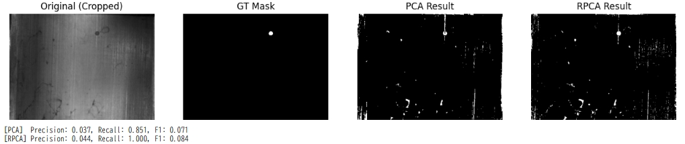

産業分野では、画像から何かしら異常が起きてないかを検知するという異常検知のタスクが相当数存在します。

今日はそんな異常検知の手法として代表的な手法であるRPCAについて説明します。

## 概要
RPCA (Robust Principal Component Analysis: ロバスト主成分分析) とは、一言で言えば、データ行列を **「安定した共通パターン（背景）」と「突発的な変化（異常・異物）」に、数学の力でパカッと分離する手法** です。

名前に「ロバスト（頑健）」と付いているのは、従来のPCA（主成分分析）が「大きな外れ値（異常）」に弱かったという弱点を克服した手法だからです。

1. 直感的なイメージ
 
監視カメラの映像を想像してください。
- 背景（L）: 動かない壁、床、ずっと点灯している照明。これらはどのフレームでも似たような情報の繰り返しです（低ランク性）。
- 動体（S）: たまに横切る不審者、床に落ちたゴミ、画面を横切るノイズ。これらは画面のごく一部にしか現れず、時間的にも一瞬です（スパース性）。

RPCAは、映像データ $M$ を入力すると、**「背景だけの映像 $L$」と「動体だけの映像 $S$」**に自動的に分解してくれます。

2. なぜ「ロバスト」なのか？（PCAとの違い）

従来のPCAは、最小二乗法（L2誤差）をベースにしています。

- PCAの弱点: データに1つでも極端な外れ値（大きなキズやフラッシュなど）が混ざると、主成分がその外れ値に引っ張られてしまい、正しい背景が作れなくなります。
- RPCAの強み: 「外れ値（$S$）」を最初から変数として分離するように設計されているため、大きな異常が含まれていても、それに惑わされずに正確な背景を抽出できるのです。


3. 数学的な「仕分け」のルール
 
RPCAは以下の2つのルールを同時に守りながら計算を行います。

- 背景 $L$ はシンプルであれ（低ランク制約）:行列のランクを低く保つ＝「繰り返しの多いデータ」にする。
- 異常 $S$ はまばらであれ（スパース制約）:非ゼロの要素を少なくする＝「画面のほとんどが 0（真っ黒）」にする。
 
この2つを足すと元のデータに戻る（$M = L + S$）というパズルの解を探すのが、RPCAという手法の本質です。


## 応用されている場所

1. ビデオ監視: 背景から歩行者や車両を抽出する。
2. 外観検査: 金属や布の一定の模様（背景）から、微細なキズ（スパース成分）をあぶり出す。
3. 顔画像処理: メガネや影（スパース成分）を取り除き、その人の本来の顔の骨格（低ランク成分）を復元する。
4. 医用画像: ノイズだらけのMRI画像から、本来の組織構造を取り出す。

## PCA VS RPCA

異常検知の手法としてはPCAに対して、改良されてものがRPCAになります。
実際どの程度の威力となるかを確認してみようと思います。

実験で期待される結果は以下通りです。

1. PCA: 異常（キズ）も含めて平均をとってしまうので、復元画像に「うっすらキズ」が再現されてしまい、引き算してもキズが消えかかってしまいます。→くっきりとした検出や、周囲と見分けが難しい異常が検出されづらい
2. RPCA: L1正則化の力で、最初から「キズはゴミ箱（$S$）へ、背景は箱（$L$）へ」と厳密に分けるため、復元された背景が非常にクリーンになり、検知精度が上がります。

実装のポイントについて説明します。

### 1. データ構造の構築 (行列 $M$ への変換)

画像は通常2次元（縦×横）ですが、RPCA（IALM）ではデータを1つの行列 $M$ として扱います。

```python
# (n_frames, size, size) の3次元配列を、(画素数, 枚数) の2次元行列に変換
M = np.array(frames).reshape(n_frames, -1).T
```

* **ポイント**: 1枚の画像を「1本の長いベクトル」に引き伸ばし、それを横に並べています。
* **理由**: こうすることで、 **「全画像で共通するパターン（背景）」が行列の低ランク成分** として数学的に扱いやすくなります。


### 2. IALMアルゴリズムの肝

RPCAはIALMというアルゴリズムで実装されます。
IALMはLとSを交互更新を行うことで、LとSの分離を行うという手法です。

#### A. 背景 $L$ の更新（低ランク化）

```python
L = svt(M - S + (1/mu) * Y, 1/mu)
```

* **処理**: 今のデータから「異常 $S$」を引いたものに対し、 **SVT（特異値しきい値演算）** を適用します。
* **意図**: ランク（情報の種類）を強制的に落とすことで、突発的な変化（キズ）を「背景」から追い出します。

#### B. 異常 $S$ の更新（スパース化）

```python
S = soft_threshold(M - L + (1/mu) * Y, lam/mu)
```

* **処理**: 今のデータから「背景 $L$」を引いた残差に対し、ソフトしきい値処理を適用します。
* **意図**: L1正則化の力で、微小なノイズを 0 にし、「大きなズレ（異常）」だけを $S$ に残します。

#### C. ラグランジュ乗数 $Y$ と $\mu$ の更新

```python
Y = Y + mu * (M - L - S) # ズレの蓄積
mu *= rho                # ペナルティの強化
```

* **意図**: ループの後半になるほど「$M = L + S$」という制約を厳しくし、正確に分解を完了させます。


### 3. PCA vs RPCA の比較ロジック

#### PCA の実装（Scikit-learn使用）

```python
pca = PCA(n_components=2)
L_pca_flat = pca.inverse_transform(pca.fit_transform(M.T)).T
```

* **仕組み**: データを「2つの主要な成分」だけで再現しようとします。
* **欠点**: PCAは $S$（異常）という逃げ道がないため、キズのデータも無理やり成分に含めてしまい、結果として背景 $L$ が汚れます。

#### RPCA の優位性

* **仕組み**: 最初から「背景 $L$」と「異常 $S$」の2つの席を用意しています。
* **利点**: キズは $S$ の席に座るため、背景 $L$ は純粋なまま保たれ、非常に高いコントラストで異常を分離できます。

```python
# --- 3. メイン処理 ---
# ファイルパス
img_path = '<傷のある画像ファイル>'
mask_path = '<マスクデータ>'

# 画像読み込み (ダミー生成コードは削除しました)
img = cv2.imread(img_path, cv2.IMREAD_GRAYSCALE) / 255.0
# マスクが0/1画像の場合、0より大きい場所をTrueとする
gt_mask_raw = cv2.imread(mask_path, cv2.IMREAD_GRAYSCALE)
gt_mask = gt_mask_raw > 0 

if img is None or gt_mask_raw is None:
    raise ValueError("画像の読み込みに失敗しました。パスを確認してください。")

patch_size = 8 * 4
M = image_to_patches(img, patch_size)

# PCA による検知 (同じインスタンスを使用)
pca_model = PCA(n_components=1)
low_rank_pca = pca_model.fit_transform(M.T)
L_pca_flat = pca_model.inverse_transform(low_rank_pca).T
S_pca_flat = np.abs(M - L_pca_flat)
S_pca_img = patches_to_image(S_pca_flat, img.shape, patch_size)

# RPCA による検知
L_rpca_flat, S_rpca_flat = ialm_rpca(M)
S_rpca_img = patches_to_image(np.abs(S_rpca_flat), img.shape, patch_size)

# --- サイズ調整 ---
h_res, w_res = S_pca_img.shape
gt_mask_cropped = gt_mask[:h_res, :w_res]

# 二値化マスクの作成 (閾値: 上位2%を異常とする)
thresh_pca = np.percentile(S_pca_img, 98)
mask_pca = S_pca_img > thresh_pca
thresh_rpca = np.percentile(S_rpca_img, 98)
mask_rpca = S_rpca_img > thresh_rpca

# --- 4. 評価 ---
def evaluate(gt, pred):
    p = precision_score(gt.flatten(), pred.flatten(), zero_division=0)
    r = recall_score(gt.flatten(), pred.flatten(), zero_division=0)
    f1 = f1_score(gt.flatten(), pred.flatten(), zero_division=0)
    return p, r, f1

p_pca, r_pca, f1_pca = evaluate(gt_mask_cropped, mask_pca)
p_rpca, r_rpca, f1_rpca = evaluate(gt_mask_cropped, mask_rpca)

# --- 5. 可視化 ---
titles = ["Original (Cropped)", "GT Mask", "PCA Result", "RPCA Result"]
imgs = [img[:h_res, :w_res], gt_mask_cropped, mask_pca, mask_rpca]

plt.figure(figsize=(16, 4))
for i in range(4):
    plt.subplot(1, 4, i+1)
    plt.imshow(imgs[i], cmap='gray')
    plt.title(titles[i])
    plt.axis('off')
plt.show()

print(f"[PCA]  Precision: {p_pca:.3f}, Recall: {r_pca:.3f}, F1: {f1_pca:.3f}")
print(f"[RPCA] Precision: {p_rpca:.3f}, Recall: {r_rpca:.3f}, F1: {f1_rpca:.3f}")

```

### 実験結果
上記コードで実際に異常検知してみました。

PrecisionとRecallで評価しましたが、どちらもRPCAが有利だったという結果です。

パラメータをより適切に選定することで検出精度はさらに向上します。

```
[PCA]  Precision: 0.037, Recall: 0.851, F1: 0.071
[RPCA] Precision: 0.044, Recall: 1.000, F1: 0.084
```



## 特異値分解が用いられる理由

IALM（Inexact Augmented Lagrange Multiplier）などの反復アルゴリズムの中で特異値分解（SVD）が頻繁に登場するのは、それが**「低ランク行列（Low-rank matrix）」を求めるための数学的に最も正しい唯一の手段**だからです。

理由は大きく分けて3点あります。

---

### 1. 「低ランク性」を数値化・操作できる唯一の方法

RPCA（）の目的は、背景画像などの「低ランクな成分 」を取り出すことです。

* 行列の「ランク（情報の複雑さ）」を最小化する問題は、数学的には非常に解きにくい（NP困難な）問題です。
* しかし、ランクの代わりに**「特異値の和（原子核ノルム / 核ノルム）」**を最小化することで、効率的に解けるようになることが証明されています。
* この「核ノルムの最小化」を実行するステップが、まさに**SVT（特異値しきい値演算）**であり、その計算のためにSVDが必要になります。

### 2. 「背景」と「ノイズ」の選別（フィルタリング）

SVDは、行列を「主要な特徴」と「微細な変動」に分解します。

* **大きな特異値**: 背景の質感や固定された模様など、画像の主要な構造（ 成分）。
* **小さな特異値**: わずかな変化や、一部のパッチにしか現れないノイズ。

IALMの反復計算の中でSVDを行い、小さな特異値を「しきい値処理（ソフトしきい値演算）」でゼロに削ることで、**「不要なノイズや異常を削ぎ落として、きれいな低ランク背景  だけを抽出する」**という操作を毎ステップ繰り返しているのです。

### 3. 行列の「最適な近似」を保証するため

数学の定理（エッカート・ヤングの定理）により、**「ある行列を、それより低いランクの行列で最も正確に近似（最小二乗誤差で近似）する方法は、SVDを行って上位の特異値だけ残すことである」**と決まっています。

IALMが「データの再現性を保ちつつ、背景を低ランクにする」という最適解に辿り着くためには、各ステップでSVDを用いて「今のベストな近似」を更新し続ける必要があるのです。

---

### イメージ図

SVDをIALMの中で使うのは、彫刻家が粗削りをする作業に似ています。

1. **SVDを実行**: 今の石像（行列）の中にどんな形（主成分）が含まれているか、すべての方向から確認する。
2. **しきい値処理**: 細かいザラつき（小さな特異値）をノミで削り落とす。
3. **再構成**: 削った後の綺麗な成分を繋ぎ合わせ、より滑らかな（低ランクな）像（背景 ）に近づける。

---

### 課題：なぜこれが LISTA のような手法に代わられるのか？

これほど強力なSVDですが、**「計算が非常に重い」**という致命的な弱点があります。

* 画像の解像度が上がると、SVDの計算時間は爆発的に増えます。
* そのため、LISTAなどの「深層展開」手法では、この**重いSVD（反復計算）を、学習済みの行列演算（軽量なニューラルネットワーク）で置き換えてしまおう**というアプローチを取ります。


### 大きな特異値
「大きな特異値が背景（主要な構造）を表す」理由は、特異値が **「その成分がデータ全体のバリエーション（情報のエネルギー）をどれだけ説明しているか」** を表す尺度だからです。

視覚的にイメージしやすいように、3つのポイントで解説します。

__1. 「繰り返されるパターン」はエネルギーが集中する__

背景画像（例えば工場の床、建物の壁、静止した風景）は、画像内の多くの画素で**同じような色や模様が繰り返されています。**

* 数学的に言うと、背景は「似たような列ベクトル（または行ベクトル）」が大量に並んでいる状態です。
* SVDを行うと、このように **「共通して含まれる強いパターン」** が最初の数個の特異ベクトルに凝縮され、その重要度が **非常に大きな特異値** として現れます。
* 逆に、たった1箇所にある「小さなキズ」や「ランダムなノイズ」は、画像全体で見ればごく一部の影響しか持たないため、特異値は小さくなります。

__2. 特異値は「情報の密度」を表す__

SVDは、行列 $A$ を $U \Sigma V^T$ に分解しますが、真ん中の $\Sigma$（対角行列）に並ぶ特異値は、その成分の「強さ」を意味します。

* **大きな特異値に対応する成分**: 画像の「大枠」を形作る成分です。これを再現するだけで、画像の80〜90%の見た目が決まります。これが「背景（$L$）」です。
* **小さな特異値に対応する成分**: 画像の「ディテール」や「細かい砂嵐のようなノイズ」です。これらを足しても、全体の見た目にはわずかな変化しか与えません。

__3. 「低ランク近似」という考え方__

背景が （低ランク）であるという仮定は、 **「背景は少ない情報の組み合わせで表現できるはずだ」** と言い換えることができます。

* もし特異値が1つだけ巨大で、残りがすべて0なら、その画像は「1つのパターンを並べただけ」の非常に単純な背景になります。
* 実際の背景はもう少し複雑ですが、それでも上位数個の大きな特異値を使うだけで、背景の大部分は再現できてしまいます。
* 一方、**異常（キズ）や突発的なノイズ**は、背景の「共通ルール」に従わないため、大きな特異値の成分（背景モデル）からはみ出します。その結果、小さな特異値の層に追いやられるか、あるいはRPCAの枠組みでは （スパース成分）として分離されることになります。

__まとめると__

* **大きな特異値**：画像全体で「支配的」なルール（＝いつもそこにある背景）。
* **小さな特異値**：画像全体で見れば「無視できる」些細な変動（＝ノイズや細かいテクスチャ）。

**「背景は画像の主役（情報の大部分）であり、異常は脇役（情報の端っこ）である」**という統計的な重みの差が、特異値の大小として現れているのです。

これまでのIALMの計算で `SVT（ソフトしきい値演算）` を行い、小さな特異値をゼロにしていたのは、まさに **「脇役（ノイズ・異常）を切り捨てて、主役（背景）だけを純粋に取り出す」** 作業だったと言えます。


