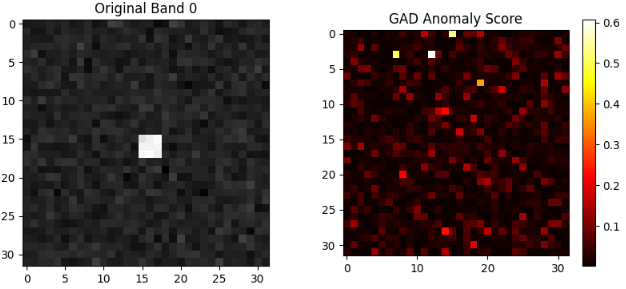
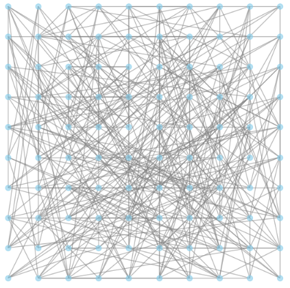
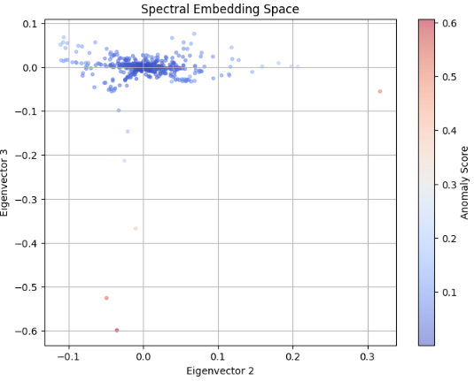

## GAD (Graph-based Anomaly Detector) の概要

**GAD（グラフベース異常検知器）** は、画像内の画素同士を「点（ノード）」と「線（エッジ）」でつなぎ、**グラフ理論の構造**を利用して異常を見つけ出す手法です。

従来のLRXやCRDが「窓内の統計」や「線形な組み合わせ」に依存していたのに対し、GADは **「データ間のつながりの強さ」** に注目します。

### GADの基本的な仕組み

1. **グラフの構築** : 各画素をノードとし、スペクトル（色）が似ている画素同士をエッジで結びます。
2. **重み付け** : 似ていればいるほど、エッジの「重み（つながりの強さ）」を大きく設定します。
3. **構造解析** :

* **背景** : 多数派の画素同士が強く結びつき、巨大な「島（クラスター）」を形成します。
* **異常** : どの大きな島とも弱くしか繋がっていない、あるいは孤立している「小さな島」として浮き彫りになります。

## GADが解決しようとした課題

GADは、従来の統計的・線形表現手法（RXやCRD）が抱えていた以下の3つの大きな課題を解決するために考案されました。

### 1. 非線形な背景構造への対応（線形性の限界）

* **課題** : CRDなどは「背景は線形結合（足し算）で表せる」という前提がありますが、実際のリモートセンシングデータや複雑な画像では、光の反射や混合が複雑な **非線形（単純な足し算では説明できない）** 構造を持っています。
* **解決** : グラフは「似ているか否か」の親和性（Affinity）でつながるため、数学的なモデル（線形性や正規分布）を仮定せずに、複雑な背景の形をそのまま捉えることができます。

### 2. 窓サイズへの依存と「局所性」の柔軟化

* **課題** : LRXやCRDは固定された「四角い窓」を使いますが、実際の背景（道路、川、森林の境界など）は四角形ではありません。窓の中に異なる素材が混ざると、精度がガタ落ちします。
* **解決** : GADは「空間的な近さ」と「スペクトルの近さ」を同時に考慮してつながりを作るため、**背景の形状に沿って柔軟に辞書（比較対象）を形成**できます。

### 3. 背景の不均一性と「外れ値」の判別

* **課題** : 統計的な手法（LRX）では、背景のバラツキが大きいと「異常」も「背景の端っこ」も同じようにマハラノビス距離が大きくなり、誤報（False Alarm）が増えます。
* **解決** : グラフ構造で見ると、背景の端っこであっても「背景の島」の一部として接続を維持しますが、異常は「構造的に孤立」します。この **「つながりの断絶」** を見ることで、ノイズと本物の異常をより正確に切り分けられます。

## GADのメリット・デメリットまとめ

| **特徴**   | **GADの利点**                                | **考慮すべき点**                                       |
| ---------------- | -------------------------------------------------- | ------------------------------------------------------------ |
| **適応性** | 背景が非線形・不均一でも精度が高い。               | グラフの構築（エッジの計算）に時間がかかる。                 |
| **頑健性** | 窓サイズの影響を受けにくく、形状に強い。           | ハイパーパラメータ（つながりの強さの閾値など）の調整が必要。 |
| **検知力** | 統計的な外れ値だけでなく、構造的な外れ値を拾える。 | 画素数が多いと、隣接行列が巨大になりメモリを消費する。       |

GAD（Graph-based Anomaly Detector）がグラフ理論をどのように異常検知に転換しているのか、そのプロセスは**「画像をスペクトル空間上のネットワークとして再構築する」**ことに集約されます。

具体的には、以下の3つの主要なステップでグラフ理論の道具（隣接行列、次数行列、ラプラシアン行列）を活用しています。

## 原理

### 1. 隣接行列（Adjacency Matrix）による「親和性」の数値化

まず、画像内の各ピクセルを「ノード（頂点）」、ピクセル間のスペクトルの類似度を「エッジ（辺）の重み」と見なします。

* **手法**: 全てのピクセルペア（または近傍のペア）に対して、ガウスカーネルなどを用いて類似度 $W_{ij}$ を計算します。

$$
W_{ij} = \exp\left( -\frac{\|x_i - x_j\|^2}{2\sigma^2} \right)
$$

* **グラフ理論の活用**: これにより、画像は巨大な**重み付き無向グラフ**に変換されます。背景ピクセル同士は大きな重みで結ばれますが、異常ピクセルはどのピクセルとも小さな重みでしか結ばれません。

### 2. グラフ・ラプラシアン（Graph Laplacian）による構造解析

GADの核心は、グラフの構造的特徴を抽出する　**「グラフ・ラプラシアン行列$L$ 」**　の計算にあります。

* **計算**: $L = D - W$ （$D$ は次数行列、$W$ は隣接行列）
* **グラフ理論の活用**: グラフ理論において、ラプラシアン行列の固有値や固有ベクトルを調べることで、グラフがいくつの「島（連結成分）」に分かれているか、どのノードが「群れ」から外れているかが分かります。
* **物理的イメージ**: これは、グラフ上の各ノードに熱や拡散をシミュレーションするようなものです。背景の大きな島の中では熱がスムーズに伝わりますが、孤立した異常地点には熱が伝わりにくい（あるいは逃げにくい）という性質を利用します。

### 3. スコアリング：孤立度の定量化

最後に、構築したグラフ構造から「異常スコア」を算出します。主なアプローチは2つあります。

#### A. グラフ・セグメンテーション（切断）アプローチ

グラフを「背景グループ」と「それ以外」に切り分ける際、 **最小カット（Min-cut）** の原理を使います。異常ピクセルを切り離すために必要なエネルギー（エッジの重みの合計）が非常に小さいことを利用して検知します。

#### B. 固有ベクトルによる写像（Spectral Embedding）

ラプラシアン行列の主要な固有ベクトルを用いて、ピクセルを低次元空間に再配置します。

* **背景**: 低次元空間でギュッと1箇所に固まります。
* **異常**: その塊から遠く離れた場所にポツンと配置されます。この中心からの距離を異常スコアとします。

### 従来の窓手法（CRD/LRX）との決定的な違い

| 視点 | 従来の窓手法 | GAD (グラフベース) |
| --- | --- | --- |
| **比較対象** | 四角い枠の中の住人 | 似た性質を持つ「全域の仲間」 |
| **数学的道具** | 行列の逆行列・線形結合 | **固有値分解・最短経路・カット理論** |
| **異常の定義** | 平均から遠いもの | **ネットワークから孤立しているもの** |

### まとめ

GADは、画像を「色の集合」としてではなく、 **「ピクセル同士の信頼関係のネットワーク」** として捉え直します。

「背景という巨大なコミュニティに属していない、コネクションのないピクセルを探す」という、極めて構造的なアプローチによって、窓サイズに縛られない自由な検知を実現しています。

### 結論：GADはどんな時に使うべきか？

もし、観測データが **「背景に複数の素材が入り混じっていて、かつそれらが複雑な模様や境界線を持っている」** 場合、四角い窓を使うLRXやCRDよりも、GADの方が「背景を背景として正しく認識」し、異常を際立たせることができるでしょう。

