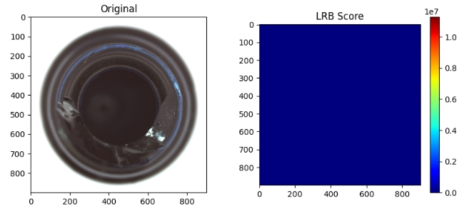

LRB（Local Representation-based Model）は、CRDの安定性とSRD（スパース表現）の精度の高さを「いいとこ取り」したような手法です。

CRDが背景辞書 **$D$** に含まれる**「全員」 **に協力を求めるのに対し、LRBは** 「ターゲットに似ている、選ばれし近隣画素」**だけに絞って協調表現を行うのが最大の特徴です。

---

### 1. LRBの基本的な考え方

CRDを実際に運用すると、背景辞書 **$D$** の中に「ターゲットとは全く無関係な色の画素」が含まれている場合、それがノイズとなって再構成の邪魔をすることがあります。

LRBでは、以下の2ステップで計算を行います。

1. **近傍選択 (Localization)** : 背景辞書 **$D$** の中から、ターゲット **$y$** との距離（色やスペクトルの類似度）が近い上位 **$K$** 個の画素だけを選び出します。
2. **協調表現 (Representation)** : 選ばれた **$K$** 個の画素（局所辞書 **$D_K$**）だけを使って、CRDと同じリッジ回帰（**$L_2$** 正則化）を行います。

---

### 2. LRBの最適化数式

LRBの目的関数は、実質的にCRDと同じ形ですが、使う辞書が限定されます。

$$
J(\alpha) = \|y - D_K \alpha\|_2^2 + \lambda \|\alpha\|_2^2
$$

ここで、**$D_K$** はターゲット **$y$** に類似した **$K$** 個の列ベクトルからなる行列です。

---

### 3. LRBがCRDより優れている理由

なぜ「全員」ではなく「一部」に絞る方が精度が上がるのでしょうか？

* **背景境界（エッジ）への強さ** :
  例えば「芝生」と「コンクリート」の境界線にターゲットがある場合、CRDだと両方の色が混ざってしまいます。LRBなら、ターゲットが芝生の上にあれば「芝生の画素」だけを選んで再現するため、誤検知が減ります。
* **異常の「自己消去」の抑制** :
  背景辞書に少しだけ異常成分が混入してしまっても、それがターゲットと極端に似ていない限り、上位 **$K$** 個に選ばれにくいため、異常を見逃すリスクを下げられます。
* **スパース性の擬似的な実現** :
  SRD（L1正則化）のような複雑な最適化計算をせずに、単純な距離計算（**$K$**近傍法）とリッジ回帰だけで、スパース表現に近い「絞り込み効果」を得られます。

---

### 4. 実装のステップ

LRBを実装する際の手順は以下の通りです。

1. **窓の切り出し** : CRDと同様に二重窓で背景候補 **$D$** を集める。
2. **距離計算** : **$y$** と **$D$** の各画素との間のユーグリッド距離（またはマハラノビス距離）を計算する。
3. **ソートと選択** : 距離が短い順に **$K$** 個の画素を抽出し、**$D_K$** を作る。
4. **解を求める** :

$$
$$\alpha = (D_K^T D_K + \lambda I)^{-1} D_K^T y
$$

1. **異常スコア** : **$Score = \|y - D_K \alpha\|_2$**

---

### 5. パラメータ **$K$** の影響

LRBにおいて、上位何個選ぶか（**$K$**）は非常に重要です。

* **$K$ が小さい場合** : 非常に局所的な特徴を捉えますが、ノイズに弱くなります。
* **$K$ が大きい場合** : 次第に通常のCRDの挙動に近づきます。
* **一般的な目安** : 背景辞書の総画素数の 10%〜30% 程度に設定されることが多いです。

---

### まとめ

LRBは、**「似たもの同士で助け合う」**という、より直感的な背景再現アルゴリズムです。

* **CRD** : 全員で協力する（民主主義的）
* **SRD** : 数個を厳選する（エリート主義的・計算重め）
* **LRB** : **似ている人たちだけで協力する（町内会主義的・バランス型）**

もし、現在のCRDで「背景の模様が切り替わる場所で誤検知（偽陽性）が出て困っている」という場合は、このLRBに切り替えることで劇的に改善する可能性があります。

次は、この **$K$** 個を効率的に選ぶための高速な距離計算（探索）の方法について詳しくお話ししましょうか？

## LEBの特徴

LRB（Local Representation-based Model）は、CRDの安定性とSRD（スパース表現）の識別力をバランスよく組み合わせた手法です。

その最大の特徴は、背景辞書を**「ターゲットに似ているものだけに動的に絞り込む」**というプロセスにあります。

---

### 1. LRBの主な特徴

* **適応的フィルタリング**: 背景窓内の全画素を使うのではなく、ターゲットとの距離（類似度）に基づいて辞書をその場で選別します。
* **局所的な整合性**: ターゲット  を再現するために、「全く似ていない背景画素」を計算から排除します。
* **計算の安定性**: 選ばれた後の計算はL2正則化（リッジ回帰）で行うため、SRD（L1正則化）のような複雑な反復計算を必要とせず、解析的に解けます。

---

### 2. 得意なケース（メリット）

#### ① 背景の境界（エッジ）部分

CRDはエッジ部分で「背景A」と「背景B」の両方を辞書に入れてしまうため、中間的な色の異常を見逃したり、逆にエッジを異常と誤検知したりします。LRBは、ターゲットに近い方の背景だけを選べるため、境界付近の検知精度が非常に高いです。

#### ② 複雑なテクスチャ背景

背景が多様な色や模様で構成されている場合、全員を混ぜる（CRD）と背景モデルがぼやけます。LRBはターゲットの「今の色」に近い成分だけを集めるため、複雑な背景の中でも異常を鋭く分離できます。

#### ③ 異常の自己消去（Ghosting）の抑制

背景辞書に異常の一部が混入してしまっても、それがターゲット（異常の中心）と少しでも色が異なれば、上位  個の選別から漏れる可能性が高く、異常が背景として再現されてしまうのを防げます。

---

### 3. 不得意なケース（デメリット・注意点）

#### ① 非常に小さい（1〜2ピクセル）のノイズ

ターゲットに近い画素を数個選んでしまうという特性上、背景にポツポツとしたノイズ（椒塩ノイズなど）があると、それらを「似たもの」として辞書に拾ってしまい、ノイズを背景として完璧に再現（＝異常として検出できない）してしまうことがあります。

#### ② ハイパーパラメータ  への依存

「何個の近傍画素を選ぶか（）」の設定が非常にシビアです。

* が小さすぎると、背景のわずかな変化に対応できず、偽陽性（誤検知）が増えます。
* が大きすぎると、結局CRDと同じ挙動になり、LRBのメリットが失われます。

#### ③ 計算コスト（速度面）

CRDは「窓の中の画素を全部足す」だけですが、LRBは全ピクセルにおいて**「全ての背景候補との距離計算」＋「ソート（並び替え）」**が必要です。このソート処理が、特に高解像度の画像やマルチスペクトルデータでは大きなボトルネックになります。

---

### 4. まとめ：CRD vs LRB

| 特徴                       | CRD              | LRB                    |
| -------------------------- | ---------------- | ---------------------- |
| **辞書の使い方**     | 全員で一斉に協力 | 似ている精鋭だけで協力 |
| **エッジでの誤検知** | 出やすい         | **出にくい**     |
| **計算速度**         | **速い**   | 遅い                   |
| **異常の見逃し**     | 汚染に弱い       | **汚染に強い**   |

---

### 活用のアドバイス

LRBは、　**「物体と物体の重なりが多い画像」**や**「背景の色の種類が多い画像」**　で特に威力を発揮します。

もし計算速度が遅いことが問題であれば、全ピクセルでLRBを動かすのではなく、　**「CRDでざっくりアタリをつけ、スコアが中途半端な場所だけLRBで精密検査する」**　という2段構えのアルゴリズムにカスタマイズすることも可能です。

## 計算仕組み

LRB（Local Representation-based Model）の計算アルゴリズムは、一言で言えば **「ターゲットに似た背景サンプルだけを動的に選抜し、その精鋭たちだけでターゲットを説明（再構成）する」** プロセスです。

数学的な手順は以下の4つのステップに集約されます。

### 1. 近傍画素の選別（Selection Step）

ターゲット画素  に対して、二重窓（Dual Window）の外側から抽出された全背景候補  との距離を計算します。

* **距離の計算**:
通常はユークリッド距離、あるいはスペクトル形状を重視する場合はコサイン類似度を用います。

$$dist_i = \|y - d_i\|_2$$

* **上位  個の抽出**:
距離が小さい（＝ターゲットに似ている）順に  個の画素を選び出し、これを**局所辞書 ** とします。

$$D_k = [d_{(1)}, d_{(2)}, \dots, d_{(K)}]$$

### 2. 協調表現の重み計算（Optimization Step）

選ばれた  個の画素を使って、ターゲット  を最もよく再現するための重み係数  を算出します。ここで**リッジ回帰（ 正則化）**の最適化問題を解きます。

* **目的関数**:

$$J(\alpha) = \|y - D_k \alpha\|_2^2 + \lambda \|\alpha\|_2^2$$

* **解析解（計算式）**:

行列演算により、一発で最適な $\alpha$ が求まります。

$$\alpha = (D_k^T D_k + \lambda I)^{-1} D_k^T y$$

この  は、「選ばれた  個の背景をそれぞれ何％ずつ混ぜればターゲットを再現できるか」を示しています。

### 3. 再構成と誤差の算出（Reconstruction Step）

算出された重み  を使って、背景画素の組み合わせでターゲットを「再現（再構成）」し、実際のターゲットとの差を見ます。

* **再構成ベクトル**: 

 $\hat{y} = D_k \alpha$

* **再構成誤差（異常スコア）**:

$$Score = \|y - \hat{y}\|_2$$

### 4. 判定（Detection Step）

算出したスコアが閾値（Threshold）を超えていれば「異常」、小さければ「背景（正常）」と判定します。

* **LRBの賢い点**:
背景の境界線（例：芝生と砂利の境目）にターゲットがある場合、CRDは「芝生」と「砂利」を無理やり混ぜて再現しようとして誤差が出ますが、LRBはターゲットが芝生なら「芝生の上位K個」だけを選んで完璧に再現するため、**境界を異常と誤検知しません。**

### 計算アルゴリズムの全体フローまとめ

| ステップ | 処理内容 | 数学的な意味 |
| --- | --- | --- |
| **① 距離計算** |  と背景全候補の差を測る | 類似度の評価 |
| **② ソート** | 近いものから  個選ぶ | **局所的な部分空間の定義** |
| **③ リッジ回帰** |  | 最適な線形結合比率の算出 |
| **④ 誤差算出** |  | 背景モデルからの逸脱度の数値化 |

### 実装上のアドバイス

このアルゴリズムで最も時間がかかるのは「① 距離計算」と「② ソート」です。
特にマルチスペクトル画像では、全ての画素でこれを繰り返すと処理が重くなります。

* **高速化のコツ**: 1ピクセルずつではなく、例えば  のブロック単位で同じ  を使い回す（Strided LRB）ことで、精度をほぼ維持したまま速度を数倍に上げることができます。

## 実験

