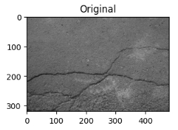
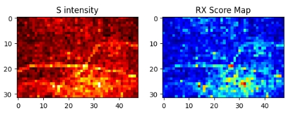

RPCAで背景を分離した後、残ったスパース成分（**$S$**）には「異常」だけでなく、わずかな「ノイズ」や「背景の残りカス」が含まれています。ここに **RX Detector** を適用することで、それらの中から **「統計的に明らかに異質なもの」** だけを最終的な異常として抽出できます。

## この組み合わせが良い理由

RPCAとRX Detectorを組み合わせるアプローチは、いわば **「強力な掃除機で大きなゴミを取り除いた後、精密な顕微鏡で小さな異物を見つける」** ような関係にあります。

それぞれの特性を整理すると、なぜこの統合が理にかなっているのかが見えてきます。


### 1. RPCA (IALMなど) のメリットと弱点

* **メリット**:
* **背景の自動モデル化**: 「何が背景か」を教えなくても、データ全体の統計的な重なりから勝手に「低ランクな背景（$L$）」を構築できる。
* **大きな変化に強い**: 画面の半分を占めるような大きな構造の変化も、背景として分離可能。


* **弱点**:
* **「異常」と「ノイズ」の区別が曖昧**: 背景ではないものはすべてスパース成分（$S$）に放り込まれるため、微細なノイズも「異常」として残ってしまう。
* **空間統計を無視**: パッチや画素を独立に扱うことが多く、「周囲のノイズの散らばり具合」までは考慮してくれない。


### 2. RX Detector のメリットと弱点

* **メリット**:
* **統計的な「異質さ」に敏感**: マハラノビス距離を使うため、周囲のデータの「広がり（分散）」に対して、どれだけ浮いているかを定量化できる。
* **微細な異常に強い**: ノイズの分布を計算に入れるため、一見ノイズに見える小さな点でも、分布から外れていれば確実に仕留められる。


* **弱点**:
* **複雑な背景に弱い**: 背景に複雑な模様や大きな明暗差があると、背景そのものを「異常」と誤検知（False Alarm）しやすい。
* **計算負荷**: 多次元データの共分散行列の逆行列計算が必要なため、生データ全体に適用すると非常に重い。


### 3. 処理を統合するメリット（なぜ最強の組合せか）

これらを順番に実行することで、お互いの弱点を完璧に補完し合うことができます。

#### ① 背景による誤検知の解消（RPCAがRXを助ける）

RXの最大の弱点は「背景の変化に騙されること」です。先にRPCAを実行して背景成分（$L$）を差し引くことで、RXに入力されるデータ（$S$）は **「ほぼゼロに近い、平坦なノイズの海」** になります。これにより、RXが背景に惑わされることがなくなります。

#### ② ノイズと異常の選別（RXがRPCAを助ける）

RPCAの弱点は「ノイズも異常も  $S$ に混ぜてしまうこと」です。 $S$ 成分に対してRXを適用すると、 **「ただのランダムな残りカス（ノイズ）」** と **「背景ルールを無視した明確な意図を持つキズ（異常）」** を、マハラノビス距離によって明確に線引きできます。

#### ③ 圧倒的なSN比（信号対雑音比）の向上

単体で使うよりも、異常箇所が背景やノイズから突き抜けて高く（スコアが大きく）なるため、最終的な「しきい値判定」が非常に容易になります。


## 実装
有効性を説明してみた後は、実際に動作させる実装のステップを整理します。

### 1. 全体的な処理フロー

1. **RPCA (IALM等) の実行** : 入力画像 **$M$** を **$L$**（背景）と **$S$**（スパース/異常候補）に分解。
2. **$S$ 成分のベクトル化** : 画像パッチごとに、または全画素の特徴量をベクトルとして並べる。
3. **背景統計（平均・共分散）の算出** : **$S$** 成分全体（あるいは局所領域）から、ノイズの分布を推定。
4. **RXスコアの計算** : 各画素（またはパッチ）のベクトルが、推定された分布からどれだけ離れているか（マハラノビス距離）を算出。
5. **しきい値処理** : スコアが高い箇所を最終的な「異常」と断定。


### 2. 実装のコードイメージ (Python)

RPCAの結果得られたスパース行列 `S` を入力とする、RX Detector適用の流れです。

**Python**

```
import numpy as np

def rx_detector_on_sparse(S_matrix):
    """
    S_matrix: RPCAで得られたスパース成分 (例: [パッチ数, 特徴量次元])
    """
    # 1. 平均ベクトル (mu) と共分散行列 (Sigma) の算出
    # S成分のほとんどは0に近い「ノイズの塊」であると仮定
    mu = np.mean(S_matrix, axis=0)
    # 共分散行列。逆行列を計算するため、微小値を足して安定化（レギュラライズ）
    sigma = np.cov(S_matrix, rowvar=False) + 1e-6 * np.eye(S_matrix.shape[1])
  
    # 2. 共分散行列の逆行列を計算
    sigma_inv = np.linalg.inv(sigma)
  
    # 3. 各サンプル(パッチ)に対してマハラノビス距離（RXスコア）を計算
    rx_scores = []
    for i in range(S_matrix.shape[0]):
        diff = S_matrix[i] - mu
        # RXスコア = (x - mu)^T * Sigma^-1 * (x - mu)
        score = np.dot(np.dot(diff, sigma_inv), diff.T)
        rx_scores.append(score)
      
    return np.array(rx_scores)

# --- 実行イメージ ---
# S_hat は RPCA (IALM) から得られたスパース行列
# 2次元画像なら、パッチごとにベクトル化しておく
rx_map = rx_detector_on_sparse(S_hat)

# スコアを元の画像サイズに戻して可視化
# 異常箇所は値が大きく跳ね上がる
```


###  実装上の注意点：局所RX（Local RX）の検討

画像全体で一つの共分散行列 Sigma を作ると、場所によって背景の性質が違う場合に誤差が出ます。

実務では、ターゲット画素の **周囲の数ピクセル（スライディングウィンドウ）** からその都度 Sigma を計算する Local RX を採用すると、より高精度になります。


## 実験結果
実際に動作させた結果を示します。

まずは、今回実験につかった画像です。
クラックが入った素材の画像に対して、クラックを異常として認識できるかを実験します。



RPCA→RXのパイプラインとしました。

検出結果は以下です。

左側はRPCAにより異常として検出した画像です。
この画像には実際のクラック以外に、画像全体に満遍なくノイズのデータが含まれています。

右側はRPCAのSに対して、異常検知を追加で行った結果です。
クラック部や、クラックに挟まれた部分を異常と検知しています。
RPCAに比べると、より下を強調する結果となりました。



ということで、異常検知は手法の組合せが有効に機能する場合があります。

