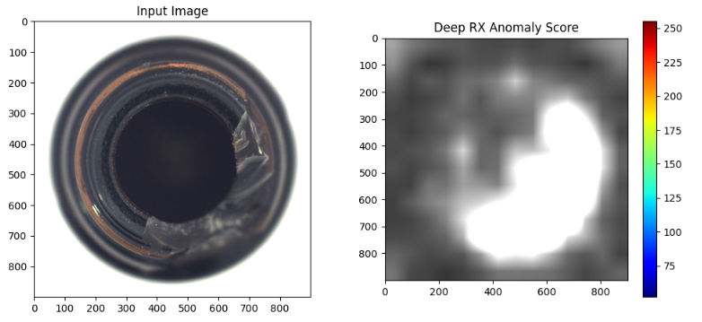
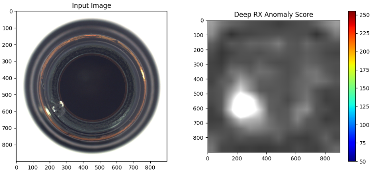
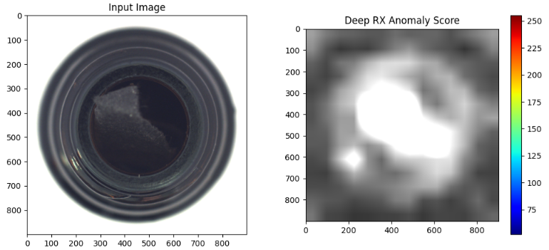
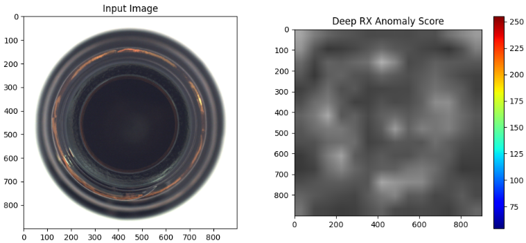

**Deep RX**は、これまでお話ししてきた「古典的な統計手法（RX Detector）」と「最新のディープラーニング」の**いいとこ取り**をした手法です。

RX Detectorの「異常を統計的に定義する数学的厳密さ」を、ディープラーニングの「複雑なものを見抜く表現力」の上に構築することで、非常に高い検知精度を実現します。

## 手法の説明

### 1. Deep RX の基本コンセプト

一言でいうと、　**「人間には理解できないほど高次元で複雑な特徴空間の中で、マハラノビス距離（RX）を計算する」**　手法です。

通常、生の画素値（RGBなど）でRXを計算すると、照明の変化や影に弱くなります。Deep RXでは、まず深層学習モデル（CNNなど）に画像を通し、画像の本質的な特徴が凝縮された　**「特徴ベクトル」**　に変換してからRXを適用します。

### 2. 処理の3つのステップ

#### ① 特徴抽出 (Deep Feature Extraction)

VGGやResNetなどの学習済みモデル、あるいは正常データで訓練したAutoEncoderなどを使用して、画像から高次な特徴を取り出します。

* **生画像**: 100x100ピクセルの数値の羅列
* **特徴量**: 「ここに角がある」「この質感は粗い」といった、意味的な情報のベクトル（512次元など）

#### ② 統計量の推定 (Background Statistics)

抽出された大量の特徴ベクトルから、平均 ($\mu$) と 共分散行列 ($\Sigma$) を算出します。これが「正常な状態の広がり」を定義する基準点になります。

#### ③ 異常スコアの算出 (RX Scoring)

新しい画像が入力された際、その特徴ベクトルがステップ②で定義した「正常の分布」からどれだけ離れているかをマハラノビス距離で測ります。

$$Score = (f(x) - \mu)^T \Sigma^{-1} (f(x) - \mu)$$

※ $f(x)$ はニューラルネットワークによる特徴抽出関数です。

### 3. なぜ Deep RX が優れているのか？

* **「意味」で異常を捉える**:
  単なる「色が違う」だけでなく、「このテクスチャの中にこの模様があるのは不自然だ」という高次元な違和感をRXで数値化できます。
* **背景の複雑さを吸収**:
  ニューラルネットワークが背景の複雑なバリエーションを特徴空間上で「整理」してくれるため、RX Detectorが最も得意とする「シンプルな分布」に近い状態で判定が行えます。
* **少数の異常に強い**:
  大量の異常データ（教師データ）がなくても、正常データの分布さえ分かれば機能するため、実世界の「めったに起きない故障」の検知に非常に適しています。

### 4. 発展形：PaDiM や PatchCore

最近の製造業の異常検知（MVTec ADデータセットなど）で世界最高レベルの精度を出している手法（PaDiMやPatchCore）は、実はこの **Deep RX の進化形**です。

* **PaDiM**: 各ピクセル位置ごとに、Deepな特徴量の多変量ガウス分布を保持し、場所ごとにマハラノビス距離を計算します。
* **PatchCore**: 正常な特徴量を「メモリバンク」として保存し、最も近い正常特徴との距離を測ります（RXの概念をより柔軟にしたもの）。

### まとめ

Deep RXは、**「AIの目（CNN）」で物事を見て、「数学の物差し（RX）」で異常を測る**手法です。

もし、以前実装した「RPCA + RX」のコードをさらに進化させたい場合、入力を画素値ではなく、**PyTorchの学習済みResNetなどを通した後の出力**にするだけで、それはもう「Deep RX」の入り口に立っていることになります。

## 実装の手順

一言で言うと、CNNのニューラルネットワークより取得した特徴マップで、RX Detectorを行う。
です。

### ステップ 1：特徴抽出モデルの準備
Deep RXでは、生の画素値ではなく、ニューラルネットワークが抽出した「意味のある特徴」を使います。

学習済みモデルのロード: PyTorchなどのライブラリから、ImageNetで学習済みの ResNet18 や ResNet50 を読み込みます。

層の選択: ネットワークの最後まで使わず、途中の「特徴マップ」を出力する層でカットします。

Layer 2 や Layer 3 がおすすめ：色やエッジの情報（解像度）と、テクスチャの意味情報のバランスが良いためです。

推論モードへの設定: model.eval() を実行し、重みを固定します。

### ステップ 2：学習（正常データの統計量を算出）

「学習」と言っても、ニューラルネットワークの重みを変えるわけではありません。
正常データの「平均」と「散らばり具合」を数式で記録する作業です。

1. 正常画像群の入力: 10〜50枚程度の正常画像をモデルに通します。
2. 特徴ベクトルの収集: 各画像から得られた特徴マップ（例：$14 \times 14$ のグリッド）を全て集め、巨大な行列 $X$（[サンプル数, 特徴量次元]）を作ります。
3. 統計計算:平均ベクトル ($\mu$): $X$ の列ごとの平均を計算。共分散行列 ($\Sigma$): 特徴量同士がどう連動して動くかを計算。逆行列 ($\Sigma^{-1}$): マハラノビス距離を計算するために、この逆行列を求めて保存します。

### ステップ 3：推論（異常スコアの算出）

新しい画像が来たときに、学習した統計量と比較します。

1. テスト画像の入力: 判定したい画像をモデルに通し、特徴ベクトルを取り出します。
2. マハラノビス距離の計算: 各グリッド位置のベクトル $f(x)$ に対して、以下の式でスコア $d$ を計算します。
   $$d = \sqrt{(f(x) - \mu)^T \Sigma^{-1} (f(x) - \mu)}$$
   
   これにより、「正常な塊」からどれだけ統計的に外れているかが数値化されます。
   
3. ヒートマップ化: 計算されたスコアを元の画像の配置に戻し、リサイズして重ね合わせます。

## 実験
MVTecで正常データのみの学習後に実験してみた。

ここから3つは異常データ。
検出できている。

これのみ正常データ。
誤検出していない。

