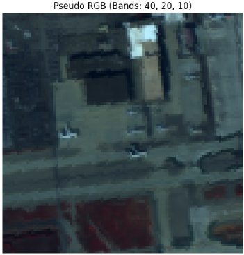
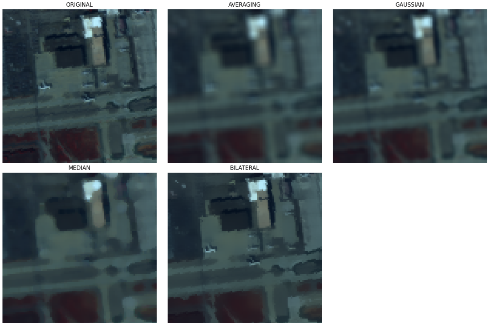
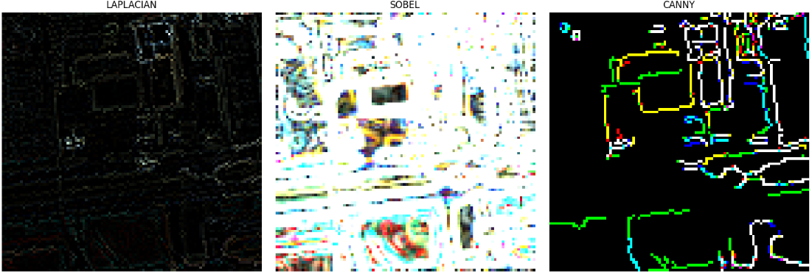
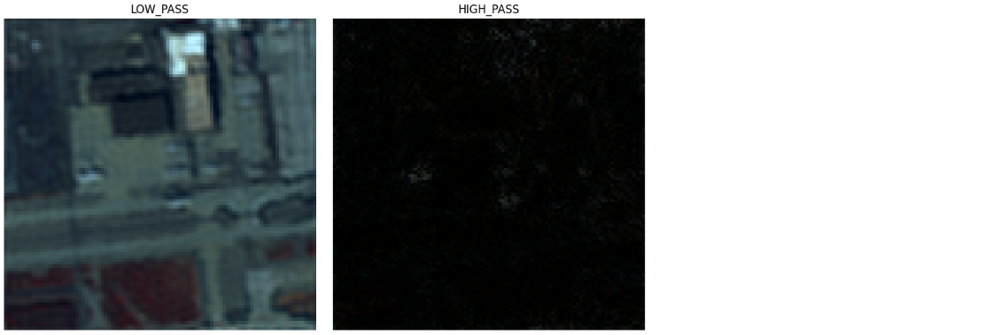

画像を用いる異常検知や画像AIの手法において、より精度を求める場合に前処理は重要です。
本日はそんな前処理の中で、フィルタリング手法について説明します。

## 画像フィルタリング
画像処理におけるフィルタリング手法は、 **「何を強調し、何を除去したいか」** という目的によって大きく3つのカテゴリーに分類されます。

### 1. 平滑化フィルタ（ノイズ除去・ぼかし）

画像の高周波成分（急激な色の変化）を抑え、滑らかにする手法です。

* **平均化フィルタ (Averaging Filter)**
* **特徴**: 近傍画素の平均値を採用する最も単純な手法。
* **短所**: ノイズだけでなく、物体の輪郭（エッジ）までぼやけてしまう。

* **ガウシアンフィルタ (Gaussian Filter)**
* **特徴**: 中心に近い画素ほど重みを大きくする（ガウス分布）。平均化より自然なぼけが得られる。
* **用途**: 前処理としてのノイズ抑制。

* **メディアンフィルタ (Median Filter)**
* **特徴**: 近傍の画素値を並べ替え、中央値を採用する非線形フィルタ。
* **強み**: **「ごま塩ノイズ（散発的な白い点など）」**の除去に極めて強く、エッジを比較的保持しやすい。

* **バイラテラルフィルタ (Bilateral Filter)**
* **特徴**: 距離だけでなく「色の近さ」も考慮して重み付けを行う。
* **強み**: **「エッジを保存したまま」**平滑化ができる。美肌補正などに多用される。

__用途__

平滑化フィルタの主な用途は、画像に含まれる **「不要な変動（ノイズ）」を抑え、解析に必要な「本質的な情報（構造や領域）」を扱いやすくすること** にあります。

具体的には、以下の4つの重要な役割があります。

__1. 異常検知の前処理（背景統計の安定化）__

RX DetectorやCRDなどの異常検知アルゴリズムを動かす際、背景に細かいザラつき（テクスチャ）があると、それが「微細な異常」として誤検知される原因になります。

* **役割**: 背景をあえて「ぼかす」ことで、個々の画素のばらつきを抑え、背景統計（平均や共分散）を安定させます。これにより、真に異質な物体だけが浮き彫りになります。

__2. ノイズ除去（信号対雑音比の向上）__

センサー由来の電子ノイズや、通信過程で混入する「ごま塩ノイズ」などを取り除きます。

* **役割**: 周辺画素の情報を利用して、突発的に値が跳ね上がっている画素を周囲に馴染ませます。
* **例**: メディアンフィルタを使用すると、建物の形はそのままに、センサーの不具合による白い点々だけを消去できます。

__3. 特徴抽出の準備（偽エッジの抑制）__

エッジ抽出（Canny法など）を行う前に平滑化をかけないと、ノイズの激しい部分がすべて「境界線」として検出されてしまいます。

* **役割**: 緩やかな色の変化を無視し、本当に意味のある大きな境界線だけを抽出できるようにします。

### 4. 領域分割（セグメンテーション）の精度向上

先述の「セグメンテーション・ベース RX」において、背景を綺麗に色分けするために不可欠です。

* **役割**: 小さな色の変化（草一本ごとの色の違いなど）を平滑化で潰すことで、草原を「一つの大きな緑の塊」としてAIに認識させやすくします。

### 2. 鋭鋭化・エッジ抽出フィルタ（輪郭強調）

画像の変化が激しい部分（輝度の勾配）を際立たせる手法です。

* **ラプラシアンフィルタ (Laplacian Filter)**
* **特徴**: 2次微分を用いて輝度の変化点を探す。
* **用途**: 画像の鮮鋭化（シャープネス調整）。

* **ソーベルフィルタ (Sobel Filter)**
* **特徴**: 水平・垂直方向の1次微分を行い、エッジの強度と方向を計算する。
* **用途**: 物体の境界線検出。

* **Canny法 (Canny Edge Detector)**
* **特徴**: 複数のステップ（ガウシアンによる平滑化、勾配計算、ヒステリシス閾値処理）を組み合わせた高度な手法。
* **強み**: ノイズに強く、最も正確に「線」としてのエッジを取り出せる。

__用途__

鋭鋭化（シャープネス）やエッジ抽出フィルタの主な用途は、画像内の **「情報の境界」を明確にすること** です。平滑化フィルタが情報を「削ぎ落とす」のに対し、これらは情報を「際立たせる」役割を担います。

具体的には、以下の4つの用途が重要です。

__1. 構造・物体の形状把握__

画像の中から「どこまでが道路で、どこからが建物か」といった、物体の輪郭（アウトライン）を特定するために使用されます。

* **役割**: 輝度が急激に変化する場所を特定し、背景から物体を切り出します。
* **活用例**: 自動運転における車線（白線）の検出や、衛星画像からの建物抽出など。

__2. 微細な異常や欠陥の強調__

異常検知の文脈では、背景に馴染んでしまっている「小さなキズ」や「異物」を浮き彫りにするために使われます。

* **役割**: 背景のなだらかな変化（低周波）を無視し、局所的な急変（高周波）だけを増幅します。
* **活用例**: コンクリート表面のひび割れ（クラック）検出や、金属表面の細かなスレ傷の視覚化。

__3. 解像感の向上（鮮鋭化）__

ピンボケした画像や、大気の揺らぎでぼやけた衛星画像の「キレ」を取り戻すために使用されます。

* **役割**: 輪郭付近のコントラストを人工的に強めることで、人間の目に「ピントが合っている」と錯覚させます。
* **手法**: 元の画像に「ラプラシアンフィルタで抽出したエッジ成分」を足し戻すことで、シャープな画像を作ります（アンシャープマスキング）。

__4. 特徴量としての利用（機械学習の前処理）__

AIやパターン認識において、色そのものよりも「形（勾配）」の方が重要な情報である場合に、入力データとして使用されます。

* **役割**: 画像を「色の塊」から「勾配の方向と強さ」という情報に変換します。
* **活用例**: 顔認識や文字認識（OCR）において、照明の変化に左右されにくい「形」の情報を取り出す際の前処理。

### 3. 周波数ドメイン・フィルタ（スペクトル操作）

画像をフーリエ変換し、周波数成分として処理する手法です。

* **ローパスフィルタ (Low-pass Filter)**
* **特徴**: 低い周波数（なだらかな変化）のみを通し、高い周波数（細かいノイズやエッジ）をカットする。平滑化と同義。

* **ハイパスフィルタ (High-pass Filter)**
* **特徴**: 高い周波数のみを通し、低い周波数（全体の色調など）をカットする。エッジのみが抽出される。

* **バンドパスフィルタ (Band-pass Filter)**
* **特徴**: 特定の周波数帯域のみを抽出する。特定の大きさの模様やテクスチャを探すのに適している。

__用途__

周波数ドメイン・フィルタの最大の特徴は、画像を「色の集まり」としてではなく、 **「波の重なり（振動）」** として捉える点にあります。

空間ドメイン（通常の画像）では除去しにくい特定のパターンやノイズを、 **「特定の周波数成分」** として狙い撃ちできるのが最大の強みです。主な用途は以下の3つです。

__1. 周期的なパターンの除去（ノイズ抑制）__

センサーの不具合や、通信時の干渉によって発生する「縞模様（ストライプノイズ）」や「網目状のノイズ」を取り除く際に、圧倒的な威力を発揮します。

* **役割**: 空間ドメインのフィルタ（ガウシアン等）では、縞模様を消そうとすると画像全体がボケてしまいます。しかし周波数ドメインでは、縞模様に対応する「特定の点（周波数成分）」だけをピンポイントで消去（ノッチフィルタ）できるため、**元の鮮明さを保ったままノイズだけを消せます**。

__2. 背景の緩やかな変化（照明ムラ）の補正__

画像全体にわたる「右側が明るくて左側が暗い」といった緩やかな輝度変化を取り除きます。

* **役割**: **ハイパスフィルタ**を使用します。画像全体の明るさの偏りは「超低周波成分」として中心付近に集まるため、ここをカットすることで、照明の影響を排除し、被写体のディテール（高周波成分）だけを均一に抽出できます。
* **異常検知での活用**: 広域の衛星画像で、雲の影や太陽光の角度による「背景のムラ」を消し、小さな異常物体だけを際立たせる前処理として使われます。

__3. テクスチャ解析と物体抽出__

砂地、森、波、あるいは布の質感など、特定の「粗さ」を持つ領域を特定・分離します。

* **役割**: **バンドパスフィルタ**を使用します。特定の周波数帯域（波の細かさ）だけを抽出することで、特定のサイズや密度を持つテクスチャだけを浮き彫りにします。
* **活用例**: 衛星画像から「一定の密度で並んでいる果樹園」や「住宅街」などの特定の構造を持つエリアを自動でマスキングする際の前処理に適しています。

### 手法選択のクイックガイド

| 実現したいこと | 推奨手法 | 理由 |
| --- | --- | --- |
| **突発的なノイズを消したい** | **メディアンフィルタ** | 外れ値除去に最適。 |
| **背景をぼかしてエッジは残したい** | **バイラテラルフィルタ** | 輝度の差を見て重みを変えるため。 |
| **物体の形を線として抜き出したい** | **Canny法** | 連続した細い線を抽出するアルゴリズムだから。 |
| **画像全体のピントを合わせたい** | **ラプラシアンフィルタ** | 輝度の変化（エッジ）を増幅できるため。 |

## 実験

実際にハイパースペクトルの公開データセットを用いてフィルタリングの効果を確認してみます。

フィルタ自体はcv2で実装することが可能です。
実装コードは以下に保管しています。

[著者のレポジトリ](https://github.com/Shinichi0713/recommendation-ai/tree/main/anormaly_detect_techs/techs/image_filtering)

処理前のオリジナル画像は以下のものを用います。

__平準化フィルタ__

まずは平準化フィルタです。

* **平均化フィルタ (Averaging Filter)**
* **ガウシアンフィルタ (Gaussian Filter)**
* **メディアンフィルタ (Median Filter)**
* **バイラテラルフィルタ (Bilateral Filter)**

この並びの上にいくほど、平準化はしつつ輪郭もぼかすことになります。
下に並んでいるフィルタ手法ほど輪郭は保持しつつ、データのギザギザを除去することが出来ます。

__鋭鋭化・エッジ抽出フィルタ__

次は輪郭強調フィルタです。
画像の中の勾配が大きい＝輪郭となる箇所を検出する手法です。

* **ラプラシアンフィルタ (Laplacian Filter)**
* **ソーベルフィルタ (Sobel Filter)**
* **Canny法 (Canny Edge Detector)**

- Sobel/Laplacian: 画像の輝度勾配を計算します。
- Canny: 内部でガウシアンフィルタによる平滑化を行ってからエッジを探すため、Sobelよりもノイズに強く、細い線としてエッジを返します。

__周波数ドメイン・フィルタ__

最期に画像の周波数に応じてフィルタリングを行う手法です。
画像を「色（輝度）」ではなく「波の速さ（周波数）」で分解します。

- Low-pass: 中心（低周波）の情報を残し、外側（高周波）をカットします。Gaussianフィルタと似た効果ですが、より厳密な帯域制限が可能です。
- High-pass: 中心をカットします。画像全体の「明るさ」が消え、急激に変化する「輪郭」や「微細な点」だけが浮き上がります。

今回画像は比較的に単調な画像だったため低周波側がほぼオリジナルの画像通り。
高周波側は一部の建物の輪郭のみが見えています。

## 総括

画像処理は用途が広いですが、取得した画像を出来る限り理想的な状態に持っていくことで良い結果が得られます。
そのための前処理の手段としてフィルタリングが存在します。

良い精度を求められる場合、利用を検討ください。
