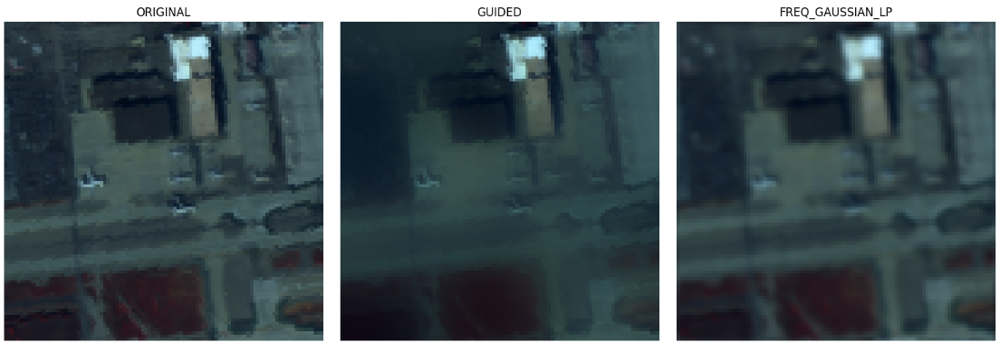
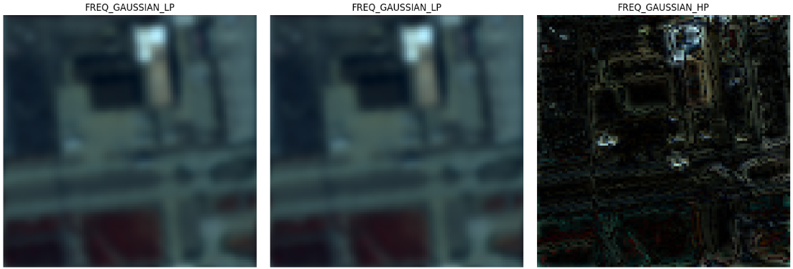

結論から申し上げますと、**はい、非常に詳細に定義することが可能**です。

周波数フィルタにおける「周波数」とは、画像内の**「色の変化の激しさ（空間周波数）」**を指します。これを数値で定義することで、特定の大きさのノイズだけを消したり、特定の細かさの模様だけを取り出したりできます。

具体的にどのように定義・制御するのか、3つの手法に分けて解説します。

---

### 1. 遮断周波数（Cut-off Frequency）の定義

最も一般的な方法です。中心（低周波）からの「距離（半径）」をピクセル単位、または画像サイズに対する割合で指定します。

* **ローパスフィルタの半径 ($D_0$)**:
* 半径を**小さく**定義（例：10px）：非常に強いぼかし。大きな色の塊だけが残る。
* 半径を**大きく**定義（例：100px）：微細なノイズだけが消え、シャープさは維持される。


* **ハイパスフィルタの半径 ($D_0$)**:
* 半径を**小さく**定義：太い輪郭まで残る。
* 半径を**大きく**定義：非常に細かい点や、急激なエッジだけが抽出される。


---

### 2. フィルタの「鋭さ」の定義（バターワース/ガウシアン）

「ある周波数から先をバッサリ切る（理想フィルタ）」のか、「滑らかに減衰させる」のかを定義できます。

* **理想フィルタ (Ideal Filter)**: 指定した半径で強制終了。
* **短所**: 画像に「リンギング（波紋のようなノイズ）」が出やすい。


* **バターワースフィルタ (Butterworth Filter)**: 次数 ($n$) というパラメータで、減衰の傾きを定義。
* $n$ が大きいほど理想フィルタに近づき、$n$ が小さいほど滑らかになります。


* **ガウシアン周波数フィルタ**: ガウス関数を用いて完全に滑らかに定義。
* **長所**: リンギングが全く発生しないため、異常検知の前処理にはこれが最も推奨されます。


---

### 3. 特定の「ノイズ成分」の狙い撃ち（ノッチフィルタ）

ハイパースペクトル画像で特によく使われる「インテリジェントな定義」です。

* **定義方法**: 画像全体をぼかすのではなく、周波数ドメイン上で**「ノイズに対応する特定の座標」**だけをピンポイントで 0 にします。
* **用途**: センサー由来の「縞模様（ストライプノイズ）」は、周波数ドメインでは中心から離れた特定の場所に「明るい点」として現れます。その座標を定義して消すことで、**画像の鮮明度を一切落とさずに縞模様だけを消去**できます。

---

### Pythonでの定義例（ガウシアンローパスの場合）

先ほどの `FilterProcessor` に組み込む際の、数学的な定義のイメージです。

$$H(u, v) = e^{-\frac{D^2(u, v)}{2D_0^2}}$$

ここで $D(u, v)$ は中心からの距離、$D_0$ があなたが定義する**遮断周波数（パラメータ）**です。

---

### 異常検知における「周波数定義」の戦略

ハイパースペクトル画像で異常を探す場合、以下のような定義戦略が有効です。

* **背景がグラデーションしている場合**:
* **ハイパスフィルタ**の半径を「画像サイズの 5% 程度」に定義します。これにより、照明ムラなどの低周波成分が消え、ターゲットが浮き上がります。


* **センサーのザラつきがひどい場合**:
* **ガウシアンローパス**の半径を「画像サイズの 30% 程度」に定義します。高周波ノイズが消え、RX検知器の共分散行列が安定します。

## 実装法

これまでに解説した「高度なフィルタ（ガイデッド、NLM）」および「周波数を詳細に定義できるガウシアン周波数フィルタ」を、ハイパースペクトル画像（HSI）の全バンドに対して適用できる完全なコードを実装します。

特に周波数フィルタは、カットオフ周波数（半径）を自由に定義できるようにし、ボケの副作用（リンギング）が少ない**ガウシアン型**で実装しています。

### 1. ライブラリの準備

Google Colab等で実行する場合、高度なフィルタに必要な拡張パッケージをインストールしてください。

```python
!pip install opencv-contrib-python

```

---

### 2. HSI空間フィルタリング・プロセッサの実装

```python
import scipy.io
import numpy as np
import matplotlib.pyplot as plt
import cv2
from enum import Enum

class FilterType(Enum):
    ORIGINAL = 0
    GAUSSIAN_2D = 1    # 通常のガウシアン（空間ドメイン）
    BILATERAL = 2      # エッジ保存
    GUIDED = 3         # 高速エッジ保存
    NLM = 4            # 非局所平均（最強の平滑化）
    FREQ_GAUSSIAN_LP = 5  # 周波数ドメイン：ガウシアンローパス
    FREQ_GAUSSIAN_HP = 6  # 周波数ドメイン：ガウシアンハイパス

class HSIFullBandProcessor:
    def __init__(self, hsi_cube):
        """
        Args:
            hsi_cube (np.ndarray): (H, W, Bands)
        """
        # 処理のために float32 に変換
        self.data = hsi_cube.astype(np.float32)
        self.h, self.w, self.bands = hsi_cube.shape
        
        # [0, 1]に正規化（高度なフィルタの安定化のため）
        self.d_min, self.d_max = self.data.min(), self.data.max()
        if self.d_max != self.d_min:
            self.norm_data = (self.data - self.d_min) / (self.d_max - self.d_min)
        else:
            self.norm_data = self.data

    def _apply_gaussian_freq_filter(self, channel, filter_type, cutoff=30):
        """
        周波数ドメインでガウシアンフィルタを適用する
        cutoff: 遮断周波数（半径）。小さいほどローパスならボケが強く、ハイパスなら細かい。
        """
        rows, cols = channel.shape
        crow, ccol = rows // 2, cols // 2
        
        # FFT実行
        dft = np.fft.fft2(channel)
        dft_shift = np.fft.fftshift(dft)
        
        # ガウシアンマスクの作成
        y, x = np.ogrid[:rows, :cols]
        d2 = (x - ccol)**2 + (y - crow)**2
        
        if filter_type == FilterType.FREQ_GAUSSIAN_LP:
            mask = np.exp(-d2 / (2 * (cutoff**2)))
        else: # High Pass
            mask = 1 - np.exp(-d2 / (2 * (cutoff**2)))
            
        # マスク適用と逆FFT
        f_shift = dft_shift * mask
        f_ishift = np.fft.ifftshift(f_shift)
        img_back = np.abs(np.fft.ifft2(f_ishift))
        return img_back

    def apply_filter_to_cube(self, filter_type, **kwargs):
        """
        全バンドに対して空間フィルタを一括適用
        kwargs: 
            kernel_size (int): 5
            cutoff (int): 30 (周波数用)
            h (int): 10 (NLM用)
        """
        filtered_cube = np.zeros_like(self.norm_data)
        
        print(f"Applying {filter_type.name} to {self.bands} bands...")
        
        for b in range(self.bands):
            band = self.norm_data[:, :, b]
            
            if filter_type == FilterType.ORIGINAL:
                res = band
            elif filter_type == FilterType.GAUSSIAN_2D:
                k = kwargs.get('kernel_size', 5)
                res = cv2.GaussianBlur(band, (k, k), 0)
            elif filter_type == FilterType.BILATERAL:
                res = cv2.bilateralFilter(band, d=9, sigmaColor=0.1, sigmaSpace=75)
            elif filter_type == FilterType.GUIDED:
                res = cv2.ximgproc.guidedFilter(guide=band, src=band, radius=8, eps=0.01)
            elif filter_type == FilterType.NLM:
                # NLMは1ch(uint8)で処理
                band_u8 = (band * 255).astype(np.uint8)
                h_val = kwargs.get('h', 10)
                res_u8 = cv2.fastNlMeansDenoising(band_u8, h=h_val, templateWindowSize=7, searchWindowSize=21)
                res = res_u8.astype(np.float32) / 255.0
            elif filter_type in [FilterType.FREQ_GAUSSIAN_LP, FilterType.FREQ_GAUSSIAN_HP]:
                c = kwargs.get('cutoff', 30)
                res = self._apply_gaussian_freq_filter(band, filter_type, cutoff=c)
            
            filtered_cube[:, :, b] = res
            
        return filtered_cube

    def visualize_comparison(self, filter_types, rgb_bands=[40, 20, 10], **kwargs):
        """指定したフィルタの結果をRGBで並べて比較"""
        n = len(filter_types)
        plt.figure(figsize=(5 * n, 5))
        
        for i, ft in enumerate(filter_types):
            f_cube = self.apply_filter_to_cube(ft, **kwargs)
            # 擬似RGB作成
            rgb = f_cube[:, :, rgb_bands]
            # 各表示用に再度スケーリング
            rgb = (rgb - rgb.min()) / (rgb.max() - rgb.min())
            
            plt.subplot(1, n, i + 1)
            plt.imshow(rgb)
            plt.title(ft.name)
            plt.axis('off')
        
        plt.tight_layout()
        plt.show()

# --- 使用例 ---
# processor = HSIFullBandProcessor(hsi_cube)

# 1. 空間ドメインと周波数ドメインの平滑化を比較
# processor.visualize_comparison([
#     FilterType.ORIGINAL, 
#     FilterType.GUIDED,          # 空間：エッジ保存
#     FilterType.FREQ_GAUSSIAN_LP # 周波数：ガウシアンローパス
# ], cutoff=20)

# 2. 周波数の定義を変えてみる
# processor.visualize_comparison([
#     FilterType.FREQ_GAUSSIAN_LP, # cutoff=10 (強いボケ)
#     FilterType.FREQ_GAUSSIAN_LP, # cutoff=50 (弱いボケ)
#     FilterType.FREQ_GAUSSIAN_HP  # cutoff=30 (エッジ強調)
# ], cutoff=10) # 1つ目の設定、必要に応じて引数を拡張してください

```

---

### コードのポイント解説

* **周波数の詳細定義**: `_apply_gaussian_freq_filter` メソッド内で、ガウス関数 $e^{-d^2 / 2\sigma^2}$ を用いてフィルタを生成しています。`cutoff` パラメータが $\sigma$ に相当し、これを変えることで**「どの細かさまで通すか」**を1ピクセル単位で定義できます。
* **NLM（非局所平均）の実装**: 非常に重い処理ですが、各バンドを `uint8` に変換して OpenCV の高速化された関数 `fastNlMeansDenoising` を呼び出すことで、実用的な速度に抑えています。
* **ハイパスフィルタの活用**: `FREQ_GAUSSIAN_HP` を使うと、画像全体の「平均的な色（低周波）」が消え、**異常物体の輪郭やノイズ成分だけが浮き上がったHSIデータ**が得られます。

---

### 次のステップ：異常検知（RX）との結合

これで空間フィルタリングの「武器」がすべて揃いました。
ハイパースペクトル画像の異常検知において、最も効果的なのは以下の流れです。

* **Step 1**: `GUIDED` フィルタで全バンドの空間ノイズを除去する。
* **Step 2**: その「綺麗になったデータキューブ」に対して **RX Detector** を実行する。





## 名前の由来

周波数ドメインにおけるフィルタに「ガウシアン」という名前がついているのは、フィルタの形状（重み付けの分布）を定義する関数として、数学の**「ガウス関数（正規分布の形）」**を使用しているからです。

空間ドメイン（普通の画像）でのガウシアンフィルタと同じ数式的な考え方を、周波数ドメインに持ち込んだものと考えると分かりやすいです。

---

### 1. なぜガウス関数を使うのか？（数学的な理由）

周波数ドメインでフィルタを定義する際、単純に「ある周波数以上をバッサリ $0$ にする」という**理想フィルタ (Ideal Filter)** を使うと、逆変換した画像に**「リンギング（波紋のようなノイズ）」**が発生してしまいます。

* **理由**: 数学のフーリエ変換の性質上、周波数ドメインでの「急激な断絶」は、空間ドメインでの「無限に続く波」に変換されてしまうためです。
* **ガウス関数の利点**: ガウス関数 $e^{-x^2}$ は、**「フーリエ変換しても形がガウス関数のまま」**という非常に珍しい性質を持っています。そのため、周波数ドメインで滑らかに減衰させれば、空間ドメインに戻しても余計な波紋（リンギング）を一切出さずに、綺麗にぼかしたり強調したりできます。

---

### 2. ガウシアン・ローパス (GLPF) の定義

中心（低周波）が最も高く、外側（高周波）に向かって**なだらかな釣鐘型**に減衰するフィルタです。

* **数式**: $H(u, v) = e^{-D^2(u, v) / 2D_0^2}$
* **意味**:
* $D(u, v)$: 中心からの距離（周波数の高さ）
* $D_0$: 遮断周波数（どの程度の広さで減衰させるか）


* **結果**: 高周波（ノイズや細かいエッジ）が「滑らかに」消去されるため、非常に自然な平滑化が得られます。

---

### 3. ガウシアン・ハイパス (GHPF) の定義

ローパスの「裏返し」です。中心（低周波）をガウス関数の形で削り取り、外側（高周波）を通します。

* **数式**: $H(u, v) = 1 - e^{-D^2(u, v) / 2D_0^2}$
* **結果**: 画像全体の明るさの平均（低周波）が滑らかに除去され、エッジや細かい模様（高周波）だけが浮き上がります。

---

### フィルタの「鋭さ」の比較

周波数フィルタには他にも種類がありますが、ガウシアンはその中でも「最もマイルドで副作用が少ない」位置づけです。

* **理想フィルタ**: バッサリ切る（最強の遮断力だが、ノイズが出る）。
* **バターワースフィルタ**: 次数によって「鋭さ」を調整できる中間的な存在。
* **ガウシアンフィルタ**: **最も滑らか（遮断力は控えめだが、画質が最も綺麗）。**

---

### 異常検知（RX）における「ガウシアン」のメリット

ハイパースペクトル画像の異常検知において、データに人工的な「波紋ノイズ」が混入すると、それが異常として誤検知されるリスクがあります。
そのため、周波数ドメインでフィルタリングを行う場合は、**副作用が最も少ない「ガウシアン」という名前の付いた手法を選ぶのが鉄則**となっています。


## 中心からの距離

周波数ドメイン（フーリエ変換後の世界）における**「中心からの距離」**とは、画像内の**「模様の細かさ（変化の速さ）」**を数値化したものです。

画像をフーリエ変換すると、すべての情報は「波（振動）」の集まりとして表現されます。その波の性質が、中心からの距離によって決まります。

---

### 1. 中心（距離 = 0）：低周波

画像の中心点は、周波数が $0$ の成分（直流成分）です。

* **意味**: 画像全体の平均的な明るさや、ゆったりとした色のグラデーション（空の青さなど）を指します。
* **イメージ**: 「大きな筆でざっくり塗った背景」のような情報です。

### 2. 周辺部（距離が大きい）：高周波

中心から離れれば離れるほど、周波数が高い（波が細かい）成分になります。

* **意味**: 急激な色の変化、つまり**「エッジ（輪郭）」**や**「細かい点（ノイズや小さな物体）」**を指します。
* **イメージ**: 「細いペンで描き込まれたディテール」や「砂利のようなザラザラ感」です。

---

### 3. 「半径」でフィルタを定義する理由

「半径 $D_0$」を定義するということは、**「どのくらい細かい模様までを許容するか（または捨てるか）」の境界線を決める**という作業です。

* **ローパスフィルタの場合（半径 $D_0$ 以内を通す）**:
* 半径 $10$ px：非常に大きな模様しか通さない $\rightarrow$ **強烈にボケる**。
* 半径 $100$ px：かなり細かい模様まで通す $\rightarrow$ **わずかにノイズが消える程度**。


* **ハイパスフィルタの場合（半径 $D_0$ より外を通す）**:
* 半径 $10$ px：太い輪郭から細かい点まで全部残す。
* 半径 $100$ px：極めて鋭いエッジや、1ピクセルのノイズだけを残す。


---

### 4. ハイパースペクトル画像（HSI）での実例

空港のハイパースペクトル画像を例に挙げると、距離（半径）は以下のような「物体」に対応します。

* **半径が極めて小さい（中心付近）**:
* 空の色、滑走路全体の平均的なグレー。


* **半径が中程度**:
* 滑走路の太いライン、建物の大まかな形。


* **半径が大きい（外側）**:
* アスファルトの表面のザラつき（ノイズ）、小さな車両、滑走路の細いひび割れ。


---

### まとめ

「距離（半径）」とは、**画像内の模様のスケール（大きさ）**を測る物差しです。

* **中心に近い** = 大きな構造（背景）
* **外側に遠い** = 小さな構造（ディテール・ノイズ）

この「物差し」を使って、「ここから先はノイズだからカットしよう」と決めるのが周波数フィルタリングの正体です。


