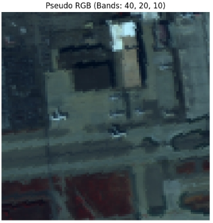
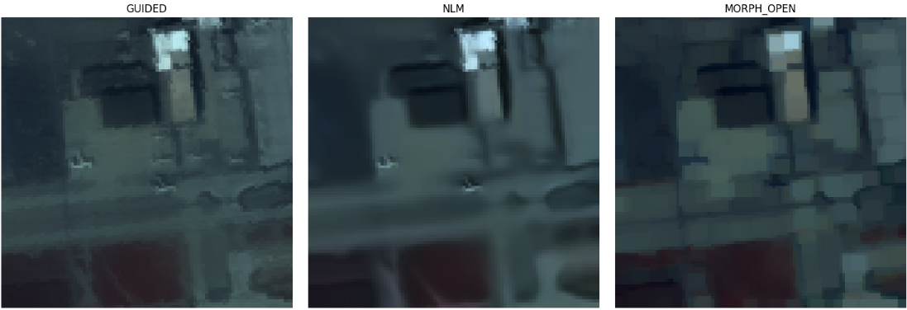

ガイド付きフィルタ（Guided Filter）を筆頭に、これまで紹介した手法よりも**「インテリジェント」かつ「高度」なフィルタ**をいくつか紹介します。

これらのフィルタは、単にぼかしたり強調したりするのではなく、画像内の「構造（エッジ）」をヒントにして処理を行うのが特徴です。

---

### 1. ガイデッドフィルタ (Guided Filter)

バイラテラルフィルタの弱点（計算速度とエッジ付近の不自然な模様）を克服した、非常に強力なフィルタです。

* **特徴**: 「ガイド画像」という別の画像（または自分自身）の構造を参考にしながら平滑化を行います。
* **メリット**: **「エッジを完全に保存」**しながら、背景を滑らかにできます。勾配の計算が線形なため、非常に高速です。
* **異常検知での用途**: 異常検知の「背景（L成分）」と「異常（S成分）」の分離を、計算負荷を抑えて実現したい場合の前処理に最適です。

---

### 2. 非局所平均フィルタ (Non-Local Means Filter / NLM)

これまでのフィルタが「隣のピクセル」しか見ていなかったのに対し、画像全体の「似ている模様」を探して平均化する手法です。

* **特徴**: 画像内のどこかに「同じような色の並び（パッチ）」があれば、遠く離れていてもそれを参考にノイズを除去します。
* **メリット**: テクスチャ（布の目や砂の粒）のような**「繰り返されるパターン」を壊さずにノイズだけを消す**能力が極めて高いです。
* **異常検知での用途**: 非常にノイジーなハイパースペクトル画像において、微細なターゲットの形を崩さずにSN比を上げたい場合に使用します。

---

### 3. モルフォロジー演算 (Morphological Operations)

画素値の計算ではなく、図形的な「太らせる（膨張）」「細らせる（収縮）」という操作を組み合わせる手法です。

* **オープニング (Opening)**: 収縮した後に膨張させる。
* **用途**: 小さな点状のノイズを完全に消去します。
* **クロージング (Closing)**: 膨張した後に収縮させる。
* **用途**: 物体の中にある小さな穴を埋めます。
* **異常検知での用途**: 検知結果（スコアマップ）に対して適用し、バラバラに散らばったノイズ点を除去して、「塊」としての異常だけを抽出する後処理に使われます。

---

### 4. ドメイン変換フィルタ (Domain Transform Filter)

バイラテラルフィルタのようなエッジ保存平滑化を、1次元の信号処理に落とし込んで高速化した手法です。

* **特徴**: 画像の複雑さを「距離」に変換し、エッジがある場所では「距離が非常に遠い」とみなして平滑化を止めます。
* **メリット**: ガイデッドフィルタと同様に高速で、非常に鮮明なエッジ保存が可能です。

---

### 特殊フィルタのまとめリスト

| 手法名                       | キーワード                 | 異常検知での主な使い道                       |
| ---------------------------- | -------------------------- | -------------------------------------------- |
| **ガイデッドフィルタ** | 高速・高精度な構造保存     | 背景の平滑化。ハロー（光漏れ）抑制。         |
| **NLMフィルタ**        | パッチ類似性               | 高ノイズ下でのターゲット形状保持。           |
| **モルフォロジー**     | 形状操作（太らす・細らす） | 検知後のノイズ点除去（後処理）。             |
| **異方性拡散**         | 熱伝導方程式               | 段階的にノイズを消しつつ、境界を際立たせる。 |

---

### 実装のアドバイス

`Guided Filter` は `OpenCV` の拡張モジュール（`opencv-contrib-python`）に含まれています。

```python
# OpenCVの拡張版が必要ですが、基本的な使い方は以下の通りです
# dst = cv2.ximgproc.guidedFilter(guide=img, src=img, radius=8, eps=0.01)

```

これまで多くのフィルタを見てきましたが、HSI（ハイパースペクトル画像）の解析においては、**「バイラテラル」または「ガイデッドフィルタ」**で背景を整え、最後に**「モルフォロジー」**で細かいゴミを消すという流れが、実務上最も安定します。

これらの中で、具体的に実装コードを見てみたいフィルタはありますか？あるいは、今お持ちのデータで「ここがどうしてもノイズになる」といった具体的な悩みがあれば、最適な組み合わせを提案します。


__実験__

オリジナル画像



実際に使ってみた結果は以下の通り。


