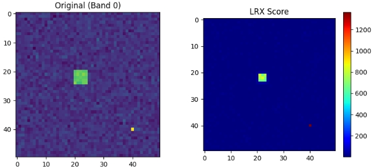
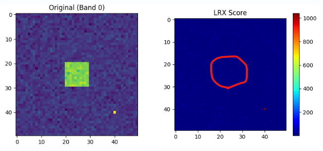
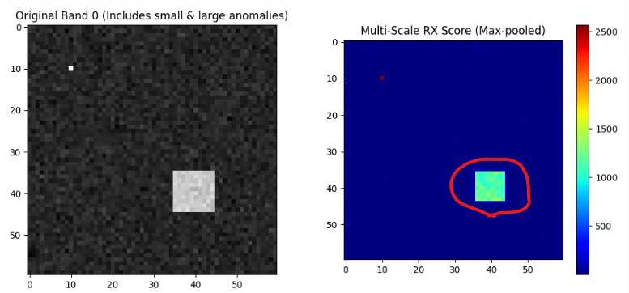

統計的な異常検知手法であるLRX。
同手法は、RXと呼ばれる手法の弱点であった局所的な異常検知能力を向上したものです。
この手法は異常を捉えるという意味では大きな改善をもたらしました。(多分、現実的な異常の定義をより現実的に包含することが出来たからと思います)

しかし、LRXにも弱点があります。

本日は、LRXの弱点と、改善方法となった手法について説明します。

## LRXの弱点

はい、その認識で**間違いありません。**

より正確に「LRXが何を見ているか」を言語化すると、以下のようになります。

> **「外窓（背景エリア）の統計的なバラツキ具合に基づいた物差しで測ったとき、ターゲット（中心画素）がどれだけ平均から遠くへ突き抜けているか」**

この仕組みを理解するための重要なポイントを整理します。

### 1. マハラノビス距離が意味すること

単なる「色の差（ユークリッド距離）」ではなく「マハラノビス距離」を使う理由は、背景の **「馴染みやすさ」** を考慮するためです。

* **背景エリアの分布**: 例えば「森」の画像なら、緑色の濃淡（バラツキ）は「普通のこと」として許容されます。
* **検出の仕組み**:
* 背景エリアでよくある変動方向（例：緑の明暗）に対しては、距離を**短く**見積もります。
* 背景エリアに存在しない変動方向（例：突発的な赤色）に対しては、距離を**非常に長く**見積もります。

### 2. 「内窓」と「外窓」の役割分担

ご質問にあった「内窓と外窓の関係」は、LRXの検出力において以下のような数式上の役割を持っています。

* **外窓（背景）**: 「物差し」を作ります。
* ここで **平均（$\mu$）と共分散行列（$\Sigma$）** を求めます。これが「この場所での正常の基準」になります。

* **内窓（ターゲット周辺）**: 「異物」を孤立させます。
* ターゲット画素 $y$ がこの「物差し」にかけられます。内窓があるおかげで、ターゲット自身やそのすぐ隣の異常成分が背景の統計（物差し）に混ざるのを防ぎ、距離（スコア）を最大化させます。

### 3. なぜ「サイズが大きい異常」で不利になるのか

前述の通り、検出力は **「外窓に対する内窓の異質さ」** に依存します。

* **異常が内窓より大きい場合**:
異常の一部が外窓（背景エリア）に漏れ出します。すると、背景の統計量（共分散行列 $\Sigma$）が「異常な色」を「よくある変動」だと勘違いして学習してしまいます。
* **結果**:
物差し自体が異常な色に合わせて伸びてしまうため、**マハラノビス距離が相対的に小さくなってしまい、検知できなくなる**のです。

### 実演

実際にLRXを使って、異常のサイズを変えて異常検知を行ってみました。

異常サイズが外窓よりも小さいケース

異常サイズを外窓よりも大きくしたケース

異常サイズが外窓よりも大きくなると検出できなくなります。

## マルチスールRX
先述の課題に対応する方法としてマルチスケールRX（Multi-Scale RX）という手法が考えられます。
以下、同手法について説明していきます。

## マルチスケール RXとは？

**マルチスケール RX**は、従来のRX（Reed-Xiaoli）検知器やその局所版であるLRXが抱えていた、 **「異常のサイズと窓サイズが合わないと検知能力が著しく低下する」** という問題を解決するために開発された手法です。

簡単に言えば、 **「異なる大きさの窓を複数同時に使い、小さな異常から大きな異常まで一網打尽にする」** アプローチです。

### 1. 解決しようとした課題：窓サイズのジレンマ

LRXのような局所検知器には、常に以下の **「二律背反（トレードオフ）」** がつきまといます。

* **小さい窓（Small Window）の限界**:
点状の小さな異常には敏感ですが、**大きな異常**に対しては、異常そのものが背景統計（共分散行列）に混入してしまい、異常を背景として処理してしまう **「自己消去（Self-reconstruction）」** が起きます。
* **大きい窓（Large Window）の限界**:
大きな異常を背景に混ぜずに捉えられますが、**小さな異常**に対しては、背景の平均化効果が強まりすぎて、異常の信号が統計的に薄まって（希釈されて）見逃してしまいます。

実世界の画像（空撮、工業製品検査など）では、**サイズの異なる異常が混在している**ことが多く、単一の窓サイズではどうしても「取りこぼし」が発生していました。

### 2. マルチスケール RX の仕組み

この手法は、一つの画素に対して **「異なるスケールの検知器を並列で動かす」** という構造を持っています。

#### ① 複数のスケールで計算

例えば、以下の3つの窓セットで同時にRXスコアを計算します。

* **Scale 1**: 内窓 3x3 / 外窓 7x7（極小の異常用）
* **Scale 2**: 内窓 7x7 / 外窓 15x15（中くらいの異常用）
* **Scale 3**: 内窓 15x15 / 外窓 31x31（大きな塊の異常用）

#### ② スコアの統合（Fusion）

各スケールから出力された異常スコアマップ $S_1, S_2, \dots, S_k$ を、最終的な1枚のマップに統合します。最も一般的な統合ルールは 「Max-Pooling（最大値採用）」 です。

$$Score_{final}(x, y) = \max \{S_1(x,y), S_2(x,y), \dots, S_k(x,y)\}$$

これにより、どれか一つの窓サイズで強く反応すれば、最終結果として採用されるようになります。

### 3. この手法のメリット・デメリット

| 特徴 | メリット | デメリット |
| --- | --- | --- |
| **検知能力** | **異常のサイズを問わず**高い感度を維持できる。 | 小さな異常が密集している場合、大きな窓で「一つの巨大な異常」と誤認することがある。 |
| **ロバスト性** | 背景のテクスチャが複雑でも、適切なスケールがどこかで補足してくれる。 | 背景の不均一な部分（エッジなど）で **誤報（False Alarm）** が増える傾向がある。 |
| **計算負荷** | **非常に高い**。窓の数だけ計算を繰り返すため、処理時間が倍増する。 | リアルタイム処理にはGPUやアルゴリズムの工夫が必須。 |

### 4. まとめ：なぜこれが選ばれるのか

マルチスケール RX は、 **「ターゲットがどれくらいの大きさか分からない」** という実務上の不安を解消するための最も堅実な解決策です。

## 実験

マルチスケールRXを実際に実装してみました。

レポジトリは以下に保管しています。

https://github.com/Shinichi0713/recommendation-ai/tree/main/anormaly_detect_techs/techs/multi_scale_rx

先程検知できなかったサイズを含む異常が検知できるかについて確認してみます。

検知出来ました。
窓サイズをマルチにしたので、結果も想像つきやすいものだったかと思います。

## まとめ
LRXは実装が簡単で、検知力が高いので初めの異常検知のトライアルではやりやすい手法と言えます。

しかし、窓サイズにかかわる課題があるため、うまくいかない原因を抱えています。

そこで窓サイズをマルチに変化させて、検知を行うことで弱点を補うマルチスケールRXという手法が次に行うおススメ手法になります。

また。
最近では、単に最大値をとるだけでなく、各スケールの結果を重み付けして統合する手法や、ディープラーニングと組み合わせて最適なスケールを自動選択する発展的な手法も研究されています。

