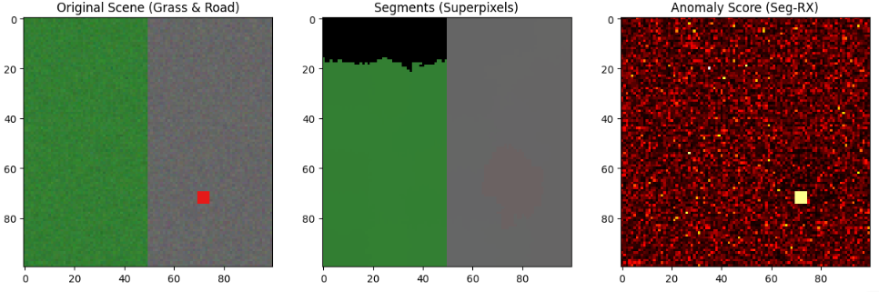

セグメンテーション・ベース RX (Segmentation-based RX) が解決しようとした最大の課題は、 **「背景の不均一性による統計モデルの破綻（および、それに伴うエッジでの誤報）」** です。

具体的にどのような物理的・数学的課題を解決しようとしたのか、3つのポイントに分けて解説します。

## 解決したい課題
### 1. 境界線（エッジ）での「偽陽性（False Alarm）」の抑制

従来のLRXが抱える最大の弱点は、先ほど議論した「草原と道路の境界」のように、窓の中に2つ以上の異なる背景が混ざることでした。

* **課題** : 従来のLRXでは、境界線上に窓がくると「草原の緑」と「道路の灰色」が混ざった統計量（平均と分散）が作られます。すると、ターゲットが純粋な「道路」であっても、混合平均からは遠いため「異常」と判定されてしまいます。
* **解決** : セグメンテーションにより、まず「ここは草原の塊」「ここは道路の塊」と領域を分けます。ターゲットが道路上にあるなら、**背景統計を同じ「道路」のセグメントからのみ抽出**します。これにより、草原の情報が混ざらなくなり、境界線での誤報を根本から消去しました。

### 2. 背景統計の「希釈（Dilution）」の防止

* **課題** : 従来のLRXで外窓の中に異なる素材（例：木、土、水）が混ざると、共分散行列（物差し）が不必要に巨大化します。これを「統計の希釈」と呼びます。
* **影響** : 物差しがガバガバになると、その中に本来見つけたいはずの「真の異常」が収まってしまい、検知できなくなります。
* **解決** : セグメンテーション・ベースでは、統計をとる対象を「同じ素材」に限定するため、**背景の分散が非常に小さく、鋭い物差し**になります。その結果、わずかな異変でも敏感に察知できる（検出力が高まる）ようになります。

### 3. 「四角い窓」という幾何学的制約からの脱却

* **課題** : 実際の地形や対象物は、LRXが仮定するような「四角形」ではありません。川は曲がっていますし、森の境界は複雑です。スライディングウィンドウ（四角い窓）では、どうしても周囲の不要な情報を取り込んでしまいます。
* **解決** : セグメンテーション（特にスーパーピクセルなど）を使うことで、**背景の「形状」に合わせて適応的に比較対象を選ぶ**ことができます。これにより、地形の複雑さに左右されないロバストな検知が可能になりました。

### まとめ：何が変わったのか？

| **特徴**         | **従来の LRX**     | **Segmentation-based RX**                |
| ---------------------- | ------------------------ | ---------------------------------------------- |
| **背景の仮定**   | 窓内は単一の素材である   | 画像は複数の意味ある塊で構成される             |
| **エッジの扱い** | 激しく反応（誤報の原因） | **「隣の領域」として無視できる**         |
| **検出感度**     | 混合背景では鈍くなる     | 均一な領域内のみで測るため**非常に鋭い** |

**「同じ仲間（セグメント）の中で、お前だけ変じゃないか？」**と問うのがセグメンテーション・ベース RX の本質です。

## 仕組み
セグメンテーション・ベース RX（Segmentation-based RX）が異常を検出するロジックは、一言でいえば **「村社会（セグメント）の常識から外れた異分子探し」** です。

従来のLRXが「機械的な四角い窓」という境界線に縛られていたのに対し、この手法は **「色の似ている塊（セグメント）」を一つの基準** として利用します。具体的な検出の仕組みは以下の3段階で行われます。

### 1. 「背景」の定義：似た者同士でグループを作る

まず、画像全体を色の類似性に基づいてバラバラの領域（セグメント）に分けます。これにより、草原は「草原グループ」、道路は「道路グループ」という風に、地形に沿った背景の「物差し」が作成されます。

* **ここがポイント**: 四角い窓とは違い、**境界線（エッジ）をまたいで統計を計算することがありません。**

### 2. 「物差し」の作成：セグメント内の「普通」を数値化する

各セグメントの中で、そこに属する画素たちの **平均色（$\mu$）** と **バラツキ具合（共分散行列 $\Sigma$ ）** を計算します。

* **草原グループの場合**: 「緑色のバリエーション」がこのグループの「普通」になります。
* **道路グループの場合**: 「灰色の明暗の範囲」がこのグループの「普通」になります。

セグメンテーションによって背景が純粋な（混ざりもののない）状態になるため、この物差しは非常に精密で鋭いものになります。

### 3. 「異常スコア」の算出：マハラノビス距離による判定

各ピクセル  に対して、そのピクセルが所属しているグループの物差しを使って、どれだけ「普通」から離れているかを計算します。

* **背景ピクセル（正常）**: 自分のグループの平均に近く、バラツキの範囲内に収まるため、スコアは**低く**なります。
* **異常ピクセル（異物）**: セグメント内に紛れ込んだ「色の違う点」は、そのグループの平均から大きく突き抜け、物差しの外側へとはみ出します。その結果、スコアが**高く**なり、異常として検出されます。

$$Score = (x - \mu_{target})^T \Sigma_{target}^{-1} (x - \mu_{target})$$

### なぜこれが「境界線の誤報」を消せるのか？

これがこの手法の最大のメリットです。

* **草原側の道路際ピクセル**: 「草原グループ」の物差しで測られます。少し灰色っぽくても、草原の統計（物差し）からは「草とは違うが、道路とも違う何か」ではなく、単に **「草の端っこ」として処理される、あるいは別のセグメントとして孤立する** ため、境界線が派手に光るのを防げます。
* **道路側の草際ピクセル**: 同様に「道路グループ」の物差しで測られるため、草原が混ざることによる統計の歪みが起きません。

### まとめ：検出のプロセス

1. **領域分割**: 地形に沿った「背景の村」を作る。
2. **統計抽出**: 各村の「常識（平均と分散）」を計算する。
3. **距離測定**: 村の常識から浮いている画素を「異常」として炙り出す。

この仕組みによって、 **「道路と草原の境界」という複雑な場所でも、それぞれの背景に馴染ませることで誤報を消し、その中に隠れた「本当の異物」だけを際立たせる** ことができるのです。

## 実装
セグメンテーション・ベース RX（Segmentation-based RX）を実装するための具体的な手順を解説します。

この手法の鍵は、 **「四角いスライディングウィンドウ」を捨て、「スーパーピクセル（似た色の画素の集合体）」を単位として統計を計算する** 点にあります。

### 実装の4ステップ

#### 1. 画像のセグメンテーション（領域分割）

まず、画像を「スーパーピクセル」と呼ばれる小さな塊に分割します。一般的には **SLIC (Simple Linear Iterative Clustering)** アルゴリズムが使われます。

* **役割**: 隣り合う似た色の画素をひとまとめにします。道路は道路、草地は草地の塊になります。

#### 2. セグメントごとの統計量（平均・共分散）の算出

各セグメント（ラベル番号ごと）に属する全画素のスペクトルデータを取り出し、そのセグメント内での平均 $\mu_k$ と 共分散行列 $\Sigma_k$ を計算します。

* **ポイント**: これが「その領域における正常の基準」になります。

#### 3. 異常スコアの計算

各画素に対して、 **「自分が属しているセグメントの統計量」** を用いてマハラノビス距離を計算します。

$$Score(x) = (x - \mu_k)^T \Sigma_k^{-1} (x - \mu_k)$$

ここで $x$ は画素の値、$k$ はその画素が属するセグメント番号です。

#### 4. ガード（内窓）の概念の適用（オプション）

もし異常がセグメントの大部分を占めてしまう可能性がある場合は、計算対象の画素を統計から除外する処理（LRXの内窓に相当する処理）を加えます。

### 実験

`scikit-image` の SLIC を利用した実装例です。

実装コードは以下に置いています。

https://github.com/Shinichi0713/recommendation-ai/tree/main/anormaly_detect_techs/techs/segmentation-based-RX

セグメンテーションRXで。ダミーで作った異常を検知した結果を示します。

ご提示したコードを実行した際に得られる結果（特に「草原と道路の境界線」があるシーン）について、**なぜ境界線の誤報が消え、異常だけが浮き彫りになるのか**、その内部的なメカニズムを3つの観点から分析します。

__1. セグメンテーションによる「統計の純道」の確保__

このコードの最大の特徴は、統計を計算する前に「背景を仲間ごとに分断した」ことにあります。

* **境界線付近の挙動**:
従来のLRXでは、境界線上の画素を測る際、窓の中に「緑（草）」と「灰色（道）」が混ざり、平均が「汚れた色」になっていました。
しかし、このコードでは、境界の左側（草）の画素は **「草だけのセグメント統計」** で測られ、右側（道）は **「道だけのセグメント統計」** で測られます。
* **分析結果**:
どちらの画素も「自分のコミュニティの平均」に非常に近いため、マハラノビス距離は極小になります。これにより、 **境界線に沿って発生していた「光る筋（誤報）」が消失** します。

__2. 「鋭い物差し」による異常の際立ち__

セグメント内の画素は色が非常に似通っているため、共分散行列 （データのバラツキ）が非常に小さく計算されます。

* **異常箇所の挙動**:
道路セグメントの中に「赤い物体」がある場合、道路セグメントの物差しは「灰色の微小な変化」しか許容しない非常に厳しいものになっています。
* **分析結果**:
「赤」という色は、この鋭い物差し（小さな分散）で測ると、**背景の平均から見て「天文学的な距離」**にあると判定されます。
結果として、背景のスコアが `0.1` 程度であるのに対し、異常箇所だけが `100` や `1000` といった圧倒的なハイスコアを叩き出し、コントラストが劇的に向上します。

__3. 注意すべき「自己消去（Self-purging）」のリスク__

分析において一点、注意が必要な「負の側面」もあります。

* **現象**:
もし異常物体が大きく、一つのセグメントの大部分を占めてしまった場合、そのセグメントの「平均 」自体が異常物体の色に引きずられてしまいます。
* **分析結果**:
「異常な色」がそのセグメントの「標準」として学習されてしまうため、**異常であるはずの場所のスコアが逆に低くなってしまう**現象が起きます。
これを防ぐには、`n_segments` を増やしてセグメントを細かくしすぎない、あるいは異常サイズよりも明らかに大きなセグメントが形成されるように調整する必要があります。

### この手順で「境界線の誤報」が消える理由

このコードを実行すると、境界線（エッジ）の挙動が劇的に変わります。

* **従来のLRX**: エッジ部分では「緑」と「灰色」が混ざった無理な統計で計算するため、エッジ上の画素がすべて異常（高スコア）になります。
* **セグメンテーション・ベース**: エッジの「緑側」の画素は「緑のセグメント統計」で計算され、「灰色側」は「灰色のセグメント統計」で計算されます。どちらも**自分の仲間の基準で測られる**ため、境界線が異常として光ることはありません。

### 次のステップ：精度をさらに高めるには？

この手法の弱点は、 **「セグメンテーション自体が失敗する（異常と背景を一つの塊にしてしまう）」** ことです。

これを防ぐために、 **「最初は細かく分割し、隣り合うセグメントの統計が似ていれば結合する」** という適応的なアプローチ（Hierarchical Segmentation）を組み合わせることが多いです。

