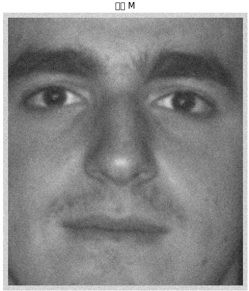
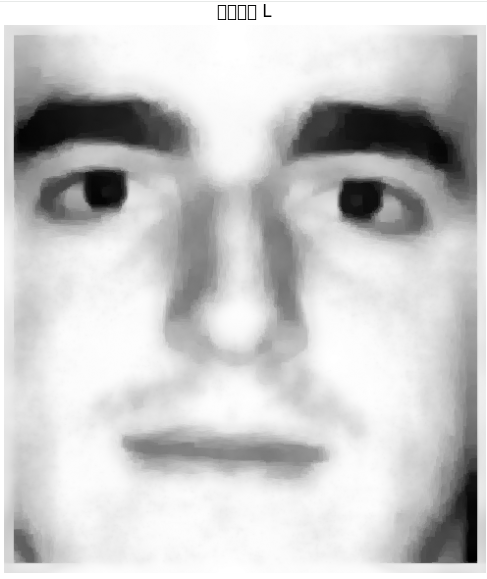
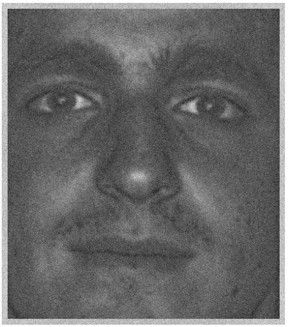
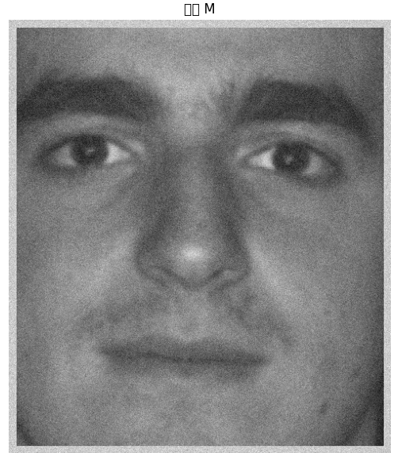
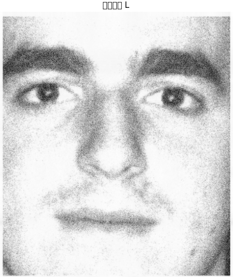
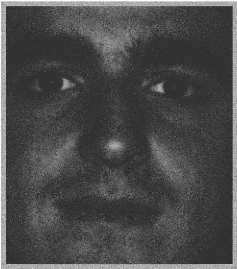

```python
M = cv2.imread("/content/face_image.png")
# グレースケールへの変換
# 画像読み込み
M = cv2.cvtColor(M, cv2.COLOR_BGR2GRAY)
# ★ここで float64 に変換
M = M.astype(np.float64)
# --- ノイズ強度の設定 ---
# 0から255のスケールの場合、10〜30程度で目に見えるノイズになります
noise_sigma = 20.0 
# Mと同じ形状のランダムな値を生成（平均0, 標準偏差 noise_sigma）
noise = np.random.normal(0, noise_sigma, M.shape)
# ノイズを画像に加算
M_noisy = M + noise
```

gamma = 1.0

ノイズを掛けたもと画像


ロウランク


スパース


gammma = 0.0
ノイズを掛けたもと画像


ロウランク


スパース


## 更新式

結論から言うと、**「TV付きRPCAっぽい処理」ではありますが、厳密な意味での TV-RPCA の ADMM 実装としてはまだ不適切**です。
一番大きい理由は、**低ランク項（核ノルム）の扱い**が数式と噛み合っていないことです。

### 何がよいか

* `S` の更新をソフトしきい値で解いているのは、(\ell_1) 正則化として自然です。
* `G` を `grad(L)` の補助変数として分けて、TV の shrink をかける流れも自然です。
* `fft2 / ifft2` で `I + ∇^T∇` を解く発想も、**周期境界条件**を許すなら妥当です。

### 何が問題か

#### 1. `svt(L_tilde, 1/rho)` が ADMM として不整合

TV-RPCA の典型的な目的関数はだいたい

[
\min_{L,S}\ |L|_* + \lambda|S|_1 + \gamma,TV(L)
\quad \text{s.t.}\quad M=L+S
]

です。
このとき、**核ノルム (|L|_*)** は `L_tilde` に後から SVT をかければよい、というものではありません。

SVT は本来、**核ノルムを担当する独立変数**に対する proximal operator です。
つまり、`L` と別に `J` のような補助変数を置いて、

* `J = L`
* `J` に対して SVT

という形にしないと、ADMM の形としてきれいにつながりません。

今のコードは、

* `L` を FFT で解いてから
* その結果に SVT をかける

という二段構えになっていて、**「TV + data fidelity の解」に「核ノルムの近似」を後付けしている**状態です。これは厳密解ではありません。

#### 2. 目的関数が曖昧

このコードは見た目としては

* ( \ell_1 ) の疎成分 `S`
* TV の補助変数 `G`
* 低ランク化のための SVT

を全部入れていますが、**その3つを同時に最適化する正しい分離がありません**。
なので、現状は「TV-RPCA」ではなく、**TV + 疎分解 + 低ランク化のハイブリッド試行版**という位置づけです。

#### 3. 収束判定が弱い

`L` の変化量だけで止めるのは弱いです。
ADMM では普通、

* primal residual: `M - L - S`
* TV residual: `grad(L) - G`
* さらに dual residual

を見ます。
`L` があまり変わらなくても `S` や `G` が揺れていることはあります。

#### 4. `np.roll` は周期境界条件になる

`np.roll` による差分は、画像の端が反対側とつながる**周期境界**になります。
画像処理では端が回り込んでアーティファクトが出やすいです。
自然画像なら、通常は **反射境界** や **ゼロ境界** を意識した実装のほうが無難です。

---

## どう直すべきか

### 方式A: 本当に TV-RPCA にする

補助変数 `J` を追加してください。

[
\min_{L,S,J,G}\ |J|_* + \lambda|S|_1 + \gamma|G|_1
]
s.t.
[
M=L+S,\quad J=L,\quad G=\nabla L
]

この形なら、

* `S` 更新：soft threshold
* `G` 更新：soft threshold
* `J` 更新：SVT
* `L` 更新：FFT で線形方程式

という分離が正しくなります。

### 方式B: SVT を外して TV-RPCA 風にする

もし低ランクを厳密には入れず、**TV + sparse decomposition** をやりたいだけなら、`svt` を削除します。
その場合は「低ランク RPCA」ではなくなりますが、実装としては整合します。

---

## 参考になる更新式の形

補助変数 `J` を入れるなら、`L` 更新は概念的にこうなります。

[
(2I + \nabla^T\nabla)L
======================

(M-S+U_1) + (J-U_3) + \nabla^T(G-U_2)
]

ここで `U1, U2, U3` は scaled dual です。
この形なら、`J` に SVT をかける場所がちゃんとあります。


では、**ADMM の標準形からきっちり導出**します。
（スケールド形式で書きます。実装と1対1対応させます）

---

# 1. 問題設定（分割後）

[
\min_{L,S,J,G};
|J|_* + \lambda |S|_1 + \gamma |G|_1
]

[
\text{s.t.}\quad
\begin{cases}
M = L + S \
J = L \
G = \nabla L
\end{cases}
]

---

# 2. スケールド Augmented Lagrangian

スケールド双対変数 (U_1, U_2, U_3) を使うと：

[
\mathcal{L}*\rho =
|J|** + \lambda |S|_1 + \gamma |G|_1
]

[

* \frac{\rho}{2} |M - L - S + U_1|_F^2
* \frac{\rho}{2} |L - J + U_2|_F^2
* \frac{\rho}{2} |\nabla L - G + U_3|_F^2
  ]

---

# 3. 各変数の更新式

## (1) S 更新

[
\min_S \lambda |S|_1 + \frac{\rho}{2} |M - L - S + U_1|^2
]

これは proximal：

[
S = \text{Soft}(M - L + U_1,; \lambda/\rho)
]

---

## (2) J 更新（核ノルム）

[
\min_J |J|_* + \frac{\rho}{2} |L - J + U_2|^2
]

これも proximal：

[
J = \text{SVT}(L + U_2,; 1/\rho)
]

---

## (3) G 更新（TV）

[
\min_G \gamma |G|_1 + \frac{\rho}{2} |\nabla L - G + U_3|^2
]

成分ごとに：

[
G = \text{Soft}(\nabla L + U_3,; \gamma/\rho)
]

---

## (4) L 更新（ここが本質）

[
\min_L
\frac{\rho}{2} |M - L - S + U_1|^2

* \frac{\rho}{2} |L - J + U_2|^2
* \frac{\rho}{2} |\nabla L - G + U_3|^2
  ]

---

### 勾配を取る

#### 第1項

[
\nabla_L \frac{1}{2}|M - L - S + U_1|^2
= -(M - L - S + U_1)
]

#### 第2項

[
\nabla_L \frac{1}{2}|L - J + U_2|^2
= (L - J + U_2)
]

#### 第3項（重要）

[
\nabla_L \frac{1}{2}|\nabla L - G + U_3|^2
= \nabla^T(\nabla L - G + U_3)
]

---

### 合わせる

[
0 =
-(M - L - S + U_1)

* (L - J + U_2)
* \nabla^T(\nabla L - G + U_3)
  ]

整理：

[
(M - L - S + U_1)
= (L - J + U_2)

* \nabla^T(\nabla L - G + U_3)
  ]

---

### L をまとめる

[
M - S + U_1
===========

2L - J + U_2 + \nabla^T \nabla L - \nabla^T(G - U_3)
]

---

### 最終形

[
(2I + \nabla^T \nabla) L
========================

(M - S + U_1)

* (J - U_2)
* \nabla^T (G - U_3)
  ]

---

# 4. FFTで解く形

周期境界なら：

[
\mathcal{F}(L)
==============

\frac{
\mathcal{F}(\text{RHS})
}{
2 + |\hat{D_x}|^2 + |\hat{D_y}|^2
}
]

ここで

* (D_x, D_y)：差分カーネル
* (\nabla^T \nabla)：離散ラプラシアン

---

# 5. 双対変数更新

[
U_1 \leftarrow U_1 + (M - L - S)
]

[
U_2 \leftarrow U_2 + (L - J)
]

[
U_3 \leftarrow U_3 + (\nabla L - G)
]

---

# 6. まとめ（実装対応）

| 変数 | 更新                    |
| -- | --------------------- |
| S  | soft(M - L + U1, λ/ρ) |
| J  | SVT(L + U2, 1/ρ)      |
| G  | soft(∇L + U3, γ/ρ)    |
| L  | FFTで線形方程式             |
| U  | 残差加算                  |

---

# 重要な理解ポイント

今回の本質はここです：

### ❌ ダメなやり方（元コード）

* L を解いてから SVT

### ✅ 正しいやり方

* **低ランクは J に分離して SVT**
* **L は純粋に二次問題として解く**

---

必要なら次に：

* 非周期境界版（Neumann条件）
* カラ―画像（3D拡張）
* 高速化（preconditioned CG）

まで一気に拡張できます。


