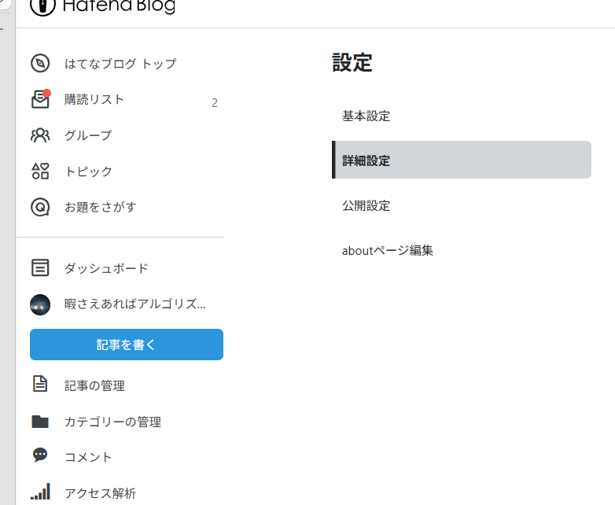
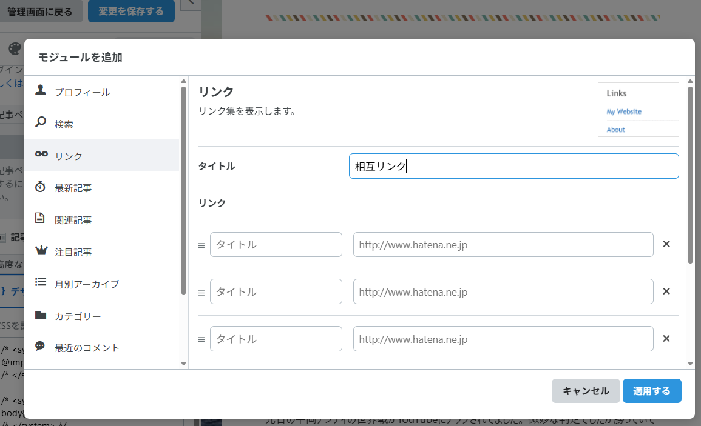

1. 詳細設定

はてなブログで他サイトと相互リンクを作成するには、大きく分けて

1. 相手サイトのリンクを自分のブログに貼る  
2. 相手に「相互リンクの依頼」をして、自分のブログへのリンクを貼ってもらう  

という2つのステップが必要です。以下では、はてなブログでの具体的なやり方を順に説明します。

---

## 1. 相手サイトのリンクを自分のブログに貼る方法

### 1-1. リンク用のページ・場所を決める
- 相互リンク専用の固定ページ（例：「リンク集」「おすすめサイト」など）を作る  
- または、サイドバー（プロフィール欄・フッターのHTML欄）にリンク集を設置する  

### 1-2. はてなブログでリンクを貼る手順
1. ブログの管理画面から「記事を書く」または「デザイン設定」を開く  
2. リンクを貼りたい場所（記事本文やHTMLウィジェットなど）をクリック  
3. リンクを挿入したいテキストを選択し、ツールバーの「リンク」アイコン（鎖のマーク）をクリック  
4. 「リンク先URL」に相手サイトのURLを入力し、「リンクテキスト」に表示したい文字（サイト名など）を入力  
5. 「OK」をクリックして保存  

これで、自分のブログから相手サイトへのリンクが完成します。

---

## 2. 相手に相互リンクを依頼する方法

### 2-1. 依頼相手を選ぶ
- 同じテーマ・ジャンルのブログやサイトを探す  
- はてなブログ同士であれば、「言及」機能で交流しやすい  

### 2-2. 依頼メッセージの書き方（例）
- 件名：相互リンクのお願い  
- 本文例：  
  「〇〇様  
  いつもブログを拝見しております。  
  私も〇〇についてのブログを運営しております。  
  もしよろしければ、相互リンクをさせていただきたくご連絡いたしました。  
  すでに私のブログに貴サイトへのリンクを設置しております。  
  ご検討いただけますと幸いです。  
  私のブログ：https://xxxxx.hatenablog.com/  
  よろしくお願いいたします。」

### 2-3. 依頼の送り方
- 相手ブログに「お問い合わせフォーム」があれば、そこから送る  
- はてなブログ同士であれば、記事内で相手ブログのURLを書くと「言及」として通知が届くので、そのコメント欄で依頼する方法もある  

---

## 3. はてなブログ特有の機能「言及」を使う

はてなブログには「言及」という機能があり、記事内で他のはてなブログのURLを書くと、相手ブログの管理者に通知が届きます。  
これを使うと、自然な形で相手に自分の存在を知ってもらい、相互リンクのきっかけを作りやすくなります。[はてなブログ 言及機能の説明](https://iamtamatama.hatenadiary.jp/entry/2025/05/18/094000)

---

## 4. 相互リンクのポイント・注意点

- **テーマが近いブログを選ぶ**：全く関係ないジャンルだと読者も混乱し、SEO的にも効果が薄くなりがちです。[相互リンクの選び方・手順](https://www.zero-pri.com/entry/blog-sougo-link)
- **まずは自分からリンクを貼る**：相手に誠意を示すため、先に自分のブログに相手のリンクを貼ってから依頼するのが一般的です。[相互リンクの依頼の仕方](https://nekoyogurt.com/pvup/reciprocallink/)
- **過度な相互リンクは避ける**：不自然に大量の相互リンクを貼ると、検索エンジンからスパムと見なされる可能性があります。[SEOにおける相互リンクの注意点](https://communityserver.org/contents/5434/)

---

## まとめ

1. 自分のブログに「リンク集」ページやサイドバーウィジェットを作る  
2. 相手サイトのURLを、はてなブログのリンク挿入機能で貼る  
3. 相手にメールやお問い合わせフォーム、言及コメントなどで相互リンクを依頼する  
4. テーマが近いブログを選び、自然な形でリンクし合う  

この流れで、はてなブログでも他サイトとの相互リンクを安全に作成できます。  
もし「サイドバーにリンク集を設置する具体的な手順」など、さらに細かい部分が知りたい場合は、その点を教えていただければ詳しく説明します。
