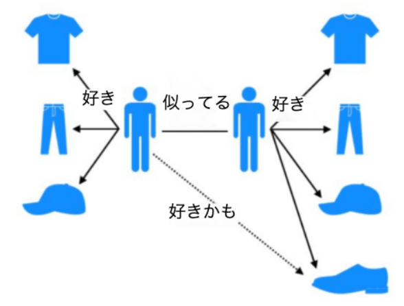
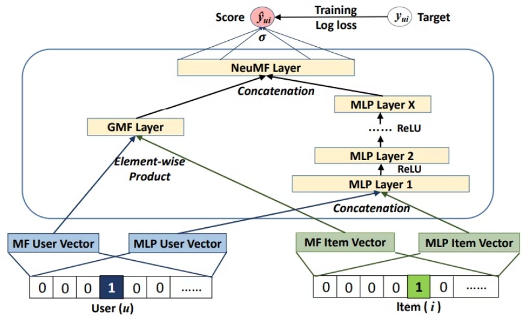

## 概要
開発するAIモデルにユーザー個々のパーソナライズな好みで出力を制御する仕組みが出てきた。<br>
実現可能な手法を調査すべく手法調査と検討を行う。


## レコメンドAIの種類

- ルールベース
    定義されたビジネスロジックに基づいて推薦を行う。推薦の透明性が高く、目標に合わせて容易に調整可能。

- アイテムベースレコメンド
    ユーザーが過去に好意的な評価をしたアイテムと類似性が高い商品やサービスを推薦する方式。この方法は、アイテム間の類似性を計算することに焦点を置いています。
    例. ある映画に高い評価を付けた視聴者には、あらすじ、ジャンル、監督、出演俳優などが似ている映画を推薦します。
    メリット：新規のユーザーやアイテムに対しても比較的効果的な推薦が可能である

- パーソナライズドレコメンド
    個々のユーザーの独特な好みや興味に適応する、高度なカスタマイズを行える推薦手法。ユーザーが直接的あるいは間接的に提供した情報（購入履歴、検索クエリ、閲覧履歴など）を活用して、個人レベルで最も関連性の高いアイテムを割り出します。<br>
    しばしば深層学習や複雑な予測モデルが用いられ、非常に精緻でパーソナライズされたユーザー体験を実現<br>

- 協調フィルタリング
    「ユーザーベースの推薦」として知られ、ユーザー間の振る舞いや好みの類似性を分析する方法。あるユーザーが気に入ったアイテムを他の似た好みを持つユーザーにも推薦する手法です。<br>
    大量のユーザーデータとアイテムの評価履歴が必要であり、人々がどのようなアイテムを評価し、どのように反応したかのパターンを基に、推薦が作られます。<br>

>過去の好みや趣味に近いユーザーの選択に基づいて、ユーザーにモノを推薦するという考え方
>例. 好みのデータを提示
>- ユーザーの行動データ(評価、購入、ダウンロードなど)から、類似のユーザーが好きな製品をユーザーに推薦する
>- アイテム協調フィルタリングアルゴリズム(ItemCF)に基づいて、ユーザーが以前気に入っていたものと似たものを推薦します。


協調フィルタリングの実装自体は例えば以下のような感じ。
ベクトルデータで一番近いものをとってくる感じ。

```
import numpy as np
 
dataset = {
  'UserA': { 'Game1':2.0, 'Game2':4.0, 'Game3':1.0, 'Game4':5.0, 'Game5':1.0, 'Game6':0.0, 'Game7':0.0
  },
  'UserB': { 'Game1':2.0, 'Game2':3.0, 'Game3':1.0, 'Game4':0.0, 'Game5':0.0, 'Game6':4.0, 'Game7':5.0
  },
  'UserC': { 'Game1':5.0, 'Game2':1.0, 'Game3':5.0, 'Game4':0.0, 'Game5':0.0, 'Game6':0.0, 'Game7':2.0
  },
  'UserD': { 'Game1':4.0, 'Game2':1.0, 'Game3':4.0, 'Game4':3.0, 'Game5':5.0, 'Game6':0.0, 'Game7':0.0
  }
}
 
def getSimilarUsers(user1, user2):
    user1_data = list(dataset[user1].values())
    user2_data = list(dataset[user2].values())
 
    user1_eval_data = [user1_data[i] for i in range(0,3)]
    user2_eval_data = [user2_data[i] for i in range(0,3)]
    
    co = np.corrcoef(user1_eval_data, user2_eval_data)[0,1]
 
    return(abs(co))
 
def getRecommendGame(user):
    similar_user = ''
    best_sim_score = 0.0
    best_sim_g_score = 0.0
    not_user_dataset = dataset.copy()
    user_dataset = not_user_dataset.pop(user)
    user_not_play_games = [k for k, v in user_dataset.items() if v == 0.0]
    
    for u in not_user_dataset.keys():
        tmp_score = getSimilarUsers(user, u)
        
        if best_sim_score <= tmp_score:
            similar_user = u
            best_sim_score = tmp_score
 
    for g in user_not_play_games:
        tmp_g_score = not_user_dataset[similar_user][g]
        
        if best_sim_g_score <= tmp_g_score:
            recommend_game = g
            best_sim_g_score = tmp_g_score
    
    return(recommend_game)
   
print(getRecommendGame('UserA'))
```

## 実装法
https://qiita.com/birdwatcher/items/b60822bdf9be267e1328

### クラシック
アイテム、ユーザーの属性情報をベクトル化して、類似度を測ることで実現している
単純なデータベースと、比較アルゴリズムがあれば実装可能

### ニューラルネットワーク活用
一般系である NCF (Neural Collaborative Filtering) が提案され、NCFの下で表現される GMF (Generalized Matrix Factorization) が提案されました。
Deep NNで協調フィルタリングを作るために、NCFの MLP (Multi-Layer Perceptron) バージョンを提案しています。



### 実験
ロジック分かったので実験できそう
楽に実装という意味で、クラシカルな方法で実験して、感触を確認する

##### バックエンド側
フレームワーク: express
機能：APIサーバーを構築

サーバー起動
```
node index.js
```


###### コードの動作
- ユーザーの行動を投げる
  - サーバに対して/rateに対してpost
- ユーザーの評価を確認する
  - /recommend/(user)としてget


##### フロントエンド側
フレームワーク: Angular
機能：UI。クリックすることでユーザーの好みを調整する


