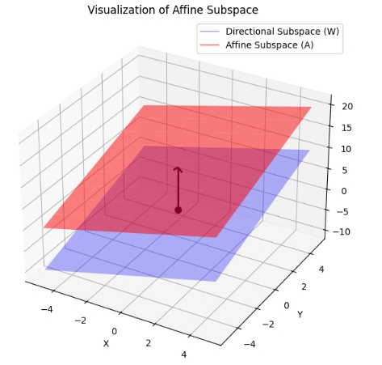

「アフィン部分空間」を一言で言えば、 **「原点を通るとは限らない、平らな空間」** のことです。

線形代数で学ぶ「部分空間（線形部分空間）」は必ず原点を通らなければなりませんが、それを空間内の好きな場所へ**平行移動**させたものがアフィン部分空間です。

## 1. イメージで理解する

もっとも身近な例は、3次元空間の中の「直線」や「平面」です。

* **線形部分空間：**  原点 $(0, 0, 0)$ を通る直線や平面。
* **アフィン部分空間：** 原点を通らなくてもよい、あらゆる直線や平面。

## 2. 数学的な定義

ベクトル空間 $V$ において、アフィン部分空間 $A$ は以下のように定義されます。

>  $V$ の線形部分空間を $W$ とし、ある固定されたベクトル $v \in V$ を選んだとき、
> 
>  $$A = v + W = \{ v + w \mid w \in W \}$$
> 
> と表される集合 $A$ をアフィン部分空間と呼びます。

ここで、$W$ は $A$ の **方向部分空間**と呼ばれ、アフィン部分空間が「どの方向に広がっているか」を決定します。 は原点からその空間まで移動させるための「ズレ（平行移動）」を表します。

>__方向部分空間__
>「方向部分空間」とは、アフィン部分空間が **「どの向きに、どのように広がっているか」** を規定する、ベースとなる線形部分空間のことです。
>__1. 直感的なイメージ__
>アフィン部分空間を「空中に浮かんでいる平らな板（平面）」だと想像してください。
>* その板を、形や向きを変えずにそのままスライドさせて、**原点を通るように移動させたもの**が「方向部分空間」です。
>* つまり、アフィン部分空間から「位置（どこにあるか）」の情報を取り除き、「向きと広がり（どの方向を向いているか）」だけを取り出したものです。
>__2. 数学的な意味__
>アフィン部分空間 $A$ が、ある点 $v$ と線形部分空間 $W$ を使って $A = v + W$ と書けるとき、この **$W$ が方向部分空間** です。
>なぜ  が「方向」を決めていると言えるのかというと、アフィン部分空間内の「2点の差」を考えるとわかります。
>* $A$ の中の任意の2つの点 $p_1, p_2$ を取ると、その差であるベクトル $p_1 - p_2$ は必ず $W$ に属します。
>* 「アフィン部分空間の中での移動」はすべて $W$ のベクトルで表されるということです。

## 3. 具体例

2次元平面（ $xy$ 平面）で考えてみましょう。

* **線形部分空間：**  $y = 2x$ （原点を通る直線）
* **アフィン部分空間：**  $y = 2x + 3$ （$y = 2x$ を $y$ 軸方向に 3 だけ平行移動したもの）

この場合、方向部分空間 $W$ は $y = 2x$ という直線であり、平行移動のベクトル $v$ は $(0, 3)$ などになります。

## 4. なぜ「アフィン」と呼ぶのか？

線形部分空間では「和」と「スカラー倍」について閉じている必要がありますが、アフィン部分空間ではそれらが成り立ちません（例えば、直線 $y = 2x + 3$ 上の点を 2 倍しても、その直線の上には乗りません）。

その代わり、アフィン部分空間では**アフィン結合**という演算について閉じています。

* 点 $P_1, P_2, \dots, P_n$ と、和が 1 になる係数 $a_1 + a_2 + \dots + a_n = 1$ を用いた組み合わせ $a_1P_1 + \dots + a_nP_n$ もまた、同じ空間内に留まります。

### まとめ

| 特徴 | 線形部分空間 | アフィン部分空間 |
| --- | --- | --- |
| **原点** | 必ず通る | 通るとは限らない |
| **形状** | 平ら（直線、平面など） | 平ら（直線、平面など） |
| **構造** | ベクトル空間そのもの | ベクトル空間を平行移動したもの |

アフィン部分空間の考え方は、CGの座標変換や、最適化問題の制約条件（$Ax = b$ の解集合など）で非常に重要な役割を果たします。

### 用途

アフィン部分空間は、数学の理論の中だけでなく、私たちの身近な技術や高度なデータ解析の現場で非常に重要な役割を果たしています。

主に **「基準（原点）がずれている状況を、線形代数の考え方で扱う」** 場面で登場します。代表的な応用例を4つ紹介します。

__1. 3DCGやロボットの制御（アフィン変換）__

ゲームやアニメーションの3DCGでは、キャラクターを移動させたり回転させたりします。

* **回転や拡大**は「線形写像」で表せますが、**平行移動**は線形写像では表せません。
* これらを統一して扱うのが「アフィン変換」です。3D空間内の物体を移動させる際、その物体が動く軌跡や配置される場所はアフィン部分空間として記述されます。

__2. 方程式の解の集合（制約条件）__

線形代数で扱う連立一次方程式  $Ax = b$ を思い出してください。

* $b = 0$ のとき（$Ax = 0$）、解の集合は**線形部分空間**になります（必ず原点を通る）。
* $b \neq 0$ のとき、解の集合は**アフィン部分空間**になります。
> 例えば、「合計100になるように配合を決める」という制約がある場合、その解の選択肢は原点を通らない「平らな集合」の上に並びます。これが最適化問題などで非常に重要です。

__3. データ解析と統計学（回帰分析）__

統計学で最もよく使われる「回帰直線」や「回帰平面」は、まさにアフィン部分空間です。

* 散布図の中に引かれる「データに最もフィットする直線」は、普通は原点  を通りません。
* データを説明するための「モデル（物差し）」として、原点に縛られないアフィン部分空間が使われています。

__4. サポートベクトルマシン (SVM)__

機械学習の古典的な手法である SVM では、データを2つのグループに分けるために「境界線（または境界面）」を引きます。

* この境界となる「超平面（Hyperplane）」はアフィン部分空間です。
* データを真っ二つに分ける壁が、必ずしも原点を通る必要はないため、アフィン部分空間の概念を使って「最もきれいに分ける位置」を計算します。

### まとめ：なぜアフィン部分空間を使うのか？

「世界は原点（ゼロ）を中心に回っていないから」です。

* **線形部分空間：** 原点という「特別な点」に縛られたルール。
* **アフィン部分空間：** 原点からの縛りを解き放ち、　**「平らである」という性質だけを維持** して自由な場所に配置したルール。

物理現象や経済データなど、現実のデータの多くは「ゼロ」を通らないため、アフィン部分空間という枠組みが必要不可欠になります。

## アフィン部分空間の可視化

numpyで可視化してみました。

可視化の内容は、原点を通る平面（方向部分空間）を $z = x + y$ とし、それを $z$ 方向に $+10$ だけスライドさせたアフィン部分空間を描画します。

