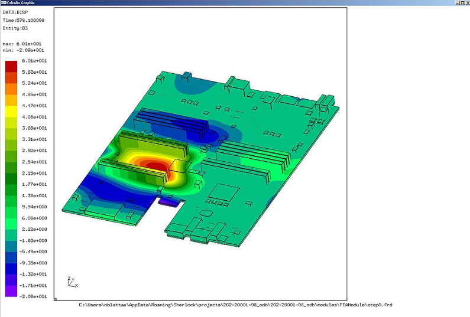
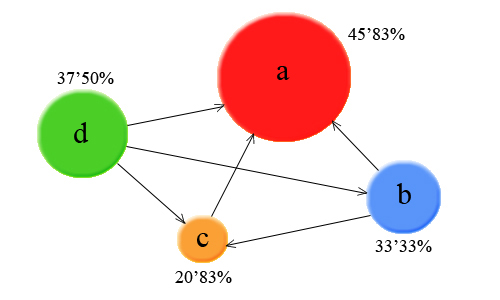

線形代数は大学の必修科目ですが、そもそもなんでやっているか分からないということが多いと思ってます。
少なくとも学生時代の著者はそうでした。

今回は線形代数がなぜ重要なのかについて説明します。

## 線形代数が重要である理由
線形代数が「科学計算の王様」と言われる理由は、一言で言えば **「この世の複雑で非線形な現象を、コンピュータが得意な『直線と格子』の世界に落とし込んで解くため」** です。

なぜこれほどまでに重宝されるのか、3つの決定的な理由に分解して解説します。

### 1. 膨大なデータを「ひとかたまり」で扱うため

現代のデータ（画像、音声、センサーログなど）は、数百万個の数字の羅列です。これを1つずつ変数 `x1, x2, x3...` として計算していたら、プログラムはスパゲッティ状態になります。

* **ベクトルの役割:** 1つの「点」や「状態」をリスト化する。
* **行列の役割:** その「状態」を一気に変換する「ルール」として機能する。

行列を使うことで、 **100万個の計算を「$Ax = b$」というたった1行の式** で表現でき、コンピュータ（特にGPU）はこれを超高速で処理するように設計されています。

### 2. 難しい問題を「線形（直線）」に近似するため

現実世界の現象（流体の動き、経済の変動、ロケットの軌道）は、本来「非線形」で複雑です。しかし、人間もコンピュータも、非線形な問題を直接解くのは非常に苦手です。

そこで、 **「ごく狭い範囲だけを見れば、曲線も直線に見える」** という性質（微分）を利用します。

* **線形近似:** 複雑な曲線を細かく分割し、それぞれの場所で「線形な問題（行列計算）」として解く。
* この「細かく切って行列で解く」というプロセスが、 **有限要素法 (FEM)** などのシミュレーション技術の根幹です。

### 3. 「空間の性質」を数式で操るため

線形代数は、単なる数字の表ではなく **「空間の変形」** を扱う学問です。

* **回転・拡大・投影:** 3DCGでキャラクターを動かす、カメラの視点を変える、これらはすべて行列による空間変形です。
* **次元圧縮:** 100次元ある複雑なデータから、本質的な2〜3次元だけを抜き出す（主成分分析など）。これは、データの「重要な軸（固有ベクトル）」を見つける作業です。

### まとめ：なぜ学ぶのか？

結局のところ、線形代数を学ぶ最大のメリットは、 **「多次元の複雑な問題を、足し算と掛け算だけのシンプルな構造に整理できる」** ことにあります。

* **プログラミング**においては、メモリ効率と計算速度を最大化する武器。
* **理論**においては、高次元の迷宮を整理するための地図。

## 線形代数の重要な計算
線形代数は、現代の科学計算（シミュレーション、データ分析、AIなど）における「言語」そのものです。教科書的な計算手順（手計算での行列式など）よりも、　**「何ができるのか」という概念の理解と、計算機での特性**　を優先して押さえるのが実務への近道です。

特に重要なポイントを整理しました。

### 1. 行列分解（Matrix Decomposition）

科学計算で最も多用される概念です。大きな行列を、扱いやすい性質を持つ行列の積に分解します。

* **LU分解:** 連立方程式  を効率よく解くための標準的な手法。
* **QR分解:** 最小二乗法や固有値計算の基礎。
* **特異値分解 (SVD):** 最も強力なツールの一つ。データの次元圧縮（PCA）や、ノイズ除去、行列のランクの決定に使われます。

### 2. 固有値と固有ベクトル（Eigenvalues & Eigenvectors）

物理現象の「安定性」や「振動」、データの特徴を理解するために不可欠です。

* **主成分分析 (PCA):** 多次元データの主要な方向を特定する。
* **スペクトル分解:** 行列を固有値の重みで分解する。
* **対角化:** 複雑な行列演算（特に行列の累乗 ）を単純化する。

### 3. ベクトル空間と基底（Basis）

「データをどの視点から見るか」という考え方です。

* **基底変換:** 座標系を入れ替えることで、計算を劇的に楽にします（例：フーリエ変換も一種の基底変換とみなせます）。
* **直交性:** 直交する基底（内積が 0）を使うと、計算の安定性が向上し、情報の重複がなくなります。

### 4. 数値線形代数の「お作法」

理論だけでなく、コンピュータで扱う際の「現実」を知っておく必要があります。

* **条件数 (Condition Number):** 行列がどれくらい「扱いにくいか」の指標。条件数が大きいと、入力のわずかな誤差が解を大きく狂わせます。
* **疎行列 (Sparse Matrix):** ほとんどの成分が 0 である行列。数万次元を超えるような大規模計算では、0 を保存しない特殊なデータ構造とアルゴリズムが必須です。
* **ノルム (Norm):** ベクトルや行列の「大きさ」を測る指標。誤差の評価に使います。

### 5. 最小二乗法（Least Squares）

観測データに最もフィットするモデルを求める手法です。
理論的には  という「正規方程式」を解くことになりますが、実務では数値的安定性のために前述の **QR分解** や **SVD** を使って解くのが一般的です。

## 線形代数の応用分野

線形代数は、現代社会の「目に見えないインフラ」と言っても過言ではありません。AI以外にも、多岐にわたる分野で**行列とベクトルの計算**が屋台骨を支えています。

主要な応用分野を、その「使われ方」とともに整理しました。

### 1. コンピュータグラフィックス (CG) と ゲーム

画面上のキャラクターが動いたり、視点が変わったりするのは、すべて**行列による座標変換**です。

* **回転・拡大・移動:** 3Dモデルの各頂点（ベクトル）に、回転行列や変換行列を掛け合わせることで、瞬時に位置を計算します。
* **投影:** 3Dのデータを2Dのスクリーンに映し出す「透視投影」も行列演算です。
* **シェーディング:** 光の当たり方を計算するために、面の向き（法線ベクトル）と光の方向（ベクトル）の**内積**を使います。

### 2. 構造解析とシミュレーション (CAE)

橋の設計、車の衝突実験、航空機の空力設計などは、線形代数なしでは不可能です。

* **有限要素法 (FEM):** 複雑な物体を小さな要素（メッシュ）に分割し、それぞれのバネのような関係性を巨大な行列として表します。
* **連立一次方程式:** 最終的に「どの部分にどれだけの力がかかるか」を数百万次元の連立方程式  として解きます。

### 3. ネットワーク分析（Google検索など）

インターネット上の膨大なページの「重要度」を決めるのに行列が使われています。

* **PageRankアルゴリズム:** ウェブサイトを「ノード」、リンクを「エッジ」とした巨大な隣接行列を作ります。
* **固有値問題:** 「リンクが集まるページほど重要」という関係を解くことは、数学的には**この巨大行列の最大固有値に付随する固有ベクトルを求めること**に他なりません。

### 4. 量子力学と量子コンピュータ

ミクロの世界の物理学である量子力学は、線形代数の言葉で記述されています。

* **量子状態:** 粒子の状態は複素数ベクトルで表されます。
* **観測と変化:** 物理的な操作はすべて「エルミート行列」や「ユニタリ行列」という特殊な行列を掛ける操作に対応します。
* **量子コンピュータ:** ゲート操作そのものが、量子ビット（ベクトル）に対する行列演算です。

### 5. 画像・音声の圧縮と加工 (信号処理)

YouTubeやJPEG画像がスムーズに見られるのも、線形代数のおかげです。

* **フーリエ変換:** 信号を周波数成分（基底ベクトル）に分解します。
* **特異値分解 (SVD):** 画像行列の小さな特異値を切り捨てることで、見た目をほぼ変えずにデータサイズを劇的に減らす「次元圧縮」が可能です。

### 6. 統計学と金融工学

大量のデータから相関を見つけたり、リスクを予測したりします。

* **分散共分散行列:** 複数の変数の間の関係性を一目で把握するための行列です。
* **ポートフォリオ最適化:** 投資のリスクを最小化し、リターンを最大化する組み合わせを、行列の二次形式を用いて計算します。

## 総括

線形代数は科学計算を行う上でデータを一塊にして、共通処理をかける場合に非常に有効です。

応用分野として先に挙げたような分野で使われます。

画像の圧縮も特異値分解があるおかげで、ストリーム再生が出来るように通信を節約できるようになったり、
ゲームの画像のレンダリング時に、世界に矛盾なくキャラクターやエネミーが動作したり。

この手のことを踏まえて線形代数を勉強すると見え方が変わるのでは・・・と期待してたりします。

ということをお伝えしたかった本日でした。

    

        
    

    

        
線形代数入門

        
線型代数の最も標準的なテキスト。平面および空間のベクトル、行列、行列式、線型空間、固有値と固有ベクトルなど7章のほか、附録をつけ線型代数の技術が習熟できる。各章末に演習問題があり、巻末に略解を付す。日本数学会出版賞受賞。

        

            <a href="https://www.amazon.co.jp/%E7%B7%9A%E5%9E%8B%E4%BB%A3%E6%95%B0%E5%85%A5%E9%96%80-%E5%9F%BA%E7%A4%8E%E6%95%B0%E5%AD%A61-%E9%BD%8B%E8%97%A4-%E6%AD%A3%E5%BD%A6/dp/4130620010?__mk_ja_JP=%E3%82%AB%E3%82%BF%E3%82%AB%E3%83%8A&crid=FBZ8IT8N0HVP&dib=eyJ2IjoiMSJ9.raG17HmdJDqR1xw-s72NyCPuaEfm5KCpXi7pTNoq_QIjVKT3KU7pqn7RIa4jj90kXvUq5KAu9qe-044Ub4_c-7qZrFrxf4bhrqtdSUpbYUqyvho1nCVqaBFvzVFNVPNBGfwTOSo8W6CP0oKlG4BlojmK6B0wityoP6tFpx9chP4cOQXsJBRjjJo_XdIQZuUVqlMgcyLlVAYF03h2GY0kk7yIW1JAXYcLW9IfJbFvDhn7Q8o2xSgx44JjPY6IPku7tQXM8STJgSqeByDeiq-T8EyenilxGj4ZxzpGzGhSJtI.rFisem8ppj0ivBAAT51d-gxJVLuNv0Heeem8G0A6rMc&dib_tag=se&keywords=%E7%B7%9A%E5%BD%A2%E4%BB%A3%E6%95%B0&qid=1771066940&sprefix=%E7%B7%9A%E5%BD%A2%E4%BB%A3%E6%95%B0%2Caps%2C170&sr=8-2-spons&sp_csd=d2lkZ2V0TmFtZT1zcF9hdGY&psc=1&linkCode=ll2&tag=yoshishinnze-22&linkId=c87f395611297c531a7104e682865a78&ref_=as_li_ss_tl" target="_blank" rel="noopener">Amazonで詳細を見る</a>
        

    

## 引用

本サイトの画像は以下サイトのものを引用しています。

https://commons.wikimedia.org/
