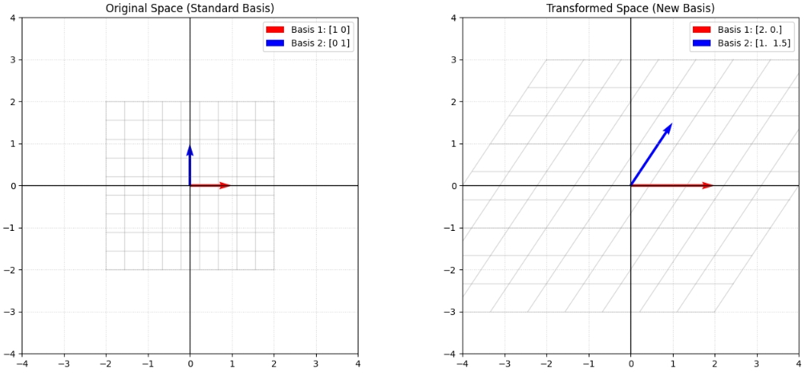
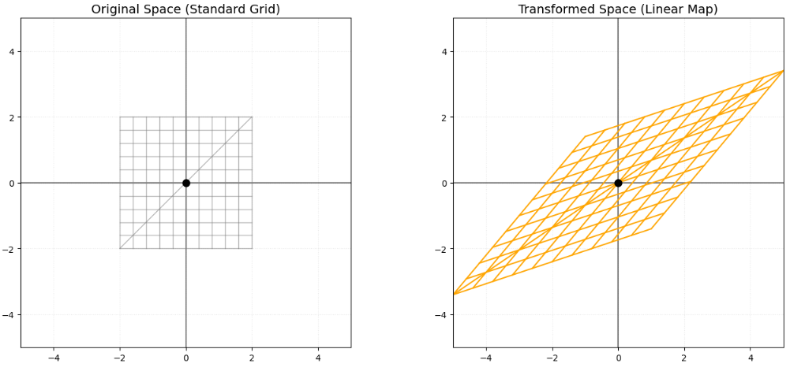

行列とは線形写像のことです。
ですが、これを聞いたとしてもスッと理解するのは、なかなか難しいと感じます。
本日は、線形写像という線形代数を扱う上で重要な概念について説明していきます。

## 線形写像

**線形写像（Linear Map）** を一言で言うなら、 **「空間のルール（グリッドの平行性と等間隔性）を壊さない、まっすぐな変換」** のことです。

「写像」という言葉は難しく聞こえますが、行列を使った計算はすべてこの線形写像にあたります。具体的にどんな処理なのか、3つの視点で紐解いてみましょう。


### 1. 幾何学的なイメージ：グリッドの変形

2次元のグラフ用紙を想像してください。線形写像とは、その紙を「引っ張る」「回転させる」「押しつぶす」といった処理ですが、**以下の2つのルールを絶対に守ります。**

1. **直線は直線のまま：** 曲げたり折ったりしてはいけません。
2. **原点は動かさない：** 中心地点（0,0）は必ず（0,0）のままです。
3. **平行な線は平行なまま：** 等間隔に並んだ格子状の目は、変換後も等間隔な格子のままです。

### 2. 数学的な定義：2つの性質

数式では、写像 $f$ が以下の2つの条件（線形性）を満たすとき、それを線形写像と呼びます。

* **加法性：** $f(\mathbf{u} + \mathbf{v}) = f(\mathbf{u}) + f(\mathbf{v})$
（足してから変換しても、変換してから足しても結果が同じ）
* **斉次性（せいじせい）：** $f(c\mathbf{u}) = c f(\mathbf{u})$
（ $c$ 倍してから変換しても、変換してから $c$ 倍しても結果が同じ）

これは、 **「入力のスケールや組み合わせが、出力の結果にそのまま比例して反映される」** という、予測可能性が高い非常に素直な性質です。

### 3. 具体的にどんな処理が含まれるか？

行列を掛けることで実行される具体的な処理には、以下のようなものがあります。

| 処理の種類 | 内容 |
| --- | --- |
| **拡大・縮小 (Scaling)** | 空間を縦や横に引き延ばす。 |
| **回転 (Rotation)** | 原点を中心にくるりと回す。 |
| **せん断 (Shearing)** | 長方形を平行四辺形に歪ませる。 |
| **射影 (Projection)** | 3Dを2Dに押しつぶす（影を落とす）。 |
| **鏡映 (Reflection)** | 鏡に映したように反転させる。 |

### 4. なぜ「線形写像」が重要なのか？

世の中の複雑な現象（非線形なもの）を解析するのは非常に困難です。しかし、非常に狭い範囲で見れば、多くの現象は「線形」として近似できます。

* **3DCG:** キャラクターの動きやカメラの視点変更はすべて行列による線形写像です。
* **AI・機械学習:** ニューラルネットワークの各層で行われているメインの計算は、巨大な行列による線形写像です。
* **物理学:** 振動や回転、量子力学の状態変化も線形写像の言葉で書かれています。

### 数学的な表記

線形写像を数学的に定義すると、 **「構造を保つ変換」** という非常に重要な概念に辿り着きます。

具体的には、2つのベクトル空間 $V$ から $W$ への写像 $f: V \to W$ が、以下の **2つの条件（線形性）** を満たすとき、それを**線形写像**と定義します。

__1. 線形写像の2つの定義条件__

任意のベクトル $\mathbf{u}, \mathbf{v} \in V$ と、任意のスカラー $c$ （実数や複素数）に対して、以下の等式が成り立つ必要があります。

__① 加法性 (Additivity)__

$$f(\mathbf{u} + \mathbf{v}) = f(\mathbf{u}) + f(\mathbf{v})$$

> **意味：** ベクトルを足してから変換した結果は、それぞれを変換してから足した結果と一致する。

__② 斉次性 (Homogeneity)__

$$f(c\mathbf{u}) = c f(\mathbf{u})$$
 
> **意味：** ベクトルを  倍してから変換した結果は、変換した後のベクトルを  倍した結果と一致する。

この2つをまとめて、次の一つの式で表現することもあります。

$$f(c\mathbf{u} + d\mathbf{v}) = c f(\mathbf{u}) + d f(\mathbf{v})$$

（これを**重ね合わせの原理**と呼びます）

__2. 線形写像から導かれる重要な性質__

定義から直接導かれる、見逃せない性質が2つあります。

1. **原点は必ず原点に移る：**  $f(\mathbf{0}) = \mathbf{0}$
斉次性において  $c=0$ とすれば明らかです。線形写像によって空間が「平行移動」することはありません。
2. **格子の平行性が保たれる：**
空間内の平行な直線は、線形写像によって変換された後も、平行な直線（または1点）に移ります。グリッド（格子）が歪んで曲線になることはありません。

__3. 線形写像と行列の関係__

ここが最も面白いところです。
有限次元のベクトル空間における線形写像は、**必ず「行列の掛け算」として表現することができます。**

ベクトル $\mathbf{x}$ に対する線形写像 $f(\mathbf{x})$ は、ある行列 $A$ を用いて次のように書けます。

$$f(\mathbf{x}) = A\mathbf{x}$$

つまり、 **「線形写像という抽象的な概念」を、「行列という具体的な数値の塊」に落とし込んで計算できる** のです。これが、線形代数で行列を学ぶ最大の理由の一つです。

__4. なぜ「線形」と呼ぶのか？__

「線形」という言葉は、グラフにしたときに「直線」になることに由来します。
例えば、$f(x) = ax$ という関数は原点を通る直線であり、線形写像の最も単純な形です。
逆に、$f(x) = x^2$（曲線になる）や $f(x) = x + 1$（原点を通らない）は、数学的な定義における線形写像ではありません。

__まとめ：線形写像の「本質」__

線形写像とは、 **「ベクトルの足し算とスケール倍という、空間の基本的なルールを壊さずに別の空間へ写す処理」** のことです。


### 基底

基底とは、その空間内のあらゆるベクトルを表現するために必要な **「最小限かつ過不足のないベクトルのセット」** のことです。

身近な例で言えば、地図の「東に1km、北に1km」という**座標の軸**が基底にあたります。

__1. 基底の条件__

あるベクトルの集合が基底であるためには、以下の2条件を満たす必要があります。

1. **線形独立である：** セットの中のどのベクトルも、他のベクトルの組み合わせで作ることができない（情報の重複がない）。
2. **空間を生成する：** そのセットの足し算とスカラー倍（線形結合）だけで、空間内の全地点に到達できる。

2次元空間（平面）なら、互いにバラバラな方向を向いた2本のベクトルがあれば、それが基底となります。最も標準的な基底は $\mathbf{e}_1 = \begin{pmatrix} 1 \\ 0 \end{pmatrix}, \mathbf{e}_2 = \begin{pmatrix} 0 \\ 1 \end{pmatrix}$ です。

__2. 線形写像を「基底の行き先」として表現する__

ここからが本題です。線形写像  の正体は、 **「基底をどこに飛ばしたか」** だけで完全に決まります。

なぜなら、空間内のあらゆるベクトル  は基底の組み合わせで書けるため、基底の行き先さえわかれば、線形性のルール（加法性と斉次性）を使って、他のすべての点の行き先が自動的に計算できてしまうからです。

__数学的表現__

2次元空間の基底を $\{\mathbf{v}_1, \mathbf{v}_2\}$ とします。このとき、線形写像 $f$ は、移り先の基底の集合として次のように表現されます。

$$A = \big( f(\mathbf{v}_1) \quad f(\mathbf{v}_2) \big)$$

つまり、**行列 $A$ の各列は、基底ベクトルを写像した後の「成れの果て」の姿**なのです。

__3. 具体例：回転写像を基底で書く__

例えば、「反時計回りに $90^\circ$ 回転させる」という線形写像 $f$ を行列で表現してみましょう。標準基底 $\mathbf{e}_1, \mathbf{e}_2$ がどう動くかを追います。

1. $\mathbf{e}_1 = \begin{pmatrix} 1 \\ 0 \end{pmatrix}$ は、 $90^\circ$ 回転すると $\begin{pmatrix} 0 \\ 1 \end{pmatrix}$ に移る。 $\to f(\mathbf{e}_1)$
2. $\mathbf{e}_2 = \begin{pmatrix} 0 \\ 1 \end{pmatrix}$ は、 $90^\circ$ 回転すると $\begin{pmatrix} -1 \\ 0 \end{pmatrix}$ に移る。 $\to f(\mathbf{e}_2)$

この「行き先の基底」を横に並べると、回転行列が出来上がります。

$$R = \begin{pmatrix} 0 & -1 \\ 1 & 0 \end{pmatrix}$$

__4. 基底の取り替え（表現行列）__

写像そのものは同じでも、**「どの基底を使って表現するか」**によって、行列の見た目は変わります。これを**表現行列**と呼びます。

* **使いにくい基底：** 行列の成分がバラバラで、計算が複雑。
* **使いやすい基底（固有ベクトルなど）：** 行列が対角行列（対角線以外が0）になり、写像の性質が一目でわかる。

>__標準基底__  
>数学的には、$n$ 次元の空間において、**「特定の成分だけが 1 で、それ以外がすべて 0」**という形をしたベクトルの集合を指します。  
>通常 $\mathbf{e}_1, \mathbf{e}_2$ （または $\mathbf{i}, \mathbf{j}$）と書かれます。
>2次元の場合の標準基底は以下のようにあらわされる。  
>- $\mathbf{e}_1 = \begin{pmatrix} 1 \\ 0 \end{pmatrix}$ ：右に 1 進む
>- $\mathbf{e}_2 = \begin{pmatrix} 0 \\ 1 \end{pmatrix}$ ：上に 1 進む

__例題:__ 基底の変換

2次元平面上の標準基底 $\mathbf{e}_1, \mathbf{e}_2$ が、行列 $A$ によってどのように「引っ越し」をし、それによって空間全体のグリッドがどう歪むかを可視化します。

```python
import numpy as np
import matplotlib.pyplot as plt

def visualize_basis(A):
    # 1. 標準基底 (Standard Basis)
    e1 = np.array([1, 0])
    e2 = np.array([0, 1])
    
    # 2. 写像後の基底 (Transformed Basis)
    # 行列 A の各列が、基底の「行き先」になる
    v1 = A @ e1
    v2 = A @ e2
    
    # 3. グリッド線の生成
    x = np.linspace(-2, 2, 10)
    y = np.linspace(-2, 2, 10)
    X, Y = np.meshgrid(x, y)
    
    # グリッドの全点を一括で変換
    pts = np.vstack([X.flatten(), Y.flatten()])
    t_pts = A @ pts
    TX = t_pts[0, :].reshape(X.shape)
    TY = t_pts[1, :].reshape(Y.shape)

    # 4. プロット
    fig, ax = plt.subplots(1, 2, figsize=(14, 6))
    
    for i, (grid_x, grid_y, title, b1, b2) in enumerate([
        (X, Y, "Original Space (Standard Basis)", e1, e2),
        (TX, TY, "Transformed Space (New Basis)", v1, v2)
    ]):
        # グリッド線の描画
        for j in range(len(x)):
            ax[i].plot(grid_x[j, :], grid_y[j, :], color='gray', alpha=0.3, lw=1)
            ax[i].plot(grid_x[:, j], grid_y[:, j], color='gray', alpha=0.3, lw=1)
        
        # 基底ベクトルの描画
        ax[i].quiver(0, 0, b1[0], b1[1], color='red', angles='xy', scale_units='xy', scale=1, label=f'Basis 1: {b1}')
        ax[i].quiver(0, 0, b2[0], b2[1], color='blue', angles='xy', scale_units='xy', scale=1, label=f'Basis 2: {b2}')
        
        ax[i].set_xlim(-4, 4); ax[i].set_ylim(-4, 4)
        ax[i].axhline(0, color='black', lw=1); ax[i].axvline(0, color='black', lw=1)
        ax[i].set_title(title)
        ax[i].legend()
        ax[i].grid(True, linestyle=':', alpha=0.6)
        ax[i].set_aspect('equal')

    plt.tight_layout()
    plt.show()

# --- 実行 ---
# 例: せん断(Shear)と拡大を組み合わせた行列
# 1列目が「赤色矢印の行き先」、2列目が「青色矢印の行き先」
A = np.array([[2, 1], 
              [0, 1.5]])

visualize_basis(A)
```

__結果__

実行結果は以下のように与えられる。



ポイント

- 解説行列の「列」＝「基底の成れの果て」

右側のグラフの赤い矢印に注目してください。その座標は行列 $A$ の第1列 [2, 0] になっています。同様に、青い矢印は第2列 [1, 1.5] になっています。行列とは、まさに **「基底をどこへ置くか」の指示書** であることがわかります。
- 空間全体の塗り替え

基底が動くと、その基底を「ものさし」にしていた空間全体が連動して歪みます。正方形の格子が平行四辺形の格子に変わっていますが、**「線がまっすぐなまま」「等間隔なまま」**であることに注目してください。これが「線形」写像と呼ばれる理由です。
- 基底が変われば表現が変わる

もし右側の歪んだ空間を「新しい基準」として採用すれば、その空間に住む人にとってはこの平行四辺形の格子こそが「真っ直ぐな1単位」になります。これが基底の取り替えという考え方の第一歩です。

### 行列と線形代数が同じとは

線形写像と行列がなぜ「同じもの」として扱えるのか。その数学的な裏付けは、　**「基底の行き先が分かれば、すべての点の行き先が決まる」**　という線形写像の性質（線形性）にあります。

__1. ベクトルを「標準基底」で分解する__

$n$ 次元の任意のベクトル $\mathbf{x}$ は、標準基底 $\mathbf{e}_1, \mathbf{e}_2, \dots, \mathbf{e}_n$ を使って次のように一意に書くことができます。

$$\mathbf{x} = x_1 \mathbf{e}_1 + x_2 \mathbf{e}_2 + \dots + x_n \mathbf{e}_n$$

ここで、$x_i$ はベクトルの各成分（数値）です。

__2. 線形写像の性質を適用する__

このベクトル $\mathbf{x}$ に線形写像 $f$ を作用させます。線形写像には **「足し算とスカラー倍を外に出せる」** という定義（線形性）がありました。

$$f(\mathbf{x}) = f(x_1 \mathbf{e}_1 + x_2 \mathbf{e}_2 + \dots + x_n \mathbf{e}_n)$$

線形性を使うと、以下のようにバラバラに分解できます。

$$f(\mathbf{x}) = x_1 f(\mathbf{e}_1) + x_2 f(\mathbf{e}_2) + \dots + x_n f(\mathbf{e}_n)$$

この式が意味するのは、 **「任意の点 $\mathbf{x}$ の行き先 $f(\mathbf{x})$ は、基底の行き先 $f(\mathbf{e}_i)$ を $x_i$ 倍して足し合わせたものになる」** ということです。

__3. 「行列の形」に整理する__

ここで、$f(\mathbf{e}_1), f(\mathbf{e}_2), \dots$ という「基底が移った後のベクトル」を列として横に並べたものを、行列 $A$ と定義します。

$$A = \begin{pmatrix} f(\mathbf{e}_1) & f(\mathbf{e}_2) & \dots & f(\mathbf{e}_n) \end{pmatrix}$$

すると、先ほどの式は「行列 $A$ とベクトル $\mathbf{x}$ の積」の定義そのものになります。

$$f(\mathbf{x}) = \underbrace{\begin{pmatrix} f(\mathbf{e}_1) & \dots & f(\mathbf{e}_n) \end{pmatrix}}_{A} \begin{pmatrix} x_1 \\ \vdots \\ x_n \end{pmatrix} = A\mathbf{x}$$

この論理構成により、以下のことが保証されます。

- 唯一性: どんな線形写像も、ただ一つの行列に対応する。
- 再現性: 基底の行き先さえ記録しておけば、どんな入力に対しても計算ができる。

つまり、 **「抽象的な変換のルール（写像）」を、「具体的な数値のリスト（行列）」** としてコンピュータや紙の上で扱えるようになったのです。

__例題:__ 線形写像がまっすぐな線であることについて

線形写像が「まっすぐな変換」であるとは、幾何学的に言えば　**「変換前に行儀よく並んでいたグリッド（格子）が、変換後も平行な直線のまま、等間隔に並んでいる」**　ということです。

この「直線性」を視覚化するために、以下の処理を行うPythonコードを作成しました。
- 元の空間に、等間隔なグリッド線と、その上に乗るいくつかの直線（対角線など）を描画します。
- 任意の行列（線形写像）を作用させ、変換後の空間を描画します。
- 格子が「曲がっていないか」「原点がズレていないか」「平行が保たれているか」を比較できるようにします。

```python
import numpy as np
import matplotlib.pyplot as plt

def visualize_linearity(A):
    # --- 1. グリッドデータの作成 ---
    # -2から2までの範囲に11本の線を引く
    range_val = 2
    ticks = np.linspace(-range_val, range_val, 11)
    
    # グリッドの各線上の点を生成する関数
    def get_grid_lines():
        lines = []
        # 垂直線と水平線
        for t in ticks:
            lines.append(np.array([[t, t], [-range_val, range_val]])) # 垂直
            lines.append(np.array([[-range_val, range_val], [t, t]])) # 水平
        # 「まっすぐさ」を強調するための斜め線
        lines.append(np.array([[-range_val, range_val], [-range_val, range_val]]))
        return lines

    original_lines = get_grid_lines()

    # --- 2. 可視化の準備 ---
    fig, ax = plt.subplots(1, 2, figsize=(14, 6))
    titles = ['Original Space (Standard Grid)', 'Transformed Space (Linear Map)']
    colors = ['#1f77b4', '#ff7f0e'] # 青とオレンジ

    for i, title in enumerate(titles):
        ax[i].set_title(title, fontsize=14)
        ax[i].set_xlim(-5, 5)
        ax[i].set_ylim(-5, 5)
        ax[i].axhline(0, color='black', lw=1.5, alpha=0.5) # X軸
        ax[i].axvline(0, color='black', lw=1.5, alpha=0.5) # Y軸
        ax[i].set_aspect('equal')
        ax[i].grid(True, linestyle=':', alpha=0.3)

    # --- 3. 変換と描画 ---
    for line in original_lines:
        # 元の線を描画
        ax[0].plot(line[0], line[1], color='gray', lw=1, alpha=0.6)
        
        # 行列 A による線形写像を適用
        # lineは [[x1, x2], [y1, y2]] なので、各列ベクトルにAを掛ける
        transformed_line = A @ line
        
        # 変換後の線を描画
        # 線形写像なら、この transformed_line も「直線」になる
        ax[1].plot(transformed_line[0], transformed_line[1], color='orange', lw=1.5)

    # 原点の強調
    ax[0].plot(0, 0, 'ko', markersize=8, label='Origin')
    ax[1].plot(0, 0, 'ko', markersize=8, label='Origin')
    
    plt.tight_layout()
    plt.show()

# --- 4. 線形写像を定義して実行 ---
# 例: 剪断(Shear)とスケーリングを組み合わせた行列
# 1列目が基底e1の行き先、2列目が基底e2の行き先
A = np.array([
    [1.5, 1.0], 
    [0.5, 1.2]
])

visualize_linearity(A)
```

__結果__

実行した結果以下のようなグラフが描画されます。



ポイント

- 平行性の維持:

左側の図で平行だった青いラインは、右側でオレンジ色になっても互いに平行なままです。線形写像は空間を「ねじる」ことはありません。
- 等間隔性の維持:

グリッドの間隔がどこに行っても一定です。特定の場所だけ伸びたり縮んだりすることはありません（これは斉次性の現れです）。原点の固定:黒いドット（原点）はどちらの図でも $(0,0)$ から動いていません。線形写像 $f(\mathbf{x}) = A\mathbf{x}$ において $A\mathbf{0} = \mathbf{0}$ であることを示しています。
- 直線の維持:

もしこれが線形写像でない（例えば $x^2$ などを含む変換）場合、オレンジの線はぐにゃりと曲がってしまいます。すべての線が定規で引いたようにまっすぐなのは、行列による変換が「線形」である最大の証拠です。

## 総括
線形代数における線形写像とは、行列とイコールであす。

線形写像により移されたデータは、空間をねじることはなく、直線的な変換をすることになります。
性質は拡大や、回転はしますが、もともとの空間での関係は変化させません。

例えば、もともとの空間で平行だったものを、線形写像により変換したとしても、平行は維持されます。

というように線形写像=行列で、性質上はあくまで線形である、ということが本日のまとめです。

## 参考

線形代数関係の記事として以下も是非ご参考下さい。

[今から勉強する方にお伝えする線形代数がなぜ大事か](https://yoshishinnze.hatenablog.com/entry/2026/02/21/000000)

著者が線形代数を理解する上で使った教科書を参考に示します。

線形代数の勉強をされる方、是非ご参考下さい。

<div class="shop-card">
    <div class="shop-card-image">
        
    </div>
    <div class="shop-card-content">
        <div class="shop-card-title">線形代数入門</div>
        <div class="shop-card-description">線型代数の最も標準的なテキスト。平面および空間のベクトル、行列、行列式、線型空間、固有値と固有ベクトルなど7章のほか、附録をつけ線型代数の技術が習熟できる。各章末に演習問題があり、巻末に略解を付す。日本数学会出版賞受賞。</div>
        <div class="shop-card-link">
            <a href="https://www.amazon.co.jp/%E7%B7%9A%E5%9E%8B%E4%BB%A3%E6%95%B0%E5%85%A5%E9%96%80-%E5%9F%BA%E7%A4%8E%E6%95%B0%E5%AD%A61-%E9%BD%8B%E8%97%A4-%E6%AD%A3%E5%BD%A6/dp/4130620010?__mk_ja_JP=%E3%82%AB%E3%82%BF%E3%82%AB%E3%83%8A&crid=FBZ8IT8N0HVP&dib=eyJ2IjoiMSJ9.raG17HmdJDqR1xw-s72NyCPuaEfm5KCpXi7pTNoq_QIjVKT3KU7pqn7RIa4jj90kXvUq5KAu9qe-044Ub4_c-7qZrFrxf4bhrqtdSUpbYUqyvho1nCVqaBFvzVFNVPNBGfwTOSo8W6CP0oKlG4BlojmK6B0wityoP6tFpx9chP4cOQXsJBRjjJo_XdIQZuUVqlMgcyLlVAYF03h2GY0kk7yIW1JAXYcLW9IfJbFvDhn7Q8o2xSgx44JjPY6IPku7tQXM8STJgSqeByDeiq-T8EyenilxGj4ZxzpGzGhSJtI.rFisem8ppj0ivBAAT51d-gxJVLuNv0Heeem8G0A6rMc&dib_tag=se&keywords=%E7%B7%9A%E5%BD%A2%E4%BB%A3%E6%95%B0&qid=1771066940&sprefix=%E7%B7%9A%E5%BD%A2%E4%BB%A3%E6%95%B0%2Caps%2C170&sr=8-2-spons&sp_csd=d2lkZ2V0TmFtZT1zcF9hdGY&psc=1&linkCode=ll2&tag=yoshishinnze-22&linkId=c87f395611297c531a7104e682865a78&ref_=as_li_ss_tl" target="_blank" rel="noopener">Amazonで詳細を見る</a>
        </div>
    </div>
</div>

