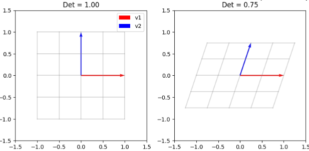
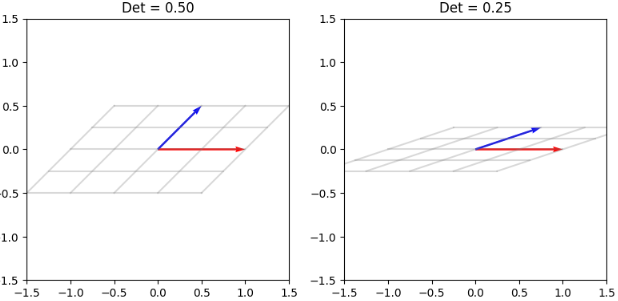
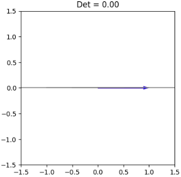

## 行列式

**行列式（Determinant）** とは、一言で言えば **「その行列が、空間を何倍に膨らませたか（あるいは押しつぶしたか）を表す拡大率」** のことです。

行列が「空間を動かす指示書」なら、行列式はその結果として **「どれくらい面積や体積が変化したか」** というスコアのようなものです。通常、行列  に対して  や  と表記されます。

### 1. 幾何学的な意味：面積と体積の拡大率

2次元空間で考えると、行列式の意味が非常にクリアになります。

* **2次元の場合：** 標準基底が作る「面積 1 の正方形」が、行列 $A$ によって変形された後の「平行四辺形の面積」が行列式です。
* **3次元の場合：** 「体積 1 の立方体」が変形された後の「平行六面体の体積」が行列式です。

### 2. 行列式の「値」が教えてくれること

行列式の値を見るだけで、その線形写像が空間に何をしたのかがわかります。

| 行列式の値 | 空間に起きたこと | 数学的な意味 |
| --- | --- | --- |
| $\det(A) = 2$ | 面積が 2 倍に膨らんだ。 | 通常の変換。 |
| $\det(A) = 1$ | 面積は変わらない（回転など）。 | **ユニタリ行列**などがこれに当たる。 |
| $\det(A) = -1$ | 面積は同じだが、**「裏返し」**になった。 | 鏡映（リフレクション）など。 |
| $\det(A) = 0$ | 空間が**ペシャンコに潰れた**。 | **逆行列が存在しない**（正則でない）。 |


### 3. なぜ行列式が重要なのか？（実用的な視点）

__① 逆行列の存在チェック__

行列式が $0$ ということは、2次元の平面を1次元の「線」に、あるいは0次元の「点」に押しつぶしてしまったことを意味します。潰れたものを元の広さに戻す（逆再生する）ことは不可能なため、 **「$\det(A) = 0 \iff$ 逆行列が存在しない」** という非常に重要な判定基準になります。

__② 連立方程式の解__

連立方程式（Systems of linear equations）を解く際、行列式が $0$ でなければ、解が一意に定まります。
これを利用したのが後ほど扱う「クラメルの公式」です。

__③ 多変数関数の積分（ヤコビアン）__

積分で変数を変換する際（例えば直交座標から極座標へ）、微小な領域がどれくらい歪んだかを補正する必要があります。この補正係数として「ヤコビ行列式（ヤコビアン）」が登場します。

### 4. 計算のイメージ（2次の場合）

$$A = \begin{pmatrix} a & b \\ c & d \end{pmatrix}$$

このとき、$\det(A) = ad - bc$ と計算されます。これは、ベクトル $\begin{pmatrix} a \\ c \end{pmatrix}$ と $\begin{pmatrix} b \\ d \end{pmatrix}$ が作る平行四辺形の面積を求めていることに他なりません。


__例題:__ ベクトルと逆行列

行列式が $0$ に近づくにつれて、 **「2次元の面積を持っていた世界が、1次元の『線』へとペシャンコに押しつぶされていく」** 様子を可視化します。

```python
import numpy as np
import matplotlib.pyplot as plt

def simulate_collapsing_space(steps=5):
    # 1. 元の基底ベクトル
    e1 = np.array([1, 0])
    e2_start = np.array([0, 1])  # 最初は直交（行列式=1）
    e2_end = np.array([1, 0])    # 最後はe1と同じ（行列式=0、空間が潰れる）

    # グリッド描画用のデータ
    x = np.linspace(-1, 1, 5)
    y = np.linspace(-1, 1, 5)
    X, Y = np.meshgrid(x, y)
    pts = np.vstack([X.flatten(), Y.flatten()])

    fig, axes = plt.subplots(1, steps, figsize=(20, 4))
    
    for i, t in enumerate(np.linspace(0, 1, steps)):
        # e2 を徐々に e1 に近づける
        e2_current = (1 - t) * e2_start + t * e2_end
        
        # 写像行列 A = [e1, e2_current]
        A = np.column_stack([e1, e2_current])
        det = np.linalg.det(A)
        
        # 空間の変形
        t_pts = A @ pts
        TX = t_pts[0, :].reshape(X.shape)
        TY = t_pts[1, :].reshape(Y.shape)
        
        # 描画
        ax = axes[i]
        # 変形後のグリッド
        for j in range(len(x)):
            ax.plot(TX[j, :], TY[j, :], color='gray', alpha=0.3)
            ax.plot(TX[:, j], TY[:, j], color='gray', alpha=0.3)
        
        # ベクトルの描画（複数のベクトルが潰れていく様子）
        ax.quiver(0, 0, A[0,0], A[1,0], color='red', angles='xy', scale_units='xy', scale=1, label='v1')
        ax.quiver(0, 0, A[0,1], A[1,1], color='blue', angles='xy', scale_units='xy', scale=1, label='v2')
        
        # 設定
        ax.set_xlim(-1.5, 1.5); ax.set_ylim(-1.5, 1.5)
        ax.set_aspect('equal')
        ax.set_title(f"Det = {det:.2f}")
        if i == 0: ax.legend()

    plt.suptitle("Space collapsing from 2D to 1D as Determinant approaches 0", fontsize=16)
    plt.tight_layout()
    plt.show()

# シミュレーション実行
simulate_collapsing_space(steps=5)
```

__結果__

実行の結果を並べてみました。
行列式の値が小さくなるにつれて、ベクトルがつぶれていく様子が確認できます。
という感じで行列式は、行列になったベクトルが成す大きさを示します。









### 5. 余因子行列

**余因子行列（Cofactor Matrix / Adjunct Matrix）** は、一言で言えば **「逆行列を作り出すための、各成分の『責任分担リスト』」** のようなものです。

行列式が「空間全体の拡大率」を表すのに対し、余因子行列は「特定の成分を除いたときに、残りの部分がどれだけの重み（面積・体積）を持っているか」を集めたものです。

__1. 余因子（Cofactor）とは何か？__

行列 $A$ のある成分 $a_{ij}$ に対する余因子とは、次のように定義されます。

> **「その成分がいる行と列をバッサリ消して、残った行列の行列式に、場所に応じた符号（ $\pm$ ）をつけたもの」**

__幾何学的なイメージ__

3次元行列で考えてみましょう。ある成分の余因子を求めることは、 **「その成分が担当する軸方向の情報を消したときに、残りの2軸が作る面の面積（拡大率）がいくらになるか」** を計算していることに相当します。

__2. 余因子行列の正体：逆行列の「部品」__

余因子をすべての成分について計算し、それを並べて**転置**したものを **余因子行列（Adjugate Matrix, $\text{adj}(A)$）** と呼びます。

この行列には、魔法のような性質があります。元の行列 $A$ と余因子行列を掛け合わせると、必ず「行列式を対角線に並べた行列」になります。

$$A \cdot \text{adj}(A) = \det(A) I$$

これを利用すると、有名な**逆行列の公式**が導かれます。

$$A^{-1} = \frac{1}{\det(A)} \text{adj}(A)$$

> **つまり、余因子行列とは：**
> 行列式（全体の拡大率）で割る前の、 **「逆行列の本体部分」** のことです。

__3. なぜ「余因子」が必要なのか？__

__① 逆行列を「公式」として扱える__

数値計算（掃き出し法）ではなく、文字式として逆行列を表現したい場合に不可欠です。

__② 各成分の「影響力」がわかる__

余因子行列の成分を見ることで、「元の行列のどの部分を少し変えると、逆変換にどう影響するか」という感度分析のような視点が得られます。

__③ 余因子展開__

行列式を計算する際、1つの行や列に注目して「成分 $\times$ 余因子」を足し合わせることで、大きな行列を小さな行列の計算に分解できます。

__4. 2次正方行列での具体例（一番馴染みがある形）__

みなさんがよく知る「2次行列の逆行列の公式」を余因子行列の視点で見てみましょう。

$$A = \begin{pmatrix} a & b \\ c & d \end{pmatrix} \implies \text{adj}(A) = \begin{pmatrix} d & -b \\ -c & a \end{pmatrix}$$

1. **対角成分 ($a, d$) を入れ替える：** これが余因子の計算結果です。
2. **符号を変える：** 場所による符号 ($\pm$) の調整です。
3. **$\det(A)$で割る：** これで逆行列の完成です。

__余因子行列 adj(A) と元の行列 A の積__

余因子行列 $\text{adj}(A)$ と元の行列 $A$ の積が、なぜ $\det(A) I$（行列式を対角線に並べた行列）になるのか不思議に感じます。
この点、証明してみようと思います。

この証明の鍵は、 **「余因子展開」と、そこから派生する「他人の余因子を使った展開は $0$ になる」** という非常に面白い性質にあります。

1. 準備：余因子展開（同じ行の場合）

行列 $A$ の第 $i$ 行の成分 $a_{i1}, a_{i2}, \dots, a_{in}$ と、それに対応する余因子 $\tilde{a}_{i1}, \tilde{a}_{i2}, \dots, \tilde{a}_{in}$ を使って行列式を求める公式（余因子展開）は以下の通りです。

$$\det(A) = \sum_{j=1}^{n} a_{ij} \tilde{a}_{ij}$$

これは、 **「自分自身の行の成分」と「自分自身の余因子」** を掛けて足すと、行列式になるというルールです。

2. 他人の余因子との積は $0$

もし、 **「第 $i$ 行の成分」に対して、「別の第 $k$ 行 ($i \neq k$) の余因子」** を掛けて足し合わせたらどうなるでしょうか？

$$\sum_{j=1}^{n} a_{ij} \tilde{a}_{kj} = 0 \quad (i \neq k)$$

なぜこれが $0$ になるのか？

この計算式は、「行列 $A$ の第 $k$ 行を第 $i$ 行でコピーして書き換えた、同じ行が2つある行列」の行列式を計算していることと同じ意味になります。

この場合、同じベクトルが並んでいることになります。先述したようにこのような場合行列式は 0 になります。

同じ行が2つある行列の行列式は必ず $0$ になるため、この合計は必ず $0$ になります。

3. 行列の積としての証明

さて、行列 $A$ と余因子行列の転置（$\text{adj}(A)$）の積を考えます。積 $A \cdot \text{adj}(A)$ の $(i, k)$ 成分を計算すると、それはまさに上の展開式になります。

$$[A \cdot \text{adj}(A)]_{ik} = \sum_{j=1}^{n} a_{ij} \tilde{a}_{kj}$$

この結果を分類すると：

- 対角成分 ($i = k$ のとき)

「自分の行」$\times$「自分の余因子」の和になるため、結果は $\det(A)$ です。

- 非対角成分 ($i \neq k$ のとき)

「自分の行」$\times$「他人の余因子」の和になるため、結果は $0$ です。

これを並べると、以下のようになります。

$$A \cdot \text{adj}(A) = \begin{pmatrix} \det(A) & 0 & \dots \\ 0 & \det(A) & \dots \\ \vdots & \vdots & \ddots \end{pmatrix} = \det(A) I$$

4. 結論

この関係式 $A \cdot \text{adj}(A) = \det(A) I$ の両辺を $\det(A)$ で割ると（$\det(A) \neq 0$ の場合）、

$$A \cdot \left( \frac{1}{\det(A)} \text{adj}(A) \right) = I$$

となり、括弧の中身が逆行列 $A^{-1}$ の定義そのものであることが証明されます。

## 逆行列

**逆行列（Inverse Matrix）** を一言で言うなら、 **「時間を巻き戻す、あるいは処理をキャンセルする行列」** のことです。

行列 $A$ があるベクトル $\mathbf{x}$ を $\mathbf{y}$ に変身させる「魔法」だとしたら、逆行列 $A^{-1}$（エー・インバース）はその魔法を解いて元の $\mathbf{x}$ に戻す「解呪」の魔法にあたります。

### 1. 数学的な定義

ある正方行列 $A$ に対して、以下の条件を満たす行列 $X$ を逆行列と呼び、通常 $A^{-1}$ と書き表します。

$$A A^{-1} = A^{-1} A = I$$

※ここで $I$ は**単位行列**（何もしない行列、数でいう「1」）です。

つまり、「$A$ という操作をした後に $A^{-1}$ をすると、結果として何もしてないのと同じ状態になる」ということです。

### 2. 幾何学的なイメージ：逆再生

これまでの「線形写像」の視点で見ると、逆行列の役割はさらに明確になります。

- $A$ が「30度回転」なら： $A^{-1}$ は「-30度回転（逆回転）」。
- $A$ が「2倍に拡大」なら： $A^{-1}$ は「0.5倍に縮小」。
- $A$ が「右に歪ませる（せん断）」なら： $A^{-1}$ は「左に歪ませて元に戻す」。

### 3. 逆行列が存在しない場合（特異行列）

すべての行列に逆行列があるわけではありません。逆行列が存在しない行列を **特異行列（Singular Matrix）** と呼びます。

これは、 **「情報を完全に押しつぶしてしまった場合」** に起こります。

* **例：** 2次元の平面を1本の「線」に押しつぶす行列（行列式 $\det(A) = 0$）。
* **なぜ戻せないか：** ぺしゃんこに潰された「線」の上の一点が、もともと「平面」のどこにいたのかを特定することは不可能です。情報が失われたため、時間を巻き戻すことはできません。


