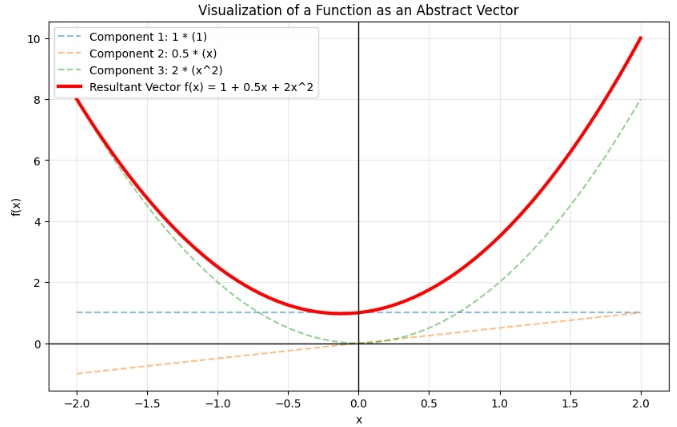

## ベクトル空間

**ベクトル空間（Vector Space）** とは、一言で言えば **「足し算とスカラー倍（伸び縮み）という2つのルールが自由に行える、風通しの良い数学的な広場」** のことです。

多くの人が「ベクトル＝矢印」と思い浮かべますが、数学におけるベクトル空間はもっと抽象的です。「矢印」だけでなく、「関数」や「行列」、あるいは「デジタル信号」なども、一定のルールさえ守ればベクトルとして扱われ、その集まりがベクトル空間となります。

### 1. 直感的なイメージ

ベクトル空間を形作っているのは、以下の2つの操作が「その空間の中で完結している」という性質です。

1. **足し算（Addition）：** 空間内の2つを足しても、まだその空間の中にいる。
2. **スカラー倍（Scalar Multiplication）：** 空間内のものを何倍かしても、まだその空間の中にいる。

この「外に飛び出さない（閉じている）」という性質こそが、ベクトル空間を特別なものにしています。

### 2. 数学的な定義

集合 **$V$** が体 **$K$**（通常は実数 **$\mathbb{R}$**）上の**ベクトル空間**であるとは、**$V$** の任意の要素 **$\mathbf{u}, \mathbf{v}, \mathbf{w}$** と **$K$** のスカラー **$a, b$** に対して、以下の**8つの公理**を満たすことを指します。

__加法に関する性質__

1. **結合法則:** **$(\mathbf{u} + \mathbf{v}) + \mathbf{w} = \mathbf{u} + (\mathbf{v} + \mathbf{w})$**
2. **交換法則:** **$\mathbf{u} + \mathbf{v} = \mathbf{v} + \mathbf{u}$**
3. **零ベクトルの存在:** 任意の **$\mathbf{v}$** に対して **$\mathbf{v} + \mathbf{0} = \mathbf{v}$** となる **$\mathbf{0}$** が存在する。
4. **逆ベクトルの存在:** 任意の **$\mathbf{v}$** に対して **$\mathbf{v} + (-\mathbf{v}) = \mathbf{0}$** となる **$-\mathbf{v}$** が存在する。

__スカラー倍に関する性質__

5. **スカラー倍の結合法則:** **$a(b\mathbf{v}) = (ab)\mathbf{v}$**
6. **スカラー倍の単位元:** **$1\mathbf{v} = \mathbf{v}$**
7. **スカラー和に対する分配法則:** **$(a + b)\mathbf{v} = a\mathbf{v} + b\mathbf{v}$**
8. **ベクトル和に対する分配法則:** **$a(\mathbf{u} + \mathbf{v}) = a\mathbf{u} + a\mathbf{v}$**

### 3. なぜこんなに厳格に定義するのか？

「当たり前じゃないか」と思うかもしれませんが、この定義があるおかげで、数学者は **「中身が何であれ、この8つを満たすなら全部ベクトルとして同じ道具（線形代数）で扱っていいよね」** と言えるようになります。

- **関数の空間：** **$f(x)$** と **$g(x)$** を足すと新しい関数になる。これもベクトル空間。
- **多項式の空間：** 2次式と2次式を足すと2次式（以下）になる。これもベクトル空間。
- **数列の空間：** 信号処理で使われるデータの並びもベクトル空間。

### 4. 重要な概念：基底と次元

ベクトル空間を理解する上で欠かせないのが「基底（Basis）」です。

- **基底：** その空間のあらゆるベクトルを「足し算とスカラー倍」だけで作ることができる、必要最小限のベクトルのセット。
- **次元：** その基底が何本あるか。

## 抽象ベクトル空間

**抽象ベクトル空間**とは、一言で言えば、私たちがよく知る「矢印（幾何ベクトル）」や「数字の並び（列ベクトル）」が持つ **「足し算」と「スカラー倍」という性質だけを抜き出し、それ以外の要素を削ぎ落としたもの** です。

数学的な定義（8つの公理）を満たしさえすれば、中身が関数だろうが行列だろうが、すべて「ベクトル」とみなして同じ理論で扱おう、という考え方です。


### 1. 「具体的」から「抽象的」への飛躍

抽象化のプロセスを、以下のステップでイメージしてみてください。

- **具体的なベクトル：** 2次元の平面上の矢印 $\mathbf{v} = (3, 2)$。目に見えるし、図形として理解できる。
- **数ベクトル：** $n$ 個の数字の並び。高次元になると図には描けないが、計算はできる。
- **抽象ベクトル：** 「足し算」と「何倍かする」という操作ができる「何か」。

例えば、 **「関数」** を考えてみましょう。
2つの関数 $f(x)$ と $g(x)$ を足すと、新しい関数 $(f+g)(x)$ が生まれます。また、関数を $k$ 倍することもできます。これはベクトル空間の定義をすべて満たします。したがって、 **「関数はベクトルである」** と言えるのです。


### 2. なぜ「抽象化」が必要なのか？

抽象化の最大のメリットは、 **「一度証明した定理は、すべての対象に使い回せる」** という効率性にあります。

例えば、「線形写像の核（Kernel）」や「次元」に関する定理を一度証明してしまえば、それを：

- 画像処理（行列の計算）
- 物理学（量子力学の状態ベクトル）
- 微分方程式（解の集合が作るベクトル空間）

といった、全く異なる分野にそのまま適用できるのです。


### 3. 抽象ベクトル空間の代表的な例

「矢印」以外で、抽象ベクトル空間として扱われる代表的なものを挙げます。

__① 関数空間（Function Space）__

ある区間で定義された連続関数の集合。

- $f(x) = \sin(x)$ や $g(x) = e^x$ は、この空間の「ベクトル」です。
- フーリエ変換などは、関数を「基底（$\sin$ や $\cos$）」の足し算で分解する、まさにベクトル空間の考え方そのものです。

__② 行列空間__

同じサイズ（例えば $2 \times 2$）の行列の集合。

- 行列同士を足したり、スカラー倍したりできるため、これもベクトル空間になります。
- この場合、一つ一つの「行列」が、ベクトル空間の一つの「点（ベクトル）」になります。

__③ 多項式空間__

次数が $n$ 以下の多項式の集合。

- 基底を $\{1, x, x^2, \dots, x^n\}$ とおけば、あらゆる多項式はこの基底の線形結合で表せます。


### 4. 抽象化しても変わらない「本質」

どんなに中身が抽象的になっても、線形代数の核となる以下の概念はそのまま通用します。

- **線形独立:** どのベクトルも、他のベクトルの足し算・スカラー倍で作れない。
- **基底:** その空間のすべての要素を作るための、最小限の素材セット。
- **次元:** 基底の数。

### 5. どんな場面で使われているか

- **データ圧縮と信号処理（フーリエ変換）**
音や画像のデータは「関数の空間」におけるベクトルとみなせます。複雑な波形（ベクトル）を、単純なサイン波・コサイン波（基底ベクトル）の足し算に分解することで、不要な成分をカットしてデータを軽く（MP3やJPEGなど）することができます。
- **量子力学（状態ベクトル）**
ミクロな粒子の状態は、複素数を用いた抽象ベクトル空間（ヒルベルト空間）上のベクトルとして記述されます。観測結果の確率は、この空間内での「ベクトルの向きや長さ」を使って計算されます。
- **機械学習・AI（特徴量空間）**
例えば「文章」や「ユーザーの好み」は数値の並び（高次元ベクトル）として扱われます。AIが「似ている文章」を探すのは、抽象的な空間の中でベクトル同士の距離や角度を計算しているのと同じ作業です。
- **微分方程式の解法**
物理現象（熱の伝わり方や振動など）を表す微分方程式の「解」も、実はベクトル空間を作ります。解のセットをベクトルの集まりとして扱うことで、複雑な現象を線形代数のテクニックでスマートに解くことが可能になります。
- **制御工学**
ロケットの姿勢制御や自動運転のシステムでは、速度や位置などの状態を一つのベクトルとしてまとめ、抽象的な空間内での「移動」としてシミュレーションします。


__例題:__ 関数の基底

抽象ベクトル空間の最も代表的な例である **「関数の空間（関数空間）」** を可視化します。

ここでは、 **「多項式の空間」** を例に挙げます。多項式 $f(x) = a + bx + cx^2$ は、ただの関数の式に見えますが、実は $(a, b, c)$ という成分を持つ3次元の抽象ベクトルと全く同じように扱えます。

このコードでは、基底となる関数（$1, x, x^2$）を組み合わせて、新しい「関数ベクトル」を作り出す様子を可視化します。

```python
import numpy as np
import matplotlib.pyplot as plt

def visualize_function_space(a, b, c):
    # x軸の範囲（定義域）
    x = np.linspace(-2, 2, 100)
    
    # 抽象ベクトル空間の「基底」となる関数たち
    phi0 = np.ones_like(x)   # 基底1: 1 (定数関数)
    phi1 = x                # 基底2: x (1次関数)
    phi2 = x**2             # 基底3: x^2 (2次関数)
    
    # 基底のスカラー倍（成分との掛け算）
    v0 = a * phi0
    v1 = b * phi1
    v2 = c * phi2
    
    # ベクトルの和（関数の足し算）
    f_x = v0 + v1 + v2
    
    # 描画
    plt.figure(figsize=(10, 6))
    
    # 各成分（スカラー倍された基底）の描画
    plt.plot(x, v0, '--', label=f'Component 1: {a} * (1)', alpha=0.5)
    plt.plot(x, v1, '--', label=f'Component 2: {b} * (x)', alpha=0.5)
    plt.plot(x, v2, '--', label=f'Component 3: {c} * (x^2)', alpha=0.5)
    
    # 合成された「ベクトル」としての関数
    plt.plot(x, f_x, color='red', lw=3, label=f'Resultant Vector f(x) = {a} + {b}x + {c}x^2')
    
    # グラフの装飾
    plt.axhline(0, color='black', lw=1)
    plt.axvline(0, color='black', lw=1)
    plt.title("Visualization of a Function as an Abstract Vector")
    plt.xlabel("x")
    plt.ylabel("f(x)")
    plt.legend()
    plt.grid(True, alpha=0.3)
    
    plt.show()

# --- 実行 ---
# 係数 (a, b, c) を変えることで、空間内の異なるベクトルを生成できます
# 例: f(x) = 1 + 0.5x + 2x^2
visualize_function_space(a=1, b=0.5, c=2)
```

__結果__

結果は点線が基底となる $\{1, x, x^2\}$ を用いて

$$
y = x^2 + 0.5 \times x + 2
$$

を表示しました。

- 関数は「点」であり「矢印」: このグラフ上の赤い曲線一本が、抽象ベクトル空間における「一つの点（ベクトル）」に対応します。
- 基底（Basis）:$\{1, x, x^2\}$ という3つの関数を「基底」として選んでいます。これらを組み合わせることで、あらゆる2次以下の多項式（ベクトル）を作ることができます。
- 成分（Coordinates）:あなたが入力した a, b, c は、この抽象空間における座標そのものです。




各基底に対して和積を行うことで、別の関数を表現することが出来るようになりました。
**ベクトルの性質を使って他の関数を表現することが出来る**、これが抽象ベクトル空間のメリットです。

## 1次結合

**1次結合（Linear Combination）** とは、一言で言えば **「ベクトルの足し算とスカラー倍（引き伸ばし）だけで新しいベクトルを作り出すこと」** です。

線形代数において、これが最も基本的で重要な「合成ルール」となります。

### 1. 数学的な定義

いくつかのベクトル $\mathbf{v}_1, \mathbf{v}_2, \dots, \mathbf{v}_n$ と、それぞれの係数（スカラー） $c_1, c_2, \dots, c_n$ があるとき、それらを組み合わせて作られる次の形のベクトルを**1次結合**と呼びます。

$$\mathbf{w} = c_1 \mathbf{v}_1 + c_2 \mathbf{v}_2 + \dots + c_n \mathbf{v}_n$$

### 2. 幾何学的なイメージ：レシピと目的地

1次結合は、よく「料理のレシピ」や「道案内」に例えられます。

- **レシピとしての1次結合**
- ベクトル $\mathbf{v}_1$ を「砂糖」、$\mathbf{v}_2$ を「塩」とします。
- $3\mathbf{v}_1 + 0.5\mathbf{v}_2$ という1次結合は、「砂糖3杯と塩0.5杯を混ぜた調味料」という新しい状態（ベクトル）を作っていることになります。


- **道案内としての1次結合**
- $\mathbf{v}_1$ を「北に1歩」、$\mathbf{v}_2$ を「東に1歩」とします。
- $10\mathbf{v}_1 + 5\mathbf{v}_2$ という1次結合は、「北に10歩進んだ後、東に5歩進む」という操作の結果、たどり着く「地点」を表します。


### 3. なぜ「1次」結合と呼ぶのか？

「1次」という言葉は、各ベクトルの係数が **1乗（$c^1$）** であり、ベクトル同士を掛け合わせたり（$\mathbf{v}_1 \times \mathbf{v}_2$）、2乗したり（$\mathbf{v}_1^2$）していないことを意味します。

- **線形性（Linearity）:**
グラフにすると真っ直ぐな「線」や平らな「面」の関係を保つため、「線形（Linear）」という言葉が使われます。

### 4. 1次結合が教えてくれる重要な概念

1次結合を理解すると、線形代数の核心的な用語が繋がってきます。

- **生成（Span）:**
「あるベクトルたちの1次結合で、どこまでの範囲（点、線、面、空間）を作れるか？」という広がりのことです。
- **線形独立（Linearly Independent）:**
「そのメンバーの中に、他のメンバーの1次結合（お助け）なしでは作れないベクトルが含まれているか？」という情報のユニークさを表します。
- **基底（Basis）:**
「その空間のすべての場所を1次結合で作るための、最小限の素材セット」のことです。


### まとめ

- **1次結合** ＝ ベクトルを何倍かして足し合わせること。
- **役割** ＝ 既存のパーツ（基底）から、空間内のあらゆる「点」を表現するための手段。

先ほどの「多項式の空間」のPythonコードで、`a, b, c` という係数を掛けて足していた操作こそが、まさに **「関数ベクトルの1次結合」** の実体です。

## 部分空間

**部分空間（Subspace）**とは、一言で言えば **「大きなベクトル空間の中に作られた、それ自体も完璧なベクトル空間として機能する小さなエリア」** のことです。

「空間」という名前がついていますが、単なる「場所」の集合ではなく、 **「足し算とスカラー倍のルールが、そのエリアの中で完結している（外に飛び出さない）」** という特別な性質を持っています。

### 1. 部分空間になるための「3つの条件」

ある集合 $W$ が、元の大きな空間 $V$ の部分空間であるためには、以下の条件をすべて満たす必要があります。

- **零ベクトル $\mathbf{0}$ を含んでいること**
- 出発点（原点）がないと、スカラー 0 倍をしたときに空間から消えてしまいます。


- **加法について閉じていること**
- $W$ 内の 2 つのベクトルを足しても、結果は $W$ の中に留まる。


- **スカラー倍について閉じていること**
- $W$ 内のベクトルを何倍（実数倍）しても、結果は $W$ の中に留まる。


### 2. 直感的なイメージ：3次元空間の中の「部分空間」

私たちが住む 3 次元空間 ($\mathbb{R}^3$) を例に挙げると、部分空間は以下の 4 種類しかありません。

- **0次元：原点のみ** $\{\mathbf{0}\}$
- 0 を何倍しても 0。足しても 0。完璧に閉じています。


- **1次元：原点を通る「直線」**
- 直線上のベクトルを足したり伸ばしたりしても、その直線からはみ出すことはありません。


- **2次元：原点を通る「平面」**
- 平面上のベクトル同士をどう組み合わせても、その平面の外（高さ方向）へは飛び出せません。


- **3次元：空間全体** $\mathbb{R}^3$

> **注意：** 原点を通らない直線や平面は、部分空間ではありません。なぜなら、ベクトルを 0 倍したときに「原点」にたどり着けない（エリア外に出てしまう）からです。

### 3. なぜ部分空間を考えるのか？（行列との関係）

線形代数において、部分空間は「行列の性質」を理解するために不可欠です。

* **像空間（Image / Column Space）**
* 行列 $A$ によって「移りうる先」の集合です。3次元空間を 2次行列で写すと、結果は「平面（部分空間）」になります。


* **核（Kernel / Null Space）**
* 行列 $A$ によって「原点に押しつぶされてしまう」元のベクトルの集合です。


### 4. まとめ

* **部分空間** ＝ 「足し算とスカラー倍」をしてもエリア外に飛び出さない、選ばれた要素の集まり。
* **合言葉** ＝ 「原点を通る」「真っ直ぐである」。

「抽象ベクトル空間」の回でお話しした「関数空間」を覚えていますか？例えば「すべての連続関数」という巨大な空間の中で、「2次以下の多項式」だけを集めた集合も、立派な**部分空間**になります。


