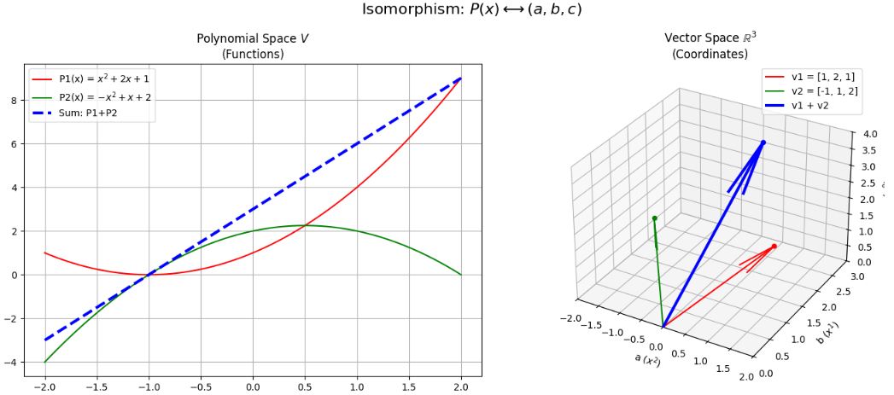

## ベクトル空間の次元

ベクトル空間の **「次元（Dimension）」** とは、一言で言えば **「その空間の広がりを表現するために必要な、最低限の情報の数」** のことです。

数学的には、 **「基底（Basis）に含まれるベクトルの本数」** として定義されます。

### 1. 直感的な理解：自由度の数

「次元」という言葉は、日常的にも「3次元空間」などの形で使われますが、数学的な意味もその直感と一致しています。

* **0次元：** 点。どこにも動けない（自由度0）。
* **1次元：** 線。前後にだけ動ける（自由度1）。
* **2次元：** 面。縦と横に動ける（自由度2）。
* **3次元：** 立体。縦・横・高さに動ける（自由度3）。

ベクトル空間における次元も、「その空間内のどんな点（ベクトル）も、$n$ 個のパラメータがあれば指定できる」という**自由度の数**を表しています。

### 2. 数学的な定義：基底の本数

ベクトル空間 $V$ の次元を $\dim(V)$ と書きます。

あるベクトル空間 $V$ において、以下の2つの条件を満たすベクトルの集合を**基底**と呼びます。

1. **1次独立である：** 無駄な（他のベクトルの組み合わせで作れる）ベクトルが含まれていない。
2. **空間を生成する：** そのベクトルたちの1次結合で、空間内のすべてのベクトルを作ることができる。

**この基底を構成するベクトルの本数が、その空間の「次元」です。**

> **重要な性質：**
> 1つのベクトル空間に対して、基底の選び方は無数にありますが、 **「基底に含まれるベクトルの本数」は、どの基底を選んでも必ず同じ** になります。だからこそ「次元」という数値が空間固有の性質として定まります。

### 3. 抽象ベクトル空間での次元

「矢印」以外の空間でも、次元の考え方は同じです。

* **多項式の空間：** 2次以下の多項式 $ax^2 + bx + c$ の空間を考えます。この空間の基底は $\{1, x, x^2\}$ の3本なので、次元は **3** です。
* **行列の空間：** $2 \times 2$ 行列の集合は、4つの成分を自由に決められるため、次元は **4** です。

### 4. 次元について知っておくべき重要なこと

* **部分空間と次元：**
$n$ 次元の空間の中にある部分空間の次元は、必ず $n$ 以下になります。例えば、3次元空間の中の「平面」という部分空間は、次元が2です。
* **Rank（階数）との関係：**
行列 $A$ が作り出す「像空間（移った先の範囲）」の次元が、まさに行列の **Rank** です。


__例題:__ 異なる1次独立ベクトルによる部分空間

$a_1,...,a_r$ と $b_1,...,b_r$ がともに1次独立なベクトルの組で、それぞれが生成する部分空間が一致するならば $r=s$ となる。


---

__証明__ 

数学的には「ある部分空間 $W$ に対して、その基底に含まれるベクトルの本数は一意である」ことを示すことと同義です。一般に、 **「交換補題（Steinitz Exchange Lemma）」** を用いて証明されます。

__1. 設定__

* 集合 $A = \{a_1, \dots, a_r\}$：1次独立であり、部分空間 $W$ を生成する。
* 集合 $B = \{b_1, \dots, b_s\}$：1次独立であり、部分空間 $W$ を生成する。
* 私たちのゴールは $r = s$ を示すことです。

__2. $r \le s$ であることの証明（背理法）__

まず、$r > s$ と仮定して矛盾を導きます。

* $B = \{b_1, \dots, b_s\}$ は $W$ を生成するため、任意の $a_i \in A$ は $B$ の要素の1次結合で書くことができます。
* ここで、「1次独立なベクトル $r$ 本を、より少ない本数 $s$ 本のベクトルの1次結合で表現しようとする」と、必ずどこかで依存関係が生まれます。
* 具体的には、行列を用いた議論に置き換えると分かりやすくなります。$a_j = \sum_{i=1}^s c_{ij} b_i$ としたとき、係数 $c_{ij}$ を並べた $s \times r$ 行列を $C$ とします。
* $r > s$ のとき、未知数の数 ($r$) が式の数 ($s$) より多いため、連立方程式 $C\mathbf{x} = \mathbf{0}$ は必ず $\mathbf{x} \neq \mathbf{0}$ なる非自明な解を持ちます。
* これは $a_1, \dots, a_r$ が1次従属であることを意味し、$A$ が1次独立であるという仮定に矛盾します。
* したがって、**$r \le s$** でなければなりません。

__3. $s \le r$ であることの証明__

全く同様の議論を、$A$ と $B$ の役割を入れ替えて行います。

* $A = \{a_1, \dots, a_r\}$ は $W$ を生成するため、すべての $b_i$ は $A$ の1次結合で書けます。
* もし $s > r$ であれば、$B$ が1次従属になってしまい、仮定に矛盾します。
* したがって、**$s \le r$** でなければなりません。

__4. 結論__

$r \le s$ かつ $s \le r$ が成り立つことから、

$$r = s$$

が導かれます。

__この証明が意味すること__

この証明により、以下の非常に重要な事実が保証されます。

* **次元の一意性:** ある部分空間を表現する「最小限のパーツ（基底）」の数は、誰がどのように選んでも必ず同じになる。
* **基底の定義の妥当性:** 「基底の本数」を「次元」と定義しても、その数値が人によって変わる心配がない。

---


__例題:__ 

ベクトル空間 $V$ の基底に含まれるベクトルの個数は基底の取り方によらず一定である。

__証明__

ベクトル空間の基底の個数が一定である（＝次元が一意に定まる）ことの証明は、先ほど触れた「1次独立なベクトルの組と生成するベクトルの組」の個数の関係を土台にして、論理的に導かれます。

以下にその数学的な説明を整理します。


__1. 証明の前提：基本定理__

この証明の核心は、以下の **基本定理（または交換補題の帰結）** にあります。

> **定理：**
> ベクトル空間 $V$ が $n$ 個のベクトルからなる基底を持つとき、$n$ 個より多くのベクトルからなる集合は必ず**1次従属**になる。

この「基底より多い本数のベクトルは、絶対に1次独立にはなれない」という性質が、個数の一意性を支えています。

__2. 数学的な証明のステップ__

ベクトル空間 $V$ に対して、2組の異なる基底 $A$ と $B$ があると仮定します。

* **基底 $A$** = $\{\mathbf{a}_1, \mathbf{a}_2, \dots, \mathbf{a}_n\}$ （個数 $n$）
* **基底 $B$** = $\{\mathbf{b}_1, \mathbf{b}_2, \dots, \mathbf{b}_m\}$ （個数 $m$）

このとき、$n = m$ であることを示します。

__ステップ1：$m \le n$ を導く__

* 基底 $A$ は $V$ を**生成**します。
* 一方、基底 $B$ は**1次独立**なベクトルの集合です。
* 先ほどの定理（生成する側の個数より、1次独立な側の個数が多くなることはない）を適用すると、1次独立な $B$ の個数 $m$ は、生成する $A$ の個数 $n$ 以下でなければなりません。
* したがって、**$m \le n$** が成り立ちます。

__ステップ2：$n \le m$ を導く__

* 今度は役割を入れ替えて考えます。
* 基底 $B$ は $V$ を**生成**します。
* 基底 $A$ は**1次独立**なベクトルの集合です。
* 同様の論理により、1次独立な $A$ の個数 $n$ は、生成する $B$ の個数 $m$ 以下でなければなりません。
* したがって、**$n \le m$** が成り立ちます。

__ステップ3：結論__

* $m \le n$ かつ $n \le m$ であることから、

$$n = m$$

が導かれます。


__3. この性質がなぜ「次元」を定義できる理由なのか__

もし基底の取り方によって個数が変わってしまうと、「この空間は3次元だ」と言っても、他の人が計算したら「いや、5次元だ」となってしまい、数学的な指標として機能しません。

* **一意性のメリット:** 基底が何であっても個数が不変であるからこそ、その個数をその空間固有の「広さ」の指標（**次元**）として採用できるのです。


__4. 直感的なイメージ__

3次元の部屋をイメージしてください。

* どんなに斜めを向いた矢印を基準（基底）に選んでも、その部屋のすべての場所を指し示すためには、**最低でも、かつちょうど3本の独立した矢印**が必要になります。
* 2本では「平面」しか作れず、4本選ぶと必ず1本は他の3本の組み合わせで作れてしまう（＝無駄が出る）からです。


---


## 同型写像

数学的な言葉で言えば、同型写像（Isomorphism）とは **「2つのベクトル空間が、見た目は違っても、数学的な構造としては『完全に同じ』であることを保証する写像」** のことです。

もっと直感的に言うと、 **「名前の付け替え（翻訳）」** にすぎない写像です。


### 1. 同型写像の2つの条件

写像 $f: V \to W$ が「同型写像」であるためには、以下の2つの性質を同時に満たす必要があります。

- **線形写像であること:**
一言で言うと足し算とスカラー倍の構造を保つ。線形写像とは以下の2つの性質を持っているということです。
* $f(\mathbf{u} + \mathbf{v}) = f(\mathbf{u}) + f(\mathbf{v})$
* $f(c\mathbf{u}) = cf(\mathbf{u})$


- **全単射（1対1かつ漏れがない）であること:**
$V$ の要素と $W$ の要素が、過不足なくペアになっている。
これにより、**逆写像 $f^{-1}$ が必ず存在します。** 行って戻ってくることができる、ということです。


### 2. 「同型」が意味するすごいこと

2つの空間 $V$ と $W$ の間に同型写像が存在するとき、これを $V \cong W$ と書き、 **「$V$ と $W$ は同型である」** と言います。これが成り立つとき、以下のことが言えます。

* **次元が等しい:** $\dim(V) = \dim(W)$。
* **本質的に同じもの:** 片方の空間で成り立つ「1次独立」や「基底」といった性質は、写像の先でもそのまま成り立ちます。

例えば、「3次元の座標 $(x, y, z)$」と「2次以下の多項式 $ax^2 + bx + c$」は、見た目は全く違います。しかし、どちらも**3次元のベクトル空間**であり、数学的には「同型」です。つまり、多項式の問題を、使い慣れた $(x, y, z)$ の計算に翻訳して解くことができるのです。


### 3. なぜこの概念が必要なのか？

同型写像があるおかげで、私たちは **「本質が同じなら、一番計算しやすい空間で考えていい」** という自由を手に入れます。

- **座標化:** どんな $n$ 次元の抽象的なベクトル空間も、同型写像を使えば $\mathbb{R}^n$（普通の数ベクトル）として扱うことができます。
- **構造の分類:** 数学者は、見た目がバラバラな対象を「同型かどうか」で分類し、整理することができます。

### 4. 像と核(再掲)

線形写像 $f: V \to W$ を考えるとき、「核（Kernel）」と「像（Image）」は、その写像が空間を **「どれだけ押しつぶしたか」** と **「どこまで届かせたか」** を表す、最も重要な指標です。

一言でいうと、 **核は「消された情報」、像は「生き残った情報」** です。

__1. 核（Kernel / Ker f）__

核とは、写像によって **「ゼロ（零ベクトル）」に移動させられてしまう** $V$ の要素たちの集合です。

* **直感的イメージ:** 「シュレッダーにかけられて消滅したデータの集まり」です。
* **数学的定義:** $\text{Ker} f = \{ \mathbf{v} \in V \mid f(\mathbf{v}) = \mathbf{0} \}$
* **役割:** 核が $\mathbf{0}$ 以外の要素を持っているなら、その写像は情報を「押しつぶして」失わせています。核が $\mathbf{0}$ しかない（単射である）とき、情報は一切失われません。

>なんで **"核"** なん？  
>「核（Kernel）」という言葉、数学を学んでいると少し不思議に感じますよね。細胞の核や原子核のような「中心にある大切なもの」というイメージとは、少しニュアンスが異なります。
>数学で「核」と呼ぶ理由は、主に以下の2つの視点から説明できます。
>1. 「種（たね）」や「芯（しん）」という意味  
>英語の Kernel は、もともと「穀物の粒（麦の芯など）」や「果実の種の中身」を指す言葉です。
>- 数学的なニュアンス: 写像によって空間がギュッと押しつぶされたとき、最後に $0$（原点）という一点に集約されてしまう部分。
>- 本質的な部分: 線形写像の性質を調べるとき、「どの部分が消えてしまったか（$0$ になったか）」を知ることは、その写像の構造を理解するための最も重要な「芯」の部分を知ることに等しいからです。
>2. 構造の「違い」を生む源泉  
>「核」は、写像 $f(\mathbf{x}) = \mathbf{y}$ という方程式の解の「多様性」を支配しています。
>- もし核が $\mathbf{0}$ しかなければ、答え $\mathbf{x}$ はたった1つに決まります。
>- もし核が「線」や「面」の広がりを持っていれば、答え $\mathbf{x}$ はその広がり分だけ「自由度」を持ち、無数に存在することになります。つまり、写像の振る舞いが「一意（ユニーク）」なのか「多義的」なのかを決定付ける **「エネルギーの源（核）」** のような役割を果たしているため、こう呼ばれます。


__2. 像（Image / Im f）__

像とは、写像によって $W$ の中に実際に**たどり着いた**要素たちの集合です。

* **直感的イメージ:** 「写像というプロジェクターがスクリーン（$W$）に映し出した影」です。
* **数学的定義:** $\text{Im} f = \{ f(\mathbf{v}) \mid \mathbf{v} \in V \}$
* **役割:** 像が $W$ 全体を覆っているなら、その写像は「全射」です。もし像が $W$ の一部（例えば3次元空間の中の平面など）にしかならないなら、その写像には届かない領域があることを意味します。

__3. 次元のバランス：次元定理（Rank-Nullity Theorem）__

ここが線形代数で最も美しいポイントです。元の空間 $V$ の次元は、必ず「核の次元」と「像の次元」の合計になります。

* **公式:** $\dim(V) = \dim(\text{Ker} f) + \dim(\text{Im} f)$
* **意味:** - $\dim(\text{Im} f)$ は行列の **ランク（Rank）** です。
* $\dim(\text{Ker} f)$ は **退化次数（Nullity）** と呼ばれます。


> **たとえ話:** > 3次元の粘土細工（$V$）を上から手で押しつぶして、床に「平面（2次元）」の影（$\text{Im} f$）を作ったとします。このとき、垂直方向に押しつぶされた「高さ」という1次元分（$\text{Ker} f$）が犠牲になっています。
> **合計：1（潰された次元） + 2（残った次元） = 3（元の次元）**

__4. 行列との関係（まとめ）__

行列 $A$ を使って $f(\mathbf{x}) = A\mathbf{x}$ と表すとき：

* **核 (Kernel):** 連立一次方程式 $A\mathbf{x} = \mathbf{0}$ の解空間そのものです。
* **像 (Image):** 行列 $A$ の列ベクトルたちが張り巡らす空間（列空間）です。


__例題:__ 同型写像のイメージ

同型写像（Isomorphism）の最も直感的な例は、「3次元空間内の2次以下の多項式」と「通常の3次元ベクトル」の対応です。

見た目は「数式の曲線」と「空間内の矢印」で全く違いますが、数学的な構造（足し算やスカラー倍のルール）は完全に一致しています。この「翻訳」の様子をPythonで可視化します。

このコードでは、2次多項式 $P(x) = ax^2 + bx + c$ を、対応する3次元ベクトル $\begin{pmatrix} a \\ b \\ c \end{pmatrix}$ へ写像し、両方の世界で同じ操作（足し算）が行われる様子を描画します。


```python
import numpy as np
import matplotlib.pyplot as plt
from mpl_toolkits.mplot3d import Axes3D

def visualize_isomorphism():
    # 1. 2つの多項式の係数を定義（これがベクトル空間の成分になる）
    # P1(x) = 1x^2 + 2x + 1
    # P2(x) = -1x^2 + 1x + 2
    v1 = np.array([1, 2, 1])
    v2 = np.array([-1, 1, 2])
    v3 = v1 + v2  # 和のベクトル

    x_range = np.linspace(-2, 2, 100)
    
    def poly(v, x):
        return v[0]*x**2 + v[1]*x + v[2]

    # プロットの作成
    fig = plt.figure(figsize=(14, 6))

    # --- 左側: 多項式空間 V (関数の世界) ---
    ax1 = fig.add_subplot(121)
    ax1.plot(x_range, poly(v1, x_range), 'r-', label='P1(x) = $x^2+2x+1$')
    ax1.plot(x_range, poly(v2, x_range), 'g-', label='P2(x) = $-x^2+x+2$')
    ax1.plot(x_range, poly(v3, x_range), 'b--', lw=3, label='Sum: P1+P2')
    ax1.set_title("Polynomial Space $V$\n(Functions)")
    ax1.grid(True)
    ax1.legend()

    # --- 右側: 数ベクトル空間 R^3 (矢印の世界) ---
    ax2 = fig.add_subplot(122, projection='3d')
    
    # 原点からのベクトルを描画
    origin = np.zeros(3)
    ax2.quiver(*origin, *v1, color='r', label='v1 = [1, 2, 1]')
    ax2.quiver(*origin, *v2, color='g', label='v2 = [-1, 1, 2]')
    ax2.quiver(*origin, *v3, color='b', lw=3, label='v1 + v2')

    # ベクトルの終点を点でも表示
    ax2.scatter(*v1, color='r')
    ax2.scatter(*v2, color='g')
    ax2.scatter(*v3, color='b')

    ax2.set_xlim([-2, 2]); ax2.set_ylim([0, 3]); ax2.set_zlim([0, 4])
    ax2.set_title("Vector Space $\mathbb{R}^3$\n(Coordinates)")
    ax2.set_xlabel('a ($x^2$)'); ax2.set_ylabel('b ($x^1$)'); ax2.set_zlabel('c ($x^0$)')
    ax2.legend()

    plt.suptitle("Isomorphism: $P(x) \longleftrightarrow (a, b, c)$", fontsize=16)
    plt.tight_layout()
    plt.show()

visualize_isomorphism()

```


__結果__

コードの実行結果は以下の絵の通りです。




- 構造の保存: 左側で「赤い線 ＋ 緑の線」を計算して「青い点線」を作る操作は、右側で「赤い矢印 ＋ 緑の矢印」を計算して「青い矢印」を作る操作と全く同じ論理で行われています。
- 1対1の対応: 特定の多項式には必ず唯一のベクトルが対応し、その逆もまた然りです。これが「全単射」です。
- 計算の翻訳: 複雑な「関数の足し算」を、機械的な「成分の足し算（行列演算）」に持ち込めるのは、この2つの空間が同型だからです。


## 商ベクトル空間

商ベクトル空間（Quotient Vector Space）とは、一言で言えば **「特定の性質を持つベクトルの違いを無視して、それらを『同じグループ』としてひとまとめにした空間」** です。

数学的には、あるベクトル空間 $V$ をその部分空間 $W$ で「割る」ことで作られ、$V/W$ と表記されます。

### 1. 直感的なイメージ：視点の変更

「割る」という操作は、 **「ある方向の情報を削ぎ落とす」** ことだと考えると分かりやすくなります。

- **例：3次元空間を「縦の線」で割る**
3次元空間 $V$ があるとき、垂直な「線」という部分空間 $W$ を考えます。
「垂直方向の違いは無視していいよ」というルール（商空間の操作）を適用すると、すべての垂直な線は、床（平面）の上の「一点」に見えるようになります。
結果として、3次元空間は **2次元の「商空間」** へと生まれ変わります。

### 2. 数学的な定義：同値類

$V/W$ の要素は、個々のベクトルではなく、 **「ベクトルに $W$ の要素を足したものすべて」** という集合になります。これを **同値類（または剰余類）** と呼びます。

$$[\mathbf{v}] = \mathbf{v} + W = \{ \mathbf{v} + \mathbf{w} \mid \mathbf{w} \in W \}$$

- **「同じグループ」の条件：**

2つのベクトル $\mathbf{v}_1, \mathbf{v}_2$ が、その差 $\mathbf{v}_1 - \mathbf{v}_2$ が $W$ に含まれるとき、これらは商空間において「等しい」とみなされます。
つまり、$W$ の方向へどれだけ移動しても、それは「同じ点」として扱われます。


### 3. 次元の関係

商空間の次元は、元の空間から「無視することにした空間」の次元を引いたものになります。

$$\dim(V/W) = \dim(V) - \dim(W)$$

これは、先ほどの「3次元から1次元の線を無視して2次元になる」という直感と完全に一致します。


### 4. なぜ商空間が必要なのか？

商ベクトル空間が必要とされる最大の理由は、一言で言えば **「数学的な『情報の断捨離（だんしゃり）』を行うため」** です。

膨大な情報を持つ空間の中から、特定の性質（部分空間 $W$）を「無視」することで、本当に注目したい「本質的な違い」だけを浮き彫りにすることができます。

具体的な必要性を3つの視点で整理します。

__1. 「違い」の本質を定義するため__

ベクトル空間において、2つのベクトルが「ある意味で同じ」であると定義したい状況が多々あります。

* **例：時計の計算（余り）**
13時と1時は、時間の絶対値は違いますが「時計の針の位置」としては同じです。これは「12の倍数の違いを無視する」という商の考え方です。
* **ベクトル空間での応用:**
ある方向 $W$ の違いがシステムに影響を与えない場合、その方向を「割って」消去することで、システムの本質的な状態をたった一つの点として記述できるようになります。

__2. 構造を「分類」するため（第一同型定理）__

商空間は、複雑な写像の構造を理解するための **「解剖道具」** として不可欠です。

線形写像 $f: V \to W$ があるとき、元の空間 $V$ の要素は「核（$\text{Ker} f$）」によって激しく押しつぶされます。このとき、以下の驚くべき事実が成り立ちます。

> **$V / \text{Ker} f \cong \text{Im} f$** （第一同型定理）

これは、 **「情報を潰す原因（核）さえ無視してしまえば、元の空間と行き先の空間（像）は鏡合わせのように一対一に対応する」** ことを意味します。この定理のおかげで、私たちは複雑な写像の行き先（像）の正体を、元の空間の商空間として完全に把握できるのです。

__3. 物理学や工学での「自由度」の削減__

現実の物理現象やデータ解析では、計算に不要な「冗長な情報」が邪魔をすることがあります。

* **ゲージ対称性（物理学）:**
物理法則において、ある変換を施しても結果が変わらない場合、その変換の自由度は「物理的に意味のない違い」です。商空間の概念を使うことで、その無駄な自由度を数学的に取り除き、真に物理的な意味を持つ変数だけを取り出すことができます。
* **誤差の無視（工学）:**
特定のノイズが発生する方向が分かっている場合、その方向を部分空間 $W$ として商空間を考えることで、ノイズに影響されない「純粋な信号」の空間を定義できます。

__例:__ 商ベクトルの具体例

商ベクトル空間を、最もシンプルな **3次元空間 $\mathbb{R}^3$ を 1次元の部分空間 $W$ で割る** 例を使って具体的に計算してみましょう。

イメージとしては、 **「ある特定の方向（$W$）への移動は、すべて無視して同じ場所とみなす」** という操作です。

__1. 設定：空間 $V$ と部分空間 $W$__

* **元の空間 $V$:** 3次元空間 $\mathbb{R}^3$（成分を $(x, y, z)$ とします）
* **無視する部分空間 $W$:** $z$ 軸方向のすべてのベクトル

$$W = \{ (0, 0, z) \mid z \in \mathbb{R} \}$$


つまり、 **「高さの違いは無視する」** というルールを決めます。

__2. 具体的なベクトルの「グループ化（同値類）」__

商空間 $V/W$ の要素は、1つのベクトルではなく、 **「$z$ 方向にいくら動かしてもよいベクトルの集合（グループ）」** になります。

例えば、点 $A(1, 2, 0)$ というベクトルを代表とするグループ $[A]$ を考えてみます。

* $(1, 2, 0)$
* $(1, 2, 5)$
* $(1, 2, -100)$
これらはすべて、代表の $(1, 2, 0)$ に $W$ の要素（$z$ 成分のみのベクトル）を足したものです。

**商空間 $V/W$ においては、これら無限個の点はすべて「等しい」とみなされ、1つの要素として扱われます。**

__3. 数値による演算の例__

商空間でも、通常のベクトルと同じように「足し算」が定義できます。

* **要素1:** $[(1, 2, 10)] \dots$ これは $x=1, y=2$ のライン上の全ベクトル。
* **要素2:** $[(3, 1, -5)] \dots$ これは $x=3, y=1$ のライン上の全ベクトル。

これらを足すとどうなるでしょうか？


$$[(1, 2, 10)] + [(3, 1, -5)] = [(1+3, 2+1, 10-5)] = [(4, 3, 5)]$$

ここで面白いのは、**代表としてどの高さ（$z$）を選んでも、結果は変わらない**ということです。
例えば、要素1の代表を $(1, 2, 0)$、要素2の代表を $(3, 1, 0)$ としても、和は $(4, 3, 0)$ となり、これは $[(4, 3, 5)]$ と同じグループ（$x=4, y=3$ のライン）に属します。

__4. この商空間の「姿」__

この例において、商空間 $V/W$ はどのような空間になっているでしょうか。

* **次元の計算:**
$\dim(V/W) = \dim(V) - \dim(W) = 3 - 1 = 2$
* **正体:**
すべての「垂直な線（$z$ 方向の広がり）」を1つの点に潰した結果、残ったのは **$xy$ 平面** と同等な空間です。

__例題:__ 

以下を証明せよ。

$V$ をベクトル空間、$W$ をその部分空間、 $V/W$を商ベクトル空間とするとき、次元の間に以下の関係式が成立する。

$$
dim (V/W) = dim V - dim W
$$

---

__証明__

商ベクトル空間の次元に関するこの公式は、線形代数学において「情報の削減」を数学的に正当化する非常に重要な定理です。

この証明のポイントは、 **「部分空間 $W$ の基底を拡張して $V$ の基底を作る」** というステップにあります。

__1. 基底の設定__

まず、それぞれの空間の次元を次のように置きます。

* $\dim W = k$
* $\dim V = n$
（目標は $\dim(V/W) = n - k$ を示すことです）

$W$ の基底を $\{ \mathbf{w}_1, \dots, \mathbf{w}_k \}$ とします。これらは $V$ の中でも1次独立なので、これらにいくつかのベクトル $\{ \mathbf{v}_1, \dots, \mathbf{v}_{n-k} \}$ を付け加えて、$V$ 全体の基底を作ることができます（基底の延長定理）。


$$V \text{の基底：} \{ \mathbf{w}_1, \dots, \mathbf{w}_k, \mathbf{v}_1, \dots, \mathbf{v}_{n-k} \}$$

__2. 商空間 $V/W$ の基底候補の提示__

商空間 $V/W$ において、付け加えたベクトルたちの同値類


$$B' = \{ [\mathbf{v}_1], [\mathbf{v}_2], \dots, [\mathbf{v}_{n-k}] \}$$


が $V/W$ の基底であることを示せば、その個数から $\dim(V/W) = n-k$ が証明されます。

__3. $B'$ が $V/W$ を生成することの証明__

任意の $[\mathbf{x}] \in V/W$ を考えます。$\mathbf{x}$ は $V$ の要素なので、上記 $V$ の基底の1次結合で書けます。


$$\mathbf{x} = (c_1 \mathbf{w}_1 + \dots + c_k \mathbf{w}_k) + (d_1 \mathbf{v}_1 + \dots + d_{n-k} \mathbf{v}_{n-k})$$


ここで、前半のカッコ内の部分は $W$ の要素なので、商空間の定義により $[\mathbf{w}_i] = [\mathbf{0}]$ です。したがって、


$$[\mathbf{x}] = d_1 [\mathbf{v}_1] + \dots + d_{n-k} [\mathbf{v}_{n-k}]$$


となり、$B'$ が $V/W$ を生成することがわかります。

__4. $B'$ が 1次独立であることの証明__

1次関係式 $\sum_{j=1}^{n-k} d_j [\mathbf{v}_j] = [\mathbf{0}]$ と仮定します。
これは $[\sum d_j \mathbf{v}_j] = [\mathbf{0}]$ を意味し、定義よりその中身が $W$ に属することを意味します。


$$\sum_{j=1}^{n-k} d_j \mathbf{v}_j = \sum_{i=1}^{k} c_i \mathbf{w}_i$$


移項すると：


$$\sum d_j \mathbf{v}_j - \sum c_i \mathbf{w}_i = \mathbf{0}$$


$\{ \mathbf{w}_i, \mathbf{v}_j \}$ は $V$ の基底（1次独立）なので、すべての係数は $0$ でなければなりません。
よって $d_1 = \dots = d_{n-k} = 0$ となり、$B'$ は1次独立です。

__結論__

$B'$ は $V/W$ の基底であり、その要素数は $n-k$ 個です。
したがって、


$$\dim(V/W) = n - k = \dim V - \dim W$$


が成立します。

__補足：直感的な理解__

この証明は、 **「$V$ を構成するパーツのうち、$W$ に属するパーツをすべて『ゼロ』と見なしたとき、残ったパーツがいくつあるか」** を数えていることに他なりません。

* **$V$ の全パーツ:** $n$ 個
* **$W$ として消されるパーツ:** $k$ 個
* **商空間に残るパーツ:** $n - k$ 個

この考え方は、最初にお話しした「次元定理」の $\dim V = \dim(\text{Ker} f) + \dim(\text{Im} f)$ とも深く結びついています。核（消される部分）で割ったものが像（残る部分）になるという構造そのものです。


---


