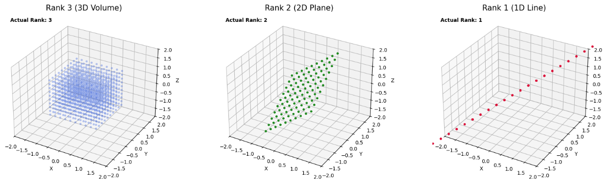

## ランクとは
行列のランク（Rank）とは、一言で言えば **「その行列が持つ情報の『正味の次元数』」** のことです。

行列は一見すると $n \times m$ 個の数字が並んだ大きな表ですが、中には「他の行や列の組み合わせで表現できてしまう無駄な情報」が含まれていることがあります。ランクは、その無駄を削ぎ落とした後に残る **「独立した情報の数」** を表します。

### 1. 直感的な理解：情報の「厚み」

行列を「空間を変化させる装置（線形写像）」として捉えると、ランクの意味が分かりやすくなります。

* **ランク3（3次元空間の場合）：** 空間を潰さず、立体のまま保つ（フルランク）。
* **ランク2：** 3次元の物体を押しつぶして「平面（2次元）」にしてしまう。
* **ランク1：** すべての点を一本の「線（1次元）」の上に押し込めてしまう。
* **ランク0：** すべてを「原点（0次元）」に消し去る（零行列のみ）。

### 2. 数学的な3つの定義（すべて同じ値になります）

ランクには、見る角度によって3つの定義がありますが、計算結果は必ず一致します。

* **列ランク：** 1次独立な**列ベクトル**の最大本数。
* **行ランク：** 1次独立な**行ベクトル**の最大本数。
* （驚くべきことに、行と列の独立な本数は常に一致します）


* **像（Image）の次元：** 行列 $A$ によってベクトル $\mathbf{x}$ を写した先の空間 $A\mathbf{x}$ の次元。

### 3. なぜランクが重要なのか？

ランクを知ることで、数学的な「解ける・解けない」の問題が一瞬で判明します。

### ① 連立方程式の解の有無

方程式 $A\mathbf{x} = \mathbf{b}$ が解を持つかどうかは、行列 $A$ のランクと、係数を増やした「拡大係数行列」のランクを比較することで判定できます。

* ランクが足りない ＝ 方程式の中に矛盾がある、または情報が足りない。

### ② 逆行列の存在

$n$ 次正方行列において、 **「ランクが $n$ である（フルランク）」** ことと、 **「逆行列が存在する（正則）」** ことは同値です。

* ランクが $n$ 未満なら、その行列は空間を押しつぶしてしまっているため、元に戻す（逆演算する）ことができません。

### 4. ランクの計算方法：掃き出し法

行列に「行基本変形（掃き出し法）」を施して、階段行列を作ったとき、 **「成分が $0$ でない行の数」** がそのままランクになります。

* **例：**

$$\begin{pmatrix} 1 & 2 & 3 \\ 0 & 1 & 1 \\ 0 & 0 & 0 \end{pmatrix}$$


この場合、3行目がすべて $0$ になったので、ランクは **2** です。


### 5. dimとの違い

「$\dim$（次元）」と「$\text{rank}$（ランク）」は非常によく似ていますが、　**「対象としているもの」**　が異なります。

結論から言うと、**$\dim$ は「箱（空間）」の大きさ**を指し、**$\text{rank}$ は「働き（写像）」の大きさ**を指します。

__1. $\dim$（次元）は「ベクトル空間」の属性__

$\dim$ は、ある**ベクトル空間 $V$** を作るために必要な「独立したベクトルの最小本数（基底の数）」を表します。

* **対象:** ベクトル空間（集合）
* **意味:** その空間がどれだけ「広がり」を持っているか。
* **例:** - 3次元空間 $\mathbb{R}^3$ の次元は $\dim(\mathbb{R}^3) = 3$ です。
* その中の「平面」という部分空間 $W$ なら $\dim(W) = 2$ です。


__2. $\text{rank}$（ランク）は「行列」の属性__

$\text{rank}$ は、ある**行列 $A$**（または線形写像）が、移した先の空間をどれだけ「使い切っているか」を表します。

* **対象:** 行列（または写像）
* **意味:** 入力された空間を、どれだけの次元の空間に「出力」できるか。
* **例:** - 3次元空間を「平面」に押しつぶす行列 $A$ があるとき、その行列のランクは $\text{rank}(A) = 2$ です。
* どんなに大きな $100 \times 100$ の行列でも、すべての行が同じ数字なら、情報を1次元にしか伝えられないので $\text{rank}(A) = 1$ になります。


__3. 両者を結ぶ「次元定理」__

この2つが混乱しやすいのは、以下の **次元定理（Rank-Nullity Theorem）** という強力な関係式があるからです。

線形写像 $f: V \to W$ において：


$$\dim(V) = \text{rank}(f) + \dim(\text{Ker} f)$$

* **$\dim(V)$:** 元々の「箱」の大きさ。
* **$\text{rank}(f)$:** 写像によって「生き残った」次元（像 $\text{Im} f$ の次元）。
* **$\dim(\text{Ker} f)$:** 写像によって「$0$ に潰された」次元（核の次元）。

> **イメージ:**
> 3次元の粘土（$\dim=3$）を平らな机に押し付けて、2次元の円盤（$\text{rank}=2$）を作ったとします。このとき、垂直方向に押しつぶされた1次元分（$\dim(\text{Ker} f)=1$）が犠牲になっています。

__4. 違いのまとめ__

| 項目 | $\dim$ (次元) | $\text{rank}$ (ランク) |
| --- | --- | --- |
| **主役** | ベクトル空間 $V$ | 行列 $A$ |
| **定義** | 基底の数 | 1次独立な列（または行）の数 |
| **直感** | その部屋が「何次元」か | その変換が「何次元分」の力を発揮するか |
| **関係性** | - | $\text{rank}(A) = \dim(\text{Im} A)$ |

__例題:__ ランク表現と次元の関係性

$m \times n$行列 $A=(a_{ij})$の列ベクトルを $a_{i}',...,a_{n}'$とするときに以下が成り立つことを証明せよ。

$$
rank A = dim S[a_{i}',...,a_{n}']
$$

---
この証明は、行列の「ランク」という指標が、その列ベクトルたちが作り出す「空間の広がり（次元）」そのものであることを示しています。

数学的な定義に基づき、論理のステップを追って証明します。

---

__証明__

__1. 用語の定義と準備__

まず、与えられた設定を整理します。

* $A$ は $m \times n$ 行列。
* $\mathbf{a}_1', \dots, \mathbf{a}_n' \in \mathbb{R}^m$ は行列 $A$ の各列ベクトル。
* $S[\mathbf{a}_1', \dots, \mathbf{a}_n']$ は、これらの列ベクトルの **線形結合によって生成される部分空間（列空間）** を指します。これを $V_{col}$ と置きます。

__2. ランクの定義（列ランク）__

行列のランク $\text{rank} A$ の定義の一つは、 **「行列 $A$ の列ベクトルのうち、1次独立なものの最大本数」** です。
今、この最大本数を $k$ と置きます。


$$\text{rank} A = k$$

__3. 次元の定義と基底__

一方で、部分空間の次元 $\dim V_{col}$ の定義は、 **「その空間を張る基底のベクトルの本数」** です。
「基底」とは、その空間内のすべてのベクトルを表現でき、かつそれ自身が1次独立であるようなベクトルの集合のことです。

__4. $k$ 本の独立なベクトルが基底であることを示す__

$\text{rank} A = k$ であることから、$\{\mathbf{a}_1', \dots, \mathbf{a}_n'\}$ の中から **1次独立な $k$ 本のベクトル** を選ぶことができます。これを $\{\mathbf{a}_{i_1}', \dots, \mathbf{a}_{i_k}'\}$ とします。

1. **1次独立性:** 定義より、これら $k$ 本は1次独立です。
2. **生成性:** ランクが $k$（最大独立本数）であるため、残りの $n-k$ 本の列ベクトルは、これら $k$ 本の線形結合で書けることになります。したがって、元のすべての列ベクトルによって生成される空間 $S[\mathbf{a}_1', \dots, \mathbf{a}_n']$ は、この $k$ 本だけでも十分に生成可能です。

__5. 結論__

以上のことから、選ばれた $k$ 本のベクトルは $S[\mathbf{a}_1', \dots, \mathbf{a}_n']$ の**基底**となります。
基底のベクトルの本数が「次元」なので、


$$\dim S[\mathbf{a}_1', \dots, \mathbf{a}_n'] = k$$


となります。

したがって、


$$\text{rank} A = \dim S[\mathbf{a}_1', \dots, \mathbf{a}_n']$$


が成立します。

__直感的な理解：なぜこれが大事なのか？__

この証明は、 **「数字の表（行列）」としてのランク** と、 **「図形的な広がり（空間）」としての次元** が、実は同じコインの裏表であることを示しています。

* **行列 $A$:** 入力ベクトルを加工する「工場」。
* **$\text{rank} A$:** その工場の「実力（何種類の独立した製品を作れるか）」。
* **$\dim S[\dots]$:** その工場から出てきた製品たちが埋め尽くす「ショールームの広さ」。

どれだけたくさんの列ベクトル（材料）を詰め込んでも、それらが互いに依存（1次従属）していれば、ショールームの次元（ランク）は上がりません。

---

__例題:__ ランクのイメージ

行列のランク（Rank）を直感的に理解するには、 **「3次元のデータが、行列によって何次元の形に押しつぶされるか」** を可視化するのが一番です。

以下のコードでは、3次元空間にある立方体の点群に対して、ランク3（潰さない）、ランク2（平面にする）、ランク1（線にする）の行列をそれぞれ作用させ、その結果を比較します。

### Pythonコード：行列のランクによる空間の虚脱（Collapse）の可視化

```python
import numpy as np
import matplotlib.pyplot as plt
from mpl_toolkits.mplot3d import Axes3D

def visualize_matrix_rank():
    # 1. 3次元の立方体状の点群データを作成
    n = 10
    x, y, z = np.meshgrid(np.linspace(-1, 1, n),
                         np.linspace(-1, 1, n),
                         np.linspace(-1, 1, n))
    points = np.vstack([x.flatten(), y.flatten(), z.flatten()])

    # 2. 異なるランクを持つ3つの行列を定義
    # ランク3: 全ての成分が独立（フルランク）
    A_rank3 = np.array([[1, 0, 0],
                        [0, 1, 0],
                        [0, 0, 1]])

    # ランク2: z成分を消去（x, yのみの平面にする）
    A_rank2 = np.array([[1, 0, 0],
                        [0, 1, 0],
                        [1, 1, 0]]) # 3行目が1,2行目の和

    # ランク1: 全ての成分を1つの直線上に投影
    A_rank1 = np.array([[1, 1, 1],
                        [1, 1, 1],
                        [1, 1, 1]]) # 全ての行が同一

    matrices = [A_rank3, A_rank2, A_rank1]
    titles = ["Rank 3 (3D Volume)", "Rank 2 (2D Plane)", "Rank 1 (1D Line)"]
    colors = ['royalblue', 'forestgreen', 'crimson']

    fig = plt.figure(figsize=(18, 5))

    for i, (A, title, color) in enumerate(zip(matrices, titles, colors)):
        # 行列を点群に作用させる (Y = A * X)
        transformed_points = A @ points
        
        ax = fig.add_subplot(1, 3, i+1, projection='3d')
        ax.scatter(transformed_points[0], transformed_points[1], transformed_points[2], 
                   c=color, alpha=0.3, s=10)
        
        # グラフの見た目調整
        ax.set_title(title, fontsize=15)
        ax.set_xlim([-2, 2]); ax.set_ylim([-2, 2]); ax.set_zlim([-2, 2])
        ax.set_xlabel('X'); ax.set_ylabel('Y'); ax.set_zlabel('Z')
        
        # ランクの根拠を表示
        rank = np.linalg.matrix_rank(A)
        ax.text2D(0.05, 0.95, f"Actual Rank: {rank}", transform=ax.transAxes, color='black', weight='bold')

    plt.tight_layout()
    plt.show()

visualize_matrix_rank()

```

__結果__

実行すると、定義した点群(コード中のpoints)に対して、各ランク違いの行列を作用させた場合のポイントを可視化しています。




__この可視化が示している「ランク」の正体__

* **Rank 3（フルランク）:**
元の立方体の「体積」が維持されています。どの方向の情報も失われていないため、この行列には**逆行列が存在し、元の形に戻すことができます。**
* **Rank 2（平面への虚脱）:**
3列目のベクトルが他の列の組み合わせ（線形従属）になっているため、奥行きの情報が失われ、データが「紙のような平面」に潰れてしまいました。**一度平面に潰れると、元の立体に戻すことは不可能です。**
* **Rank 1（線への虚脱）:**
全ての列ベクトルが同じ方向を向いているため、データは「一本の線」の上に整列してしまいました。情報のほとんどが失われ、場所を特定する自由度は1次元分しか残っていません。

## 行列のランクの影響

行列のランク（Rank）が下がったとき、連立一次方程式 $A\mathbf{x} = \mathbf{b}$ の解がどうなるのか。そのロジックを「解の存在」と「解の自由度」の2段階で整理します。

核心にあるのは、 **「行列のランク」と「拡大係数行列のランク」の比較** です。

### 1. 解が存在するか？（存在条件）

方程式 $A\mathbf{x} = \mathbf{b}$ が解を持つかどうかは、 **「ターゲット $\mathbf{b}$ が、行列 $A$ が作り出す空間（像）の中に収まっているか」** で決まります。

これを判定するのが、**クロネッカー・カペリの定理**です。

* **$\text{rank}(A) = \text{rank}(A | \mathbf{b})$ のとき：**
* **解が存在する。**
* 行列 $A$ がカバーできる範囲（像）の中に $\mathbf{b}$ がちょうど入っている状態です。


* **$\text{rank}(A) < \text{rank}(A | \mathbf{b})$ のとき：**
* **解なし（不能）。**
* $\mathbf{b}$ を付け加えたことでランクが上がるということは、$\mathbf{b}$ が $A$ の届かない次元（外側）にあることを意味します。


### 2. 解はいくつあるか？（自由度）

解が存在すると分かった後、その解が一意（1つ）か不定（無限）かは、 **「未知数の数 $n$」と「ランク」の差** で決まります。

* **$\text{rank}(A) = n$ （フルランク）のとき：**
* **解はただ1つ。**
* 入力された $n$ 次元の情報を一箇所も潰さずに伝えているため、逆算して1点に特定できます。


* **$\text{rank}(A) < n$ （ランク落ち）のとき：**
* **解は無数にある（不定）。**
* $\dim(\text{Ker} A) = n - \text{rank}(A)$ 分の次元が「ゼロ」に潰されています。この潰された次元の数だけ、解に「自由度（パラメーター）」が生まれます。


### 3. 自由度の正体：核（Kernel）

解が無限にある場合、その解は一般に以下の形で書けます。


$$\mathbf{x} = (\text{特定の解 } \mathbf{x}_p) + (\text{核 } \text{Ker} A \text{ の要素})$$

* $\mathbf{x}_p$ はとりあえず $\mathbf{b}$ に届く1点です。
* そこに、行列 $A$ で送ると「ゼロ」になってしまうベクトル（核の要素）をいくら足しても、計算結果は $\mathbf{b}$ のまま変わりません。
* つまり、**核の次元が大きければ大きいほど、解のバリエーション（自由度）が増える**というロジックです。


## まとめ

行列のランクとは、その行列が持つ **「空間を維持する能力」** の数値化です。

* **Rank = 次元数** であれば、情報は100%保持される。
* **Rank < 次元数** であれば、どこかの方向が「ペシャンコ」に潰れている。

この「潰れてしまった次元」の数が、先ほど学んだ **$\dim(\text{Ker} f)$（核の次元）** に相当します。

