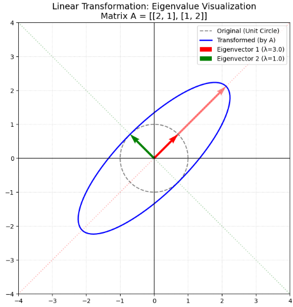

## 概念
固有値（Eigenvalue）とは、一言で言えば **「行列という『変換』を施しても、方向が変わらず、長さだけが変化する特別なベクトルの『伸び率』」** のことです。

行列を「空間をグニャリと変形させる機械」だとすると、その変形の中で **「頑固に方向を変えない軸」** がどこにあり、そこが **「どれくらい引き伸ばされるか」** を示す指標が固有値です。


### 1. 直感的なイメージ：回転しない軸

3次元空間でコマを回す様子を想像してください。コマの内部のほとんどの点は場所を移動しますが、 **回転の軸（中心線）** の上にある点だけは、場所（方向）が変わりません。

* **固有ベクトル：** 変形（行列の掛け算）を受けても、向きが変わらない特別なベクトル。
* **固有値：** その向きが変わらないベクトルが、何倍に伸び縮みしたかを表す数字。

数学的には、行列 $A$ に対し、以下の式を満たすスカラー $\lambda$ が固有値、ベクトル $\mathbf{v}$ が固有ベクトルです。


$$A\mathbf{v} = \lambda \mathbf{v}$$


### 2. なぜ固有値が必要なのか？

行列という「数字の塊」をそのまま扱うのは大変ですが、固有値を使うと **「その行列の正体」** をシンプルに暴き出すことができます。

__① 複雑な計算を「ただの掛け算」にする（対角化）__

行列を何度も掛ける計算（$A^{100}$ など）は非常に重い処理ですが、固有値がわかれば、それは単なる **「数字の100乗」** という圧倒的に軽い計算に置き換えられます。

* **応用：** 人口推移の予測、Googleの検索順位（PageRank）、マルコフ連鎖など。

__② システムの「安定性」を判定する__

物理学や制御工学において、あるシステムが安定しているか（収束するか）、暴走するか（発散するか）は、固有値の大きさで決まります。

* 固有値が 1 より小さい ＝ 次第に収束する（安全）。
* 固有値が 1 より大きい ＝ 指数関数的に膨らむ（爆発・崩壊）。

__③ 情報の「重要度」を抽出する（主成分分析）__

データ分析において、膨大なデータ項目の中から「最も情報の変化（分散）が大きい方向」を見つけ出す際に固有値を使います。

* 巨大な固有値に対応する方向 ＝ そのデータの **「本質的な特徴」** 。
* 小さな固有値に対応する方向 ＝ 無視していい **「ノイズ」** 。
* **応用：** 顔認識、画像の圧縮、アンケートデータの要約。


__④ 物理的な例：共振現象__

橋が風で揺れたり、ワイングラスが音で割れたりする「共振」も、固有値の問題です。
物体にはそれぞれ  **「固有振動数」** という、その物体が揺れやすい特定のリズムがあります。これは数学的には、その物体の構造を表す行列の固有値を計算することで求められます。

### 3. 固有ベクトルが利用される理由

システムが「安定するか」や「共振するか」という物理現象を固有値で表現できる理由は、 **「複雑な全体の動きを、単純に伸び縮みするだけの独立した要素（固有モード）の足し算に分解できるから」** です。

数学的な裏付けと物理的なイメージを組み合わせて解説します。

__1. 安定性のロジック：指数関数的な「拡大」と「収束」__

物理システムの多くは、現在の状態 $\mathbf{x}$ に対して、次の瞬間の変化が $A\mathbf{x}$ という行列で決まる微分方程式や差分方程式で記述されます。

$$\mathbf{x}_{next} = A \mathbf{x}_{now}$$

この行列 $A$ に固有値 $\lambda$ と固有ベクトル $\mathbf{v}$ があるとき、もし初期状態が固有ベクトルの方向（$\mathbf{x} = \mathbf{v}$）であれば、1ステップ後の状態は単なる掛け算になります。

$$\mathbf{x}_{next} = \lambda \mathbf{v}$$

これを繰り返すと、 $n$ ステップ後は $\lambda^n \mathbf{v}$ となります。ここで、固有値 $\lambda$ の大きさが運命を分けます。

* **$|\lambda| < 1$ のとき：** 何度も掛けるうちに $0$ に近づきます。これが**「安定（収束）」**です。
* **$|\lambda| > 1$ のとき：** わずかなズレが指数関数的に巨大化します。これが**「不安定（発散・暴走）」**です。

__2. 共振のロジック：「固有振動数」というシステムの弱点__

建物や橋、ワイングラスなどの物体は、叩くと特定の音（振動）を鳴らします。これは、物体が「揺れやすい特定の形（**固有モード**）」を持っているためです。

物理的な運動方程式 $M \ddot{\mathbf{x}} + K \mathbf{x} = \mathbf{0}$ において、この $M$（質量）と $K$（剛性）のバランスから決まる行列の固有値を計算すると、そのルート（$\sqrt{\lambda}$）が**固有振動数**に対応します。

* **なぜ共振するか：**
外部から加わる揺れのリズム（周波数）が、この固有値から計算される「固有振動数」と一致したとき、システムはそのエネルギーを効率よく吸収してしまい、振幅が劇的に増大します。
* **固有ベクトルの役割：**
固有ベクトルは、その共振が起きたときに**「建物がどのような形でしなるか」**という変形パターンを教えてくれます。

__3. なぜ「固有」値なのか？（重ね合わせの原理）__

現実の揺れやシステムの動きは非常に複雑ですが、線形なシステムであれば、 **「どんな複雑な動きも、それぞれの固有ベクトルごとの単純な動きの合計」** として書き直せます。

1. **分解：** 複雑な初期状態を、固有ベクトルの成分ごとにバラバラにする。
2. **計算：** 各成分が固有値に従ってどう変化するか（伸びるか、縮むか、回転するか）を個別に計算する。
3. **統合：** 最後にそれらを足し合わせる。

この「バラバラにして個別に考える」という手法が通用するため、最も重要な要素である「固有値」を見れば、システム全体の未来が予測できるのです。


## 固有ベクトル

固有ベクトルとは、一言で言えば **「行列という『空間の変形』を受けても、向きが変わらない特別な矢印（ベクトル）」** のことです。

行列をベクトルに掛け算すると、通常はそのベクトルは「長さ」が変わり、同時に「向き」も変わります。しかし、特定のベクトルだけは、行列を掛けても **「向きが元のままで、ただ伸び縮みするだけ」** という不思議な性質を持ちます。この「選ばれしベクトル」が固有ベクトルです。

### 1. 図形的なイメージ：変形の中の「不動の軸」

例えば、正方形のゴムシートを横方向に2倍に引き伸ばす変形（行列）を考えてみましょう。

- **斜め方向のベクトル:** 横に引っ張られるため、向きが少し横に倒れます（固有ベクトルではない）。
- **真横方向のベクトル:** そのまま横に伸びるだけで、向きは変わりません（**固有ベクトル**）。
- **真縦方向のベクトル:** 長さも向きも変わりません（これも**固有ベクトル**。伸び率1倍）。

このように、複雑な変形（行列）の中に隠れている **「変形の軸」** を見つけ出すことが、固有ベクトルを探す作業です。

### 2. 数学的な定義：$A\mathbf{v} = \lambda \mathbf{v}$

行列 $A$ に対し、ゼロでないベクトル $\mathbf{v}$ が以下の式を満たすとき、$\mathbf{v}$ を **固有ベクトル**、定数 $\lambda$ を **固有値** と呼びます。

$$A\mathbf{v} = \lambda \mathbf{v}$$

- 左辺 $A\mathbf{v}$：行列 $A$ による変形。
- 右辺 $\lambda \mathbf{v}$：ただの数字（スカラー）倍。

つまり、 **「行列を掛けるという複雑な計算が、ただの数字の掛け算と同じになってしまう」** という魔法のような瞬間をこの式は表しています。

### 3. なぜ固有ベクトルが重要なのか？

__① 空間を「一番素直な視点」で見れる__

行列 $A$ の成分（数字の並び）は、通常 $x$ 軸や $y$ 軸といった「人間が決めた基準」で書かれています。しかし、行列にとっての **「固有ベクトル」を新しい基準（基底）に選んで空間を見直す** と、行列の働きは「各軸の方向に $\lambda$ 倍するだけ」という極めて単純なものに見えます。これが **「行列の対角化」** の正体です。

__② データの「主役」を特定する__

データ分析（主成分分析）において、固有ベクトルは **「データが最も大きく散らばっている方向」** を指し示します。

- 例えば、多くの人の身長と体重のデータを分析すると、「体格の良さ」という方向に沿った大きな固有ベクトルが見つかります。これがデータの「第一主成分」となり、情報の要約に役立ちます。

### 定義

線形変換 $f: V \to V$ における固有値と固有ベクトルは、その変換の「本質的な軸」と「その軸に沿った拡大・縮小率」を定義するものです。

行列を使わずに、写像 $f$ の言葉で数学的に定義すると以下のようになります。

__1. 数学的な定義__

ベクトル空間 $V$（体 $K$ 上）の線形変換 $f: V \to V$ に対して、以下の条件を満たす $0$ でないベクトル $\mathbf{v} \in V$ とスカラー $\lambda \in K$ が存在するとき、それらを次のように呼びます。

* **固有値（Eigenvalue）**: スカラー $\lambda$
* **固有ベクトル（Eigenvector）**: ベクトル $\mathbf{v}$

> **定義式:**
> 
> $$f(\mathbf{v}) = \lambda \mathbf{v} \quad (\mathbf{v} \neq \mathbf{0})$$
> 
> 

この式が意味するのは、 **「変換 $f$ を施しても、ベクトル $\mathbf{v}$ の向き（張る空間）は変わらず、長さが $\lambda$ 倍になるだけである」** ということです。

__2. 定義の重要なポイント__

__① $\mathbf{v} \neq \mathbf{0}$ という条件__

ゼロベクトル $\mathbf{0}$ は、どんな線形変換を施しても $f(\mathbf{0}) = \mathbf{0}$ となり、常に $f(\mathbf{0}) = \lambda \mathbf{0}$ を満たしてしまいます。これでは「向きが変わらない特別な軸」を特定する役に立たないため、定義から除外されます。

__② スカラー $\lambda$ は $0$ でも良い__

固有値 $\lambda$ が $0$ になることは許容されます。
もし $f(\mathbf{v}) = 0\mathbf{v} = \mathbf{0}$ ならば、その固有ベクトル $\mathbf{v}$ は線形写像の **核（Kernel）** に含まれていることを意味します。つまり、「その方向の情報を完全に潰してしまう変換」の軸であると言えます。

__③ 固有空間（Eigenspace）__

特定の固有値 $\lambda$ に対応するすべての固有ベクトルに、ゼロベクトルを加えた集合を **固有空間 $W_\lambda$** と呼びます。


$$W_\lambda = \{ \mathbf{v} \in V \mid f(\mathbf{v}) = \lambda \mathbf{v} \}$$


これは $V$ の部分空間になります。

__3. 行列との対応関係__

ベクトル空間 $V$ の基底を一つ固定すると、線形変換 $f$ は正方行列 $A$ で表現できます。このとき、定義式は馴染みのある行列形式になります。

$$A\mathbf{v} = \lambda \mathbf{v}$$

この方程式を解くために、$(\lambda I - A)\mathbf{v} = \mathbf{0}$ と変形し、$\mathbf{v} \neq \mathbf{0}$ となる条件として**固有多項式（特性方程式）**を導きます。

$$\det(\lambda I - A) = 0$$

__4. 幾何学的な解釈の例__

* **拡大・縮小**: すべてのベクトルが固有ベクトルであり、固有値はその倍率です。
* **回転（2次元空間）**: 角度が $0^\circ, 180^\circ$ 以外の場合、向きが変わらない実ベクトルは存在しないため、実数の範囲では固有値を持ちません（複素数の範囲で考えます）。
* **射影**: 平面へ影を落とす操作。平面上のベクトルは $\lambda=1$、平面に垂直なベクトルは $\lambda=0$ の固有ベクトルになります。

## 固有値・固有ベクトル計算

固有値と固有ベクトルの計算は、行列 $A$ という「複雑な塊」を、$(\lambda, \mathbf{v})$ という「シンプルな成分」に解体する作業です。

実数成分の2次正方行列 $A = \begin{pmatrix} a & b \\ c & d \end{pmatrix}$ を例に、標準的なステップを解説します。

### 1. 固有値 $\lambda$ の計算：特性方程式を解く

固有値の定義式 $A\mathbf{v} = \lambda \mathbf{v}$ を変形すると、$(\lambda I - A)\mathbf{v} = \mathbf{0}$ となります。
$\mathbf{v}$ がゼロベクトル以外の解を持つためには、係数行列の行列式が $0$ である必要があります。

__ステップ：固有多項式 $\det(\lambda I - A) = 0$ を作る__

行列 $A = \begin{pmatrix} 1 & 2 \\ 2 & 1 \end{pmatrix}$ の場合：

$$\det \left( \lambda \begin{pmatrix} 1 & 0 \\ 0 & 1 \end{pmatrix} - \begin{pmatrix} 1 & 2 \\ 2 & 1 \end{pmatrix} \right) = \det \begin{pmatrix} \lambda-1 & -2 \\ -2 & \lambda-1 \end{pmatrix} = 0$$

行列式を計算すると：


$$(\lambda - 1)(\lambda - 1) - (-2)(-2) = \lambda^2 - 2\lambda - 3 = 0$$


これを因数分解すると $(\lambda - 3)(\lambda + 1) = 0$ となり、**固有値 $\lambda = 3, -1$** が求まります。


### 2. 固有ベクトル $\mathbf{v}$ の計算：連立方程式を解く

求まった固有値を一つずつ定義式 $A\mathbf{v} = \lambda \mathbf{v}$ に代入し、対応するベクトル $\mathbf{v} = \begin{pmatrix} x \\ y \end{pmatrix}$ を求めます。

__例1：$\lambda = 3$ のとき__

$$\begin{pmatrix} 1 & 2 \\ 2 & 1 \end{pmatrix} \begin{pmatrix} x \\ y \end{pmatrix} = 3 \begin{pmatrix} x \\ y \end{pmatrix}$$

成分ごとに書き出すと：

1. $x + 2y = 3x \implies -2x + 2y = 0 \implies x = y$
2. $2x + y = 3y \implies 2x - 2y = 0 \implies x = y$

この関係を満たすベクトルなら何でも良い（長さは自由）ので、最もシンプルな **$\mathbf{v}_1 = \begin{pmatrix} 1 \\ 1 \end{pmatrix}$** を代表とします。

__例2：$\lambda = -1$ のとき__

同様に代入すると：

1. $x + 2y = -x \implies 2x + 2y = 0 \implies x = -y$
2. $2x + y = -y \implies 2x + 2y = 0 \implies x = -y$

よって、**$\mathbf{v}_2 = \begin{pmatrix} 1 \\ -1 \end{pmatrix}$** が求まります。

### 3. 計算結果の解釈

求まった結果をまとめると、この行列 $A$ の正体が見えてきます。

* **方向 $\begin{pmatrix} 1 \\ 1 \end{pmatrix}$** に向かうベクトルは、行列を掛けると **3倍** に伸びる。
* **方向 $\begin{pmatrix} 1 \\ -1 \end{pmatrix}$** に向かうベクトルは、行列を掛けると **向きが反転（-1倍）** する。

### 4. 固有値の重複度

固有値の「重複度（Multiplicity）」には、**代数的重複度**と**幾何学的重複度**の2種類があります。

これらが一致するかどうかが、その行列を「どれだけシンプルに分解（対角化）できるか」を決める極めて重要な指標となります。


__1. 代数的重複度（Algebraic Multiplicity）__

特性方程式 $P(\lambda) = \det(\lambda I - A) = 0$ を解いたときに、その固有値が **「何重解として現れるか」** を指します。

* **意味:** 「計算上、その固有値が何個分ストックされているか」という数です。
* **例:** 特性方程式が $(\lambda - 3)^2(\lambda - 5) = 0$ ならば、
* $\lambda = 3$ の代数的重複度は **2**
* $\lambda = 5$ の代数的重複度は **1**


__2. 幾何学的重複度（Geometric Multiplicity）__

その固有値に対応する **「線形独立な固有ベクトルの最大本数」** を指します。数学的には、固有空間 $W_\lambda$ の次元 $\dim(W_\lambda)$ のことです。

* **意味:** 「その固有値の方向に、何次元分の自由な動き（軸）が実在するか」という数です。
* **計算:** 行列 $(A - \lambda I)$ のカーネル（核）の次元、つまり $n - \text{rank}(A - \lambda I)$ で求めます。

__3. なぜ2つを区別するのか？（対角化の条件）__

実は、常に **「幾何学的重複度 $\leq$ 代数的重複度」** という関係が成り立ちます。

この2つが一致しない場合、行列に「不具合」が起きているとみなされます。

__① すべて一致する場合（対角化可能）__

「計算上のストック（代数）」と同じ数だけ「実際の軸（幾何）」が存在する状態です。
このとき、行列は**対角化**でき、非常に計算しやすくなります。

__② 一致しない場合（対角化不可能 / 欠損行列）__

「計算上は2つあるはずなのに、独立な軸が1本しかない」というような状態です。これを **「欠損（Defective）」** していると言います。
この場合、行列は完全な対角行列にはなれず、**ジョルダン標準形**という「1」が少し残った形までしか簡略化できません。

__4. 具体的なイメージ：せん断変形__

例えば、以下の行列 $A$ を見てみましょう。


$$A = \begin{pmatrix} 2 & 1 \\ 0 & 2 \end{pmatrix}$$

1. **代数的重複度:** 特性方程式は $(\lambda - 2)^2 = 0$ なので、$\lambda = 2$ の代数的重複度は **2** です。
2. **幾何学的重複度:** 実際に固有ベクトルを求めると、$\begin{pmatrix} 1 \\ 0 \end{pmatrix}$ の定数倍しか出てきません。独立なベクトルは1本なので、幾何学的重複度は **1** です。

**物理的な意味:**
この変形は「横方向は2倍に伸ばす」一方で、「縦方向を斜めにずらす」動きをします。計算上は2次元分のポテンシャルがあるのに、向きが変わらない「本物の軸」は1本しか残っていません。この**「1の差」が、対角化できない（情報の完全な独立化ができない）原因**となります。


__例題:__

行列 $A = \begin{pmatrix} 1 & 2 \\ 2 & 1 \end{pmatrix}$ の固有値、固有ベクトルを求めてください。

---

__1. 固有値の計算__

固有方程式 $\det(A - \lambda I) = 0$ を解きます。

$$\det \begin{pmatrix} 1 - \lambda & 2 \\ 2 & 1 - \lambda \end{pmatrix} = 0$$

行列式の定義により：


$$(1 - \lambda)^2 - 2 \times 2 = 0$$

$$(1 - \lambda)^2 - 4 = 0$$

$$(1 - \lambda)^2 = 4$$

よって、$1 - \lambda = \pm 2$ となり、固有値は以下の2つです。

* **$\lambda_1 = 3$**
* **$\lambda_2 = -1$**

__2. 固有ベクトルの計算__

それぞれの固有値に対し、$(A - \lambda I)\mathbf{v} = \mathbf{0}$ を満たすベクトル $\mathbf{v} = \begin{pmatrix} x \\ y \end{pmatrix}$ を求めます。

__(i) $\lambda_1 = 3$ のとき__

$$\begin{pmatrix} 1 - 3 & 2 \\ 2 & 1 - 3 \end{pmatrix} \begin{pmatrix} x \\ y \end{pmatrix} = \begin{pmatrix} 0 \\ 0 \end{pmatrix}
\implies \begin{pmatrix} -2 & 2 \\ 2 & -2 \end{pmatrix} \begin{pmatrix} x \\ y \end{pmatrix} = \begin{pmatrix} 0 \\ 0 \end{pmatrix}$$

これより $-2x + 2y = 0 \implies x = y$ となります。
よって、固有ベクトルは **$\mathbf{v}_1 = c_1 \begin{pmatrix} 1 \\ 1 \end{pmatrix}$** （$c_1 \neq 0$）です。

__(ii) $\lambda_2 = -1$ のとき__

$$\begin{pmatrix} 1 - (-1) & 2 \\ 2 & 1 - (-1) \end{pmatrix} \begin{pmatrix} x \\ y \end{pmatrix} = \begin{pmatrix} 0 \\ 0 \end{pmatrix}
\implies \begin{pmatrix} 2 & 2 \\ 2 & 2 \end{pmatrix} \begin{pmatrix} x \\ y \end{pmatrix} = \begin{pmatrix} 0 \\ 0 \end{pmatrix}$$

これより $2x + 2y = 0 \implies x = -y$ となります。
よって、固有ベクトルは **$\mathbf{v}_2 = c_2 \begin{pmatrix} 1 \\ -1 \end{pmatrix}$** （$c_2 \neq 0$）です。

__3. 解答まとめ__

| 固有値 $\lambda$ | 固有ベクトル $\mathbf{v}$ (代表例) |
| --- | --- |
| **$3$** | $\begin{pmatrix} 1 \\ 1 \end{pmatrix}$ |
| **$-1$** | $\begin{pmatrix} 1 \\ -1 \end{pmatrix}$ |

この行列 $A$ は対称行列であるため、異なる固有値に対応する固有ベクトル $\begin{pmatrix} 1 \\ 1 \end{pmatrix}$ と $\begin{pmatrix} 1 \\ -1 \end{pmatrix}$ が**直交**していることが確認できます（内積が $1(1) + 1(-1) = 0$）。

---

__例題:__ 固有値と固有ベクトルの普遍性

固有値と固有ベクトルの「行列を掛けても向きが変わらない」という性質と、固有値による「伸び縮み」の様子を直感的に理解できる可視化コードを作成しました。このコードでは、以下の2つを表示します。

- 入力空間（円）: 単位円上のベクトル群。
- 出力空間（楕円）: 行列 $A$ を掛けた後のベクトル群。ここで、固有ベクトルの方向だけは、変形前後で「ライン」が重なる様子を確認できます。


```python
import numpy as np
import matplotlib.pyplot as plt

def visualize_eigenvalues():
    # 1. 可視化する行列 A の定義
    # ここでは固有値が 3 と 1、固有ベクトルが [1, 1] と [1, -1] 方向になる行列を使用
    A = np.array([[2, 1],
                  [1, 2]])

    # 固有値と固有ベクトルを計算
    eigenvalues, eigenvectors = np.linalg.eig(A)

    # 2. 単位円上の点を生成（入力ベクトル群）
    theta = np.linspace(0, 2*np.pi, 100)
    circle_points = np.array([np.cos(theta), np.sin(theta)])

    # 3. 行列 A による変形後の点を計算
    transformed_points = A @ circle_points

    # 描画設定
    fig, ax = plt.subplots(1, 1, figsize=(8, 8))
    
    # 元の円と変形後の楕円を描画
    ax.plot(circle_points[0], circle_points[1], color='gray', linestyle='--', label='Original (Unit Circle)')
    ax.plot(transformed_points[0], transformed_points[1], color='blue', label='Transformed (by A)', linewidth=2)

    # 固有ベクトルの描画
    colors = ['red', 'green']
    for i in range(len(eigenvalues)):
        val = eigenvalues[i]
        vec = eigenvectors[:, i]
        
        # 固有ベクトル方向の線（無限に続く軸）
        ax.axline((0, 0), (vec[0], vec[1]), color=colors[i], alpha=0.3, linestyle=':')
        
        # 実際の固有ベクトル（元の長さ）
        ax.quiver(0, 0, vec[0], vec[1], color=colors[i], angles='xy', scale_units='xy', scale=1, 
                  label=f'Eigenvector {i+1} (λ={val:.1f})')
        
        # 変形後の固有ベクトル（固有値倍された長さ）
        transformed_vec = val * vec
        ax.quiver(0, 0, transformed_vec[0], transformed_vec[1], color=colors[i], 
                  angles='xy', scale_units='xy', scale=1, alpha=0.5)

    # グラフのレイアウト調整
    ax.set_aspect('equal')
    ax.set_xlim(-4, 4); ax.set_ylim(-4, 4)
    ax.axhline(0, color='black', lw=1); ax.axvline(0, color='black', lw=1)
    ax.set_title(f'Linear Transformation: Eigenvalue Visualization\nMatrix A = {A.tolist()}', fontsize=14)
    ax.legend()
    ax.grid(True, linestyle=':', alpha=0.6)

    plt.show()

if __name__ == "__main__":
    visualize_eigenvalues()
```

__結果__




- 「軸」としての固有ベクトル:

    赤と緑の点線は、固有ベクトルが通る「軸」です。円が楕円に引き伸ばされても、この軸の上にある点だけは軸から外れず、ただ軸に沿って移動しているのが分かります。

- 固有値の意味:

    赤い矢印（固有値3.0）の方向は、元の長さより3倍に大きく伸びています。

    緑の矢印（固有値1.0）の方向は、長さが変わっていません。

- 楕円の形:

    実は、行列によって変形された楕円の **「長軸」と「短軸」** は、行列が対称行列であれば、それぞれの固有ベクトルの方向と一致します。


### 5. 行列の相似

行列の同じ線形変換を、異なる『視点（基底）』から眺めている状態を、行列の相似と呼びます。
数学的な定義と、それが何を意味するのかを直感的に解説します。

__1. 数学的な定義__

2つの $n$ 次正方行列 $A$ と $B$ に対して、**正則行列（逆行列を持つ行列） $P$** が存在して、以下の関係が成り立つとき、「$A$ と $B$ は**相似**である」と言います。

$$B = P^{-1}AP$$

このとき、$A \sim B$ と表記します。

__2. 直感的なイメージ：「視点」の切り替え__

行列を「空間を動かすルール（線形変換）」だと考えましょう。

* **行列 $A$:** 標準的な座標系（$x$ 軸, $y$ 軸）での動きのルール。
* **行列 $P$:** 標準的な座標系から「新しい座標系」へ乗り換えるための**チケット**（基底変換行列）。
* **行列 $B$:** 新しい座標系から見たときの、同じ動きのルール。

__動作のプロセス ($P^{-1}AP$)__

1. **$P$:** まず、新しい座標系の住人を「標準の座標系」に連れてくる。
2. **$A$:** 標準のルールで移動させる。
3. **$P^{-1}$:** 移動した結果を、また「新しい座標系」の言葉に翻訳し直す。

結果として、 **「やってることは $A$ と同じだけど、見た目の数字（行列の成分）が $B$ に変わった」** ということになります。

__3. 相似な行列の間で「変わらないもの」（不変量）__

視点を変えても、その線形変換の「本質」は変わりません。そのため、相似な行列 $A$ と $B$ は以下の値を**完全に共有**します。

| 不変量 | 意味 |
| --- | --- |
| **固有値** | その変換が持つ「伸び縮み」の倍率そのもの。 |
| **行列式 ($\det$)** | 空間を何倍に膨らませるかという「体積比」。 |
| **トレース ($\text{tr}$)** | 固有値の合計。 |
| **ランク ($\text{rank}$)** | 潰されずに残る次元の数。 |
| **特性多項式** | 固有値を求めるための方程式そのもの。 |

__4. なぜ相似が重要なのか？（対角化）__

相似の考え方を使う最大の目的は、 **「一番計算しやすい『視点』を探すこと」** にあります。

もし、行列 $A$ と相似な行列の中に、対角成分以外がすべて $0$ の**対角行列 $D$** が見つかれば（$D = P^{-1}AP$）、行列の累乗などの複雑な計算が圧倒的に楽になります。これが **「行列の対角化」** です。

> **例え話：**
> 複雑な迷路（行列 $A$）も、上空から見下ろす視点（行列 $P$ による変換）に切り替えれば、ただの直線（対角行列 $D$）に見える、というようなイメージです。

## 行列の対角化

行列の **対角化（Diagonalization）** とは、一言で言えば **「行列を、対角成分以外がすべて 0 である『対角行列』に変形すること」** です。

これは単なる計算テクニックではなく、 **「行列（線形変換）を、最も本質的で分かりやすい視点から捉え直す」** という、線形代数における非常に強力なプロセスです。

### 1. 数学的な仕組み

正方行列 $A$ に対して、**固有ベクトルを並べて作った正則行列 $P$** を用意すると、次のような式で $A$ を対角行列 $D$ に変換できます。

$$D = P^{-1}AP$$

このとき、得られる対角行列 $D$ の対角成分には、$A$ の**固有値**が並びます。

$$D = \begin{pmatrix} \lambda_1 & 0 & 0 \\ 0 & \lambda_2 & 0 \\ 0 & 0 & \ddots \end{pmatrix}$$

### 2. 対角化のメリット：なぜこれを行うのか？

対角化を行う最大の理由は、 **「行列の計算が劇的に楽になるから」** です。

### ① 累乗の計算が「一瞬」になる

行列を $n$ 回掛ける計算（$A^n$）は通常、膨大な手間がかかります。しかし、対角化されていると話が変わります。


$$A^n = (PDP^{-1})^n = P D^n P^{-1}$$


対角行列 $D$ の $n$ 乗は、 **「各成分を $n$ 乗するだけ」** で済むため、例えば 100 乗や 1000 乗の計算も一瞬で終わります。

* **応用例:** 人口動態の予測、マルコフ連鎖、フィボナッチ数列の一般項の導出。

### ② 現象の「独立化」

もともとの行列 $A$ では、各成分が互いに影響を及ぼし合って複雑に絡み合っています。対角化するということは、 **「互いに干渉しない独立した要素（固有ベクトル方向の動き）」** に分解することを意味します。

* **応用例:** 物理学における「多自由度の振動」を、独立した「固有振動」の足し算として解く。

### 3. 対角化ができる条件

すべての行列が対角化できるわけではありません。対角化が可能になるためには、以下の条件が必要です。

* **十分な数の固有ベクトルがあること:** $n$ 次正方行列に対して、線形独立な固有ベクトルが $n$ 本存在すること。
* **重複度の一致:** 以前お話しした「代数的重複度」と「幾何学的重複度」がすべての固有値で一致していること。

もし固有ベクトルが足りない場合は、完全な対角行列にはできず、 **「ジョルダン標準形」** という、対角線の上に少し「1」が残る形までしか簡略化できません。

### 4. 直感的なまとめ

対角化を日常の言葉で例えるなら、 **「ごちゃごちゃした指示書（行列 $A$）を、それぞれの担当者がやるべきシンプルな単独作業のリスト（対角行列 $D$）に整理し直す」** 作業です。

* **$P$:** 「誰がどの作業を担当するか」を決める役割（基底の変換）。
* **$D$:** 各担当者がどれくらい頑張るか（固有値）を示すリスト。

__定理:__ 

$n$ 次正方行列 $A$ の相異なる固有値を $\lambda_1, ..., \lambda_n$ $(s \leqq t)$ とする。
各固有値 $\lambda_i$ に属する固有ベクトルを $x_i$ とするとき、 $\lambda_1, ... ,$\lambda_s$ は1次独立である。


---

この定理は、線形代数学における非常に重要な基礎定理の一つです。この性質があるからこそ、相異なる固有値を持つ行列は対角化が可能になります。

数学的帰納法を用いた証明が一般的で分かりやすいため、その手順で解説します。

__証明：相異なる固有値に属する固有ベクトルの1次独立性__

**【目標】**
$s$ に関する数学的帰納法を用いて、「$x_1, x_2, \dots, x_s$ が1次独立である」ことを証明します。

__1. $s = 1$ のとき__

固有ベクトルの定義より $x_1 \neq \mathbf{0}$ です。
$c_1 x_1 = \mathbf{0}$ と仮定すると、$x_1 \neq \mathbf{0}$ より $c_1 = 0$ と定まります。
したがって、$x_1$ は1次独立です。

__2. $s = k$ まで成り立つと仮定する__

「相異なる固有値 $\lambda_1, \dots, \lambda_k$ に属する固有ベクトル $x_1, \dots, x_k$ は1次独立である」と仮定します。

__3. $s = k + 1$ のときを考える__

次のような1次関係式を仮定します。


$$c_1 x_1 + c_2 x_2 + \dots + c_k x_k + c_{k+1} x_{k+1} = \mathbf{0} \quad \cdots (\text{A})$$

この両辺に左から行列 $A$ を掛けます（$A x_i = \lambda_i x_i$ を利用）。


$$c_1 \lambda_1 x_1 + c_2 \lambda_2 x_2 + \dots + c_k \lambda_k x_k + c_{k+1} \lambda_{k+1} x_{k+1} = \mathbf{0} \quad \cdots (\text{B})$$

次に、式(A)の両辺にスカラー $\lambda_{k+1}$ を掛けます。


$$c_1 \lambda_{k+1} x_1 + c_2 \lambda_{k+1} x_2 + \dots + c_k \lambda_{k+1} x_k + c_{k+1} \lambda_{k+1} x_{k+1} = \mathbf{0} \quad \cdots (\text{C})$$

式(B)から式(C)を引くと、$x_{k+1}$ の項が消去されます。


$$c_1 (\lambda_1 - \lambda_{k+1}) x_1 + c_2 (\lambda_2 - \lambda_{k+1}) x_2 + \dots + c_k (\lambda_k - \lambda_{k+1}) x_k = \mathbf{0}$$

ここで、帰納法の仮定より $x_1, \dots, x_k$ は1次独立であるため、各係数はすべて $0$ でなければなりません。


$$c_i (\lambda_i - \lambda_{k+1}) = 0 \quad (i = 1, \dots, k)$$

前提条件として固有値はすべて相異なるため、$\lambda_i \neq \lambda_{k+1}$ です。したがって、


$$c_1 = c_2 = \dots = c_k = 0$$


となります。これを元の式(A)に代入すると、


$$0 + 0 + \dots + 0 + c_{k+1} x_{k+1} = \mathbf{0}$$


となり、$x_{k+1} \neq \mathbf{0}$ より $c_{k+1} = 0$ も導かれます。

__4. 結論__

すべての係数が $0$ であることが示されたため、$x_1, \dots, x_{k+1}$ も1次独立です。
数学的帰納法により、任意の $s$ について本定理が成り立つことが証明されました。


---

__定理:__ 固有ベクトルより構成される行列 $Q$

$A$ を $n$次正方行列、$\lambda_1, ..., \lambda_n$ を $A$ の固有値、 $x_1, ..., x_n$ をそれぞれに属する固有ベクトルとする。(ここで、$\lambda_{i}$は異なるとは仮定しない)

そして $x_{i}$ を第 $i$ 列とする正方行列を $Q$ とする。すなわち

$$
Q = (x_1, ..., x_n)
$$

の時

$$
AQ = Q \begin{pmatrix} \lambda_1 & 0 & 0 \\ 0 & \lambda_2 & 0 \\ 0 & 0 & \ddots \end{pmatrix}
$$


が成り立つ。
逆に、$n$次正方行列 $Q$ と $\nu_i$ $(i = 1, ..., n)$ が存在して

$$
AQ = Q \begin{pmatrix} \nu_1 & 0 & 0 \\ 0 & \nu_2 & 0 \\ 0 & 0 & \ddots \end{pmatrix}
$$

を満たし、$Q$ の各列ベクトルがゼロベクトルでないとすると、 $\nu_i$ は $A$ の固有値で $Q$ の第 $i$ 列は固有値 $\nu_i$ に属する固有ベクトルである。

---

__証明__

__1. 前半の証明：固有ベクトルから構成される $Q$ について__

行列 $Q$ は列ベクトル $x_1, x_2, \dots, x_n$ を並べたものなので、$Q = (x_1, x_2, \dots, x_n)$ と書けます。
このとき、左辺 $AQ$ を計算すると、行列の積の定義より各列に $A$ が掛かります。

$$AQ = A(x_1, x_2, \dots, x_n) = (Ax_1, Ax_2, \dots, Ax_n)$$

ここで、$x_i$ は固有値 $\lambda_i$ に属する固有ベクトルなので、定義より $Ax_i = \lambda_i x_i$ が成り立ちます。これを代入すると、

$$AQ = (\lambda_1 x_1, \lambda_2 x_2, \dots, \lambda_n x_n) \quad \dots \text{①}$$

次に、右辺の計算を考えます。対角行列を $D = \text{diag}(\lambda_1, \dots, \lambda_n)$ とすると、

$$QD = (x_1, x_2, \dots, x_n) \begin{pmatrix} \lambda_1 & 0 & \dots \\ 0 & \lambda_2 & \dots \\ \vdots & \vdots & \ddots \end{pmatrix}$$

行列の右から対角行列を掛ける操作は、**「各列ベクトルを対角成分でスカラー倍する」**ことと同等です。したがって、

$$QD = (\lambda_1 x_1, \lambda_2 x_2, \dots, \lambda_n x_n) \quad \dots \text{②}$$

①と②の結果が一致するため、 $AQ = QD$ が成り立ちます。

__2. 後半の証明：逆に $AQ = QD$ が成り立つ場合__

仮定より、ある行列 $Q = (q_1, q_2, \dots, q_n)$ とスカラー $\nu_1, \dots, \nu_n$ に対して $AQ = QD$ が成り立つとします。

左辺 $AQ$ は $(Aq_1, Aq_2, \dots, Aq_n)$ であり、右辺 $QD$ は $(\nu_1 q_1, \nu_2 q_2, \dots, \nu_n q_n)$ です。
行列が等しいということは、すべての列ベクトルが一致しているということなので、各 $i = 1, \dots, n$ について次が成り立ちます。

$$Aq_i = \nu_i q_i$$

ここで、仮定より $q_i$ はゼロベクトルではありません。
この式 $Aq_i = \nu_i q_i$ かつ $q_i \neq \mathbf{0}$ という形は、まさに**固有値と固有ベクトルの定義そのもの**です。

したがって、 $\nu_i$ は行列 $A$ の固有値であり、$q_i$ （すなわち $Q$ の第 $i$ 列）は $\nu_i$ に属する固有ベクトルであることが示されました。

__この定理が意味すること__

この定理は、対角化の「一歩手前」の非常に重要な状態を示しています。

* **$Q$ が正則（逆行列を持つ）なら:**
両辺に左から $Q^{-1}$ を掛けることで、 $Q^{-1}AQ = D$ という**対角化**の式が完成します。
* **$Q$ が正則である条件:**
$n$ 個の固有ベクトル $x_1, \dots, x_n$ が「1次独立」であれば、$Q$ は正則になります。

以前の「重複度」の話に戻ると、固有ベクトルが足りない（1次独立なものが $n$ 本揃わない）場合、$Q$ は作れても逆行列 $Q^{-1}$ が存在しないため、対角化の形まで持っていけない、ということになります。

---

## 固有値の重複

固有値の重複度と固有空間の次元の関係は、行列が「どれだけ綺麗に分解できるか」を測るバロメーターのようなものです。

結論から言うと、常に **「固有空間の次元（幾何学的重複度） $\leq$ 固有値の重複度（代数的重複度）」** という関係が成り立ちます。

### 1. 2つの「重複度」の定義

この関係を理解するために、まずは2つの指標を整理しましょう。

__① 代数的重複度 ($n_A$)__

特性方程式 $\det(\lambda I - A) = 0$ を解いたときの、解の重なり具合です。

* **イメージ:** 「その固有値が、計算理論上はいくつ分確保されているか」という**予約枠**の数です。

__② 幾何学的重複度 ($n_G$)__

固有空間 $W_\lambda = \{ \mathbf{v} \mid (A - \lambda I)\mathbf{v} = \mathbf{0} \}$ の次元、つまり独立した固有ベクトルの本数です。

* **イメージ:** 「その固有値に対して、実際に動ける独立した軸がいくつあるか」という**実力**の数です。

### 2. 基本的な関係式

任意の固有値 $\lambda$ に対して、以下の不等式が常に成立します。

$$1 \leq (\text{幾何学的重複度 } n_G) \leq (\text{代数的重複度 } n_A)$$

この式が意味するのは、以下の2点です。

* 固有値が1つ見つかれば、必ず最低1本は固有ベクトルが存在する（$n_G \geq 1$）。
* 実際に存在する固有ベクトルの数は、理論上の予約枠を超えることはできない（$n_G \leq n_n$）。

### 3. 対角化との関係（ここが重要！）

行列が**対角化可能**であるための必要十分条件は、すべての固有値において **「代数的重複度 ＝ 幾何学的重複度」** が成り立つことです。

__ケースA：$n_G = n_A$ （対角化できる）__

すべての予約枠に対して、同数の独立した軸が存在する場合です。行列は無駄なく「固有ベクトルの方向への伸び縮み」という単純な要素に分解できます。

__ケースB：$n_G < n_A$ （対角化できない）__

予約枠（代数）はあるのに、実際の軸（幾何）が足りない状態です。これを「行列が **欠損（Defective）** している」と呼びます。

* **例：** 2重解なのに固有ベクトルが1本しか取れない場合。
* この場合、行列は完全な対角行列にはならず、**ジョルダンブロック**という「対角線のすぐ上に1が残る構造」を持つことになります。

### 4. なぜ「実力（幾何）」が「予約枠（代数）」を下回るのか？

直感的には、 **「せん断（Shear）」** という変形をイメージすると分かりやすいです。
例えば、正方形を横にずらして平行四辺形にする変形は、計算上は2つの固有値（予約枠）を持ちますが、向きが変わらない軸は「底辺の1本」しか残っていません。

このように、空間を「ねじる」ような力が働いているとき、幾何学的重複度は代数的重複度よりも小さくなります。

以上から以下が説明できるようになります。

* **代数的重複度**: 方程式の解の数（期待値）。
* **幾何学的重複度**: 固有空間の次元（実測値）。
* **$n_G = n_A$**: 理想的な状態。行列を綺麗にバラバラにできる。
* **$n_G < n_A$**: 歪みがある状態。完全には分解しきれない。

__例題:__ 

次の行列 $A$ の固有値 $\lambda$ を全て求め、それぞれの $\lambda$ の重複度と固有空間の次元を求めよ。

(1) $\begin{pmatrix} 1 & 1 \\ 0 & 2 \end{pmatrix} $  &emsp;&emsp;&emsp;&emsp; (2) $\begin{pmatrix} 1 & 1 \\ 0 & 1 \end{pmatrix} $


---

__(1) 解答__

__1. 固有値 $\lambda$ の算出__

特性方程式 $\det(\lambda I - A) = 0$ を立てます。


$$\det \begin{pmatrix} \lambda - 1 & -1 \\ 0 & \lambda - 2 \end{pmatrix} = (\lambda - 1)(\lambda - 2) - 0 = 0$$


よって、固有値は **$\lambda = 1, 2$** です。

__2. 重複度と固有空間の次元__

* **固有値 $\lambda = 1$:**
* **代数的重複度**: $(\lambda - 1)$ の指数は $1$ なので **1** です。
* **固有空間の次元**: $(A - 1I)\mathbf{x} = \mathbf{0}$ を解くと、$\begin{pmatrix} 0 & 1 \\ 0 & 1 \end{pmatrix} \begin{pmatrix} x \\ y \end{pmatrix} = \mathbf{0} \implies y = 0$。
自由度は $x$ のみの **1** です。


* **固有値 $\lambda = 2$:**
* **代数的重複度**: $(\lambda - 2)$ の指数は $1$ なので **1** です。
* **固有空間の次元**: $(A - 2I)\mathbf{x} = \mathbf{0}$ を解くと、$\begin{pmatrix} -1 & 1 \\ 0 & 0 \end{pmatrix} \begin{pmatrix} x \\ y \end{pmatrix} = \mathbf{0} \implies x = y$。
自由度は **1** です。


__(2) 解答__

__1. 固有値 $\lambda$ の算出__

特性方程式を立てます。


$$\det \begin{pmatrix} \lambda - 1 & -1 \\ 0 & \lambda - 1 \end{pmatrix} = (\lambda - 1)^2 = 0$$


よって、固有値は **$\lambda = 1$（重解）** です。

__2. 重複度と固有空間の次元__

* **固有値 $\lambda = 1$:**
* **代数的重複度**: $(\lambda - 1)^2$ なので、重複度は **2** です。
* **固有空間の次元**: $(A - 1I)\mathbf{x} = \mathbf{0}$ を解きます。

$$\begin{pmatrix} 0 & 1 \\ 0 & 0 \end{pmatrix} \begin{pmatrix} x \\ y \end{pmatrix} = \begin{pmatrix} 0 \\ 0 \end{pmatrix}$$


ここから得られる条件は $y = 0$ のみです。$x$ は任意の値をとり得ますが、独立な変数は $x$ 一つだけなので、次元は **1** となります。

---

__定理:__

固有空間の次元の合計が、行列のサイズ $n$ を超えない

---

この命題は、**「固有空間の次元の合計が、行列のサイズ $n$ を超えない」** ことを示します。これは線形代数における非常に重要な基礎事実です。

以下に証明の手順を示します。


__証明__

$n$ 次正方行列 $A$ の異なる固有値を $\lambda_1, \lambda_2, \dots, \lambda_k$ とします。
各固有値 $\lambda_i$ に対応する固有空間 $W_i = \{ x \mid Ax = \lambda_i x \}$ の次元（幾何学的重複度）を $d_i = \dim(W_i)$ とします。

このとき、各 $W_i$ から $d_i$ 個の線形独立な固有ベクトルを選び出し、それらすべてを合わせた集合 $S$ を考えます。


$$S = \{ v_{1,1}, \dots, v_{1,d_1}, v_{2,1}, \dots, v_{2,d_2}, \dots, v_{k,1}, \dots, v_{k,d_k} \}$$


全体の要素数は $\sum_{i=1}^k d_i$ です。

__1. 固有ベクトルの線形独立性__

**「異なる固有値に属する固有ベクトルは線形独立である」** という性質があります。したがって、この集合 $S$ に含まれるすべてのベクトルを合わせても、これらは線形独立になります。

__2. 次元と基底の関係__

$A$ は $n$ 次正方行列なので、ベクトル空間 $\mathbb{C}^n$ （または $\mathbb{R}^n$）の次元は $n$ です。
線形独立なベクトルの集合 $S$ の要素数は、そのベクトル空間の次元 $n$ を超えることはできません。

$$\sum_{i=1}^k \dim(W_i) \leq n$$

したがって、固有空間の次元の合計は、行列 $A$ の次数 $n$ 以下であることが証明されました。


__この結果が意味すること__

この証明の帰結として、**「対角化の条件」** が非常に明確になります。

* **$n$ 本の固有ベクトルが揃う場合 ($\sum d_i = n$):**
このとき行列は対角化可能です。
* **固有ベクトルが足りない場合 ($\sum d_i < n$):**
このとき行列は対角化不可能です。先ほど触れた「欠損行列」であり、ジョルダン標準形への変形が必要になります。

---

__定理:__

$n$ 次正方行列 $A$ が対角化可能であるための必要十分条件は、**「$A$ が $n$ 本の線形独立な固有ベクトルを持つこと」** である。

---

行列 $A$ が対角化可能であることと、線形独立な固有ベクトルが $n$ 本存在することが同値であることを、順を追って証明します。


__証明__

__1. 「$n$ 本の線形独立な固有ベクトルを持つ $\implies$ 対角化可能」の証明__

行列 $A$ が $n$ 本の線形独立な固有ベクトル $p_1, p_2, \dots, p_n$ を持つと仮定します。それぞれの固有値を $\lambda_1, \lambda_2, \dots, \lambda_n$ とすると、定義より次が成り立ちます。


$$Ap_i = \lambda_i p_i \quad (i = 1, 2, \dots, n)$$

ここで、これらのベクトルを列に持つ行列 $P = (p_1 \ p_2 \ \dots \ p_n)$ を作ります。
$p_1, \dots, p_n$ は線形独立なので、行列 $P$ は**正則（逆行列を持つ）**です。

次に、積 $AP$ を計算すると：


$$AP = A(p_1 \ p_2 \ \dots \ p_n) = (Ap_1 \ Ap_2 \ \dots \ Ap_n) = (\lambda_1 p_1 \ \lambda_2 p_2 \ \dots \ \lambda_n p_n)$$

この右辺は、行列 $P$ に対角行列 $D = \text{diag}(\lambda_1, \dots, \lambda_n)$ を右から掛けたものと一致します。


$$AP = PD$$

$P$ は正則なので、両辺に左から $P^{-1}$ を掛けると：


$$P^{-1}AP = D$$


となり、$A$ は対角化可能です。


__2. 「対角化可能 $\implies$ $n$ 本の線形独立な固有ベクトルを持つ」の証明__

逆に、$A$ が対角化可能であると仮定します。つまり、ある正則行列 $P$ と対角行列 $D = \text{diag}(\lambda_1, \dots, \lambda_n)$ が存在して次が成り立ちます。


$$P^{-1}AP = D$$

両辺に左から $P$ を掛けると：


$$AP = PD$$

ここで $P$ の各列ベクトルを $p_1, p_2, \dots, p_n$ とすると、上の式は次のように書けます。


$$A(p_1 \ p_2 \ \dots \ p_n) = (p_1 \ p_2 \ \dots \ p_n) \begin{pmatrix} \lambda_1 & & 0 \\ & \ddots & \\ 0 & & \lambda_n \end{pmatrix}$$


各列を比較すると：


$$Ap_i = \lambda_i p_i \quad (i = 1, 2, \dots, n)$$

これは $p_i$ が固有値 $\lambda_i$ に対応する固有ベクトルであることを示しています。また、行列 $P$ は正則であるため、その列ベクトル $p_1, \dots, p_n$ は**線形独立**です。

よって、$A$ は $n$ 本の線形独立な固有ベクトルを持ちます。


__結論__

以上の 1, 2 より、行列 $A$ が対角化可能であることと、$n$ 本の線形独立な固有ベクトルを持つことは必要十分条件であることが示されました。

---

__例題:__ 次の行列が対角化可能か判断せよ。

(1) $\begin{pmatrix} 1 & 1 \\ 0 & 2 \end{pmatrix} $  &emsp;&emsp;&emsp;&emsp; (2) $\begin{pmatrix} 1 & 1 \\ 0 & 1 \end{pmatrix} $

---

先ほど証明した **「対角化の主定理（$n$ 本の線形独立な固有ベクトルが存在するか）」** に照らし合わせて、それぞれの行列を判定してみましょう。

---

__(1) $\begin{pmatrix} 1 & 1 \\ 0 & 2 \end{pmatrix}$ の場合__

__1. 固有値を求める__

固有多項式を計算します。


$$\det \begin{pmatrix} 1-\lambda & 1 \\ 0 & 2-\lambda \end{pmatrix} = (1-\lambda)(2-\lambda) = 0$$


固有値は $\lambda = 1, 2$ です。

__2. 判定__

この行列は $2 \times 2$ 行列であり、**「相異なる2つの固有値」** を持っています。
異なる固有値に対応する固有ベクトルは必ず線形独立になるため、この時点で $2$ 本の線形独立な固有ベクトルが存在することが保証されます。

**結論：対角化可能である。**

__(2) $\begin{pmatrix} 1 & 1 \\ 0 & 1 \end{pmatrix}$ の場合__

__1. 固有値を求める__

固有多項式を計算します。


$$\det \begin{pmatrix} 1-\lambda & 1 \\ 0 & 1-\lambda \end{pmatrix} = (1-\lambda)^2 = 0$$


固有値は $\lambda = 1$ （重解）です。

__2. 固有ベクトルを求める__

$\lambda = 1$ に対応する固有ベクトル $x = \begin{pmatrix} u \\ v \end{pmatrix}$ を求めます。


$$(A - 1E)x = \begin{pmatrix} 0 & 1 \\ 0 & 0 \end{pmatrix} \begin{pmatrix} u \\ v \end{pmatrix} = \begin{pmatrix} v \\ 0 \end{pmatrix} = \begin{pmatrix} 0 \\ 0 \end{pmatrix}$$


これより $v = 0$ となります。$u$ は任意なので、固有ベクトルは次のように表せます。


$$x = c \begin{pmatrix} 1 \\ 0 \end{pmatrix} \quad (c \neq 0)$$


この行列には、線形独立な固有ベクトルが **1本** しか存在しません。
$2 \times 2$ 行列に対して必要な $2$ 本のベクトルが揃わないため、主定理の条件を満たしません。

**結論：対角化不可能である。**

---

## 直交行列


数学における **直交行列（Orthogonal Matrix）** とは、一言で言えば **「回転や反転といった、ベクトルの『長さ』や『角度』を変えない変形を表す行列」** のことです。

幾何学的な美しさと、計算上の便利な性質をあわせ持っており、線形代数の中でも極めて重要な役割を果たします。

### 1. 数学的な定義
$n$ 次正方行列 $Q$ が**直交行列**であるとは、転置行列 $Q^T$ が逆行列 $Q^{-1}$ と一致することを指します。

$$Q^T Q = Q Q^T = E \quad (\text{ただし } E \text{ は単位行列})$$

これは、「自分自身を転置して掛けると単位行列になる」という非常にシンプルなルールです。


### 2. 直交行列の重要な性質
直交行列には、実用上の大きなメリットがいくつもあります。

- **逆行列が計算不要**: 
  通常、逆行列を求めるのは大変ですが、直交行列なら「入れ替える（転置する）」だけで逆行列が手に入ります。
- **ベクトルの長さを変えない（等長性）**: 
  ベクトル $x$ に $Q$ を掛けても、その長さ（ノルム）は変わりません。
- **角度（内積）を変えない**: 
  2つのベクトルに $Q$ を掛けても、そのなす角は維持されます。
- **行列式が $\pm 1$**: 
  空間を拡大したり縮小したりせず、向きを変える（回転）か、鏡に映す（反転）かだけを行います。


### 3. 列ベクトルの視点
行列 $Q$ を列ベクトルの集まり $(q_1, q_2, \dots, q_n)$ と見なすと、直交行列であるための条件は次のようになります。

1.  **各列の長さが 1 である** （正規性）
2.  **異なる列同士が垂直（内積が 0）である** （直交性）

つまり、直交行列の各列は **「正規直交基底」** を成しています。これは、座標軸をぐにゃりと曲げずに、きれいに回転させた新しい座標系を作っていることに相当します。


### 4. 具体的な例

- **回転行列**:
  2次元平面で角度 $\theta$ だけ回転させる行列は直交行列です。
  $$\begin{pmatrix} \cos\theta & -\sin\theta \\ \sin\theta & \cos\theta \end{pmatrix}$$
- **置換行列**:
  要素の順番を入れ替えるだけの行列（各行・各列に 1 がひとつだけある行列）も直交行列です。


### 5. 何のために使うのか？

- **データの主成分分析 (PCA)**: 
  多次元のデータを、情報の損失を最小限に抑えつつ、扱いやすい正規直交な軸に変換する際に使われます。
- **行列の分解（QR分解など）**: 
  行列を「直交行列」と「三角行列」に分けることで、連立方程式を高速に解いたり、固有値を求めたりします。
- **3Dグラフィックス**: 
  物体を回転させたり、カメラの視点を変えたりする処理の裏側は、ほとんどが直交行列の掛け算です。


## 行列の三角化

行列の **三角化（Triangularization）** とは、ある正方行列 $A$ を、適当な正則行列 $P$ を用いて**上三角行列**（または下三角行列）に変形することを指します。

対角化が「対角成分以外をすべて $0$ にする」という非常に厳しい条件だったのに対し、三角化は **「対角線より下側をすべて $0$ にすれば良い」** という、少し条件を緩めた変形です。


### 1. 数学的な定義

$n$ 次正方行列 $A$ に対して、正則行列 $P$ を選んで、


$$P^{-1}AP = T$$


としたとき、$T$ が**上三角行列**（対角成分より下がすべて $0$）であるなら、$A$ は三角化可能であると言います。

$$T = \begin{pmatrix} \lambda_1 & * & \cdots & * \\ 0 & \lambda_2 & \cdots & * \\ \vdots & \vdots & \ddots & \vdots \\ 0 & 0 & \cdots & \lambda_n \end{pmatrix}$$

※ このとき、対角成分 $\lambda_1, \dots, \lambda_n$ は、行列 $A$ の**固有値**になります。


### 2. 三角化の重要な性質：必ずできる！

対角化との最大の違いは、その **「汎用性」** にあります。

* **対角化**: 固有ベクトルが $n$ 本揃わないとできない（選ばれし行列のみ）。
* **三角化**: 複素数の範囲で考えれば、**どんな正方行列でも必ず可能**である。（シューア分解）

つまり、先ほどの例題で対角化に失敗した $\begin{pmatrix} 1 & 1 \\ 0 & 1 \end{pmatrix}$ のような行列でも、三角化の状態であれば常に扱うことができるのです。


### 3. 何のために三角化するのか？

なぜ「対角線より下を $0$ にする」だけで嬉しいのでしょうか。

__① 固有値がひと目でわかる__

三角行列の対角成分は、その行列の固有値そのものです。複雑な行列も三角化さえしてしまえば、固有値が丸見えになります。

__② 行列式の計算が楽になる__

三角行列の行列式は、**対角成分をすべて掛け合わせるだけ**で求まります。


$$\det(T) = \lambda_1 \times \lambda_2 \times \dots \times \lambda_n$$

__③ 指数行列や多項式の計算__

行列 $A$ の $m$ 乗などを計算する際、完全な対角行列ほどではありませんが、通常の行列よりはるかに計算の見通しが良くなります。


### 4. 「対角化」と「三角化」と「ジョルダン標準形」の関係

これらは、行列をどれだけ「掃除（単純化）」できるかのレベル分けと捉えると分かりやすいです。

* **レベル1：三角化**（誰でもなれる）
とりあえず下側を $0$ にして、固有値を並べた状態。
* **レベル2：ジョルダン標準形**（一工夫すれば誰でもなれる）
三角化をさらに進めて、対角線のすぐ上（上隣）に $1$ か $0$ しか残さない究極の整理状態。
* **レベル3：対角化**（エリートのみ）
対角線以外すべて $0$ になった完璧な状態。

__定理:__ シューアの定理（Schur's Theorem）

すべての正方行列が（複素数の範囲で）三角化可能であることを保証する定理は、一般にシューアの定理（Schur's Theorem）、あるいはシューア分解と呼ばれます。

複素数を成分とする任意の $n$ 次正方行列 $A$ に対して、次の条件を満たすユニタリ行列 $U$ と上三角行列 $T$ が必ず存在します。

$$U^* A U = T$$

ここで、$U^*$ は $U$ の随伴行列（転置して複素共役をとったもの）であり、ユニタリ行列なので $U^* = U^{-1}$ です。

---

__シューアの定理の証明__

**定理：**
複素成分の $n$ 次正方行列 $A$ に対し、あるユニタリ行列 $U$ が存在して、$U^* A U = T$ （$T$ は上三角行列）となる。


__1. $n = 1$ のとき__

$1 \times 1$ 行列はそれ自身がすでに上三角行列です。したがって、$U = (1)$ とすれば定理は明らかに成り立ちます。

__2. $n - 1$ 次で成り立つと仮定する__

「任意の $(n-1)$ 次正方行列は、ユニタリ行列によって上三角化できる」と仮定します。

__3. $n$ 次の場合を導く__

まず、行列 $A$ の固有値を一つ選び $\lambda_1$ とします（複素数の範囲では、代数学の基本定理により必ず固有値が存在します）。その固有値に対応する、長さ 1 の固有ベクトルを $u_1$ とします。
$$A u_1 = \lambda_1 u_1, \quad \|u_1\| = 1$$

次に、この $u_1$ を含み、相互に直交する $n$ 個のベクトルの組（正規直交基底） $\{u_1, u_2, \dots, u_n\}$ を作ります（グラム・シュミットの直交化法などを用いれば必ず作れます）。

これらを列ベクトルとする行列 $U_1 = (u_1 \ u_2 \ \dots \ u_n)$ を構成すると、これは**ユニタリ行列**になります。


ここで、積 $U_1^* A U_1$ を計算してみます。
$$U_1^* A U_1 = U_1^* (A u_1 \ A u_2 \ \dots \ A u_n) = U_1^* (\lambda_1 u_1 \ A u_2 \ \dots \ A u_n)$$
$U_1^*$ の各行は $u_i^*$ なので、左から掛けると：
- 第 1 行・第 1 列：$u_1^* (\lambda_1 u_1) = \lambda_1 (u_1^* u_1) = \lambda_1$
- 第 $i$ 行・第 1 列 ($i > 1$)：$u_i^* (\lambda_1 u_1) = \lambda_1 (u_i^* u_1) = 0$ （直交しているため）

よって、$U_1^* A U_1$ は次のような形になります。
$$U_1^* A U_1 = \begin{pmatrix} \lambda_1 & \mathbf{b}^* \\ \mathbf{0} & A_{n-1} \end{pmatrix}$$
ここで、$A_{n-1}$ は $(n-1)$ 次の正方行列、$\mathbf{b}^*$ は行ベクトルです。


__4. 帰納法の仮定を適用する__

ステップ 2 の仮定より、この $(n-1)$ 次行列 $A_{n-1}$ を上三角化する $(n-1)$ 次ユニタリ行列 $V$ が存在します。
$$V^* A_{n-1} V = T_{n-1} \quad (T_{n-1} \text{ は上三角行列})$$

ここで、次のような $n$ 次ユニタリ行列 $U_2$ を定義します。
$$U_2 = \begin{pmatrix} 1 & \mathbf{0}^* \\ \mathbf{0} & V \end{pmatrix}$$

最後に、$U = U_1 U_2$ とおくと、これもユニタリ行列であり、次が成り立ちます。
$$U^* A U = (U_1 U_2)^* A (U_1 U_2) = U_2^* (U_1^* A U_1) U_2$$
$$= \begin{pmatrix} 1 & \mathbf{0}^* \\ \mathbf{0} & V^* \end{pmatrix} \begin{pmatrix} \lambda_1 & \mathbf{b}^* \\ \mathbf{0} & A_{n-1} \end{pmatrix} \begin{pmatrix} 1 & \mathbf{0}^* \\ \mathbf{0} & V \end{pmatrix} = \begin{pmatrix} \lambda_1 & \mathbf{b}^* V \\ \mathbf{0} & V^* A_{n-1} V \end{pmatrix}$$
$$= \begin{pmatrix} \lambda_1 & \mathbf{b}^* V \\ \mathbf{0} & T_{n-1} \end{pmatrix}$$

右下の $T_{n-1}$ が上三角行列なので、全体の行列も上三角行列となります。

**証明終了。**


__証明のまとめ（直感的な理解）__

1.  **固有ベクトルを1本見つける**: それを軸にして座標変換し、第1列を「固有値と0」にする。
2.  **残りの部分（右下）に注目する**: 次元が一つ減った行列が残る。
3.  **同じことを繰り返す**: 行列が $1 \times 1$ になるまで繰り返せば、すべてが上三角に収まる。


__この定理から導かれる重要なこと__

この証明の過程で、「固有ベクトルが1本見つかるたびに、行列を1次元ずつ小さくできる」ことが示されました。

- **対角化**ができない理由は、このプロセスの途中で「第1行の横（$\mathbf{b}^* V$ の部分）」をどうしても 0 にできないケースがあるからです。
- 一方、**正規行列**（$AA^* = A^*A$）の場合は、この $\mathbf{b}^* V$ の部分が自動的に 0 になることが証明でき、必ず対角化できるという結論に繋がります。

次は、このシューアの定理を使って「**ケーリー・ハミルトンの定理**」を鮮やかに証明する方法を見てみますか？あるいは、実際の計算問題に挑戦してみますか？

---


__例題:__

次の行列 $A$ を、ユニタリ行列（実数なので直交行列） $U$ を用いて上三角化せよ。つまり、$U^T A U = T$ となる上三角行列 $T$ を求めよ。$$A = \begin{pmatrix} 3 & 1 \\ -1 & 1 \end{pmatrix}$$


---

それでは、シューアの定理（Schur's Theorem）を実感するために、対角化ができない（固有ベクトルが足りない）行列をターゲットにした例題を解いてみましょう。

---

### 【例題】
次の行列 $A$ を、ユニタリ行列（実数なので直交行列） $U$ を用いて上三角化せよ。
つまり、$U^T A U = T$ となる上三角行列 $T$ を求めよ。

$$A = \begin{pmatrix} 3 & 1 \\ -1 & 1 \end{pmatrix}$$

---

__【解説・手順】__

__1. 固有値を求める__

まず、特性方程式 $\det(A - \lambda E) = 0$ を解きます。
$$\det \begin{pmatrix} 3-\lambda & 1 \\ -1 & 1-\lambda \end{pmatrix} = (3-\lambda)(1-\lambda) - (-1)(1) = \lambda^2 - 4\lambda + 4 = (\lambda - 2)^2 = 0$$
固有値は **$\lambda = 2$ （重解）** です。

__2. 1つ目の固有ベクトルを求め、正規化する__

$\lambda = 2$ に対応する固有ベクトル $v_1$ を求めます。
$$(A - 2E)v_1 = \begin{pmatrix} 1 & 1 \\ -1 & -1 \end{pmatrix} \begin{pmatrix} x \\ y \end{pmatrix} = \begin{pmatrix} 0 \\ 0 \end{pmatrix} \implies x + y = 0$$
よって、$v_1 = \begin{pmatrix} 1 \\ -1 \end{pmatrix}$ が得られます。
これを長さを 1 に正規化して、$u_1$ とします。
$$u_1 = \frac{1}{\sqrt{2}} \begin{pmatrix} 1 \\ -1 \end{pmatrix}$$

__3. 正規直交基底を作る（直交行列 $U$ の構成）__

$u_1$ に直交する長さ 1 のベクトル $u_2$ を探します（2次元なので簡単に見つかります）。
$$u_2 = \frac{1}{\sqrt{2}} \begin{pmatrix} 1 \\ 1 \end{pmatrix}$$
これらを並べて直交行列 $U$ を作ります。
$$U = (u_1 \ u_2) = \frac{1}{\sqrt{2}} \begin{pmatrix} 1 & 1 \\ -1 & 1 \end{pmatrix}$$


__4. 三角化の計算 ($U^T A U$)__

実際に計算してみましょう。まず $A U$ を計算します。
$$AU = \begin{pmatrix} 3 & 1 \\ -1 & 1 \end{pmatrix} \frac{1}{\sqrt{2}} \begin{pmatrix} 1 & 1 \\ -1 & 1 \end{pmatrix} = \frac{1}{\sqrt{2}} \begin{pmatrix} 2 & 4 \\ -2 & 0 \end{pmatrix}$$
次に、左から $U^T$ を掛けます。
$$U^T (AU) = \frac{1}{\sqrt{2}} \begin{pmatrix} 1 & -1 \\ 1 & 1 \end{pmatrix} \frac{1}{\sqrt{2}} \begin{pmatrix} 2 & 4 \\ -2 & 0 \end{pmatrix} = \frac{1}{2} \begin{pmatrix} 4 & 4 \\ 0 & 4 \end{pmatrix} = \begin{pmatrix} 2 & 2 \\ 0 & 2 \end{pmatrix}$$

__結論__

得られた行列 $T$ は以下の通りです。
$$T = \begin{pmatrix} 2 & 2 \\ 0 & 2 \end{pmatrix}$$
これは上三角行列であり、対角成分には固有値 $2$ が並んでいます。


---


## 行列の多項式

行列の多項式とは、普通の多項式 $f(x) = a_n x^n + \dots + a_1 x + a_0$ の変数 $x$ のところに、**正方行列 $A$ を代入したもの**を指します。

数値の計算と似ていますが、行列特有のルール（交換法則が成り立たない、単位行列の扱いなど）があるため、非常に奥が深い分野です。

### 1. 基本的な定義
$n$ 次の多項式 $f(x) = a_n x^n + a_{n-1} x^{n-1} + \dots + a_1 x + a_0$ があるとき、行列 $A$ による多項式 $f(A)$ は次のように定義されます。

$$f(A) = a_n A^n + a_{n-1} A^{n-1} + \dots + a_1 A + a_0 E$$

**注意点:**
- **定数項 $a_0$**: 単なる数字の足し算はできないため、必ず**単位行列 $E$** を掛けて $a_0 E$ とします。
- **行列のべき乗**: $A^2 = AA, A^3 = AAA$ と計算します。当然、$A$ は正方行列である必要があります。


### 2. 行列多項式の便利な性質
行列の多項式同士では、普通の多項式と同じような計算が成り立ちます。

- **和と積**: $f(A) + g(A)$ や $f(A)g(A)$ は、普通の多項式の和や積と同じように展開・整理できます。
- **交換法則**: 一般に行列は $AB \neq BA$ ですが、**「同じ行列 $A$ の多項式同士」であれば、必ず交換可能** です。
  - 例：$f(A)g(A) = g(A)f(A)$
  - これは、すべて $A$ と $E$ の組み合わせでできているためです。


### 3. 最も重要な定理：ケーリー・ハミルトンの定理
行列の多項式を語る上で欠かせないのがこの定理です。

> **定理:** 行列 $A$ の固有多項式を $\Phi_A(\lambda) = \det(\lambda E - A)$ とすると、次が成り立つ。
> $$\Phi_A(A) = O \quad (\text{零行列})$$

つまり、**「行列は自分自身の固有多項式を満たす」** ということです。これを使うと、高次のべき乗 $A^{100}$ などを低次の多項式に次数下げして計算することができます。


### 4. 固有値との関係
行列 $A$ の固有値を $\lambda$、対応する固有ベクトルを $x$ とすると（$Ax = \lambda x$）、多項式 $f(A)$ についても非常にきれいな関係が成り立ちます。

$$f(A)x = f(\lambda)x$$

これは、**「$f(A)$ の固有値は $f(\lambda)$ になり、固有ベクトルは $A$ と共通である」** ということを意味します。この性質は、行列の関数（指数行列など）を定義する際の基礎となります。


### 5. 応用：行列の関数
多項式の次数を無限に飛ばすと（テイラー展開）、行列の指数関数 $e^A$ や三角関数 $\sin A$ なども定義できます。

- **指数行列**: $e^A = E + A + \frac{1}{2!}A^2 + \frac{1}{3!}A^3 + \dots$
  - これは微分方程式の解として、工学や物理学（量子力学など）で極めて重要です。


## ハミルトンケーリーの定理

__定理:__

**ケーリー・ハミルトンの定理（Cayley-Hamilton theorem）** は、線形代数学において「すべての正方行列は、自分自身の固有多項式を満たす」という非常に美しく、かつ強力な定理です。

行列 $A$ に、その行列から作られた特定の多項式を適用すると、必ず**零行列 $O$** になるという不思議な性質を持っています。


### 1. 定理の内容

$n$ 次正方行列 $A$ の固有多項式を $P(\lambda) = \det(\lambda E - A)$ とします。
この多項式を展開した形を次のように書きます。
$$P(\lambda) = \lambda^n + c_{n-1}\lambda^{n-1} + \dots + c_1\lambda + c_0$$

このとき、変数 $\lambda$ のところに行列 $A$ を、定数項 $c_0$ のところに $c_0 E$（単位行列）を代入すると、以下の等式が成り立ちます。

$$P(A) = A^n + c_{n-1}A^{n-1} + \dots + c_1 A + c_0 E = O$$

> **一言でいうと：** 「行列 $A$ を固有多項式に代入すると、答えは $0$（零行列）になる」


### 2. 具体例（$2 \times 2$ 行列の場合）

$2$ 次正方行列 $A = \begin{pmatrix} a & b \\ c & d \end{pmatrix}$ の場合、定理は以下のシンプルな形になります。

$$A^2 - (a+d)A + (ad-bc)E = O$$

ここで、$(a+d)$ は行列の**トレース（対角成分の和）**、$(ad-bc)$ は**行列式**です。

#### 実際に計算してみる
$A = \begin{pmatrix} 1 & 2 \\ 3 & 4 \end{pmatrix}$ とすると：
- トレース: $1 + 4 = 5$
- 行列式: $(1 \times 4) - (2 \times 3) = -2$

定理によれば $A^2 - 5A - 2E = O$ となるはずです。
1. $A^2 = \begin{pmatrix} 7 & 10 \\ 15 & 22 \end{pmatrix}$
2. $5A = \begin{pmatrix} 5 & 10 \\ 15 & 20 \end{pmatrix}$
3. $2E = \begin{pmatrix} 2 & 0 \\ 0 & 2 \end{pmatrix}$
計算すると、$A^2 - 5A - 2E = \begin{pmatrix} 7-5-2 & 10-10-0 \\ 15-15-0 & 22-20-2 \end{pmatrix} = \begin{pmatrix} 0 & 0 \\ 0 & 0 \end{pmatrix}$ となり、見事に成立します。


### 3. 何が嬉しいのか？（主な役割）

この定理を知っていると、行列の計算が劇的に楽になります。

- **高次のべき乗計算（次数下げ）**:
  例えば $A^{100}$ を計算したいとき、$A^2 = 5A + 2E$ のように変形することで、高次の式を $A$ と $E$ だけの 1 次式まで落とし込むことができます。
- **逆行列の計算**:
  $ad-bc \neq 0$ であれば、式の両辺に左から $A^{-1}$ を掛けることで、逆行列を $A$ の多項式として表現できます。
  例：$A - 5E - 2A^{-1} = O \implies A^{-1} = \frac{1}{2}(A - 5E)$
- **最小多項式の特定**:
  行列が満たす「もっとも次数の低い多項式」を探す際、この定理が上限（最大でも $n$ 次）を示してくれます。


### 4. よくある「間違い」

初心者がやりがちな、**証明になっていない「証明（？）」** があります。
> 「$P(\lambda) = \det(\lambda E - A)$ なんだから、$\lambda$ に $A$ を入れたら $P(A) = \det(A E - A) = \det(A - A) = \det(O) = 0$ だから証明終わり！」

これは**間違い**です。$\lambda$ はスカラー（数値）ですが、$A$ は行列です。$\det(A - A)$ は「数値の $0$」ですが、定理が主張しているのは「行列の $O$」です。行列を行列式の変数にそのまま代入することは定義上できません。


__例題:__

Pythonを使って、行列 $A$ が本当に自分自身の固有多項式を満たす（結果が $O$ になる）ことを確認してみます。
可視化ではありませんが、計算の演算や、帰納的な定理をプログラムで確認することができるという一例とみて頂けばと思います。


Pythonを使って、行列 $A$ が本当に自分自身の固有多項式を満たす（結果が $O$ になる）ことを確認するのは、非常に良い学習方法ですね。

数値計算ライブラリの **NumPy** を使えば、固有多項式の係数の算出から行列の代入まで、驚くほど簡単に実装できます。

__Pythonによるケーリー・ハミルトンの定理の検証__

以下のコードでは、任意の $3 \times 3$ 行列を作成し、その固有多項式を求めてから、実際に行列を代入して結果が零行列になるかを確認します。

```python
import numpy as np

# 1. 適当な3次正方行列 A を作成
A = np.array([[1, 2, 3],
              [4, 5, 6],
              [7, 8, 9]])

# 2. 固有多項式の係数を求める
# np.poly(A) は、det(xI - A) = x^n + c_{n-1}x^{n-1} + ... + c0 の係数 [1, c_{n-1}, ..., c0] を返す
coeffs = np.poly(A)
print(f"固有多項式の係数: {coeffs}")

# 3. 固有多項式 P(A) = c_n*A^n + ... + c0*E を計算
n = len(A)
PA = np.zeros_like(A, dtype=float)
E = np.eye(n)

# 各項 (coeffs[i] * A^(n-i)) を足し合わせる
for i, c in enumerate(coeffs):
    power = n - i
    if power > 0:
        PA = PA + c * np.linalg.matrix_power(A, power)
    else:
        PA = PA + c * E # 定数項には単位行列を掛ける

# 4. 結果を表示
print("\n計算結果 P(A):")
print(np.round(PA, 10))  # 浮動小数点の誤差を丸めて表示

# 零行列かどうか判定
if np.allclose(PA, 0):
    print("\n結論: P(A) は零行列になりました！定理は成立しています。")
```


__このコードのポイント__

1.  **`np.poly(A)`**:
    この関数は行列の固有多項式の係数を一気に計算してくれます。数学でいう $\det(\lambda E - A)$ を展開した時の係数リストです。
2.  **`np.linalg.matrix_power(A, power)`**:
    行列のべき乗 $A^n$ を計算します。通常の `A**n` だと「要素ごとのべき乗」になってしまうため、行列の積として計算するこの関数を使います。
3.  **浮動小数点の誤差**:
    コンピュータの計算では微小な誤差が出るため、`np.round()` や `np.allclose()` を使って「実質的に $0$ かどうか」を判断するのが実務的です。


