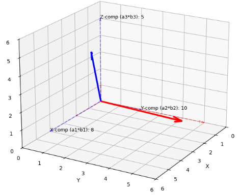
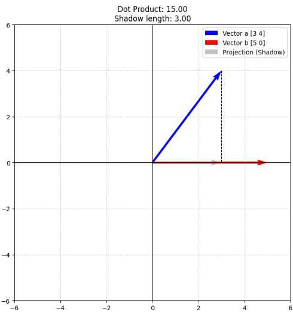
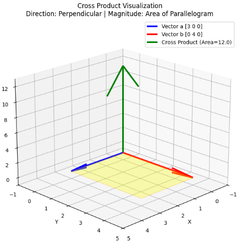
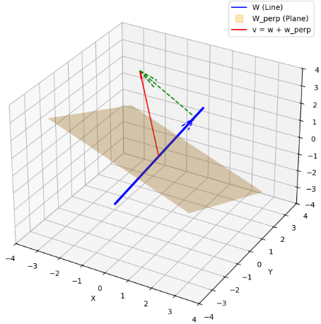
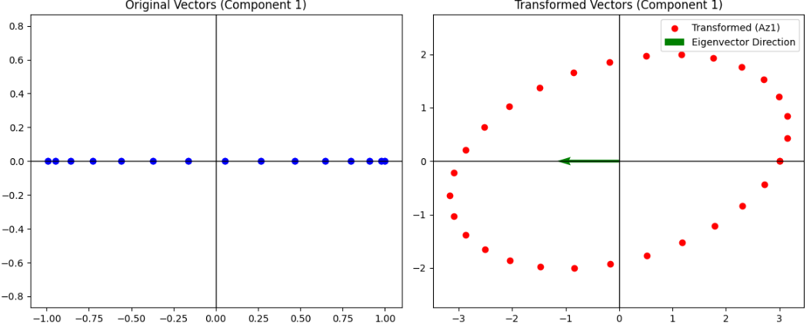

# 内積

ベクトル空間には和積演算があります。
ここまでは未だ代数的な演算をしているにすぎませんでした。
ですが、ベクトルの長さやベクトルの関係を表す内積や角度が導入されると幾何学的にとらえられるようになります。
本章ではベクトル空間に幾何学的なアプローチをとる手法について説明していきます。

## 計量

数学や線形代数の文脈における　**「計量（Metric / Metric structure）」**　とは、簡単に言うと　**「図形的な『長さ』や『角度』を測るためのルール」** のことです。

通常のベクトル空間は、単なる「矢印の集まり」であり、そのままでは「どのくらい長いか」や「どちらを向いているか」を厳密に定義できていません。そこに**内積**という仕組みを導入することで、初めて「測る」ことができるようになります。

### 1. なぜ「計量」が必要なのか？

例えば、2つのベクトル $\mathbf{x}$ と $\mathbf{y}$ があるとき、これらが「直交しているか」や「どちらが長いか」を判断するには、基準となる「ものさし」が必要です。

- **計量がない世界**: 伸び縮みするゴムの上のような世界。形はわかるが、正確な長さは測れない。
- **計量がある世界**: 硬い定規がある世界。長さ、角度、距離が確定する。

### 2. 線形代数における「計量」の正体

線形代数では、**計量行列（Metric Tensor / Gram Matrix）** というものを使って計量を表現します。

2つのベクトル $\mathbf{x}, \mathbf{y}$ の内積を次のように定義します。

$$
\langle \mathbf{x}, \mathbf{y} \rangle = \mathbf{x}^T G \mathbf{y}
$$

ここで、中心にある行列 $G$ が**計量行列**です。

- **標準的な計量**: $G$ が単位行列 $E$ のとき。私たちが普段使っている $x_1 y_1 + x_2 y_2 + \dots$ という普通の内積になります（ユークリッド計量）。
- **特殊な計量**: $G$ の値を変えると、「特定の方向だけ長さを 2 倍としてカウントする」といった、歪んだ空間の計量を定義できます。

### 3. 具体的な役割と便利さ

__① 長さ（ノルム）の定義__

計量（内積）が決まれば、ベクトルの長さ $\|\mathbf{x}\|$ は $\sqrt{\langle \mathbf{x}, \mathbf{x} \rangle}$ として定義されます。

__② 角度と直交の定義__

2つのベクトルのなす角 $\theta$ は、計量を用いて次のように計算できます。

$$
\cos \theta = \frac{\langle \mathbf{x}, \mathbf{y} \rangle}{\|\mathbf{x}\| \|\mathbf{y}\|}
$$

内積が $0$ になることを「直交」と呼びますが、これは選んだ「計量」に基づいた直交です。

__③ 物理学（相対性理論）での応用__

アインシュタインの相対性理論では、時間と空間を合わせた4次元空間の「計量」を考えます。場所によってこの計量が変化することで、「重力によって空間が歪む（長さや時間の進みが変わる）」ことを数式で表現しています。

### 4. 計量の役割

内積を考える上で、「計量（特に**計量行列**）」は、 **「空間の歪み」や「軸の測り方」を決定する司令塔**の役割を果たします。

私たちが普段使っている普通の内積（ドット積）は、実は数ある「計量」の中の特殊なケース（標準計量）に過ぎません。

__1. 内積を「一般化」する役割__
通常の内積は $\mathbf{x} \cdot \mathbf{y} = x_1 y_1 + x_2 y_2 + \dots$ ですが、これをより広いルールで定義するのが計量行列 $G$ です。

$$
\langle \mathbf{x}, \mathbf{y} \rangle = \mathbf{x}^T G \mathbf{y}
$$

この $G$ がどのような値を持つかによって、同じベクトル同士であっても **「内積の値」が変わります。** つまり、計量は **「計算のルールブック」** そのものです。

- **$G$ が単位行列 $E$ のとき**:
  私たちが知っている「直交座標系」の世界です。
- **$G$ が対角行列（成分が $2, 1, 1$ など）のとき**:
  特定の方向（この場合は $x$ 軸方向）だけ「重み」が違う世界です。
- **$G$ に非対角成分があるとき**:
  座標軸が斜めに交わっている「斜交座標系」の世界です。

__2. 「直交」の意味を決める役割__

「直交」とは「内積が $0$」であることと定義されます。しかし、**何をもって $0$（直交）とするかは計量 $G$ 次第**です。

ある計量では直交して見えるベクトルも、別の計量（別のものさし）で見れば直交していないことがあります。

- **役割:** 計量は、その空間における**「垂直」という概念の基準**を提供します。

__3. 「長さ（距離）」を定義する役割__

ベクトルの長さ（ノルム）は、自分自身との内積の平方根 $\|\mathbf{x}\| = \sqrt{\langle \mathbf{x}, \mathbf{x} \rangle}$ で決まります。

もし計量行列 $G$ の成分が大きければ、同じ成分を持つベクトルでも「より長い」と判定されます。

- **役割:** 計量は、空間の各点や各方向における**「単位長さ」のスケール**を決定します。

__4. 具体的なエンジニアリング・物理での役割__

__① 統計学（マハラノビス距離）__

データの「ばらつき」を計量として取り入れます。
データの分散が大きい方向には「甘いものさし」を、分散が小さい方向には「厳しいものさし」を適用することで、**データの分布に即した正しい「近さ」** を測れるようになります。

__② 一般相対性理論__

宇宙空間の場所ごとに計量 $G$（計量テンソル）が変化すると考えます。
「計量が変化する = 長さの測り方が変わる」ことで、光が曲がったり時間が遅れたりする **「空間の歪み」** を数学的に記述します。

## 空間の内積と外積

空間における「内積」と「外積」は、どちらも2つのベクトルから新しい値を導き出す計算ですが、その**性質と役割は全く対照的**です。

一言でいうと、内積は **「重なり（スカラー）」** を求め、外積は **「回転と面積（ベクトル）」** を求めます。

### 1. 内積（Inner Product / Dot Product）

内積は、2つのベクトルを掛け合わせて**「一つの数値（スカラー）」**を取り出す計算です。

__数学的な定義__

2つのベクトル $\mathbf{a}, \mathbf{b}$ のなす角を $\theta$ とすると：

$$
\mathbf{a} \cdot \mathbf{b} = |\mathbf{a}| |\mathbf{b}| \cos \theta
$$

成分表示（$n$ 次元）では、対応する成分同士を掛けて足します。

$$
\mathbf{a} \cdot \mathbf{b} = a_1 b_1 + a_2 b_2 + \dots + a_n b_n
$$

__役割とイメージ__

- **影の長さ（射影）**: ベクトル $\mathbf{a}$ を $\mathbf{b}$ の方向に投影したときの「重なり具合」を表します。
- **直交判定**: 内積が $0$ ならば、2つのベクトルは垂直（$90^\circ$）です。
- **エネルギーや仕事**: 物理では「力 $\times$ 移動距離 $\times \cos\theta$」で仕事量を求める際に使われます。

__定理:__

2つのベクトル $\mathbf{a}$ を $\mathbf{b}$ の成分表示を $\mathbf{a} = (a_1, a_2, a_3)$ を $\mathbf{b} = (b_1, b_2, b_3)$ とするとき、

$$
(\mathbf{a}, \mathbf{b}) = a_1 b_1 + a_2 b_2 + a_3 b_3
$$

が成立する。

---

成分表示を用いた内積の公式の証明には、**「正規直交基底」** という概念と、**「内積の基本性質（線形性）」** を用います。

この証明を理解すると、なぜ「各成分を掛けて足すだけ」というシンプルな計算で内積（$|\mathbf{a}||\mathbf{b}|\cos\theta$）が求まるのか、その仕組みがスッキリと分かります。

__1. 準備：基本単位ベクトル（正規直交基底）__

3次元空間の座標軸方向を向いた、長さ $1$ のベクトルを $\mathbf{e}_1, \mathbf{e}_2, \mathbf{e}_3$ とします。

$$
\mathbf{e}_1 = (1, 0, 0), \quad \mathbf{e}_2 = (0, 1, 0), \quad \mathbf{e}_3 = (0, 0, 1)
$$

これらは互いに直交し、長さが $1$ であるため、内積には以下の性質があります。

- **自分自身との内積**: $(\mathbf{e}_i, \mathbf{e}_i) = |\mathbf{e}_i|^2 = 1$
- **異なるもの同士の内積**: $(\mathbf{e}_i, \mathbf{e}_j) = 0 \quad (i \neq j)$

__2. ベクトルの成分表示__

ベクトル $\mathbf{a}$ と $\mathbf{b}$ は、これらの基本単位ベクトルを使って次のように書き表せます。

$$
\mathbf{a} = a_1 \mathbf{e}_1 + a_2 \mathbf{e}_2 + a_3 \mathbf{e}_3 = \sum_{i=1}^3 a_i \mathbf{e}_i
$$

$$
\mathbf{b} = b_1 \mathbf{e}_1 + b_2 \mathbf{e}_2 + b_3 \mathbf{e}_3 = \sum_{j=1}^3 b_j \mathbf{e}_j
$$



__3. 証明：内積の展開__

内積の性質（線形性：分配法則ができること）を用いて、$ (\mathbf{a}, \mathbf{b}) $ を展開します。

$$
\begin{aligned}
(\mathbf{a}, \mathbf{b}) &= (a_1 \mathbf{e}_1 + a_2 \mathbf{e}_2 + a_3 \mathbf{e}_3, \ b_1 \mathbf{e}_1 + b_2 \mathbf{e}_2 + b_3 \mathbf{e}_3) \\
&= \sum_{i=1}^3 \sum_{j=1}^3 a_i b_j (\mathbf{e}_i, \mathbf{e}_j)
\end{aligned}
$$

この和を書き出すと 9 つの項が出てきますが、前述の「正規直交基底の性質」により、ほとんどが $0$ になります。

- **$i \neq j$ の項**: $(\mathbf{e}_i, \mathbf{e}_j) = 0$ なので、すべて消えます。
  - 例: $a_1 b_2 (\mathbf{e}_1, \mathbf{e}_2) = 0$
- **$i = j$ の項**: $(\mathbf{e}_i, \mathbf{e}_i) = 1$ なので、係数だけが残ります。
  - $a_1 b_1 (\mathbf{e}_1, \mathbf{e}_1) = a_1 b_1$
  - $a_2 b_2 (\mathbf{e}_2, \mathbf{e}_2) = a_2 b_2$
  - $a_3 b_3 (\mathbf{e}_3, \mathbf{e}_3) = a_3 b_3$

これらをすべて足し合わせると、次のようになります。

$$
(\mathbf{a}, \mathbf{b}) = a_1 b_1 + a_2 b_2 + a_3 b_3
$$

**（証明終）**

---

__例題:__ ベクトルの射影（影）の可視化目的

ベクトル $\mathbf{a}$ を $\mathbf{b}$ 方向に投影した「影」を描画する。
なす角 $\theta$ が鋭角・直角・鈍角のときに、内積の正負がどう変わるかを確認する。

```python
import numpy as np
import matplotlib.pyplot as plt

def visualize_dot_product(a, b):
    # 内積の計算
    dot_val = np.dot(a, b)
  
    # ベクトル b 方向への射影ベクトル (shadow) を計算
    # formula: (a・b / |b|^2) * b
    b_norm_sq = np.dot(b, b)
    proj_a_on_b = (dot_val / b_norm_sq) * b

    # 可視化の設定
    plt.figure(figsize=(8, 8))
    plt.axhline(0, color='black', lw=1)
    plt.axvline(0, color='black', lw=1)
  
    # 元のベクトル a, b の描画
    plt.quiver(0, 0, a[0], a[1], angles='xy', scale_units='xy', scale=1, color='blue', label=f'Vector a {a}')
    plt.quiver(0, 0, b[0], b[1], angles='xy', scale_units='xy', scale=1, color='red', label=f'Vector b {b}')
  
    # 影（射影ベクトル）の描画
    plt.quiver(0, 0, proj_a_on_b[0], proj_a_on_b[1], angles='xy', scale_units='xy', scale=1, 
               color='gray', alpha=0.5, label='Projection (Shadow)')
  
    # aの先端からbのラインへ下ろす垂線
    plt.plot([a[0], proj_a_on_b[0]], [a[1], proj_a_on_b[1]], 'k--', lw=1)

    # グラフの調整
    limit = max(np.linalg.norm(a), np.linalg.norm(b)) + 1
    plt.xlim(-limit, limit)
    plt.ylim(-limit, limit)
    plt.grid(True, linestyle=':')
    plt.legend()
    plt.title(f"Dot Product: {dot_val:.2f}\nShadow length: {np.linalg.norm(proj_a_on_b):.2f}")
    plt.gca().set_aspect('equal')
    plt.show()

# --- テストケース ---
# 1. 鋭角 (内積 > 0)
visualize_dot_product(np.array([3, 4]), np.array([5, 0]))

# 2. 直角 (内積 = 0)
# visualize_dot_product(np.array([0, 4]), np.array([5, 0]))

# 3. 鈍角 (内積 < 0)
# visualize_dot_product(np.array([-2, 3]), np.array([5, 0]))
```

__結果__

- 影の長さと内積:内積 $a \cdot b$ は、「$b$ の長さ $\times$ $a$ が $b$ の上に落とす影の長さ」に対応しています。もし $b$ が単位ベクトル（長さ 1）なら、内積そのものが影の長さになります。
- 正・負・ゼロの意味:
  - 正の値: 2つのベクトルが「同じ方向」を向いている（鋭角）。
  - ゼロ: 2つのベクトルが「完全に独立（直交）」している。影が一点（原点）に潰れてしまいます。
  - 負の値: 2つのベクトルが「逆方向」を向いている（鈍角）。影が $b$ と反対方向に伸びます。



### 2. 外積（Vector Product / Cross Product）

外積は、2つのベクトルから **「新しいベクトル」** を作り出す計算です。
※主に **3次元空間** で定義されます。

__数学的な定義__

結果として得られるベクトル $\mathbf{a} \times \mathbf{b}$ は、以下の性質を持ちます。

1. **方向**: $\mathbf{a}$ と $\mathbf{b}$ の**両方に垂直**な方向（右ねじの法則）。
2. **大きさ**: $\mathbf{a}$ と $\mathbf{b}$ が作る**平行四辺形の面積**に等しい。

$$
|\mathbf{a} \times \mathbf{b}| = |\mathbf{a}| |\mathbf{b}| \sin \theta
$$

__役割とイメージ__

- **回転の軸**: トルク（力回し）や角運動量など、回転運動を記述する際に、回転の「軸」として外積が使われます。
- **法線ベクトル**: 平面の「向き」を定義するために、平面上の2ベクトルから垂直なベクトルを作ります。
- **面積計算**: 3Dグラフィックスなどでポリゴンの面積を求める際に必須です。

3次元ベクトル空間における外積（ベクトル積）を、標準基底 $\mathbf{e}_1, \mathbf{e}_2, \mathbf{e}_3$ を用いて表現すると、その構造が非常にはっきりと見えてきます。

内積が「同じ基底同士」で生き残ったのに対し、外積は **「異なる基底同士」の組み合わせ** によって新しいベクトルを生み出します。

__1. 標準基底の外積ルール__

標準基底 $\mathbf{e}_1 = (1, 0, 0), \mathbf{e}_2 = (0, 1, 0), \mathbf{e}_3 = (0, 0, 1)$ の間には、以下の「ジャンケンのような」循環ルールがあります。

* **自分自身との外積**: $\mathbf{e}_i \times \mathbf{e}_i = \mathbf{0}$ （平行なもの同士の外積は $0$）
* **異なる基底との外積（正の順）**:
  * $\mathbf{e}_1 \times \mathbf{e}_2 = \mathbf{e}_3$
  * $\mathbf{e}_2 \times \mathbf{e}_3 = \mathbf{e}_1$
  * $\mathbf{e}_3 \times \mathbf{e}_1 = \mathbf{e}_2$
* **逆順の外積**: 順序を入れ替えると符号が反転します（反交換性）。
  * $\mathbf{e}_2 \times \mathbf{e}_1 = -\mathbf{e}_3$

__2. 成分表示による展開__

2つのベクトル $\mathbf{a} = a_1 \mathbf{e}_1 + a_2 \mathbf{e}_2 + a_3 \mathbf{e}_3$ と $\mathbf{b} = b_1 \mathbf{e}_1 + b_2 \mathbf{e}_2 + b_3 \mathbf{e}_3$ の外積 $\mathbf{a} \times \mathbf{b}$ を展開します。

$$
\begin{aligned}
\mathbf{a} \times \mathbf{b} &= (a_1 \mathbf{e}_1 + a_2 \mathbf{e}_2 + a_3 \mathbf{e}_3) \times (b_1 \mathbf{e}_1 + b_2 \mathbf{e}_2 + b_3 \mathbf{e}_3) \\
&= a_1 b_2 (\mathbf{e}_1 \times \mathbf{e}_2) + a_1 b_3 (\mathbf{e}_1 \times \mathbf{e}_3) + a_2 b_1 (\mathbf{e}_2 \times \mathbf{e}_1) + \dots
\end{aligned}
$$

自分自身との外積（$a_1 b_1 (\mathbf{e}_1 \times \mathbf{e}_1)$ など）はすべて消えるため、生き残る項を整理すると以下のようになります。

$$
\mathbf{a} \times \mathbf{b} = (a_2 b_3 - a_3 b_2) \mathbf{e}_1 + (a_3 b_1 - a_1 b_3) \mathbf{e}_2 + (a_1 b_2 - a_2 b_1) \mathbf{e}_3
$$

これが、私たちがよく知る**「外積の成分表示」**の正体です。

__3. 行列式（デタミナント）による表現__

標準基底を使うと、この複雑な式を**行列式の形式**で非常に美しく書き直すことができます。

$$
\mathbf{a} \times \mathbf{b} = \det \begin{pmatrix} \mathbf{e}_1 & \mathbf{e}_2 & \mathbf{e}_3 \\ a_1 & a_2 & a_3 \\ b_1 & b_2 & b_3 \end{pmatrix}
$$

この形式で 1 行目について展開（余因子展開）すると、各基底にかかる係数が自動的に求まります。



__定理:__

外積について成り立つ法則は以下の通りである。

(1) 反交換法則

$$
\mathbf{a} \times \mathbf{b} = - (\mathbf{b} \times \mathbf{a})
$$

(2) 双線形性

- 分配法則: $\mathbf{a} \times (\mathbf{b} + \mathbf{c}) = \mathbf{a} \times \mathbf{b} + \mathbf{a} \times \mathbf{c}$
- 定数倍: $(k\mathbf{a}) \times \mathbf{b} = \mathbf{a} \times (k\mathbf{b}) = k(\mathbf{a} \times \mathbf{b})$

(3) 自己外積と平行なベクトルの外積

$$
\mathbf{a} \times \mathbf{a} = \mathbf{0}
$$

$$
\mathbf{a} // \mathbf{b} \implies \mathbf{a} \times \mathbf{b} = \mathbf{0}
$$

(4) ヤコビの恒等式

$$
\mathbf{a} \times (\mathbf{b} \times \mathbf{c}) + \mathbf{b} \times (\mathbf{c} \times \mathbf{a}) + \mathbf{c} \times (\mathbf{a} \times \mathbf{b}) = \mathbf{0}
$$

---

外積の諸法則の証明には、**成分表示**を用いる方法と、**エディントンのレヴィ=チヴィタ記号（$\epsilon_{ijk}$）**を用いる方法がありますが、ここでは直感的に理解しやすい成分表示と外積の定義（幾何学的意味）を組み合わせて証明します。

__(1) 反交換法則の証明__

$$
\mathbf{a} \times \mathbf{b} = - (\mathbf{b} \times \mathbf{a})
$$

**証明：**
外積の成分表示の定義 $\mathbf{a} \times \mathbf{b} = (a_2 b_3 - a_3 b_2, a_3 b_1 - a_1 b_3, a_1 b_2 - a_2 b_1)$ を用います。
$\mathbf{b} \times \mathbf{a}$ を計算すると：

$$
\mathbf{b} \times \mathbf{a} = (b_2 a_3 - b_3 a_2, b_3 a_1 - b_1 a_3, b_1 a_2 - b_2 a_1)
$$

各成分を $\mathbf{a} \times \mathbf{b}$ と比較すると、すべての項で符号が反転していることがわかります。
例：第1成分 $b_2 a_3 - b_3 a_2 = -(a_2 b_3 - a_3 b_2)$
したがって、 $\mathbf{a} \times \mathbf{b} = - (\mathbf{b} \times \mathbf{a})$ が成り立ちます。

__(2) 双線形性の証明__

分配法則：$\mathbf{a} \times (\mathbf{b} + \mathbf{c}) = \mathbf{a} \times \mathbf{b} + \mathbf{a} \times \mathbf{c}$

**証明：**
第1成分に注目します。$(\mathbf{b} + \mathbf{c})$ の第 $i$ 成分は $(b_i + c_i)$ なので、
左辺の第1成分 $= a_2(b_3 + c_3) - a_3(b_2 + c_2)$
$= (a_2 b_3 - a_3 b_2) + (a_2 c_3 - a_3 c_2)$
これは $(\mathbf{a} \times \mathbf{b})$ の第1成分と $(\mathbf{a} \times \mathbf{c})$ の第1成分の和に等しいです。他の成分も同様です。

#### 定数倍：$(k\mathbf{a}) \times \mathbf{b} = k(\mathbf{a} \times \mathbf{b})$

**証明：**
第1成分は $(k a_2)b_3 - (k a_3)b_2 = k(a_2 b_3 - a_3 b_2)$ となり、明らかに成立します。

__(3) 自己外積と平行なベクトルの外積の証明__

$$
\mathbf{a} \times \mathbf{a} = \mathbf{0}
$$

**証明：**
外積の大きさの定義 $|\mathbf{a} \times \mathbf{b}| = |\mathbf{a}||\mathbf{b}|\sin\theta$ を用います。
自分自身とのなす角 $\theta$ は $0^\circ$ です。 $\sin 0^\circ = 0$ なので、大きさは $0$、すなわち零ベクトル $\mathbf{0}$ となります。
（成分表示でも $a_i a_j - a_j a_i = 0$ となり、簡単に示せます）

平行な場合も $\theta = 0^\circ$ または $180^\circ$ であり、 $\sin\theta = 0$ となるため同様に $\mathbf{0}$ です。

__(4) ヤコビの恒等式の証明__

$$
\mathbf{a} \times (\mathbf{b} \times \mathbf{c}) + \mathbf{b} \times (\mathbf{c} \times \mathbf{a}) + \mathbf{c} \times (\mathbf{a} \times \mathbf{b}) = \mathbf{0}
$$

**証明：**
この証明には、非常に便利な**ベクトル三重積の公式（bac-cab公式）**を用います。

$$
\mathbf{a} \times (\mathbf{b} \times \mathbf{c}) = \mathbf{b}(\mathbf{a} \cdot \mathbf{c}) - \mathbf{c}(\mathbf{a} \cdot \mathbf{b})
$$

これを使って、左辺の各項を展開します。

1. $\mathbf{a} \times (\mathbf{b} \times \mathbf{c}) = \mathbf{b}(\mathbf{a} \cdot \mathbf{c}) - \mathbf{c}(\mathbf{a} \cdot \mathbf{b})$
2. $\mathbf{b} \times (\mathbf{c} \times \mathbf{a}) = \mathbf{c}(\mathbf{b} \cdot \mathbf{a}) - \mathbf{a}(\mathbf{b} \cdot \mathbf{c})$
3. $\mathbf{c} \times (\mathbf{a} \times \mathbf{b}) = \mathbf{a}(\mathbf{c} \cdot \mathbf{b}) - \mathbf{b}(\mathbf{c} \cdot \mathbf{a})$

これらをすべて足すと：
$(\mathbf{b} \cdot \mathbf{a})$ と $(\mathbf{a} \cdot \mathbf{b})$ は内積の交換法則により等しいので、 $\mathbf{c}(\mathbf{b} \cdot \mathbf{a}) - \mathbf{c}(\mathbf{a} \cdot \mathbf{b}) = 0$ となります。
同様に $\mathbf{a}$ の項、 $\mathbf{b}$ の項もすべて打ち消し合い、結果は $\mathbf{0}$ となります。

---

## 内積空間

**内積空間（Inner Product Space）** とは、一言で言えば **「幾何学的な『長さ』や『角度』を厳密に計算できるルールが備わったベクトル空間」** のことです。

単なる「ベクトル空間」は、足し算と定数倍ができるだけの「平坦な集合」に過ぎませんが、そこに「内積」という道具をインストールすることで、空間に豊かな図形的構造が生まれます。

### 1. 内積空間の「3種の神器」

内積が定義されることで、私たちは以下の3つを数学的に扱えるようになります。

- **長さ（ノルム）**: ベクトル自体の大きさを測る。
- **角度**: 2つのベクトルがどのくらい離れているかを測る。
- **直交**: 2つのベクトルが「垂直（角度 $90^\circ$）」であることを定義する。

### 2. 内積と認められるための「4つのルール」

どんな計算でも「内積」と呼べるわけではありません。関数 $(\mathbf{x}, \mathbf{y})$ が内積であるためには、以下の4つの性質（公理）を完璧に満たす必要があります。

1. **正定値性**: 自分の内積 $(\mathbf{x}, \mathbf{x})$ は必ず $0$ 以上で、自分が $0$ のときだけ $0$ になる。
2. **対称性（共役対称性）**: 順番を入れ替えても値が変わらない（複素数の場合は共役を取る）。
3. **加法性**: $(\mathbf{x} + \mathbf{y}, \mathbf{z}) = (\mathbf{x}, \mathbf{z}) + (\mathbf{y}, \mathbf{z})$
4. **斉次性（スカラー倍）**: $(k\mathbf{x}, \mathbf{y}) = k(\mathbf{x}, \mathbf{y})$

### 3. なぜ「空間」と呼ぶのか？

「内積」というルールが空間全体に行き渡っているからです。これにより、空間内のあらゆる場所で「最短距離」を求めたり、複雑な波やデータを「直交する成分」に分解したりすることが可能になります。

__具体的な例__

- **ユークリッド空間**: 私たちが日常で使う、成分同士を掛けて足す普通の内積空間。
- **関数空間($L^2$ 空間)** : 「関数」をベクトルとみなし、積の積分 $\int f(x)g(x)dx$ を内積とする空間。フーリエ解析などの基礎になります。

### 4. 応用例

内積空間は、単なる数学の理論にとどまらず、現代のIT・AI技術、物理学、信号処理など、幅広い分野で「基盤」として用いられています。

内積空間の最大の特徴は、**「距離（似ている度合い）」** と **「直交（無相関・独立）」** を計算できることです。この性質がどのように応用されているか、具体的な例を挙げます。

__1. AI・機械学習：レコメンドシステムと検索__

現代のAIにおいて、内積空間は「データの意味的な近さ」を測るステージです。

- **コサイン類似度**: 文章や画像を数千次元のベクトルに変換し、その「内積」を計算することで、ユーザーの好みに近い商品やニュースを探し出します。
- **重みの学習**: ニューラルネットワークの各層で行われる計算（$\mathbf{w}^T \mathbf{x}$）は、入力データと学習した重みベクトルの内積そのものです。

__2. 信号処理・通信：フーリエ変換とデータ圧縮__

「関数」をベクトルとみなす内積空間（$L^2$空間）の考え方が、デジタル機器を支えています。

- **周波数分解**: 複雑な音や画像の波を、単純なサイン波・コサイン波に分解します。これは、元の信号ベクトルを「直交する基底（各周波数）」に投影し、内積によって各成分の強さを取り出す作業です。
- **ノイズ除去**: ノイズ成分と信号成分が「直交」していれば、内積を使ってノイズだけをきれいに取り除くことができます。

__3. 量子コンピュータと量子力学：ヒルベルト空間__

量子力学の世界では、物理状態は「ヒルベルト空間」と呼ばれる、複素数を扱う特別な内積空間上のベクトルとして記述されます。

- **観測と確率**: 量子ビットの状態を観測して、ある結果が得られる「確率」を計算する際に、状態ベクトル同士の内積が使われます。
- **量子ゲート**: 量子計算の操作（ゲート操作）は、内積空間の「長さ（確率の合計=1）」を保ったままベクトルを回転させる操作（ユニタリ変換）に対応します。

__4. 統計学・データ分析：主成分分析 (PCA)__

大量のデータから重要な情報だけを抜き出す際にも内積空間が活躍します。

- **次元削減**: データのばらつき（分散）が最大になるような「新しい軸」を探します。この軸は、データの共分散行列の「固有ベクトル」として求まり、元のデータをその軸へ「内積（投影）」することで、情報を保持したままデータを圧縮します。

__5. 制御工学・ロボティクス：最短経路と最適制御__

ロボットアームの動きや自動運転の進路決定において、「エネルギーを最小にする」といった最適化問題を解く際に用いられます。

- **最小二乗法**: 観測データに最も適合する数式を探す手法です。これは幾何学的には「データが成す部分空間へ、垂線を下ろす（直交射影する）」操作であり、内積によって計算されます。

## 計量ベクトル空間

ここまでの伏線を回収に行きます。

**計量ベクトル空間（Metric Vector Space）** とは、一言で言えば **「『内積』という計算ルールが備わったベクトル空間」** のことです。

通常のベクトル空間は、ベクトルの足し算と定数倍ができるだけの「平坦な集合」ですが、そこに内積を導入することで、空間に **「長さ」や「角度」という幾何学的な概念**が生まれます。この「測るための仕組み（計量）」を持った空間を計量ベクトル空間と呼びます。

### 1. なぜ「計量」が必要なのか？

数学的な「ベクトル」そのものには、本来「長さ」や「向き」という概念は含まれていません。単なる成分の並び $(x_1, x_2)$ に過ぎないからです。

- **計量がない世界**: 2つのベクトルが「どちらが長いか」も「直交しているか」も定義できない。
- **計量がある世界**: 内積を使って、長さ $\|\mathbf{x}\|$ や、なす角 $\theta$ を計算できる。

### 2. 計量を決める「内積」の役割

計量ベクトル空間において、計量（ものさし）の実体は **「内積」** です。内積が定義されることで、以下の3つが自動的に決まります。

1. **ノルム（長さ）**: 自分自身との内積の平方根 $\|\mathbf{x}\| = \sqrt{(\mathbf{x}, \mathbf{x})}$
2. **距離**: 2つのベクトルの差の長さ $d(\mathbf{x}, \mathbf{y}) = \|\mathbf{x} - \mathbf{y}\|$
3. **角度**: 内積の値から求められる $\cos \theta = \frac{(\mathbf{x}, \mathbf{y})}{\|\mathbf{x}\|\|\mathbf{y}\|}$

### 3. 「計量行列」によるカスタマイズ

計量ベクトル空間の面白い点は、**「測り方のルール（計量）」を自由に変えられる**ことです。これは**計量行列 $G$** を使って表現されます。

$$
(\mathbf{x}, \mathbf{y}) = \mathbf{x}^T G \mathbf{y}
$$

- **ユークリッド空間**: $G$ が単位行列の場合。私たちが日常で使う「普通の測り方」です。
- **統計学（マハラノビス空間）**: データのばらつき（共分散行列の逆行列）を $G$ に使うことで、データの分布に合わせた「統計的な距離」を測る空間になります。
- **相対性理論（ミンコフスキー空間）**: 時間成分だけ符号を逆にした計量を用いることで、光の進み方や時間の遅れを記述する特殊な空間になります。

### 4. エンジニアリングでの重要性

AIエンジニアやITエンジニアにとって、計量ベクトル空間は **「データの類似度を判定する土俵」** です。

- **検索エンジン**: 膨大なデータの中から、クエリ（検索語）に「最も近い」ベクトルを特定するために、その空間の計量（コサイン類似度など）を利用します。
- **最適化問題**: 誤差を最小にする（＝「正解」というベクトルに最も近づける）計算は、計量ベクトル空間における最短距離を求める作業そのものです。

__定理:__

$V$ をベクトル空間、$v_1, v_2, ..., v_n$を一つの基底とする。 $V$ の任意のベクトル $a$, $b$ が与えられたとき、$a$, $b$ をこの1次結合で表す。

$$
\mathbf{a} = a_1 \mathbf{v}_1 + ... + a_n \mathbf{v}_n  (a_i \in \mathbf{R})
$$

$$
\mathbf{b} = b_1 \mathbf{v}_1 + ... + b_n \mathbf{v}_n  (b_i \in \mathbf{R})
$$

その時、

$$
(\mathbf{a},\mathbf{b}) = a_1 b_1 + ... + a_n b_n
$$

とおくと$(\mathbf{a},\mathbf{b})$は内積である。
ここで $\mathbf{v}_1, ..., \mathbf{v}_n$ は正規直交基底である。
すなわち、

$$
(\mathbf{v}_i, \mathbf{v}_j) = 0 (i \neq j)
$$

$$
(\mathbf{v}_i, \mathbf{v}_j) = 1 (i = j)
$$

---

この定理は、**「正規直交基底を用いると、抽象的なベクトルの内積計算が、単なる成分同士の積の和に帰着する」**という線形代数の極めて重要な性質を示しています。

証明のポイントは、内積の定義に含まれる**「線形性（分配法則とスカラー倍）」**を利用して、基底ベクトルの組み合わせまで分解することです。

---

__証明__

ベクトル $\mathbf{a}$ と $\mathbf{b}$ を与えられた基底 $\mathbf{v}_1, \dots, \mathbf{v}_n$ の1次結合で表すと以下のようになります。

$$
\mathbf{a} = \sum_{i=1}^{n} a_i \mathbf{v}_i, \quad \mathbf{b} = \sum_{j=1}^{n} b_j \mathbf{v}_j
$$

これら2つのベクトルの内積 $(\mathbf{a}, \mathbf{b})$ を計算します。

__1. 内積の線形性による展開__

内積の性質（和の分解とスカラーの括り出し）を用いると、次のように展開できます。

$$
\begin{aligned}
(\mathbf{a}, \mathbf{b}) &= \left( \sum_{i=1}^{n} a_i \mathbf{v}_i, \sum_{j=1}^{n} b_j \mathbf{v}_j \right) \\
&= \sum_{i=1}^{n} a_i \left( \mathbf{v}_i, \sum_{j=1}^{n} b_j \mathbf{v}_j \right) \quad (\text{左側の線形性}) \\
&= \sum_{i=1}^{n} \sum_{j=1}^{n} a_i b_j (\mathbf{v}_i, \mathbf{v}_j) \quad (\text{右側の線形性})
\end{aligned}
$$

この時点で、元のベクトルの内積は、基底ベクトル同士の全組み合わせ（$n^2$ 個）の内積の和へと分解されました。

__2. 正規直交基底の性質の適用__

ここで、問題文にある**正規直交基底**の定義を適用します。

- $(\mathbf{v}_i, \mathbf{v}_j) = 0 \quad (i \neq j)$
- $(\mathbf{v}_i, \mathbf{v}_j) = 1 \quad (i = j)$

この性質を上記の二重和に当てはめると、インデックス $i$ と $j$ が異なる項（直交する成分同士）はすべて $0$ になって消滅します。
生き残るのは $i = j$ のとき、つまり**「同じ基底同士」のペア**のみです。

__3. 結論__

$i=j$ の項だけを抜き出すと、$(\mathbf{v}_i, \mathbf{v}_i) = 1$ なので、

$$
\begin{aligned}
(\mathbf{a}, \mathbf{b}) &= a_1 b_1 (\mathbf{v}_1, \mathbf{v}_1) + a_2 b_2 (\mathbf{v}_2, \mathbf{v}_2) + \dots + a_n b_n (\mathbf{v}_n, \mathbf{v}_n) \\
&= a_1 b_1 (1) + a_2 b_2 (1) + \dots + a_n b_n (1) \\
&= a_1 b_1 + a_2 b_2 + \dots + a_n b_n
\end{aligned}
$$

したがって、$(\mathbf{a}, \mathbf{b}) = \sum_{i=1}^{n} a_i b_i$ が成立することが証明されました。
（証明終）

---

### 5. 利用される場面

内積空間の考え方は、現代のテクノロジーにおいて「**データの似ている度合い（類似度）**」や「**情報の無駄を削ぎ落とす（直交性）**」ための不可欠な道具として、あらゆる場面で使われています。

具体的にどのようなシーンで活用されているのか、エンジニアリングや科学の視点から紹介します。

__1. 機械学習・AI：レコメンドシステム__

現代のAIにおいて、内積空間は「データの意味」を配置するステージです。

- **コサイン類似度**: ユーザーの好みと商品の特徴を多次元のベクトルとして表し、その「内積」を計算することで、ユーザーに最も近い（似ている）商品を「おすすめ」として提示します。
- **ベクトル検索**: 膨大な文章や画像データをベクトル化し、クエリ（検索語）との内積が大きいものを瞬時に探し出す技術に使われています。

__2. 通信・音声処理：データ圧縮とノイズ除去__

「関数」をベクトルとみなす内積空間の考え方が、YouTubeの動画や音楽配信を支えています。

- **周波数分解（フーリエ変換）**: 複雑な信号を、互いに「直交」するサイン波やコサイン波の成分に分解します。これは、信号ベクトルを直交する基底に投影し、内積によって各成分の強さを取り出す作業です。
- **直交周波数分割多重（OFDM）**: Wi-Fiや5G通信では、複数の信号が混ざらないよう、互いに「直交」する波形を使ってデータを送ることで、干渉を防いでいます。

__3. データ分析：主成分分析（PCA）__

大量のデータから本質的な情報だけを抜き出す際にも内積空間が活躍します。

- **次元削減**: データのばらつき（分散）が最大になるような「新しい軸」を探します。この軸は、データの共分散行列の「固有ベクトル」として求まり、元のデータをその軸へ「内積（投影）」することで、情報を保持したままデータを圧縮します。

__4. 量子計算・物理学：量子状態の記述__

量子コンピュータの理論は、すべて内積空間（特に完備性を備えた「ヒルベルト空間」）の上で構築されています。

- **状態の重ね合わせ**: 量子ビットの状態は内積空間上のベクトルとして表されます。
- **観測と確率**: ある量子状態を観測したときに特定の答えが出る「確率」は、状態ベクトル同士の内積（の絶対値の2乗）によって計算されます。

__5. 制御工学・最適化：最小二乗法__

ロボットアームの制御や、実験データから最適な近似式を求める際に用いられます。

- **直交射影**: 観測データに最も「近い」モデルを求める問題は、幾何学的には「データが成す部分空間へ、垂線を下ろす」操作です。この「垂線を下ろす（＝直交させる）」計算は、内積によって行われます。

__まとめ：なぜ内積空間が必要なのか？__

私たちが **「何かが何かに似ている」「無駄な情報を取り除く」「一番効率的な状態を探す」** といった判断をコンピュータに実行させたいとき、内積空間という「ものさし」がなければ、それらを数式として定義し、計算することができないからです。

次は、この内積空間の考え方を応用して、**「2つの文章がどれくらい似ているか」をPythonで計算する（コサイン類似度）** 具体的な例題を見てみますか？

__例題:__

あなたは映画レビューサイトのエンジニアです。
4人のユーザーが「アクション」「恋愛」「SF」「ホラー」の4ジャンルに対して、5点満点で付けた評価データがあります。

1. 各ユーザーの評価をベクトルとして定義してください。
2. 「ユーザーA」と最も好みが似ているのは誰か、コサイン類似度を用いて判定してください。
3. 正規直交基底の性質（内積をノルムの積で割る）を数式通りに実装して計算してください。

【ヒント】内積空間におけるコサイン類似度の定義は以下の通りです。

$$
\cos \theta = \frac{(\mathbf{a}, \mathbf{b})}{\|\mathbf{a}\| \|\mathbf{b}\|}
$$

```python
import numpy as np

# 1. ユーザー評価データの定義 (アクション, 恋愛, SF, ホラー)
users = {
    "User_A": np.array([5, 1, 5, 1]), # アクションとSFが大好き
    "User_B": np.array([1, 5, 2, 4]), # 恋愛とホラーが好き
    "User_C": np.array([4, 2, 4, 2]), # User_Aに近い好み
    "User_D": np.array([3, 3, 3, 3])  # 全ジャンル平均的
}

def cosine_similarity(v1, v2):
    # 内積 (a, b) = a1*b1 + ... + an*bn
    dot_product = np.dot(v1, v2)
  
    # ノルム (長さ) ||v|| = sqrt((v, v))
    norm_v1 = np.linalg.norm(v1)
    norm_v2 = np.linalg.norm(v2)
  
    # コサイン類似度の計算
    return dot_product / (norm_v1 * norm_v2)

# User_A と各ユーザーの類似度を計算
target = "User_A"
print(f"--- {target} との類似度計算 ---")

for name, vec in users.items():
    if name == target: continue
  
    sim = cosine_similarity(users[target], vec)
    print(f"{name:6}: {sim:.4f}")

# 結果の解釈
# 値が 1 に近いほど「内積空間で同じ方向を向いている（好みが似ている）」ことを示します。
```

## ベクトルの長さ(ノルム)

計量ベクトル空間において、**ノルム（Norm）** はベクトルの「長さ」や「大きさ」を数学的に定義したものです。

抽象的なベクトル（関数の集まりやデータの並びなど）に対して、「どのくらい大きいのか」という直感的な指標を与える役割を持っています。

### 1. 内積から導かれるノルムの定義

計量ベクトル空間 $V$ において、任意のベクトル $\mathbf{a}$ のノルム $\|\mathbf{a}\|$ は、自分自身との内積を用いて次のように定義されます。

$$
\|\mathbf{a}\| = \sqrt{(\mathbf{a}, \mathbf{a})}
$$

これは、私たちが直交座標系でピタゴラスの定理を使って距離を求める計算（$\sqrt{a_1^2 + a_2^2 + a_3^2}$）を、より一般的な空間へ拡張したものです。

### 2. ノルムが満たすべき「3つの性質」

内積から導かれるノルムは、幾何学的な「長さ」として矛盾がないよう、以下の3つの性質を必ず満たします。

| 性質                 | 数式                                                                                 | 直感的な意味                                                                  |
| :------------------- | :----------------------------------------------------------------------------------- | :---------------------------------------------------------------------------- |
| **正定値性**   | $\|\mathbf{a}\| \geq 0$ `<br>` ($\|\mathbf{a}\|=0 \iff \mathbf{a}=\mathbf{0}$) | 長さは必ず$0$ 以上。長さが $0$ なら、それは「点（零ベクトル）」そのもの。 |
| **斉次性**     | $\|k\mathbf{a}\| = \|k\| \|\mathbf{a}\|$                                           | ベクトルを$k$ 倍に伸ばせば、長さも $\|k\|$ 倍になる。                     |
| **三角不等式** | $\|\mathbf{a} + \mathbf{b}\| \leq \|\mathbf{a}\| + \|\mathbf{b}\|$                 | 2辺の長さの和は、残りの1辺の長さより短くなることはない（近道が最短）。        |

### 3. 計量（内積の定義）が変わればノルムも変わる

「計量ベクトル空間」の面白い点は、**内積の定義（計量）を変えることで、ベクトルの「長さ」の測り方をカスタマイズできる**ことです。

- **標準的な計量（L2ノルム）**:
  普通の直線距離です。
- **重み付き計量**:
  特定の成分（例：AIモデルにおいて重要な特徴量）を強調する内積を定義すると、その方向に伸びたベクトルの「ノルム」は大きく計算されます。
- **関数空間のノルム**:
  関数 $f(x)$ をベクトルとみなす場合、内積を $\int f(x)^2 dx$ と定義すれば、ノルムはその関数の「エネルギー（振幅の大きさ）」を表すことになります。

### 4. なぜ「ノルム」という考え方が重要か？

ITやAIの分野では、ノルムは単なる「長さ」以上の意味を持ちます。

- **正規化（Normalization）**:
  ベクトルをそのノルムで割ることで、向きを保ったまま「長さ1」のベクトル（単位ベクトル）にします。これにより、データの「スケール」に惑わされず、「傾向（向き）」だけを比較できるようになります。
- **過学習の抑制（正則化）**:
  機械学習の損失関数に重みの「ノルム」を加えることで、重みが巨大になりすぎるのを防ぎ、モデルの汎化性能を高めます（L2正則化など）。

### 5. ノルムに関する定義

---

__1. コーシー・シュワルツの不等式 (Cauchy-Schwarz Inequality)__

内積とノルムを語る上で最も重要で、あらゆる証明の基礎となる不等式です。

**【定理】** 任意のベクトル $\mathbf{a}, \mathbf{b} \in V$ に対して、次が成立する。

$$
|(\mathbf{a}, \mathbf{b})| \leq \|\mathbf{a}\| \|\mathbf{b}\|
$$

（等号成立は、$\mathbf{a}$ と $\mathbf{b}$ が線形従属（一方が他方の定数倍）のときのみ）

- **意味**: 2つのベクトルの内積の絶対値は、それぞれの長さの積を超えることはありません。
- **応用**: この不等式があるおかげで、$\frac{(\mathbf{a}, \mathbf{b})}{\|\mathbf{a}\|\|\mathbf{b}\|}$ の値が必ず $-1$ から $1$ の間に収まり、なす角 $\cos \theta$ を定義できるようになります。

---

__2. 三角不等式 (Triangle Inequality)__

「2点間の最短距離は直線である」という直感を数学的に保証する定理です。

**【定理】** 任意のベクトル $\mathbf{a}, \mathbf{b} \in V$ に対して、次が成立する。

$$
\|\mathbf{a} + \mathbf{b}\| \leq \|\mathbf{a}\| + \|\mathbf{b}\|
$$

- **意味**: ベクトルを足し合わせたものの長さは、それぞれの長さを足したものより常に短いか等しくなります。
- **応用**: 誤差評価や収束性の議論において、「寄り道をした方が距離は長くなる」という性質として頻繁に使われます。

---

__3. 三平方の定理（ピタゴラスの定理）の一般化__

直交するベクトル間には、おなじみの関係式が成り立ちます。

**【定理】** 2つのベクトル $\mathbf{a}, \mathbf{b} \in V$ が直交している（$(\mathbf{a}, \mathbf{b}) = 0$）とき、次が成立する。

$$
\|\mathbf{a} + \mathbf{b}\|^2 = \|\mathbf{a}\|^2 + \|\mathbf{b}\|^2
$$

- **意味**: 直交する成分に分解されたベクトルでは、全体のエネルギー（長さの2乗）は各成分のエネルギーの和に等しくなります。
- **応用**: 信号処理において、信号を直交成分（サイン波など）に分解したとき、全体の電力が各成分の電力の和になる（パーセバルの等式）の根拠となります。

---

__4. 中線定理 (Parallelogram Law)__

平行四辺形の対角線の長さと、辺の長さの関係を示す定理です。

**【定理】** 任意のベクトル $\mathbf{a}, \mathbf{b} \in V$ に対して、次が成立する。

$$
\|\mathbf{a} + \mathbf{b}\|^2 + \|\mathbf{a} - \mathbf{b}\|^2 = 2 (\|\mathbf{a}\|^2 + \|\mathbf{b}\|^2)
$$

- **意味**: 平行四辺形の2本の対角線の長さの2乗の和は、4つの辺の長さの2乗の和に等しくなります。
- **重要性**: 実は、ある「ノルム（長さの定義）」が与えられたとき、それが「内積から導かれたものかどうか」を判定する条件（ヨルダン・フォン・ノイマンの定理）として使われます。

---

__5. 分解定理（直交射影）__

あるベクトルを、特定の方向とその垂直な方向に一意に分解できるという定理です。

**【定理】** 任意のベクトル $\mathbf{b}$ は、単位ベクトル $\mathbf{u}$ を用いて次のように分解できる。

$$
\mathbf{b} = \frac{(\mathbf{b}, \mathbf{u})}{\|\mathbf{u}\|^2}\mathbf{u} + \mathbf{w} \quad \text{where } (\mathbf{u}, \mathbf{w}) = 0
$$

- **意味**: 第1項が $\mathbf{u}$ 方向への「影（射影）」であり、第2項がその「残差（垂直成分）」です。
- **応用**: 最小二乗法やグラム・シュミットの直交化法の本質的なステップです。

---

---

計量ベクトル空間において最も重要とされる**「コーシー・シュワルツの不等式」**と**「三角不等式」**、そして**「ピタゴラスの定理」**の証明を順に解説します。

実数体 $\mathbb{R}$ 上の計量ベクトル空間を想定し、内積を $(\mathbf{a}, \mathbf{b})$、ノルムを $\|\mathbf{a}\| = \sqrt{(\mathbf{a}, \mathbf{a})}$ と表記します。

---

__1. コーシー・シュワルツの不等式の証明__

**【定理】** $|(\mathbf{a}, \mathbf{b})| \leq \|\mathbf{a}\| \|\mathbf{b}\|$

**証明：**
$\mathbf{a} = \mathbf{0}$ のときは両辺 $0$ で成立するため、$\mathbf{a} \neq \mathbf{0}$ とします。
任意のプロパティ実数 $t$ に対して、ベクトル $t\mathbf{a} + \mathbf{b}$ のノルムの2乗を考えると、内積の正定値性より常に $0$ 以上となります。

$$
\begin{aligned}
\|t\mathbf{a} + \mathbf{b}\|^2 &= (t\mathbf{a} + \mathbf{b}, t\mathbf{a} + \mathbf{b}) \\
&= t^2 (\mathbf{a}, \mathbf{a}) + 2t (\mathbf{a}, \mathbf{b}) + (\mathbf{b}, \mathbf{b}) \\
&= \|\mathbf{a}\|^2 t^2 + 2(\mathbf{a}, \mathbf{b}) t + \|\mathbf{b}\|^2 \geq 0
\end{aligned}
$$

これは $t$ に関する2次不等式です。すべての実数 $t$ でこれが成り立つためには、この2次方程式の判別式 $D/4$ が $0$ 以下である必要があります。

$$
\begin{aligned}
D/4 = (\mathbf{a}, \mathbf{b})^2 - \|\mathbf{a}\|^2 \|\mathbf{b}\|^2 &\leq 0 \\
(\mathbf{a}, \mathbf{b})^2 &\leq \|\mathbf{a}\|^2 \|\mathbf{b}\|^2
\end{aligned}
$$

両辺の平方根をとると、 $|(\mathbf{a}, \mathbf{b})| \leq \|\mathbf{a}\| \|\mathbf{b}\|$ が得られます。

__2. 三角不等式の証明__

**【定理】** $\|\mathbf{a} + \mathbf{b}\| \leq \|\mathbf{a}\| + \|\mathbf{b}\|$

**証明：**
左辺の2乗を展開し、コーシー・シュワルツの不等式を利用します。

$$
\begin{aligned}
\|\mathbf{a} + \mathbf{b}\|^2 &= (\mathbf{a} + \mathbf{b}, \mathbf{a} + \mathbf{b}) \\
&= \|\mathbf{a}\|^2 + 2(\mathbf{a}, \mathbf{b}) + \|\mathbf{b}\|^2 \\
&\leq \|\mathbf{a}\|^2 + 2|(\mathbf{a}, \mathbf{b})| + \|\mathbf{b}\|^2 \quad (\text{絶対値の方が大きいため}) \\
&\leq \|\mathbf{a}\|^2 + 2\|\mathbf{a}\| \|\mathbf{b}\| + \|\mathbf{b}\|^2 \quad (\text{コーシー・シュワルツを適用}) \\
&= (\|\mathbf{a}\| + \|\mathbf{b}\|)^2
\end{aligned}
$$

両辺は正なので、平方根をとると $\|\mathbf{a} + \mathbf{b}\| \leq \|\mathbf{a}\| + \|\mathbf{b}\|$ となります。

__3. ピタゴラスの定理の証明__

**【定理】** $(\mathbf{a}, \mathbf{b}) = 0 \implies \|\mathbf{a} + \mathbf{b}\|^2 = \|\mathbf{a}\|^2 + \|\mathbf{b}\|^2$

**証明：**
内積の展開公式をそのまま用います。

$$
\begin{aligned}
\|\mathbf{a} + \mathbf{b}\|^2 &= (\mathbf{a} + \mathbf{b}, \mathbf{a} + \mathbf{b}) \\
&= (\mathbf{a}, \mathbf{a}) + (\mathbf{a}, \mathbf{b}) + (\mathbf{b}, \mathbf{a}) + (\mathbf{b}, \mathbf{b}) \\
&= \|\mathbf{a}\|^2 + 2(\mathbf{a}, \mathbf{b}) + \|\mathbf{b}\|^2
\end{aligned}
$$

ここで、$\mathbf{a}$ と $\mathbf{b}$ が直交しているという仮定より $(\mathbf{a}, \mathbf{b}) = 0$ です。これを代入すると、

$$
\|\mathbf{a} + \mathbf{b}\|^2 = \|\mathbf{a}\|^2 + \|\mathbf{b}\|^2
$$

が得られます。

中線定理と直交射影の定理は、内積空間における「図形的な対称性」と「最短距離」を数学的に保証する非常に重要な道具です。

内積の性質（線形性と対称性）のみを使って、これらを厳密に証明します。

__4. 中線定理 (Parallelogram Law) の証明__

**【定理】** $\|\mathbf{a} + \mathbf{b}\|^2 + \|\mathbf{a} - \mathbf{b}\|^2 = 2 (\|\mathbf{a}\|^2 + \|\mathbf{b}\|^2)$

**証明：**
左辺の各項を、ノルムと内積の定義 $\|\mathbf{x}\|^2 = (\mathbf{x}, \mathbf{x})$ に基づいて展開します。

まず、$\|\mathbf{a} + \mathbf{b}\|^2$ を展開すると：

$$
\|\mathbf{a} + \mathbf{b}\|^2 = (\mathbf{a} + \mathbf{b}, \mathbf{a} + \mathbf{b}) = \|\mathbf{a}\|^2 + 2(\mathbf{a}, \mathbf{b}) + \|\mathbf{b}\|^2 \quad \dots \text{①}
$$

次に、$\|\mathbf{a} - \mathbf{b}\|^2$ を展開すると：

$$
\|\mathbf{a} - \mathbf{b}\|^2 = (\mathbf{a} - \mathbf{b}, \mathbf{a} - \mathbf{b}) = \|\mathbf{a}\|^2 - 2(\mathbf{a}, \mathbf{b}) + \|\mathbf{b}\|^2 \quad \dots \text{②}
$$

①と②を足し合わせます：

$$
\begin{aligned}
\|\mathbf{a} + \mathbf{b}\|^2 + \|\mathbf{a} - \mathbf{b}\|^2 &= (\|\mathbf{a}\|^2 + 2(\mathbf{a}, \mathbf{b}) + \|\mathbf{b}\|^2) + (\|\mathbf{a}\|^2 - 2(\mathbf{a}, \mathbf{b}) + \|\mathbf{b}\|^2) \\
&= 2\|\mathbf{a}\|^2 + 2\|\mathbf{b}\|^2 \\
&= 2 (\|\mathbf{a}\|^2 + \|\mathbf{b}\|^2)
\end{aligned}
$$

__5. 分解定理（直交射影）の証明__

**【定理】** 任意のベクトル $\mathbf{b}$ は、$\mathbf{u} \neq \mathbf{0}$ に対して次のように分解でき、各成分は一意である。

$$
\mathbf{b} = \hat{\mathbf{b}} + \mathbf{w} \quad \left( \hat{\mathbf{b}} = \frac{(\mathbf{b}, \mathbf{u})}{\|\mathbf{u}\|^2}\mathbf{u}, \quad (\mathbf{u}, \mathbf{w}) = 0 \right)
$$

**証明：**
まず、$\mathbf{w} = \mathbf{b} - \hat{\mathbf{b}}$ と定義し、この $\mathbf{w}$ が $\mathbf{u}$ と直交することを示します。

$$
\begin{aligned}
(\mathbf{u}, \mathbf{w}) &= (\mathbf{u}, \mathbf{b} - \hat{\mathbf{b}}) \\
&= (\mathbf{u}, \mathbf{b}) - (\mathbf{u}, \hat{\mathbf{b}}) \\
&= (\mathbf{u}, \mathbf{b}) - \left( \mathbf{u}, \frac{(\mathbf{b}, \mathbf{u})}{\|\mathbf{u}\|^2}\mathbf{u} \right) \\
&= (\mathbf{u}, \mathbf{b}) - \frac{(\mathbf{b}, \mathbf{u})}{\|\mathbf{u}\|^2} (\mathbf{u}, \mathbf{u}) \\
&= (\mathbf{u}, \mathbf{b}) - \frac{(\mathbf{b}, \mathbf{u})}{\|\mathbf{u}\|^2} \|\mathbf{u}\|^2 \\
&= (\mathbf{u}, \mathbf{b}) - (\mathbf{b}, \mathbf{u}) \\
&= 0 \quad (\text{内積の対称性より})
\end{aligned}
$$

$(\mathbf{u}, \mathbf{w}) = 0$ が示されたため、ベクトル $\mathbf{b}$ は「$\mathbf{u}$ 方向の成分 $\hat{\mathbf{b}}$」と「それに直交する成分 $\mathbf{w}$」に分解できていることが確認できました。

※この $\hat{\mathbf{b}}$ は、$\mathbf{u}$ が張る直線上の点の中で、$\mathbf{b}$ に最も近い点（最短距離を与える点）になっています。

**（証明終）**

---

## ベクトルのなす角

計量ベクトル空間において「ベクトルのなす角」を定義できることは、抽象的な数式に「形」や「向き」という直感的な幾何学構造を与える決定的なステップです。

この定義を支えているのは、先ほど証明した**コーシー・シュワルツの不等式**です。

### 1. なす角 $\theta$ の定義

2つの 0 でないベクトル $\mathbf{a}, \mathbf{b} \in V$ に対して、そのなす角 $\theta$ ($0 \leq \theta \leq \pi$) は次のように定義されます。

$$
\cos \theta = \frac{(\mathbf{a}, \mathbf{b})}{\|\mathbf{a}\| \|\mathbf{b}\|}
$$

__なぜこの定義が可能なのか？__

コーシー・シュワルツの不等式 $|(\mathbf{a}, \mathbf{b})| \leq \|\mathbf{a}\| \|\mathbf{b}\|$ により、以下の関係が常に成り立ちます。

$$
-1 \leq \frac{(\mathbf{a}, \mathbf{b})}{\|\mathbf{a}\| \|\mathbf{b}\|} \leq 1
$$

この値の範囲が $[-1, 1]$ に収まるおかげで、対応する角度 $\theta$ が必ず一つに定まるのです。

### 2. なす角からわかる関係性

内積の値（あるいは $\cos \theta$ の値）を見るだけで、2つのベクトルの位置関係を瞬時に判別できます。

- **$\theta = 0$ (順方向)**: $\cos \theta = 1$
  一方が他方の正の定数倍であり、同じ向きを向いています。
- **$0 < \theta < \pi/2$ (鋭角)**: $(\mathbf{a}, \mathbf{b}) > 0$
  2つのベクトルは「似た方向」を向いています。
- **$\theta = \pi/2$ (直交)**: $(\mathbf{a}, \mathbf{b}) = 0$
  2つのベクトルは完全に独立しており、互いに影響を与えません。
- **$\theta = \pi$ (逆方向)**: $\cos \theta = -1$
  一方が他方の負の定数倍であり、真逆を向いています。

### 3. 実務における「なす角」の活用（コサイン類似度）

ITやAIの分野では、このなす角の概念を**コサイン類似度（Cosine Similarity）** として多用します。

これらの分野で扱う多次元データ（文章ベクトルや画像特徴量）において、ベクトルの「長さ」はデータの「量」を表し、「向き（角度）」はデータの「質や意味」を表します。

- **例**: 大量の「AIについて書かれた短い記事」と、1つの「AIについて書かれた長い論文」を比較する場合。
- **長さ（ノルム）**: 論文の方が圧倒的に長いです。
- **角度（コサイン類似度）**: 内容が同じ「AI」であれば、ベクトルの向きは非常に近くなり、角度 $\theta$ は $0$ に近くなります。

このように、データの「規模」に左右されず「本質的な意味の近さ」を測るために、内積空間のなす角が使われています。

### 4. 複素内積空間の場合（補足）

もし複素数体 $\mathbb{C}$ 上の計量ベクトル空間（エルミット内積空間）を扱う場合、内積 $(\mathbf{a}, \mathbf{b})$ は一般に複素数になるため、実数のような単純な「角度」を定義するのは難しくなります。しかし、その絶対値を用いることで、量子力学における「状態の重なり具合」として角度に近い概念が利用されます。


## シュミットの正規直交化法


**グラム・シュミットの正規直交化法（Gram-Schmidt Orthonormalization）** とは、簡単に言えば「バラバラな方向を向いたベクトルの集まりを、**お互いに直角（直交）で、かつ長さが1（正規化）の扱いやすい軸**に作り変えるアルゴリズム」のことです。

線形代数において、複雑な基底を「標準的なものさし」へ変換するための最も基礎的で重要な手法です。


### 1. 直感的なイメージ
3次元空間で、斜めに交わっている3本の棒 $v_1, v_2, v_3$ があると想像してください。これを以下のステップで加工します。

1.  **1本目を固定**: 最初の棒 $v_1$ を基準の軸にする。
2.  **2本目を垂直にする**: $v_2$ から「$v_1$ と重なっている成分」を削ぎ落とし、真横（垂直）に向ける。
3.  **3本目を垂直にする**: $v_3$ から「$v_1$ および $v_2$ と重なっている成分」をすべて削ぎ落とし、真上に立たせる。
4.  **長さを揃える**: 最後にすべての棒の長さを $1$ に削る。


### 2. 数学的な手順（アルゴリズム）
線形独立なベクトル $v_1, v_2, \dots, v_n$ から、正規直交基底 $e_1, e_2, \dots, e_n$ を作る手順は以下の通りです。

__ステップ1：1番目のベクトルを正規化__

最初のベクトルをそのまま方向として使い、長さで割ります。
$$e_1 = \frac{v_1}{\|v_1\|}$$

__ステップ2：2番目のベクトルから「影」を引いて直交化__

$v_2$ から $e_1$ 方向への射影（影）を引き算し、残った垂直成分 $u_2$ を作ります。
$$u_2 = v_2 - (v_2, e_1)e_1$$
これを正規化して2番目の軸にします： $e_2 = \frac{u_2}{\|u_2\|}$


__ステップ3：3番目以降も同様に「既にある軸」の成分を引く__

$v_3$ から $e_1$ と $e_2$ 両方の成分を引きます。
$$u_3 = v_3 - (v_3, e_1)e_1 - (v_3, e_2)e_2$$
これを正規化して $e_3 = \frac{u_3}{\|u_3\|}$ とします。これを $n$ 回繰り返します。


### 3. なぜこの手法が重要なのか？

__① 計算の圧倒的な効率化__

先ほど証明した通り、正規直交基底を使えば、内積計算は「成分の掛け算と足し算」だけで済みます。複雑な「計量行列」を意識せずに済むため、シミュレーションや物理演算が劇的に速くなります。

__② データの無駄（冗長性）の排除__

ITエンジニアの視点では、これは「データの独立した成分を抽出する」作業です。
- **画像処理**: ハイパースペクトル画像など、多次元データから互いに干渉しない特徴軸を取り出す際に役立ちます。
- **QR分解**: 行列を「直交行列 $Q$」と「上三角行列 $R$」に分解する手法（QR分解）の中身は、このシュミットの直交化そのものです。これは行列の固有値を求めるアルゴリズムの基盤です。


### 4. 実装上の注意点（エンジニア向け）
理論上のグラム・シュミット法は美しいですが、コンピュータで計算すると「丸め誤差」が蓄積しやすく、次第に直交性が崩れることがあります。
そのため、実際のライブラリ（NumPyの `np.linalg.qr` など）では、より誤差に強い **修正グラム・シュミット法** や **ハウスホルダー変換** が使われるのが一般的です。


__例題:__

NumPyを使って、3次元のランダムなベクトルから正規直交基底を生成するプロセスを実装しましょう。

このコードでは、各ステップで生成されたベクトルが **「互いに直交しているか（内積が0か）」と「長さが1か」** を自動で検証します。


```python
import numpy as np

def gram_schmidt(vectors):
    """
    入力されたベクトルのリストから正規直交基底を生成する
    """
    basis = []
    for v in vectors:
        # 1. 既にある基底成分（影）をすべて差し引く（直交化）
        w = v.copy().astype(float)
        for b in basis:
            # プロジェクション（投影成分）を計算して引く
            w -= np.dot(v, b) * b
        
        # 2. 残った垂直成分の長さを1にする（正規化）
        norm = np.linalg.norm(w)
        if norm > 1e-10:  # 零ベクトルでなければ基底に追加
            basis.append(w / norm)
            
    return np.array(basis)

# --- 実行と検証 ---

# 1. ランダムな3つのベクトルを生成
np.random.seed(42)
v_random = np.random.randn(3, 3)
print("元のランダムなベクトル:\n", v_random)

# 2. グラム・シュミット法を適用
ortho_basis = gram_schmidt(v_random)
print("\n生成された正規直交基底:\n", ortho_basis)

# 3. 直交性と正規性のチェック
print("\n--- 検証結果 ---")
# 内積行列を計算 (B * B^T)
check_matrix = np.dot(ortho_basis, ortho_basis.T)

# 単位行列に近ければ、正規直交性が保たれている
print("内積行列 (単位行列に近ければ成功):\n", np.round(check_matrix, 10))

# 個別の確認
print(f"e1 と e2 の内積: {np.dot(ortho_basis[0], ortho_basis[1]):.10f}")
print(f"e1 の長さ: {np.linalg.norm(ortho_basis[0]):.10f}")
```

__結果__

```
元のランダムなベクトル:
 [[ 0.49671415 -0.1382643   0.64768854]
 [ 1.52302986 -0.23415337 -0.23413696]
 [ 1.57921282  0.76743473 -0.46947439]]

生成された正規直交基底:
 [[ 0.60000205 -0.1670153   0.78237039]
 [ 0.78300264 -0.07791355 -0.61711939]
 [ 0.16402564  0.98287098  0.08402513]]

--- 検証結果 ---
内積行列 (単位行列に近ければ成功):
 [[ 1.  0. -0.]
 [ 0.  1. -0.]
 [-0. -0.  1.]]
e1 と e2 の内積: 0.0000000000
e1 の長さ: 1.0000000000
```

コードの解説とポイント

__① 直交化の仕組み (w -= np.dot(v, b) * b)__

ここでは、新しいベクトル $v$ から、すでに確定している基底 $b$ 方向の成分（内積 $(\mathbf{v}, \mathbf{b})$）を、その方向の単位ベクトル $b$ に掛けて引き算しています。これにより、**「$b$ 方向の成分を根こそぎ取り除く」**ことができます。

__② 正規化の仕組み (w / norm)__

直交化した後のベクトル $w$ は、向きは正しいですが長さがバラバラです。これをその長さ（L2ノルム）で割ることで、**「すべての軸のスケールを1に揃える」**ことができます。

__③ 検証用行列 (np.dot(ortho_basis, ortho_basis.T))__

生成された基底 $Q$ に対して $Q Q^T$ を計算すると、対角成分には「自分自身との内積（＝長さの2乗＝1）」が並び、それ以外には「異なる基底との内積（＝0）」が並びます。つまり、単位行列になれば大成功です。


__例題:__ 

シュミットの正規化直交法を用いて、 $R^3$ の次の基底を正規直交化せよ。


$$
\begin{pmatrix}
1 \\
0 \\
1
\end{pmatrix}
,
\begin{pmatrix}
-1 \\
1 \\
3
\end{pmatrix}
,
\begin{pmatrix}
1 \\
-1 \\
2
\end{pmatrix}
$$


---

解法

与えられた3つのベクトルを $\mathbf{v}_1, \mathbf{v}_2, \mathbf{v}_3$ とし、グラム・シュミットの正規直交化法を用いて正規直交基底 $\mathbf{e}_1, \mathbf{e}_2, \mathbf{e}_3$ を求めます。


__ステップ1： $\mathbf{v}_1$ の正規化__

まず、最初の軸 $\mathbf{e}_1$ を決めます。

$$\mathbf{e}_1 = \frac{\mathbf{v}_1}{\|\mathbf{v}_1\|}$$

$\|\mathbf{v}_1\| = \sqrt{1^2 + 0^2 + 1^2} = \sqrt{2}$ なので、

$$\mathbf{e}_1 = \frac{1}{\sqrt{2}} \begin{pmatrix} 1 \\ 0 \\ 1 \end{pmatrix}$$


__ステップ2： $\mathbf{v}_2$ の直交化と正規化__

次に、$\mathbf{v}_2$ から $\mathbf{e}_1$ 方向の成分（影）を引いて、垂直なベクトル $\mathbf{u}_2$ を作ります。

$$\mathbf{u}_2 = \mathbf{v}_2 - (\mathbf{v}_2, \mathbf{e}_1) \mathbf{e}_1$$

内積 $(\mathbf{v}_2, \mathbf{e}_1)$ を計算すると：
$$(\mathbf{v}_2, \mathbf{e}_1) = \left( \begin{pmatrix} -1 \\ 1 \\ 3 \end{pmatrix}, \frac{1}{\sqrt{2}} \begin{pmatrix} 1 \\ 0 \\ 1 \end{pmatrix} \right) = \frac{-1 + 0 + 3}{\sqrt{2}} = \frac{2}{\sqrt{2}} = \sqrt{2}$$

よって、
$$\mathbf{u}_2 = \begin{pmatrix} -1 \\ 1 \\ 3 \end{pmatrix} - \sqrt{2} \cdot \frac{1}{\sqrt{2}} \begin{pmatrix} 1 \\ 0 \\ 1 \end{pmatrix} = \begin{pmatrix} -1 \\ 1 \\ 3 \end{pmatrix} - \begin{pmatrix} 1 \\ 0 \\ 1 \end{pmatrix} = \begin{pmatrix} -2 \\ 1 \\ 2 \end{pmatrix}$$

これを正規化します。 $\|\mathbf{u}_2\| = \sqrt{(-2)^2 + 1^2 + 2^2} = \sqrt{9} = 3$ なので、

$$\mathbf{e}_2 = \frac{1}{3} \begin{pmatrix} -2 \\ 1 \\ 2 \end{pmatrix}$$


__ステップ3： $\mathbf{v}_3$ の直交化と正規化__

最後に、$\mathbf{v}_3$ から $\mathbf{e}_1$ と $\mathbf{e}_2$ 両方の成分を引いて、垂直なベクトル $\mathbf{u}_3$ を作ります。

$$\mathbf{u}_3 = \mathbf{v}_3 - (\mathbf{v}_3, \mathbf{e}_1) \mathbf{e}_1 - (\mathbf{v}_3, \mathbf{e}_2) \mathbf{e}_2$$

各内積を計算します：
- $(\mathbf{v}_3, \mathbf{e}_1) = \left( \begin{pmatrix} 1 \\ -1 \\ 2 \end{pmatrix}, \frac{1}{\sqrt{2}} \begin{pmatrix} 1 \\ 0 \\ 1 \end{pmatrix} \right) = \frac{1 + 0 + 2}{\sqrt{2}} = \frac{3}{\sqrt{2}}$
- $(\mathbf{v}_3, \mathbf{e}_2) = \left( \begin{pmatrix} 1 \\ -1 \\ 2 \end{pmatrix}, \frac{1}{3} \begin{pmatrix} -2 \\ 1 \\ 2 \end{pmatrix} \right) = \frac{-2 - 1 + 4}{3} = \frac{1}{3}$

これらを代入して $\mathbf{u}_3$ を求めます：
$$
\begin{aligned}
\mathbf{u}_3 &= \begin{pmatrix} 1 \\ -1 \\ 2 \end{pmatrix} - \frac{3}{\sqrt{2}} \cdot \frac{1}{\sqrt{2}} \begin{pmatrix} 1 \\ 0 \\ 1 \end{pmatrix} - \frac{1}{3} \cdot \frac{1}{3} \begin{pmatrix} -2 \\ 1 \\ 2 \end{pmatrix} \\
&= \begin{pmatrix} 1 \\ -1 \\ 2 \end{pmatrix} - \frac{3}{2} \begin{pmatrix} 1 \\ 0 \\ 1 \end{pmatrix} - \frac{1}{9} \begin{pmatrix} -2 \\ 1 \\ 2 \end{pmatrix} \\
&= \begin{pmatrix} 1 - 3/2 + 2/9 \\ -1 - 0 - 1/9 \\ 2 - 3/2 - 2/9 \end{pmatrix} = \begin{pmatrix} -5/18 \\ -10/18 \\ 5/18 \end{pmatrix} = \frac{5}{18} \begin{pmatrix} -1 \\ -2 \\ 1 \end{pmatrix}
\end{aligned}
$$

これを正規化します。方向ベクトル $(-1, -2, 1)^T$ の長さは $\sqrt{1+4+1} = \sqrt{6}$ なので、

$$\mathbf{e}_3 = \frac{1}{\sqrt{6}} \begin{pmatrix} -1 \\ -2 \\ 1 \end{pmatrix}$$


__最終的な正規直交基底__

求める正規直交基底は以下の通りです。

- $\mathbf{e}_1 = \frac{1}{\sqrt{2}} \begin{pmatrix} 1 \\ 0 \\ 1 \end{pmatrix}$
- $\mathbf{e}_2 = \frac{1}{3} \begin{pmatrix} -2 \\ 1 \\ 2 \end{pmatrix}$
- $\mathbf{e}_3 = \frac{1}{\sqrt{6}} \begin{pmatrix} -1 \\ -2 \\ 1 \end{pmatrix}$


---

## 直交補空間、直和分解

計量ベクトル空間において、**直交補空間**と**直和分解**は、空間全体を「ある部分空間」とその「残り（垂直な成分）」にきれいに切り分けるための概念です。

これらは、複雑なデータから特定の成分だけを取り出したり、ノイズを除去したりする際の数学的な裏付けとなります。


### 1. 直交補空間 (Orthogonal Complement)

計量ベクトル空間 $V$ の部分空間を $W$ とします。このとき、$W$ に含まれる**すべてのベクトルと直交する**ベクトルの集まりを、 $W$ の**直交補空間**と呼び、$W^\perp$（ダブリュー・パープ）と表記します。

__定義__

$$W^\perp = \{ \mathbf{v} \in V \mid (\mathbf{v}, \mathbf{w}) = 0 \quad \text{for all } \mathbf{w} \in W \}$$

__直感的なイメージ__

- **3次元空間において $W$ が「床（平面）」なら**: 
  $W^\perp$ はその床に対して垂直に立つ「柱（直線）」です。
- **3次元空間において $W$ が「直線」なら**: 
  $W^\perp$ はその直線に垂直な「平面」全体になります。

直交補空間のイメージは以下のようになります。
青い直線 ($W$)は、1次元の部分空間です。この直線上のすべての点は $W$ に属します。
オレンジの平面 ($W^\perp$)は、直線 $W$ に対して垂直な「すべての方向」を含んでいます。これが直交補空間です。



### 2. 直和分解 (Direct Sum Decomposition)

「空間 $V$ は、部分空間 $W$ とその直交補空間 $W^\perp$ の組み合わせで過不足なく構成されている」という定理です。


__定義__

有限次元の計量ベクトル空間 $V$ において、任意のベクトル $\mathbf{v} \in V$ は次のように**一意に**分解できます。
$$\mathbf{v} = \mathbf{w} + \mathbf{w}^\perp \quad (\mathbf{w} \in W, \mathbf{w}^\perp \in W^\perp)$$

このとき、$V$ は $W$ と $W^\perp$ の**直和**であるといい、$V = W \oplus W^\perp$ と書きます。


### 3. なぜ「直和」が嬉しいのか？

直和分解ができるということは、以下の3つの重要な性質が保証されることを意味します。

1.  **一意性**: 分解の仕方は1通りしかありません（迷いがない）。
2.  **射影**: ベクトル $\mathbf{v}$ を $W$ 上のベクトル $\mathbf{w}$ に変換することを「$W$ への**直交射影**」と呼びます。
3.  **最短距離**: $W$ の中のベクトルの中で、最も元の $\mathbf{v}$ に近いのは、この射影された $\mathbf{w}$ です。

### 4. エンジニアリングでの応用例

__① 信号処理・ノイズ除去__

「意味のある信号」が成す部分空間を $W$ とすると、観測データ $\mathbf{v}$ を $W \oplus W^\perp$ に分解することで、信号成分（$W$）とノイズ成分（$W^\perp$）を分離できます。

__② 最小二乗法__

データに最もフィットする直線を求める問題は、データのベクトルを「モデルが表現可能な部分空間 $W$」に直交射影して、誤差（$W^\perp$ の長さ）を最小化する作業そのものです。

__③ 画像圧縮__

画像を基底ベクトルに分解し、寄与度の低い部分空間（$W^\perp$ に近い成分）を切り捨てることで、データ量を削減します。


__定理:__

(1)

$$V = W \oplus W^\perp$$

特に

$$
dimW + dim W^\perp = n
$$

(2)

$$
(W^\perp)^\perp = W
$$

---

証明

計量ベクトル空間 $V$（次元を $n$ とする）とその部分空間 $W$ に関するこれらの性質は、直交射影の存在と一意性に基づいています。

以下にそれぞれの証明を記述します。

__(1) $V = W \oplus W^\perp$ および次元の関係の証明__

この証明は、「一意な分解の存在」と「次元の和」の2段階で行います。

__① 直和分解 $V = W \oplus W^\perp$ の証明__

任意のベクトル $\mathbf{v} \in V$ が $\mathbf{v} = \mathbf{w} + \mathbf{w}^\perp$ （ただし $\mathbf{w} \in W, \mathbf{w}^\perp \in W^\perp$）と一意に表せることを示します。

1.  **存在**: 
    $W$ の正規直交基底を $\{\mathbf{e}_1, \dots, \mathbf{e}_k\}$ とします。$\mathbf{v}$ の $W$ への直交射影を次のように定義します。
    $$\mathbf{w} = \sum_{i=1}^{k} (\mathbf{v}, \mathbf{e}_i)\mathbf{e}_i$$
    ここで $\mathbf{w} \in W$ です。次に $\mathbf{w}^\perp = \mathbf{v} - \mathbf{w}$ とおくと、任意の $\mathbf{e}_j$ に対して、
    $$(\mathbf{w}^\perp, \mathbf{e}_j) = (\mathbf{v} - \mathbf{w}, \mathbf{e}_j) = (\mathbf{v}, \mathbf{e}_j) - (\mathbf{v}, \mathbf{e}_j) = 0$$
    となり、$\mathbf{w}^\perp$ は $W$ のすべての基底と直交するため $\mathbf{w}^\perp \in W^\perp$ です。よって $V = W + W^\perp$ です。
2.  **一意性（直和の条件）**: 
    $W \cap W^\perp = \{\mathbf{0}\}$ であることを示せば十分です。
    $\mathbf{x} \in W \cap W^\perp$ とすると、$\mathbf{x} \in W$ かつ $\mathbf{x} \in W^\perp$ なので、内積の定義より $(\mathbf{x}, \mathbf{x}) = 0$ となります。内積の正定値性から $\mathbf{x} = \mathbf{0}$ です。

したがって、$V = W \oplus W^\perp$ が成立します。

__② 次元の関係 $\dim W + \dim W^\perp = n$__

直和の性質より、空間 $V$ の次元は、直和を構成する部分空間の次元の和に等しくなります。
$$\dim V = \dim(W \oplus W^\perp) = \dim W + \dim W^\perp$$
$V$ の次元は $n$ なので、$n = \dim W + \dim W^\perp$ が導かれます。


__(2) $(W^\perp)^\perp = W$ の証明__

集合の相等を示すため、包含関係が両方向に成り立つことを示します。

__① $W \subset (W^\perp)^\perp$ の証明__

定義により、$(W^\perp)^\perp$ は「$W^\perp$ に属するすべてのベクトルと直交するベクトルの集合」です。
任意の $\mathbf{w} \in W$ をとると、直交補空間 $W^\perp$ の定義から、すべての $\mathbf{z} \in W^\perp$ に対して $(\mathbf{w}, \mathbf{z}) = 0$ です。
これは $\mathbf{w}$ が $W^\perp$ のすべての要素と直交することを意味するため、$\mathbf{w} \in (W^\perp)^\perp$ です。

__② $(W^\perp)^\perp \subset W$ の証明（次元による証明）__

(1) で証明した次元の公式を $(W^\perp)^\perp$ に適用します。
$$\dim(W^\perp)^\perp = n - \dim W^\perp$$
また、(1) より $\dim W^\perp = n - \dim W$ なので、これを代入すると：
$$\dim(W^\perp)^\perp = n - (n - \dim W) = \dim W$$
①より $W$ は $(W^\perp)^\perp$ の部分空間であり、かつ次元が等しいため、両者は一致します。

したがって、$(W^\perp)^\perp = W$ が成立します。


---

## 計量を保つ写像

計量ベクトル空間において、**「計量を保つ写像」** とは、2つのベクトルの間の**内積（およびそれによって定まる距離や角度）を変えない線形写像**のことです。

実計量ベクトル空間においては一般に**直交変換 (Orthogonal Transformation)**、複素計量ベクトル空間（エルミット内積空間）においては**ユニタリ変換 (Unitary Transformation)** と呼ばれます。


### 1. 定義と本質

線形写像 $f: V \to V$ が計量を保つとは、任意のベクトル $\mathbf{x}, \mathbf{y} \in V$ に対して次が成り立つことを指します。

$$(f(\mathbf{x}), f(\mathbf{y})) = (\mathbf{x}, \mathbf{y})$$

この性質により、以下の3つの幾何学的な要素が完全に保存されます。

- **ノルム（長さ）の不変性**: $\|f(\mathbf{x})\| = \|\mathbf{x}\|$
- **距離の不変性**: $\|f(\mathbf{x}) - f(\mathbf{y})\| = \|\mathbf{x} - \mathbf{y}\|$
- **角度の不変性**: $\cos \theta = \frac{(f(\mathbf{x}), f(\mathbf{y}))}{\|f(\mathbf{x})\| \|f(\mathbf{y})\|} = \frac{(\mathbf{x}, \mathbf{y})}{\|\mathbf{x}\| \|\mathbf{y}\|}$

### 2. 行列による表現：直交行列

実数体上の $n$ 次元の計量ベクトル空間 $V$ において、標準基底に関する写像 $f$ の行列を $A$ とすると、$f$ が計量を保つための必要十分条件は **$A$ が直交行列であること** です。

$$A^T A = E \quad (\text{または } A^{-1} = A^T)$$

#### 直交行列の重要な性質
- **行列式の値**: $\det(A) = \pm 1$ です。
    - $+1$ の場合：回転（方向を維持する）
    - $-1$ の場合：鏡映（裏返しを伴う）
- **列ベクトル（および行ベクトル）**: すべて互いに直交し、長さが1です。つまり、**正規直交基底を別の正規直交基底へ写す**操作といえます。


### 3. なぜ「計量を保つ」ことが重要なのか？（エンジニアの視点）

ITやエンジニアリングの文脈では、この変換は「情報の損失がない変換」として極めて重要です。

__① 座標変換と基底変換__

私たちがデータの「見方（基底）」を変えるとき、直交変換を使えば、データの相対的な関係（距離や類似度）を壊さずに済みます。例えば、画像処理における**離散コサイン変換 (DCT)** も、一種の直交変換です。

__② 数値的安定性__

直交行列を掛けてもベクトルのノルムは変化しません。これは、コンピュータによる反復計算において、**誤差が指数関数的に増大（爆発）したり、消失したりするのを防ぐ**効果があります。ディープラーニングの初期化手法や、QR分解、SVD（特異値分解）などのアルゴリズムが直交行列を多用する大きな理由です。

__③ 特異値分解 (SVD) への繋がり__

どんな行列 $M$ も、$M = U \Sigma V^T$ という形で分解できます。ここで $U$ と $V$ は直交行列（計量を保つ写像）です。これは「空間を一度回転させ（$V^T$）、軸方向に伸縮させ（$\Sigma$）、再度回転させる（$U$）」という操作を意味しており、計量を保つ写像が「空間の回転」を司っていることを示しています。


### 4. 計量空間における長さを保つ

線形写像 $f$ が長さを保つとは、任意のベクトル $\mathbf{x} \in V$ に対して、写す前の長さと写した後の長さが等しいことを指します。

$$\|f(\mathbf{x})\| = \|\mathbf{x}\|$$

ここで、ノルム（長さ）は内積を用いて $\|\mathbf{x}\| = \sqrt{(\mathbf{x}, \mathbf{x})}$ と定義されるため、この条件は次のように書き換えることができます。

$$(f(\mathbf{x}), f(\mathbf{x})) = (\mathbf{x}, \mathbf{x})$$

__定理:__

$\|f(\mathbf{x})\| = \|\mathbf{x}\|$ が成り立つなら、以下が成立します。

$$(f(\mathbf{x}), f(\mathbf{y})) = (\mathbf{x}, \mathbf{y})$$


---

証明

実計量ベクトル空間において、任意のベクトル $\mathbf{x}, \mathbf{y} \in V$ に対する内積 $(\mathbf{x}, \mathbf{y})$ は、次のようにノルムのみを用いて表現できます。

__1. 準備：ノルムの展開__

まず、和のノルムの2乗を展開します。
$$\|\mathbf{x} + \mathbf{y}\|^2 = (\mathbf{x} + \mathbf{y}, \mathbf{x} + \mathbf{y}) = \|\mathbf{x}\|^2 + 2(\mathbf{x}, \mathbf{y}) + \|\mathbf{y}\|^2 \quad \dots \text{①}$$

この式を内積 $(\mathbf{x}, \mathbf{y})$ について解くと、以下のようになります。
$$(\mathbf{x}, \mathbf{y}) = \frac{1}{2} \left( \|\mathbf{x} + \mathbf{y}\|^2 - \|\mathbf{x}\|^2 - \|\mathbf{y}\|^2 \right) \quad \dots \text{②}$$

__2. 写像後の内積の計算__

次に、写像 $f$ を適用した後のベクトル $f(\mathbf{x}), f(\mathbf{y})$ の内積 $(f(\mathbf{x}), f(\mathbf{y}))$ を考えます。式②と同様に、これらもノルムで表現できます。

$$(f(\mathbf{x}), f(\mathbf{y})) = \frac{1}{2} \left( \|f(\mathbf{x}) + f(\mathbf{y})\|^2 - \|f(\mathbf{x})\|^2 - \|f(\mathbf{y})\|^2 \right)$$

__3. 線形性と「長さを保つ」仮定の適用__

ここで、写像 $f$ の**線形性**により、$f(\mathbf{x}) + f(\mathbf{y}) = f(\mathbf{x} + \mathbf{y})$ です。
したがって、上式は以下のように書き換えられます。

$$(f(\mathbf{x}), f(\mathbf{y})) = \frac{1}{2} \left( \|f(\mathbf{x} + \mathbf{y})\|^2 - \|f(\mathbf{x})\|^2 - \|f(\mathbf{y})\|^2 \right)$$

さらに、問題の仮定である**「長さを保つ性質（$\|f(\mathbf{v})\| = \|\mathbf{v}\|$）」**をすべての項に適用します。

- $\|f(\mathbf{x} + \mathbf{y})\|^2 = \|\mathbf{x} + \mathbf{y}\|^2$
- $\|f(\mathbf{x})\|^2 = \|\mathbf{x}\|^2$
- $\|f(\mathbf{y})\|^2 = \|\mathbf{y}\|^2$

これらを代入すると：
$$(f(\mathbf{x}), f(\mathbf{y})) = \frac{1}{2} \left( \|\mathbf{x} + \mathbf{y}\|^2 - \|\mathbf{x}\|^2 - \|\mathbf{y}\|^2 \right)$$

__4. 結論__

この右辺は、手順1で示した元の内積 $(\mathbf{x}, \mathbf{y})$ そのものです。

$$(f(\mathbf{x}), f(\mathbf{y})) = (\mathbf{x}, \mathbf{y})$$

**（証明終）**

---

### 5. 計量同型

**計量同型（Isometric Isomorphism / Unitary Isomorphism）**とは、一言で言えば「ベクトルの足し算・スカラー倍という**線形構造**」と「内積・長さ・角度という**計量構造**」の両方を完全に保存する、2つの計量ベクトル空間の間の「完璧なコピー」の関係のことです。

数学的に言えば、2つの計量ベクトル空間 $V$ と $W$ が「本質的に同じものである」ことを意味します。

__1. 計量同型の定義__

2つの計量ベクトル空間 $V, W$ の間に、以下の2つの条件を満たす写像 $f: V \to W$ が存在するとき、これを**計量同型写像**と呼び、 $V$ と $W$ は**計量同型**であるといいます。

1.  **線形同型である**: $f$ が線形写像であり、かつ全単射（1対1対応）であること。
2.  **内積を保つ**: 任意の $\mathbf{x}, \mathbf{y} \in V$ に対して、以下が成り立つこと。
    $$(f(\mathbf{x}), f(\mathbf{y}))_W = (\mathbf{x}, \mathbf{y})_V$$


__2. 本質的な意味：なぜ「同型」と呼ぶのか？__

「同型（Isomorphism）」とは、名前や見た目が違っても、数学的な性質がすべて共通していることを指します。計量同型の場合、以下のすべてが $V$ と $W$ で一致します。

- **次元**: $\dim V = \dim W$
- **長さ**: $\|f(\mathbf{x})\| = \|\mathbf{x}\|$
- **角度**: $\cos \theta_{f(x),f(y)} = \cos \theta_{x,y}$
- **直交性**: $\mathbf{x} \perp \mathbf{y} \iff f(\mathbf{x}) \perp f(\mathbf{y})$

つまり、$V$ で起きた幾何学的な出来事は、すべて $W$ でも全く同じように再現されます。

__3. 最も重要な定理： $\mathbb{R}^n$ との計量同型__

計量ベクトル空間論において最も強力な結論の一つがこれです。

> **「$n$ 次元の実計量ベクトル空間は、すべて $\mathbb{R}^n$（標準内積空間）と計量同型である。」**

__なぜこれが嬉しいのか？（エンジニアの視点）__

例えば、「連続関数の空間」や「複雑な行列の空間」であっても、それが $n$ 次元の計量ベクトル空間でありさえすれば、私たちはそれを **「単なる $n$ 個の数字の並び（NumPyの配列など）」として扱っても、幾何学的な情報を一切失わない**ということを保証してくれます。

具体的には、正規直交基底 $\{\mathbf{e}_1, \dots, \mathbf{e}_n\}$ を一つ選べば、任意のベクトル $\mathbf{v}$ をその成分表示 $(c_1, \dots, c_n)^T$ に対応させる写像が、そのまま計量同型写像になります。


__4. 「計量を保つ写像」との違い__

少し紛らわしいですが、以下の違いに注意してください。

- **計量を保つ写像（直交変換など）**: 同じ空間 $V \to V$ 内での「回転」などの操作を指すことが多いです。
- **計量同型**: 異なる（かもしれない）2つの空間 $V$ と $W$ が「構造的に同一である」という**関係性**を指します。

__定理:__

計量ベクトル空間$V$, $V'$は次元が等しいなら計量同型である。

---

証明


ご指摘の通り、**「次元が等しい有限次元の計量ベクトル空間 $V$ と $V'$ は、必ず計量同型である」** というのは、線形代数学における非常に強力かつ美しい定理です。

実数体 $\mathbb{R}$ 上の計量ベクトル空間を想定して、なぜこれが成り立つのか、その論理的構成（証明のスケッチ）を解説します。

__1. 証明の構成（正規直交基底の利用）__

この定理の核心は、**「正規直交基底（Orthonormal Basis）」を仲介役にする**点にあります。

1.  **正規直交基底の存在**:
    $n$ 次元の計量ベクトル空間 $V$ には、グラム・シュミットの直交化法により、必ず正規直交基底 $\{\mathbf{e}_1, \dots, \mathbf{e}_n\}$ が存在します。同様に $V'$ にも正規直交基底 $\{\mathbf{e}'_1, \dots, \mathbf{e}'_n\}$ が存在します。
2.  **対応関係の定義**:
    線形写像 $f: V \to V'$ を、基底同士を対応させるように定義します。
    $$f(\mathbf{e}_i) = \mathbf{e}'_i \quad (i = 1, \dots, n)$$
    基底を基底へ写す全単射な線形写像であるため、これは**線形同型写像**です。
3.  **内積の保存（計量同型性の確認）**:
    任意のベクトル $\mathbf{x}, \mathbf{y} \in V$ を基底で展開すると、$\mathbf{x} = \sum x_i \mathbf{e}_i, \mathbf{y} = \sum y_i \mathbf{e}_i$ と書けます。正規直交基底の性質（$(\mathbf{e}_i, \mathbf{e}_j) = \delta_{ij}$）より、内積は成分の積の和になります。
    $$(\mathbf{x}, \mathbf{y})_V = \sum_{i=1}^n x_i y_i$$
    一方、写像した先の $V'$ においても $f(\mathbf{x}) = \sum x_i \mathbf{e}'_i$ となり、同様に正規直交基底の性質から：
    $$(f(\mathbf{x}), f(\mathbf{y}))_{V'} = \sum_{i=1}^n x_i y_i$$
    したがって、$(f(\mathbf{x}), f(\mathbf{y}))_{V'} = (\mathbf{x}, \mathbf{y})_V$ が成り立ち、計量同型であることが証明されます。


__2. この定理がもたらすエンジニアリング上の帰結__

この定理は、**「次元さえ同じなら、中身が関数だろうが行列だろうが、数学的には $\mathbb{R}^n$（標準的なベクトルの集まり）として扱って良い」** というお墨付きを与えています。

- **連続データの離散化**: 
  例えば、ある区間上の関数の集まり（$n$ 次元の部分空間）を扱うとき、それを $n$ 次元のベクトルとして NumPy 配列に落とし込んでも、元の「角度」や「距離」の情報は一切損なわれません。
- **フーリエ変換の正当性**: 
  信号を時間領域のベクトルから周波数領域のベクトルへ変換する際、次元が維持される正規直交変換であれば、それは「計量同型」な操作です。つまり、時間領域で計算したエネルギーと周波数領域でのエネルギーが一致する（パーセバルの等式）のは、この定理の直接的な帰結です。

__3. まとめ__

- **次元が等しい** = 「情報の器」のサイズが同じ。
- **計量同型** = 「物差し（内積）」の構造まで含めて完全にコピー可能。

この「基底を介して $\mathbb{R}^n$ に変換する」という操作は、私たちが普段プログラミングで行っている **「数式をデータ構造にマッピングする」** 作業の数学的な正当化そのものです。


---


## 直交行列

$n$ 次正方行列 $Q$ が直交行列であるとは、その転置行列 $Q^\top$ が逆行列 $Q^{-1}$ と一致することを指します。

$$Q^\top Q = Q Q^\top = I \quad (\text{または } Q^\top = Q^{-1})$$

この定義から、以下の重要な性質が導かれます。

### 1. 主要な性質
直交行列には、計量ベクトル空間において非常に強力な特徴が備わっています。

* **列ベクトル（行ベクトル）が正規直交基底:**
    $Q$ の各列ベクトルを $\mathbf{q}_1, \dots, \mathbf{q}_n$ とすると、これらは互いに直交し、かつ長さが 1 です。
    $$\mathbf{q}_i \cdot \mathbf{q}_j = \begin{cases} 1 & (i = j) \\ 0 & (i \neq j) \end{cases}$$
* **内積の不変性:**
    任意のベクトル $\mathbf{x}, \mathbf{y}$ に対して、変換後の内積は変換前と変わりません。
    $$(Q\mathbf{x}) \cdot (Q\mathbf{y}) = \mathbf{x} \cdot \mathbf{y}$$
* **ノルム（長さ）の保存:**
    内積が不変であるため、ベクトルの長さも変わりません。
    $$\|Q\mathbf{x}\| = \|\mathbf{x}\|$$
* **行列式の値:**
    $\det(Q) = 1$ または $-1$ となります。
    * $1$ の場合：回転（向きを保つ）
    * $-1$ の場合：鏡映（向きを反転させる）


### 2. なぜ計量ベクトル空間で重要なのか？
直交行列（Orthogonal Matrix）は、データの「形」や「関係性」を壊さずに「視点」だけを変えることができるため、エンジニアリングのあらゆる場面で重宝されます。

その主な用途を、実務的な視点から整理しました。

__1. 座標変換と基底変換__

私たちがデータを扱う際、計算しやすい「軸」に直す作業は頻繁に発生します。直交行列は、**長さを変えず、角度も保ったまま回転させる**ことができるため、座標変換に最適です。

- **ロボット・CG**: 3Dモデルやロボットのアームを回転させる際、物体の形が歪んでは困ります。直交行列（回転行列）を使えば、形状を維持したまま姿勢だけを変更できます。
- **物理シミュレーション**: 複雑な応力解析などで、計算しやすい方向に座標軸を揃えるために使われます。


__2. 数値計算の安定化（QR分解など）__

行列計算において「数値的な誤差」は大きな敵です。直交行列は、**逆行列が転置行列（$A^{-1} = A^T$）と等しい**という非常に強力な性質を持っています。

- **最小二乗法**: データのフィッティングを行う際、通常の行列計算では誤差が蓄積しやすいですが、**QR分解**（行列を直交行列 $Q$ と上三角行列 $R$ に分ける）を用いることで、極めて安定した解を得ることができます。
- **固有値計算**: コンピュータが固有値を求めるアルゴリズム（QR法など）の内部では、直交行列による変換を繰り返して計算を簡略化しています。

__3. 次元の圧縮と特徴抽出（PCA・SVD）__

後述する **PCA（主成分分析）** や **SVD（特異値分解）** の中心にあるのが直交行列です。

- **情報の整理**: データの分散（情報の大きさ）が最大になるような新しい「軸」を探す作業は、直交行列を見つける作業そのものです。
- **ノイズ除去**: RPCAのように、データを低ランク成分と疎な成分に分ける際、直交行列を使って「本質的な構造」を抜き出します。


__4. 信号処理と圧縮（DCTなど）__

JPEG画像などの圧縮技術には、**離散コサイン変換 (DCT)** が使われています。

- **エネルギーの集中**: DCTは一種の直交変換です。これを行うと、画像のエネルギーが特定の低周波成分に集中します。
- **パーセバルの等式**: 直交変換では変換前後で「エネルギーの総量（ノルム）」が変わらないため、重要な成分だけを残して他を捨てても、情報の損失を最小限に抑えられます。

__5. 深層学習（重みの初期化と正規化）__

最新のAI技術においても直交行列は欠かせません。

- **勾配消失・爆発の防止**: ニューラルネットワークの重みを直交行列で初期化すると、層を深くしてもベクトルのノルムが維持されるため、学習が安定しやすくなります。
- **直交正則化**: 学習中に重み行列が直交に近づくように制約をかけることで、各ニューロンが重複した特徴を学習するのを防ぎ、モデルの表現力を高める手法もあります。

__まとめ__

| 用途 | メリット |
| :--- | :--- |
| **幾何学的変換** | 形や大きさを変えずに回転・反転できる |
| **数値計算** | 逆行列の計算が簡単（転置するだけ）で、誤差に強い |
| **データ解析** | 独立した（直交する）特徴量を抽出できる |
| **信号処理** | エネルギーの総量を保ったまま情報を整理できる |

直交行列は、いわば **「情報の鮮度（ノルムや角度）を落とさずに、扱いやすい形に並べ替えるための魔法のフィルター」** のような存在です。


__定理:__

$A$を$n$次正方行列とするとき、以下の5つの条件は同値である。
ここで $R^n$ は標準的内積を与える。

(1) $A$は直行行列である  
(2) $A$の列ベクトル全体は $R^n$ の正規直交基底である  
(3) $A$の行ベクトル全体は $R^n$ の正規直交基底である  
(4) $A: R^n → R^n$ は軽量を保つ  
(5) $A: R^n → R^n$ は長さを保つ  


直交行列 $A$ に関するこれらの性質は、計量ベクトル空間の構造を理解する上で最も核心的な部分です。各条件が円環状に結びついていることを示すことで、同値性を証明します。

---

証明

以下の順序で論理をつなげます。
$(1) \iff (2)$ 、 $(1) \iff (3)$ 、 $(1) \iff (4)$ 、 $(4) \iff (5)$

__1. $(1) \iff (2)$ の証明__

直交行列の定義 $A^T A = I$ を成分で考えます。
$A$ の列ベクトルを $\mathbf{a}_1, \mathbf{a}_2, \dots, \mathbf{a}_n$ とすると、積 $A^T A$ の $(i, j)$ 成分は、内積 $(\mathbf{a}_i, \mathbf{a}_j)$ に等しくなります。

- $A^T A = I$ であることは、すべての $i, j$ について $(\mathbf{a}_i, \mathbf{a}_j) = \delta_{ij}$ （クロネッカーのデルタ）であることと同値です。
- これは、列ベクトル全体が互いに直交し、かつ長さが $1$ であること、すなわち**正規直交系**であることを意味します。
- $n$ 次元の空間に $n$ 本の正規直交ベクトルがあれば、それらは自動的に基底となるため、(2) が導かれます。

__2. $(1) \iff (3)$ の証明__

直交行列の定義 $A^T A = I$ から、$A$ は可逆であり $A^{-1} = A^T$ です。
逆行列の定義より $A A^T = I$ も成立します。

- $A A^T$ の $(i, j)$ 成分は、$A$ の第 $i$ 行ベクトルと第 $j$ 行ベクトルの内積に等しくなります。
- 先ほどの列ベクトルの議論と同様に、$A A^T = I$ は行ベクトル全体が正規直交基底であることを意味します。

__3. $(1) \iff (4)$ の証明__

内積 $(\mathbf{x}, \mathbf{y})$ を行列の積 $\mathbf{x}^T \mathbf{y}$ として表現します。

- **$(1) \implies (4)$**:
  $A$ が直交行列 ($A^T A = I$) ならば、
  $(A\mathbf{x}, A\mathbf{y}) = (A\mathbf{x})^T (A\mathbf{y}) = \mathbf{x}^T A^T A \mathbf{y} = \mathbf{x}^T I \mathbf{y} = \mathbf{x}^T \mathbf{y} = (\mathbf{x}, \mathbf{y})$
  となり、計量（内積）を保ちます。
- **$(4) \implies (1)$**:
  任意の $\mathbf{x}, \mathbf{y}$ で $\mathbf{x}^T A^T A \mathbf{y} = \mathbf{x}^T \mathbf{y}$ が成り立つならば、$\mathbf{x}^T (A^T A - I) \mathbf{y} = 0$ です。これがすべての $\mathbf{x}, \mathbf{y}$ で成立するためには、中身の行列 $A^T A - I = O$ でなければなりません。よって $A^T A = I$ です。


__4. $(4) \iff (5)$ の証明__

- **$(4) \implies (5)$**:
  $(A\mathbf{x}, A\mathbf{y}) = (\mathbf{x}, \mathbf{y})$ が成り立つとき、$\mathbf{y} = \mathbf{x}$ とおけば $(A\mathbf{x}, A\mathbf{x}) = (\mathbf{x}, \mathbf{x})$ 、すなわち $\|A\mathbf{x}\|^2 = \|\mathbf{x}\|^2$ となり、長さを保ちます。
- **$(5) \implies (4)$**:
  これは先ほど証明した「分極恒等式」の帰結です。
  実計量空間において、内積はノルムのみを用いて次のように書けます。
  $(\mathbf{x}, \mathbf{y}) = \frac{1}{2} (\|\mathbf{x}+\mathbf{y}\|^2 - \|\mathbf{x}\|^2 - \|\mathbf{y}\|^2)$
  $A$ が長さを保つ（$\|A\mathbf{v}\| = \|\mathbf{v}\|$）ならば、この右辺の各項は $A$ を適用しても不変であるため、左辺の内積も保存されます。

---


__例題:__

次の3つのベクトル $\mathbf{a}_1, \mathbf{a}_2, \mathbf{a}_3$ で構成される行列 $A$ が与えられています。これらにグラム・シュミットの直交化法を適用し、正規直交基底 $\{\mathbf{q}_1, \mathbf{q}_2, \mathbf{q}_3\}$ および直交行列 $Q = [\mathbf{q}_1, \mathbf{q}_2, \mathbf{q}_3]$ を求めてください。

$$A = [\mathbf{a}_1, \mathbf{a}_2, \mathbf{a}_3] = 
\begin{bmatrix}
1 & 1 & 0 \\
1 & 0 & 1 \\
0 & 1 & 1
\end{bmatrix}$$


---

グラム・シュミットの直交化法を用いて、与えられた行列から直交行列（正確には列ベクトルが正規直交基底となる行列）を生成する具体的な例題を作成しました。

---

解法ステップ

グラム・シュミットの手順は、**「直交化（垂直にする）」** と **「正規化（長さを1にする）」** の繰り返しです。


__ステップ 1: $\mathbf{q}_1$ を求める__

最初のベクトル $\mathbf{a}_1$ をそのまま正規化します。
$\|\mathbf{a}_1\| = \sqrt{1^2 + 1^2 + 0^2} = \sqrt{2}$ なので、
$$\mathbf{q}_1 = \frac{\mathbf{a}_1}{\|\mathbf{a}_1\|} = \frac{1}{\sqrt{2}} \begin{bmatrix} 1 \\ 1 \\ 0 \end{bmatrix}$$

__ステップ 2: $\mathbf{q}_2$ を求める__

まず、$\mathbf{a}_2$ から $\mathbf{q}_1$ 方向の成分（射影）を取り除き、垂直なベクトル $\mathbf{u}_2$ を作ります。
$$\mathbf{u}_2 = \mathbf{a}_2 - (\mathbf{a}_2, \mathbf{q}_1)\mathbf{q}_1$$
内積 $(\mathbf{a}_2, \mathbf{q}_1) = (1 \cdot \frac{1}{\sqrt{2}} + 0 \cdot \frac{1}{\sqrt{2}} + 1 \cdot 0) = \frac{1}{\sqrt{2}}$ です。
$$\mathbf{u}_2 = \begin{bmatrix} 1 \\ 0 \\ 1 \end{bmatrix} - \frac{1}{\sqrt{2}} \cdot \frac{1}{\sqrt{2}} \begin{bmatrix} 1 \\ 1 \\ 0 \end{bmatrix} = \begin{bmatrix} 1 \\ 0 \\ 1 \end{bmatrix} - \begin{bmatrix} 1/2 \\ 1/2 \\ 0 \end{bmatrix} = \begin{bmatrix} 1/2 \\ -1/2 \\ 1 \end{bmatrix}$$
次に $\mathbf{u}_2$ を正規化します。$\|\mathbf{u}_2\| = \sqrt{(1/2)^2 + (-1/2)^2 + 1^2} = \sqrt{3/2}$。
$$\mathbf{q}_2 = \frac{\mathbf{u}_2}{\|\mathbf{u}_2\|} = \sqrt{\frac{2}{3}} \begin{bmatrix} 1/2 \\ -1/2 \\ 1 \end{bmatrix} = \frac{1}{\sqrt{6}} \begin{bmatrix} 1 \\ -1 \\ 2 \end{bmatrix}$$

__ステップ 3: $\mathbf{q}_3$ を求める__

$\mathbf{a}_3$ から $\mathbf{q}_1$ と $\mathbf{q}_2$ の両方の成分を取り除きます。
$$\mathbf{u}_3 = \mathbf{a}_3 - (\mathbf{a}_3, \mathbf{q}_1)\mathbf{q}_1 - (\mathbf{a}_3, \mathbf{q}_2)\mathbf{q}_2$$
計算すると（内積 $(\mathbf{a}_3, \mathbf{q}_1) = 1/\sqrt{2}$、$(\mathbf{a}_3, \mathbf{q}_2) = 1/\sqrt{6}$）：
$$\mathbf{u}_3 = \begin{bmatrix} 0 \\ 1 \\ 1 \end{bmatrix} - \frac{1}{2}\begin{bmatrix} 1 \\ 1 \\ 0 \end{bmatrix} - \frac{1}{6}\begin{bmatrix} 1 \\ -1 \\ 2 \end{bmatrix} = \begin{bmatrix} -2/3 \\ 2/3 \\ 2/3 \end{bmatrix}$$
正規化して $\|\mathbf{u}_3\| = \sqrt{4/9 + 4/9 + 4/9} = \sqrt{12/9} = 2/\sqrt{3}$。
$$\mathbf{q}_3 = \frac{\sqrt{3}}{2} \begin{bmatrix} -2/3 \\ 2/3 \\ 2/3 \end{bmatrix} = \frac{1}{\sqrt{3}} \begin{bmatrix} -1 \\ 1 \\ 1 \end{bmatrix}$$

__【最終結果】生成された直交行列 $Q$__

$$
Q = \begin{bmatrix}
1/\sqrt{2} & 1/\sqrt{6} & -1/\sqrt{3} \\
1/\sqrt{2} & -1/\sqrt{6} & 1/\sqrt{3} \\
0 & 2/\sqrt{6} & 1/\sqrt{3}
\end{bmatrix}
$$

この行列 $Q$ は、$Q^T Q = I$ を満たしており、元の行列 $A$ が張っていた空間と同じ空間を、互いに直交する「純粋な軸」で表現し直したものになります。

---

## エルミット内積

実計量ベクトル空間における内積を、複素数体 $\mathbb{C}$ 上のベクトル空間でも矛盾なく扱えるように拡張したものが **エルミット内積（Hermitian Inner Product）** です。

量子力学や信号処理（フーリエ変換など）において、複素平面上の回転やエネルギーを扱うための数学的基盤となります。

### 1. エルミット内積の定義

複素ベクトル空間 $V$ において、2つのベクトル $\mathbf{x}, \mathbf{y}$ に対して複素数を割り当てる写像 $(\mathbf{x}, \mathbf{y})$ が以下の4つの性質を満たすとき、これをエルミット内積と呼びます。

1. **共役対称性**: $(\mathbf{x}, \mathbf{y}) = \overline{(\mathbf{y}, \mathbf{x})}$
   - 入れ替えると、値が複素共役になります。
2. **第1引数に関する線形性**: $(c\mathbf{x} + d\mathbf{y}, \mathbf{z}) = c(\mathbf{x}, \mathbf{z}) + d(\mathbf{y}, \mathbf{z})$
3. **第2引数に関する反線形性**: $(\mathbf{x}, c\mathbf{y}) = \overline{c}(\mathbf{x}, \mathbf{y})$
   - スカラーを後ろから出すと共役になります。
4. **正定値性**: $(\mathbf{x}, \mathbf{x}) \geq 0$ かつ $(\mathbf{x}, \mathbf{x}) = 0 \iff \mathbf{x} = \mathbf{0}$

> **注意**: 文献によっては、線形性を第2引数側に持たせる定義（物理学などで多い「ブラ・ケット記法」の慣習）もあります。

### 2. なぜ「共役（バー）」が必要なのか？

実数の内積 $(\mathbf{x}, \mathbf{x}) = \sum x_i^2$ をそのまま複素数に適用すると、ノルム（長さ）が負になったり虚数になったりしてしまいます。

例えば、$\mathbf{x} = [i]$ という1次元ベクトルを考えます。
- **共役なし**: $i \cdot i = -1$ （長さの2乗がマイナスになり、距離の概念が壊れる）
- **共役あり（エルミット内積）**: $i \cdot \bar{i} = i \cdot (-i) = 1$ （正の実数になり、幾何学的に扱える）

このように、**「複素数空間においても、長さ（ノルム）を常に正の実数にするため」** に共役を取る操作が不可欠なのです。


### 3. 標準エルミット内積

$\mathbb{C}^n$ における最も一般的な内積は、成分表示で次のように書かれます。

$$(\mathbf{x}, \mathbf{y}) = \mathbf{x}^H \mathbf{y} = \sum_{i=1}^{n} x_i \overline{y_i}$$

ここで、肩付きの $H$（または $*$）は**随伴（エルミット共役）**を意味し、転置して各要素の複素共役を取る操作を指します。

### 4. エンジニアリング・AIにおける役割

__① ユニタリ行列（計量を保つ写像）__

実数における「直交行列」に対応するのが、複素数における**ユニタリ行列 ($U^H U = I$)** です。
- **量子計算**: 量子ゲート（操作）はすべてユニタリ変換です。これは「量子状態の確率の総和（ノルム）を1に保つ」ためにエルミット内積の構造が必要だからです。
- **信号処理**: 離散フーリエ変換 (DFT) は、信号を複素数の正規直交基底へ写すユニタリ変換そのものです。

__② エルミット行列（自己随伴行列）__

$A^H = A$ を満たす行列です。
- **固有値**: エルミット行列の固有値は**必ず実数**になります。
- **主成分分析への応用**: 複素数を含むデータの共分散行列などはエルミット行列になり、その固有値分解によって、実数のときと同様に主成分を抽出できます。


__例題:__

エルミット行列 $A$ ($A^H = A$) の最も重要な特性は、**「複素数を含んでいるにもかかわらず、その固有値はすべて実数になり、固有ベクトルは互いに直交する」** という点です。

これを体感するために、2次元の複素ベクトル空間におけるエルミット行列の作用を可視化するコードを作成します。複素数 z=x+iy を 2D 平面上の点 (x,y) としてプロットし、行列を掛けた前後でベクトルがどう変化するかをシミュレーションします。

```python
import numpy as np
import matplotlib.pyplot as plt

def visualize_hermitian_action():
    # 1. エルミット行列 A を作成 (A = A^H)
    # 対角要素は実数、非対角要素は互いに複素共役
    A = np.array([[3 + 0j, 1 + 2j],
                  [1 - 2j, 5 + 0j]])

    # 2. 固有値分解
    eigenvalues, eigenvectors = np.linalg.eigh(A)
    
    print(f"エルミット行列 A:\n{A}")
    print(f"\n固有値 (すべて実数のはず): {eigenvalues}")

    # 3. 可視化用のベクトル（円状に配置された多数の複素ベクトル）
    theta = np.linspace(0, 2*np.pi, 30)
    # 各要素が複素数のベクトル [z1, z2]^T を作る
    z1 = np.cos(theta) + 1j * 0
    z2 = np.sin(theta) + 1j * 0
    vectors = np.vstack([z1, z2]) # (2, 30)

    # 行列 A を作用させる
    transformed_vectors = A @ vectors

    # 4. プロット (第1コンポーネントの複素平面を表示)
    plt.figure(figsize=(12, 5))

    # --- 元のベクトル (第1次元) ---
    plt.subplot(1, 2, 1)
    plt.scatter(vectors[0].real, vectors[0].imag, c='blue', label='Original (z1)')
    plt.axhline(0, color='black', lw=1); plt.axvline(0, color='black', lw=1)
    plt.title("Original Vectors (Component 1)")
    plt.axis('equal')

    # --- 変形後のベクトル (第1次元) ---
    plt.subplot(1, 2, 2)
    plt.scatter(transformed_vectors[0].real, transformed_vectors[0].imag, c='red', label='Transformed (Az1)')
    
    # 固有ベクトルの方向を強調
    # 固有値が実数なので、固有ベクトル方向への写像は「回転」を含まない
    v1_direction = eigenvectors[0, 0]
    plt.quiver(0, 0, v1_direction.real, v1_direction.imag, scale=5, color='green', label='Eigenvector Direction')
    
    plt.axhline(0, color='black', lw=1); plt.axvline(0, color='black', lw=1)
    plt.title("Transformed Vectors (Component 1)")
    plt.axis('equal')
    plt.legend()
    
    plt.tight_layout()
    plt.show()

    # 5. エルミット内積の直交性確認
    inner_product = np.vdot(eigenvectors[:, 0], eigenvectors[:, 1])
    print(f"\n固有ベクトル同士のエルミット内積: {inner_product:.6e}")

visualize_hermitian_action()
```

__結果__




__① `np.linalg.eigh` の魔法__

複素数行列を扱う際、通常の `eig` ではなく `eigh` を使うことで、行列がエルミット（または実対称）であることを前提に計算します。結果として得られる固有値が**「虚数部が完全にゼロの実数」**であることをコンソールで確認してください。これが「エネルギー」や「物理量」が実数として観測される量子力学の基礎です。

__② 複素平面上の「伸び」__

プロットを見ると、青い円が赤い楕円形に変形しているのがわかります。もし行列がユニタリ（直交）であれば円のまま回転しますが、エルミット行列の場合は**特定の軸方向に引き伸ばす（あるいは縮める）** 作用を持ちます。

__③ `np.vdot` による直交性__

複素ベクトルの内積計算には `np.vdot` を使います。これは自動的に第1引数の複素共役を取って計算してくれます。計算結果がほぼ $0$ になることで、**「複素空間における垂直」** を体感できます。

### 5. 主な役割


1. **実固有値を持つ**  
   エルミット行列の固有値はすべて実数になります。  
   したがって、物理量の「観測値」や「エネルギー」など、実数で表される量と対応づけやすいです。

2. **固有ベクトルが正規直交基底をなす**  
   エルミット行列は正規行列でもあるため、固有ベクトルからなる正規直交基底が取れます。  
   これにより、任意のベクトルを固有ベクトル方向に分解する「スペクトル分解」が可能になります。

3. **内積を保存する変換の「生成元」**  
   ユニタリ行列 $U = e^{iH}$ のように、エルミット行列 $H$ を指数関数に乗せるとユニタリ行列（長さと内積を保つ変換）が得られます。  
   これは量子力学における時間発展演算子などに対応します。

### 6. 主な応用先

__1. 量子力学__

- **観測量（オブザーバブル）の表現**  
  物理量（位置、運動量、スピン、エネルギーなど）はエルミット演算子（無限次元版のエルミット行列）で表されます。  
  固有値が実数であるため、測定結果として実数値が得られることと整合します。

- **ハミルトニアン**  
  系のエネルギーを表すハミルトニアンはエルミット演算子です。  
  時間発展演算子 $U(t) = e^{-iHt/\hbar}$ はユニタリであり、その「指数の中身」がエルミット行列 $H$ です。

__2. 線形代数・数値計算__

- **スペクトル分解（対角化）**  
  エルミット行列はユニタリ行列で対角化でき、その対角成分が実固有値になります。  
  これにより、行列のべき乗や関数（$f(H)$）の計算が容易になります。

- **特異値分解との関係**  
  任意の行列 $A$ に対して $A^\dagger A$ や $A A^\dagger$ はエルミット行列であり、その固有値の平方根が特異値になります。

__3. 統計学・機械学習__

- **共分散行列**  
  実数データの共分散行列は対称行列（実エルミット行列）であり、主成分分析（PCA）ではこの行列の固有値・固有ベクトルが重要になります。

- **カーネル行列**  
  カーネル法では、カーネル行列がエルミット（実対称）であることが多く、そのスペクトル分解が特徴空間の構造を表します。

__4. 信号処理・制御理論__

- **自己相関行列**  
  信号処理では、信号の自己相関行列がエルミット（実対称）となり、その固有値分解が周波数成分やノイズの構造を解析するのに使われます。

- **リャプノフ方程式**  
  制御理論では、系の安定性を調べる際に現れる行列方程式にエルミット行列が登場し、その正定値性などが安定性条件と結びつきます。


## ユニタリ行列

ユニタリ行列（unitary matrix）は、複素数体上の行列に対して定義される「回転」や「鏡映」のような、長さ（ノルム）と内積を保つ変換を表す行列です。実数体上の直交行列の複素数版にあたります。


### 数学的定義

複素数体 $\mathbb{C}$ 上の $n$ 次正方行列 $U \in \mathbb{C}^{n \times n}$ が**ユニタリ行列**であるとは、次が成り立つことをいいます。

1. **随伴行列を用いた定義**  
   $U$ の随伴行列（共役転置）を $U^\dagger$ と書くとき、
   $$
   U^\dagger U = U U^\dagger = I_n
   $$
   が成り立つ。  
   ここで $I_n$ は $n$ 次単位行列です。

   つまり、$U$ は可逆であり、その逆行列が随伴行列に一致します：
   $$
   U^{-1} = U^\dagger
   $$

2. **内積を保つ行列としての定義**  
   任意のベクトル $\mathbf{x}, \mathbf{y} \in \mathbb{C}^n$ に対して、
   $$
   \langle U\mathbf{x}, U\mathbf{y} \rangle = \langle \mathbf{x}, \mathbf{y} \rangle
   $$
   が成り立つ行列です。  
   ここで $\langle \cdot, \cdot \rangle$ は標準的なエルミット内積（複素内積）です。

   特に $\mathbf{y} = \mathbf{x}$ とおくと、
   $$
   \|U\mathbf{x}\|^2 = \|\mathbf{x}\|^2
   $$
   となり、$U$ はベクトルの長さ（ノルム）を保ちます。


### 重要な性質

- **ノルム保存性**  
  任意の $\mathbf{x} \in \mathbb{C}^n$ に対して
  $$
  \|U\mathbf{x}\| = \|\mathbf{x}\|
  $$
  が成り立ちます。

- **固有値の絶対値は 1**  
  ユニタリ行列の固有値はすべて絶対値 1 の複素数になります（単位円上に乗ります）。

- **固有ベクトルの正規直交性**  
  ユニタリ行列は正規行列でもあるため、固有ベクトルからなる正規直交基底が存在します。

- **行列式の絶対値は 1**  
  $$
  |\det(U)| = 1
  $$
  となります。

- **積もユニタリ**  
  ユニタリ行列の積もユニタリ行列になります。


### 実数版との対応

- 実数体 $\mathbb{R}$ 上で、$U^\mathsf{T} U = I$ を満たす行列は**直交行列**と呼ばれます。  
  ユニタリ行列は、この直交行列の概念を複素数に拡張したものです。


### 応用

ユニタリ行列は

- 量子力学（時間発展演算子、ユニタリ変換）
- 信号処理（フーリエ変換行列など）
- 数値線形代数（安定なアルゴリズム設計）
- 群論（ユニタリ群 $U(n)$）

など、多くの分野で基本的な役割を果たします。


### 簡単な例

- 2×2 の回転行列（実数）は直交行列であり、ユニタリ行列でもあります。
- 複素平面での「回転」を表す行列
  $$
  U = \begin{pmatrix}
  e^{i\theta} & 0 \\
  0 & e^{i\phi}
  \end{pmatrix}
  $$
  はユニタリ行列です（$\theta, \phi$ は実数）。

以上がユニタリ行列の概要と数学的定義です。


