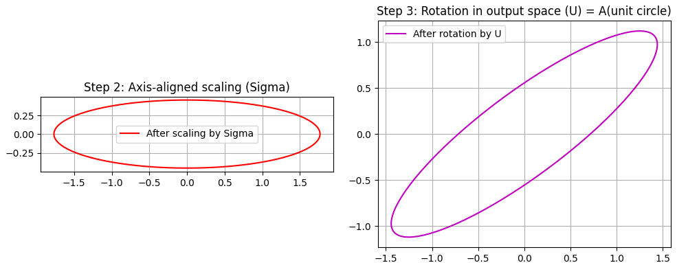
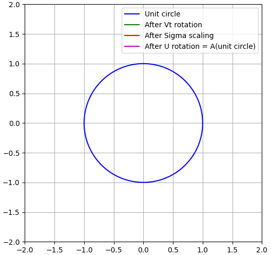

前章でジョルダン標準形を学びました。本章では特異値分解を扱っていきます。
特異値分解（SVD）とジョルダン標準形の関係を、簡潔にまとめると次のようになります。

__共通点__

- どちらも「行列（線形写像）の構造を分解する」手法です。
- どちらも「うまい基底を選ぶと、行列が対角（あるいは対角に近い形）になる」という発想に基づいています。
- どちらも、ランク・核・像といった線形写像の基本構造を明らかにします。

__違い__

__1. 目的の違い__
- **ジョルダン標準形**  
  - 理論的な「構造分解」が主眼  
  - 一般の線形写像を、できるだけ対角に近い形（ブロック対角）に分解し、一般化固有空間の構造を明らかにする
- **特異値分解（SVD）**  
  - 「直交性とノルムの世界での構造分解」が主眼  
  - 行列を「直交変換＋対角伸縮」に分解し、近似・ノルム・距離を扱う応用に強い

__2. 前提の違い__
- **ジョルダン標準形**  
  - 一般の体（実数・複素数など）で、有限次元ベクトル空間を想定  
  - 基底は直交とは限らない
- **SVD**  
  - 実数・複素数上の内積空間（ノルム付き空間）を想定  
  - 基底は必ず「正規直交基底」（直交行列・ユニタリ行列）

__3. 分解の形の違い__
- **ジョルダン標準形**  
  - $ A = P J P^{-1} $  
  - $ J $ はジョルダンブロックの直和（対角＋1の副対角）
- **SVD**  
  - $ A = U \Sigma V^* $  
  - $ U, V $ はユニタリ（直交）、$ \Sigma $ は非負の特異値が並ぶ対角行列

__4. 応用の違い__
- **ジョルダン標準形**  
  - 理論解析（微分方程式の解構造、一般の線形写像の分類など）に強い
- **SVD**  
  - 低ランク近似・擬似逆行列・主成分分析（PCA）・行列ノルム・条件数など、数値的・統計的な応用に強い


## 特異値分解のイントロ
特異値分解（SVD）のイントロとして、次の3つのポイントからざっくり説明します。

1. **SVDは「どんな行列でも直交座標で伸び縮みさせてるだけ」と見る分解**
2. **ジョルダン標準形との違い：直交性とノルムの世界へ**
3. **SVDがなぜ大事か：近似・逆行列・データ解析の共通言語**

### 1. SVDは「どんな行列でも直交座標で伸び縮みさせてるだけ」と見る分解

線形写像 $ A $ を「ベクトル空間の変換」と見るとき、ジョルダン標準形は  
「うまい基底を選べば、できるだけ対角に近い形（ブロック対角）にできる」という分解でした。

SVDは、それをもう一歩進めて、

> **どんな行列 $ A $ も、「回転（直交変換）→ 軸方向の伸縮 → 回転」の3ステップに分解できる**

という見方をします。

もう少し正確に言うと、任意の $ m \times n $ 行列 $ A $ に対して、

$$
A = U \Sigma V^*
$$

- $ U $：$ m \times m $ の直交行列（左特異ベクトル）
- $ V $：$ n \times n $ の直交行列（右特異ベクトル）
- $ \Sigma $：$ m \times n $ の「対角」行列（特異値が並ぶ）

という形に分解できます。

**イメージ**  
- $ V^* $：入力空間を「都合のよい直交座標」に回転  
- $ \Sigma $：各座標軸方向に特異値ぶんだけ伸ばす（or 縮める）  
- $ U $：出力空間を「都合のよい直交座標」に回転  

つまり、**行列 $ A $ は「直交座標の取り替え＋軸方向の伸縮」だけで表現できる**、というのがSVDの一番の直感です。


### 2. ジョルダン標準形との違い：直交性とノルムの世界へ

ジョルダン標準形とSVDは、どちらも「行列の構造分解」ですが、重視しているものが違います。

- **ジョルダン標準形**
  - 一般の体（実数・複素数など）で
  - できるだけ対角に近い形（ブロック対角）に分解
  - 基底は直交とは限らない
  - 理論的な構造（一般化固有空間の分解）が主眼

- **特異値分解（SVD）**
  - 実数・複素数で
  - 基底を「直交基底」に限定
  - 行列を「直交変換＋対角伸縮」に分解
  - ノルム・内積・近似誤差など、「長さ」や「距離」を扱う応用に強い

つまり、  
**ジョルダン標準形が「構造の理論」なら、SVDは「直交性とノルムの世界での構造分解」**  
と捉えると、位置づけがわかりやすいです。


### 3. SVDがなぜ大事か：近似・逆行列・データ解析の共通言語

SVDは、次のような場面で「共通言語」として非常に強力です。

__(1) 低ランク近似（Eckart–Youngの定理）__
- SVDの上位 $ k $ 個の特異値・特異ベクトルだけを使うと、  
  「ランク $ k $ の行列の中で、元の行列に最も近い近似」が得られる
- 画像圧縮・データ圧縮・ノイズ除去などに使われる

__(2) 擬似逆行列（Moore–Penrose逆行列）__
- フルランクでない行列にも「逆行列に近いもの」を定義できる
- 最小二乗法の解をきれいに記述できる

__(3) 主成分分析（PCA）__
- データ行列のSVDがPCAとほぼ同じ
- 特異ベクトルが「主成分方向」、特異値が「その重要度」

__(4) 行列のノルムと条件数__
- フロベニウスノルム・スペクトルノルムが特異値で表せる
- 条件数（数値的安定性の指標）も特異値の比で定義される

## 特異値分解の定義

特異値分解(SVD)の定義を、順を追って説明します。

### 1. SVDの基本形（フルSVD）

任意の $ m \times n $ 行列 $ A $（実数でも複素数でもよい）に対して、次のような分解が存在します。

$$
A = U \Sigma V^*
$$

ここで：

- $ U $：$ m \times m $ の**ユニタリ行列**（実行列の場合は直交行列）  
  → 列ベクトルが**左特異ベクトル**（orthonormal basis of the output space）
- $ V $：$ n \times n $ の**ユニタリ行列**（実行列の場合は直交行列）  
  → 列ベクトルが**右特異ベクトル**（orthonormal basis of the input space）
- $ \Sigma $：$ m \times n $ の**「対角」行列**（正確には長方形の対角行列）  
  → 対角成分に**特異値（singular values）** $ \sigma_1, \sigma_2, \dots $ が並ぶ

### 2. 特異値と特異ベクトル

__特異値（singular values）__

- 特異値は非負実数：$ \sigma_1 \ge \sigma_2 \ge \dots \ge \sigma_r > 0 $
- 残りの特異値は 0：$ \sigma_{r+1} = \dots = \sigma_{\min(m,n)} = 0 $
- ランク $ r = \text{rank}(A) $ は、0でない特異値の個数に等しい

__特異ベクトル（singular vectors）__

- **右特異ベクトル**：$ V $ の列ベクトル $ v_1, v_2, \dots, v_n $  
  → 入力空間の正規直交基底
- **左特異ベクトル**：$ U $ の列ベクトル $ u_1, u_2, \dots, u_m $  
  → 出力空間の正規直交基底

これらは次の関係を満たします：

$$
A v_i = \sigma_i u_i, \quad A^* u_i = \sigma_i v_i \quad (i = 1, \dots, r)
$$

（$ A^* $ は随伴行列。実行列なら転置 $ A^\top $）

### 3. $ \Sigma $ 行列の形

$ \Sigma $ は $ m \times n $ の行列で、次のような形をしています。

$$
\Sigma =
\begin{bmatrix}
\sigma_1 & & & & \\
& \sigma_2 & & & \\
& & \ddots & & \\
& & & \sigma_r & \\
& & & & 0
\end{bmatrix}
$$

- 左上から右下にかけて、特異値 $ \sigma_1, \dots, \sigma_r $ が並び、それ以外は 0
- $ m > n $ のときは縦長、$ m < n $ のときは横長の「対角」行列

### 4. 縮小SVD（reduced SVD）

フルSVDでは $ U, V $ が正方行列ですが、実際にはランク $ r $ に合わせて「縮小版」もよく使われます。

$$
A = U_r \Sigma_r V_r^*
$$

- $ U_r $：$ m \times r $（左特異ベクトルのうち非ゼロ特異値に対応するもの）
- $ V_r $：$ n \times r $（右特異ベクトルのうち非ゼロ特異値に対応するもの）
- $ \Sigma_r $：$ r \times r $ の対角行列（特異値 $ \sigma_1, \dots, \sigma_r $）

この形は、ランク $ r $ の情報だけをコンパクトに表現するのに便利です。

### 5. 定義のポイントまとめ

- **任意の行列** $ A $ に対して、  
  $ A = U \Sigma V^* $ という分解が存在する
- $ U, V $ は**ユニタリ（直交）行列** → 正規直交基底
- $ \Sigma $ は**非負の特異値が並ぶ「対角」行列**
- 特異値の個数がランク $ r $ を決める
- 縮小SVDでは、ランク $ r $ に合わせて $ U_r, \Sigma_r, V_r $ だけを使う


## 特異値分解の存在

特異値分解（SVD）の存在証明を、標準的な方法で説明します。  
ポイントは「\( A^*A \) の固有値問題からSVDを構成する」ことです。

### 1. 証明の方針

任意の \( m \times n \) 行列 \( A \)（実数でも複素数でもよい）に対して、

\[
A = U \Sigma V^*
\]

となるユニタリ行列 \( U, V \) と非負の特異値が並ぶ対角行列 \( \Sigma \) が存在することを示します。

証明の流れ：

1. \( A^*A \) はエルミート（半正定値）なので、直交基底で対角化できる
2. その固有値の平方根を「特異値」とし、固有ベクトルを「右特異ベクトル」とする
3. それを使って「左特異ベクトル」を構成する
4. 残りの基底を補完して、\( U, V \) をユニタリ行列に拡張する

### 2. 証明のステップ

__ステップ1：\( A^*A \) の固有値問題__

\( A^*A \) は \( n \times n \) のエルミート行列（実行列なら対称）であり、半正定値です：

\[
x^*(A^*A)x = (Ax)^*(Ax) = \|Ax\|^2 \ge 0
\]

したがって、スペクトル定理より、\( A^*A \) はユニタリ行列で対角化可能で、固有値はすべて非負実数です。

固有値を

\[
\lambda_1 \ge \lambda_2 \ge \dots \ge \lambda_r > 0,\quad \lambda_{r+1} = \dots = \lambda_n = 0
\]

とし、対応する正規直交固有ベクトルを

\[
v_1, v_2, \dots, v_n
\]

とします。これが**右特異ベクトル**の候補です。

__ステップ2：特異値と左特異ベクトルの定義__

特異値を

\[
\sigma_i = \sqrt{\lambda_i} \quad (i = 1, \dots, n)
\]

と定義します。このとき \( \sigma_1 \ge \dots \ge \sigma_r > 0 \)、\( \sigma_{r+1} = \dots = \sigma_n = 0 \) です。

次に、\( i = 1, \dots, r \) に対して

\[
u_i = \frac{1}{\sigma_i} A v_i
\]

と定義します。この \( u_i \) が**左特異ベクトル**の候補です。

__ステップ3：\( u_i \) が正規直交であることの確認__

\( i, j \le r \) に対して、

\[
u_i^* u_j = \left( \frac{1}{\sigma_i} A v_i \right)^* \left( \frac{1}{\sigma_j} A v_j \right)
= \frac{1}{\sigma_i \sigma_j} v_i^* A^* A v_j
\]

\( v_j \) は \( A^*A \) の固有ベクトルなので、

\[
A^*A v_j = \lambda_j v_j = \sigma_j^2 v_j
\]

よって

\[
u_i^* u_j = \frac{1}{\sigma_i \sigma_j} v_i^* (\sigma_j^2 v_j)
= \frac{\sigma_j}{\sigma_i} v_i^* v_j
\]

\( v_i, v_j \) は正規直交なので、

\[
v_i^* v_j = \delta_{ij}
\]

したがって

\[
u_i^* u_j = \frac{\sigma_j}{\sigma_i} \delta_{ij} = \delta_{ij}
\]

つまり \( u_1, \dots, u_r \) は正規直交です。

__ステップ4：\( U, V, \Sigma \) の構成__

__(a) 右特異ベクトル行列 \( V \)__

\[
V = [v_1 \ v_2 \ \dots \ v_n]
\]

はユニタリ行列（正規直交基底）です。

__(b) 左特異ベクトル行列 \( U \) の構成__

まず、\( u_1, \dots, u_r \) をすでに定義しました。  
これらは \( \mathbb{C}^m \)（または \( \mathbb{R}^m \)）の正規直交系です。

次に、\( \text{span}\{u_1, \dots, u_r\} \) の直交補空間の正規直交基底をとり、それを \( u_{r+1}, \dots, u_m \) とします。

そして

\[
U = [u_1 \ u_2 \ \dots \ u_m]
\]

とおけば、\( U \) はユニタリ行列になります。

__(c) \( \Sigma \) 行列の定義__

\( \Sigma \) を \( m \times n \) の行列で、対角成分に特異値が並ぶ形とします：

\[
\Sigma_{ii} = \sigma_i \quad (i = 1, \dots, \min(m,n))
\]

それ以外は 0 です。

__ステップ5：\( A = U \Sigma V^* \) の確認__

任意の \( j = 1, \dots, n \) に対して、

\[
(U \Sigma V^*) v_j
\]

が \( A v_j \) に等しいことを示せば、基底で一致するので \( A = U \Sigma V^* \) が言えます。

__場合1：\( j \le r \)__

このとき \( \sigma_j > 0 \) です。

\[
V^* v_j = e_j \quad (\text{標準基底ベクトル})
\]

なので、

\[
\Sigma V^* v_j = \Sigma e_j = \sigma_j e_j
\]

（ここで \( e_j \) は \( \mathbb{R}^n \) の標準基底ベクトルですが、\( \Sigma \) が \( m \times n \) なので、実際には \( m \) 次元ベクトルとして \( \sigma_j \) が \( j \) 成分にある形になります。厳密には添字に注意が必要ですが、直感的には「\( \Sigma \) が \( \sigma_j \) を拾う」と考えてください。）

したがって

\[
U \Sigma V^* v_j = U (\sigma_j e_j) = \sigma_j U e_j = \sigma_j u_j
\]

一方、\( u_j \) の定義より

\[
A v_j = \sigma_j u_j
\]

なので、

\[
(U \Sigma V^*) v_j = A v_j
\]

__場合2：\( j > r \)__

このとき \( \sigma_j = 0 \) です。

\[
\Sigma V^* v_j = \Sigma e_j = 0
\]

なので

\[
U \Sigma V^* v_j = 0
\]

一方、\( j > r \) のとき \( v_j \) は \( A^*A \) の 0 固有値に対応する固有ベクトルなので、

\[
A^*A v_j = 0 \quad \Rightarrow \quad \|A v_j\|^2 = v_j^* A^*A v_j = 0 \quad \Rightarrow \quad A v_j = 0
\]

よって

\[
(U \Sigma V^*) v_j = 0 = A v_j
\]

以上より、すべての \( j \) で

\[
(U \Sigma V^*) v_j = A v_j
\]

が成り立ちます。\( v_1, \dots, v_n \) は基底なので、

\[
A = U \Sigma V^*
\]

が成立します。

### 3. 証明のまとめ

- \( A^*A \) はエルミート半正定値なので、固有値は非負実数、固有ベクトルは正規直交基底をなす
- 固有値の平方根を特異値 \( \sigma_i \) とし、固有ベクトルを右特異ベクトル \( v_i \) とする
- \( u_i = \frac{1}{\sigma_i} A v_i \) と定義すると、\( u_i \) は正規直交になる
- 残りの基底を補完して \( U, V \) をユニタリ行列に拡張し、\( \Sigma \) を特異値が並ぶ対角行列とすると、\( A = U \Sigma V^* \) が成り立つ

これが特異値分解の存在証明の標準的な流れです。

## 特異値分解の幾何的意味

特異値分解（SVD）の幾何的な意味は、次の一言に集約できます。

> **任意の線形写像は、「直交座標の回転 → 軸方向の伸縮 → 直交座標の回転」という3ステップに分解できる**

以下、この意味を段階的に説明します。

### 1. SVDの形のおさらい

任意の \( m \times n \) 行列 \( A \) に対して、

\[
A = U \Sigma V^*
\]

- \( U \)：\( m \times m \) のユニタリ行列（実行列なら直交行列）  
  → 出力空間の正規直交基底（左特異ベクトル）
- \( V \)：\( n \times n \) のユニタリ行列（実行列なら直交行列）  
  → 入力空間の正規直交基底（右特異ベクトル）
- \( \Sigma \)：\( m \times n \) の「対角」行列（特異値が並ぶ）

です。

### 2. 幾何的な3ステップ分解

ベクトル \( x \) に \( A \) を作用させることを考えます：

\[
y = A x
\]

SVDを使うと、これは次の3ステップに分解できます。

__ステップ1：入力空間の回転（\( V^* \)）__

\[
x' = V^* x
\]

- \( V^* \) はユニタリ（直交）行列なので、「回転（＋鏡映）」を表します
- 入力空間の標準基底を、右特異ベクトル \( v_1, v_2, \dots, v_n \) が張る座標系に取り替えます
- 幾何的には「都合のよい直交座標に回転させる」操作です

__ステップ2：軸方向の伸縮（\( \Sigma \)）__

\[
x'' = \Sigma x'
\]

- \( \Sigma \) は対角成分に特異値 \( \sigma_1, \sigma_2, \dots \) が並ぶ行列です
- 各座標軸方向に、特異値ぶんだけ伸ばす（または縮める）操作になります
- 例えば、2次元で \( \Sigma = \begin{bmatrix} \sigma_1 & 0 \\ 0 & \sigma_2 \end{bmatrix} \) なら、  
  \( x' = (a, b) \) に対して \( x'' = (\sigma_1 a, \sigma_2 b) \) です
- 特異値が 0 の軸は「つぶれる」（その方向の情報が消える）

__ステップ3：出力空間の回転（\( U \)）__

\[
y = U x''
\]

- \( U \) もユニタリ（直交）行列なので、「回転（＋鏡映）」を表します
- 伸縮されたベクトル \( x'' \) を、左特異ベクトル \( u_1, u_2, \dots, u_m \) が張る座標系に回転させます
- これが最終的な出力 \( y \) です

まとめると：

\[
y = A x = U \Sigma V^* x
\]

は、

1. \( V^* x \)：入力空間を「右特異ベクトル座標」に回転
2. \( \Sigma (V^* x) \)：各軸方向を特異値ぶん伸縮
3. \( U (\Sigma V^* x) \)：出力空間を「左特異ベクトル座標」に回転

という3ステップに対応します。

### 3. 特異値・特異ベクトルの幾何的意味

__特異値 \( \sigma_i \)__

- \( \sigma_i \) は「\( A \) が \( v_i \) 方向をどれだけ伸ばすか」を表す量です
- \( \|A v_i\| = \sigma_i \) です（\( \|v_i\| = 1 \) のとき）
- 特異値が大きい方向ほど、「\( A \) が強く伸ばす方向」＝情報が強調される方向
- 特異値が 0 の方向は、「\( A \) がつぶす方向」＝情報が失われる方向

__右特異ベクトル \( v_i \)__

- 入力空間の「都合のよい直交座標軸」
- \( A \) を作用させたとき、\( v_i \) 方向は \( u_i \) 方向にそのまま写り、長さが \( \sigma_i \) 倍になる

__左特異ベクトル \( u_i \)__

- 出力空間の「都合のよい直交座標軸」
- \( u_i \) 方向は、入力の \( v_i \) 方向から来た成分が主に現れる方向

### 4. 具体例でイメージする

__例：2×2 の実行列（2次元平面の線形変換）__

\[
A = U \Sigma V^\top
\]

- \( V^\top \)：平面を回転して、「伸びる方向」と「縮む方向」が座標軸と一致するようにする
- \( \Sigma \)：x軸方向を \( \sigma_1 \) 倍、y軸方向を \( \sigma_2 \) 倍に伸縮（楕円に変形）
- \( U \)：その楕円を回転させて、最終的な向きに合わせる

つまり、**単位円は「回転 → 楕円に変形 → 回転」という3ステップで \( A \) の像（楕円）に写る**、という幾何的イメージです。

### 5. ジョルダン標準形との幾何的な違い

- **ジョルダン標準形**  
  - 一般の基底で「できるだけ対角に近い形」に分解  
  - 基底は直交とは限らない  
  - 理論的な構造（一般化固有空間）が主眼

- **SVD**  
  - 基底を「正規直交基底」に限定  
  - 「回転＋伸縮＋回転」という、**長さ・角度を保つ変換（直交変換）と伸縮のみ**に分解  
  - ノルム・内積・近似誤差など、「距離」や「角度」を扱う応用に強い


__例題:__ 

以下は、2×2 の実行列に対するSVDの幾何的意味を可視化するPythonコードです。  
単位円が「回転 → 伸縮（楕円） → 回転」という3ステップで変換される様子を確認できます。

```python
import numpy as np
import matplotlib.pyplot as plt
from matplotlib.animation import FuncAnimation
from matplotlib.patches import Ellipse

# 任意の2x2行列 A（ここでは例として適当な行列を設定）
A = np.array([[1.2, 0.8],
              [0.5, 1.0]])

# SVD を計算
U, S, Vt = np.linalg.svd(A)
Sigma = np.diag(S)  # 2x2 の対角行列

print("A =")
print(A)
print("\nU =")
print(U)
print("\nS =", S)
print("Sigma =")
print(Sigma)
print("\nVt =")
print(Vt)
print("\nU @ Sigma @ Vt =")
print(U @ Sigma @ Vt)

# 単位円上の点をサンプリング
theta = np.linspace(0, 2*np.pi, 200)
x_circle = np.cos(theta)
y_circle = np.sin(theta)
circle_points = np.vstack([x_circle, y_circle])

# 各ステップでの像を計算
# ステップ1: Vt による回転（入力空間の回転）
rotated_input = Vt @ circle_points

# ステップ2: Sigma による伸縮（軸方向の伸縮）
scaled = Sigma @ rotated_input

# ステップ3: U による回転（出力空間の回転）
final_output = U @ scaled

# 可視化の準備
fig, axes = plt.subplots(2, 2, figsize=(10, 10))
(ax1, ax2), (ax3, ax4) = axes

# ステップ0: 元の単位円
ax1.plot(x_circle, y_circle, 'b-', label='単位円')
ax1.set_title('ステップ0: 入力空間の単位円')
ax1.set_aspect('equal')
ax1.grid(True)
ax1.legend()

# ステップ1: Vt による回転後の単位円
ax2.plot(rotated_input[0], rotated_input[1], 'g-', label='Vt による回転後')
ax2.set_title('ステップ1: 入力空間の回転 (Vt)')
ax2.set_aspect('equal')
ax2.grid(True)
ax2.legend()

# ステップ2: Sigma による伸縮後の楕円
ax3.plot(scaled[0], scaled[1], 'r-', label='Sigma による伸縮後')
ax3.set_title('ステップ2: 軸方向の伸縮 (Sigma)')
ax3.set_aspect('equal')
ax3.grid(True)
ax3.legend()

# ステップ3: U による回転後の最終的な像
ax4.plot(final_output[0], final_output[1], 'm-', label='U による回転後')
ax4.set_title('ステップ3: 出力空間の回転 (U) = A(単位円)')
ax4.set_aspect('equal')
ax4.grid(True)
ax4.legend()

plt.tight_layout()
plt.show()

# アニメーションで3ステップを連続的に表示（オプション）
fig_anim, ax_anim = plt.subplots(figsize=(6, 6))
ax_anim.set_xlim(-2, 2)
ax_anim.set_ylim(-2, 2)
ax_anim.set_aspect('equal')
ax_anim.grid(True)

lines = []
line0, = ax_anim.plot([], [], 'b-', label='単位円')
line1, = ax_anim.plot([], [], 'g-', label='Vt 回転後')
line2, = ax_anim.plot([], [], 'r-', label='Sigma 伸縮後')
line3, = ax_anim.plot([], [], 'm-', label='U 回転後 = A(単位円)')
lines = [line0, line1, line2, line3]
ax_anim.legend()

def animate(frame):
    # frame=0: 単位円のみ
    # frame=1: 単位円 + Vt回転後
    # frame=2: 単位円 + Vt回転後 + Sigma伸縮後
    # frame=3: 単位円 + Vt回転後 + Sigma伸縮後 + U回転後
    for i, line in enumerate(lines):
        if i <= frame:
            if i == 0:
                line.set_data(x_circle, y_circle)
            elif i == 1:
                line.set_data(rotated_input[0], rotated_input[1])
            elif i == 2:
                line.set_data(scaled[0], scaled[1])
            elif i == 3:
                line.set_data(final_output[0], final_output[1])
        else:
            line.set_data([], [])
    return lines

anim = FuncAnimation(fig_anim, animate, frames=4, interval=1000, blit=True)
plt.show()
```

__コードのポイント__

1. **任意の2×2行列 `A` を設定**  
   - ここでは例として `A = [[1.2, 0.8], [0.5, 1.0]]` を使っていますが、他の行列に変えても動作します。

2. **SVDの計算**  
   - `U, S, Vt = np.linalg.svd(A)` でSVDを計算し、`Sigma = np.diag(S)` で対角行列にします。

3. **3ステップの幾何的変換**
   - ステップ1：`rotated_input = Vt @ circle_points`（入力空間の回転）
   - ステップ2：`scaled = Sigma @ rotated_input`（軸方向の伸縮）
   - ステップ3：`final_output = U @ scaled`（出力空間の回転）

4. **可視化**
   - 4つのサブプロットで各ステップを別々に表示
   - 「単位円 → 回転 → 伸縮 → 回転」の流れを連続的に表示

__実行結果__

- step0: 移動前の単位円
- step1: $V_t$による回転(円を回転してもわかりづらいですが)
- step2: $\Sigma$による伸縮
- step3: $U$による回転

「単位円 → 回転 → 伸縮 → 回転」になりました。






## 線形写像としての構造

特異値分解（SVD）は、線形写像の構造（ランク・核・像）を「直交基底の観点から」きれいに分解する表現です。  
以下、SVDとランク・核・像の関係を整理します。

### 1. SVDのおさらい

任意の \( m \times n \) 行列 \( A \) に対して、

\[
A = U \Sigma V^*
\]

- \( U \)：\( m \times m \) のユニタリ行列（左特異ベクトル）
- \( V \)：\( n \times n \) のユニタリ行列（右特異ベクトル）
- \( \Sigma \)：\( m \times n \) の対角行列（特異値 \( \sigma_1 \ge \dots \ge \sigma_r > 0 \)、残りは 0）

特異値の個数 \( r \) がランクです。

### 2. ランクとの関係

__ランク \( r \) は「非ゼロ特異値の個数」__

SVDでは、\( \Sigma \) の対角成分に特異値が並びます：

\[
\Sigma =
\begin{bmatrix}
\sigma_1 & & & \\
& \ddots & & \\
& & \sigma_r & \\
& & & 0
\end{bmatrix}
\]

- \( \sigma_1, \dots, \sigma_r > 0 \)
- 残りは 0

このとき、

\[
\text{rank}(A) = r
\]

つまり、**ランクは非ゼロ特異値の個数に等しい**です。

### 3. 核（Ker）との関係

__核は「特異値 0 に対応する右特異ベクトルが張る空間」__

右特異ベクトル \( v_1, \dots, v_n \) は入力空間の正規直交基底です。

- \( \sigma_1, \dots, \sigma_r > 0 \) に対応する \( v_1, \dots, v_r \)  
  → \( A v_i = \sigma_i u_i \ne 0 \) なので、核には属さない
- \( \sigma_{r+1} = \dots = \sigma_n = 0 \) に対応する \( v_{r+1}, \dots, v_n \)  
  → \( A v_j = 0 \) なので、核に属する

したがって、

\[
\text{Ker}(A) = \text{span}\{v_{r+1}, \dots, v_n\}
\]

- 次元は \( n - r \)
- これは「つぶれる方向」の直交基底を明示的に与えます

### 4. 像（Im）との関係

__像は「非ゼロ特異値に対応する左特異ベクトルが張る空間」__

左特異ベクトル \( u_1, \dots, u_m \) は出力空間の正規直交基底です。

- \( \sigma_1, \dots, \sigma_r > 0 \) に対応する \( u_1, \dots, u_r \)  
  → \( u_i = \frac{1}{\sigma_i} A v_i \) なので、像に属する
- \( \sigma_{r+1} = \dots = \sigma_m = 0 \) に対応する \( u_{r+1}, \dots, u_m \)（\( m > r \) のとき）  
  → 像には属さない（直交補空間の基底）

したがって、

\[
\text{Im}(A) = \text{span}\{u_1, \dots, u_r\}
\]

- 次元は \( r \)（ランクと一致）
- これは「伸びる方向」の直交基底を明示的に与えます

### 5. 随伴 \( A^* \) の核・像との関係

SVDは \( A \) だけでなく、随伴 \( A^* \) の構造も明らかにします。

__\( A^* \) のSVD__

\( A = U \Sigma V^* \) より、

\[
A^* = V \Sigma^* U^*
\]

- \( \Sigma^* \) は \( \Sigma \) の転置（実質同じ特異値が並ぶ）
- 右特異ベクトルは \( U \) の列、左特異ベクトルは \( V \) の列

したがって：

- \( \text{Ker}(A^*) = \text{span}\{u_{r+1}, \dots, u_m\} \)（特異値 0 に対応する左特異ベクトル）
- \( \text{Im}(A^*) = \text{span}\{v_1, \dots, v_r\} \)（非ゼロ特異値に対応する右特異ベクトル）

### 6. 直交分解としての構造

SVDにより、入力空間と出力空間は次のように直交分解されます。

__入力空間 \( \mathbb{C}^n \)（または \( \mathbb{R}^n \)）__

\[
\mathbb{C}^n = \text{Im}(A^*) \oplus \text{Ker}(A)
\]

- \( \text{Im}(A^*) = \text{span}\{v_1, \dots, v_r\} \)
- \( \text{Ker}(A) = \text{span}\{v_{r+1}, \dots, v_n\} \)

__出力空間 \( \mathbb{C}^m \)（または \( \mathbb{R}^m \)）__

\[
\mathbb{C}^m = \text{Im}(A) \oplus \text{Ker}(A^*)
\]

- \( \text{Im}(A) = \text{span}\{u_1, \dots, u_r\} \)
- \( \text{Ker}(A^*) = \text{span}\{u_{r+1}, \dots, u_m\} \)

ここで、すべての基底が正規直交なので、**SVDは核・像の直交分解を明示的に与える**ことになります。

### 7. ジョルダン標準形との比較

- **ジョルダン標準形**  
  - 一般の基底で核・像・一般化固有空間を分解  
  - 基底は直交とは限らない

- **SVD**  
  - 正規直交基底で核・像・随伴の核・像を分解  
  - ノルム・内積・近似誤差などを扱う応用に強い


