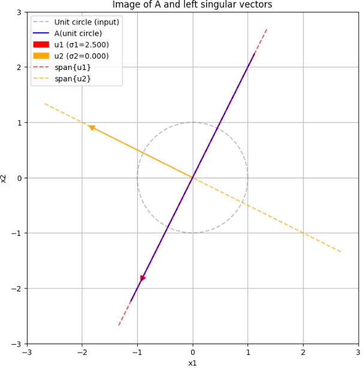
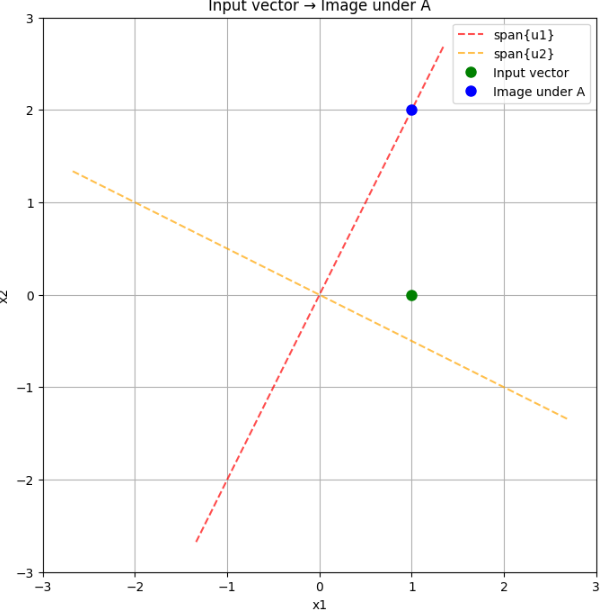
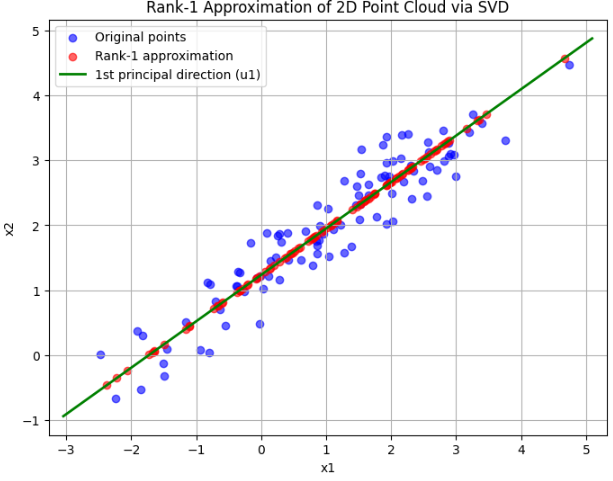
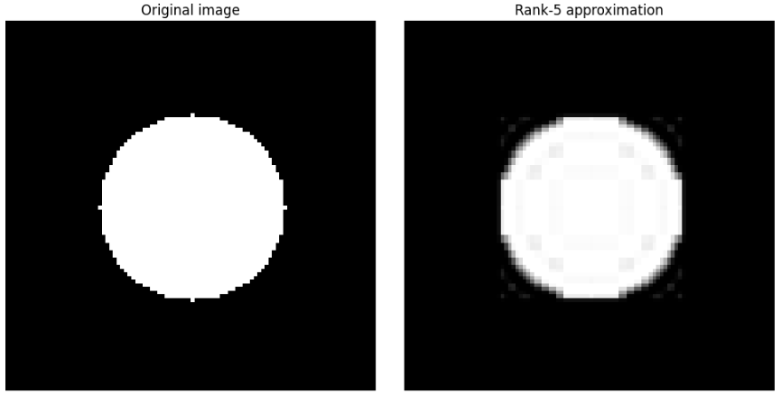
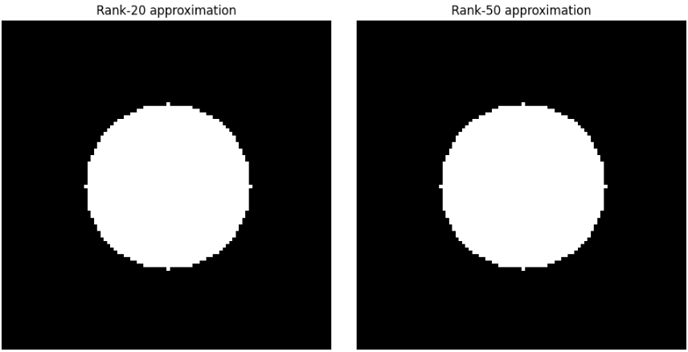
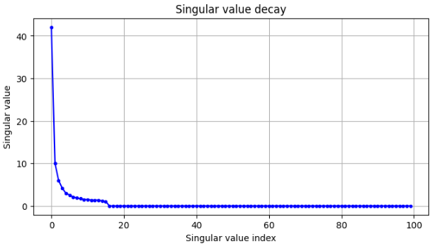
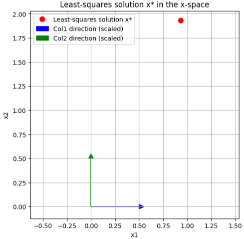
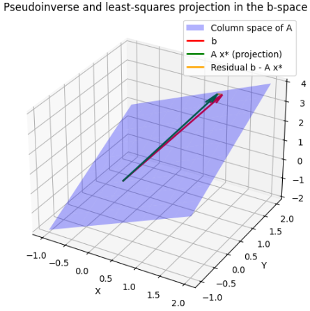
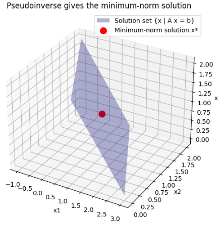
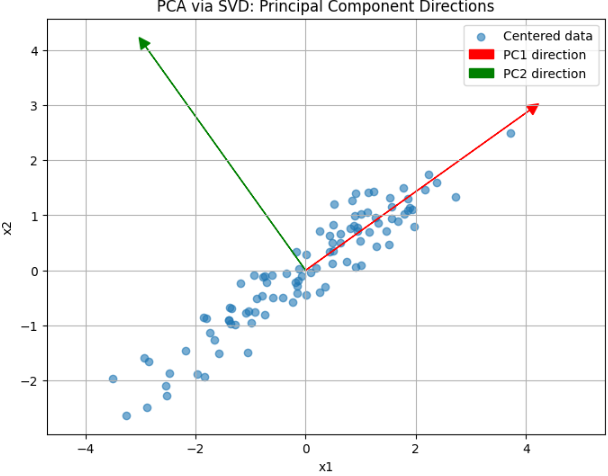

前章でジョルダン標準形を学びました。本章では特異値分解を扱っていきます。
特異値分解（SVD）とジョルダン標準形の関係を、簡潔にまとめると次のようになります。

__共通点__

- どちらも「行列（線形写像）の構造を分解する」手法です。
- どちらも「うまい基底を選ぶと、行列が対角（あるいは対角に近い形）になる」という発想に基づいています。
- どちらも、ランク・核・像といった線形写像の基本構造を明らかにします。

__違い__

__1. 目的の違い__
- **ジョルダン標準形**  
  - 理論的な「構造分解」が主眼  
  - 一般の線形写像を、できるだけ対角に近い形（ブロック対角）に分解し、一般化固有空間の構造を明らかにする
- **特異値分解（SVD）**  
  - 「直交性とノルムの世界での構造分解」が主眼  
  - 行列を「直交変換＋対角伸縮」に分解し、近似・ノルム・距離を扱う応用に強い

__2. 前提の違い__
- **ジョルダン標準形**  
  - 一般の体（実数・複素数など）で、有限次元ベクトル空間を想定  
  - 基底は直交とは限らない
- **SVD**  
  - 実数・複素数上の内積空間（ノルム付き空間）を想定  
  - 基底は必ず「正規直交基底」（直交行列・ユニタリ行列）

__3. 分解の形の違い__
- **ジョルダン標準形**  
  - $ A = P J P^{-1} $  
  - $ J $ はジョルダンブロックの直和（対角＋1の副対角）
- **SVD**  
  - $ A = U \Sigma V^* $  
  - $ U, V $ はユニタリ（直交）、$ \Sigma $ は非負の特異値が並ぶ対角行列

__4. 応用の違い__
- **ジョルダン標準形**  
  - 理論解析（微分方程式の解構造、一般の線形写像の分類など）に強い
- **SVD**  
  - 低ランク近似・擬似逆行列・主成分分析（PCA）・行列ノルム・条件数など、数値的・統計的な応用に強い


## 特異値分解のイントロ
特異値分解（SVD）のイントロとして、次の3つのポイントからざっくり説明します。

1. **SVDは「どんな行列でも直交座標で伸び縮みさせてるだけ」と見る分解**
2. **ジョルダン標準形との違い：直交性とノルムの世界へ**
3. **SVDがなぜ大事か：近似・逆行列・データ解析の共通言語**

### 1. SVDは「どんな行列でも直交座標で伸び縮みさせてるだけ」と見る分解

線形写像 $ A $ を「ベクトル空間の変換」と見るとき、ジョルダン標準形は  
「うまい基底を選べば、できるだけ対角に近い形（ブロック対角）にできる」という分解でした。

SVDは、それをもう一歩進めて、

> **どんな行列 $ A $ も、「回転（直交変換）→ 軸方向の伸縮 → 回転」の3ステップに分解できる**

という見方をします。

もう少し正確に言うと、任意の $ m \times n $ 行列 $ A $ に対して、

$$
A = U \Sigma V^*
$$

- $ U $：$ m \times m $ の直交行列（左特異ベクトル）
- $ V $：$ n \times n $ の直交行列（右特異ベクトル）
- $ \Sigma $：$ m \times n $ の「対角」行列（特異値が並ぶ）

という形に分解できます。

**イメージ**  
- $ V^* $：入力空間を「都合のよい直交座標」に回転  
- $ \Sigma $：各座標軸方向に特異値ぶんだけ伸ばす（or 縮める）  
- $ U $：出力空間を「都合のよい直交座標」に回転  

つまり、**行列 $ A $ は「直交座標の取り替え＋軸方向の伸縮」だけで表現できる**、というのがSVDの一番の直感です。


### 2. ジョルダン標準形との違い：直交性とノルムの世界へ

ジョルダン標準形とSVDは、どちらも「行列の構造分解」ですが、重視しているものが違います。

- **ジョルダン標準形**
  - 一般の体（実数・複素数など）で
  - できるだけ対角に近い形（ブロック対角）に分解
  - 基底は直交とは限らない
  - 理論的な構造（一般化固有空間の分解）が主眼

- **特異値分解（SVD）**
  - 実数・複素数で
  - 基底を「直交基底」に限定
  - 行列を「直交変換＋対角伸縮」に分解
  - ノルム・内積・近似誤差など、「長さ」や「距離」を扱う応用に強い

つまり、  
**ジョルダン標準形が「構造の理論」なら、SVDは「直交性とノルムの世界での構造分解」**  
と捉えると、位置づけがわかりやすいです。


### 3. SVDがなぜ大事か：近似・逆行列・データ解析の共通言語

SVDは、次のような場面で「共通言語」として非常に強力です。

__(1) 低ランク近似（Eckart–Youngの定理）__
- SVDの上位 $ k $ 個の特異値・特異ベクトルだけを使うと、  
  「ランク $ k $ の行列の中で、元の行列に最も近い近似」が得られる
- 画像圧縮・データ圧縮・ノイズ除去などに使われる

__(2) 擬似逆行列（Moore–Penrose逆行列）__
- フルランクでない行列にも「逆行列に近いもの」を定義できる
- 最小二乗法の解をきれいに記述できる

__(3) 主成分分析（PCA）__
- データ行列のSVDがPCAとほぼ同じ
- 特異ベクトルが「主成分方向」、特異値が「その重要度」

__(4) 行列のノルムと条件数__
- フロベニウスノルム・スペクトルノルムが特異値で表せる
- 条件数（数値的安定性の指標）も特異値の比で定義される

## 特異値分解の定義

特異値分解(SVD)の定義を、順を追って説明します。

### 1. SVDの基本形（フルSVD）

任意の $ m \times n $ 行列 $ A $（実数でも複素数でもよい）に対して、次のような分解が存在します。

$$
A = U \Sigma V^*
$$

ここで：

- $ U $：$ m \times m $ の**ユニタリ行列**（実行列の場合は直交行列）  
  → 列ベクトルが**左特異ベクトル**（orthonormal basis of the output space）
- $ V $：$ n \times n $ の**ユニタリ行列**（実行列の場合は直交行列）  
  → 列ベクトルが**右特異ベクトル**（orthonormal basis of the input space）
- $ \Sigma $：$ m \times n $ の**「対角」行列**（正確には長方形の対角行列）  
  → 対角成分に**特異値（singular values）** $ \sigma_1, \sigma_2, \dots $ が並ぶ

### 2. 特異値と特異ベクトル

__特異値（singular values）__

- 特異値は非負実数：$ \sigma_1 \ge \sigma_2 \ge \dots \ge \sigma_r > 0 $
- 残りの特異値は 0：$ \sigma_{r+1} = \dots = \sigma_{\min(m,n)} = 0 $
- ランク $ r = \text{rank}(A) $ は、0でない特異値の個数に等しい

__特異ベクトル（singular vectors）__

- **右特異ベクトル**：$ V $ の列ベクトル $ v_1, v_2, \dots, v_n $  
  → 入力空間の正規直交基底
- **左特異ベクトル**：$ U $ の列ベクトル $ u_1, u_2, \dots, u_m $  
  → 出力空間の正規直交基底

これらは次の関係を満たします：

$$
A v_i = \sigma_i u_i, \quad A^* u_i = \sigma_i v_i \quad (i = 1, \dots, r)
$$

（$ A^* $ は随伴行列。実行列なら転置 $ A^\top $）

### 3. $ \Sigma $ 行列の形

$ \Sigma $ は $ m \times n $ の行列で、次のような形をしています。

$$
\Sigma =
\begin{bmatrix}
\sigma_1 & & & & \\
& \sigma_2 & & & \\
& & \ddots & & \\
& & & \sigma_r & \\
& & & & 0
\end{bmatrix}
$$

- 左上から右下にかけて、特異値 $ \sigma_1, \dots, \sigma_r $ が並び、それ以外は 0
- $ m > n $ のときは縦長、$ m < n $ のときは横長の「対角」行列

### 4. 縮小SVD（reduced SVD）

フルSVDでは $ U, V $ が正方行列ですが、実際にはランク $ r $ に合わせて「縮小版」もよく使われます。

$$
A = U_r \Sigma_r V_r^*
$$

- $ U_r $：$ m \times r $（左特異ベクトルのうち非ゼロ特異値に対応するもの）
- $ V_r $：$ n \times r $（右特異ベクトルのうち非ゼロ特異値に対応するもの）
- $ \Sigma_r $：$ r \times r $ の対角行列（特異値 $ \sigma_1, \dots, \sigma_r $）

この形は、ランク $ r $ の情報だけをコンパクトに表現するのに便利です。

### 5. 定義のポイントまとめ

- **任意の行列** $ A $ に対して、  
  $ A = U \Sigma V^* $ という分解が存在する
- $ U, V $ は**ユニタリ（直交）行列** → 正規直交基底
- $ \Sigma $ は**非負の特異値が並ぶ「対角」行列**
- 特異値の個数がランク $ r $ を決める
- 縮小SVDでは、ランク $ r $ に合わせて $ U_r, \Sigma_r, V_r $ だけを使う


## 特異値分解の存在

特異値分解（SVD）の存在証明を、標準的な方法で説明します。  
ポイントは「$ A^*A $ の固有値問題からSVDを構成する」ことです。

### 1. 証明の方針

任意の $ m \times n $ 行列 $ A $（実数でも複素数でもよい）に対して、

$$
A = U \Sigma V^*
$$

となるユニタリ行列 $ U, V $ と非負の特異値が並ぶ対角行列 $ \Sigma $ が存在することを示します。

証明の流れ：

1. $ A^*A $ はエルミート（半正定値）なので、直交基底で対角化できる
2. その固有値の平方根を「特異値」とし、固有ベクトルを「右特異ベクトル」とする
3. それを使って「左特異ベクトル」を構成する
4. 残りの基底を補完して、$ U, V $ をユニタリ行列に拡張する

### 2. 証明のステップ

__ステップ1：$ A^*A $ の固有値問題__

$ A^*A $ は $ n \times n $ のエルミート行列（実行列なら対称）であり、半正定値です：

$$
x^*(A^*A)x = (Ax)^*(Ax) = \|Ax\|^2 \ge 0
$$

したがって、スペクトル定理より、$ A^*A $ はユニタリ行列で対角化可能で、固有値はすべて非負実数です。

固有値を

$$
\lambda_1 \ge \lambda_2 \ge \dots \ge \lambda_r > 0,\quad \lambda_{r+1} = \dots = \lambda_n = 0
$$

とし、対応する正規直交固有ベクトルを

$$
v_1, v_2, \dots, v_n
$$

とします。これが**右特異ベクトル**の候補です。

__ステップ2：特異値と左特異ベクトルの定義__

特異値を

$$
\sigma_i = \sqrt{\lambda_i} \quad (i = 1, \dots, n)
$$

と定義します。このとき $ \sigma_1 \ge \dots \ge \sigma_r > 0 $、$ \sigma_{r+1} = \dots = \sigma_n = 0 $ です。

次に、$ i = 1, \dots, r $ に対して

$$
u_i = \frac{1}{\sigma_i} A v_i
$$

と定義します。この $ u_i $ が**左特異ベクトル**の候補です。

__ステップ3：$ u_i $ が正規直交であることの確認__

$ i, j \le r $ に対して、

$$
u_i^* u_j = \left( \frac{1}{\sigma_i} A v_i \right)^* \left( \frac{1}{\sigma_j} A v_j \right)
= \frac{1}{\sigma_i \sigma_j} v_i^* A^* A v_j
$$

$ v_j $ は $ A^*A $ の固有ベクトルなので、

$$
A^*A v_j = \lambda_j v_j = \sigma_j^2 v_j
$$

よって

$$
u_i^* u_j = \frac{1}{\sigma_i \sigma_j} v_i^* (\sigma_j^2 v_j)
= \frac{\sigma_j}{\sigma_i} v_i^* v_j
$$

$ v_i, v_j $ は正規直交なので、

$$
v_i^* v_j = \delta_{ij}
$$

したがって

$$
u_i^* u_j = \frac{\sigma_j}{\sigma_i} \delta_{ij} = \delta_{ij}
$$

つまり $ u_1, \dots, u_r $ は正規直交です。

__ステップ4：$ U, V, \Sigma $ の構成__

__(a) 右特異ベクトル行列 $ V $__

$$
V = [v_1 \ v_2 \ \dots \ v_n]
$$

はユニタリ行列（正規直交基底）です。

__(b) 左特異ベクトル行列 $ U $ の構成__

まず、$ u_1, \dots, u_r $ をすでに定義しました。  
これらは $ \mathbb{C}^m $（または $ \mathbb{R}^m $）の正規直交系です。

次に、$ \text{span}\{u_1, \dots, u_r\} $ の直交補空間の正規直交基底をとり、それを $ u_{r+1}, \dots, u_m $ とします。

そして

$$
U = [u_1 \ u_2 \ \dots \ u_m]
$$

とおけば、$ U $ はユニタリ行列になります。

__(c) $ \Sigma $ 行列の定義__

$ \Sigma $ を $ m \times n $ の行列で、対角成分に特異値が並ぶ形とします：

$$
\Sigma_{ii} = \sigma_i \quad (i = 1, \dots, \min(m,n))
$$

それ以外は 0 です。

__ステップ5：$ A = U \Sigma V^* $ の確認__

任意の $ j = 1, \dots, n $ に対して、

$$
(U \Sigma V^*) v_j
$$

が $ A v_j $ に等しいことを示せば、基底で一致するので $ A = U \Sigma V^* $ が言えます。

__場合1：$ j \le r $__

このとき $ \sigma_j > 0 $ です。

$$
V^* v_j = e_j \quad (\text{標準基底ベクトル})
$$

なので、

$$
\Sigma V^* v_j = \Sigma e_j = \sigma_j e_j
$$

（ここで $ e_j $ は $ \mathbb{R}^n $ の標準基底ベクトルですが、$ \Sigma $ が $ m \times n $ なので、実際には $ m $ 次元ベクトルとして $ \sigma_j $ が $ j $ 成分にある形になります。厳密には添字に注意が必要ですが、直感的には「$ \Sigma $ が $ \sigma_j $ を拾う」と考えてください。）

したがって

$$
U \Sigma V^* v_j = U (\sigma_j e_j) = \sigma_j U e_j = \sigma_j u_j
$$

一方、$ u_j $ の定義より

$$
A v_j = \sigma_j u_j
$$

なので、

$$
(U \Sigma V^*) v_j = A v_j
$$

__場合2：$ j > r $__

このとき $ \sigma_j = 0 $ です。

$$
\Sigma V^* v_j = \Sigma e_j = 0
$$

なので

$$
U \Sigma V^* v_j = 0
$$

一方、$ j > r $ のとき $ v_j $ は $ A^*A $ の 0 固有値に対応する固有ベクトルなので、

$$
A^*A v_j = 0 \quad \Rightarrow \quad \|A v_j\|^2 = v_j^* A^*A v_j = 0 \quad \Rightarrow \quad A v_j = 0
$$

よって

$$
(U \Sigma V^*) v_j = 0 = A v_j
$$

以上より、すべての $ j $ で

$$
(U \Sigma V^*) v_j = A v_j
$$

が成り立ちます。$ v_1, \dots, v_n $ は基底なので、

$$
A = U \Sigma V^*
$$

が成立します。

### 3. 証明のまとめ

- $ A^*A $ はエルミート半正定値なので、固有値は非負実数、固有ベクトルは正規直交基底をなす
- 固有値の平方根を特異値 $ \sigma_i $ とし、固有ベクトルを右特異ベクトル $ v_i $ とする
- $ u_i = \frac{1}{\sigma_i} A v_i $ と定義すると、$ u_i $ は正規直交になる
- 残りの基底を補完して $ U, V $ をユニタリ行列に拡張し、$ \Sigma $ を特異値が並ぶ対角行列とすると、$ A = U \Sigma V^* $ が成り立つ

これが特異値分解の存在証明の標準的な流れです。

## 特異値分解の幾何的意味

特異値分解（SVD）の幾何的な意味は、次の一言に集約できます。

> **任意の線形写像は、「直交座標の回転 → 軸方向の伸縮 → 直交座標の回転」という3ステップに分解できる**

以下、この意味を段階的に説明します。

### 1. SVDの形のおさらい

任意の $ m \times n $ 行列 $ A $ に対して、

$$
A = U \Sigma V^*
$$

- $ U $：$ m \times m $ のユニタリ行列（実行列なら直交行列）  
  → 出力空間の正規直交基底（左特異ベクトル）
- $ V $：$ n \times n $ のユニタリ行列（実行列なら直交行列）  
  → 入力空間の正規直交基底（右特異ベクトル）
- $ \Sigma $：$ m \times n $ の「対角」行列（特異値が並ぶ）

です。

### 2. 幾何的な3ステップ分解

ベクトル $ x $ に $ A $ を作用させることを考えます：

$$
y = A x
$$

SVDを使うと、これは次の3ステップに分解できます。

__ステップ1：入力空間の回転（$ V^* $）__

$$
x' = V^* x
$$

- $ V^* $ はユニタリ（直交）行列なので、「回転（＋鏡映）」を表します
- 入力空間の標準基底を、右特異ベクトル $ v_1, v_2, \dots, v_n $ が張る座標系に取り替えます
- 幾何的には「都合のよい直交座標に回転させる」操作です

__ステップ2：軸方向の伸縮（$ \Sigma $）__

$$
x'' = \Sigma x'
$$

- $ \Sigma $ は対角成分に特異値 $ \sigma_1, \sigma_2, \dots $ が並ぶ行列です
- 各座標軸方向に、特異値ぶんだけ伸ばす（または縮める）操作になります
- 例えば、2次元で $ \Sigma = \begin{bmatrix} \sigma_1 & 0 \\ 0 & \sigma_2 \end{bmatrix} $ なら、  
  $ x' = (a, b) $ に対して $ x'' = (\sigma_1 a, \sigma_2 b) $ です
- 特異値が 0 の軸は「つぶれる」（その方向の情報が消える）

__ステップ3：出力空間の回転（$ U $）__

$$
y = U x''
$$

- $ U $ もユニタリ（直交）行列なので、「回転（＋鏡映）」を表します
- 伸縮されたベクトル $ x'' $ を、左特異ベクトル $ u_1, u_2, \dots, u_m $ が張る座標系に回転させます
- これが最終的な出力 $ y $ です

まとめると：

$$
y = A x = U \Sigma V^* x
$$

は、

1. $ V^* x $：入力空間を「右特異ベクトル座標」に回転
2. $ \Sigma (V^* x) $：各軸方向を特異値ぶん伸縮
3. $ U (\Sigma V^* x) $：出力空間を「左特異ベクトル座標」に回転

という3ステップに対応します。

### 3. 特異値・特異ベクトルの幾何的意味

__特異値 $ \sigma_i $__

- $ \sigma_i $ は「$ A $ が $ v_i $ 方向をどれだけ伸ばすか」を表す量です
- $ \|A v_i\| = \sigma_i $ です（$ \|v_i\| = 1 $ のとき）
- 特異値が大きい方向ほど、「$ A $ が強く伸ばす方向」＝情報が強調される方向
- 特異値が 0 の方向は、「$ A $ がつぶす方向」＝情報が失われる方向

__右特異ベクトル $ v_i $__

- 入力空間の「都合のよい直交座標軸」
- $ A $ を作用させたとき、$ v_i $ 方向は $ u_i $ 方向にそのまま写り、長さが $ \sigma_i $ 倍になる

__左特異ベクトル $ u_i $__

- 出力空間の「都合のよい直交座標軸」
- $ u_i $ 方向は、入力の $ v_i $ 方向から来た成分が主に現れる方向

### 4. 具体例でイメージする

__例：2×2 の実行列（2次元平面の線形変換）__

$$
A = U \Sigma V^\top
$$

- $ V^\top $：平面を回転して、「伸びる方向」と「縮む方向」が座標軸と一致するようにする
- $ \Sigma $：x軸方向を $ \sigma_1 $ 倍、y軸方向を $ \sigma_2 $ 倍に伸縮（楕円に変形）
- $ U $：その楕円を回転させて、最終的な向きに合わせる

つまり、**単位円は「回転 → 楕円に変形 → 回転」という3ステップで $ A $ の像（楕円）に写る**、という幾何的イメージです。

### 5. ジョルダン標準形との幾何的な違い

- **ジョルダン標準形**  
  - 一般の基底で「できるだけ対角に近い形」に分解  
  - 基底は直交とは限らない  
  - 理論的な構造（一般化固有空間）が主眼

- **SVD**  
  - 基底を「正規直交基底」に限定  
  - 「回転＋伸縮＋回転」という、**長さ・角度を保つ変換（直交変換）と伸縮のみ**に分解  
  - ノルム・内積・近似誤差など、「距離」や「角度」を扱う応用に強い


__例題:__ 

以下は、2×2 の実行列に対するSVDの幾何的意味を可視化するPythonコードです。  
単位円が「回転 → 伸縮（楕円） → 回転」という3ステップで変換される様子を確認できます。

```python
import numpy as np
import matplotlib.pyplot as plt
from matplotlib.animation import FuncAnimation
from matplotlib.patches import Ellipse

# 任意の2x2行列 A（ここでは例として適当な行列を設定）
A = np.array([[1.2, 0.8],
              [0.5, 1.0]])

# SVD を計算
U, S, Vt = np.linalg.svd(A)
Sigma = np.diag(S)  # 2x2 の対角行列

print("A =")
print(A)
print("\nU =")
print(U)
print("\nS =", S)
print("Sigma =")
print(Sigma)
print("\nVt =")
print(Vt)
print("\nU @ Sigma @ Vt =")
print(U @ Sigma @ Vt)

# 単位円上の点をサンプリング
theta = np.linspace(0, 2*np.pi, 200)
x_circle = np.cos(theta)
y_circle = np.sin(theta)
circle_points = np.vstack([x_circle, y_circle])

# 各ステップでの像を計算
# ステップ1: Vt による回転（入力空間の回転）
rotated_input = Vt @ circle_points

# ステップ2: Sigma による伸縮（軸方向の伸縮）
scaled = Sigma @ rotated_input

# ステップ3: U による回転（出力空間の回転）
final_output = U @ scaled

# 可視化の準備
fig, axes = plt.subplots(2, 2, figsize=(10, 10))
(ax1, ax2), (ax3, ax4) = axes

# ステップ0: 元の単位円
ax1.plot(x_circle, y_circle, 'b-', label='単位円')
ax1.set_title('ステップ0: 入力空間の単位円')
ax1.set_aspect('equal')
ax1.grid(True)
ax1.legend()

# ステップ1: Vt による回転後の単位円
ax2.plot(rotated_input[0], rotated_input[1], 'g-', label='Vt による回転後')
ax2.set_title('ステップ1: 入力空間の回転 (Vt)')
ax2.set_aspect('equal')
ax2.grid(True)
ax2.legend()

# ステップ2: Sigma による伸縮後の楕円
ax3.plot(scaled[0], scaled[1], 'r-', label='Sigma による伸縮後')
ax3.set_title('ステップ2: 軸方向の伸縮 (Sigma)')
ax3.set_aspect('equal')
ax3.grid(True)
ax3.legend()

# ステップ3: U による回転後の最終的な像
ax4.plot(final_output[0], final_output[1], 'm-', label='U による回転後')
ax4.set_title('ステップ3: 出力空間の回転 (U) = A(単位円)')
ax4.set_aspect('equal')
ax4.grid(True)
ax4.legend()

plt.tight_layout()
plt.show()

# アニメーションで3ステップを連続的に表示（オプション）
fig_anim, ax_anim = plt.subplots(figsize=(6, 6))
ax_anim.set_xlim(-2, 2)
ax_anim.set_ylim(-2, 2)
ax_anim.set_aspect('equal')
ax_anim.grid(True)

lines = []
line0, = ax_anim.plot([], [], 'b-', label='単位円')
line1, = ax_anim.plot([], [], 'g-', label='Vt 回転後')
line2, = ax_anim.plot([], [], 'r-', label='Sigma 伸縮後')
line3, = ax_anim.plot([], [], 'm-', label='U 回転後 = A(単位円)')
lines = [line0, line1, line2, line3]
ax_anim.legend()

def animate(frame):
    # frame=0: 単位円のみ
    # frame=1: 単位円 + Vt回転後
    # frame=2: 単位円 + Vt回転後 + Sigma伸縮後
    # frame=3: 単位円 + Vt回転後 + Sigma伸縮後 + U回転後
    for i, line in enumerate(lines):
        if i <= frame:
            if i == 0:
                line.set_data(x_circle, y_circle)
            elif i == 1:
                line.set_data(rotated_input[0], rotated_input[1])
            elif i == 2:
                line.set_data(scaled[0], scaled[1])
            elif i == 3:
                line.set_data(final_output[0], final_output[1])
        else:
            line.set_data([], [])
    return lines

anim = FuncAnimation(fig_anim, animate, frames=4, interval=1000, blit=True)
plt.show()
```

__コードのポイント__

1. **任意の2×2行列 `A` を設定**  
   - ここでは例として `A = [[1.2, 0.8], [0.5, 1.0]]` を使っていますが、他の行列に変えても動作します。

2. **SVDの計算**  
   - `U, S, Vt = np.linalg.svd(A)` でSVDを計算し、`Sigma = np.diag(S)` で対角行列にします。

3. **3ステップの幾何的変換**
   - ステップ1：`rotated_input = Vt @ circle_points`（入力空間の回転）
   - ステップ2：`scaled = Sigma @ rotated_input`（軸方向の伸縮）
   - ステップ3：`final_output = U @ scaled`（出力空間の回転）

4. **可視化**
   - 4つのサブプロットで各ステップを別々に表示
   - 「単位円 → 回転 → 伸縮 → 回転」の流れを連続的に表示

__実行結果__

- step0: 移動前の単位円
- step1: $V_t$による回転(円を回転してもわかりづらいですが)
- step2: $\Sigma$による伸縮
- step3: $U$による回転

「単位円 → 回転 → 伸縮 → 回転」になりました。


## 線形写像としての構造

特異値分解（SVD）は、線形写像の構造（ランク・核・像）を「直交基底の観点から」きれいに分解する表現です。  
以下、SVDとランク・核・像の関係を整理します。

### 1. SVDのおさらい

任意の $ m \times n $ 行列 $ A $ に対して、

$$
A = U \Sigma V^*
$$

- $ U $：$ m \times m $ のユニタリ行列（左特異ベクトル）
- $ V $：$ n \times n $ のユニタリ行列（右特異ベクトル）
- $ \Sigma $：$ m \times n $ の対角行列（特異値 $ \sigma_1 \ge \dots \ge \sigma_r > 0 $、残りは 0）

特異値の個数 $ r $ がランクです。

### 2. ランクとの関係

__ランク $ r $ は「非ゼロ特異値の個数」__

SVDでは、$ \Sigma $ の対角成分に特異値が並びます：

$$
\Sigma =
\begin{bmatrix}
\sigma_1 & & & \\
& \ddots & & \\
& & \sigma_r & \\
& & & 0
\end{bmatrix}
$$

- $ \sigma_1, \dots, \sigma_r > 0 $
- 残りは 0

このとき、

$$
\text{rank}(A) = r
$$

つまり、**ランクは非ゼロ特異値の個数に等しい**です。

### 3. 核（Ker）との関係

__核は「特異値 0 に対応する右特異ベクトルが張る空間」__

右特異ベクトル $ v_1, \dots, v_n $ は入力空間の正規直交基底です。

- $ \sigma_1, \dots, \sigma_r > 0 $ に対応する $ v_1, \dots, v_r $  
  → $ A v_i = \sigma_i u_i \ne 0 $ なので、核には属さない
- $ \sigma_{r+1} = \dots = \sigma_n = 0 $ に対応する $ v_{r+1}, \dots, v_n $  
  → $ A v_j = 0 $ なので、核に属する

したがって、

$$
\text{Ker}(A) = \text{span}\{v_{r+1}, \dots, v_n\}
$$

- 次元は $ n - r $
- これは「つぶれる方向」の直交基底を明示的に与えます

### 4. 像（Im）との関係

__像は「非ゼロ特異値に対応する左特異ベクトルが張る空間」__

左特異ベクトル $ u_1, \dots, u_m $ は出力空間の正規直交基底です。

- $ \sigma_1, \dots, \sigma_r > 0 $ に対応する $ u_1, \dots, u_r $  
  → $ u_i = \frac{1}{\sigma_i} A v_i $ なので、像に属する
- $ \sigma_{r+1} = \dots = \sigma_m = 0 $ に対応する $ u_{r+1}, \dots, u_m $（$ m > r $ のとき）  
  → 像には属さない（直交補空間の基底）

したがって、

$$
\text{Im}(A) = \text{span}\{u_1, \dots, u_r\}
$$

- 次元は $ r $（ランクと一致）
- これは「伸びる方向」の直交基底を明示的に与えます

### 5. 随伴 $ A^* $ の核・像との関係

SVDは $ A $ だけでなく、随伴 $ A^* $ の構造も明らかにします。

__$ A^* $ のSVD__

$ A = U \Sigma V^* $ より、

$$
A^* = V \Sigma^* U^*
$$

- $ \Sigma^* $ は $ \Sigma $ の転置（実質同じ特異値が並ぶ）
- 右特異ベクトルは $ U $ の列、左特異ベクトルは $ V $ の列

したがって：

- $ \text{Ker}(A^*) = \text{span}\{u_{r+1}, \dots, u_m\} $（特異値 0 に対応する左特異ベクトル）
- $ \text{Im}(A^*) = \text{span}\{v_1, \dots, v_r\} $（非ゼロ特異値に対応する右特異ベクトル）

### 6. 直交分解としての構造

SVDにより、入力空間と出力空間は次のように直交分解されます。

__入力空間 $ \mathbb{C}^n $（または $ \mathbb{R}^n $）__

$$
\mathbb{C}^n = \text{Im}(A^*) \oplus \text{Ker}(A)
$$

- $ \text{Im}(A^*) = \text{span}\{v_1, \dots, v_r\} $
- $ \text{Ker}(A) = \text{span}\{v_{r+1}, \dots, v_n\} $

__出力空間 $ \mathbb{C}^m $（または $ \mathbb{R}^m $）__

$$
\mathbb{C}^m = \text{Im}(A) \oplus \text{Ker}(A^*)
$$

- $ \text{Im}(A) = \text{span}\{u_1, \dots, u_r\} $
- $ \text{Ker}(A^*) = \text{span}\{u_{r+1}, \dots, u_m\} $

ここで、すべての基底が正規直交なので、**SVDは核・像の直交分解を明示的に与える**ことになります。

### 7. ジョルダン標準形との比較

- **ジョルダン標準形**  
  - 一般の基底で核・像・一般化固有空間を分解  
  - 基底は直交とは限らない

- **SVD**  
  - 正規直交基底で核・像・随伴の核・像を分解  
  - ノルム・内積・近似誤差などを扱う応用に強い

__例題:__

「像（Im(A)）が非ゼロ特異値に対応する左特異ベクトルで張られる」ことを可視化するPythonコードを作成しました。  
2次元の例で、入力ベクトルがどのように「左特異ベクトルが張る空間（像）」に写るかを絵で示します。


__可視化のアイデア__

- 2×2 の行列 $ A $ を用意（ランク1または2）
- SVDを計算し、左特異ベクトル $ u_1, u_2 $ と特異値 $ \sigma_1, \sigma_2 $ を得る
- 入力空間（2次元）で単位円上の点をサンプリングし、$ A $ で写す
- 出力空間（2次元）に、左特異ベクトル $ u_1, u_2 $ を矢印で描画
- 像（Aの作用後の点）が、実際に $ u_1, u_2 $ が張る空間（特に非ゼロ特異値に対応する方向）に乗っていることを確認

ランク1の例（$ \sigma_2 = 0 $）を使うと、「像が1次元（$ u_1 $ 方向）に潰れる」様子がはっきり見えます。

__Pythonコード__

```python
import numpy as np
import matplotlib.pyplot as plt
from matplotlib.animation import FuncAnimation

# ランク1の2x2行列を例として作成
# 例: A = [[1, 0.5], [2, 1]] はランク1（2行が線形従属）
A = np.array([[1.0, 0.5],
              [2.0, 1.0]])

# SVDを計算
U, S, Vt = np.linalg.svd(A)
print("A =")
print(A)
print("\nU =")
print(U)
print("\nS =", S)
print("\nVt =")
print(Vt)

# 特異値の個数 = ランク r
r = np.sum(S > 1e-10)  # 数値誤差を考慮
print(f"\nrank(A) = {r}")

# 左特異ベクトル
u1 = U[:, 0]
u2 = U[:, 1]

print(f"\nu1 = {u1}  (σ1 = {S[0]})")
print(f"u2 = {u2}  (σ2 = {S[1]})")

# 単位円上の点をサンプリング
theta = np.linspace(0, 2*np.pi, 100)
x_circle = np.cos(theta)
y_circle = np.sin(theta)
circle_points = np.vstack([x_circle, y_circle])

# Aで写した像
image_points = A @ circle_points

# 可視化
fig, ax = plt.subplots(figsize=(8, 8))
ax.set_xlim(-3, 3)
ax.set_ylim(-3, 3)
ax.set_aspect('equal')
ax.grid(True)
ax.set_title('Image of A and left singular vectors')
ax.set_xlabel('x1')
ax.set_ylabel('x2')

# 単位円（入力）を薄く描画
ax.plot(x_circle, y_circle, 'gray', linestyle='--', alpha=0.5, label='Unit circle (input)')

# Aの像（出力）を描画
ax.plot(image_points[0], image_points[1], 'b-', label='A(unit circle)')

# 左特異ベクトルを矢印で描画
scale = 2.0
ax.arrow(0, 0, scale*u1[0], scale*u1[1], head_width=0.1, head_length=0.1, fc='red', ec='red', label=f'u1 (σ1={S[0]:.3f})')
ax.arrow(0, 0, scale*u2[0], scale*u2[1], head_width=0.1, head_length=0.1, fc='orange', ec='orange', label=f'u2 (σ2={S[1]:.3f})')

# u1, u2 が張る直線を描画（像空間の「軸」）
t = np.linspace(-3, 3, 100)
line_u1 = np.outer(u1, t)  # u1 方向の直線
line_u2 = np.outer(u2, t)  # u2 方向の直線

ax.plot(line_u1[0], line_u1[1], 'r--', alpha=0.7, label='span{u1}')
ax.plot(line_u2[0], line_u2[1], 'orange', linestyle='--', alpha=0.7, label='span{u2}')

ax.legend()
plt.show()

# アニメーションで「入力ベクトル → 像」の対応を見る（オプション）
fig_anim, ax_anim = plt.subplots(figsize=(8, 8))
ax_anim.set_xlim(-3, 3)
ax_anim.set_ylim(-3, 3)
ax_anim.set_aspect('equal')
ax_anim.grid(True)
ax_anim.set_title('Input vector → Image under A')
ax_anim.set_xlabel('x1')
ax_anim.set_ylabel('x2')

# u1, u2 方向の直線を描画
ax_anim.plot(line_u1[0], line_u1[1], 'r--', alpha=0.7, label='span{u1}')
ax_anim.plot(line_u2[0], line_u2[1], 'orange', linestyle='--', alpha=0.7, label='span{u2}')

# アニメーション用の点
point_input, = ax_anim.plot([], [], 'go', markersize=8, label='Input vector')
point_image, = ax_anim.plot([], [], 'bo', markersize=8, label='Image under A')
ax_anim.legend()

def animate(frame):
    # frame に対応する角度
    theta_frame = theta[frame]
    x_in = np.cos(theta_frame)
    y_in = np.sin(theta_frame)
    point_input.set_data([x_in], [y_in])
    
    # Aで写した点
    x_out, y_out = A @ np.array([x_in, y_in])
    point_image.set_data([x_out], [y_out])
    
    return point_input, point_image

anim = FuncAnimation(fig_anim, animate, frames=len(theta), interval=50, blit=True)
plt.show()
```

__コードの説明__

1. ランク1の行列を用意
- `A = [[1, 0.5], [2, 1]]` はランク1（2行が線形従属）です。
- SVDを計算すると、特異値は $ \sigma_1 > 0, \sigma_2 \approx 0 $ となります。

2. 左特異ベクトルと特異値
- `U` の列ベクトルが左特異ベクトル $ u_1, u_2 $ です。
- $ u_1 $ は非ゼロ特異値 $ \sigma_1 $ に対応し、像空間（Im(A)）を張ります。
- $ u_2 $ は特異値 0 に対応し、像には属さず、$ \text{Ker}(A^*) $ の基底になります。

__結果__

1. 可視化の内容
- **静的なプロット**：
  - 単位円（入力）を灰色の点線で表示
  - $ A $ で写した像（楕円または線分）を青線で表示
  - 左特異ベクトル $ u_1, u_2 $ を矢印で表示
  - $ u_1, u_2 $ が張る直線（span{u1}, span{u2}）を破線で表示
- **アニメーション**：
  - 単位円上の点（入力ベクトル）が緑の点で動く
  - その像（Aによる写像先）が青の点で動く
  - 像の点が実際に $ u_1 $ 方向（span{u1}）に乗っていることを確認






2. 観察ポイント
- ランク1の例では、像（青い点の軌跡）が **1本の直線（span{u1}）上に乗る**ことがわかります。
- これは「像が非ゼロ特異値に対応する左特異ベクトル $ u_1 $ で張られる」ことを視覚的に示しています。
- $ u_2 $ 方向には像は現れません（特異値 0 に対応する方向はつぶれる）。

## 直交分解としての解釈

特異値分解（SVD）は、線形写像 \( A \) を「直交基底での伸縮」として表すだけでなく、**入力空間と出力空間の直交分解**を明示的に与える表現です。  
以下、SVDを「直交分解」として解釈する観点から説明します。

### 1. SVDのおさらい

任意の \( m \times n \) 行列 \( A \) に対して、

\[
A = U \Sigma V^*
\]

- \( U \)：\( m \times m \) のユニタリ行列（左特異ベクトル）
- \( V \)：\( n \times n \) のユニタリ行列（右特異ベクトル）
- \( \Sigma \)：\( m \times n \) の対角行列（特異値 \( \sigma_1 \ge \dots \ge \sigma_r > 0 \)、残り 0）

特異値の個数 \( r \) がランクです。

### 2. 入力空間の直交分解

右特異ベクトル \( v_1, \dots, v_n \) は入力空間の正規直交基底です。

- \( \sigma_1, \dots, \sigma_r > 0 \) に対応する \( v_1, \dots, v_r \)  
  → \( A v_i = \sigma_i u_i \ne 0 \) なので、核には属さない
- \( \sigma_{r+1} = \dots = \sigma_n = 0 \) に対応する \( v_{r+1}, \dots, v_n \)  
  → \( A v_j = 0 \) なので、核に属する

したがって、入力空間 \( \mathbb{C}^n \)（または \( \mathbb{R}^n \)）は次のように**直交分解**されます：

\[
\mathbb{C}^n = \text{Im}(A^*) \oplus \text{Ker}(A)
\]

- \( \text{Im}(A^*) = \text{span}\{v_1, \dots, v_r\} \)（非ゼロ特異値に対応する右特異ベクトル）
- \( \text{Ker}(A) = \text{span}\{v_{r+1}, \dots, v_n\} \)（特異値 0 に対応する右特異ベクトル）

ここで、すべての基底が正規直交なので、**直交直和（orthogonal direct sum）** になっています。

### 3. 出力空間の直交分解

左特異ベクトル \( u_1, \dots, u_m \) は出力空間の正規直交基底です。

- \( \sigma_1, \dots, \sigma_r > 0 \) に対応する \( u_1, \dots, u_r \)  
  → \( u_i = \frac{1}{\sigma_i} A v_i \) なので、像に属する
- \( \sigma_{r+1} = \dots = \sigma_m = 0 \) に対応する \( u_{r+1}, \dots, u_m \)（\( m > r \) のとき）  
  → 像には属さない（随伴の核の基底）

したがって、出力空間 \( \mathbb{C}^m \)（または \( \mathbb{R}^m \)）は次のように**直交分解**されます：

\[
\mathbb{C}^m = \text{Im}(A) \oplus \text{Ker}(A^*)
\]

- \( \text{Im}(A) = \text{span}\{u_1, \dots, u_r\} \)（非ゼロ特異値に対応する左特異ベクトル）
- \( \text{Ker}(A^*) = \text{span}\{u_{r+1}, \dots, u_m\} \)（特異値 0 に対応する左特異ベクトル）

ここでも、基底が正規直交なので、**直交直和**です。

### 4. 直交射影との関係

SVDを使うと、これらの部分空間への**直交射影**を簡単に書けます。

__入力空間への直交射影__

- \( \text{Im}(A^*) \) への直交射影：
  \[
  P_{\text{Im}(A^*)} = V_r V_r^*
  \]
  ここで \( V_r = [v_1 \ \dots \ v_r] \) は非ゼロ特異値に対応する右特異ベクトルからなる行列です。

- \( \text{Ker}(A) \) への直交射影：
  \[
  P_{\text{Ker}(A)} = V_0 V_0^*
  \]
  ここで \( V_0 = [v_{r+1} \ \dots \ v_n] \) は特異値 0 に対応する右特異ベクトルからなる行列です。

__出力空間への直交射影__

- \( \text{Im}(A) \) への直交射影：
  \[
  P_{\text{Im}(A)} = U_r U_r^*
  \]
  ここで \( U_r = [u_1 \ \dots \ u_r] \) は非ゼロ特異値に対応する左特異ベクトルからなる行列です。

- \( \text{Ker}(A^*) \) への直交射影：
  \[
  P_{\text{Ker}(A^*)} = U_0 U_0^*
  \]
  ここで \( U_0 = [u_{r+1} \ \dots \ u_m] \) は特異値 0 に対応する左特異ベクトルからなる行列です。

これらはすべて「正規直交基底への射影」なので、**直交射影**になっています。

### 5. SVDを「直交分解＋伸縮」として見る

SVD \( A = U \Sigma V^* \) を、直交分解の観点から書き直すと：

1. 入力空間を  
   \[
   \mathbb{C}^n = \text{Im}(A^*) \oplus \text{Ker}(A)
   \]
   に直交分解（\( V \) がその正規直交基底を与える）

2. \( \text{Im}(A^*) \) 成分だけを特異値ぶん伸縮（\( \Sigma \) の非ゼロ部分）

3. 出力空間を  
   \[
   \mathbb{C}^m = \text{Im}(A) \oplus \text{Ker}(A^*)
   \]
   に直交分解（\( U \) がその正規直交基底を与える）

という3ステップに対応します。

つまり、SVDは

- **入力空間の直交分解（Im(A^*) と Ker(A)）**
- **出力空間の直交分解（Im(A) と Ker(A^*)）**
- **その間の伸縮（特異値）**

を一度に表現している、と解釈できます。

### 6. ジョルダン標準形との比較

- **ジョルダン標準形**  
  - 一般の基底で核・像・一般化固有空間を分解  
  - 基底は直交とは限らない

- **SVD**  
  - 正規直交基底で核・像・随伴の核・像を**直交分解**  
  - ノルム・内積・近似誤差などを扱う応用に強い

## 特異値分解の応用例


特異値分解（SVD）は、線形代数の「構造分解」を直交性とノルムの観点から与えるため、多くの応用があります。  
その中でも代表的なものとして、**低ランク近似**と**擬似逆行列（Moore–Penrose逆行列）** があります。以下、それぞれを説明します。

### 1. 低ランク近似（Eckart–Youngの定理）

__1-1. 問題設定__

\( m \times n \) 行列 \( A \) が与えられたとき、「ランクが \( k \) 以下の行列の中で、\( A \) に最も近い行列」を求めたい、という問題です。  
「近い」の基準として、フロベニウスノルムやスペクトルノルムを使います。

__1-2. SVDによる低ランク近似__

\( A \) のSVDを

\[
A = U \Sigma V^* = \sum_{i=1}^r \sigma_i u_i v_i^*
\]

とします（\( r = \text{rank}(A) \), \( \sigma_1 \ge \dots \ge \sigma_r > 0 \)）。

このとき、**上位 \( k \) 個の特異値と特異ベクトルだけを使った行列**

\[
A_k = \sum_{i=1}^k \sigma_i u_i v_i^*
\]

は、ランク \( k \) の行列の中で \( A \) に最も近い近似となります。  
これを**SVDによる低ランク近似**といいます。

__1-3. Eckart–Youngの定理（概要）__

- フロベニウスノルム \( \|\cdot\|_F \) やスペクトルノルム \( \|\cdot\|_2 \) に関して、
  \[
  \min_{\text{rank}(B) \le k} \|A - B\| = \|A - A_k\|
  \]
  が成り立ちます。
- 最小値は、**切り捨てた特異値の2乗和の平方根**で与えられます：
  \[
  \|A - A_k\|_F = \sqrt{\sum_{i=k+1}^r \sigma_i^2}
  \]

__1-4. 幾何的な意味__

- 特異値が大きい方向ほど、「\( A \) が強く伸ばす方向」＝情報が強調される方向
- 特異値が小さい方向ほど、「\( A \) が弱く伸ばす方向」＝情報が少ない方向
- 低ランク近似は、**情報の多い上位 \( k \) 方向だけを残し、残りを捨てる**操作です。

__1-5. 具体的な応用__

- **画像圧縮**：画像を行列と見なし、低ランク近似で情報量を削減
- **データ圧縮・ノイズ除去**：観測データ行列から、重要な成分だけを抽出
- **推薦システム**：ユーザー×アイテム行列を低ランク近似し、潜在因子を抽出

__例題:__

低ランク近似のイメージが伝わるように、次の2つの例でPythonコードを提示します。

1. **2次元の点群データ**に対する低ランク近似（直線への射影）の可視化
2. **グレースケール画像**に対する低ランク近似（圧縮・ぼかし）の可視化

__1. 2次元点群の低ランク近似（ランク1近似）__

2次元の点群データを行列とみなし、SVDの上位1つの特異値だけを使う（ランク1近似）と、点群が「1本の直線」上に射影される様子を可視化します。

```python
import numpy as np
import matplotlib.pyplot as plt

# 2D point cloud data generation
np.random.seed(0)
n_points = 100
mu = np.array([1.0, 2.0])
cov = np.array([[2.0, 1.5],
                [1.5, 1.0]])

X = np.random.multivariate_normal(mu, cov, n_points).T  # 2 x n_points

print("Data matrix X shape:", X.shape)

# Center the data
X_centered = X - X.mean(axis=1, keepdims=True)

# SVD: X_centered = U Sigma V^T
U, S, Vt = np.linalg.svd(X_centered, full_matrices=False)

print("Singular values S =", S)

# Rank-1 approximation: use only the top singular value/vectors
k = 1
U_k = U[:, :k]
S_k = S[:k]
Vt_k = Vt[:k, :]

X_approx = U_k @ np.diag(S_k) @ Vt_k

# Add back the mean
X_approx += X.mean(axis=1, keepdims=True)

# Visualization
plt.figure(figsize=(8, 6))
plt.scatter(X[0], X[1], alpha=0.6, label='Original points', color='blue')
plt.scatter(X_approx[0], X_approx[1], alpha=0.6, label=f'Rank-{k} approximation', color='red')

# Draw the first principal direction (u1)
u1 = U[:, 0]
scale = 5.0
line_dir = u1 * scale
center = X.mean(axis=1)
plt.plot([center[0] - line_dir[0], center[0] + line_dir[0]],
         [center[1] - line_dir[1], center[1] + line_dir[1]],
         'g-', linewidth=2, label='1st principal direction (u1)')

plt.xlabel('x1')
plt.ylabel('x2')
plt.title('Rank-1 Approximation of 2D Point Cloud via SVD')
plt.legend()
plt.grid(True)
plt.axis('equal')
plt.show()
```

**観察ポイント**：
- 元の点群（青）は楕円状に広がっています。
- ランク1近似（赤）は、点群が**1本の直線上に射影**されています。
- この直線は、第1左特異ベクトル \( u_1 \) の方向（第1主成分方向）です。
- 低ランク近似は「情報の多い方向（特異値の大きい方向）だけを残し、それ以外の方向を捨てる」操作であることが視覚的にわかります。



__2. グレースケール画像の低ランク近似（画像圧縮のイメージ）__

グレースケール画像を行列とみなし、SVDの上位 \( k \) 個の特異値だけを使うと、画像が「ぼやける（情報が削られる）」様子を可視化します。

```python
import numpy as np
import matplotlib.pyplot as plt

# Create a simple grayscale sample image
def create_sample_image(size=100):
    img = np.zeros((size, size))
    center = size // 2
    radius = size // 4
    for i in range(size):
        for j in range(size):
            if (i - center)**2 + (j - center)**2 <= radius**2:
                img[i, j] = 1.0
    return img

img = create_sample_image(100)

print("Image shape:", img.shape)

# SVD of the image matrix
U, S, Vt = np.linalg.svd(img, full_matrices=False)

print("Number of singular values:", len(S))
print("Top 5 singular values:", S[:5])

# Compare approximations with different ranks
ranks = [1, 5, 20, 50]
n_ranks = len(ranks)

fig, axes = plt.subplots(2, 2, figsize=(10, 10))
axes = axes.flatten()

# Original image
axes[0].imshow(img, cmap='gray')
axes[0].set_title('Original image')
axes[0].axis('off')

for idx, k in enumerate(ranks[1:], start=1):
    U_k = U[:, :k]
    S_k = S[:k]
    Vt_k = Vt[:k, :]
    
    img_approx = U_k @ np.diag(S_k) @ Vt_k
    img_approx = np.clip(img_approx, 0, 1)
    
    axes[idx].imshow(img_approx, cmap='gray')
    axes[idx].set_title(f'Rank-{k} approximation')
    axes[idx].axis('off')

plt.tight_layout()
plt.show()

# Optional: plot singular value decay
plt.figure(figsize=(8, 4))
plt.plot(S, 'bo-', markersize=3)
plt.xlabel('Singular value index')
plt.ylabel('Singular value')
plt.title('Singular value decay')
plt.grid(True)
plt.show()
```

**観察ポイント**：
- **ランク1**：画像がほぼ一様な灰色に近くなり、細かい構造が失われます。
- **ランク5〜20**：大まかな輪郭は残るが、細部はぼやけます。
- **ランク50**：元の画像にかなり近くなります（特異値の大きい成分だけで大部分の情報を表現）。
- 特異値のプロットを見ると、**最初の少数の特異値が大きく、その後は急激に減衰**していることがわかります。  
  → 低ランク近似が「少数の重要な方向だけでよく近似できる」理由です。







__3. まとめ__

- 低ランク近似は、SVDの**上位 \( k \) 個の特異値・特異ベクトルだけを使い、ランク \( k \) の行列で元の行列を近似**する操作です。
- 2次元点群の例では、「点群を1本の直線上に射影する」ことで、情報の多い方向だけを残す様子が見えます。
- 画像の例では、「ランクを下げるほど画像がぼやけ、情報が削られる」様子が視覚的に確認できます。
- いずれも、**特異値が大きい方向ほど情報が重要**であり、低ランク近似はその重要方向だけを残す操作である、というイメージが伝わるはずです。

これらのコードを実行すると、低ランク近似が「どの方向の情報を残し／捨てるか」を直感的に理解できると思います。


### 2. 擬似逆行列（Moore–Penrose逆行列）

__2-1. 問題設定__

線形方程式 \( Ax = b \) を考えます。  
- \( A \) が正方で正則なら、\( x = A^{-1}b \) と解けます。
- しかし、\( A \) が正方でない（\( m \ne n \)）や、ランク落ちしている場合は、通常の逆行列は定義できません。

このような場合に、「逆行列に最も近いもの」として導入されるのが**擬似逆行列（Moore–Penrose逆行列）**です。

__2-2. SVDによる擬似逆行列の定義__

\( A \) のSVDを

\[
A = U \Sigma V^*
\]

とします。ここで \( \Sigma \) は

\[
\Sigma =
\begin{bmatrix}
\sigma_1 & & & \\
& \ddots & & \\
& & \sigma_r & \\
& & & 0
\end{bmatrix}
\]

です。

このとき、**擬似逆行列 \( A^\dagger \)** は

\[
A^\dagger = V \Sigma^\dagger U^*
\]

で定義されます。ここで \( \Sigma^\dagger \) は

\[
\Sigma^\dagger =
\begin{bmatrix}
1/\sigma_1 & & & \\
& \ddots & & \\
& & 1/\sigma_r & \\
& & & 0
\end{bmatrix}
\]

です（非ゼロ特異値の逆数を並べ、残りは 0）。

__2-3. 最小二乗法との関係__

線形方程式 \( Ax = b \) の**最小二乗解**は、擬似逆行列を使って

\[
x^* = A^\dagger b
\]

と書けます。これは

\[
\min_x \|Ax - b\|^2
\]

の解の中で、**ノルム最小の解**を与えます。

__2-4. 幾何的な意味__

- \( A^\dagger \) は、出力空間のベクトル \( b \) を、像空間 \( \text{Im}(A) \) に直交射影し、それを入力空間に「戻す」操作です。
- もし \( b \in \text{Im}(A) \) なら、\( A A^\dagger b = b \)（再現）
- もし \( b \perp \text{Im}(A) \) なら、\( A^\dagger b = 0 \)（無視）

__2-5. 具体的な応用__

- **最小二乗法**：過剰決定・不足決定の線形方程式を解く
- **回帰分析**：計画行列がフルランクでない場合の回帰係数の推定
- **制御理論**：システムの可逆性が不完全な場合の逆システム設計
- **機械学習**：リッジ回帰や正則化付き最小二乗法の理論的基礎


__例題:__

擬似逆行列（Moore–Penrose逆行列）のイメージが伝わるように、**線形方程式 \( Ax = b \) の最小二乗解**をSVDと擬似逆行列で求める様子を可視化するPythonコードを提示します。  

__1. 2次元平面での最小二乗解の可視化（過剰決定系）__

行列 \( A \) が \( 3 \times 2 \)（行 > 列）のとき、方程式 \( Ax = b \) は一般には解を持たず、**最小二乗解** \( x^* = A^\dagger b \) を求めます。  
これを2次元平面（\( x \) 空間）と3次元空間（\( b \) 空間）の両方で可視化します。

```python
import numpy as np
import matplotlib.pyplot as plt

# Overdetermined system: A is 3x2, b is 3x1
A = np.array([[1, 0],
              [0, 1],
              [1, 1]], dtype=float)

b = np.array([1.0, 2.0, 2.8])  # chosen so that Ax = b has no exact solution

print("A shape:", A.shape)
print("b shape:", b.shape)

# SVD for reference
U, S, Vt = np.linalg.svd(A, full_matrices=False)
print("Singular values S =", S)
print("U shape:", U.shape)
print("Vt shape:", Vt.shape)

# Pseudoinverse via numpy.linalg.pinv
A_dagger = np.linalg.pinv(A)
print("A_dagger shape:", A_dagger.shape)

# Least-squares solution
x_star = A_dagger @ b
print("Least-squares solution x* =", x_star)

# Residual vector
r_vec = b - A @ x_star
print("Residual norm ||b - A x*|| =", np.linalg.norm(r_vec))

# --- Visualization in the x-space (2D) ---
plt.figure(figsize=(6, 6))

# Solution point
plt.plot(x_star[0], x_star[1], 'ro', markersize=8, label='Least-squares solution x*')

# Column directions of A (scaled)
col1 = A[:, 0]
col2 = A[:, 1]
scale = 0.5
plt.arrow(0, 0, scale * col1[0], scale * col1[1], 
          head_width=0.05, head_length=0.05, fc='blue', ec='blue', 
          label='Col1 direction (scaled)')
plt.arrow(0, 0, scale * col2[0], scale * col2[1], 
          head_width=0.05, head_length=0.05, fc='green', ec='green', 
          label='Col2 direction (scaled)')

plt.xlabel('x1')
plt.ylabel('x2')
plt.title('Least-squares solution x* in the x-space')
plt.legend()
plt.grid(True)
plt.axis('equal')
plt.show()

# --- Visualization in the b-space (3D) ---
fig = plt.figure(figsize=(8, 6))
ax = fig.add_subplot(111, projection='3d')

# Column space of A (plane)
col1 = A[:, 0]
col2 = A[:, 1]

# Generate points on the column-space plane
s, t = np.meshgrid(np.linspace(-1, 2, 10), np.linspace(-1, 2, 10))
X_plane = s * col1[0] + t * col2[0]
Y_plane = s * col1[1] + t * col2[1]
Z_plane = s * col1[2] + t * col2[2]

ax.plot_surface(X_plane, Y_plane, Z_plane, alpha=0.3, color='blue', label='Column space of A')

# Original vector b
ax.quiver(0, 0, 0, b[0], b[1], b[2], color='red', linewidth=2, 
          label='b', arrow_length_ratio=0.1)

# Projection of b onto col(A): A x*
b_proj = A @ x_star
ax.quiver(0, 0, 0, b_proj[0], b_proj[1], b_proj[2], color='green', linewidth=2, 
          label='A x* (projection)', arrow_length_ratio=0.1)

# Residual vector r = b - A x*
ax.quiver(b_proj[0], b_proj[1], b_proj[2], r_vec[0], r_vec[1], r_vec[2], 
          color='orange', linewidth=2, label='Residual b - A x*', arrow_length_ratio=0.1)

ax.set_xlabel('X')
ax.set_ylabel('Y')
ax.set_zlabel('Z')
ax.set_title('Pseudoinverse and least-squares projection in the b-space')
ax.legend()
plt.show()
```

**観察ポイント**:
- **x空間（2D）**では、\( x^* \) は \( \|Ax - b\|^2 \) を最小化する点です。
- **b空間（3D）**では：
  - 青い平面は \( A \) の列空間（\( Ax \) の形のベクトル全体）です。
  - 赤いベクトルが \( b \) です。
  - 緑のベクトルが \( A x^* \) であり、\( b \) の列空間への**直交射影**です。
  - オレンジのベクトルが残差 \( b - A x^* \) であり、列空間と直交しています。
- 擬似逆行列 \( A^\dagger \) は、\( b \) をこの直交射影 \( A x^* \) に対応する唯一の \( x^* \) に写す写像です。





__2. ランク落ち行列の擬似逆行列（不足決定系）__

行列 \( A \) が \( 2 \times 3 \)（行 < 列）かつランク落ち（rank=1）のとき、方程式 \( Ax = b \) は無数に解を持ちます。  
このとき、擬似逆行列は**ノルム最小の解**を与えます。その様子を可視化します。

```python
import numpy as np
import matplotlib.pyplot as plt

# Underdetermined system: A is 2x3, rank=1
A = np.array([[1, 1, 1],
              [2, 2, 2]], dtype=float)  # rows are linearly dependent

b = np.array([3.0, 6.0])

print("A shape:", A.shape)
print("b shape:", b.shape)

# SVD of A
U, S, Vt = np.linalg.svd(A, full_matrices=True)
print("Singular values S =", S)

# Pseudoinverse A†
Sigma_dagger = np.zeros((A.shape[1], A.shape[0]))
r = np.sum(S > 1e-10)
Sigma_dagger[:r, :r] = np.diag(1.0 / S[:r])

A_dagger = Vt.T @ Sigma_dagger @ U.T

print("A_dagger shape:", A_dagger.shape)

# Minimum-norm solution
x_star = A_dagger @ b
print("Minimum-norm solution x* =", x_star)
print("Norm of x* =", np.linalg.norm(x_star))

# Check: A x* = b (since b is in the column space)
print("A x* =", A @ x_star)

# --- Visualization in the x-space (3D) ---
fig = plt.figure(figsize=(8, 6))
ax = fig.add_subplot(111, projection='3d')

# The solution set: { x | A x = b } is a line in R^3
# Since A has rank 1, the nullspace is 2D, but the affine solution set is 1D.

# Find a particular solution (any solution to A x = b)
# Here, we can take x_particular = [1, 1, 1]^T, since A @ [1,1,1] = [3,6]^T
x_particular = np.array([1.0, 1.0, 1.0])

# Basis for the nullspace of A (2 vectors)
# Since A = [1,1,1; 2,2,2], nullspace basis: e.g., [-1,1,0] and [-1,0,1]
null_basis = np.array([[-1, 1, 0],
                       [-1, 0, 1]], dtype=float).T  # 3x2

# Parameterize the solution set: x = x_particular + null_basis @ [t1, t2]
t1_vals = np.linspace(-1, 1, 20)
t2_vals = np.linspace(-1, 1, 20)

T1, T2 = np.meshgrid(t1_vals, t2_vals)
X_sol = x_particular[0] + null_basis[0,0]*T1 + null_basis[0,1]*T2
Y_sol = x_particular[1] + null_basis[1,0]*T1 + null_basis[1,1]*T2
Z_sol = x_particular[2] + null_basis[2,0]*T1 + null_basis[2,1]*T2

ax.plot_surface(X_sol, Y_sol, Z_sol, alpha=0.3, color='blue', label='Solution set {x | A x = b}')

# Plot the minimum-norm solution x*
ax.scatter(x_star[0], x_star[1], x_star[2], color='red', s=100, label='Minimum-norm solution x*')

ax.set_xlabel('x1')
ax.set_ylabel('x2')
ax.set_zlabel('x3')
ax.set_title('Pseudoinverse gives the minimum-norm solution')
ax.legend()
plt.show()
```

**観察ポイント**:
- 青い面は \( Ax = b \) を満たす**すべての解**の集合（アフィン部分空間）です。
- この解集合の中から、擬似逆行列は**赤い点 \( x^* \)** を選びます。
- この \( x^* \) は、解集合の中で**原点に最も近い点**（ユークリッドノルム最小）です。
- 幾何的には、\( x^* \) は**原点から解集合への直交射影**です。



__3. まとめ（イメージ）__

- **過剰決定系**（行 > 列）:
  - 擬似逆行列は、\( b \) を列空間に直交射影した \( A x^* \) に対応する \( x^* \) を与える。
  - 可視化では、\( b \) と列空間（平面）の関係、および残差ベクトルが平面と直交する様子が見える。

- **不足決定・ランク落ち系**（行 < 列 or rank-deficient）:
  - 解が無数にある中で、擬似逆行列は**ノルム最小の解**を選ぶ。
  - 可視化では、解集合（平面や直線）の中で原点に最も近い点が \( x^* \) であることがわかる。

これらのコードを実行すると、擬似逆行列が「**最もらしい逆操作**」として、幾何的にどのような意味を持つかが直感的に理解できるはずです。

### 3. SVD

SVD（特異値分解）を用いたPCA（主成分分析）について、**理論的な導出**と**幾何的な意味**、**SVDとの関係**を順に説明します。

__1. PCAの目的と設定__

__1-1. データの表現__

\( n \) 個のデータ点 \( x_1, \dots, x_n \in \mathbb{R}^d \) が与えられたとします。  
データ行列を

\[
X = \begin{bmatrix} x_1^\top \\ \vdots \\ x_n^\top \end{bmatrix} \in \mathbb{R}^{n \times d}
\]

とします（各行が1つのデータ点）。

PCAの目的は：
- データの**分散が最大になる方向（主成分）**を見つける
- データを**低次元空間に射影**して、情報を保ちつつ次元を削減する

__2. 共分散行列と固有値問題__

__2-1. データの中心化__

まず、データを平均0に中心化します：

\[
\tilde{x}_i = x_i - \bar{x}, \quad \bar{x} = \frac{1}{n} \sum_{i=1}^n x_i
\]

中心化データ行列を

\[
\tilde{X} = \begin{bmatrix} \tilde{x}_1^\top \\ \vdots \\ \tilde{x}_n^\top \end{bmatrix}
\]

とします。

__2-2. 共分散行列__

共分散行列は

\[
C = \frac{1}{n-1} \tilde{X}^\top \tilde{X} \in \mathbb{R}^{d \times d}
\]

で定義されます（標本共分散）。  
PCAでは、この \( C \) の**固有値問題**を解きます：

\[
C v_j = \lambda_j v_j, \quad \lambda_1 \ge \lambda_2 \ge \dots \ge \lambda_d \ge 0
\]

- \( v_j \)：第 \( j \) 主成分方向（単位ベクトル）
- \( \lambda_j \)：その方向の分散（固有値）

__3. SVDとの関係__

__3-1. 中心化データ行列のSVD__

中心化データ行列 \( \tilde{X} \in \mathbb{R}^{n \times d} \) のSVDを

\[
\tilde{X} = U \Sigma V^\top
\]

とします。ここで：
- \( U \in \mathbb{R}^{n \times d} \)：左特異ベクトル（直交）
- \( \Sigma \in \mathbb{R}^{d \times d} \)：特異値行列（対角）
- \( V \in \mathbb{R}^{d \times d} \)：右特異ベクトル（直交）

__3-2. 共分散行列のSVD表現__

共分散行列は

\[
C = \frac{1}{n-1} \tilde{X}^\top \tilde{X}
  = \frac{1}{n-1} (U \Sigma V^\top)^\top (U \Sigma V^\top)
  = \frac{1}{n-1} V \Sigma^\top U^\top U \Sigma V^\top
\]

\( U^\top U = I \)（直交性）より、

\[
C = \frac{1}{n-1} V \Sigma^2 V^\top
\]

ここで \( \Sigma^2 = \text{diag}(\sigma_1^2, \dots, \sigma_d^2) \) です。

__3-3. 固有値問題との対応__

\[
C V = V \left( \frac{1}{n-1} \Sigma^2 \right)
\]

より、
- \( V \) の列ベクトル \( v_j \) が**主成分方向**（固有ベクトル）
- \( \frac{\sigma_j^2}{n-1} \) が**固有値（分散）**

つまり：
- **右特異ベクトル \( V \)** ＝ 主成分方向
- **特異値の2乗 \( \sigma_j^2 \)** ＝ 共分散行列の固有値のスケール版

__4. PCAのSVDによる実装__

__4-1. 手順__

1. データ行列 \( X \) を中心化して \( \tilde{X} \) を得る
2. \( \tilde{X} \) のSVDを計算：\( \tilde{X} = U \Sigma V^\top \)
3. 主成分方向：\( V \) の列ベクトル \( v_1, v_2, \dots \)
4. 寄与率：\( \frac{\sigma_j^2}{\sum_{k=1}^d \sigma_k^2} \)
5. 上位 \( k \) 個の主成分で低次元表現：  
   \[
   Z = \tilde{X} V_k \in \mathbb{R}^{n \times k}
   \]
   ここで \( V_k = [v_1, \dots, v_k] \)

__4-2. 幾何的な意味__

- \( \tilde{X} v_j \)：データを第 \( j \) 主成分方向に射影したスコア（主成分得点）
- \( \sigma_j \)：その方向の「伸び」の大きさ（分散の平方根）
- SVDの「伸縮＋回転」の解釈：
  - \( V^\top \)：データを主成分軸に回転
  - \( \Sigma \)：各主成分方向にどれだけ伸ばすか（分散の大きさ）
  - \( U \)：主成分得点を正規化した表現

__例題:__

SVDを用いてPCAを実装し、2次元データの主成分方向と低次元表現を可視化してみます。

```python
import numpy as np
import matplotlib.pyplot as plt

# サンプルデータ生成（2次元）
np.random.seed(0)
n = 100
X = np.random.multivariate_normal(mean=[1, 2], 
                                   cov=[[2, 1.5], [1.5, 1]], 
                                   size=n)

print("Data shape:", X.shape)

# 1. 中心化
X_centered = X - X.mean(axis=0)

# 2. SVD: X_centered = U Sigma V^T
U, S, Vt = np.linalg.svd(X_centered, full_matrices=False)
V = Vt.T

print("Singular values S =", S)
print("V shape:", V.shape)

# 主成分方向（右特異ベクトル）
pc1 = V[:, 0]  # 第1主成分
pc2 = V[:, 1]  # 第2主成分

print("PC1 direction:", pc1)
print("PC2 direction:", pc2)

# 寄与率
explained_variance = S**2 / (n - 1)
total_variance = explained_variance.sum()
explained_variance_ratio = explained_variance / total_variance

print("Explained variance ratio:", explained_variance_ratio)

# 可視化：元データと主成分軸
plt.figure(figsize=(8, 6))
plt.scatter(X_centered[:, 0], X_centered[:, 1], alpha=0.6, label='Centered data')

# 主成分軸を描画
scale = 5.0
plt.arrow(0, 0, scale * pc1[0], scale * pc1[1], 
          head_width=0.2, head_length=0.2, fc='red', ec='red', 
          label='PC1 direction')
plt.arrow(0, 0, scale * pc2[0], scale * pc2[1], 
          head_width=0.2, head_length=0.2, fc='green', ec='green', 
          label='PC2 direction')

plt.xlabel('x1')
plt.ylabel('x2')
plt.title('PCA via SVD: Principal Component Directions')
plt.legend()
plt.grid(True)
plt.axis('equal')
plt.show()

# 低次元表現（1次元への射影）
k = 1
Z = X_centered @ V[:, :k]  # n x k

print("Low-dimensional representation Z shape:", Z.shape)
```

**観察ポイント**：
- 赤い矢印が第1主成分方向（分散が最大の方向）
- 緑の矢印が第2主成分方向
- `Z` が1次元に射影されたデータ（主成分得点）




__6. まとめ__

- **PCAの本質**：共分散行列の固有値問題（分散最大化）
- **SVDとの関係**：
  - 中心化データ行列 \( \tilde{X} \) のSVD：\( \tilde{X} = U \Sigma V^\top \)
  - 共分散行列：\( C = \frac{1}{n-1} V \Sigma^2 V^\top \)
  - **右特異ベクトル \( V \)** ＝ 主成分方向
  - **特異値の2乗 \( \sigma_j^2 \)** ＝ 分散（固有値）のスケール版
- **実装**：データを中心化 → SVD → \( V \) の列を主成分として利用
- **幾何的解釈**：SVDの「回転＋伸縮」が、そのまま「主成分軸への回転」と「各方向の分散の大きさ」に対応

SVDを用いることで、PCAを**行列分解の観点から一貫して理解**でき、実装もシンプルになります。  
特に大規模データや疎行列に対しては、SVDベースのPCAが数値的にも効率的です。

## 行列のノルムや条件数

SVD（特異値分解）は、行列の**ノルム**や**条件数**を計算するうえで非常に強力な道具です。  
以下、SVDを用いた行列ノルム・条件数の定義と性質、および計算方法を説明します。

__1. 行列ノルムの基本__

行列 \( A \in \mathbb{C}^{m \times n} \) のノルムは、ベクトルノルムから誘導される**作用素ノルム**として定義されます：

\[
\|A\| = \max_{x \ne 0} \frac{\|Ax\|}{\|x\|}
\]

ここで \( \|\cdot\| \) はベクトルノルムです。  
特に重要なのは：

- **2-ノルム（スペクトルノルム）**：\( \|A\|_2 \)
- **フロベニウスノルム**：\( \|A\|_F \)

__2. SVDによる行列ノルムの表現__

\( A \) のSVDを

\[
A = U \Sigma V^*, \quad \Sigma = \text{diag}(\sigma_1, \dots, \sigma_r, 0, \dots)
\]

とします（\( \sigma_1 \ge \dots \ge \sigma_r > 0 \), \( r = \text{rank}(A) \)）。

__2-1. 2-ノルム（スペクトルノルム）__

2-ノルムは、**最大特異値**で与えられます：

\[
\|A\|_2 = \sigma_1
\]

**理由**：
- 任意の単位ベクトル \( x \) に対し、\( \|Ax\|_2 \le \sigma_1 \|x\|_2 \)
- 特に \( x = v_1 \)（第1右特異ベクトル）のとき、\( \|A v_1\|_2 = \sigma_1 \)
- よって最大値は \( \sigma_1 \)

__2-2. フロベニウスノルム__

フロベニウスノルムは、**特異値の2乗和の平方根**で与えられます：

\[
\|A\|_F = \sqrt{\sum_{i=1}^r \sigma_i^2}
\]

**理由**：
- \( \|A\|_F^2 = \text{trace}(A^* A) = \text{trace}(V \Sigma^2 V^*) = \text{trace}(\Sigma^2) = \sum \sigma_i^2 \)

__2-3. 核ノルム（トレースノルム）__

核ノルム（nuclear norm）は、**特異値の和**で定義されます：

\[
\|A\|_* = \sum_{i=1}^r \sigma_i
\]

これは、行列の「ランク」を緩和した正則化項として、機械学習や最適化でよく使われます。

__3. 条件数（condition number）__

__3-1. 定義__

正方行列 \( A \in \mathbb{C}^{n \times n} \) が正則のとき、条件数は

\[
\kappa(A) = \|A\| \cdot \|A^{-1}\|
\]

で定義されます。ノルムの選び方に依存しますが、**2-ノルムに対する条件数**が最も一般的です。

__3-2. SVDによる2-ノルム条件数__

\( A \) のSVDを

\[
A = U \Sigma V^*
\]

とすると、逆行列は

\[
A^{-1} = V \Sigma^{-1} U^*
\]

です（\( \Sigma^{-1} = \text{diag}(1/\sigma_1, \dots, 1/\sigma_n) \)）。

したがって：

- \( \|A\|_2 = \sigma_1 \)（最大特異値）
- \( \|A^{-1}\|_2 = 1 / \sigma_n \)（最小特異値の逆数）

よって、**2-ノルム条件数**は

\[
\kappa_2(A) = \frac{\sigma_1}{\sigma_n}
\]

で与えられます。

__3-3. 幾何的な意味__

- \( \sigma_1 \)：\( A \) がベクトルを最も強く伸ばす倍率
- \( \sigma_n \)：\( A \) がベクトルを最も弱く伸ばす倍率
- 条件数 \( \sigma_1 / \sigma_n \) は、**伸びの比率**＝「どれだけアスペクト比が大きいか」を表します。

条件数が大きい（≫1）ほど：
- 行列が**数値的に悪条件（ill-conditioned）**
- 連立一次方程式 \( Ax = b \) の解が**入力誤差に対して敏感**
- 逆行列計算や線形方程式の求解が不安定

__例題:__

SVDを用いて、行列の各種ノルムと条件数を計算してみようと思います。


```python
import numpy as np

# 例として 2x2 行列
A = np.array([[3, 1],
              [1, 2]], dtype=float)

print("A =")
print(A)

# SVD を計算
U, S, Vt = np.linalg.svd(A)
print("Singular values S =", S)

# 2-ノルム（スペクトルノルム）
norm_2 = S[0]  # 最大特異値
print("2-norm (spectral norm) =", norm_2)

# フロベニウスノルム
norm_F = np.sqrt(np.sum(S**2))
print("Frobenius norm =", norm_F)

# 核ノルム（トレースノルム）
norm_nuclear = np.sum(S)
print("Nuclear norm =", norm_nuclear)

# 条件数（2-ノルム）
cond_2 = S[0] / S[-1]
print("Condition number (2-norm) =", cond_2)

# numpy の関数による検算
print("np.linalg.norm(A, 2) =", np.linalg.norm(A, 2))
print("np.linalg.norm(A, 'fro') =", np.linalg.norm(A, 'fro'))
print("np.linalg.cond(A, 2) =", np.linalg.cond(A, 2))
```

**出力**：

この問題は可視化せず計算しているのみです。
上記を実行すると以下の結果が得られます。

```
Singular values S = [3.61803399 1.38196601]
2-norm (spectral norm) = 3.618033988749895
Frobenius norm = 3.872983346207417
Nuclear norm = 5.0
Condition number (2-norm) = 2.618033988749895
np.linalg.norm(A, 2) = 3.618033988749895
np.linalg.norm(A, 'fro') = 3.872983346207417
np.linalg.cond(A, 2) = 2.618033988749895
```

__5. まとめ__

- **2-ノルム**：最大特異値 \( \sigma_1 \)
- **フロベニウスノルム**：特異値の2乗和の平方根 \( \sqrt{\sum \sigma_i^2} \)
- **核ノルム**：特異値の和 \( \sum \sigma_i \)
- **2-ノルム条件数**：最大特異値 / 最小特異値 \( \sigma_1 / \sigma_n \)

SVDは、行列の「伸び縮み」を特異値として明示的に与えるため、**ノルムや条件数といった「行列の大きさ・安定性」を測る指標**を自然に導出できます。  
数値的にも、SVDは安定なアルゴリズムで計算できるため、実用上も広く用いられています。


