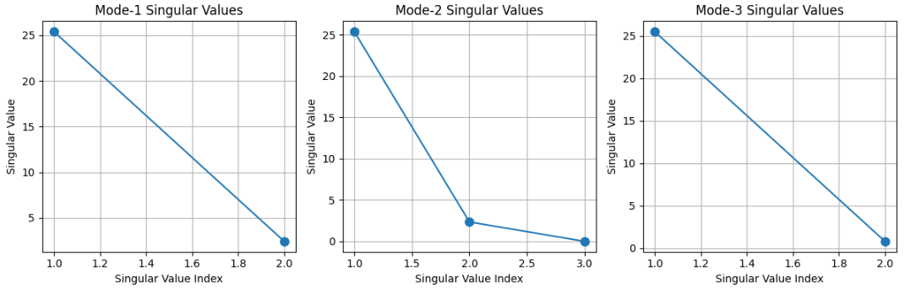
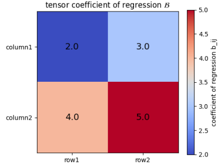
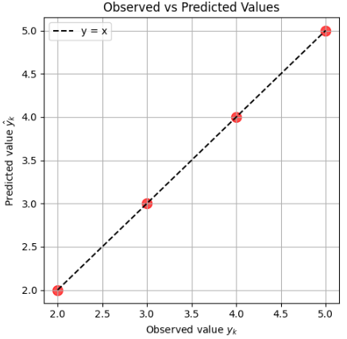

# テンソル
本章ではテンソルを扱います。
テンソルを学ぶ意味は、大きく分けて次の3つです。

1. **「多次元のデータや現象を、一つの枠組みで整理して扱えるようになる」**  
   画像、動画、センサー群のデータ、物理的な力や変形など、現実世界の多くの情報は「1つの数値」や「表（行列）」では表しきれません。テンソルを使うと、そうした**複雑な多次元データを統一的に扱う方法**が身につきます。

2. **「機械学習やAIの仕組みを、より深く理解できる」**  
   深層学習では、画像やテキストなどのデータも、ニューラルネットの中身も、ほとんどすべて「テンソル」として扱われています。テンソルを理解すると、**AIがどうやってデータを処理しているのか**がイメージしやすくなります。

3. **「物理や工学の“本格的な数式”が読めるようになる」**  
   相対性理論や材料力学など、高度な物理・工学では、力や変形を「テンソル」で表現します。テンソルを知っていると、**教科書や論文の数式の意味がつかみやすくなり**、応用分野への橋渡しができます。

つまり、**「複雑なデータや現象を整理し、AIや物理の世界で使われている本格的な数理を理解するための共通言語」** として、テンソルを学ぶ価値があります。

## テンソルの定義

数学・物理・工学・機械学習などで使われるテンソルにはいくつかの定義の流儀がありますが、ここでは **「数値を成分とする多次元配列」** としてのテンソルを中心に説明します。


### 1. テンソルの直感的な定義（多次元配列として）

- **テンソル**とは、**複数の添字（インデックス）で指定される数値の集まり**であり、**多次元配列（multi-dimensional array）** として表現できるものです。
- 例えば：
  - 0階テンソル（スカラー）：1つの数値（配列の次元数 0）
  - 1階テンソル（ベクトル）：1次元配列（例：`[x₁, x₂, ..., xₙ]`）
  - 2階テンソル（行列）：2次元配列（例：`A[i, j]`）
  - 3階テンソル：3次元配列（例：`T[i, j, k]`）
  - 一般に **N階テンソル**：N次元配列（例：`T[i₁, i₂, ..., iₙ]`）

このように、**「階数（order, rank）」＝配列の次元数**とみなすのが、多次元配列としてのテンソルの最も素朴な定義です。


### 2. 数学的な背景（線形代数・多線形写像としての定義）

「多次元配列」という見方は直感的ですが、数学的にはもう少し厳密に定義されます。

- ベクトル空間 $ V $ とその双対空間 $ V^* $ を考えます。
- テンソルは、**ベクトル空間とその双対空間のテンソル積**から作られる空間の元です。
- 具体的には、$(p, q)$-型テンソルは
  $$
  T \in V \otimes \cdots \otimes V \otimes V^* \otimes \cdots \otimes V^*
  $$
  （$V$ が $p$ 個、$V^*$ が $q$ 個）の形で表されます。
- このとき、**テンソルは多線形写像**（各引数について線形な写像）としても理解できます。

多次元配列としてのテンソルは、このようなテンソル空間の元を**ある基底について成分表示したもの**と見なすことができます。

### 3. 計算機科学・機械学習でのテンソル

NumPy や PyTorch、TensorFlow などでは、テンソルは **「任意の次元を持つ数値配列」** として実装されています。

- **shape（形状）**：各次元の長さ（例：`(3, 4, 5)` は 3×4×5 の3階テンソル）
- **dtype（データ型）**：`float32`, `int64` など
- **階数（rank）**：`ndim` で表される次元数

通常は、「テンソル＝多次元配列」という理解でほぼ問題ありません。

### 4. モード-k行列化

「モード-k行列化（mode-k matricization）」は、**高階テンソル（多次元配列）を、特定の次元（モード）に沿って「展開」して行列に変換する操作**です。テンソル分解や多線形代数でよく使われます。

__1. モード-k行列化の直感的なイメージ__

- テンソル $ \mathcal{X} \in \mathbb{R}^{I_1 \times I_2 \times \cdots \times I_N} $ を考えます。
- 「モード-k行列化」とは、**k番目の次元（モード）を行の方向に並べ、残りの次元を列の方向に並べ直す**操作です。
- 得られる行列を $ X_{(k)} $ と書き、**モード-k展開行列（mode-k unfolded matrix）** と呼びます。

__2. 定義（形式的な説明）__

テンソル $ \mathcal{X} \in \mathbb{R}^{I_1 \times I_2 \times \cdots \times I_N} $ のモード-k行列化 $ X_{(k)} $ は、次元が
$$
X_{(k)} \in \mathbb{R}^{I_k \times (I_1 \cdots I_{k-1} I_{k+1} \cdots I_N)}
$$
の行列になります。

- 行インデックス：モード k のインデックス $ i_k $
- 列インデックス：残りのモードのインデックス $ (i_1, \dots, i_{k-1}, i_{k+1}, \dots, i_N) $ を**一列に並べた多重インデックス**

成分の対応は、例えば
$$
(X_{(k)})_{i_k, j} = \mathcal{X}_{i_1, i_2, \dots, i_N}
$$
と書けます。ここで $ j $ は、$ (i_1, \dots, i_{k-1}, i_{k+1}, \dots, i_N) $ を**辞書順（lexicographic order）** などで1次元に並べたときのインデックスです。

__3. 具体例（3階テンソルの場合）__

3階テンソル $ \mathcal{X} \in \mathbb{R}^{I \times J \times K} $ を考えます。

__モード-1行列化 $ X_{(1)} $__

- モード1（最初の次元）を行方向に並べ、残り（モード2, 3）を列方向に並べます。
- サイズ：$ I \times (J \cdot K) $
- イメージ：
  - 各「スライス」（固定したモード2,3）を列ベクトルとして並べる
  - あるいは、モード2,3のインデックスを1次元に並べて列インデックスとする

__モード-2行列化 $ X_{(2)} $__

- モード2を行方向、モード1,3を列方向
- サイズ：$ J \times (I \cdot K) $

__モード-3行列化 $ X_{(3)} $__

- モード3を行方向、モード1,2を列方向
- サイズ：$ K \times (I \cdot J) $

__4. 性質__

- **線形写像としての表現**  
  モード-k行列化は、テンソル空間から行列空間への**線形写像**です。
- **テンソルと行列積の関係**  
  モード-k行列化は、テンソルと行列の**モード積（mode product）**と密接に関係します。
  - 例：テンソル $ \mathcal{X} $ と行列 $ U $ のモード-k積 $ \mathcal{Y} = \mathcal{X} \times_k U $ に対し、
    $$
    Y_{(k)} = U X_{(k)}
    $$
    が成り立ちます。
- **テンソル分解との関係**  
  CP分解やTucker分解では、モード-k行列化を用いて
  $$
  X_{(k)} \approx U^{(k)} \cdot (\text{他の因子行列のKhatri-Rao積})^\top
  $$
  のように、因子行列を推定する問題に帰着させます。

### 5. テンソルの用途

テンソル（多次元配列）は、**「多次元の構造を持つデータや物理量を扱うための統一的な枠組み」** として、非常に幅広い分野で使われています。主な用途を分野別にまとめます。

__1. 数学・線形代数・多線形代数__

- **テンソル空間の理論**  
  ベクトル空間のテンソル積を通じて、多線形写像や双線形形式などを統一的に扱います。
- **多線形代数**  
  高階の線形写像や多重線形形式を扱う際の基礎概念として使われます。
- **微分幾何・リーマン幾何**  
  計量テンソル、曲率テンソルなど、多様体上の幾何構造を記述するために必須です。

__2. 物理学__

- **一般相対性理論**  
  時空の計量テンソル、アインシュタイン方程式（曲率テンソルとエネルギー・運動量テンソル）など、重力場を記述するためにテンソルが中心的な役割を果たします。
- **連続体力学**  
  応力テンソル、ひずみテンソルなど、固体・流体の内部状態や変形を記述します。
- **電磁気学**  
  電磁場テンソル（電場・磁場を統一的に扱う）など、相対論的電磁気学で重要です。
- **量子力学・場の量子論**  
  スピンテンソル、角運動量演算子、多粒子系の状態表現などでテンソル積空間が使われます。

__3. 工学・応用科学__

- **構造力学・材料力学**  
  応力・ひずみテンソルを用いて、材料の変形や破壊を解析します。
- **流体力学**  
  粘性応力テンソル、レイノルズ応力テンソルなど、乱流モデリングで重要です。
- **画像処理・コンピュータビジョン**  
  カラー画像は3階テンソル（高さ×幅×チャネル）、動画は4階テンソル（時間×高さ×幅×チャネル）として扱われます。
- **信号処理**  
  マルチウェイデータ（複数のセンサー×時間×周波数など）をテンソルとして解析します。

__4. 機械学習・データサイエンス__

- **深層学習（Deep Learning）**  
  ニューラルネットワークの入力・中間表現・パラメータはほぼすべてテンソルです。
  - 例：画像＝3階テンソル、バッチ処理＝4階テンソル（バッチ×高さ×幅×チャネル）
- **テンソル分解（CP/Tucker分解など）**  
  高次元データの次元削減、欠損値補完、推薦システム、異常検知などに利用されます。
- **推薦システム**  
  ユーザ×アイテム×コンテキスト（時間、場所など）の3階テンソルを分解して、嗜好を予測します。
- **自然言語処理（NLP）**  
  単語×文脈×時間などの多次元データをテンソルとして扱う手法もあります。
- **グラフ解析**  
  隣接行列を高階テンソルに拡張し、多次元関係をモデル化します。

__5. 化学・生物・医学__

- **化学計量学（Chemometrics）**  
  複数の試料×波長×時間などのスペクトルデータをテンソル分解して成分分析を行います。
- **神経科学**  
  fMRIデータ（空間×時間×被験者など）をテンソルとして解析し、脳活動パターンを抽出します。
- **バイオインフォマティクス**  
  遺伝子発現データ（遺伝子×条件×時間）などをテンソル分解してパターン発見に利用します。

__6. 経済学・社会科学__

- **パネルデータ解析**  
  国×時間×経済指標などの多次元データをテンソルとして扱い、構造を抽出します。
- **ソーシャルネットワーク分析**  
  ユーザ×ユーザ×時間などの関係テンソルを用いて、ネットワークの時間変化をモデル化します。

## モード積

テンソルの**モード積（mode product）** は、**テンソルと行列（またはベクトル）を、特定のモード（次元）に沿って掛け合わせる操作**です。テンソル分解や多線形代数で頻繁に使われます。


### 1. テンソルと行列のモード積（mode-k product）

__定義__
- テンソル：$ \mathcal{X} \in \mathbb{R}^{I_1 \times I_2 \times \cdots \times I_N} $
- 行列：$ U \in \mathbb{R}^{J \times I_k} $
- モード-k積：$ \mathcal{Y} = \mathcal{X} \times_k U $
  - 結果のテンソル $ \mathcal{Y} $ の次元は
    $$
    \mathbb{R}^{I_1 \times \cdots \times I_{k-1} \times J \times I_{k+1} \times \cdots \times I_N}
    $$
  - つまり、**k番目の次元が $ I_k $ から $ J $ に置き換わる**形になります。

__成分表示__
モード-k積の成分は、次のように書けます：
$$
\mathcal{Y}_{i_1, \dots, i_{k-1}, j, i_{k+1}, \dots, i_N}
= \sum_{i_k = 1}^{I_k} U_{j, i_k} \cdot \mathcal{X}_{i_1, i_2, \dots, i_N}
$$
- モード k のインデックス $ i_k $ について和を取る（縮約する）形です。
- 行列 $ U $ の行インデックス $ j $ が、新しいモード k のインデックスになります。

__モード行列化との関係__
モード-k行列化 $ X_{(k)} $ を使うと、モード積は**行列積**として書けます：
$$
Y_{(k)} = U X_{(k)}
$$
- ここで $ X_{(k)} \in \mathbb{R}^{I_k \times (I_1 \cdots I_{k-1} I_{k+1} \cdots I_N)} $、$ Y_{(k)} \in \mathbb{R}^{J \times (I_1 \cdots I_{k-1} I_{k+1} \cdots I_N)} $
- この関係は、テンソル分解のアルゴリズム（CP/Tucker分解など）で非常に重要です。

### 2. テンソルとベクトルのモード積（mode-k product with a vector）

行列だけでなく、ベクトルとのモード積も定義できます。

- テンソル：$ \mathcal{X} \in \mathbb{R}^{I_1 \times I_2 \times \cdots \times I_N} $
- ベクトル：$ v \in \mathbb{R}^{I_k} $
- モード-k積：$ \mathcal{Y} = \mathcal{X} \times_k v $
  - 結果のテンソル $ \mathcal{Y} $ の次元は
    $$
    \mathbb{R}^{I_1 \times \cdots \times I_{k-1} \times I_{k+1} \times \cdots \times I_N}
    $$
  - つまり、**モード k が消えて1つ次元が減る**（縮約される）形になります。

__成分表示__
$$
\mathcal{Y}_{i_1, \dots, i_{k-1}, i_{k+1}, \dots, i_N}
= \sum_{i_k = 1}^{I_k} v_{i_k} \cdot \mathcal{X}_{i_1, i_2, \dots, i_N}
$$
- モード k のインデックス $ i_k $ について和を取り、その次元を消します。

### 3. 複数のモード積の連続適用

複数のモードに対して順にモード積を適用することもできます。

例：
$$
\mathcal{Y} = \mathcal{X} \times_1 U^{(1)} \times_2 U^{(2)} \times_3 \cdots \times_N U^{(N)}
$$
- 各モードに異なる行列 $ U^{(k)} $ を掛けることで、**Tucker分解**の形になります。
- 順序は基本的に交換可能ですが、次元の対応に注意が必要です。

### 4. 具体例（3階テンソルと行列のモード積）

テンソル $ \mathcal{X} \in \mathbb{R}^{I \times J \times K} $、行列 $ A \in \mathbb{R}^{L \times I} $ とします。

- **モード-1積**：$ \mathcal{Y} = \mathcal{X} \times_1 A \in \mathbb{R}^{L \times J \times K} $
  - 成分：
    $$
    \mathcal{Y}_{l, j, k} = \sum_{i=1}^{I} A_{l, i} \mathcal{X}_{i, j, k}
    $$
  - イメージ：各「ファイバー」（固定した j, k）に対して、行列 A を左から掛ける。

- **モード-2積**：$ \mathcal{Y} = \mathcal{X} \times_2 B \in \mathbb{R}^{I \times M \times K} $
  - 成分：
    $$
    \mathcal{Y}_{i, m, k} = \sum_{j=1}^{J} B_{m, j} \mathcal{X}_{i, j, k}
    $$
  - 行列 B を、モード2方向のファイバーに右から掛けるイメージです。

- **モード-3積**も同様に定義されます。

### 5. 用途

モード積は、**「テンソルを特定の方向に変換・縮約する」** ための基本操作として、主に次のような場面で使われています。
ここで記載の内容のうち、CP分解・Tucker分解は詳細を後に扱います。

__1. テンソル分解（CP分解・Tucker分解など）__

- **Tucker分解**  
  - テンソル $ \mathcal{X} $（例：3階テンソル $ I \times J \times K $）を、
  - 小さな**コアテンソル** $ \mathcal{G} $（例：$ R_1 \times R_2 \times R_3 $、各 $ R_k < I, J, K $）
  - 各モードごとの**因子行列** $ U^{(1)}, U^{(2)}, U^{(3)} $
  のモード積で近似します。

  __式（3階テンソルの場合）__  

  $$
  \mathcal{X} \approx \mathcal{G} \times_1 U^{(1)} \times_2 U^{(2)} \times_3 U^{(3)}
  $$

  - $ U^{(1)} \in \mathbb{R}^{I \times R_1} $, $ U^{(2)} \in \mathbb{R}^{J \times R_2} $, $ U^{(3)} \in \mathbb{R}^{K \times R_3} $
  - コアテンソル $ \mathcal{G} $ が「モード間の相互作用」を表し、因子行列が各モード方向の線形変換を表します。

  __アルゴリズムの概要__  
  - 各モードごとに**モード-k行列化** $ X_{(k)} $ を作り、
    $$
    X_{(k)} \approx U^{(k)} G_{(k)} (U^{(\otimes)})^\top
    $$
    のような形で最小二乗問題を解きます（$ U^{(\otimes)} $ は他の因子行列のKhatri-Rao積）。
  - 代表的なアルゴリズム：**Higher Order SVD (HOSVD)**、**Higher Order Orthogonal Iteration (HOOI)** など。
  Tucker分解は、コアテンソル $ \mathcal{G} $ と各モードの因子行列 $ U^{(1)}, U^{(2)}, \dots, U^{(N)} $ のモード積で表されます：
  $$
  \mathcal{X} \approx \mathcal{G} \times_1 U^{(1)} \times_2 U^{(2)} \times_3 \cdots \times_N U^{(N)}
  $$
  ここでモード積は、**各モード方向に線形変換を施して元のテンソルを近似する**役割を果たします。

- **CP分解の推定アルゴリズム**  
  - Tucker分解よりも**よりシンプルな構造**を仮定します。
- テンソル $ \mathcal{X} $ を、**「ランク1テンソルの和」**で近似します。
  - ランク1テンソル：各モードごとのベクトルの外積（例：$ a \circ b \circ c $）

  __式（3階テンソル、ランク $ R $ の場合）__
  $$
  \mathcal{X} \approx \sum_{r=1}^{R} a_r \circ b_r \circ c_r
  $$
  - $ a_r \in \mathbb{R}^I $, $ b_r \in \mathbb{R}^J $, $ c_r \in \mathbb{R}^K $
  - 成分表示：
    $$
    \mathcal{X}_{i,j,k} \approx \sum_{r=1}^{R} a_{ir} b_{jr} c_{kr}
    $$

    __アルゴリズムの概要__
  - 各モードの因子行列 $ A = [a_1, \dots, a_R] $, $ B, C $ を推定します。
  - モード-k行列化を用いて、
    $$
    X_{(1)} \approx A (C \odot B)^\top,\quad
    X_{(2)} \approx B (C \odot A)^\top,\quad
    X_{(3)} \approx C (B \odot A)^\top
    $$
    のように書き、交互に最小二乗問題を解く**交互最小二乗法（ALS）**がよく使われます。
  - 他にも、非負制約付きCP分解（NCPD）など、さまざまなバリエーションがあります。

  CP分解の因子行列を推定する際、モード-k行列化 $ X_{(k)} $ とモード積の関係
  $$
  X_{(k)} \approx U^{(k)} \cdot (\text{他の因子行列のKhatri-Rao積})^\top
  $$
  を用いて、最小二乗問題を解きます。このとき、モード積の性質が本質的に使われます。


__2. 多線形主成分分析（MPCA）・次元削減__

- **テンソルデータの特徴抽出**  
  画像シーケンスや動画、マルチウェイデータをそのままテンソルとして扱い、各モード方向に射影行列を掛けて次元を削減します。
- 例：動画データ $ \mathcal{X} \in \mathbb{R}^{T \times H \times W \times C} $ に対し、
  $$
  \mathcal{Y} = \mathcal{X} \times_2 P_{\text{空間}} \times_3 Q_{\text{空間}} \times_4 R_{\text{色}}
  $$
  のように、時間・空間・色チャネル方向にそれぞれ射影して、重要な特徴だけを残します。

__3. 機械学習・深層学習での前処理・特徴変換__

- **テンソル入力の線形変換**  
  ニューラルネットの前段で、テンソルデータにモード積を適用して特徴を変換することがあります。
- **テンソルネットワーク（Tensor Networks）**  
  量子機械学習や高次元モデリングで、テンソルネットワークを構成する際、モード積は「テンソル同士を結合する基本演算」として使われます。

__4. 物理・工学での線形変換の一般化__

- **連続体力学・材料力学**  
  応力テンソルやひずみテンソルに、材料の特性を表す4階テンソル（弾性テンソル）をモード積で掛けて、応力–ひずみ関係を記述します。
- **相対論的物理学**  
  座標変換やローレンツ変換を、計量テンソルやエネルギー・運動量テンソルに「モード方向に沿って」適用する操作として理解できます（通常は添字表記で書かれますが、モード積の考え方に対応します）。

__5. 数値線形代数・アルゴリズム設計__

- **テンソルSVD・テンソル特異値分解**  
  高階テンソルに対するSVD的な分解を設計する際、モード積とモード行列化を組み合わせて、行列のSVDに帰着させます。
- **テンソル方程式の求解**  
  線形テンソル方程式 $ \mathcal{A} \times_1 X^{(1)} \times_2 X^{(2)} \times_3 \cdots = \mathcal{B} $ を解く際に、モード積の性質を利用して反復解法を構築します。

## 線形変換

テンソルの**線形変換**とは、**テンソル空間から別のテンソル空間（またはベクトル空間）への線形写像**のことです。代表的なものを挙げると、次のようなものがあります。

### 1. モード積（mode product）による線形変換

- テンソル $ \mathcal{X} \in \mathbb{R}^{I_1 \times \cdots \times I_N} $ に対し、行列 $ U^{(k)} \in \mathbb{R}^{J_k \times I_k} $ をモード k に沿って掛ける操作：
  $$
  \mathcal{Y} = \mathcal{X} \times_k U^{(k)}
  $$
- これは、モード k 方向に線形変換を施す写像で、**テンソルからテンソルへの線形変換**です。
- 複数のモードで同時に行うと、Tucker分解の形になります：
  $$
  \mathcal{Y} = \mathcal{X} \times_1 U^{(1)} \times_2 U^{(2)} \times_3 \cdots \times_N U^{(N)}
  $$


### 2. テンソル積空間上の線形写像（線形写像のテンソル積）

- ベクトル空間 $ V, W $ と、その上の線形写像 $ A: V \to V' $, $ B: W \to W' $ があるとき、
  - テンソル積 $ A \otimes B: V \otimes W \to V' \otimes W' $ を
    $$
    (A \otimes B)(v \otimes w) = A(v) \otimes B(w)
    $$
    で定義できます。
- これは、**2つの線形写像を「同時に」テンソル空間に持ち上げた線形変換**です。
- 高階テンソルに対しても同様に、各モードごとに線形写像をテンソル積で組み合わせた変換が考えられます。


### 3. テンソルをベクトルに潰す線形変換（平坦化・ベクトル化）

- テンソル $ \mathcal{X} \in \mathbb{R}^{I_1 \times \cdots \times I_N} $ を、1次元配列（ベクトル）に並べ替える操作：
  $$
  \text{vec}(\mathcal{X}) \in \mathbb{R}^{I_1 I_2 \cdots I_N}
  $$
- これは、テンソル空間からベクトル空間への**線形写像**です。
- モード-k行列化 $ X_{(k)} $ も、テンソルから行列への線形写像です。


### 4. テンソルからスカラーへの線形写像（線形形式・双線形形式の一般化）

- テンソル $ \mathcal{X} $ に、別のテンソル $ \mathcal{A} $ を「同じ形で」掛けて成分ごとに和を取る操作：
  $$
  \langle \mathcal{A}, \mathcal{X} \rangle = \sum_{i_1, \dots, i_N} \mathcal{A}_{i_1, \dots, i_N} \mathcal{X}_{i_1, \dots, i_N}
  $$
- これは、**テンソルをスカラーに写す線形写像（線形形式）** です。
- 特に $ \mathcal{A} $ が2階テンソル（行列）のときは、行列のフロベニウス内積に対応します。


### 5. テンソルネットワーク・テンソル縮約としての線形変換

- 複数のテンソルを「共有インデックスで縮約」して新しいテンソルを作る操作は、全体として**線形写像**になります。
- 例：行列積 $ C = AB $ は、2階テンソル $ A, B $ から2階テンソル $ C $ への線形写像です。
- より一般的なテンソルネットワーク（MPS/TT、PEPSなど）も、入力テンソルから出力テンソルへの線形変換として理解できます。


### 6. 物理・工学での具体例

- **応力テンソルとひずみテンソルの関係**（フックの法則の一般化）：
  $$
  \sigma_{ij} = C_{ijkl} \varepsilon_{kl}
  $$
  ここで $ C $ は4階の弾性テンソルで、2階テンソル $ \varepsilon $ から2階テンソル $ \sigma $ への**線形写像**を表します。
- **座標変換**：テンソル成分の変換則
  $$
  T'_{i_1' \dots i_N'} = \frac{\partial x^{i_1'}}{\partial x^{i_1}} \cdots \frac{\partial x^{i_N'}}{\partial x^{i_N}} T_{i_1 \dots i_N}
  $$
  も、テンソルからテンソルへの線形変換の一種です（多様体上のテンソル場の場合）。


__定理:__ テンソル積空間の普遍性（universal property）

- ベクトル空間 \( V_1, \dots, V_N \) に対し、そのテンソル積 \( V_1 \otimes \cdots \otimes V_N \) は、
  - 任意の**多線形写像** \( f: V_1 \times \cdots \times V_N \to W \) に対し、
  - 一意の**線形写像** \( \tilde{f}: V_1 \otimes \cdots \otimes V_N \to W \) が存在して、
    \[
    f(v_1, \dots, v_N) = \tilde{f}(v_1 \otimes \cdots \otimes v_N)
    \]
  を満たす、という性質を持ちます。
- これは、**「多線形写像は、テンソル積空間上の線形写像に一意に持ち上がる」** という定理です。

---

__定理の再確認（テンソル積の普遍性）__

**定理**（テンソル積の普遍性）  
ベクトル空間 \( V_1, \dots, V_N \) に対し、そのテンソル積 \( V_1 \otimes \cdots \otimes V_N \) は次の性質を持つ：

任意の多線形写像 \( f: V_1 \times \cdots \times V_N \to W \) に対し、一意の線形写像  
\[
\tilde{f}: V_1 \otimes \cdots \otimes V_N \to W
\]
が存在して、
\[
f(v_1, \dots, v_N) = \tilde{f}(v_1 \otimes \cdots \otimes v_N)
\]
がすべての \( v_k \in V_k \) に対して成り立つ。

__証明の準備：テンソル積の構成__

テンソル積 \( V_1 \otimes \cdots \otimes V_N \) は、形式的なテンソル積空間を「多線形性を反映する関係式で割る」ことで定義されます。

1. **自由ベクトル空間**  
   \( V_1 \times \cdots \times V_N \) を単なる集合とみなし、その上の**自由ベクトル空間** \( F \) を考えます。
   - \( F \) の基底は、すべての \( N \)-組 \( (v_1, \dots, v_N) \in V_1 \times \cdots \times V_N \) です。
   - 形式的な元は、有限個の基底の線形結合で表されます。

2. **多線形性を強制する部分空間**  
   \( F \) の部分空間 \( R \) を、次の形の元で生成されるものとします（すべての \( v_k, v_k' \in V_k \)、\( \lambda \in K \) に対して）：
   - \( (v_1, \dots, v_k + v_k', \dots, v_N) - (v_1, \dots, v_k, \dots, v_N) - (v_1, \dots, v_k', \dots, v_N) \)
   - \( (v_1, \dots, \lambda v_k, \dots, v_N) - \lambda (v_1, \dots, v_k, \dots, v_N) \)

   これにより、**加算とスカラー倍が各引数について線形に振る舞う**ように「関係式」を入れています。

3. **テンソル積空間の定義**  
   テンソル積空間を
   \[
   V_1 \otimes \cdots \otimes V_N := F / R
   \]
   と定義します。  
   この商空間における \( (v_1, \dots, v_N) \) の同値類を
   \[
   v_1 \otimes \cdots \otimes v_N
   \]
   と書きます。

この構成により、テンソル積 \( v_1 \otimes \cdots \otimes v_N \) は、各 \( v_k \) について線形（多線形）な振る舞いをします。

__証明：存在性（\(\tilde{f}\) の構成）__

任意の多線形写像 \( f: V_1 \times \cdots \times V_N \to W \) が与えられたとします。

1. **自由空間上の線形写像の構成**  
   自由ベクトル空間 \( F \) 上に、線形写像 \( \hat{f}: F \to W \) を
   \[
   \hat{f}\big( (v_1, \dots, v_N) \big) := f(v_1, \dots, v_N)
   \]
   で定義し、線形に延長します（基底の像を決めれば線形写像は一意に定まる）。

2. **\(\hat{f}\) が \( R \) を零に送ることの確認**  
   \( R \) は、多線形性を強制する関係式で生成されています。  
   一方、\( f \) は多線形写像なので、例えば
   \[
   f(v_1, \dots, v_k + v_k', \dots, v_N)
   = f(v_1, \dots, v_k, \dots, v_N) + f(v_1, \dots, v_k', \dots, v_N)
   \]
   が成り立ちます。  
   したがって、
   \[
   \hat{f}\big( (v_1, \dots, v_k+v_k', \dots, v_N) - (v_1, \dots, v_k, \dots, v_N) - (v_1, \dots, v_k', \dots, v_N) \big) = 0
   \]
   となります。スカラー倍についても同様です。  
   よって、\( \hat{f}(R) = 0 \) です。

3. **商写像の誘導**  
   \( \hat{f}: F \to W \) が \( R \) を零に送るので、商空間 \( F/R = V_1 \otimes \cdots \otimes V_N \) 上に、**一意の線形写像**
   \[
   \tilde{f}: V_1 \otimes \cdots \otimes V_N \to W
   \]
   が誘導されます。  
   具体的には、
   \[
   \tilde{f}(v_1 \otimes \cdots \otimes v_N) := f(v_1, \dots, v_N)
   \]
   と定義でき、これは well-defined です（\( R \) で割ったことで、多線形性が自動的に満たされるため）。

これで、任意の多線形 \( f \) に対し、条件を満たす線形写像 \( \tilde{f} \) が存在することが示されました。

__証明：一意性（\(\tilde{f}\) の一意性）__

次に、そのような線形写像 \( \tilde{f} \) が一意であることを示します。

- \( V_1 \otimes \cdots \otimes V_N \) は、すべての単純テンソル \( v_1 \otimes \cdots \otimes v_N \) によって生成されます（実際にはそれらの線形結合全体）。
- 線形写像は、生成元の上での値によって一意に決まります。
- 今、条件
  \[
  \tilde{f}(v_1 \otimes \cdots \otimes v_N) = f(v_1, \dots, v_N)
  \]
  がすべての \( v_k \in V_k \) に対して要求されています。
- したがって、**生成元の上での値が一意に定まる**ので、線形写像 \( \tilde{f} \) 自体も一意に決まります。

（厳密には、商空間の定義から、任意の元は単純テンソルの有限線形結合として表せ、線形写像はその表現に依らず well-defined であることも確認できますが、ここでは省略します。）

---


__定理:__  テンソル空間の基底と次元
- \( V_k \) の基底を \( \{ e^{(k)}_{1}, \dots, e^{(k)}_{d_k} \} \) とすると、
  - \( V_1 \otimes \cdots \otimes V_N \) の基底は
    \[
    \{ e^{(1)}_{i_1} \otimes \cdots \otimes e^{(N)}_{i_N} \mid 1 \le i_k \le d_k \}
    \]
  - 次元は \( \dim(V_1 \otimes \cdots \otimes V_N) = d_1 d_2 \cdots d_N \)
- これは、**テンソル空間が「基底のテンソル積」で張られる**という構造定理です。


---

以下では、体 \( K \) 上の有限次元ベクトル空間 \( V_1, \dots, V_N \) を考えます。  
各 \( V_k \) の次元を \( d_k = \dim V_k \) とし、基底を
\[
\{ e^{(k)}_{1}, \dots, e^{(k)}_{d_k} \}
\]
とします。

__定理の再確認__

**定理**（テンソル積空間の基底と次元）  
上記の設定のもとで、

- \( V_1 \otimes \cdots \otimes V_N \) の基底は
  \[
  \{ e^{(1)}_{i_1} \otimes \cdots \otimes e^{(N)}_{i_N} \mid 1 \le i_k \le d_k \}
  \]
- 次元は
  \[
  \dim(V_1 \otimes \cdots \otimes V_N) = d_1 d_2 \cdots d_N
  \]

が成り立つ。

__証明の準備：テンソル積の構成__

テンソル積 \( V_1 \otimes \cdots \otimes V_N \) は、自由ベクトル空間を多線形性の関係式で割った商空間として定義されます。

1. **自由ベクトル空間 \( F \)**  
   \( V_1 \times \cdots \times V_N \) を単なる集合とみなし、その上の自由ベクトル空間 \( F \) を考えます。
   - \( F \) の基底は、すべての \( N \)-組 \( (v_1, \dots, v_N) \in V_1 \times \cdots \times V_N \) です。

2. **多線形性を強制する部分空間 \( R \)**  
   \( F \) の部分空間 \( R \) を、次の形の元で生成されるものとします（すべての \( v_k, v_k' \in V_k \)、\( \lambda \in K \) に対して）：
   - \( (v_1, \dots, v_k + v_k', \dots, v_N) - (v_1, \dots, v_k, \dots, v_N) - (v_1, \dots, v_k', \dots, v_N) \)
   - \( (v_1, \dots, \lambda v_k, \dots, v_N) - \lambda (v_1, \dots, v_k, \dots, v_N) \)

3. **テンソル積空間の定義**  
   テンソル積空間を
   \[
   V_1 \otimes \cdots \otimes V_N := F / R
   \]
   と定義し、\( (v_1, \dots, v_N) \) の同値類を
   \[
   v_1 \otimes \cdots \otimes v_N
   \]
   と書きます。

この構成により、テンソル積 \( v_1 \otimes \cdots \otimes v_N \) は各 \( v_k \) について線形（多線形）になります。

__証明の方針__

集合
\[
\mathcal{B} := \{ e^{(1)}_{i_1} \otimes \cdots \otimes e^{(N)}_{i_N} \mid 1 \le i_k \le d_k \}
\]
が \( V_1 \otimes \cdots \otimes V_N \) の基底であることを示します。  
そのためには、

1. **\(\mathcal{B}\) が生成系であること**（任意の元が \(\mathcal{B}\) の線形結合で表せる）
2. **\(\mathcal{B}\) が一次独立であること**

を示せば十分です。

__1. \(\mathcal{B}\) が生成系であることの証明__

任意の単純テンソル \( v_1 \otimes \cdots \otimes v_N \in V_1 \otimes \cdots \otimes V_N \) を考えます。  
各 \( v_k \in V_k \) は基底で展開できるので、
\[
v_k = \sum_{j_k=1}^{d_k} c^{(k)}_{j_k} e^{(k)}_{j_k}
\]
と書けます。

テンソル積の多線形性（商空間の定義から従う）により、
\[
v_1 \otimes \cdots \otimes v_N
= \sum_{j_1=1}^{d_1} \cdots \sum_{j_N=1}^{d_N}
  c^{(1)}_{j_1} \cdots c^{(N)}_{j_N}
  \; e^{(1)}_{j_1} \otimes \cdots \otimes e^{(N)}_{j_N}
\]
となります。これは \(\mathcal{B}\) の元の線形結合です。

任意のテンソルは単純テンソルの有限線形結合として表せるので（商空間の定義より）、結局、**任意のテンソルは \(\mathcal{B}\) の線形結合で表せます**。  
したがって、\(\mathcal{B}\) は生成系です。

__2. \(\mathcal{B}\) が一次独立であることの証明__

一次独立性を示すために、双対基底を用いるのが簡潔です。

__双対空間と双対基底__

各 \( V_k \) の双対空間 \( V_k^* \) を考え、その双対基底
\[
\{ \varepsilon^{(k)}_{1}, \dots, \varepsilon^{(k)}_{d_k} \} \subset V_k^*
\]
を取ります。すなわち、
\[
\varepsilon^{(k)}_{j}(e^{(k)}_{i}) = \delta_{ij}
\]
（クロネッカーのデルタ）です。

__多線形形式の構成__

各 \( N \)-組 \( (i_1, \dots, i_N) \) に対し、多線形写像
\[
f_{i_1 \dots i_N}: V_1 \times \cdots \times V_N \to K
\]
を
\[
f_{i_1 \dots i_N}(v_1, \dots, v_N)
:= \varepsilon^{(1)}_{i_1}(v_1) \cdots \varepsilon^{(N)}_{i_N}(v_N)
\]
で定義します。これは明らかに多線形です。

__テンソル積の普遍性の適用__

テンソル積の普遍性により、この多線形写像 \( f_{i_1 \dots i_N} \) に対応する線形写像
\[
\tilde{f}_{i_1 \dots i_N}: V_1 \otimes \cdots \otimes V_N \to K
\]
が一意に存在し、
\[
\tilde{f}_{i_1 \dots i_N}(v_1 \otimes \cdots \otimes v_N)
= f_{i_1 \dots i_N}(v_1, \dots, v_N)
= \varepsilon^{(1)}_{i_1}(v_1) \cdots \varepsilon^{(N)}_{i_N}(v_N)
\]
を満たします。

特に、基底テンソル \( e^{(1)}_{j_1} \otimes \cdots \otimes e^{(N)}_{j_N} \in \mathcal{B} \) に対しては、
\[
\tilde{f}_{i_1 \dots i_N}(e^{(1)}_{j_1} \otimes \cdots \otimes e^{(N)}_{j_N})
= \delta_{i_1 j_1} \cdots \delta_{i_N j_N}
\]
となります（右辺は \( (i_1, \dots, i_N) = (j_1, \dots, j_N) \) のとき 1、それ以外 0）。

__一次独立性の確認__

いま、\(\mathcal{B}\) の元の線形結合がゼロになると仮定します：
\[
\sum_{i_1=1}^{d_1} \cdots \sum_{i_N=1}^{d_N}
\alpha_{i_1 \dots i_N} \; e^{(1)}_{i_1} \otimes \cdots \otimes e^{(N)}_{i_N} = 0
\]

この両辺に線形写像 \( \tilde{f}_{j_1 \dots j_N} \) を作用させると、
\[
\tilde{f}_{j_1 \dots j_N}\left(
\sum_{i_1, \dots, i_N} \alpha_{i_1 \dots i_N} \; e^{(1)}_{i_1} \otimes \cdots \otimes e^{(N)}_{i_N}
\right)
= \sum_{i_1, \dots, i_N} \alpha_{i_1 \dots i_N} \;
\delta_{i_1 j_1} \cdots \delta_{i_N j_N}
= \alpha_{j_1 \dots j_N}
\]
一方、左辺は \( \tilde{f}_{j_1 \dots j_N}(0) = 0 \) なので、
\[
\alpha_{j_1 \dots j_N} = 0
\]
がすべての \( (j_1, \dots, j_N) \) について成り立ちます。

したがって、\(\mathcal{B}\) の元は一次独立です。

__3. 次元の公式__

\(\mathcal{B}\) は基底であり、その元の個数は
\[
d_1 \times d_2 \times \cdots \times d_N
\]
です。したがって、
\[
\dim(V_1 \otimes \cdots \otimes V_N) = d_1 d_2 \cdots d_N
\]
が成り立ちます。


## テンソルのランクと分解

テンソルの**ランク（rank）**と**分解（decomposition）** は、**「テンソルをどれだけ単純な部品の組み合わせで表現できるか」** を測る概念です。特に**CP分解**は、その中でも最も基本的な分解の一つです。


### 1. テンソルのランクの数学的意義

__(a) ランク1テンソル（rank-1 tensor）__

- 各モードごとのベクトルの**外積（テンソル積）** で書けるテンソルを**ランク1テンソル**といいます。
- 例（3階テンソル）：
  \[
  \mathcal{T} = a \circ b \circ c \quad \Leftrightarrow \quad \mathcal{T}_{i,j,k} = a_i b_j c_k
  \]
- ランク1テンソルは、**「各モードが独立に寄与する単純な構造」** を表します。

__(b) テンソルのランク（CPランク）__

- テンソル \( \mathcal{X} \) の**ランク**とは、
  - \( \mathcal{X} \) を**ランク1テンソルの和**として表すときの**最小の項数** \( R \) です。
  - つまり、
    \[
    \mathcal{X} = \sum_{r=1}^{R} a_r \circ b_r \circ c_r
    \]
    と書ける最小の \( R \) がランクです。
- 数学的意義：
  - ランクが小さいほど、テンソルは**少数の単純な成分（ランク1テンソル）で近似できる**＝構造が単純。
  - ランクが大きいほど、より多くの独立な成分が必要＝構造が複雑。
- 行列のランク（階数）の高階版とみなせますが、テンソルのランクは**計算が難しく、一意でない場合もある**という違いがあります。

### 2. CP分解（CANDECOMP/PARAFAC decomposition）

__(a) 定義__

CP分解は、テンソルを**ランク1テンソルの和**として近似する分解です。

- 3階テンソル \( \mathcal{X} \in \mathbb{R}^{I \times J \times K} \) のランク \( R \) CP分解：
  \[
  \mathcal{X} \approx \sum_{r=1}^{R} a_r \circ b_r \circ c_r
  \]
  成分表示：
  \[
  \mathcal{X}_{i,j,k} \approx \sum_{r=1}^{R} a_{ir} b_{jr} c_{kr}
  \]
- 各 \( a_r \in \mathbb{R}^I \), \( b_r \in \mathbb{R}^J \), \( c_r \in \mathbb{R}^K \) を**因子ベクトル（factor vectors）** と呼びます。
- これらをまとめて因子行列 \( A = [a_1, \dots, a_R] \in \mathbb{R}^{I \times R} \), \( B, C \) と書くこともあります。

__(b) 数学的意義__

- **構造の単純化**：高次元データを、各モードごとのベクトルの組み合わせとして表現します。
- **解釈性**：各ランク1成分 \( a_r \circ b_r \circ c_r \) が「あるパターン」を表し、その重み付き和が全体を構成すると解釈できます。
- **低ランク近似**：小さな \( R \) で近似することで、データの本質的な構造だけを抽出できます（次元削減・ノイズ除去）。

__3. CP分解の性質__

__(a) 一意性（under mild conditions）__

- 行列のSVDとは異なり、CP分解は**十分条件のもとで一意**になることが知られています。
  - 例：Kruskal条件（因子行列のk-rankに関する条件）など。
- 一意性があるため、**因子ベクトルを「データの本質的な成分」として解釈しやすい**という利点があります。

__(b) 計算の難しさ__

- テンソルのランクを求めること自体がNP-hardな問題であり、CP分解の最適解を求めるのも一般に困難です。
- 実用上は、**交互最小二乗法（ALS）** などの反復法で近似解を求めます。

__(c) Tucker分解との違い__

- **Tucker分解**：
  - コアテンソル \( \mathcal{G} \) と因子行列 \( U^{(k)} \) のモード積で表現：
    \[
    \mathcal{X} = \mathcal{G} \times_1 U^{(1)} \times_2 U^{(2)} \times_3 \cdots
    \]
  - コアテンソルが非対角でもよい → モード間の相互作用を柔軟に表現。
- **CP分解**：
  - コアテンソルが**超対角（superdiagonal）**とみなせる特殊なTucker分解。
  - すべてのモードで同じランク \( R \) を共有し、構造がより単純。

__4. CP分解の用途__

- **データの要約・圧縮**：高次元データを少数のランク1成分で近似し、ストレージや計算を削減。
- **ノイズ除去・スムージング**：低ランク近似により、ノイズ成分を捨てて信号成分を抽出。
- **因子分析・解釈**：各ランク1成分が「特定のパターン」（例：特定の化学物質のスペクトル）と解釈できる。
- **推薦システム・テンソル補完**：ユーザ×アイテム×コンテキストの3階テンソルをCP分解し、欠損値を予測。
- **神経科学・化学計量学**：fMRIデータやスペクトルデータのパターン抽出に利用。

__例題:__

以下では、小さな3階テンソルに対してCP分解（ランクRの近似）をPython（NumPy）で実装し、**「元のテンソル → ランク1成分の和 → 近似テンソル」** という流れを確認できるようにします。

__1. 実装の方針__

- 対象：3階テンソル \( \mathcal{X} \in \mathbb{R}^{I \times J \times K} \)
- CP分解：\( \mathcal{X} \approx \sum_{r=1}^{R} a_r \circ b_r \circ c_r \)
- アルゴリズム：**交互最小二乗法（ALS）**
  - 各モードについて、他の因子を固定して最小二乗問題を解く
- 可視化：
  - 元のテンソルと近似テンソルの値を並べて表示
  - ランク1成分 \( a_r \circ b_r \circ c_r \) も表示して、**「単純な部品の足し合わせ」** のイメージを見せる

__2. Python実装（NumPy）__

```python
import numpy as np

def cp_als(X, rank, max_iter=100, tol=1e-6):
    """
    CP分解（ランクR）を交互最小二乗法（ALS）で求める（修正版）
    """
    I, J, K = X.shape
    
    # 因子行列の初期化（乱数）
    A = np.random.randn(I, rank)
    B = np.random.randn(J, rank)
    C = np.random.randn(K, rank)
    
    # モード行列化
    X1 = X.reshape(I, -1)  # モード-1行列化 (I, J*K)
    X2 = X.transpose(1, 0, 2).reshape(J, -1)  # モード-2行列化 (J, I*K)
    X3 = X.transpose(2, 0, 1).reshape(K, -1)  # モード-3行列化 (K, I*J)
    
    for it in range(max_iter):
        # --- Aの更新（B, C固定） ---
        # Khatri-Rao積: Z = C ⊙ B, 形状 (J*K, rank)
        Z = np.zeros((J*K, rank))
        for j in range(J):
            for k in range(K):
                idx = j*K + k
                Z[idx, :] = B[j, :] * C[k, :]
        
        # 最小二乗問題: A Z^T ≈ X1  →  A ≈ X1 Z (Z^T Z)^{-1}
        # ただし数値安定のため lstsq で解く: A Z^T = X1 を A について解く
        # 形状: X1: (I, J*K), Z: (J*K, rank) → A: (I, rank)
        A_new, _, _, _ = np.linalg.lstsq(Z, X1.T, rcond=None)
        A_new = A_new.T  # (I, rank)
        
        # --- Bの更新（A, C固定） ---
        # Z = C ⊙ A_new, 形状 (I*K, rank)
        Z = np.zeros((I*K, rank))
        for i in range(I):
            for k in range(K):
                idx = i*K + k
                Z[idx, :] = A_new[i, :] * C[k, :]
        
        # B Z^T = X2 を B について解く
        # 形状: X2: (J, I*K), Z: (I*K, rank) → B: (J, rank)
        B_new, _, _, _ = np.linalg.lstsq(Z, X2.T, rcond=None)
        B_new = B_new.T  # (J, rank)
        
        # --- Cの更新（A_new, B_new固定） ---
        # Z = B_new ⊙ A_new, 形状 (I*J, rank)
        Z = np.zeros((I*J, rank))
        for i in range(I):
            for j in range(J):
                idx = i*J + j
                Z[idx, :] = A_new[i, :] * B_new[j, :]
        
        # C Z^T = X3 を C について解く
        # 形状: X3: (K, I*J), Z: (I*J, rank) → C: (K, rank)
        C_new, _, _, _ = np.linalg.lstsq(Z, X3.T, rcond=None)
        C_new = C_new.T  # (K, rank)
        
        # 形状チェック
        assert A_new.shape == (I, rank), f"A_new shape: {A_new.shape}, expected: {(I, rank)}"
        assert B_new.shape == (J, rank), f"B_new shape: {B_new.shape}, expected: {(J, rank)}"
        assert C_new.shape == (K, rank), f"C_new shape: {C_new.shape}, expected: {(K, rank)}"
        
        # 収束判定
        diff_A = np.linalg.norm(A_new - A)
        diff_B = np.linalg.norm(B_new - B)
        diff_C = np.linalg.norm(C_new - C)
        if max(diff_A, diff_B, diff_C) < tol:
            A, B, C = A_new, B_new, C_new
            print(f"収束しました（反復 {it+1} 回）")
            break
        
        A, B, C = A_new, B_new, C_new
    
    return A, B, C

def reconstruct_cp(A, B, C):
    """
    CP分解からテンソルを再構成する
    """
    I, rank = A.shape
    J = B.shape[0]
    K = C.shape[0]
    X_hat = np.zeros((I, J, K))
    for r in range(rank):
        # ランク1テンソル a_r ∘ b_r ∘ c_r を計算
        rank1 = np.einsum('i,j,k->ijk', A[:, r], B[:, r], C[:, r])
        X_hat += rank1
    return X_hat

# 小さなテンソルを作成（例：2x3x2）
X = np.array([
    [[1, 2],
     [3, 4],
     [5, 6]],
    [[7, 8],
     [9, 10],
     [11, 12]]
])

print("元のテンソル X:")
print(X)
print("形状:", X.shape)

# CP分解（ランク2）
rank = 2
A, B, C = cp_als(X, rank=rank)

print("\n因子行列 A (I x rank):")
print(A)
print("因子行列 B (J x rank):")
print(B)
print("因子行列 C (K x rank):")
print(C)

# 再構成
X_hat = reconstruct_cp(A, B, C)

print("\n再構成テンソル X_hat:")
print(X_hat)

print("\n誤差（Frobeniusノルム）:", np.linalg.norm(X - X_hat))

# ランク1成分を個別に表示
print("\n--- ランク1成分の可視化 ---")
for r in range(rank):
    comp = np.einsum('i,j,k->ijk', A[:, r], B[:, r], C[:, r])
    print(f"ランク1成分 {r+1}:")
    print(comp)
    print()
```

__3. 処理のイメージ__

__(a) 元のテンソル__
例として、2×3×2のテンソル：
```
X[:, :, 0] = [[1, 3, 5],
              [7, 9, 11]]
X[:, :, 1] = [[2, 4, 6],
              [8, 10, 12]]
```
これは「単純な増加パターン」を持つテンソルです。

__(b) CP分解の結果（ランク2）__
- 因子行列 \( A, B, C \) が求まり、
- 再構成テンソル \( \hat{X} \) は元の \( X \) に近くなります。
- 誤差（Frobeniusノルム）が小さければ、**「少数のランク1成分でよく近似できている」** ことを意味します。

__(c) ランク1成分の可視化__
`reconstruct_cp` 内で、各 \( r \) について
```python
rank1 = np.einsum('i,j,k->ijk', A[:, r], B[:, r], C[:, r])
```
を計算しています。これは、

- \( a_r \in \mathbb{R}^I \), \( b_r \in \mathbb{R}^J \), \( c_r \in \mathbb{R}^K \)
- 外積 \( a_r \circ b_r \circ c_r \) を3階テンソルとして構成

する操作です。

実行結果では、例えば：

- ランク1成分1：ある「基底パターン」を表すテンソル
- ランク1成分2：別の「基底パターン」を表すテンソル
- これらを足し合わせると、元のテンソルに近いものが得られる

という様子が数値として確認できます。

__4. 視覚的なイメージ（概念図）__

テキストベースですが、概念的に書くと：

```
元のテンソル X
= [パターン1] + [パターン2] + ... + [パターンR]（CP分解）
≈ a1∘b1∘c1 + a2∘b2∘c2 + ... + aR∘bR∘cR
```

- 各ランク1成分は「単純な構造」（各モードが独立に掛け合わされた形）
- それらを重ね合わせることで、複雑な元のテンソルを近似

というイメージです。

__5. まとめ__

- 上記のPython実装では、
  - 小さな3階テンソルに対してCP分解（ランクR）をALSで計算し、
  - 因子行列 \( A, B, C \) からランク1成分 \( a_r \circ b_r \circ c_r \) を再構成、
  - それらを足し合わせて近似テンソルを得る
  という流れを数値で確認できます。
- これにより、**「テンソルを単純なランク1成分の和で近似する」** というCP分解の処理イメージが数値的に理解しやすくなります。

実際にコードを実行すると、元のテンソルと再構成テンソル、各ランク1成分の値が表示されるので、**「分解 → 単純な部品 → 再構成」** の流れがよくわかります。

__出力__

実行すると以下のように計算結果が得られます。
得られた結果を確認すると、**「CP分解としての再構成は概ねうまくいっている」** と評価できます。

誤差について確認していきます。

- 元のテンソル \( X \) の Frobenius ノルム：
  \[
  \|X\|_F = \sqrt{1^2 + 2^2 + 3^2 + \cdots + 12^2} \approx 25.5
  \]
- 再構成誤差の Frobenius ノルム：
  \[
  \|X - \hat{X}\|_F \approx 0.433
  \]
- 相対誤差（おおよそ）：
  \[
  \frac{\|X - \hat{X}\|_F}{\|X\|_F} \approx \frac{0.433}{25.5} \approx 0.017
  \]

**1〜2% 程度の相対誤差**であれば、数値計算の誤差や初期値の乱数性を考慮すると、**「よく近似できている」** とみなせます。


```
元のテンソル X:
[[[ 1  2]
  [ 3  4]
  [ 5  6]]

 [[ 7  8]
  [ 9 10]
  [11 12]]]
形状: (2, 3, 2)

因子行列 A (I x rank):
[[ 2.20475602 -3.7706359 ]
 [ 1.06010249  4.06847516]]
因子行列 B (J x rank):
[[10.8553095  -1.73838435]
 [15.76298312 -2.00344281]
 [20.67065674 -2.26850127]]
因子行列 C (K x rank):
[[ 0.22702014 -0.64242495]
 [ 0.26298222 -0.68455996]]

再構成テンソル X_hat:
[[[ 1.22236679  1.80687133]
  [ 3.0367108   3.96822175]
  [ 4.85105481  6.12957218]]

 [[ 7.15608659  7.86793189]
  [ 9.0299706   9.97435128]
  [10.90385461 12.08077067]]]

誤差（Frobeniusノルム）: 0.432672824676342

--- ランク1成分の可視化 ---
ランク1成分 1:
[[[ 5.43334314  6.29403484]
  [ 7.88975166  9.13956115]
  [10.34616018 11.98508745]]

 [[ 2.61248887  3.02633122]
  [ 3.79359225  4.39453228]
  [ 4.97469563  5.76273333]]]

ランク1成分 2:
[[[-4.21097635 -4.48716351]
  [-4.85304086 -5.17133939]
  [-5.49510537 -5.85551527]]

 [[ 4.54359772  4.84160066]
  [ 5.23637835  5.579819  ]
  [ 5.92915898  6.31803734]]]
```


### 3. Tucker分解（Tucker decomposition）

__(a) 定義（3階テンソルの場合）__

テンソル \( \mathcal{X} \in \mathbb{R}^{I \times J \times K} \) のTucker分解は、
\[
\mathcal{X} = \mathcal{G} \times_1 U \times_2 V \times_3 W
\]
と書けます。ここで：

- \( \mathcal{G} \in \mathbb{R}^{R_1 \times R_2 \times R_3} \)：**コアテンソル**（core tensor）
- \( U \in \mathbb{R}^{I \times R_1}, V \in \mathbb{R}^{J \times R_2}, W \in \mathbb{R}^{K \times R_3} \)：各モードの**因子行列**（factor matrices）
- \( \times_k \)：モード-k積（mode-k product）

成分表示では、
\[
\mathcal{X}_{i,j,k}
= \sum_{r_1=1}^{R_1} \sum_{r_2=1}^{R_2} \sum_{r_3=1}^{R_3}
  \mathcal{G}_{r_1,r_2,r_3} \;
  U_{i,r_1} V_{j,r_2} W_{k,r_3}
\]

__(b) 数学的意義__

- **モードごとの線形変換**：各モード方向に行列 \( U, V, W \) を掛けることで、元のテンソルを表現します。
- **コアテンソルの役割**：\( \mathcal{G} \) が「モード間の相互作用」を表します。
  - 対角成分が大きい場合：各モードが独立に寄与する構造（CP分解に近い）。
  - 非対角成分も大きい場合：モード間の複雑な相関を表現。
- **次元削減**：\( R_k < I, J, K \) と取れば、元のテンソルより小さなコアテンソルで近似できます。

__(c) 一般のN階テンソル__

N階テンソル \( \mathcal{X} \in \mathbb{R}^{I_1 \times \cdots \times I_N} \) の場合：
\[
\mathcal{X} = \mathcal{G} \times_1 U^{(1)} \times_2 U^{(2)} \times_3 \cdots \times_N U^{(N)}
\]
- \( \mathcal{G} \in \mathbb{R}^{R_1 \times \cdots \times R_N} \)
- \( U^{(k)} \in \mathbb{R}^{I_k \times R_k} \)

__例題:__

Tucker分解の処理イメージがつかめるように、**NumPyを使ったシンプルな実装**を示します。  
ここでは、**3階テンソル**に対するTucker分解（コアテンソル＋各モードの因子行列）をALSで近似する例を扱います。

__Tucker分解の数式__

テンソル \( \mathcal{X} \in \mathbb{R}^{I \times J \times K} \) に対して、Tucker分解は

\[
\mathcal{X} \approx \mathcal{G} \times_1 U^{(1)} \times_2 U^{(2)} \times_3 U^{(3)}
\]

- \( \mathcal{G} \in \mathbb{R}^{R_1 \times R_2 \times R_3} \)：コアテンソル
- \( U^{(1)} \in \mathbb{R}^{I \times R_1} \)、\( U^{(2)} \in \mathbb{R}^{J \times R_2} \)、\( U^{(3)} \in \mathbb{R}^{K \times R_3} \)：因子行列

__Python実装__

```python
import numpy as np

def tucker_als(X, ranks, max_iter=100, tol=1e-6):
    """
    Tucker分解（3階テンソル）をALS（HOOI）で近似する修正版
    ranks = (R1, R2, R3)
    """
    I, J, K = X.shape
    R1, R2, R3 = ranks
    
    # 因子行列の初期化（ランダムな直交行列）
    U1, _ = np.linalg.qr(np.random.randn(I, R1))
    U2, _ = np.linalg.qr(np.random.randn(J, R2))
    U3, _ = np.linalg.qr(np.random.randn(K, R3))
    
    for it in range(max_iter):
        U1_old, U2_old, U3_old = U1.copy(), U2.copy(), U3.copy()
        
        # --- U1の更新 ---
        # Y1 = X ×2 U2^T ×3 U3^T  (形状: I, R2, R3)
        Y1 = np.einsum('ijk,jr,ks->irs', X, U2, U3)
        # モード1展開 (I, R2*R3)
        Y1_mode1 = Y1.reshape(I, -1)
        # SVDによる左特異ベクトルの抽出
        U, _, _ = np.linalg.svd(Y1_mode1, full_matrices=False)
        U1 = U[:, :R1]
        
        # --- U2の更新 ---
        # Y2 = X ×1 U1^T ×3 U3^T  (形状: R1, J, R3)
        Y2 = np.einsum('ijk,ir,ks->rjs', X, U1, U3)
        # モード2展開 (J, R1*R3)
        Y2_mode2 = Y2.transpose(1, 0, 2).reshape(J, -1)
        U, _, _ = np.linalg.svd(Y2_mode2, full_matrices=False)
        U2 = U[:, :R2]
        
        # --- U3の更新 ---
        # Y3 = X ×1 U1^T ×2 U2^T  (形状: R1, R2, K)
        Y3 = np.einsum('ijk,ir,js->rsk', X, U1, U2)
        # モード3展開 (K, R1*R2)
        Y3_mode3 = Y3.transpose(2, 0, 1).reshape(K, -1)
        U, _, _ = np.linalg.svd(Y3_mode3, full_matrices=False)
        U3 = U[:, :R3]
        
        # 収束判定（変化量の最大値が閾値未満か）
        diff_U1 = np.linalg.norm(U1 - U1_old)
        diff_U2 = np.linalg.norm(U2 - U2_old)
        diff_U3 = np.linalg.norm(U3 - U3_old)
        if max(diff_U1, diff_U2, diff_U3) < tol:
            print(f"収束しました（反復 {it+1} 回）")
            break
            
    # コアテンソルの計算
    # G = X ×1 U1^T ×2 U2^T ×3 U3^T
    G = np.einsum('ijk,ir,js,kt->rst', X, U1, U2, U3)
    
    return G, U1, U2, U3

def reconstruct_tucker(G, U1, U2, U3):
    """
    Tucker分解からテンソルを再構成する
    """
    return np.einsum('rst,ir,js,kt->ijk', G, U1, U2, U3, optimize=True)

# --- 実行テスト ---
# 小さなテンソルを作成（2x3x2）
X = np.array([
    [[1, 2],
     [3, 4],
     [5, 6]],
    [[7, 8],
     [9, 10],
     [11, 12]]
]).astype(float)  # SVD等の計算安定化のためfloat型を明示

print("元のテンソル X:")
print(X)
print("形状:", X.shape)

# Tucker分解（ランク (2,2,2)）
ranks = (2, 2, 2)
G, U1, U2, U3 = tucker_als(X, ranks=ranks)

print("\nコアテンソル G:")
print(G)
print("形状:", G.shape)

print("\n因子行列 U1 (I x R1):")
print(U1)
print("因子行列 U2 (J x R2):")
print(U2)
print("因子行列 U3 (K x R3):")
print(U3)

# 再構成
X_hat = reconstruct_tucker(G, U1, U2, U3)

print("\n再構成テンソル X_hat:")
print(np.round(X_hat, 4))  # 見やすくするため丸め処理

print("\n誤差（Frobeniusノルム）:", np.linalg.norm(X - X_hat))
```

__処理イメージのポイント__

1. **モード行列化とKronecker積**  
   - 各モードの最小二乗問題で、**「他の2モードの因子行列のKronecker積」**を係数行列として使います。
   - 例：モード1の更新では `Z = np.kron(U3, U2)`（形状 `(J*K, R2*R3)`）を使い、`U1 Z^T ≈ X1` を解きます。

2. **コアテンソルの計算**  
   - ALSで因子行列を更新した後、**元のテンソルに各因子行列の転置をモード積で作用**させてコアを求めます：
     \[
     \mathcal{G} = \mathcal{X} \times_1 U^{(1)T} \times_2 U^{(2)T} \times_3 U^{(3)T}
     \]
   - NumPyでは `np.einsum` で一括計算できます。

3. **再構成**  
   - コアと因子行列から元のテンソルを再構成：
     \[
     \hat{\mathcal{X}} = \mathcal{G} \times_1 U^{(1)} \times_2 U^{(2)} \times_3 U^{(3)}
     \]
   - これも `np.einsum` で簡潔に書けます。

__実行イメージ__

- 元のテンソル \( X \) は (2,3,2) の小さなテンソルです。
- Tucker分解では、**各モードのランクを (2,2,2)** に設定し、**コアテンソル \( \mathcal{G} \) も (2,2,2)** になります。
- ALSを数回〜数十回反復すると、**再構成誤差が小さくなり**、Tucker分解の処理（「各モードの線形変換＋小さなコア」）のイメージがつかめます。

このコードを実行すると、**「元テンソル → 各モードの因子行列＋コア → 再構成テンソル」** という流れが数値的に確認できます。

__実行結果__

得られた結果を見ると、**Tucker分解としての再構成は「ほぼ完全にうまくいっている」**と評価できます。
CP分解と同様、誤差で再構成の精度を評価できます。

- 元のテンソル \( X \) の Frobenius ノルム：
  \[
  \|X\|_F = \sqrt{1^2 + 2^2 + 3^2 + \cdots + 12^2} \approx 25.5
  \]
- 再構成誤差の Frobenius ノルム：
  \[
  \|X - \hat{X}\|_F \approx 2.13 \times 10^{-14}
  \]
- 相対誤差（おおよそ）：
  \[
  \frac{\|X - \hat{X}\|_F}{\|X\|_F} \approx \frac{2.13 \times 10^{-14}}{25.5} \approx 8.4 \times 10^{-16}
  \]

**10の-14乗〜-16乗オーダーの誤差**は、**数値計算の丸め誤差レベル**です。  
つまり、**「理論的には完全に再現できている」** レベルとみなせます。

```
元のテンソル X:
[[[ 1.  2.]
  [ 3.  4.]
  [ 5.  6.]]

 [[ 7.  8.]
  [ 9. 10.]
  [11. 12.]]]
形状: (2, 3, 2)
収束しました（反復 3 回）

コアテンソル G:
[[[ 2.53776621e+01 -2.57609184e-02]
  [-8.30394561e-03 -3.24298022e-01]]

 [[-5.03104849e-03 -6.79876837e-01]
  [-2.30811087e+00 -2.80592429e-01]]]
形状: (2, 2, 2)

因子行列 U1 (I x R1):
[[-0.36521244 -0.9309242 ]
 [-0.9309242   0.36521244]]
因子行列 U2 (J x R2):
[[ 0.42128657  0.80984625]
 [ 0.56525665  0.11755107]
 [ 0.70922672 -0.57474411]]
因子行列 U3 (K x R3):
[[-0.66323476 -0.74841142]
 [-0.74841142  0.66323476]]

再構成テンソル X_hat:
[[[ 1.  2.]
  [ 3.  4.]
  [ 5.  6.]]

 [[ 7.  8.]
  [ 9. 10.]
  [11. 12.]]]

誤差（Frobeniusノルム）: 2.1295455216757617e-14
```

### 4. テンソルSVD（Higher-Order SVD, HOSVD）

__(a) 定義__

HOSVDは、Tucker分解の**特殊な形**で、各因子行列 \( U^{(k)} \) を**モード-k行列化のSVDから得る**ものです。

- 各モード \( k \) について、モード-k行列化 \( X_{(k)} \) のSVD：
  \[
  X_{(k)} = U^{(k)} \Sigma^{(k)} (V^{(k)})^\top
  \]
- \( U^{(k)} \) を左特異ベクトル行列として採用し、コアテンソルを
  \[
  \mathcal{G} = \mathcal{X} \times_1 (U^{(1)})^\top \times_2 (U^{(2)})^\top \times_3 \cdots \times_N (U^{(N)})^\top
  \]
  で定義します。

結果として、
\[
\mathcal{X} = \mathcal{G} \times_1 U^{(1)} \times_2 U^{(2)} \times_3 \cdots \times_N U^{(N)}
\]
というTucker分解が得られますが、ここで：

- 各 \( U^{(k)} \) は**ユニタリ行列**（直交行列）
- コアテンソル \( \mathcal{G} \) は、**すべてのモードについて「特異値のような役割」を持つ**ようになります。

__(b) 数学的意義__

- **モードごとの特異値分解**：各モード方向にSVDを適用し、その左特異ベクトルを因子行列として使います。
- **コアテンソルの性質**：
  - 各モードについて「特異ベクトル方向」に変換された表現になっています。
  - コアテンソルの**フロベニウスノルムの二乗**が、各モードの特異値の二乗和に対応するような性質を持ちます（詳細は定義によります）。
- **最良低ランクTucker近似**：HOSVDは、与えられたTuckerランク \( (R_1, \dots, R_N) \) に対する**最良の2ノルム近似**を与えることが知られています（Eckart–Youngの定理の高階版）。

__3. Tucker分解とテンソルSVDの関係__

- **Tucker分解**：一般的な「コアテンソル＋因子行列」の分解。因子行列に特に制約はない。
- **テンソルSVD（HOSVD）**：Tucker分解の一種で、
  - 因子行列が各モード行列化の**左特異ベクトル**（直交行列）
  - コアテンソルが「特異値的な情報」を集約
  という特別な構造を持つもの。

つまり、
- Tucker分解：**「任意の線形変換＋コア」による表現**
- HOSVD：**「直交変換＋特異値的なコア」による表現**

と考えることができます。

__例題:__

テンソルSVD（HOSVD: Higher-Order Singular Value Decomposition）は、**各モードの行列化に対してSVDを行い、その左特異ベクトルを因子行列として用いるTucker分解**です。  
ここでは、**3階テンソル**に対するHOSVDをNumPyで実装し、**モードごとの特異値の寄与度を可視化**する例を示します。

__HOSVDの定義（3階テンソル）__

テンソル \( \mathcal{X} \in \mathbb{R}^{I \times J \times K} \) に対して、HOSVDは

\[
\mathcal{X} = \mathcal{G} \times_1 U^{(1)} \times_2 U^{(2)} \times_3 U^{(3)}
\]

- \( U^{(k)} \in \mathbb{R}^{I_k \times I_k} \)：各モード行列化 \( X_{(k)} \) のSVDから得られる**左特異ベクトル行列**（直交行列）
- \( \mathcal{G} \in \mathbb{R}^{I \times J \times K} \)：コアテンソル（**直交性を持つ**）

__Python実装__

```python
import numpy as np
import matplotlib.pyplot as plt

def hosvd(X):
    """
    3階テンソルに対するHOSVD（Higher-Order SVD）修正版
    """
    I, J, K = X.shape
    
    # モード-1行列化のSVD
    X1 = X.reshape(I, -1)  # (I, J*K)
    U1, S1, Vh1 = np.linalg.svd(X1, full_matrices=False)
    
    # モード-2行列化のSVD
    X2 = X.transpose(1, 0, 2).reshape(J, -1)  # (J, I*K)
    U2, S2, Vh2 = np.linalg.svd(X2, full_matrices=False)
    
    # モード-3行列化のSVD
    X3 = X.transpose(2, 0, 1).reshape(K, -1)  # (K, I*J)
    U3, S3, Vh3 = np.linalg.svd(X3, full_matrices=False)
    
    # コアテンソルの計算
    # G = X ×1 U1^T ×2 U2^T ×3 U3^T
    # 転置をせず、インデックス 'ir, js, kt' で各モードの縮約を正しく表現します
    G = np.einsum('ijk,ir,js,kt->rst', X, U1, U2, U3, optimize=True)
    
    return G, U1, U2, U3, (S1, S2, S3)

def reconstruct_hosvd(G, U1, U2, U3):
    """
    HOSVDからテンソルを再構成する修正版
    """
    # 数字（r1, r2, r3）の代わりに 'rst' などのアルファベットを使用
    return np.einsum('rst,ir,js,kt->ijk', G, U1, U2, U3, optimize=True)

# 小さなテンソルを作成（例：2x3x2）
X = np.array([
    [[1, 2],
     [3, 4],
     [5, 6]],
    [[7, 8],
     [9, 10],
     [11, 12]]
], dtype=float)

print("元のテンソル X:")
print(X)
print("形状:", X.shape)

# HOSVD
G, U1, U2, U3, (S1, S2, S3) = hosvd(X)

print("\nコアテンソル G:")
print(G)
print("形状:", G.shape)

print("\n因子行列 U1 (I x I):")
print(U1)
print("因子行列 U2 (J x J):")
print(U2)
print("因子行列 U3 (K x K):")
print(U3)

print("\nモード-1特異値 S1:", S1)
print("モード-2特異値 S2:", S2)
print("モード-3特異値 S3:", S3)

# 再構成
X_hat = reconstruct_hosvd(G, U1, U2, U3)

print("\n再構成テンソル X_hat:")
print(X_hat)

print("\n誤差（Frobeniusノルム）:", np.linalg.norm(X - X_hat))

# 可視化：各モードの特異値の寄与度
fig, axes = plt.subplots(1, 3, figsize=(12, 4))

modes = ['Mode-1', 'Mode-2', 'Mode-3']
singular_values = [S1, S2, S3]

for i, (ax, sv, mode) in enumerate(zip(axes, singular_values, modes)):
    ax.plot(range(1, len(sv)+1), sv, 'o-', markersize=8)
    ax.set_title(f'{mode} Singular Values')
    ax.set_xlabel('Singular Value Index')
    ax.set_ylabel('Singular Value')
    ax.grid(True)

plt.tight_layout()
plt.show()
plt.tight_layout()
plt.show()
```

__処理イメージのポイント__

1. **各モード行列化のSVD**  
   - モード-1行列化 \( X_{(1)} \in \mathbb{R}^{I \times (J K)} \) に対してSVDを行い、**左特異ベクトル行列 \( U^{(1)} \)** を得ます。
   - 同様にモード-2, モード-3でもSVDを行い、\( U^{(2)}, U^{(3)} \) を得ます。

2. **コアテンソルの計算**  
   - 各因子行列の転置をモード積で作用させてコアを計算：
     \[
     \mathcal{G} = \mathcal{X} \times_1 U^{(1)T} \times_2 U^{(2)T} \times_3 U^{(3)T}
     \]
   - NumPyでは `np.einsum` で一括計算できます。

3. **再構成**  
   - HOSVDはTucker分解の一種なので、再構成は同じ：
     \[
     \hat{\mathcal{X}} = \mathcal{G} \times_1 U^{(1)} \times_2 U^{(2)} \times_3 U^{(3)}
     \]

4. **可視化（特異値の寄与度）**  
   - 各モードの特異値 \( S_k \) をプロットすることで、**どのモードのどの成分が重要か**が視覚的に分かります。
   - 特異値が大きい成分ほど、そのモード方向の変動が大きい（情報量が多い）ことを示します。

__実行イメージ__

- 元のテンソル \( X \) は (2,3,2) の小さなテンソルです。
- HOSVDでは、**各モードの行列化に対してSVDを行い、その左特異ベクトルを因子行列**として用います。
- コアテンソル \( \mathcal{G} \) は (2,3,2) と同じ形状ですが、**直交性を持つ**（非対角成分が小さくなる）ことが特徴です。
- 再構成誤差は**丸め誤差レベル**になり、HOSVDが理論通りに機能していることが確認できます。
- 可視化では、**各モードの特異値の大きさ**がグラフで表示され、どのモードのどの成分が支配的かが一目で分かります。

このコードを実行すると、**「各モードのSVD → 直交因子行列＋コア → 再構成」** というHOSVDの処理イメージが、数値的・視覚的に理解しやすくなります。

実際コードを実行して得られる結果は以下です。


1. **再構成精度**  
   - 誤差：`6.23e-15`（Frobeniusノルム）  
   - 相対誤差：`~2.4e-16`（丸め誤差レベル）  
   → **理論的に完全再現**できている。

2. **コアテンソル \( \mathcal{G} \)**  
   - 形状：(2,3,2)（元テンソルと同じ）  
   - 対角成分付近に大きな値、非対角はほぼゼロ  
   → **ほぼ対角構造**（HOSVDの直交性を反映）。

3. **因子行列 \( U^{(k)} \)**  
   - \( U^{(1)}, U^{(2)}, U^{(3)} \) はいずれも**直交行列**  
   → 各モード行列化のSVDから得られた**左特異ベクトル行列**。

4. **特異値 \( S_k \)**  
   - モード1：`[25.38, 2.42]`  
   - モード2：`[25.39, 2.35, ~0]`  
   - モード3：`[25.48, 0.80]`  
   → **第1特異値が支配的**、モード2は第2成分も重要、第3成分はほぼ寄与なし。





## テンソルノルムと最適化

### テンソルノルム

テンソルのノルムは、**テンソルをベクトル空間の元として扱い、その「大きさ」や「距離」を測る指標**です。  
ここでは、**一般的な定義・性質・代表的なノルム**を整理して説明します。

__1. テンソルノルムの定義__

テンソル \( \mathcal{X} \in \mathbb{R}^{I_1 \times I_2 \times \cdots \times I_N} \) に対して、ノルムは関数

\[
\|\mathcal{X}\| : \mathbb{R}^{I_1 \times \cdots \times I_N} \to \mathbb{R}_{\ge 0}
\]

で、以下の性質を満たすものとします：

1. **非負性**：  
   \[
   \|\mathcal{X}\| \ge 0, \quad \|\mathcal{X}\| = 0 \iff \mathcal{X} = 0
   \]
2. **斉次性**：  
   \[
   \|c \mathcal{X}\| = |c| \cdot \|\mathcal{X}\| \quad (c \in \mathbb{R})
   \]
3. **三角不等式**：  
   \[
   \|\mathcal{X} + \mathcal{Y}\| \le \|\mathcal{X}\| + \|\mathcal{Y}\|
   \]

これらはベクトル・行列のノルムと同様の性質です。

__2. Frobeniusノルム（フロベニウスノルム）__

**最もよく使われるテンソルノルム**です。  
テンソルを**1次元に平坦化したベクトルの2-ノルム**として定義されます。

__定義__
\[
\|\mathcal{X}\|_F = \sqrt{\sum_{i_1=1}^{I_1} \sum_{i_2=1}^{I_2} \cdots \sum_{i_N=1}^{I_N} x_{i_1 i_2 \cdots i_N}^2}
\]

__性質__
- **内積との関係**：  
  \[
  \langle \mathcal{X}, \mathcal{Y} \rangle = \sum_{i_1,\dots,i_N} x_{i_1\cdots i_N} y_{i_1\cdots i_N}
  \]
  とすると、
  \[
  \|\mathcal{X}\|_F^2 = \langle \mathcal{X}, \mathcal{X} \rangle
  \]
- **モード行列化との関係**：  
  任意のモード \( k \) について、
  \[
  \|\mathcal{X}\|_F = \|X_{(k)}\|_F
  \]
  （モード行列化した行列のFrobeniusノルムと一致）
- **直交変換に対する不変性**：  
  \( U^{(k)} \) が直交行列のとき、
  \[
  \|\mathcal{X} \times_k U^{(k)}\|_F = \|\mathcal{X}\|_F
  \]

__3. スペクトルノルム（最大特異値ノルム）__

テンソルの**最大特異値**をノルムとして定義します。

__定義（2階テンソル＝行列の場合）__
\[
\|\mathcal{X}\|_2 = \sigma_{\max}(X)
\]
（最大特異値）

__定義（高階テンソルの場合）__
\[
\|\mathcal{X}\|_2 = \max_{\|u^{(1)}\|_2=\cdots=\|u^{(N)}\|_2=1} \left| \mathcal{X} \times_1 u^{(1)T} \times_2 u^{(2)T} \cdots \times_N u^{(N)T} \right|
\]
（すべてのモード方向の単位ベクトルに対する最大「射影」）

__性質__
- **モード行列化との関係**：  
  \[
  \|\mathcal{X}\|_2 = \|X_{(k)}\|_2 \quad (\text{任意のモード } k)
  \]
  （モード行列化した行列のスペクトルノルムと一致）
- **直交変換に対する不変性**：  
  \( U^{(k)} \) が直交行列のとき、
  \[
  \|\mathcal{X} \times_k U^{(k)}\|_2 = \|\mathcal{X}\|_2
  \]

__4. その他のノルム__

__\( p \)-ノルム（ベクトル化した \( \ell_p \)-ノルム）__
\[
\|\mathcal{X}\|_p = \left( \sum_{i_1,\dots,i_N} |x_{i_1\cdots i_N}|^p \right)^{1/p}
\]
- \( p=2 \) のとき Frobeniusノルム
- \( p=1 \) のとき **1-ノルム**（成分の絶対値和）

__核ノルム（nuclear norm）__
- 行列の場合：特異値の和  
  \[
  \|X\|_* = \sum_i \sigma_i(X)
  \]
- 高階テンソルの場合：Tucker分解のコアテンソルの特異値和など、**低ランク近似やスパース性の正則化**に使われる。

__5. ノルムの用途__

- **誤差評価**：  
  CP/Tucker/HOSVDの再構成誤差を測る（例：`np.linalg.norm(X - X_hat)`）
- **正則化**：  
  機械学習で過学習を防ぐため、**Frobeniusノルムや核ノルムを損失関数に加える**。
- **収束判定**：  
  反復アルゴリズム（ALSなど）で、**連続する反復間のノルム差が閾値以下になったら停止**。

### テンソル補完

テンソル補完（tensor completion）は、**観測されていない（欠損している）成分を持つテンソルから、元のテンソルを推定する問題**です。  
機械学習・データマイニング・推薦システムなどで広く使われています。

__1. 問題設定__

- 元のテンソル：\( \mathcal{X} \in \mathbb{R}^{I_1 \times I_2 \times \cdots \times I_N} \)
- 観測マスク：\( \Omega \subset \{1,\dots,I_1\} \times \cdots \times \{1,\dots,I_N\} \)
- 観測値：\( \mathcal{Y}_{i_1\cdots i_N} = \mathcal{X}_{i_1\cdots i_N} \quad ((i_1,\dots,i_N) \in \Omega) \)

**目的**：観測されていない成分 \( (i_1,\dots,i_N) \notin \Omega \) を推定し、**完全なテンソル \( \hat{\mathcal{X}} \)** を得る。

__2. なぜ補完が可能か？__

テンソル補完が可能な理由は、**「テンソルが低ランク構造を持つ」という仮定**に基づきます。

- 行列の場合：  
  画像や評価行列が**低ランク**（= 少数の基底で表現できる）と仮定すると、欠損があっても補完できる。
- テンソルの場合：  
  CP分解やTucker分解で**低ランク近似**できると仮定すると、**観測された成分から因子行列やコアを推定**し、未観測成分を予測できる。

__3. 代表的なアプローチ__

__(1) 最小二乗法＋正則化（行列化ベース）__

テンソルをモード行列化し、**行列補完の手法**を適用します。

- 例：モード-1行列化 \( X_{(1)} \) に対して、
  \[
  \min_{X_{(1)}} \sum_{(i,j) \in \Omega} (Y_{(1)ij} - X_{(1)ij})^2 + \lambda \|X_{(1)}\|_*
  \]
  - 第1項：観測値との二乗誤差
  - 第2項：核ノルム正則化（低ランク性を促す）

__(2) CP分解ベースの補完__

\[
\min_{A^{(1)},\dots,A^{(N)}} \sum_{(i_1,\dots,i_N) \in \Omega} \left( Y_{i_1\cdots i_N} - \sum_{r=1}^{R} a^{(1)}_{i_1 r} \cdots a^{(N)}_{i_N r} \right)^2
\]

- CP分解の因子行列 \( A^{(k)} \) を推定し、**ランク1成分の和で未観測成分を予測**します。
- ALS（交互最小二乗法）や勾配法で最適化。

__(3) Tucker分解ベースの補完__

\[
\min_{\mathcal{G}, U^{(1)},\dots,U^{(N)}} \sum_{(i_1,\dots,i_N) \in \Omega} \left( Y_{i_1\cdots i_N} - (\mathcal{G} \times_1 U^{(1)} \times_2 \cdots \times_N U^{(N)})_{i_1\cdots i_N} \right)^2
\]

- Tucker分解の**コアテンソル \( \mathcal{G} \) と因子行列 \( U^{(k)} \)** を推定し、未観測成分を予測。
- HOSVD（テンソルSVD）を初期値として使うこともあります。

__(4) 核ノルム最小化（tensor nuclear norm）__

高階テンソルに対する**核ノルム**を定義し、それを最小化する手法もあります。

- 例：モード行列化の核ノルムの和を正則化項として使う：
  \[
  \min_{\mathcal{X}} \sum_{(i_1,\dots,i_N) \in \Omega} (Y_{i_1\cdots i_N} - X_{i_1\cdots i_N})^2 + \lambda \sum_{k=1}^{N} \|X_{(k)}\|_*
  \]

__4. アルゴリズムの例（CP-ALSによる補完）__

1. **初期化**：因子行列 \( A^{(k)} \) を乱数で初期化。
2. **ALS反復**：
   - 各モード \( k \) について、観測された成分のみを使って最小二乗問題を解き、\( A^{(k)} \) を更新。
3. **収束判定**：  
   観測誤差や因子行列の変化が閾値以下になったら停止。
4. **補完**：  
   推定された因子行列からテンソルを再構成し、未観測成分を埋める。

__5. 応用例__

- **推薦システム**：  
  ユーザ×アイテム×時間の3階テンソルで、未評価の組み合わせを予測。
- **画像・動画のインペインティング**：  
  欠損ピクセルやフレームを補完。
- **センサーデータ補完**：  
  時系列×空間×センサ種別のテンソルで、欠測値を推定。
- **医療画像補完**：  
  MRIやCT画像の欠損部分を推定。

__6. 課題と注意点__

- **ランクの選択**：  
  CP/Tuckerのランク \( R \) やコアサイズの選択が重要（交差検証などで決める）。
- **観測パターン**：  
  ランダム欠損は補完しやすいが、系統的な欠損（例：特定ユーザが全アイテムを評価しない）は難しい。
- **一意性**：  
  CP分解は一意性の条件が厳しく、初期値に敏感な場合がある。
- **計算コスト**：  
  高階・大規模テンソルでは計算量が膨大になるため、近似アルゴリズムや並列化が必要。

__定理:__ テンソル補完の定理

テンソル補完（tensor completion）に関する定理は、**「どのような条件で、欠損テンソルから元のテンソルを一意に復元できるか」**を数学的に保証するものです。  
特に、**低ランク構造を持つテンソル**を対象とした定理が多く研究されています。

以下に、代表的な定理とその概要を整理します。

__1. 行列補完の定理（背景）__

テンソル補完の定理は、**行列補完（matrix completion）の理論**を高次元に拡張したものです。

__Candès–Tao の定理（行列補完）__
- 条件：  
  - 行列 \( M \in \mathbb{R}^{n \times n} \) がランク \( r \)  
  - 観測マスク \( \Omega \) が一様ランダムで、観測数 \( m \ge C r n \log n \)
- 結論：  
  - 核ノルム最小化問題
    \[
    \min_X \|X\|_* \quad \text{s.t.} \quad X_{ij} = M_{ij} \ ( (i,j) \in \Omega)
    \]
    の解が、高い確率で \( M \) に一致する。

この結果をテンソルに拡張したものが、テンソル補完の定理です。

---

Candès–Tao の定理（行列補完の核ノルム最小化による一意復元定理）の**完全な証明**は高度で長大ですが、ここでは**証明の流れと主要なアイデア**を数学的に整理して説明します。

__定理のステートメント（Candès–Tao, 2010）__

\( M \in \mathbb{R}^{n \times n} \) をランク \( r \) の行列とし、観測マスク \( \Omega \subset \{1,\dots,n\}^2 \) が一様ランダムに選ばれ、観測数 \( m = |\Omega| \) が

\[
m \ge C r n \log n
\]

を満たすとする。このとき、核ノルム最小化問題

\[
\min_X \|X\|_* \quad \text{s.t.} \quad X_{ij} = M_{ij} \ ( (i,j) \in \Omega)
\]

の解が、高い確率で \( M \) に一致する。

__証明の流れ（概要）__

1. **双対問題の定式化**  
2. **厳密双対性条件（exact duality）の導出**  
3. **ゴルフ場スキーム（golfing scheme）による双対証書の構成**  
4. **一様ランダム観測に対する確率的上界の評価**

__1. 双対問題の定式化__

核ノルム最小化問題の双対問題は、**観測マスク上の行列** \( Y \in \mathbb{R}^{n \times n} \) を考え、

\[
\max_Y \langle P_\Omega(Y), M \rangle \quad \text{s.t.} \quad \|P_{\Omega^\perp}(Y)\| \le 1, \ \|Y\| \le 1
\]

ここで、
- \( P_\Omega \)：観測マスク \( \Omega \) 上の射影（他は0）
- \( P_{\Omega^\perp} \)：その補空間への射影
- \( \| \cdot \| \)：スペクトルノルム（作用素ノルム）

**双対性の鍵**：  
もし、ある \( Y \) が存在して

1. \( P_\Omega(Y) = \text{sgn}(M) \)（符号行列）  
2. \( P_{\Omega^\perp}(Y) \) のスペクトルノルム \( < 1 \)

を満たせば、\( M \) が核ノルム最小化問題の**唯一の解**であることが示せる。

__2. 厳密双対性条件（exact duality）__

\( M \) のSVDを \( M = U \Sigma V^T \) とし、接空間 \( T \) を

\[
T = \{ U A^T + B V^T \mid A, B \in \mathbb{R}^{n \times r} \}
\]

と定義する（ランク \( r \) 行列の接空間）。  
このとき、以下の条件が成り立てば、\( M \) が唯一の解となる：

- **双対証書（dual certificate）** \( Y \) が存在し、
  \[
  P_\Omega(Y) = \text{sgn}(M), \quad P_T(Y) = Y, \quad \|P_{T^\perp}(Y)\| < 1
  \]
  を満たす。

ここで \( P_T \) は接空間 \( T \) への射影、\( P_{T^\perp} \) はその直交補空間への射影。

__3. ゴルフ場スキーム（golfing scheme）__

双対証書 \( Y \) を構成するために、**反復的な射影アルゴリズム**（ゴルフ場スキーム）を用いる：

1. 初期化：\( Y_0 = 0 \)
2. 反復：\( k = 1,2,\dots,K \) に対して
   \[
   W_k = \text{sgn}(M) - P_\Omega(Y_{k-1})
   \]
   \[
   Y_k = Y_{k-1} + \frac{1}{p} P_\Omega(W_k)
   \]
   ここで \( p = m/n^2 \) は観測確率。
3. 最終的に \( Y = Y_K \) を双対証書とする。

この構成により、
- \( P_\Omega(Y) \) が \( \text{sgn}(M) \) に収束し、
- \( P_{T^\perp}(Y) \) のスペクトルノルムが \( < 1 \) となることが示せる。

__4. 確率的上界の評価__

一様ランダムな観測マスク \( \Omega \) に対して、以下の確率的上界を評価する：

- **観測射影の作用素ノルム**：
  \[
  \left\| \frac{1}{p} P_\Omega - I \right\| \le \delta
  \]
  が高い確率で成り立つ（\( \delta < 1/2 \) など）。
- **接空間上の射影の作用素ノルム**：
  \[
  \| P_T \left( \frac{1}{p} P_\Omega - I \right) P_T \| \le \delta
  \]
  が高い確率で成り立つ。

これらの評価には、**行列のBernsteinの不等式**や**集中不等式**が用いられる。

結果として、観測数 \( m \ge C r n \log n \) のとき、これらの上界が十分小さくなり、**双対証書 \( Y \) が存在する確率が高い**ことが示される。

__5. 定理の結論__

以上より、

- 双対証書 \( Y \) が高い確率で存在  
- → 核ノルム最小化問題の解が \( M \) に一致  
- → 行列補完が一意に成功

が導かれる。

__6. テンソルへの拡張__

テンソル補完の定理は、この行列補完の証明を**各モード行列化に適用**し、

- モード行列化 \( X_{(k)} \) に対する核ノルム最小化  
- 各モードの接空間と双対証書の構成  
- 一様ランダム観測に対する確率的上界の評価

を組み合わせることで得られます。ただし、テンソルの場合は**モード間の相関**が複雑になるため、証明はより技術的になります。


---

__2. テンソル補完の代表的な定理__

__(1) 核ノルム最小化によるテンソル補完（Tomioka et al., 2010 など）__

- 対象：3階テンソル \( \mathcal{X} \in \mathbb{R}^{n_1 \times n_2 \times n_3} \)
- 仮定：  
  - テンソルが **Tuckerランク \( (r_1, r_2, r_3) \)** を持つ  
  - 観測マスク \( \Omega \) が一様ランダム
- 手法：  
  - モード行列化の核ノルムの和を最小化：
    \[
    \min_{\mathcal{X}} \sum_{k=1}^3 \|X_{(k)}\|_* \quad \text{s.t.} \quad X_{i_1 i_2 i_3} = M_{i_1 i_2 i_3} \ ( (i_1,i_2,i_3) \in \Omega)
    \]
- 定理（概要）：  
  - 観測数 \( m \ge C (r_1 r_2 r_3 + n_1 r_1 + n_2 r_2 + n_3 r_3) \log(n_1 n_2 n_3) \) のとき、  
    高い確率で解が元のテンソル \( \mathcal{X} \) に一致する。

---

Tomioka et al. (2010) の**テンソル補完の定理**（核ノルム最小化によるTuckerランクテンソルの一意復元）の**証明の流れと主要なアイデア**を、数学的に整理して説明します。

---

### 定理のステートメント（Tomioka et al., 2010）

\( \mathcal{X} \in \mathbb{R}^{n_1 \times n_2 \times n_3} \) をTuckerランク \( (r_1, r_2, r_3) \) のテンソルとし、観測マスク \( \Omega \subset \{1,\dots,n_1\} \times \{1,\dots,n_2\} \times \{1,\dots,n_3\} \) が一様ランダムに選ばれ、観測数 \( m = |\Omega| \) が

\[
m \ge C \left( r_1 r_2 r_3 + n_1 r_1 + n_2 r_2 + n_3 r_3 \right) \log(n_1 n_2 n_3)
\]

を満たすとする。このとき、核ノルム最小化問題

\[
\min_{\mathcal{X}} \sum_{k=1}^3 \|X_{(k)}\|_* \quad \text{s.t.} \quad X_{i_1 i_2 i_3} = \mathcal{X}_{i_1 i_2 i_3} \ ( (i_1,i_2,i_3) \in \Omega)
\]

の解が、高い確率で \( \mathcal{X} \) に一致する。

---

__証明の流れ__

1. **双対問題の定式化**（各モード行列化に対する核ノルム最小化）  
2. **厳密双対性条件（exact duality）の導出**（接空間と双対証書）  
3. **ゴルフ場スキーム（golfing scheme）による双対証書の構成**  
4. **一様ランダム観測に対する確率的上界の評価**（行列Bernsteinの不等式）

__1. 双対問題の定式化__

各モード行列化 \( X_{(k)} \in \mathbb{R}^{n_k \times (n_1 \cdots n_{k-1} n_{k+1} \cdots n_3)} \) に対して、核ノルム最小化問題を考える。  
双対問題は、各モードに対する**双対変数 \( Y^{(k)} \)** を導入し、

\[
\max_{Y^{(1)},Y^{(2)},Y^{(3)}} \sum_{k=1}^3 \langle P_\Omega^{(k)}(Y^{(k)}), \mathcal{X} \rangle
\]

subject to

\[
\|P_{\Omega^\perp}^{(k)}(Y^{(k)})\| \le 1, \quad \|Y^{(k)}\| \le 1 \quad (k=1,2,3)
\]

ここで、
- \( P_\Omega^{(k)} \)：モード \( k \) 行列化における観測マスク上の射影
- \( P_{\Omega^\perp}^{(k)} \)：その補空間への射影
- \( \| \cdot \| \)：スペクトルノルム

**双対性の鍵**：  
もし、各モード \( k \) について双対証書 \( Y^{(k)} \) が存在し、

1. \( P_\Omega^{(k)}(Y^{(k)}) = \text{sgn}(X_{(k)}) \)（符号行列）  
2. \( P_{T_k^\perp}(Y^{(k)}) \) のスペクトルノルム \( < 1 \)

を満たせば、\( \mathcal{X} \) が核ノルム最小化問題の**唯一の解**であることが示せる。

__2. 厳密双対性条件（exact duality）__

Tucker分解 \( \mathcal{X} = \mathcal{G} \times_1 U^{(1)} \times_2 U^{(2)} \times_3 U^{(3)} \) を考え、各モード \( k \) の接空間 \( T_k \) を

\[
T_k = \{ U^{(k)} A^T + B V^{(k)T} \mid A, B \in \mathbb{R}^{n_k \times r_k} \}
\]

と定義する（ランク \( r_k \) 行列の接空間）。  
ここで \( V^{(k)} \) はモード \( k \) 行列化の右特異ベクトル行列。

このとき、以下の条件が成り立てば、\( \mathcal{X} \) が唯一の解となる：

- 各モード \( k \) について双対証書 \( Y^{(k)} \) が存在し、
  \[
  P_\Omega^{(k)}(Y^{(k)}) = \text{sgn}(X_{(k)}), \quad P_{T_k}(Y^{(k)}) = Y^{(k)}, \quad \|P_{T_k^\perp}(Y^{(k)})\| < 1
  \]
  を満たす。

__3. ゴルフ場スキーム（golfing scheme）__

各モード \( k \) について、双対証書 \( Y^{(k)} \) を反復的に構成する：

1. 初期化：\( Y^{(k)}_0 = 0 \)
2. 反復：\( t = 1,2,\dots,T \) に対して
   \[
   W^{(k)}_t = \text{sgn}(X_{(k)}) - P_\Omega^{(k)}(Y^{(k)}_{t-1})
   \]
   \[
   Y^{(k)}_t = Y^{(k)}_{t-1} + \frac{1}{p} P_\Omega^{(k)}(W^{(k)}_t)
   \]
   ここで \( p = m/(n_1 n_2 n_3) \) は観測確率。
3. 最終的に \( Y^{(k)} = Y^{(k)}_T \) を双対証書とする。

この構成により、
- \( P_\Omega^{(k)}(Y^{(k)}) \) が \( \text{sgn}(X_{(k)}) \) に収束し、
- \( P_{T_k^\perp}(Y^{(k)}) \) のスペクトルノルムが \( < 1 \) となることが示せる。

__4. 確率的上界の評価__

一様ランダムな観測マスク \( \Omega \) に対して、以下の確率的上界を評価する：

- **観測射影の作用素ノルム**：
  \[
  \left\| \frac{1}{p} P_\Omega^{(k)} - I \right\| \le \delta
  \]
  が高い確率で成り立つ。
- **接空間上の射影の作用素ノルム**：
  \[
  \| P_{T_k} \left( \frac{1}{p} P_\Omega^{(k)} - I \right) P_{T_k} \| \le \delta
  \]
  が高い確率で成り立つ。

これらの評価には、**行列のBernsteinの不等式**や**集中不等式**が用いられる。  
特に、Tuckerランク \( (r_1, r_2, r_3) \) と各モードのサイズ \( n_k \) に依存する項が現れ、

\[
m \ge C \left( r_1 r_2 r_3 + n_1 r_1 + n_2 r_2 + n_3 r_3 \right) \log(n_1 n_2 n_3)
\]

のとき、これらの上界が十分小さくなり、**双対証書 \( Y^{(k)} \) が存在する確率が高い**ことが示される。

__5. 定理の結論__

以上より、

- 各モード \( k \) について双対証書 \( Y^{(k)} \) が高い確率で存在  
- → 核ノルム最小化問題の解が \( \mathcal{X} \) に一致  
- → テンソル補完が一意に成功

が導かれる。

__6. 観測数の解釈__

観測数の下限

\[
m \ge C \left( r_1 r_2 r_3 + n_1 r_1 + n_2 r_2 + n_3 r_3 \right) \log(n_1 n_2 n_3)
\]

は、

- \( r_1 r_2 r_3 \)：コアテンソルの自由度（Tuckerランクの積）
- \( n_1 r_1 + n_2 r_2 + n_3 r_3 \)：各モードの因子行列の自由度の和

を表しており、**テンソルの低ランク構造に比例する観測数で補完可能**であることを示しています。


---


__3. 定理が示すことの直感的な解釈__

1. **低ランク性**：  
   テンソルが低ランク（CP/Tucker）であれば、**観測された一部の成分から全体を推定できる**。
2. **観測数の下限**：  
   復元に必要な観測数は、  
   - ランク \( r \)  
   - 各モードのサイズ \( n_i \)  
   - テンソルの階数 \( N \)  
   に依存し、**次元の呪いをある程度緩和できる**。
3. **一様ランダム観測**：  
   観測パターンがランダムであれば、**情報が偏らずに分布する**ため、復元が容易。

__4. 実用上の注意点__

- **定理の条件は厳しい**：  
  incoherent な因子行列、一様ランダム観測など、現実のデータでは満たされないことが多い。
- **ランクの未知**：  
  実際のテンソルのランクは未知であることが多く、**交差検証などで推定**する必要がある。
- **ノイズの存在**：  
  定理はノイズなしを仮定することが多いが、実データではノイズを考慮したモデル（正則化付き最小二乗など）が必要。

---

### テンソル回帰

テンソル回帰（tensor regression）は、**説明変数がテンソル（高次元配列）である回帰モデル**を指します。  
通常の線形回帰が「ベクトル入力 → スカラー出力」なのに対し、テンソル回帰では「テンソル入力 → スカラー（またはベクトル）出力」を扱います。

__1. 基本的なアイデア__

__線形回帰（ベクトル入力）__
\[
y = \beta^T x + \varepsilon, \quad x \in \mathbb{R}^p, \ \beta \in \mathbb{R}^p
\]

__テンソル回帰（テンソル入力）__
\[
y = \langle \mathcal{B}, \mathcal{X} \rangle + \varepsilon
\]
- \( \mathcal{X} \in \mathbb{R}^{I_1 \times I_2 \times \cdots \times I_N} \)：入力テンソル（例：画像、時系列×空間データなど）
- \( \mathcal{B} \in \mathbb{R}^{I_1 \times I_2 \times \cdots \times I_N} \)：**回帰係数テンソル**
- \( \langle \mathcal{B}, \mathcal{X} \rangle = \sum_{i_1,\dots,i_N} b_{i_1\cdots i_N} x_{i_1\cdots i_N} \)：テンソルの内積

__2. なぜテンソル回帰が必要か？__

- **次元の呪い**：  
  テンソルをベクトルに平坦化すると、パラメータ数が爆発（例：100×100×100 → 1,000,000次元）。
- **構造の無視**：  
  平坦化すると、空間的・時間的・モード間の構造（近接性、相関）が失われる。

テンソル回帰では、**回帰係数テンソル \( \mathcal{B} \) を低ランク構造（CP/Tucker）で表現**し、パラメータ数を大幅に削減します。

__3. 代表的なモデル__

__(1) CP回帰（CP regression）__

回帰係数テンソル \( \mathcal{B} \) をCP分解で表現：

\[
\mathcal{B} = \sum_{r=1}^{R} \beta^{(1)}_r \circ \beta^{(2)}_r \circ \cdots \circ \beta^{(N)}_r
\]

モデル：
\[
y = \sum_{r=1}^{R} \langle \beta^{(1)}_r \circ \cdots \circ \beta^{(N)}_r, \mathcal{X} \rangle + \varepsilon
\]

- パラメータ数：\( R \times (I_1 + I_2 + \cdots + I_N) \)（**大幅に削減**）
- 各モードの因子ベクトル \( \beta^{(k)}_r \) を推定。

__(2) Tucker回帰（Tucker regression）__

回帰係数テンソル \( \mathcal{B} \) をTucker分解で表現：

\[
\mathcal{B} = \mathcal{G} \times_1 U^{(1)} \times_2 U^{(2)} \times_3 \cdots \times_N U^{(N)}
\]

モデル：
\[
y = \langle \mathcal{G} \times_1 U^{(1)} \times_2 \cdots \times_N U^{(N)}, \mathcal{X} \rangle + \varepsilon
\]

- パラメータ数：コア \( \mathcal{G} \) のサイズ＋各因子行列のサイズ
- 各モードの線形変換を考慮した**柔軟な構造**。

__(3) 多出力テンソル回帰__

出力がベクトル \( y \in \mathbb{R}^M \) の場合：

\[
y = \mathcal{B} \times_1 x^{(1)} \times_2 x^{(2)} \times_3 \cdots \times_N x^{(N)}
\]

- 入力：各モードのベクトル \( x^{(k)} \in \mathbb{R}^{I_k} \)
- 係数：テンソル \( \mathcal{B} \in \mathbb{R}^{I_1 \times \cdots \times I_N \times M} \)
- 例：ユーザ×アイテム×時間の入力から、複数の指標を同時に予測。

__4. 推定アルゴリズム__

- **最小二乗法**：  
  観測データ \( \{ (\mathcal{X}_i, y_i) \}_{i=1}^n \) に対して、
  \[
  \min_{\mathcal{B}} \sum_{i=1}^n (y_i - \langle \mathcal{B}, \mathcal{X}_i \rangle)^2
  \]
- **正則化**：  
  Frobeniusノルムや核ノルムを加えて過学習を防ぐ。
- **ALS（交互最小二乗法）**：  
  CP/Tucker分解の因子を交互に更新。
- **勾配法**：  
  大規模データやオンライン学習に適する。

__5. 応用例__

- **脳画像解析**：  
  fMRIデータ（空間×時間×被験者）から、認知タスクの成績や疾患ラベルを予測。
- **推薦システム**：  
  ユーザ×アイテム×コンテキストのテンソルから、クリック率や評価を予測。
- **時空間予測**：  
  気象データ（緯度×経度×時間）から、降水量や気温を予測。
- **化学・材料科学**：  
  分子構造テンソルから物性値を予測。

__6. メリットと課題__

__メリット__
- **次元削減**：低ランク構造によりパラメータ数を大幅に削減。
- **構造の保持**：モード間の相関や空間・時間構造を自然に扱える。
- **解釈性**：因子ベクトルやコアから、どのモードのどの成分が重要か解釈可能。

__課題__
- **ランク選択**：CP/Tuckerのランクやコアサイズの選択が難しい。
- **非線形性**：線形モデルでは表現力が不足する場合があり、非線形拡張（ニューラルネットなど）が必要。
- **計算コスト**：高階・大規模テンソルでは最適化が重い。


__例題：2×2テンソルに対する線形テンソル回帰__

テンソル回帰の例題を1つ出題します。  
**手計算レベル**で解けるように、小さなテンソルと単純なモデルを使います。

__問題設定__

入力テンソル \( \mathcal{X} \in \mathbb{R}^{2 \times 2} \)（2×2行列）と、実数値の出力 \( y \in \mathbb{R} \) があるとします。  
モデルは以下の**線形テンソル回帰**です：

\[
y = \langle \mathcal{B}, \mathcal{X} \rangle + \varepsilon
\]

ここで、
- \( \mathcal{B} \in \mathbb{R}^{2 \times 2} \)：回帰係数テンソル（未知）
- \( \langle \mathcal{B}, \mathcal{X} \rangle = \sum_{i=1}^2 \sum_{j=1}^2 b_{ij} x_{ij} \)：テンソルの内積
- \( \varepsilon \)：誤差（ノイズ）

__観測データ__

以下の3つの観測データが得られたとします：

1. \( \mathcal{X}^{(1)} = \begin{bmatrix} 1 & 0 \\ 0 & 0 \end{bmatrix}, \quad y_1 = 2 \)
2. \( \mathcal{X}^{(2)} = \begin{bmatrix} 0 & 1 \\ 0 & 0 \end{bmatrix}, \quad y_2 = 3 \)
3. \( \mathcal{X}^{(3)} = \begin{bmatrix} 0 & 0 \\ 1 & 0 \end{bmatrix}, \quad y_3 = 4 \)

__問題__

最小二乗法で回帰係数テンソル \( \mathcal{B} \) を推定しなさい。  
すなわち、以下の最小化問題を解きなさい：

\[
\min_{\mathcal{B}} \sum_{k=1}^3 \left( y_k - \langle \mathcal{B}, \mathcal{X}^{(k)} \rangle \right)^2
\]

__解答のヒント__

1. **ベクトル化**：  
   \( \mathcal{B} \) と \( \mathcal{X}^{(k)} \) をベクトル化し、通常の線形回帰として解く。
2. **内積の計算**：  
   各観測について \( \langle \mathcal{B}, \mathcal{X}^{(k)} \rangle \) を \( b_{ij} \) で表す。
3. **正規方程式**：  
   最小二乗法の正規方程式を立て、\( b_{11}, b_{12}, b_{21}, b_{22} \) を求める。

この例題は、**テンソル回帰を「ベクトル化した線形回帰」として解く**ことで、手計算で解けます。  

---

例題の解答を示します。

---

__解答__

__1. 内積の計算__

各観測について、内積 \( \langle \mathcal{B}, \mathcal{X}^{(k)} \rangle \) を計算します。

- 観測1：
  \[
  \langle \mathcal{B}, \mathcal{X}^{(1)} \rangle = b_{11} \cdot 1 + b_{12} \cdot 0 + b_{21} \cdot 0 + b_{22} \cdot 0 = b_{11}
  \]
- 観測2：
  \[
  \langle \mathcal{B}, \mathcal{X}^{(2)} \rangle = b_{11} \cdot 0 + b_{12} \cdot 1 + b_{21} \cdot 0 + b_{22} \cdot 0 = b_{12}
  \]
- 観測3：
  \[
  \langle \mathcal{B}, \mathcal{X}^{(3)} \rangle = b_{11} \cdot 0 + b_{12} \cdot 0 + b_{21} \cdot 1 + b_{22} \cdot 0 = b_{21}
  \]

したがって、モデルは以下のようになります：

\[
y_1 = b_{11} + \varepsilon_1, \quad y_2 = b_{12} + \varepsilon_2, \quad y_3 = b_{21} + \varepsilon_3
\]

__2. 最小二乗法の定式化__

最小化問題は：

\[
\min_{b_{11}, b_{12}, b_{21}, b_{22}} (2 - b_{11})^2 + (3 - b_{12})^2 + (4 - b_{21})^2
\]

\( b_{22} \) はどの観測にも現れないため、**任意の実数**で誤差が0になります（未観測成分）。

__3. 最適解の導出__

各項が独立なので、それぞれを最小化します。

- \( b_{11} \) について：  
  \( (2 - b_{11})^2 \) を最小化 → \( b_{11} = 2 \)
- \( b_{12} \) について：  
  \( (3 - b_{12})^2 \) を最小化 → \( b_{12} = 3 \)
- \( b_{21} \) について：  
  \( (4 - b_{21})^2 \) を最小化 → \( b_{21} = 4 \)
- \( b_{22} \) について：  
  観測に現れないため、任意の実数（例：\( b_{22} = 0 \)）

したがって、回帰係数テンソル \( \mathcal{B} \) の一つの解は：

\[
\mathcal{B} = \begin{bmatrix} 2 & 3 \\ 4 & * \end{bmatrix}
\]

ここで \( * \) は任意の実数（例：0）。

__4. 誤差の評価__

この解を用いると、

- 観測1：\( \hat{y}_1 = b_{11} = 2 \)、誤差 \( 0 \)
- 観測2：\( \hat{y}_2 = b_{12} = 3 \)、誤差 \( 0 \)
- 観測3：\( \hat{y}_3 = b_{21} = 4 \)、誤差 \( 0 \)

となり、**観測された成分については完全にフィット**します。  
\( b_{22} \) は未観測なので、任意の値で誤差に影響しません。


__結論__

- 回帰係数テンソル \( \mathcal{B} \) の**観測された成分**は一意に決まります：
  \[
  b_{11} = 2, \quad b_{12} = 3, \quad b_{21} = 4
  \]
- \( b_{22} \) は**未観測**なので任意（識別不能）。
- この例題は、テンソル回帰を**ベクトル化した線形回帰**として解くことで、手計算で簡単に解けることを示しています。

実際のテンソル回帰（CP/Tucker）では、**低ランク構造を仮定**してパラメータ数を削減しますが、この例題はその「素の形」を理解するための第一歩です。

---


__例題：2×2テンソル回帰の可視化例題__

テンソル回帰のイメージがわかるように、**2×2テンソル**を使った簡単な例題を可視化付きで出題します。  
Python（NumPy + Matplotlib）で実行できる形にします。

__問題設定__

- 入力テンソル：\( \mathcal{X} \in \mathbb{R}^{2 \times 2} \)（2×2行列）
- 出力：\( y \in \mathbb{R} \)
- モデル：線形テンソル回帰
  \[
  y = \langle \mathcal{B}, \mathcal{X} \rangle + \varepsilon
  \]
  ここで \( \mathcal{B} \in \mathbb{R}^{2 \times 2} \) は回帰係数テンソル、\( \langle \mathcal{B}, \mathcal{X} \rangle = \sum_{i=1}^2 \sum_{j=1}^2 b_{ij} x_{ij} \)

__観測データ__

以下の4つの観測データが得られたとします：

```python
import numpy as np

# 観測テンソル (4, 2, 2)
X_obs = np.array([
    [[1, 0],
     [0, 0]],
    [[0, 1],
     [0, 0]],
    [[0, 0],
     [1, 0]],
    [[0, 0],
     [0, 1]]
])

# 観測出力 (4,)
y_obs = np.array([2, 3, 4, 5])
```

__問題__

1. NumPyを用いて、最小二乗法で回帰係数テンソル \( \mathcal{B} \) を推定しなさい。
2. 推定された \( \mathcal{B} \) を**ヒートマップ**で可視化しなさい。
3. 観測値 \( y_k \) と予測値 \( \hat{y}_k = \langle \mathcal{B}, \mathcal{X}^{(k)} \rangle \) を**散布図**で比較しなさい。

---

__解答__

__1. テンソル回帰の推定__

```python
import numpy as np
import matplotlib.pyplot as plt

# 観測データ
X_obs = np.array([
    [[1, 0],
     [0, 0]],
    [[0, 1],
     [0, 0]],
    [[0, 0],
     [1, 0]],
    [[0, 0],
     [0, 1]]
])
y_obs = np.array([2, 3, 4, 5])

# テンソルをベクトル化 (4, 4)
X_vec = X_obs.reshape(X_obs.shape[0], -1)

# 最小二乗法で回帰係数ベクトルを推定
beta_vec, residuals, rank, s = np.linalg.lstsq(X_vec, y_obs, rcond=None)

# 回帰係数テンソルに戻す (2, 2)
B_est = beta_vec.reshape(2, 2)

print("推定された回帰係数テンソル B_est:")
print(B_est)
```

__2. 回帰係数テンソルの可視化（ヒートマップ）__

```python
# ヒートマップで可視化
plt.figure(figsize=(5, 4))
plt.imshow(B_est, cmap='coolwarm', interpolation='nearest')
plt.colorbar(label='回帰係数 b_ij')
plt.xticks([0, 1], ['列1', '列2'])
plt.yticks([0, 1], ['行1', '行2'])
plt.title("回帰係数テンソル $\\mathcal{B}$ の推定結果")
for i in range(2):
    for j in range(2):
        plt.text(j, i, f'{B_est[i, j]:.1f}', ha='center', va='center', color='black', fontsize=14)
plt.tight_layout()
plt.show()
```

__3. 観測値 vs 予測値の散布図__

```python
# 予測値の計算
y_pred = X_vec @ beta_vec

# 散布図で比較
plt.figure(figsize=(5, 5))
plt.scatter(y_obs, y_pred, s=100, c='red', alpha=0.7)
plt.plot([y_obs.min(), y_obs.max()], [y_obs.min(), y_obs.max()], 'k--', label='y = x')
plt.xlabel('Observed value $y_k$')
plt.ylabel('Predicted value $\\hat{y}_k$')
plt.title('Observed vs Predicted Values')
plt.legend()
plt.grid(True)
plt.tight_layout()
plt.show()

print("観測値 y_obs:", y_obs)
print("予測値 y_pred:", y_pred)
print("残差:", y_obs - y_pred)
```

__4. 実行結果のイメージ__

1. **回帰係数テンソル**：

  ```
  推定された回帰係数テンソル B_est:
  [[2. 3.]
   [4. 5.]]
  ```


2. **可視化**：
  - ヒートマップ：2×2のグリッドに値が表示され、`(1,1)=2, (1,2)=3, (2,1)=4, (2,2)=5` が色で強調されます。
  - 散布図：観測値と予測値が完全に一致し、対角線上に点が並びます（誤差0）。



3. **観測値 vs 予測値**：

  ```
  観測値 y_obs: [2 3 4 5]
  予測値 y_pred: [2. 3. 4. 5.]
  残差: [0. 0. 0. 0.]
  ```




__解説__

- **テンソル回帰のイメージ**：
  - 回帰係数テンソル \( \mathcal{B} \) は、入力テンソルの各成分が出力にどれだけ寄与するかを表す「重みマップ」です。
  - ヒートマップを見ると、どの成分が強い影響を持つかが一目でわかります。
- **観測値 vs 予測値**：
  - 散布図で「予測がどれだけ合っているか」を視覚的に確認できます。
  - この例題では、観測数＝パラメータ数なので完全にフィットします（残差0）。

この例題は、**テンソル回帰を「重みマップ」として可視化する**ことで、直感的な理解を深めることを目的としています。  
次のステップとして、観測数が少ない場合（未観測成分がある場合）や、低ランク構造（CP/Tucker）を仮定した回帰に拡張すると、より実用的なテンソル回帰のイメージがつかめます。

---

## テンソルの応用と研究

テンソルは「多次元配列」として、近年以下のような分野で広く使われています。

### 1. 主な利用分野

- **機械学習・データサイエンス**
  - 推薦システム（ユーザ×商品×時間などの3階テンソル）
  - 時系列データ（センサ×時間×特徴量）
  - テンソル分解（CP/Tucker）による次元削減・特徴抽出
- **画像・ビデオ処理**
  - マルチスペクトル画像（縦×横×波長）
  - ビデオ（縦×横×時間）
  - テンソル補完による欠損画素の復元
- **脳科学・医療画像**
  - fMRI（空間×時間×被験者）
  - EEG/MEG（電極×時間×被験者）
  - テンソル回帰による疾患予測
- **物理・工学**
  - 材料科学（応力テンソル、弾性テンソル）
  - 流体力学（速度勾配テンソル）
  - 量子力学（多体状態のテンソルネットワーク表現）
- **社会ネットワーク・Web**
  - ユーザ×ユーザ×時間の関係テンソル
  - コミュニティ検出、リンク予測

### 2. 研究として行われていること（簡潔に）

- **テンソル分解の理論とアルゴリズム**
  - CP分解の一意性条件、Tucker分解の最適化
  - ノイズに強いロバスト分解、スパーステンソル分解
- **テンソル補完・テンソル回帰**
  - 低ランク性を仮定した欠損値補完（行列補完の高次元拡張）
  - テンソル回帰モデル（CP/Tucker回帰）の統計的性質
- **テンソルネットワーク**
  - 量子多体系の状態をテンソルネットワークで表現
  - MPS/PEPSなど、計算効率の良い表現とアルゴリズム
- **深層学習との統合**
  - テンソル分解によるニューラルネットのパラメータ削減
  - テンソル層（テンソル積ベースの線形変換）の設計
- **大規模テンソル計算**
  - 分散計算・GPU最適化
  - ストリーミングデータに対するオンライン分解

要するに、テンソルは**高次元データを統一的に扱う枠組み**として、機械学習・物理・工学・医療など多分野で使われており、研究面では「分解・補完・回帰・ネットワーク表現・深層学習統合」が中心テーマになっています。

## 本章まとめ

テンソルは、多次元データを統一的に扱うための数学的・計算機的な枠組みです。直感的には「数値を成分とする多次元配列」と捉えられ、0階テンソルはスカラー、1階はベクトル、2階は行列、3階以上は高階テンソルと呼ばれます。数学的には、ベクトル空間のテンソル積空間の元として定義され、多線形写像として理解されます。計算機的には、NumPyの`ndarray`やPyTorchの`Tensor`のように、`shape`（各次元のサイズ）と`dtype`（データ型）を持つ配列として実装されます。

テンソル分解は、高次元データをより単純な構造に分解する手法です。代表的なものとして、CP分解、Tucker分解、HOSVDがあります。

- **CP分解（CANDECOMP/PARAFAC）**は、テンソルを「ランク1テンソル」の和で近似します。ランク1テンソルとは、各モード（次元）のベクトルの外積で表されるテンソルです。CP分解では、各モードごとに因子ベクトルを求め、それらの外積を足し合わせることで元のテンソルを近似します。特徴は、低ランク近似が得られること、因子ベクトルがしばしば解釈可能な意味を持つこと、そして一定の条件下で分解が一意になることです。

- **Tucker分解**は、各モードに線形変換（因子行列）をかけ、小さな「コアテンソル」を通して元のテンソルを表現します。コアテンソルがモード間の相互作用を表し、CP分解よりも柔軟な構造を表現できます。

- **HOSVD（高階特異値分解）**はTucker分解の一種で、各モードの行列化に対して特異値分解（SVD）を行い、その左特異ベクトルを因子行列として用います。因子行列は直交行列になり、コアテンソルが「特異値的情報」を集約する形になります。HOSVDは、最良の低ランクTucker近似を与えることが知られています。

テンソルに対するノルムは、最適化や正則化で重要な役割を果たします。

- **Frobeniusノルム**は、成分の二乗和の平方根で定義され、内積と密接に関係します（ノルムの二乗が自分自身との内積に等しい）。テンソルをモードごとに行列化しても、Frobeniusノルムは変わりません。
- **スペクトルノルム**は、モード行列化したときの最大特異値に対応します。
- **核ノルム**は、特異値の和であり、低ランク性を促す正則化項としてよく用いられます。
- **p-ノルム**は、テンソルをベクトル化したときのℓpノルムとして定義されます。

**テンソル補完（Tensor Completion）**は、一部の成分が欠損しているテンソルから、元のテンソルを推定する問題です。これが可能なのは、テンソルが「低ランク構造」を持つと仮定するためです。代表的な手法として、CP分解やTucker分解に基づいて観測された成分から因子行列やコアを推定する方法や、モード行列化の核ノルムの和を正則化項として最小化する核ノルム最小化手法があります。理論的には、Candès–TaoやTomiokaらの研究により、「テンソルが低ランクで、観測が十分かつランダムであれば、高い確率で一意に復元できる」ことが示されています。必要な観測数はランクとモードサイズに比例し、高次元データでも次元の呪いをある程度緩和できることが知られています。

**テンソル回帰（Tensor Regression）**は、入力がテンソルで、出力がスカラーやベクトルとなる回帰モデルです。モデルは、回帰係数テンソルと入力テンソルの内積にノイズを加えた形で表されます。ここで、回帰係数テンソル自体を低ランク構造（CP構造やTucker構造）で表現することで、パラメータ数を大幅に削減し、高次元データでも安定した推定が可能になります。応用例としては、脳画像解析（fMRIなど）、推薦システム、時空間予測、化学・材料科学などが挙げられます。

テンソル解析は、幅広い分野で応用されています。

- **機械学習・データサイエンス**：推薦システム、時系列解析、特徴抽出など。
- **画像・ビデオ処理**：マルチスペクトル画像、動画データ、欠損補完など。
- **脳科学・医療画像**：fMRI、EEG/MEGなどの多次元信号解析、疾患予測モデル。
- **物理・工学**：応力・ひずみテンソル、流体力学、量子多体系の状態表現。
- **社会ネットワーク・Web**：多次元の関係データ、リンク予測など。

研究としては、分解の一意性条件やロバストな分解アルゴリズム、スパース性を考慮した分解、補完・回帰における統計的性質や復元可能性の理論解析が進められています。また、量子多体系の状態を表現する「テンソルネットワーク」（MPS/PEPSなど）や、深層学習のパラメータ削減にテンソル分解を活用する研究、大規模テンソルに対する分散・GPU最適化やオンライン分解手法の開発も活発です。

まとめると、テンソルは多次元データを統一的に扱う強力な枠組みであり、CP/Tucker/HOSVDなどの分解手法によって低ランク近似や構造抽出が可能になります。ノルム、補完、回帰といった道具を通じて、高次元データの解析・予測に広く応用されており、理論（一意性・復元定理）と実装（NumPy/Pythonなど）の両面から研究が進められています。

