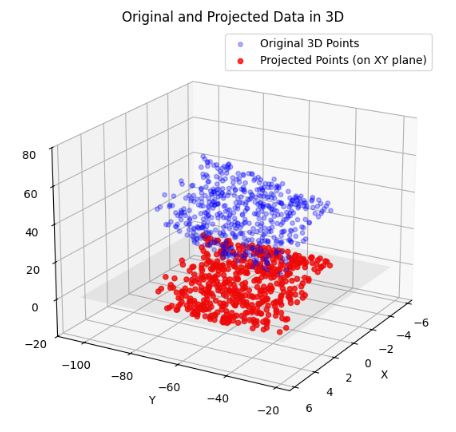

## 射影行列
**射影行列（Projection Matrix）** とは、一言で言えば **「高次元のデータを、特定の空間（地面や壁など）に『影』として落とし込む加工マシン」** のことです。

データ分析、3Dグラフィックス、統計学（最小二乗法）などで極めて重要な役割を果たします。


### 1. 射影行列のイメージ：光と影

3次元空間にある点（ベクトル $\mathbf{v}$）に、真上から光を当てて、床（2次元の平面）に影を落とす様子を想像してください。

* **元の点:** 3次元の自由な位置にある。
* **射影行列 :** 「真上から押しつぶす」という操作そのもの。
* **移された点 $P\mathbf{v}$ :** 床の上に張り付いた「影」。

### 2. 射影行列の数学的定義

行列 $P$ が射影行列であるためには、次の**決定的な性質**を満たす必要があります。

$$P^2 = P$$

__なぜ $$P^2 = P$$ なのか？__

「影をさらに影にしても、何も変わらない」からです。
1回  を掛けて床に影を落とした後、もう一度  を掛けても、その点はすでに床にいるので場所は変わりません。この **「何度やっても結果が同じ（べき等性）」** という性質が、射影の最大の特徴です。

### 3. 直交射影行列の作り方

特定のベクトル $\mathbf{a}$ 方向（1次元の線）に影を落とす射影行列 $P$ は、以下の式で作ることができます。

$$P = \frac{\mathbf{a}\mathbf{a}^T}{\mathbf{a}^T\mathbf{a}}$$

* **分母 $\mathbf{a}^T\mathbf{a}$ :** ベクトルの長さの2乗（正規化のための調整）。
* **分子 $\mathbf{a}\mathbf{a}^T$ :** 「列ベクトル × 行ベクトル」で作られる行列（外積）。

### 4. なぜ射影行列が必要なのか？（実務的な価値）

__A. 最小二乗法（統計学）__

データ分析で「誤差を最小にする直線」を引く際、実際には **「観測データ（高次元）を、モデルが表現できる空間（低次元）に射影する」** という計算を行っています。射影した点が、モデルにとって「最も近い（誤差が少ない）」点になるからです。

__B. データの次元圧縮（PCA）__

主成分分析（PCA）では、情報の損失を最小限に抑えながら、データを重要な軸の上に射影して次元を減らします。

__C. グラフィックス__

ゲームなどの3D空間を2Dのディスプレイに表示するとき、すべての頂点データに「透視投影（射影）」行列を掛けて、画面という「壁」に影を落としています。

__例題: Pythonによる可視化（例）__

ランダムにとった3Dの点群を、XY平面に射影するPythonコードを実装します。


```python
import numpy as np
import matplotlib.pyplot as plt
from mpl_toolkits.mplot3d import Axes3D

# --- 1. 3Dデータ（平面）の生成 ---
# 例として、y = 0.5x + 0.2z + 10 のような平面上の点を生成します
# ノイズを加えて、よりリアルなデータに見せます
np.random.seed(42) # 再現性のためのシード設定

# XとZの値をランダムに生成
num_points = 500
x_coords = np.random.uniform(-5, 5, num_points)
z_coords = np.random.uniform(30, 45, num_points)

# 平面の式に基づいてYの値を計算し、ノイズを加える
# 例: y = 2*x - 3*z + 50 + noise
y_coords = 2 * x_coords - 3 * z_coords + 50 + np.random.normal(0, 5, num_points)

# 3Dデータを結合 (Numpy array of shape (3, num_points))
original_3d_data = np.vstack((x_coords, y_coords, z_coords))

# --- 2. XY平面への射影行列の定義 ---
# XY平面への射影は、Z成分を0にする行列です。
# P = [[1, 0, 0],
#      [0, 1, 0],
#      [0, 0, 0]]
projection_matrix_xy = np.array([
    [1, 0, 0],
    [0, 1, 0],
    [0, 0, 0]
])

# --- 3. 射影の実行 ---
# 各3D点に射影行列を適用
projected_3d_data = projection_matrix_xy @ original_3d_data

# 射影後の2Dデータ（Z成分は0なので、XとY成分のみを抽出）
projected_2d_data = projected_3d_data[:2, :] # xとy座標のみ

# --- 4. 可視化 ---
fig = plt.figure(figsize=(18, 12))

# --- 4.1. 元の3Dデータを表示 ---
ax1 = fig.add_subplot(221, projection='3d')
ax1.scatter(original_3d_data[0], original_3d_data[1], original_3d_data[2], c='blue', alpha=0.6, s=15)
ax1.set_xlabel('X')
ax1.set_ylabel('Y')
ax1.set_zlabel('Z')
ax1.set_title('Original 3D Plane Data')
ax1.view_init(elev=20, azim=30) # 視点を調整して平面を見やすくする
ax1.set_zlim(-20, 80) # Z軸の範囲を調整

# --- 4.2. 射影後の2Dデータ（XY平面）を表示 ---
ax2 = fig.add_subplot(222)
ax2.scatter(projected_2d_data[0], projected_2d_data[1], c='red', alpha=0.7, s=15)
ax2.set_xlabel('X')
ax2.set_ylabel('Y')
ax2.set_title('Projected Data on XY Plane (2D View)')
ax2.grid(True)
ax2.set_aspect('equal', adjustable='box') # XY軸のスケールを合わせる

# --- 4.3. 元の3Dデータと射影後の3D表現を重ねて表示 ---
# 射影後のデータはZ=0の平面にあることを示すため、3Dプロットに表示
ax3 = fig.add_subplot(223, projection='3d')
ax3.scatter(original_3d_data[0], original_3d_data[1], original_3d_data[2], c='blue', alpha=0.3, s=15, label='Original 3D Points')
ax3.scatter(projected_3d_data[0], projected_3d_data[1], projected_3d_data[2], c='red', alpha=0.8, s=20, label='Projected Points (on XY plane)')

# XY平面を示すグリッド線を引く (Z=0の平面)
x_plane = np.linspace(ax3.get_xlim3d()[0], ax3.get_xlim3d()[1], 10)
y_plane = np.linspace(ax3.get_ylim3d()[0], ax3.get_ylim3d()[1], 10)
X_plane, Y_plane = np.meshgrid(x_plane, y_plane)
Z_plane = np.zeros_like(X_plane)
ax3.plot_surface(X_plane, Y_plane, Z_plane, color='gray', alpha=0.1, rstride=1, cstride=1)

ax3.set_xlabel('X')
ax3.set_ylabel('Y')
ax3.set_zlabel('Z')
ax3.set_title('Original and Projected Data in 3D')
ax3.legend()
ax3.view_init(elev=20, azim=30)
ax3.set_zlim(-20, 80)


# --- 4.4. 射影後の2Dデータを再度表示 (明確化のため) ---
ax4 = fig.add_subplot(224)
ax4.scatter(projected_2d_data[0], projected_2d_data[1], c='red', alpha=0.7, s=15)
ax4.set_xlabel('X')
ax4.set_ylabel('Y')
ax4.set_title('Projected Data on XY Plane (2D View Confirmed)')
ax4.grid(True)
ax4.set_aspect('equal', adjustable='box')


plt.tight_layout()
plt.show()
```

__結果__

上記コードを実行すると、以下のようなグラフが表示されます。

3次元空間の点群をXY平面（$z=0$）に射影する射影行列（Projection Matrix）を掛けた結果です。

$$P_{xy} = \begin{pmatrix}
1 & 0 & 0 \\
0 & 1 & 0 \\
0 & 0 & 0
\end{pmatrix}$$



