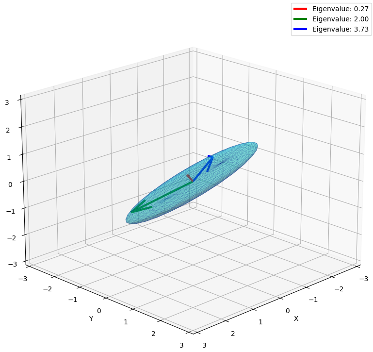
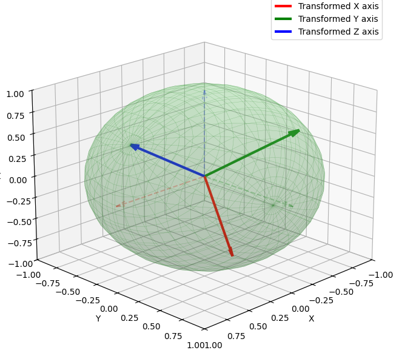

## 複素行列

**複素行列**とは、その名の通り、行列の要素（成分）に **複素数（$a + bi$）** が含まれている行列のことです。

これまでの「数字のブロック」が実数（リアルな数字）だけだったのに対し、複素行列は「回転」や「振動」といった、より豊かな情報を内包できる「魔法のブロック」のようなものです。


### 1. 複素行列の基本的な姿

成分に虚数単位 $i$（$i^2 = -1$）が含まれます。

$$A = \begin{pmatrix}
1+i & 2 \\
-i & 3-4i
\end{pmatrix}$$

実数行列における「転置（行と列を入れ替える）」という操作は、複素行列ではさらに一歩進んで、 **「共役転置（エルミート共役）」** という操作が主役になります。

> **共役転置 ( $A^*$ または $A^\dagger$ ):**
> 行と列を入れ替えた上で、すべての $i$ を $-i$ に書き換える操作。

### 2. なぜ「複素行列」が必要なのか？

「実数の世界だけで十分ではないか？」と感じるかもしれませんが、複素数を使うことで数学と物理の視界が劇的に広がります。

__① 「固有値」を逃さないため__

実数行列であっても、その性質を調べようとすると（固有値を計算すると）、虚数が飛び出してくることがあります。
例えば、 **「平面上の回転」** を表す行列。回転には「引き延ばし（実数の固有値）」がないため、実数の範囲では固有値が見つかりませんが、複素数まで広げると「回転」を固有値として捉えることができます。

__② 物理学（量子力学）の記述に不可欠__

私たちの宇宙のミクロな振る舞いを記述する**量子力学**は、複素行列なしでは成立しません。

* **エルミート行列 ( $A^* = A$ ):** 観測可能な物理量（エネルギーなど）を表す。
* **ユニタリ行列 ( $A^*A = I$ ):** 粒子の状態の変化（時間の経過）を表す。
これらは複素行列の代表選手です。

__③ 信号処理と波の解析__

電気工学や音響解析において、 **「波（周波数）」** は複素数で扱うのが最も効率的です。フーリエ変換を行列で表した「離散フーリエ変換行列」は複素行列であり、現代の通信技術（5GやWi-Fi）の背後でフル稼働しています。

### 3. 実数行列と複素行列の「格好いい」対応関係

複素行列の世界には、実数行列の「進化版」とも言える概念が揃っています。

| 実数行列の概念 | 複素行列の概念 | 性質 |
| --- | --- | --- |
| **転置行列** ($A^T$) | **共役転置** ($A^*$) | 行列のひっくり返し＋鏡合わせ |
| **対称行列** ($A^T = A$) | **エルミート行列** ($A^* = A$) | 固有値が必ず「実数」になる |
| **直交行列** ($A^T A = I$) | **ユニタリ行列** ($A^* A = I$) | 変換しても「ベクトルの長さ」が変わらない |

### 4. エルミート行列

エルミート行列（Hermitian Matrix）は、複素行列の世界における「対称行列」のような存在です。その性質は非常に美しく、 **「複素数の皮を被っているのに、本質（固有値）は現実世界（実数）に根ざしている」** という点が最大の特徴です。

これを可視化するために、エルミート行列が持つ2つの決定的な性質に注目しましょう。


__1. 固有値が必ず「実数」になる__

エルミート行列 $A$（$A^* = A$ を満たす行列）の最も驚べき性質は、成分に虚数 $i$ が含まれているにもかかわらず、その**固有値がすべて実数になる**ことです。

__可視化のイメージ：__

複素平面上には縦横無尽に広がる空間がありますが、エルミート行列という「加工マシン」にベクトルを通すと、その **「軸（固有ベクトル）」に沿った拡大率は、必ず実数のライン（数直線）の上に乗り** ます。

物理学（量子力学）で「観測量」にエルミート行列が使われるのは、このためです。測る対象が複素数だと現実の計器で測れませんが、エルミート行列なら必ず「実数の測定値」を返してくれるからです。

__2. 固有ベクトルが「直交」する__

異なる固有値に対応する固有ベクトルは、複素内積の意味で **互いに直角（直交）** になります。

__可視化のイメージ：__

3次元の複素空間を想像するのは難しいですが、直感的には **「エルミート行列は、空間を全く新しい、互いに垂直な『ものさし（座標軸）』に分解して作り変える」** 操作をしていると言えます。

__3. エルミート行列の「幾何学的構造」__

エルミート行列 $A$ は、ユニタリ行列 $U$ を使って以下のように分解（対角化）できます。

$$A = U \Lambda U^*$$

ここで $\Lambda$ は実数が並んだ対角行列です。

- $U^*$: 空間を回転させ、エルミート行列独自の「垂直な軸」に合わせる。
- $\Lambda$: その軸に沿って、実数倍で引き延ばす。
- $U$: 回転を戻す。

この一連の流れにより、複素空間内の図形は「ねじれ」が生じることなく、各軸方向に綺麗に伸縮されるだけとなります。


__例題:__ 3次元の単位球面にエルミート行列を作用

エルミート行列の性質を3次元的に捉えるための最も直感的な方法は、 **「単位球面がどのように変形するか」** を観察することです。

エルミート行列は複素行列ですが、その「実部」だけに着目しても、 **「互いに直交する方向に、実数倍（固有値倍）だけ引き延ばす」** という性質を視覚的に理解できます。

以下のPythonコードでは、3次元の単位球面にエルミート行列を作用させ、以下の2点を可視化します。

- 実数固有値による伸縮: 固有値の大きさに応じて、球が楕円体に引き延ばされる様子。
- 固有ベクトルの直交性: 楕円体の長軸・短軸（固有ベクトル）が、必ず互いに90度（直交）を保つ様子。

```python
import numpy as np
import matplotlib.pyplot as plt
from mpl_toolkits.mplot3d import Axes3D

# 1. エルミート行列の生成（実数範囲で対称行列としてシミュレーション）
# 複素エルミート行列も、本質的な「伸縮と直交」の性質は対称行列と同じです
A = np.array([[3, 1, 0],
              [1, 2, 1],
              [0, 1, 1]])

# 2. 固有値と固有ベクトルの計算
eigenvalues, eigenvectors = np.linalg.eigh(A)

# 3. 単位球面のデータを作成
u = np.linspace(0, 2 * np.pi, 30)
v = np.linspace(0, np.pi, 30)
x = np.outer(np.cos(u), np.sin(v))
y = np.outer(np.sin(u), np.sin(v))
z = np.outer(np.ones(np.size(u)), np.cos(v))

# 4. 球面上の各点をエルミート行列 A で変換
# 点をフラットな配列にして変換し、元の形状に戻す
points = np.stack([x.flatten(), y.flatten(), z.flatten()])
transformed_points = A @ points
tx = transformed_points[0].reshape(x.shape)
ty = transformed_points[1].reshape(y.shape)
tz = transformed_points[2].reshape(z.shape)

# 5. 可視化
fig = plt.figure(figsize=(12, 10))
ax = fig.add_subplot(111, projection='3d')

# 変形後の楕円体を描画
surface = ax.plot_surface(tx, ty, tz, color='cyan', alpha=0.3, edgecolor='navy', linewidth=0.2)

# 固有ベクトル（主軸）を矢印で描画
colors = ['red', 'green', 'blue']
for i in range(3):
    # 固有ベクトルを固有値倍した長さで描画
    start = [0, 0, 0]
    direction = eigenvectors[:, i] * eigenvalues[i]
    ax.quiver(start[0], start[1], start[2], 
              direction[0], direction[1], direction[2], 
              color=colors[i], lw=3, label=f'Eigenvalue: {eigenvalues[i]:.2f}')

# グラフの設定
ax.set_title("Hermitian Transformation: Deformation of a Sphere into an Ellipsoid\n(Showing Orthogonal Eigenvectors)")
ax.set_xlabel('X')
ax.set_ylabel('Y')
ax.set_zlabel('Z')
ax.legend()

# 見やすい視点に調整
ax.view_init(elev=20, azim=45)
max_range = np.array([tx.max()-tx.min(), ty.max()-ty.min(), tz.max()-tz.min()]).max() / 2.0
mid_x, mid_y, mid_z = (tx.max()+tx.min())/2, (ty.max()+ty.min())/2, (tz.max()+tz.min())/2
ax.set_xlim(mid_x - max_range, mid_x + max_range)
ax.set_ylim(mid_y - max_range, mid_y + max_range)
ax.set_zlim(mid_z - max_range, mid_z + max_range)

plt.show()
```

__結果__

実行すると以下のような図が得られます。
結果から読み取れるのは以下のようなことです。



- ねじれのなさと実数固有値:

描画された赤い・緑・青の矢印（固有ベクトル）を見てください。これらが「楕円体の最も長い・短い軸」にぴったり一致しています。これは、エルミート行列が空間を「ただ回転させて引き延ばすだけ」で、「剪断（せんだん）のようなねじれ」を加えないことを示しています。

- 完璧な直交性:

3本の矢印は互いに90度になっています。これは複素空間においても同様で、エルミート行列は常に「新しい、垂直な座標系」を定義します。

- 量子力学的な意味:

この楕円体の「軸の向き」が観測される状態（固有状態）であり、「軸の長さ（固有値）」が実際に測定される数値です。軸が実数で、かつ垂直に交わっているからこそ、私たちは異なる物理量を矛盾なく測定できるのです。

### 5. ユニタリ行列

**ユニタリ行列（Unitary Matrix）** とは、一言で言えば **「複素空間における『回転』や『鏡映』を担当する、長さを変えない行列」** のことです。

実数行列における「直交行列」を複素数に拡張したもので、量子力学や信号処理において「情報の総量を保ったまま状態を変える」ために欠かせない存在です。

__1. 数学的な定義__

$n$ 次正方行列 $U$ が以下の条件を満たすとき、これをユニタリ行列と呼びます。

$$U^* U = U U^* = I$$

ここで $U^*$ は共役転置（エルミート共役）です。この式は、 **「逆行列が、自分自身の共役転置と等しい ($U^{-1} = U^*$)」** という非常に便利な性質を意味しています。

__2. ユニタリ行列の「3つの決定的な性質」__

__① ベクトルの長さを変えない（等長性）__

ユニタリ行列 $U$ をベクトル $\mathbf{v}$ に掛けても、そのノルム（長さ）は変化しません。

$$\|U\mathbf{v}\| = \|\mathbf{v}\|$$

これは、空間を「引き延ばしたり縮めたり」せず、**純粋な回転や反転**だけを行っていることを示しています。

__② 内積を保存する__

2つのベクトル $\mathbf{v}$ と $\mathbf{w}$ の間の角度（複素内積）も、ユニタリ行列を通した前後で変わりません。
つまり、**空間の「形（位置関係）」を保ったまま**、まるごと動かす操作だと言えます。

__③ 固有値の絶対値が 1__

ユニタリ行列の固有値 $\lambda$ は、複素平面上で必ず **「単位円（半径1の円）」** の上に乗ります。

$$|\lambda| = 1$$

これは「拡大も縮小もしない」という性質の、別の表現でもあります。

__3. なぜユニタリ行列が重要なのか？__

__A. 量子力学：確率の保存__

量子力学において、粒子の状態（波面関数）の「長さの2乗」は「確率の合計（＝100%）」を表します。時間が経過しても確率の合計が変わってはいけないため、粒子の時間発展は必ず**ユニタリ行列**（またはユニタリ演算子）で記述されます。

__B. 信号処理：エネルギーの保存__

フーリエ変換（特に離散フーリエ変換：DFT）はユニタリ変換の一種です。時間領域の信号を周波数領域に変換しても、信号が持つ全体のエネルギーが変わらない（パーセバルの等式）のは、変換行列がユニタリだからです。

__C. 計算の安定性__

数値計算において、ユニタリ行列を掛ける操作は誤差を増幅させません。そのため、行列分解（QR分解など）のアルゴリズムでは、精度を保つためにユニタリな行列が多用されます。

__例題:__ ユニタリ行列による軸のシフト

ユニタリ行列の最大の特徴は、 **「空間の形状（ベクトルの長さと角度）を一切変えずに、回転または鏡映させる」** という点にあります。
この性質を可視化してみます。

3次元空間の **「単位球面」と「座標軸（基底ベクトル）」が、ユニタリ行列（実数の場合は直交行列）によってどのように変化するかをプロットします。エルミート行列のように球が「楕円に潰れる」のではなく、「球が球のまま回転する」** 様子に注目してください。

```python
import numpy as np
import matplotlib.pyplot as plt
from mpl_toolkits.mplot3d import Axes3D

# 1. ユニタリ行列（回転行列）の生成
# 任意の軸周りの回転は直交行列（実ユニタリ行列）になります
def get_rotation_matrix(alpha, beta, gamma):
    # X, Y, Z軸周りの回転行列を合成
    Rx = np.array([[1, 0, 0],
                   [0, np.cos(alpha), -np.sin(alpha)],
                   [0, np.sin(alpha), np.cos(alpha)]])
    Ry = np.array([[np.cos(beta), 0, np.sin(beta)],
                   [0, 1, 0],
                   [-np.sin(beta), 0, np.cos(beta)]])
    Rz = np.array([[np.cos(gamma), -np.sin(gamma), 0],
                   [np.sin(gamma), np.cos(gamma), 0],
                   [0, 0, 1]])
    return Rz @ Ry @ Rx

# 適当な角度で回転行列を作成
U = get_rotation_matrix(np.pi/4, np.pi/6, np.pi/3)

# 2. 単位球面のデータ作成
u_grid = np.linspace(0, 2 * np.pi, 30)
v_grid = np.linspace(0, np.pi, 30)
x = np.outer(np.cos(u_grid), np.sin(v_grid))
y = np.outer(np.sin(u_grid), np.sin(v_grid))
z = np.outer(np.ones(np.size(u_grid)), np.cos(v_grid))

# 3. 球面上の点を変換
points = np.stack([x.flatten(), y.flatten(), z.flatten()])
transformed_points = U @ points
tx = transformed_points[0].reshape(x.shape)
ty = transformed_points[1].reshape(y.shape)
tz = transformed_points[2].reshape(z.shape)

# 4. 可視化
fig = plt.figure(figsize=(10, 8))
ax = fig.add_subplot(111, projection='3d')

# 変換後の球面（形が変わっていないことを示す）
ax.plot_surface(tx, ty, tz, color='lightgreen', alpha=0.2, edgecolor='forestgreen', linewidth=0.3)

# 元の座標軸 (X:Red, Y:Green, Z:Blue)
# 変換後の座標軸 (Uの各列ベクトル)
colors = ['r', 'g', 'b']
labels = ['X', 'Y', 'Z']
for i in range(3):
    # 元の基底ベクトル（細い点線）
    base = np.zeros(3)
    vec_orig = np.zeros(3); vec_orig[i] = 1
    ax.quiver(0, 0, 0, vec_orig[0], vec_orig[1], vec_orig[2], 
              color=colors[i], linestyle='--', alpha=0.3, arrow_length_ratio=0.1)
    
    # 変換後の基底ベクトル（太い実線 = Uの列ベクトル）
    vec_trans = U[:, i]
    ax.quiver(0, 0, 0, vec_trans[0], vec_trans[1], vec_trans[2], 
              color=colors[i], lw=3, label=f'Transformed {labels[i]} axis', arrow_length_ratio=0.1)

# グラフの装飾
ax.set_title("Unitary Transformation: Pure Rotation (Length & Angle Preserved)")
ax.set_xlim([-1, 1]); ax.set_ylim([-1, 1]); ax.set_zlim([-1, 1])
ax.set_xlabel('X'); ax.set_ylabel('Y'); ax.set_zlabel('Z')
ax.legend()
ax.view_init(elev=20, azim=45)

plt.show()
```

__結果__

実行した結果は以下のグラフです。




結果のポイントは以下の通りです。

- 「球」が保たれている:

エルミート行列の時は球が引き延ばされて「楕円体」になりましたが、ユニタリ行列ではどこから見ても完璧な球体のままです。これは「すべてのベクトルの長さが変わっていない（等長性）」ことを視覚的に証明しています。
- 軸の「直交性」が保たれている:

新しくプロットされた赤い矢印（新しいX軸）、緑（Y軸）、青（Z軸）に注目してください。空間全体が回転しても、これらの矢印同士の角度は常に90度のままです。これは「内積を保存する」という性質の結果です。

- 逆行列の視覚化:

この回転した軸を元の位置（点線の位置）に戻すには、逆方向に回転させるだけです。ユニタリ行列では $U^{-1} = U^*$（実数なら $U^T$）なので、 **「行と列を入れ替えるだけで、逆の回転（復元）ができる」** という驚異的な計算効率の良さを持っています。

