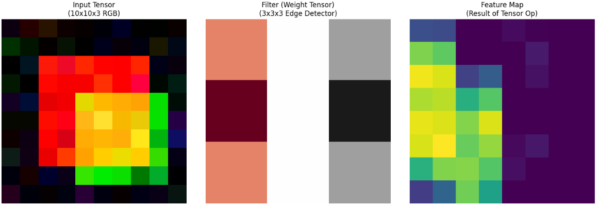

AIを使う場合、計算には必ずテンソルが使われています。
テンソルの計算は行列の和積を行っている、というニュアンスの説明されていることが多いと思います。

では、"テンソル"ってなんやねん？。
本日はそう思う読者に説明したい内容です。

## テンソルって何やねん

テンソルとは、一言で言えば **「スカラー、ベクトル、行列をすべて飲み込んだ、多次元配列の総称」** です。

データの「軸（次元）」がいくつあるかによって、呼び方が変わる階層構造だと考えると分かりやすいです。

テンソルは、その数値が並んでいる「方向（軸）の数」を階数と呼びます。

- 0階テンソル：スカラー (Scalar)

方向を持たない、ただの「数値」。

例：温度、質量。

- 1階テンソル：ベクトル (Vector)

1つの方向に並んだ「数値の列」。

例：風速（向きと強さ）、座標。

- 2階テンソル：行列 (Matrix)

縦と横の2つの軸を持つ「数値の表」。

例：線形写像、2次元画像の輝度値。

- 3階以上のテンソル：(Tensor)

奥行きや時間など、3つ以上の軸を持つ「数値の塊」。

例：カラー画像（縦×横×RGB）、動画（縦×横×色×時間）。

__なんぜ「行列」で止めずに「テンソル」と呼んでんねん__

単なる数字の箱としての側面に加え、数学や物理学では重要なルールがあります。

- 多方向への変化を一度に扱う:

例えば、スポンジをギュッと握ったとき、内部には「押す力」だけでなく「ねじれる力」が複雑に発生します。これを記述するには、1つの方向（ベクトル）では足りず、全方向の状態をセットにした「テンソル」が必要になります。

- 座標系に依存しない性質:

どの角度から眺めても、その物理的な本質（時空の歪みや応力など）が正しく伝わるように記述するルールが備わっています。

## テンソルと行列の関係
テンソルと行列の関係をひとことで言えば、 **「テンソルは、行列をさらに多次元へと拡張した概念」** です。

行列は「行と列」という2つの方向（軸）を持つ数値の広がりですが、テンソルは3つ、4つ、あるいはそれ以上の軸を持つことができます。


### 1. 階数による階層構造

テンソルは、その「軸（次元）の数」に応じて呼び方が変わります。数学やデータサイエンスでは、この軸の数を **「階数（Order / Rank）」** と呼びます。

- **0階テンソル：スカラー（Scalar）**
- 単一の数値（例：$5$）。方向を持ちません。


- **1階テンソル：ベクトル（Vector）**
- 数値の1次元的な並び（例：$[1, 2, 3]$）。1つの方向に軸を持ちます。


- **2階テンソル：行列（Matrix）**
- 数値の2次元的な広がり。縦（行）と横（列）の2つの軸を持ちます。


- **3階以上のテンソル：多次元配列（Tensor）**
- 行・列に加えて「奥行き」などが加わったもの。


### 2. 行列とテンソルの決定的な違い

行列とテンソルの関係を理解する上で重要なポイントは以下の2点です。

__① データの構造としての違い__

行列は平面的なデータ表ですが、3階以上のテンソルは「行列を積み重ねたブロック」のような構造になります。

- **例：カラー画像データ**
- 画像は「縦のピクセル」「横のピクセル」に加えて、色情報として「RGB（赤・緑・青）」の3つのチャンネルを持ちます。これは **(縦 $\times$ 横 $\times$ 3)** という**3階テンソル**として扱われます。


__② 座標変換のルールとしての違い（物理・数学的定義）__

単なる「数字の箱」ではなく、厳密な数学・物理学におけるテンソルには **「座標系を変えたときに、一定の規則に従って成分が変換される」** という性質が含まれます。

- 行列は「線形写像（ベクトルを別のベクトルへ飛ばす道具）」としての側面が強いです。
- テンソルは、より一般的に「空間の歪み（歪力テンソル）」や「物理量の広がり」を、どの視点から見ても一貫して記述するための道具です。

### 3. なぜ「テンソル」という言葉をよく聞くのか？

最近、AIやディープラーニングの文脈で「テンソル」という言葉が多用されるのは、Googleが開発したAIライブラリ **TensorFlow** などの影響が大きいです。

- **多次元データの処理:** AIは、大量の画像や動画、テキストデータを一括で処理します。これらは「(データの個数 $\times$ 縦 $\times$ 横 $\times$ 色)」といった多次元配列（テンソル）として扱うのが最も効率的なのです。
- **行列演算の拡張:** テンソル演算は、行列計算（線形代数）を多次元に拡張したものであり、現在のAI技術の数学的基盤となっています。

### 4. まとめ

- **行列** ＝ 2つの軸を持つ特別なテンソル。
- **テンソル** ＝ スカラー、ベクトル、行列をすべて包含する、多次元の数値データ構造の総称。

## 計算のルール

行列とテンソルの計算は一緒なのか。

結論から言うと、 **「行列の計算はテンソル計算の一部（特殊なケース）」** ですが、 **「テンソル計算＝行列計算」ではありません。**

行列は「2階のテンソル」に過ぎないため、3階以上のテンソルになると、行列計算にはなかった新しいルールや複雑さが加わります。

主な違いを3つのポイントで整理します。

### 1. 掛け算のパターンの激増

行列の掛け算は「行×列」の1パターンが基本ですが、テンソルの場合、 **「どの軸（次元）同士を掛け合わせるか」** を選択する必要があります。

- **行列（2階）:** 軸が2つ（行と列）しかないので、掛ける方向はほぼ決まっています。
- **3階テンソル:** 軸が3つ（縦・横・奥行き）あります。「Aの奥行き」と「Bの縦」を掛けるのか、「Aの横」と「Bの奥行き」を掛けるのかなど、組み合わせが自由になります。これを数学的には **「縮約（Contraction）」** と呼びます。

### 2. 「行列の積」を拡張した「テンソル積」

行列同士の掛け算は、結果としてまた「行列」になりますが、テンソルの世界には **テンソル積（外積の拡張）** という計算があります。

- **次元が増える:** ベクトル（1階）とベクトル（1階）をテンソル積で計算すると、行列（2階）が生まれます。行列とベクトルを掛け合わせると3階テンソルになります。
- 計算するほどに「データの次元（階数）」が積み上がっていくのが、行列計算にはない特徴です。

### 3. 分解の難しさ（逆行列や固有値の不在）

行列計算で当たり前に使っていた道具が、3階以上のテンソルではそのまま使えません。

- **逆行列がない:** 「逆テンソル」という概念は、行列のように単純には定義できません。
- **固有値問題:** 行列の固有値は一意に決まるなど美しい性質がありますが、テンソルの「固有値」は定義の仕方が複数あり、計算も非常に困難（NP困難）になることが知られています。

### 4. なぜ「行列計算」として扱われることが多いのか？

プログラミング（PythonのNumPyやPyTorchなど）の世界では、テンソルを計算する際に **「行列に無理やり平坦化（Unfolding / Flattening）」** して処理することがよくあります。

- 3階のブロック状のデータを、薄くスライスして並べ直し、巨大な「行列」として扱うことで、既存の高速な行列計算アルゴリズムを使い回しているのです。

__例題:__ テンソル計算

ここまで説明してきたところで、テンソル計算を見てみます。

例題として、AIの計算（ディープラーニング）における最も基本的な演算である、 **「畳み込み（Convolution）」** を扱います。

今回は、カラー画像（3階テンソル：縦 $\times$ 横 $\times$ RGB）に対して、AIが「特徴」を抽出する際の畳み込み演算を模したコードを作成します。

このコードでは、3チャンネル（RGB）の入力テンソルに対して、フィルター（重みテンソル）を適用し、1枚の特徴マップを出力する様子をシミュレーションします。

```python

import numpy as np
import matplotlib.pyplot as plt

def simulate_ai_convolution():
    # 1. 入力テンソルの作成 (縦10x横10x3チャンネル)
    # 簡易的に、RGBそれぞれの色を持つ画像を作成
    np.random.seed(42)
    input_tensor = np.zeros((10, 10, 3))
    input_tensor[2:8, 2:8, 0] = 1.0  # 赤い四角
    input_tensor[4:9, 4:9, 1] = 0.8  # 緑の四角
    input_tensor += np.random.normal(0, 0.1, input_tensor.shape) # ノイズ
    input_tensor = np.clip(input_tensor, 0, 1)

    # 2. フィルター（重みテンソル）の作成 (3x3x3)
    # 「縦のエッジ（境界線）」に反応するフィルターを想定
    kernel = np.array([
        [[-1, 0, 1], [-2, 0, 2], [-1, 0, 1]], # R用
        [[-1, 0, 1], [-2, 0, 2], [-1, 0, 1]], # G用
        [[-1, 0, 1], [-2, 0, 2], [-1, 0, 1]]  # B用
    ]).transpose(1, 2, 0)

    # 3. 畳み込み演算（テンソルの内積をスライドさせながら計算）
    h, w, c = input_tensor.shape
    output_map = np.zeros((h-2, w-2))

    for i in range(h-2):
        for j in range(w-2):
            # 3x3x3の局所領域を切り出し
            region = input_tensor[i:i+3, j:j+3, :]
            # 要素ごとの積の総和（テンソル収縮の一種）
            output_map[i, j] = np.sum(region * kernel)

    # 4. 活性化関数（ReLU: 負の値を0にする）
    output_map = np.maximum(0, output_map)

    # --- 可視化 ---
    fig, axes = plt.subplots(1, 3, figsize=(15, 5))

    # 入力テンソル (3階テンソルを画像として表示)
    axes[0].imshow(input_tensor)
    axes[0].set_title("Input Tensor\n(10x10x3 RGB)")

    # フィルター (各チャンネルの重み)
    axes[1].imshow(kernel[:,:,0], cmap='RdGy')
    axes[1].set_title("Filter (Weight Tensor)\n(3x3x3 Edge Detector)")

    # 出力 (演算結果)
    axes[2].imshow(output_map, cmap='viridis')
    axes[2].set_title("Feature Map\n(Result of Tensor Op)")

    for ax in axes: ax.axis('off')
    plt.tight_layout()
    plt.show()

simulate_ai_convolution()
```

__結果__

コードを実行すると以下が得られます。

**「3つの次元（縦・横・チャンネル）をバラバラにせず、一つの『塊（ブロック）』として同時に畳み込んでいる点」** がテンソル計算の肝です。

行列計算は通常、2つの軸（行と列）で行われます。しかし、先ほどのAIの計算では以下の3つの軸が同時に絡み合っています。

- 軸1： 画像の縦方向 ($H$)
- 軸2： 画像の横方向 ($W$)
- 軸3： 色のチャンネル方向 ($C$)



__行列計算」との決定的な違い__

もしこれが行列計算（2次元）であれば、以下のような手順になります。

- R（赤）の行列を計算する
- G（緑）の行列を計算する
- B（青）の行列を計算する
- 最後にそれらを足す

しかし、テンソル計算（AIの内部処理）では、「赤の左上、緑の左上、青の左上……」という情報を一つの多次元配列として保持し、一気に計算します。

__この計算の「テンソル的」なポイント__

- 3階テンソル $\times$ 3階テンソル:

入力データ（$10 \times 10 \times 3$）に対して、フィルター（$3 \times 3 \times 3$）をぶつけています。これは、各色の情報をバラバラに計算するのではなく、「色と空間の広がり」を同時に1つの塊（テンソル）として処理しているのがAIの特徴です。

- テンソル収縮 (Contraction):
 
コード内の np.sum(region * kernel) は、対応する要素同士を掛けてすべて足し合わせる操作です。これにより、高次元（3階）のデータから、その場所の特徴を表す低次元（スカラー）が抽出されます。

- 非線形変換:

最後に maximum(0, output_map) （ReLU関数）を適用しています。これは、ただの行列計算（線形代数）では不可能な「複雑な判断」をAIにさせるための重要なステップです。

## 総括

ここまでテンソルについて説明してきました。
これまでの「テンソルの概念」から「AIでの実用」までの話を、体系的に整理してまとめます。

__なぜ「行列」ではなく「テンソル」が必要なのか__

行列（2階）は平面的なデータの処理には適していますが、現実世界やAIのデータはより複雑です。

* **多面的な情報の保持:** カラー画像（縦・横・RGB）や動画（縦・横・色・時間）のように、複数の属性を**一つの塊**として保持したまま計算するため。
* **次元間の相互作用:** 「赤色のエッジ」や「時間の経過に伴う動き」など、異なる軸（次元）にまたがる特徴を同時に抽出するため。
* **座標変換の普遍性:** 物理学においては、観測者の視点（座標系）が変わっても、物理法則が変わらないように記述する「共通の言語」として機能します。

__AI計算における実態__

AI（ディープラーニング）における計算は、本質的に **「高階テンソルの変形と圧縮」** です。

* **畳み込み（Convolution）:** 入力テンソルにフィルター（重みテンソル）をぶつけ、多次元の情報を凝縮して重要な特徴を取り出す。
* **テンソル収縮:** 特定の軸に沿って積和をとることで、膨大なデータから意味のある数値へと階数を落としていく。
* **バッチ処理:** 実際のAIは「画像の枚数」という軸も加えた**4階テンソル**などでデータを一括処理し、計算効率を極限まで高めています。

__行列計算との関係性__

* **包含関係:** 行列計算は、テンソル計算における「2次元限定の特殊ケース」です。
* **実装上の工夫:** コンピュータ内部では、複雑なテンソルをあえて巨大な行列に並べ替えて（展開/Flattening）、既存の高速な行列計算アルゴリズムを利用して処理することが一般的です。


最期にニューラルネットワークの計算や原理を学習するための書籍について紹介させて下さい。
テンソルを用いてデータの塊を処理するロジックについて基礎から説明しています。
ご参考下さい。

<div class="shop-card">
    <div class="shop-card-image">
        
    </div>
    <div class="shop-card-content">
        <div class="shop-card-title">テンソルネットワーク入門</div>
        <div class="shop-card-description">画像認識などの情報処理、数値解析、ニューラルネットワーク、量子コンピューター、半導体といった様々な分野に跨って活躍しているテンソルネットワークを基礎からていねいに解説する。身近な問題から始めて、テンソルの計算手法の基礎を解説し、画像認識や量子物理の例を用いて、少しずつ理解を深めていく。物理系・情報系の入門者に最適の一冊。</div>
        <div class="shop-card-link">
            <a href="https://www.amazon.co.jp/%E3%83%86%E3%83%B3%E3%82%BD%E3%83%AB%E3%83%8D%E3%83%83%E3%83%88%E3%83%AF%E3%83%BC%E3%82%AF%E5%85%A5%E9%96%80-KS%E6%83%85%E5%A0%B1%E7%A7%91%E5%AD%A6%E5%B0%82%E9%96%80%E6%9B%B8-%E8%A5%BF%E9%87%8E-%E5%8F%8B%E5%B9%B4/dp/4065316537?__mk_ja_JP=%E3%82%AB%E3%82%BF%E3%82%AB%E3%83%8A&crid=ZLVVO7R1M2V5&dib=eyJ2IjoiMSJ9.qoUTkdh1JKnxLiLnc8mUlKcyQNLNa1CYKbLA77c--nx6mo34tXpg2hIL-6VLPgTsm2CeGp6Xifw-g9M5zypwsOdv2DummV2DsNRhXgc0St0.1V86iEGX1556rV6IQGFe6QDijAR_EK_jt8TxbEj4rMs&dib_tag=se&keywords=%E3%83%86%E3%83%B3%E3%82%BD%E3%83%AB+%E3%83%8B%E3%83%A5%E3%83%BC%E3%83%A9%E3%83%AB%E3%83%8D%E3%83%83%E3%83%88%E3%83%AF%E3%83%BC%E3%82%AF&qid=1772268292&sprefix=%E3%83%86%E3%83%B3%E3%82%BD%E3%83%AB+%E3%83%8B%E3%83%A5%E3%83%BC%E3%83%A9%E3%83%AB%E3%83%8D%E3%83%83%E3%83%88%E3%83%AF%E3%83%BC%E3%82%AF%2Caps%2C171&sr=8-1&linkCode=ll2&tag=yoshishinnze-22&linkId=dd7d2d77c5f30fbf68c3ba9b17fd2914&ref_=as_li_ss_tl" target="_blank" rel="noopener">Amazonで詳細を見る</a>
        </div>
    </div>
</div>

