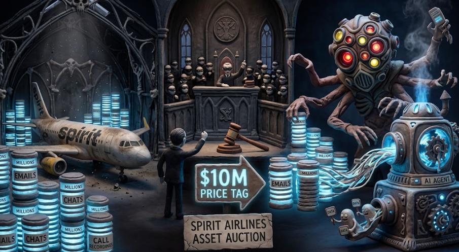

AI関連のニュースを見ていると2026年に経営破綻した航空会社スピリット航空の社内データ資産がオークションにかけられてGoogleが1,000万ドルで購入を提案したというニュースが出ていました。

機密を含むデータ資産が売りに出されたという驚きと、買い手がついたことが個人的に驚いたため記事とします。

## ニュース概要

まずは、このニュースの概要についてです。
以下の通りとありました。

**Googleが破綻したスピリット航空の社内データを約16億円で落札**

- **対象**: 2026年5月に全運航を停止し破綻した米格安航空会社スピリット航空（Spirit Airlines）の社内データ資産
- **落札額**: 1,000万ドル（約16億円）
- **データ内容**: メール約1億件、Microsoft Teamsのメッセージ約5億件、ソースコード約3,000万行、カスタマーサービス通話録音3,000万件超、運航記録など。34年分の業務記録が丸ごと対象となっています。
- **目的**: GoogleはこのデータをAIモデルの学習・製品開発に活用する計画です。特に、実際の業務をこなすAIエージェントの学習データとして価値があると見られています。
- **注意点**: 乗客約9,750万人分の個人情報は対象外であり、第三者による匿名化処理が条件となっています。ただし、従業員組合などからプライバシー侵害を懸念した異議申し立ても行われています。

この取引は「会社が倒産しても、従業員が生み出したデジタルデータがAI企業に買収される」という新たな問題を浮き彫りにしており、業務用メールやチャットの帰属権・プライバシー保護について議論を呼んでいます。

## 誰がデータをなぜ売りに？

社内のデータが売りに出された理由と、売りに出した主体については以下の通りのようです。

**なぜ売りに出されたのか**

スピリット航空は2026年5月2日に全運航を停止し、経営破綻（倒産）しました。同社は2024年11月に米連邦破産法11章（チャプター11）を申請して経営再建を試みていましたが、中東情勢の悪化によるジェット燃料価格の高騰（想定の約2倍に跳ね上がった）により財務状況がさらに悪化し、事業継続が困難となりました。米政府による救済もまとまらず、追加資金の調達もできなかったため、最終的に清算（残存資産を売却して債権者に弁済する手続き）に向かうことになりました。その一環として、航空機や設備などの物理的資産と同様に、長年の業務で蓄積された社内データも「資産」として競売にかけられたのです。

**誰が売りに出したのか**

売りに出したのは、スピリット航空の持株会社である **Spirit Aviation Holdings, Inc.** およびその関連会社（グループ各社）です。破産手続きにおいて、同社は「債務者（Debtors）」として、ニューヨーク南部連邦破産裁判所の監督の下、債権者への返済資金を捻出するために保有する資産を売却しました。データ資産の売却も、この破産財団の資産処分プロセスの一環として行われました。

## 1000万円は安い？高い？

関連記事を見ている限り、1000万ドルという金額については、**「安すぎる」という驚きと、「社内データが資産としてこのように売買される」という象徴的な驚き**の両面があると捉えられているようです。

**データの量から見れば「破格に安い」**

含まれるデータはメール約1億件、Microsoft Teamsのメッセージ約5億件、ソースコード約3,000万行、通話録音3,000万件超、34年分の業務記録です。AI学習用の実業務データとしてこの規模のものが、わずか1000万ドル（約16億円）で手に入るのは、市場価値から見れば非常に安価です。実際、海外メディアのTom's Hardwareは[**just $10 million**（わずか1000万ドルで）」という表現を用いて報じています](https://www.tomshardware.com/tech-industry/artificial-intelligence/google-buys-spirit-airlines-data-for-ai-training-for-just-usd10-million-purchase-includes-hundreds-of-millions-of-emails-microsoft-teams-chats-billions-of-flight-pricing-records-and-anonymized-passenger-records)。

**実質的なコストはさらに高い**

ただし、1000万ドルはあくまで落札額であり、データをAI学習に使えるようにするための**匿名化処理の費用はGoogleが別途負担**しています。[匿名化を担当する企業（Mercor）の選定と費用支払いもGoogleが行っており、実質的な総コストは1000万ドルを上回ります。](https://thenextweb.com/news/google-spirit-airlines-data-10m-bankruptcy-auction-mercor)

**「激しい入札合戦」を制した金額**

安価に見えても、他の企業もこのデータを欲しがっていました。AIスタートアップのMicro1なども入札しており、[Business Insiderの報道では「**激しい入札合戦を制した**」とされています。つまり市場としては一定の価値を認めていた金額です。](https://www.businessinsider.jp/article/2608-google-spirit-airlines-data-reminder-work-emails-arent-yours/)

**まとめると**

- **驚きの側面①**: 1億件のメールや5億件のチャットなど、会社まるごとのデジタル資産が1000万ドルで売買されたこと自体、従業員のプライバシー観点から衝撃的です。
- **驚きの側面②**: 逆に、それだけの膨大な実務データがこの価格で収集できるのは、AI企業にとって「お買い得」であり、今後同様の破産企業データが標的になる可能性を示唆しています。

ある調査会社は「**破産した航空会社のメールが、航空機本体より価値がある**」と評するほど、デジタルデータが[AI時代の新たな資産クラスとして浮上していることを示す](https://www.ainvest.com/news/bankrupt-airline-emails-worth-planes-2608/)出来事です。

## このデータの価値

では売りに出されたこのデータの価値とは何でしょう？
ずばり、インターネット上の公開データには存在しない、**「実際の企業がどう動いているか」という生の業務記録**が、このデータの最大の価値です。

以下、GoogleのようなAI開発企業にとっての具体的なメリットをご説明いたします。

**1. 企業の「実際の動き」の設計図になる**

インターネット上のデータは、公開された情報や一般知識が中心です。一方、社内メール1億件やTeamsチャット5億件には、**実際の業務判断、交渉、トラブル対応、意思決定のプロセス**がそのまま記録されています。専門家はこのデータ群を「企業がどう運営されているかの設計図（blueprint for how companies operate）」と評価しています。[Inc](https://www.inc.com/moses-jeanfrancois/google-spirit-airlines-data-is-not-getting-97-million-passenger-profiles/91392143)

**2. AIエージェントの学習に最適**

現在のAI開発の重要な課題は、単に「知識」を持たせることではなく、**「実際の仕事をこなせるAI（AIエージェント）」** を作ることです。社内データには「問題が起きたときに誰が誰に連絡し、どう解決したか」という実務の流れが詰まっており、AIが「企業の中で実際に働く」ための学習材料として非常に価値があります。[Fast Company](https://www.fastcompany.com/91593881/why-spirit-airlines-internal-data-has-become-a-hot-commodity-for-ai-companies)

**3. 業界特化型AIの構築が可能**

航空業界特有の業務（運航管理、整備スケジュール、価格設定、カスタマーサービス対応など）の実データが含まれています。これにより、**航空業界に特化したAIモデル**を構築できる可能性があります。業界ごとの専門的な実務データは、インターネット上ではほとんど公開されていません。[Constellation Research](https://www.constellationr.com/insights/news/why-googles-purchase-spirit-airlines-data-matters)

**4. 高品質な実務データは「枯渇」している**

AI企業は現在、学習用の高品質なデータ不足に直面しています。インターネット上の公開データは量はあっても質が不均一です。一方、企業の社内データは**長年の実務を通じて検証された、文脈を持った高品質なデータ**です。Business Insiderは「AIはデータのジレンマに直面しており、必要としているのはあなたの助けではなく、あなたのメールや社内メッセージなのだ」と報じています。[Business Insider](https://www.businessinsider.com/ai-work-data-price-ai-training-google-spirit-airlines-2026-8)

**5. 非公式な知識や「生の対応」が学べる**

社内チャットやメールには、マニュアル化されていない現場の知恵、緊急時の対応、部門間の調整など、**公式ドキュメントには残らない「生の業務知識」**が含まれます。これは公開データでは絶対に得られない情報です。

まとめると、このデータの価値は「量」ではなく「質」と「希少性」にあります。34年分の航空会社の「生きた業務記録」は、インターネット上には存在しない、**実世界の企業運営をAIに教えるための貴重な教材**と言えるわけです。
このデータを独占利用できる、ということに価値があるわけです。

## ニュースが持つ影響

このニュースがもし連続して起きるようであれば社会に対しても影響を及ぼすことになるでしょう。
そして、社会に与える影響は、**プライバシー、労働者の権利、法制度、企業のデータ管理、AI産業の構造**など多岐にわたります。以下、主要な論点を整理いたします。

### 1. 従業員のプライバシーと「業務データの帰属権」問題

最大の社会的影響は、**「従業員が職場で生み出したデジタルデータは誰のものか」** という根本的な問いを突きつけたことです。

スピリット航空の客室乗務員組合（AFA-CWA）は、裁判所に対して「数十年分の給与記録、勤怠管理、研修記録、採用記録、メール、SharePoint、Teams情報など、**雇用と職場の記録のほぼ全て**が移転される」と異議を申し立てました。[AFA-CWA](https://afacwa.org/spirit-objection-sale-your-data/) 組合は、匿名化処理が不完全な場合、小規模な従業員集団では「名前言及だけでなく、文脈から個人を特定できる」と指摘しています。[Tech Times](https://www.techtimes.com/articles/324994/20260819/google-gets-spirit-airlines-600-million-worker-records-under-1978-law-built-factories.htm)

Bloomberg Lawは、この取引が「**従業員保護の大きな隙間（gaps in employee protections）** を露呈させた」と報じています。[Bloomberg Law](https://news.bloomberglaw.com/bankruptcy-law/spirit-data-sale-to-google-shows-gaps-in-employee-protections)

**社会への影響**: 今後、就労時のデータ利用同意や、退職・倒産時のデータ取り扱いに関する労働条件交渉が重要な争点になる可能性があります。

### 2. 破産法とデータ資産化の「時代錯誤」

この取引が可能になった法的背景には、**1978年に制定された米国連邦破産法**があります。この法律は、主に工場や物理的資産の清算を想定して作られており、デジタルデータ資産の取り扱いについてはほとんど規定がありません。[Tech Times](https://www.techtimes.com/articles/324994/20260819/google-gets-spirit-airlines-600-million-worker-records-under-1978-law-built-factories.htm)

つまり、航空機や不動産と同じ「資産」として社内データが売却されたのは、**法制度がデジタル時代に追いついていない**ためです。

**社会への影響**: 各国で「破産した企業のデジタルデータはどう扱うべきか」という法改正や議論が活発化する可能性があります。日本でも他人事ではなく、倒産企業のデータ資産の帰属や取り扱いについて議論が必要になるかもしれません。

### 3. AI企業による「実務データ」収集競争の激化

このニュースは、AI開発企業にとって **「インターネット上の公開データでは足りない」** という現実を象徴しています。Business Insiderは「AI企業は職場関連のデータに飢えている（desperate for your work-related data）」と表現しています。[Business Insider](https://www.businessinsider.com/ai-work-data-price-ai-training-google-spirit-airlines-2026-8)

**社会への影響**:
- 今後、破産企業だけでなく、**M&Aや事業譲渡を経由した社内データの売買**が増える可能性があります。
- 企業が「データをAI学習用に貯蔵・整理する」ことが経営戦略の一つになるかもしれません。
- 一方で、従業員や顧客の同意なしにデータが二次利用されることへの不信感が拡大し、企業と個人の間の信頼関係を損なうリスクもあります。

### 4. 企業のデータ管理・セキュリティ意識の変化

従業員にとっては、「業務で書いたメールやチャットが、10年後にAIの学習教材になる」という認識が広まるでしょう。Business Insiderは「**業務用メールはあなた自身のものではない**」という厳しい現実を伝える出来事だと報じています。[Business Insider Japan](https://www.businessinsider.jp/article/2608-google-spirit-airlines-data-reminder-work-emails-arent-yours/)

**社会への影響**:
- 従業員が業務コミュニケーションを控えるようになり、**組織の知見共有が妨げられる**可能性もあります。
- 企業は「データの保存期間」「匿名化の基準」「破産時のデータ削除義務」などを社内規程に明記する必要が出てくるでしょう。
- 日本でも、生成AIへの個人情報・機密情報入力に関する社内ルール整備が進んでいますが、この事例を受けて「**退職後・倒産後のデータの行方**」も規程に盛り込む動きが出ると考えられます。[Business & Law](https://businessandlaw.jp/articles/a20260414-1/)

### 5. 業界特化型AIの開発加速（ポジティブ側面）

否定的な側面ばかりではありません。このデータを活用することで、**航空業界に特化したAIエージェント**が開発され、運航管理や整備スケジュール、カスタマーサービスなどの業務効率化に貢献する可能性があります。[Constellation Research](https://www.constellationr.com/insights/news/why-googles-purchase-spirit-airlines-data-matters)

**社会への影響**:
- 医療、法律、金融など他の業界でも、同様の「実務データ」を使った**業界特化型AI（垂直型AI）**の開発が加速するかもしれません。
- ただし、その際にも「データはどこから来たのか」「誰の同意を得たのか」という透明性が求められます。

### 6. 匿名化技術とその信頼性の問い

この取引では「匿名化されたデータ」という条件が付いていますが、Googleが匿名化企業（Mercor）を選定し、その費用も負担していることから、**匿名化の基準と品質保証を誰が監視するのか**という問題が浮上しています。[The Next Web](https://thenextweb.com/news/google-spirit-airlines-data-10m-bankruptcy-auction-mercor)

**社会への影響**: 「匿名化＝プライバシー保護」という単純な図式は見直され、**「再識別リスク（文脈から個人を特定できるリスク）」** をどう評価・管理するかが、技術的・倫理的な重要課題になります。

## 総括

今回のこのニュースの本質は、以下の3つの問いに集約されと考えています。

### 1. 「会社がなくなっても、あなたのメールは生き残る」

企業が破綻すると、航空機や不動産と同じように社内データも「資産」として売却されます。従業員が日々書いたメールやチャットは、本人の意図とは無関係に、AI企業の学習材料として流通する時代が来たということです。つまり、**デジタルデータは企業より長生きし、二次的に「値札」を付けられる資産になった**という現実が浮き彫りになりました。

### 2. AIは「知識」ではなく「生きた業務の流れ」を欲しがっている

Googleがこのデータを買ったのは、インターネット上の公開情報では得られない、**「実際の企業がどう動くか」という生の業務記録**が必要だからです。メール1億件やTeamsチャット5億件には、トラブル時の対応、部門間の調整、意思決定のプロセスなど、マニュアル化されない「現場の知恵」が詰まっています。AI企業にとって、これは「実際に働けるAIエージェント」を育てるための貴重な教材です。

### 3. 法と倫理が、デジタル資産の速度に追いついていない

この取引が可能になった背景には、**1978年制定の破産法**があり、デジタルデータの取り扱いをほとんど想定していません。「匿名化すれば安全」という前提も、小規模な従業員集団では文脈から個人を特定できる「再識別リスク」を孕んでいます。従業員組合の異議申し立ては、**「業務データの帰属権は誰にあるのか」** という、労働・プライバシー・法制度の未整備を突いたものです。

### 一言で言えば

> **「AI時代において、企業の中で生まれた人間の業務記録が、企業自体よりも価値ある『資産』になりつつある。しかし、それを生み出した人々の権利を守る仕組みは、まだ存在しない。」**

これが、このニュースが私たちに突きつけた本質です。
活動した経緯・記録そのものが現在間違いなく価値になっているということを認識させられるニュースでした。
