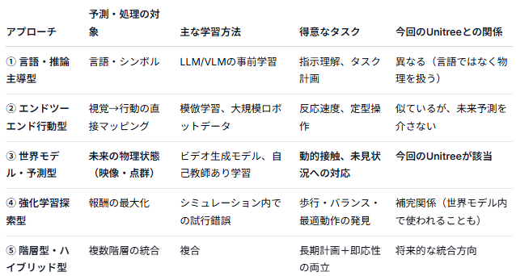

9/11に中国のロボット開発企業で完全自律で格闘技を披露するロボットがニュースリリースされていました。
ヒューマンのウェイトを上回る対戦相手だったようですが、見事な公開スパーリングでした。
この内容を見てフィジカルAI関係の妄想を膨らませていこうと思います。

## ニュース概要
冒頭に申し上げたニュースについてです。
中国のロボット開発企業 **Unitree（宇樹科技）** が、**完全自律動作で人間と格闘する人型ロボットのデモ動画**を公開したというニュースです。
動画もあるので是非ご覧ください。

<iframe width="1454" height="818" src="https://www.youtube.com/embed/8EtORVQj41w" title="Unitree Humanoid Robots Can Now Fight Fully Autonomously" frameborder="0" allow="accelerometer; autoplay; clipboard-write; encrypted-media; gyroscope; picture-in-picture; web-share" referrerpolicy="strict-origin-when-cross-origin" allowfullscreen></iframe>

### 記事の概要

- **公開日**: 2026年9月7日
- **使用ロボット**: Unitree の人型ロボット「G1」
- **AIモデル**: 独自の世界モデル（World Model）を活用したロボット向けAI **「UnifoLM-X2-1.0」**

### 技術的なポイント

このデモの最大の特徴は、**「完全自律」** です。従来の遠隔操作や事前にプログラムされた動作ではなく、AIがリアルタイムで状況を判断しています。

- **世界モデルによる未来予測**: UnifoLM-X2-1.0 は、物理空間を理解・予測する世界モデルを活用し、**リアルタイムに未来の状況を予測**しながら行動を計画します。
- **動的インタラクション**: 人間との激しい動きや接触を伴う動作を、自律的に制御しています。
- **基盤モデル**: オープンソースのビデオ拡散世界モデル「UnifoLM-WMA-0」をベースに、行動予測用のヘッドを追加した構成です。

### デモの内容

動画では、両手にグローブを装着した人型ロボット「G1」が、リング上で人間とスパーリング（実戦練習）を行っています。ステップや姿勢の切り替えで二足歩行を保ちながら、パンチやキックなどの格闘動作を自律的に実行している様子が映し出されています。

### クレーム

Unitree は、この成果が **「世界モデル駆動型の人型ロボットの大規模展開・導入の実現可能性を検証した」** ものであるとしています。世界モデルとロボット本体の制御能力が統合されることで、事前設定された動作に依存しない、より柔軟で自律的なロボットの実用化に向けた重要な一歩として位置づけられています。

## このロボットの正体

このロボットのAIは、やはりLLMなのか？という疑問がわきます。

結論から申し上げると、このロボットに用いられている AI は **LLM（大規模言語モデル）ベースではなさそう**です。代わりに、**ビデオ拡散世界モデル（Video Diffusion World Model）に行動予測用のヘッドを追加した「World Model」アプローチ**を採用しています。

### なぜ LLM ベースではないか

記事や関連報道では「世界モデル（World Model）」と明記されており、言語処理ではなく**物理空間の理解と予測**が中心となっています。具体的には、オープンソースの **UnifoLM-WMA-0** という「ビデオ拡散世界モデル（video-diffusion world model）」を基盤とし、そこに行動を出力する Action Head を追加した構成です。([AlphaSignal](https://alphasignal.ai/news/unitree-s-unifolm-x2-1-0-lets-humanoid-robots-fight-with-no-human-control))

LLM が主にテキストのトークン列を処理するのに対し、このモデルは**映像（ビデオフレーム）の時系列**を処理し、未来の物理状態を生成・予測します。

### World Model で学習した内容の想定

ビデオ拡散世界モデル＋行動ヘッドという構成から、以下の内容を学習していると考えられます。

**1. 物理空間のダイナミクス（物理法則の暗黙的理解）**
- 重力、慣性、接触、衝突などの物理的な因果関係
- 自らのパンチやキックが相手や環境に与える影響
- 二足歩行の姿勢制御における重心移動と安定性

**2. 人間（対戦相手）の動きの予測**
- 相手のステップ、パンチ、ガードなどの動作パターンの予測
- 過去の数フレームから次の数フレームへの動きの推定
- 人間の意図や戦略ではなく、**動きの軌道・姿勢変化の時系列パターン**

**3. 自らの行動と未来状態の関係（行動結果の予測）**
- 「今この動作をしたら、0.5秒後の自分の位置と相手の反応はどうなるか」
- 行動選択とその結果としての未来フレームの生成を対にして学習
- これにより、リアルタイムで「この行動を取れば有利な未来が来る」という判断が可能になる

**4. 接触を伴う動的インタラクション**
- グローブ同士の接触、体のぶつかり合いなど、複雑な接触ダイナミクス
- 単なる軌道予測ではなく、力の加わり方による状態変化の予測

### LLM との違いを一言で

つまり、LLM が「言葉で考える」モデルであるのに対し、UnifoLM-X2-1.0 は **「映像で物理世界を予測しながら行動する」モデル** です。近年のロボティクス分野では、このような World Model アプローチが、事前にプログラムされた動作や単純な模倣学習よりも、未見の状況への適応力が高いとして注目されています。

## フィジカルAIの大別
今回のロボットに使われるAIにはどんな大別、派閥があるのでしょうか？
現在のフィジカルAIは、**「何を予測し、どう行動を決めるか」** という観点から、大きく以下の5つに分類できます。

### ① 言語・推論主導型（LLM / VLM as a Brain）
**「言葉で考え、別のモジュールに動かさせる」** アプローチです。

- **仕組み**: LLMやVLM（視覚言語モデル）が、自然言語指示やカメラ映像から「何をすべきか」の高レベル計画（タスク分解、ゴール設定）を行います。具体的な関節制御や軌道生成は、従来の制御器や小規模な専用ポリシーが担当します。
- **強み**: 人間の指示を柔軟に理解でき、未見のタスクへの言語的な一般化が容易です。
- **弱み**: 言語空間と物理空間の間に**ギャップ**があり、ミリ秒単位の動的制御（格闘や衝突回避など）には向きにくいです。
- **代表例**: SayCan、VoxPoser、PaLM-E、RT-2（高レベル理解部分）

### ② エンドツーエンド行動生成型（Perception-to-Action）
**「見たものを、そのまま行動に変換する」** アプローチです。

- **仕組み**: カメラ映像やプロprioceptiveセンサー（関節角度・角速度など）を入力として、**行動（関節トルクや目標位置）を直接出力**するポリシーを学習します。模倣学習（Behavior Cloning）や大規模ロボットデータでのTransformer学習が中心です。
- **強み**: 高レベル計画と低レベル制御の間に無駄がなく、反応が速いです。
- **弱み**: 学習データにない状況への汎化が難しく、**「なぜその行動を選んだか」**の説明や推論が苦手です。
- **代表例**: RT-1 / RT-X、ACT（Action Chunking with Transformers）、Diffusion Policy

### ③ 世界モデル・予測型（World Model-based）
**「未来の物理状態を想像し、それに基づいて行動を選ぶ」** アプローチです。今回のUnitreeが該当します。

- **仕組み**: ビデオ拡散モデルなどの**生成モデル**を使い、「今この行動をしたら0.5秒後の映像・状態はどうなるか」を予測します。その予測の中で最も望ましい未来に至る行動を選択します。
- **強み**: 物理法則や接触ダイナミクスを暗黙的に学習でき、**未見の状況でも「想像」で対応**できます。動的な接触（格闘など）に強いです。
- **弱み**: 未来予測自体の計算コストが高く、リアルタイム性の確保が難しい場合があります。
- **代表例**: UnifoLM-X2-1.0、GAIA-1（自動運転）、DreamerV3、UniPi

### ④ 強化学習探索型（RL-based Skill Learning）
**「試行錯誤で、報酬の高い行動パターンを獲得する」** アプローチです。

- **仕組み**: シミュレータや実世界で、エージェントが行動を試し、**報酬関数**（例：前進した、倒れなかった、ボールを掴んだ）に基づいて方策を最適化します。
- **強み**: 人間のデモなしで、**最適な動作を自力で発見**できます。歩行やバランス制御など、物理的な最適解が直感と異なるタスクに強いです。
- **弱み**: 学習に膨大な試行が必要で、実世界ではサンプル効率が問題になります。また、報酬設計が難しいです。
- **代表例**: Isaac Gym/Simでの二足歩行学習、DeepMindの足ロボット制御、PPO/SACによるスキル獲得

### ⑤ 階層型・ハイブリッド型（Hierarchical / Modular）
**「頭脳と身体を分離し、役割分担させる」** アプローチです。

- **仕組み**: 上記の①〜④を組み合わせます。例えば、**高レベルはLLMが計画**し、**中レベルは世界モデルが軌道を予測**し、**低レベルはエンドツーエンドポリシーが反射的に制御**する、といった構造です。
- **強み**: 各モジュールの長所を活かし、**長期計画と即応性の両立**ができます。
- **弱み**: システムが複雑になり、モジュール間のインターフェース設計が難しいです。
- **代表例**: SayCan（LLM＋低レベルRLポリシー）、階層型強化学習（HRL）、NASAのロボットアーキテクチャ

### 一覧化

現在のトレンドとしては、**①のLLMによる高レベル理解**と **③の世界モデルによる物理予測**、**②の高速行動生成**を **⑤の階層型**で統合しようとする動きが強まっています。Unitreeの格闘デモは、③の世界モデルアプローチ単体で高度な動的インタラクションを実現した点で、特に注目されています。

## 今後主流になっていくと考えているのは？

フィジカルAIの大別したアプローチの中で最も今後主流になっていくポテンシャルが大きいものは何でしょうか？

これは「ポテンシャル」の定義次第で答えが変わる問いですが、**長期的な実用化と汎用性の観点からは「⑤ 階層型・ハイブリッド型」が最もポテンシャルに優れている**と考えます。

勿論、各アプローチには明確な役割分担があり、単独で「最強」というものではありません。以下に理由を整理します。

### なぜ⑤（階層型・ハイブリッド型）が最もポテンシャルに優れているか

人間の行動を考えると、以下の3つの階層で構成されています。

1. **高レベル**: 「何をすべきか」の意思決定（言語的理解、目標設定）
2. **中レベル**: 「どう動くか」の計画（状況予測、軌道生成）
3. **低レベル**: 「今すぐ動く」反射的制御（バランス、接触回避）

①〜④のどれか単体では、この3階層のうち一部しかカバーできません。

| アプローチ | 得意な階層 | 不得意な階層 |
|---|---|---|
| ① LLM/VLM | 高レベル（意思決定） | 低レベル（ミリ秒制御） |
| ② エンドツーエンド | 低レベル（即応） | 長期計画、説明可能性 |
| ③ 世界モデル | 中レベル（予測・計画） | 言語指示の理解 |
| ④ 強化学習 | 低〜中レベル（最適動作） | サンプル効率、言語統合 |

**⑤はこれらを統合することで、各階層の弱点を他の階層の強みで補完できます。**

### ただし、現時点で「最も成果を出している」のは③（世界モデル型）

Unitreeの格闘デモが示したように、**動的接触や未見状況への対応**という、従来のロボティクスで最も難しい問題の一つを、③のアプローチ単体で突破しました。これは非常に大きな意味を持ちます。

しかし、③単体では以下の限界があります。

- **「格闘しろ」という言語指示を理解できない**（①が必要）
- **データにない動作パターンへの汎化には限界**がある（④で補強可能）
- **長期のタスク計画**（例：「リングに入って、ウォームアップして、スパーリングして、終わったら退場する」）には向かない

### 各アプローチの「真のポテンシャル」を評価するなら

| 評価軸 | 最も優れているアプローチ | 理由 |
|---|---|---|
| **短期的な衝撃・実証** | ③ 世界モデル | Unitreeの格闘デモのように、従来不可能だった動的インタラクションを実現 |
| **汎用性・指示の柔軟性** | ① LLM/VLM | 人間との自然なインターフェースとして不可欠 |
| **最適な動作の発見** | ④ 強化学習 | 人間の直感を超える物理的最適解を見つけられる |
| **実用化・製品化** | ⑤ 階層型 | 現実の複雑な要件（安全、説明性、効率）を満たせる |
| **反応速度・簡潔さ** | ② エンドツーエンド | 構造がシンプルで、レイテンシが最小 |

### 結論

**「最もポテンシャルに優れているAI」は、現時点では③（世界モデル型）が最も大きなブレイクスルーを示していますが、最終的なロボットの形態としては⑤（階層型・ハイブリッド型）が最も現実的で強力なアーキテクチャ**になると考えます。

具体的には、以下のような統合が理想です。

- **① LLM/VLM**: 「格闘の相手を探して、安全にスパーリングしろ」という高レベル指示を理解
- **③ 世界モデル**: 0.5秒後の相手の動きと自分の姿勢を予測し、最適な反撃タイミングを計画
- **② エンドツーエンド**: 予測に基づく関節トルクをミリ秒単位で出力
- **④ 強化学習**: シミュレータ内で「倒れにくい姿勢制御」を事前に最適化

Unitreeのデモは③単体で「身体」を実証したものですが、次の段階はこの「身体」に①の「頭脳」と④の「鍛錬」を統合することで、**本当の意味での汎用自律ロボット**が実現されると考えられます。

ということで中国のAIに触発されて妄想をめぐらせてみました。
