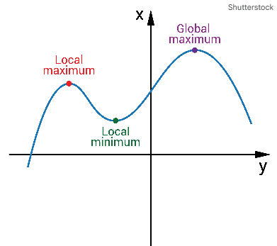
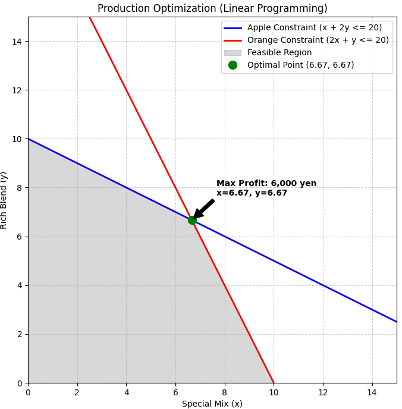

最適化（Optimization）の世界は非常に奥が深いですが、その根底にあるのは「限られたリソースの中で、最善の結果を導き出す」というシンプルな目的です。

数学や工学、あるいはビジネスの文脈で最適化を理解するために、特に重要な概念と、事実上の「公理」として扱われる考え方を整理の上、問題の具体例で説明してみます。

## 概念
最適化を行う上で重要な概念について整理します。

### 1. 最適化の3要素（定式化の基本）

どんな最適化問題も、まずは以下の3つの要素に分解して考えることから始まります。これらを定義できないと、最適化はスタートしません。

* **意思決定変数（Variables）**: 自分がコントロールできる値（例：生産量、広告予算、移動ルート）。
* **目的関数（Objective Function）**: 最大化したいもの（利益、効率）や、最小化したいもの（コスト、誤差、時間）。
* **制約条件（Constraints）**: 守らなければならないルールや限界（予算上限、物理的なスペース、納期）。

### 2. 重要な公理・基本原理

厳密な数学的公理というよりは、実務や理論において「前提」とされる強力な考え方です。

#### 最適性の原理 (Principle of Optimality)

リチャード・ベルマンが提唱した動的計画法の核心です。

> 「最適政策の性質として、初期の状態と決定が何であれ、その結果生じる状態に関して、残りの決定もまた最適政策を構成していなければならない」

簡単に言えば、 **「全体の最短ルートは、その途中のどの区間を切り取っても最短ルートになっている」** という考え方です。

#### 局所最適と大域最適 (Local vs. Global Optima)

最適化において最も注意すべき概念です。

* **局所最適 (Local Optimum)**: 周辺と比較して一番良い状態（「井の中の蛙」状態）。
* **大域最適 (Global Optimum)**: 全体の中で本当に一番良い状態。

多くのアルゴリズムは「勾配（坂道）」を降りますが、複雑な問題では「偽の谷（局所解）」にハマってしまうことがよくあります。

この局所の最適化≠大域最適という関係が最適化でついてまわる課題になります。

### 3. 数理的な重要概念

#### 凸性 (Convexity)

最適化において「凸（とつ）であること」は非常に大きな恩恵です。

* **凸集合・凸関数**: 関数が「お椀型」をしている場合、 **「局所最適 ＝ 大域最適」** であることが保証されます。
* 逆に、凸でない問題（非凸問題）は、現代のAIや深層学習の分野でも最大の難所の一つです。

#### 双対性 (Duality)

一つの最適化問題（主問題）には、必ずそれと表裏一体の関係にある別の問題（双対問題）が存在するという考え方です。

* 例えば「利益を最大化する」問題の裏には、「資源の価値を最小化する」という視点が隠れています。
* これを利用することで、元の問題が解きにくい時に、視点を変えて効率的に解を導き出すことができます。

### 4. 現実的な制約：トレードオフ

最適化を理解する上で避けて通れないのが「あちらを立てればこちらが立たず」の精神です。

* **パレート最適 (Pareto Optimality)**: 誰の状況も悪化させることなしには、誰かの状況を改善することができない状態。
* **計算量と精度のトレードオフ**: 完璧な正解（厳密解）を求めようとすると計算が一生終わらない場合、現実的な時間で「そこそこ良い答え（近似解）」を探す必要があります。

## 具体的な問題
実際にビジネスや工学で非常によく使われる **「線形計画法」** という最適化の問題を解いてみようと思います。

### 問題：ジュース工場の生産最適化

読者の方は一旦、ジュース工場の店長だとしていください。
リンゴとオレンジを使って、「特製ミックス」と「濃厚ブレンド」の2種類のジュースを作っています。在庫のフルーツをどう配分すれば、 **売上を最大化** できるかを考えてみます。

#### 1. 意思決定変数（あなたが決めること）

* $x$ ：特製ミックスの生産量（杯）
* $y$ ：濃厚ブレンドの生産量（杯）

#### 2. 制約条件（守らなければならないルール）

現在、手元にある材料の在庫には限りがあります。

* **リンゴの在庫**: 特製ミックス1杯に100g、濃厚ブレンド1杯に200g使います。在庫は合計で **2,000g** です。
* **オレンジの在庫**: 特製ミックス1杯に200g、濃厚ブレンド1杯に100g使います。在庫は合計で **2,000g** です。
* **非負制約**: 生産量はマイナスにはなりません（$x \ge 0, y \ge 0$）。

#### 3. 目的関数（最大化したいもの）

* **売上**: 特製ミックスは1杯 **500円**、濃厚ブレンドは1杯 **400円** で売れます。
* この売上の合計  $z = 500x + 400y$  を最大にしてください。

### 問題

1. 制約条件を数式で表してください。（例：$100x + 200y \le 2000$ など）
2. $x$ と $y$ をそれぞれ何杯ずつ作れば、売上が最大になりますか？
3. **その時の最大売上は何円ですか？**

### 問題の解法

#### 制約条件の数式化

__1. 「単位」を揃える__

数式を作る時の鉄則は、 **左側（使う量）と右側（在庫量）の単位を一致させる** ことです。
今回はリンゴ、オレンジの重さ[g]に統一されています。

* **左辺（Left-Hand Side）**: 実際に消費する量
* **右辺（Right-Hand Side）**: 使える限界量（キャパシティ）

__2. リンゴの制約__

今回問題に設定されたリンゴに関する制約条件は **「使ったリンゴの合計は、在庫の2000gを超えてはいけない」** です。

* $100x$: 「特製ミックス」を $x$ 杯作るときに使うリンゴの量です。
（1杯100g × $x$ 杯）
* $200y$: 「濃厚ブレンド」を $y$ 杯作るときに使うリンゴの量です。
（1杯200g × $y$ 杯）
* $+$（プラス）: 2種類のジュースで使うリンゴを全部合わせるという意味です。
* $\le$（不等号）: 「〜以下」という意味です。在庫ぴったり（$=$）でもいいし、余らせても（$<$）いいけれど、在庫を超えることは物理的に不可能なのでこの記号を使います。

結果、以下が与えられます。

$$100x + 200y \le 2000$$

__3. オレンジの制約も同じ考え方__

オレンジについても全く同じロジックで組み立てます。

- 特製ミックス1杯に200g → $200x$
- 濃厚ブレンド1杯に100g → $100y$
- 在庫は2000g → $\le 2000$

これを合わせると $200x + 100y \le 2000$ となり、100で割ると $2x + y \le 20$ になります。

__4. 個数はマイナスはない__

最後に、数学の世界には「マイナス」が存在するため、現実世界のルールを付け加える必要があります。
これは **「ジュースの生産量は、最低でも0杯以上（マイナスにはならない）」** という当たり前の条件です。

$$x \ge 0, y \ge 0$$

#### 最適化

「（特製ミックス）と （濃厚ブレンド）を何杯ずつ作るのがベストか？」を導き出すプロセスは、今回は **「2つの直線の交点」** を探す作業に集約されます。

__ステップ1：グラフで「動ける範囲」を可視化する__

まず、2つの制約条件をグラフ（直線）として描きます。

1. リンゴの線: $x + 2y = 20$
- $x$ が 0 のとき、$y = 10$
- $y$ が 0 のとき、$x = 20$

2. オレンジの線: $2x + y = 20$
* $x$ が 0 のとき、$y = 20$
* $y$ が 0 のとき、$x = 10$

この2本の線と、縦軸・横軸で囲まれた「内側のエリア」が、あなたが実際に作ることができるジュースの組み合わせ（実行可能領域）です。

__ステップ2：なぜ「交点」が答えなのか？__

ここが最適化の面白いところです。
今回の目的は 売上 $z = 500x + 400y$ を最大にすること です。

* 特製ミックス（500円）の方が、濃厚ブレンド（400円）より単価が高いですね。
* だからといって特製ミックスばかり作ろうとすると、オレンジの在庫が先に切れてしまいます（$x=10$ までしか作れません）。
* 逆に濃厚ブレンドばかり作ろうとすると、リンゴの在庫が先に切れます（$y=10$ までしか作れません）。

一番効率が良いのは、**「リンゴもオレンジも使い切るポイント」**、つまり2つの条件がぶつかる **交点** であることが多いのです。

__ステップ3：連立方程式で交点を求める__

与えられた連立方程式を解くと解は

$x = 6.67$杯, $y = 6.67$杯

ここで杯といってるくらいなので、少数はふさわしいとは言い切れません。

この場合、解を満たす範囲内で、最適解近辺を探索することになります。

- \((6,7)\) の場合: \(500(6)+400(7)=3000+2800=5800\)
- \((7,6)\) の場合: \(500(7)+400(6)=3500+2400=5900\)
- \((6,6)\) の場合: \(500(6)+400(6)=3000+2400=5400\)
- \((7,7)\) の場合: \(7+2(7)=21>20\) となり、在庫不足（NG）

上記計算より $x = 7$杯, $y = 6$杯 の時が最適と得られました。

#### 最適な売り上げ
上記計算より \5,900が売り上げの最大値です。

## 総括

今回は最適化の概念と、概念を理解するための具体的な問題、問題解法を扱ってみました。
最適化は数式化と、解法両方が非常に奥の深い分野です。
コンピュータで意思決定をする場合に、結構な頻度で出てきますし、実は最適化を使っていたということも多いです。
今回記事、是非ご参考下さい。

