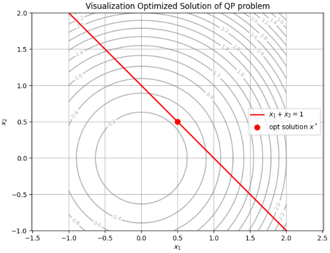

仕事で2次のラグランジュ関数の最適解の導出の問題を最近よく見るようになりました。
そこで最適解の導出について調査の上、説明します。

## 2次のラグランジュ関数の最適解の導出
2次のラグランジュ関数を最適化する問題は、一般に「2次計画問題（Quadratic Programming, QP）」にラグランジュの未定乗数法を適用した形として扱えます。

>ラグランジュ関数（Lagrangian）  
>ラグランジュ関数は、**制約付き最適化問題**を扱うために導入される関数です。
>- 制約付き最小化問題
  \[
  \min_{\mathbf{x}} f(\mathbf{x}) \quad \text{subject to} \quad g_i(\mathbf{x}) = 0,\ i=1,\dots,m
  \]
  に対して、ラグランジュ関数は
  \[
  \mathcal{L}(\mathbf{x}, \boldsymbol{\lambda}) = f(\mathbf{x}) + \sum_{i=1}^m \lambda_i g_i(\mathbf{x})
  \]
  と定義されます。ここで $\lambda_i$ は**ラグランジュ乗数（Lagrange multiplier）**と呼ばれます。
>- 直感的には、「目的関数 $f(\mathbf{x})$ に、制約条件 $g_i(\mathbf{x}) = 0$ を“ペナルティ”として加えたもの」と見なせます。
>- この関数の停留条件（勾配＝0）を解くことで、制約を満たしつつ目的関数を最適化する点（KKT条件）が得られます。
>つまり、**制約付きの問題を、制約なしの関数の停留点問題に変換するための道具**がラグランジュ関数です。

以下では、次のような標準的な2次計画問題を考えます。

- 目的関数（2次）：
  $$
  f(\mathbf{x}) = \frac{1}{2} \mathbf{x}^T Q \mathbf{x} + \mathbf{c}^T \mathbf{x}
  $$
  ここで $Q$ は対称行列（正定値とは限らない）とします。

- 制約条件（線形）：
  $$
  A \mathbf{x} = \mathbf{b}
  $$
  あるいは
  $$
  A \mathbf{x} \leq \mathbf{b}
  $$
  など。

### 1. 等式制約付き2次計画問題（ラグランジュ関数の構成）

等式制約
$$
A \mathbf{x} = \mathbf{b}
$$
のもとで $f(\mathbf{x})$ を最小化する問題を考えます。

ラグランジュ関数は
$$
\mathcal{L}(\mathbf{x}, \boldsymbol{\lambda}) = \frac{1}{2} \mathbf{x}^T Q \mathbf{x} + \mathbf{c}^T \mathbf{x} + \boldsymbol{\lambda}^T (A \mathbf{x} - \mathbf{b})
$$
と書けます。ここで $\boldsymbol{\lambda}$ はラグランジュ乗数ベクトルです。

### 2. 最適性条件（KKT条件）

最適解 $(\mathbf{x}^*, \boldsymbol{\lambda}^*)$ は、次のKKT条件を満たします。

1. **勾配条件（1階必要条件）**
   $$
   \nabla_{\mathbf{x}} \mathcal{L} = Q \mathbf{x}^* + \mathbf{c} + A^T \boldsymbol{\lambda}^* = 0
   $$
   $$
   \nabla_{\boldsymbol{\lambda}} \mathcal{L} = A \mathbf{x}^* - \mathbf{b} = 0
   $$

2. **2階条件（ヘッセ行列の正定値性）**
   制約を満たす方向（$A \mathbf{d} = 0$ を満たす任意の $\mathbf{d} \neq 0$）について、
   $$
   \mathbf{d}^T Q \mathbf{d} \ge 0
   $$
   が成り立つならば、局所最適解となります（十分条件）。

>__KKT条件__  
>KKT条件（Karush–Kuhn–Tucker条件）は、**不等式制約を含む最適化問題**に対する最適性の必要条件です。
>__KKT条件とは__
>次のような制約付き最小化問題を考えます：
>```math
>\min_{\mathbf{x}} f(\mathbf{x}) \quad
>\text{subject to} \quad
>\begin{cases}
>g_i(\mathbf{x}) \le 0,\quad i=1,\dots,m \\
>h_j(\mathbf{x}) = 0,\quad j=1,\dots,\ell
>\end{cases}
>```
>このとき、ラグランジュ関数を
>```math
>\mathcal{L}(\mathbf{x}, \boldsymbol{\lambda}, \boldsymbol{\mu})
>= f(\mathbf{x})
>+ \sum_{i=1}^m \lambda_i g_i(\mathbf{x})
>+ \sum_{j=1}^\ell \mu_j h_j(\mathbf{x})
>```
>と定義します（$\lambda_i \ge 0$ は不等式制約に対する乗数、$\mu_j$ は等式制約に対する乗数）。
>適当な正則性条件（制約想定）のもとで、局所最適解 $\mathbf{x}^*$ に対して、ある乗数 $\lambda_i^*, \mu_j^*$ が存在し、次のKKT条件を満たします：
>1. **主実行可能性**
   \[
   g_i(\mathbf{x}^*) \le 0,\quad h_j(\mathbf{x}^*) = 0
   \]
>2. **双対実行可能性**
   \[
   \lambda_i^* \ge 0
   \]
>3. **勾配条件（1階必要条件）**
   \[
   \nabla_{\mathbf{x}} \mathcal{L}(\mathbf{x}^*, \boldsymbol{\lambda}^*, \boldsymbol{\mu}^*) = 0
   \]
>4. **相補性条件**
   \[
   \lambda_i^* g_i(\mathbf{x}^*) = 0,\quad i=1,\dots,m
   \]
>これらをまとめてKKT条件と呼びます。

### どうやって導出するか

KKT条件は、**ラグランジュの未定乗数法を不等式制約に拡張したもの**と見なせます。導出の流れは次のように理解できます。

1. **等式制約のみの場合（ラグランジュ条件）**
   - 制約が $h_j(\mathbf{x}) = 0$ だけなら、
     \[
     \nabla f(\mathbf{x}^*) + \sum_j \mu_j^* \nabla h_j(\mathbf{x}^*) = 0
     \]
     が最適性条件になります（ラグランジュの定理）。

2. **不等式制約を含む場合の拡張**
   - 不等式制約 $g_i(\mathbf{x}) \le 0$ は、「有効な（等号が成り立つ）制約」と「非有効な（等号でない）制約」に分けられます。
   - 有効な制約は等式制約と同様に扱い、非有効な制約は最適点の近傍で無視できると考えます。
   - すると、最適点では「目的関数の勾配が、有効な制約の勾配の負の方向に“押し込まれた”形」になっている必要があります。
   - これを数式で表すと、勾配条件
     \[
     \nabla f(\mathbf{x}^*) + \sum_i \lambda_i^* \nabla g_i(\mathbf{x}^*) + \sum_j \mu_j^* \nabla h_j(\mathbf{x}^*) = 0
     \]
     と、**双対実行可能性** $\lambda_i^* \ge 0$ が出てきます。

3. **相補性条件の意味**
   - もし $g_i(\mathbf{x}^*) < 0$（制約が非有効）なら、その制約は最適点の近傍で実質的に無視できるので、対応する乗数は $\lambda_i^* = 0$ でよいはずです。
   - 逆に $\lambda_i^* > 0$ なら、その制約は有効（$g_i(\mathbf{x}^*) = 0$）でなければなりません。
   - この「どちらか一方がゼロ」という関係を
     \[
     \lambda_i^* g_i(\mathbf{x}^*) = 0
     \]
     とまとめたのが相補性条件です。

4. **まとめ**
   - 以上をすべて合わせると、主実行可能性・双対実行可能性・勾配条件・相補性条件からなるKKT条件が得られます。
   - 数学的には、Fritz John条件や制約想定のもとで、KKT条件が最適性の必要条件として導かれます。


### 3. 最適解の導出（KKT系の解法）

KKT条件は線形方程式系に帰着します：

```math
\begin{bmatrix}
Q & A^T \\
A & 0
\end{bmatrix}
\begin{bmatrix}
\mathbf{x}^* \\
\boldsymbol{\lambda}^*
\end{bmatrix}
=
\begin{bmatrix}
-\mathbf{c} \\
\mathbf{b}
\end{bmatrix}
```

この系を解くことで、最適解 $(\mathbf{x}^*, \boldsymbol{\lambda}^*)$ が得られます。

- $Q$ が正定値で、かつ $A$ がフルランクならば、このKKT行列は正則であり、解は一意に定まります。
- 数値的には、コレスキー分解やLDL分解を用いた直接法、あるいは反復法（共役勾配法など）で解くことができます。

### 4. 不等式制約付き2次計画問題の場合

制約が
$$
A \mathbf{x} \leq \mathbf{b}
$$
のような不等式の場合、ラグランジュ関数は
$$
\mathcal{L}(\mathbf{x}, \boldsymbol{\lambda}) = \frac{1}{2} \mathbf{x}^T Q \mathbf{x} + \mathbf{c}^T \mathbf{x} + \boldsymbol{\lambda}^T (A \mathbf{x} - \mathbf{b})
$$
と同様に定義されますが、KKT条件には**相補性条件**が加わります：

- 主実行可能：
  $$
  A \mathbf{x}^* \leq \mathbf{b}
  $$
- 双対実行可能：
  $$
  \boldsymbol{\lambda}^* \ge 0
  $$
- 勾配条件：
  $$
  Q \mathbf{x}^* + \mathbf{c} + A^T \boldsymbol{\lambda}^* = 0
  $$
- 相補性条件：
  $$
  \lambda_i^* (A_i \mathbf{x}^* - b_i) = 0,\quad i = 1, \dots, m
  $$

この場合、最適解を解析的に求めるのは一般に困難であり、**アクティブセット法**や**内点法**などの数値解法を用いて解くことになります。

## Pythonで最適解をイメージ

2次計画問題の最適解を可視化するPythonコードを提示しています。

```python
import numpy as np
import matplotlib.pyplot as plt

# 問題設定
Q = np.array([[1, 0],
              [0, 1]])
c = np.array([0, 0])
A = np.array([[1, 1]])
b = np.array([1])

# KKT系を解いて最適解を求める
K = np.block([[Q, A.T],
              [A, np.zeros((A.shape[0], A.shape[0]))]])
rhs = np.concatenate([-c, b])
sol = np.linalg.solve(K, rhs)
x_opt = sol[:2]
lambda_opt = sol[2:]

print(f"最適解 x* = {x_opt}")
print(f"ラグランジュ乗数 λ* = {lambda_opt}")

# 可視化の準備
x1 = np.linspace(-1, 2, 100)
x2 = np.linspace(-1, 2, 100)
X1, X2 = np.meshgrid(x1, x2)

# 目的関数 f(x) = 0.5*(x1^2 + x2^2)
f = 0.5 * (X1**2 + X2**2)

# 制約直線 x1 + x2 = 1
constraint_line = 1 - x1

# プロット
plt.figure(figsize=(8, 6))
contours = plt.contour(X1, X2, f, levels=20, colors='gray', alpha=0.6)
plt.clabel(contours, inline=True, fontsize=8)

plt.plot(x1, constraint_line, 'r-', linewidth=2, label=r'$x_1 + x_2 = 1$')
plt.plot(x_opt[0], x_opt[1], 'ro', markersize=8, label='opt solution $x^*$')

plt.xlabel('$x_1$')
plt.ylabel('$x_2$')
plt.title('Visualization Optimized Solution of QP problem')
plt.legend()
plt.grid(True)
plt.axis('equal')
plt.show()
```

このコードは、次の2次計画問題を解き、可視化しています。



- 目的関数：
  $$
  f(x_1, x_2) = \frac{1}{2}(x_1^2 + x_2^2)
  $$
- 等式制約：
  $$
  x_1 + x_2 = 1
  $$

上記の目的関数 $f(x_1, x_2)$ が最小となり、制約条件を満たすのは、上記の制約を意味する赤い線で、目的関数の等高線の最小部分となります。
→KKT条件から求めた最適解 $x^* = (0.5, 0.5)$ が、目的関数の等高線と制約直線が接する点としてプロットされます。


## まとめ

- 2次のラグランジュ関数の最適化は、2次計画問題の枠組みで扱えます。
- 等式制約の場合は、KKT条件から線形方程式系を解くことで最適解が得られます。
- (今回は詳細に説明していませんが)不等式制約の場合は、KKT条件に相補性条件が加わり、数値解法（アクティブセット法、内点法など）が必要になります。


