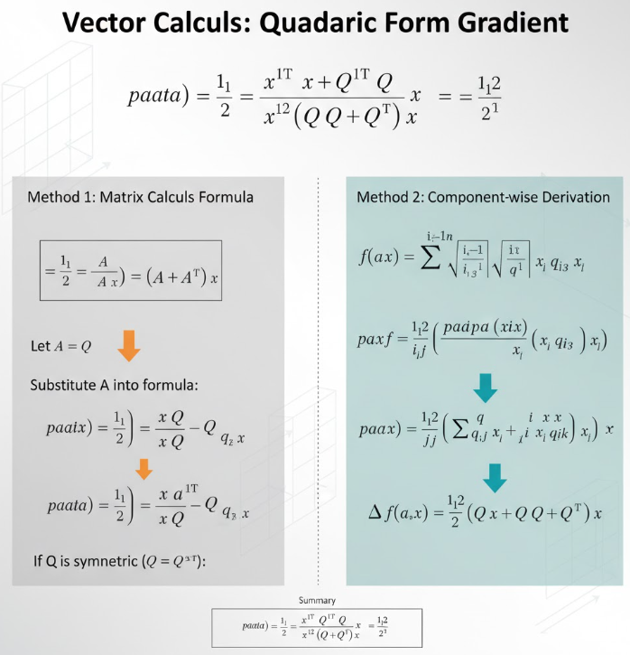

テンソルを扱ったりする教科書を読むと、行列で2次の表現を得たときに、微分がパッと説明されています。

以下の式です。

$$
\frac{\partial}{\partial \mathbf{x}} \left( \frac{1}{2} \mathbf{x}^T Q \mathbf{x} \right)
= \frac{1}{2} (Q + Q^T) \mathbf{x}
$$

これってなんでやねんと思うことが多かったなぁと思い起しました。
本日はこの変換がなぜか導出を行おうと思います。

## 1次関数の微分
$\mathbf{y} = A \mathbf{x}$ というベクトルを $\mathbf{x}$ で偏微分すると、結果は**行列 $A$ の転置**になります。

より正確には、
$$
\frac{\partial \mathbf{y}}{\partial \mathbf{x}} = A^T
$$
です（ただし、分子レイアウトか分母レイアウトかで転置の位置が変わります）。

### 1. 成分計算で確認

$\mathbf{x} \in \mathbb{R}^n$、$A \in \mathbb{R}^{m \times n}$、$\mathbf{y} = A \mathbf{x} \in \mathbb{R}^m$ とします。

成分で書くと、
$$
y_i = \sum_{j=1}^n a_{ij} x_j
$$
です。

偏微分は
$$
\frac{\partial y_i}{\partial x_j} = a_{ij}
$$
となります。

したがって、ヤコビ行列は
$$
J = \left( \frac{\partial y_i}{\partial x_j} \right)_{i,j} = (a_{ij})_{i,j} = A
$$
です。

ここで、**分子レイアウト**（$\mathbf{y}$ を縦ベクトル、$\mathbf{x}$ を縦ベクトルとし、$\frac{\partial \mathbf{y}}{\partial \mathbf{x}}$ を「行が y の成分、列が x の成分」と解釈する流儀）では、
$$
\frac{\partial \mathbf{y}}{\partial \mathbf{x}} = J = A
$$
となります。

一方、**分母レイアウト**（列が x の成分、行が y の成分）では、
$$
\frac{\partial \mathbf{y}}{\partial \mathbf{x}} = J^T = A^T
$$
となります。

最適化の文脈では、分母レイアウト（$\nabla f = \left( \frac{\partial f}{\partial x_1}, \dots, \frac{\partial f}{\partial x_n} \right)^T$）がよく使われるので、
$$
\frac{\partial (A \mathbf{x})}{\partial \mathbf{x}} = A^T
$$
と書かれることが多いです。

>__ヤコビ行列__  
>ヤコビ行列は、**多変数ベクトル値関数の1階微分（勾配）を並べた行列**です。
>- 関数 $\mathbf{f}(\mathbf{x}) = (f_1(\mathbf{x}), \dots, f_m(\mathbf{x}))^T$ に対して、
  $$
  J_{\mathbf{f}}(\mathbf{x}) =
  \begin{bmatrix}
  \frac{\partial f_1}{\partial x_1} & \cdots & \frac{\partial f_1}{\partial x_n} \\
  \vdots & \ddots & \vdots \\
  \frac{\partial f_m}{\partial x_1} & \cdots & \frac{\partial f_m}{\partial x_n}
  \end{bmatrix}
  $$
>- 幾何学的には、点 $\mathbf{x}_0$ での**線形近似（接空間）**を表します。
>- 最適化では、制約関数や目的関数の勾配をまとめて扱うのに使われます。

### 2. 勾配の形で見る

スカラー関数 $f(\mathbf{x}) = \mathbf{a}^T \mathbf{x}$ の勾配は
$$
\nabla f = \mathbf{a}
$$
です。

同様に、ベクトル値関数 $\mathbf{y} = A \mathbf{x}$ の各成分 $y_i$ の勾配は
$$
\nabla y_i = (a_{i1}, \dots, a_{in})^T
$$
です。

これらを並べると、行列 $A$ の転置 $A^T$ になります。

### 3. まとめ

- $\mathbf{y} = A \mathbf{x}$ を $\mathbf{x}$ で偏微分すると、
  - 分子レイアウト：$A$
  - 分母レイアウト：$A^T$
- 最適化の文脈（勾配ベクトル）では、通常分母レイアウトが使われるので、
  $$
  \frac{\partial (A \mathbf{x})}{\partial \mathbf{x}} = A^T
  $$
  と覚えておくと便利です。

この結果は、ラグランジュ関数の勾配条件
$$
\nabla_{\mathbf{x}} \mathcal{L} = Q \mathbf{x} + \mathbf{c} + A^T \boldsymbol{\lambda}
$$
の中の $A^T \boldsymbol{\lambda}$ の部分を導出する際にも使われています。

## 2次関数の微分
関数
$$
f(\mathbf{x}) = \frac{1}{2} \mathbf{x}^T Q \mathbf{x}
$$
の微分（勾配）を求めます。ここで $Q$ は一般の $n \times n$ 行列とします（対称とは限りません）。

### 1. 行列微分の公式を使う方法

よく知られた公式として、
$$
\frac{\partial}{\partial \mathbf{x}} (\mathbf{x}^T A \mathbf{x}) = (A + A^T) \mathbf{x}
$$
があります。

これを使うと、
$$
\frac{\partial}{\partial \mathbf{x}} \left( \frac{1}{2} \mathbf{x}^T Q \mathbf{x} \right)
= \frac{1}{2} (Q + Q^T) \mathbf{x}
$$
となります。

特に $Q$ が対称行列（$Q = Q^T$）なら、
$$
\frac{\partial}{\partial \mathbf{x}} \left( \frac{1}{2} \mathbf{x}^T Q \mathbf{x} \right)
= Q \mathbf{x}
$$
となります。

### 2. 成分計算で導出する方法

成分ごとに計算して確認してみます。

$\mathbf{x} = (x_1, \dots, x_n)^T$、$Q = (q_{ij})$ とすると、
$$
\mathbf{x}^T Q \mathbf{x}
= \sum_{i=1}^n \sum_{j=1}^n x_i q_{ij} x_j
$$
です。

$k$ 番目の成分 $x_k$ で偏微分すると、
$$
\frac{\partial}{\partial x_k} \left( \sum_{i,j} x_i q_{ij} x_j \right)
= \sum_{i,j} \frac{\partial}{\partial x_k} (x_i q_{ij} x_j)
$$
となります。

$x_i q_{ij} x_j$ の微分は、
- $i = k$ かつ $j \neq k$ のとき：$\partial/\partial x_k (x_k q_{kj} x_j) = q_{kj} x_j$
- $i \neq k$ かつ $j = k$ のとき：$\partial/\partial x_k (x_i q_{ik} x_k) = x_i q_{ik}$
- $i = k$ かつ $j = k$ のとき：$\partial/\partial x_k (x_k q_{kk} x_k) = 2 q_{kk} x_k$

これらをまとめると、
$$
\frac{\partial}{\partial x_k} (\mathbf{x}^T Q \mathbf{x})
= \sum_{j} q_{kj} x_j + \sum_{i} x_i q_{ik}
= (Q \mathbf{x})_k + (\mathbf{x}^T Q)_k
$$
となります。

ベクトルとして書けば、
$$
\frac{\partial}{\partial \mathbf{x}} (\mathbf{x}^T Q \mathbf{x})
= Q \mathbf{x} + Q^T \mathbf{x}
= (Q + Q^T) \mathbf{x}
$$
です。

したがって、
$$
\frac{\partial}{\partial \mathbf{x}} \left( \frac{1}{2} \mathbf{x}^T Q \mathbf{x} \right)
= \frac{1}{2} (Q + Q^T) \mathbf{x}
$$
となります。

### まとめ

- 一般の $Q$ に対して：
  $$
  \nabla \left( \frac{1}{2} \mathbf{x}^T Q \mathbf{x} \right)
  = \frac{1}{2} (Q + Q^T) \mathbf{x}
  $$
- $Q$ が対称なら：
  $$
  \nabla \left( \frac{1}{2} \mathbf{x}^T Q \mathbf{x} \right)
  = Q \mathbf{x}
  $$

これが、2次計画問題のラグランジュ関数の勾配条件に出てくる項の導出です。