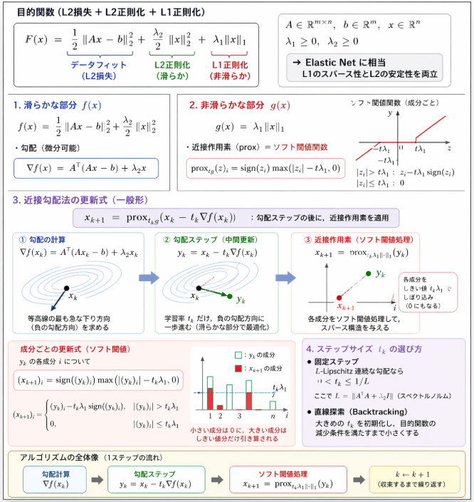

先日のL1正則化の導出に対して、更にL2正則化項が組み合わせたラグランジュ関数による最適化を行うことが出来るとぐっと、ラグランジュ関数による最適化の用途が広がっていきます。
本日はそんな正則化項が複合的に組み合わされたラグランジュ関数による導出を行っていきます。

https://yoshishinnze.hatenablog.com/entry/2025/11/04/000000

## 問題が出てくる場面

L1正則化とL2正則化を組み合わせた「混合正則化」は、主に次のような場面で登場します。

### 1. Elastic Net（L1 + L2 正則化）

- **目的**：L1正則化（LASSO）の「スパース性」と、L2正則化（Ridge）の「安定性・相関特徴への耐性」を両立させる。
- **典型的な場面**：
  - 特徴量同士が強く相関しているとき、LASSOだけだとどれか1つだけが選ばれがち。
  - Elastic Net では L2 成分が相関特徴を「まとめて」扱い、L1 成分が不要な特徴を 0 にする。
  - 高次元データ（遺伝子発現データなど）でよく使われます。

### 2. グループLasso + L2 正則化

- **目的**：グループ単位でのスパース性（グループLasso）と、グループ内の安定性（L2）を両立。
- **典型的な場面**：
  - 遺伝子のパスウェイごと、センサーのチャネルごとなど、「グループ構造」がある特徴選択。
  - グループLassoは「グループごと入れる／外す」を決め、L2はグループ内の係数を滑らかに保つ。

### 3. Total Variation (TV) + L2 正則化（画像処理）

- **目的**：画像のエッジを保ちつつ（TV正則化）、ノイズを抑える（L2損失）。
- **典型的な場面**：
  - 画像のノイズ除去・デブラーリング。
  - TVは「隣接ピクセルの差のL1ノルム」でエッジを保持、L2は滑らかさやデータへのフィットを調整。

### 4. ロバスト回帰 + 正則化

- **目的**：外れ値に強い損失（L1損失など）と、過学習を防ぐ正則化（L2など）を組み合わせる。
- **典型的な場面**：
  - ノイズの多い実データで、外れ値の影響を抑えつつモデルを安定させたいとき。
  - 例：Huber損失＋L2正則化、L1損失＋L2正則化など。

### 5. マルチタスク学習・転移学習

- **目的**：複数の関連タスクを同時に学習し、共通の構造（L2で安定）とタスク固有の構造（L1でスパース）を表現。
- **典型的な場面**：
  - 複数の病気に対する遺伝子の影響を同時推定。
  - 複数のドメイン（国・季節など）にまたがる予測モデル。

### 6. まとめ

正則化の混合問題が出てくるのは、おおまかに言うと

- **スパース性（L1）と安定性・滑らかさ（L2）を同時に欲しいとき**
- **外れ値に強く（L1損失）、かつ過学習を防ぎたい（L2正則化）とき**
- **グループ構造や空間構造（TV）を考慮しつつ、全体を安定させたいとき**

といった場面です。
特に「LASSOだけでは不安定・過剰にスパース」「Ridgeだけでは解釈性が低い」というジレンマを解消するために、L1+L2の混合がよく使われます。

## 導出のコツ

L1正則化とL2正則化が混在する目的関数の更新式を導出する際のコツは、次の3点にまとめられます。

### 1. 滑らかな部分と非滑らかな部分を分離する

目的関数を

$$
F(x) = f(x) + g(x)
$$

の形に分けます。

- $f(x)$：**滑らかな凸関数**（微分可能な部分）
  - 例：L2損失 $\frac{1}{2}\|Ax - b\|_2^2$、L2正則化 $\frac{\lambda_2}{2}\|x\|_2^2$
- $g(x)$：**非滑らかな凸関数**（微分不可能だが近接作用素が簡単）
  - 例：L1正則化 $\lambda_1 \|x\|_1$

こう分けることで、

- $f$ には**勾配法**（勾配降下）
- $g$ には**近接作用素**（proximal operator）

を適用する、という「役割分担」が明確になります。

### 2. 近接勾配法の一般形を覚えておく

近接勾配法の更新則は一般に

$$
x_{k+1} = \operatorname{prox}_{t_k g}\big(x_k - t_k \nabla f(x_k)\big)
$$

です。ここで

- $\nabla f(x_k)$：滑らかな部分の勾配
- $\operatorname{prox}_{t g}$：非滑らかな部分 $g$ の近接作用素
- $t_k$：ステップサイズ

この「**勾配ステップの後に近接作用素をかける**」という形を覚えておくと、あとは $f, g$ を具体的に代入するだけです。

### 3. 具体的な関数形に代入する

__(1) 滑らかな部分 $f(x)$ の勾配を求める__

例：

$$
f(x) = \frac{1}{2}\|Ax - b\|_2^2 + \frac{\lambda_2}{2}\|x\|_2^2
$$

なら

$$
\nabla f(x) = A^\top(Ax - b) + \lambda_2 x
$$

__(2) 非滑らかな部分 $g(x)$ の近接作用素を求める__

例：

$$
g(x) = \lambda_1 \|x\|_1
$$

の近接作用素は、ソフト閾値関数（soft-thresholding）

$$
\operatorname{prox}_{t g}(x)_i = \operatorname{sign}(x_i) \max(|x_i| - t\lambda_1, 0)
$$

です。これは「各成分を閾値 $t\lambda_1$ でしぼる」操作です。

__(3) 一般形に代入する__

上記を近接勾配法の一般形に代入すると、

$$
\begin{aligned}
y_k &= x_k - t_k \big(A^\top(A x_k - b) + \lambda_2 x_k\big) \\
x_{k+1} &= \operatorname{prox}_{t_k \lambda_1 \|\cdot\|_1}(y_k)
\end{aligned}
$$

という具体的な更新式が得られます。

### 4. まとめ

導出のコツは：

1. **目的関数を「滑らかな部分 $f$」と「非滑らかな部分 $g$」に分ける**
2. **近接勾配法の一般形**
   $$
   x_{k+1} = \operatorname{prox}_{t g}(x_k - t \nabla f(x_k))
   $$

   を覚えておく
3. **具体的な $f, g$ に対して $\nabla f$ と $\operatorname{prox}_{t g}$ を計算し、代入する**

この3ステップを踏めば、L1+L2正則化だけでなく、他の多くの「滑らか＋非滑らか」な目的関数に対しても同様に更新式を導出できます。

## 導出

ここでは、次のような「L2損失＋L2正則化＋L1正則化」が合算された目的関数を考えます。

$$
F(x) = \underbrace{\frac{1}{2}\|Ax - b\|_2^2 + \frac{\lambda_2}{2}\|x\|_2^2}_{=: f(x)\ \text{(滑らかな凸関数)}} + \underbrace{\lambda_1 \|x\|_1}_{=: g(x)\ \text{(非滑らかな凸関数)}}
$$

- $A \in \mathbb{R}^{m \times n}$, $b \in \mathbb{R}^{m}$, $x \in \mathbb{R}^{n}$
- $\lambda_1 \ge 0$, $\lambda_2 \ge 0$ は正則化パラメータ

この形は、統計学では **Elastic Net** に相当します。
最適化には、滑らかな部分 $f(x)$ と非滑らかな部分 $g(x)$ を分けて扱う**近接勾配法（proximal gradient method）** が適しています。

### 1. 滑らかな部分 $f(x)$ の勾配

$$
f(x) = \frac{1}{2}\|Ax - b\|_2^2 + \frac{\lambda_2}{2}\|x\|_2^2
$$

より、

$$
\nabla f(x) = A^\top(Ax - b) + \lambda_2 x
$$

です。

### 2. 非滑らかな部分 $g(x)$ の近接作用素

$$
g(x) = \lambda_1 \|x\|_1
$$

の近接作用素（proximal operator）は、**ソフト閾値関数（soft-thresholding）** として知られています。

ステップサイズ $t > 0$ に対する近接作用素は、成分ごとに

$$
\operatorname{prox}_{t g}(x)_i = \operatorname{sign}(x_i) \max(|x_i| - t\lambda_1, 0)
$$

で与えられます。つまり、各成分 $x_i$ について

- $|x_i| > t\lambda_1$ なら $x_i - t\lambda_1 \cdot \operatorname{sign}(x_i)$
- $|x_i| \le t\lambda_1$ なら 0

に「しきい値処理」する操作です。

### 3. 近接勾配法の更新式

近接勾配法の更新則は一般に

$$
x_{k+1} = \operatorname{prox}_{t_k g}\big(x_k - t_k \nabla f(x_k)\big)
$$

です。ここで $t_k$ はステップサイズ（固定または直線探索で決める）です。

今の場合、

- $\nabla f(x_k) = A^\top(A x_k - b) + \lambda_2 x_k$
- $g(x) = \lambda_1 \|x\|_1$

なので、更新式は

$$
\begin{aligned}
y_k &= x_k - t_k \big(A^\top(A x_k - b) + \lambda_2 x_k\big) \\
x_{k+1} &= \operatorname{prox}_{t_k \lambda_1 \|\cdot\|_1}(y_k)
\end{aligned}
$$

となります。
近接作用素は成分ごとのソフト閾値処理なので、具体的には

$$
(x_{k+1})_i = \operatorname{sign}\big((y_k)_i\big) \cdot \max\big(|(y_k)_i| - t_k \lambda_1, 0\big)
$$

です。

### 4. ステップサイズ $t_k$ の選び方

- **固定ステップ**：$\nabla f$ が $L$-リプシッツ連続なら、$t_k = t \in (0, 1/L]$ と固定できます。ここで $L = \|A^\top A + \lambda_2 I\|$（スペクトルノルム）です。
- **直線探索（backtracking line search）**：
  各ステップで $t_k$ を大きめに初期化し、目的関数の減少条件を満たすまで小さくする方法もあります。

## まとめ

L2正則化項とL1正則化項が合算された目的関数

$$
F(x) = \frac{1}{2}\|Ax - b\|_2^2 + \frac{\lambda_2}{2}\|x\|_2^2 + \lambda_1 \|x\|_1
$$

に対する近接勾配法の更新式は、

1. 勾配計算：
   $$
   \nabla f(x_k) = A^\top(A x_k - b) + \lambda_2 x_k
   $$
2. 中間更新：
   $$
   y_k = x_k - t_k \nabla f(x_k)
   $$
3. ソフト閾値処理（L1正則化の近接作用素）：
   $$
   (x_{k+1})_i = \operatorname{sign}\big((y_k)_i\big) \cdot \max\big(|(y_k)_i| - t_k \lambda_1, 0\big)
   $$

となります。
これが、L1+L2正則化付きラグランジュ関数（目的関数）を最適化するための代表的な更新式です。

## $y_k$の意味

近接勾配法の文脈では、**$y_k$ は「補助変数」と呼んでも差し支えありません**が、用語の使い方には少し注意があります。

---

## 1. 一般的な呼び方

近接勾配法の更新式

$$
\begin{aligned}
y_k &= x_k - t_k \nabla f(x_k) \\
x_{k+1} &= \operatorname{prox}_{t_k g}(y_k)
\end{aligned}
$$

において、$y_k$ は

- **中間変数（intermediate variable）**
- **補助変数（auxiliary variable）**

と解釈されることが多いです。

アルゴリズムの導出や実装では、「いったん勾配ステップの結果を $y_k$ に格納し、それに近接作用素を適用する」という流れになるので、**補助的な役割の変数**という意味で「補助変数」と呼ぶのは自然です。

---

## 2. 用語の注意点

一方で、最適化の文献では「補助変数」という言葉が、別の意味で使われることもあります。

- **ADMM（Alternating Direction Method of Multipliers）** では、主変数 $x$ と双対変数以外に、しばしば「補助変数 $z$」が導入されます。
- 双対分解や乗数法でも、「補助変数」が特定の役割（制約の緩和など）を持つことがあります。

そのため、「補助変数」という語だけを聞くと、文脈によっては

- ADMM の $z$
- 制約を緩和するためのスラック変数
- 双対変数

などを指す可能性もあります。

---

## 3. 結論

- 近接勾配法における $y_k$ は、**勾配ステップの結果を一時的に保持する変数**であり、その意味で「補助変数」と呼ぶのは妥当です。
- ただし、最適化の文脈では「補助変数」が別のものを指すこともあるので、
  「中間変数 $y_k$」や「勾配ステップ後の点 $y_k$」と明示する方が誤解が少ない場合もあります。

要するに、**「補助変数と呼んでもよいが、文脈によって意味が変わる可能性がある」**という理解で問題ありません。

## 交互に更新する理由

滑らかな関数 $f$ と非滑らかな関数 $g$ を**別々に更新する**のは、主に次の3つの理由からです。

---

## 1. 計算のしやすさ（役割分担）

- **滑らかな部分 $f$**：微分可能なので、**勾配 $\nabla f$** が計算できます。→ 勾配降下法のように「傾きに沿って進む」のが簡単。
- **非滑らかな部分 $g$**：
  微分不可能（L1ノルムなど）なので、勾配は定義できません。
  しかし、**近接作用素 $\operatorname{prox}_{t g}$** が簡単に計算できる場合が多いです（L1ならソフト閾値など）。
  → 「しきい値処理」のような局所的な修正操作として扱える。

このように、

- $f$ には**勾配法**
- $g$ には**近接作用素**

という「得意技」を使い分けることで、アルゴリズムがシンプルで実装しやすくなります。

---

## 2. 収束性の保証

近接勾配法は、

1. まず $f$ について勾配ステップで大局的に進む
2. 次に $g$ について近接作用素で局所的に修正する

という2段階更新ですが、この組み合わせによって、

- 目的関数 $F(x) = f(x) + g(x)$ が減少すること
- 適切なステップサイズのもとで最適解に収束すること

が理論的に保証されます。

もし $f$ と $g$ を「まとめて」微分しようとすると、$g$ が微分不可能なため古典的な勾配法が使えず、収束の保証が難しくなります。

---

## 3. 汎用性とモジュール性

「滑らか＋非滑らか」という分解は、多くの実問題に当てはまります。

- 滑らかな部分：L2損失、L2正則化、滑らかなペナルティなど
- 非滑らかな部分：L1正則化、グループLasso、指示関数（制約）など

この形にしておけば、

- $f$ の勾配計算だけを差し替えれば別の問題に応用できる
- $g$ の近接作用素だけを差し替えれば別の正則化に応用できる

という**モジュール性**が得られます。

---

## 4. 直感的なイメージ

直感的には、

- **滑らかな地形 $f$**：勾配（傾き）を見て「どちらに進むか」を決める（大まかな方向）。
- **非滑らかな障害 $g$**：
  近接作用素で「しきい値処理」や「制約の反映」を行う（細かい修正）。

という二段階の動きです。
これを**別々に処理する**ことで、それぞれの性質を活かした効率的な更新が可能になります。

---

## 5. まとめ

- 滑らかな部分は勾配で、非滑らかな部分は近接作用素で扱うのが計算的に楽。
- この組み合わせで収束性が理論的に保証される。
- 「滑らか＋非滑らか」の分解は多くの問題に当てはまり、モジュール性が高い。

だから、近接勾配法では $f$ と $g$ を別々に更新する設計になっています。

## 一緒に更新することは可能か

「一緒に更新する」の意味によりますが、**古典的な勾配法のように「f と g をまとめて微分して勾配を求める」ことはできません**。
一方で、**f+g 全体を別の方法で扱うアルゴリズム（劣勾配法など）は存在します**。

---

## 1. 古典的な勾配法は無理

目的関数が

$$
F(x) = f(x) + g(x)
$$

で、$g$ が L1ノルムなどの非滑らかな関数の場合、

- $F(x)$ は微分不可能な点を持ちます。
- したがって、$\nabla F(x)$ はすべての点で定義できません。

そのため、

> 「$F(x)$ を一つの関数として微分し、$\nabla F(x_k)$ を使って $x_{k+1} = x_k - \alpha_k \nabla F(x_k)$」

という**古典的な勾配降下法**は、そのままでは使えません。

---

## 2. 一緒に扱う別のアルゴリズムはある

「一緒に更新する」を「f と g を分けずに一つのブラックボックスとして扱う」と解釈するなら、**劣勾配法（subgradient method）**が該当します。

- $F(x) = f(x) + g(x)$ の劣勾配集合 $\partial F(x)$ を考え、
- そこから一つ $g_k \in \partial F(x_k)$ を選び、
- $x_{k+1} = x_k - \alpha_k g_k$

と更新します。

この方法では、**f と g を明示的に分離せずに「まとめて」更新**しています。ただし、

- 収束が遅い
- ステップサイズの調整が難しい
- 高精度の解を得にくい

といった欠点があります。

---

## 3. 近接勾配法は「一緒に」扱っているとも言える

近接勾配法の更新式

$$
\begin{aligned}
y_k &= x_k - t_k \nabla f(x_k) \\
x_{k+1} &= \operatorname{prox}_{t_k g}(y_k)
\end{aligned}
$$

は、見かけ上は「f と g を別々に処理」していますが、
これは元々

$$
x_{k+1} = \arg\min_x \left\{ f(x_k) + \nabla f(x_k)^\top (x - x_k) + \frac{1}{2t_k}\|x - x_k\|^2 + g(x) \right\}
$$

という「**f と g を一緒に含んだ最小化問題**」から導出されたものです。

つまり、**各ステップで「f と g を一緒に考慮した更新」を行っている**とも解釈できます。
ただ、計算上都合が良いので「滑らかな部分」と「非滑らかな部分」に分けて実装しているに過ぎません。

---

## 4. まとめ

- **古典的な意味での「一緒に微分して勾配法」は不可能**（g が非滑らかなため）。
- しかし、**劣勾配法のように f+g を一つの関数として扱うアルゴリズムは存在**する。
- 近接勾配法も、各ステップで f と g を一緒に考慮した最小化問題を解いている、という意味では「一緒に更新」している。

実用上は、近接勾配法のように「滑らか／非滑らかで役割分担」する方が、収束性・実装のしやすさの面で有利なことが多いです。

## 所感

- なめらかな部分は傾きにそって進むのが簡単
- 非なめらかな部分は局所的な修正操作が行える

## L2最適解

RPCA（Robust Principal Component Analysis）の代表的な定式化では、観測行列 $ M \in \mathbb{R}^{m \times n} $ を

$$
M = L + S
$$

と分解し、

- $ L $：低ランク行列（背景・構造成分）
- $ S $：スパース行列（外れ値・ノイズ成分）

とします。
よく使われる凸緩和版の目的関数は

$$
\min_{L, S} \frac{1}{2} \| M - L - S \|_F^2 + \lambda_L \|L\|_* + \lambda_S \|S\|_1
$$

です。ここで

- $\| \cdot \|_F$：Frobeniusノルム（2次損失）
- $\|L\|_*$：核ノルム（トレースノルム）
- $\|S\|_1$：要素ごとの $\ell_1$ ノルム
- $\lambda_L, \lambda_S > 0$：正則化パラメータ

です。

この問題は凸であり、近接勾配法やADMMなどで効率的に解けますが、「閉形式で最適解 $L^*, S^*$ を陽に書く」ことは一般にはできません。
ただし、**最適性条件（KKT条件）**は比較的きれいな形で書けます。

---

### 1. 目的関数の整理

$$
f(L, S) = \frac{1}{2} \| M - L - S \|_F^2 + \lambda_L \|L\|_* + \lambda_S \|S\|_1
$$

とおきます。
Frobeniusノルムの2乗は

$$
\frac{1}{2} \| M - L - S \|_F^2
= \frac{1}{2} \sum_{i,j} (M_{ij} - L_{ij} - S_{ij})^2
$$

です。

---

### 2. 滑らかな部分の勾配

滑らかな項

$$
g(L, S) = \frac{1}{2} \| M - L - S \|_F^2
$$

の勾配は

$$
\nabla_L g(L, S) = -(M - L - S)
$$

$$
\nabla_S g(L, S) = -(M - L - S)
$$

です（行列としての勾配）。

---

### 3. 近接作用素と最適性条件

核ノルム $\|L\|_*$ と $\ell_1$ ノルム $\|S\|_1$ は凸だが非滑らかな項です。
それぞれの**近接作用素（proximal operator）**はよく知られています。

#### (1) 核ノルムの近接作用素

行列 $X$ の特異値分解を $X = U \Sigma V^\top$、$\Sigma = \mathrm{diag}(\sigma_1, \dots, \sigma_r)$ とすると、

$$
\mathrm{prox}_{\lambda \|\cdot\|_*}(X) = U \, \mathrm{diag}\big(\mathcal{S}_\lambda(\sigma_1, \dots, \sigma_r)\big) \, V^\top
$$

です。
ここで $\mathcal{S}_\lambda$ はソフト閾値関数（soft-thresholding）：

$$
\mathcal{S}_\lambda(\sigma) = \mathrm{sign}(\sigma) \max(|\sigma| - \lambda, 0)
$$

です。

#### (2) $\ell_1$ ノルムの近接作用素

要素ごとのソフト閾値：

$$
\big[\mathrm{prox}_{\lambda \|\cdot\|_1}(X)\big]_{ij}
= \mathrm{sign}(X_{ij}) \max(|X_{ij}| - \lambda, 0)
$$

です。

---

### 4. 最適性条件（KKT条件）

凸最適化問題の最適性条件から、$(L^*, S^*)$ が最適解であるための必要十分条件は

$$
0 \in \nabla_L g(L^*, S^*) + \lambda_L \, \partial \|L^*\|_*
$$

$$
0 \in \nabla_S g(L^*, S^*) + \lambda_S \, \partial \|S^*\|_1
$$

です。
ここで $\partial$ は劣微分（subdifferential）です。

$\nabla_L g = \nabla_S g = -(M - L - S)$ なので、書き換えると

$$
M - L^* - S^* \in \lambda_L \, \partial \|L^*\|_*
$$

$$
M - L^* - S^* \in \lambda_S \, \partial \|S^*\|_1
$$

となります。

これは近接作用素を用いて

$$
L^* = \mathrm{prox}_{\lambda_L \|\cdot\|_*}(L^* + (M - L^* - S^*))
$$

$$
S^* = \mathrm{prox}_{\lambda_S \|\cdot\|_1}(S^* + (M - L^* - S^*))
$$

と書けますが、これは単に定義を書き直しただけです。

より実用的には、ADMMや近接勾配法で更新式を導き、反復的に解きます。

---

### 5. ADMMによる更新式の例（「最適解を与えるx」の具体的な形）

変数 $L, S$ と残差 $Z = M - L - S$ を導入し、拡張ラグランジアンを構成すると、ADMMの更新式は概ね以下のようになります（詳細な定式化により係数は変わりますが、構造は同じです）。

1. **$L$ の更新**

   $$
   L^{k+1} = \mathrm{prox}_{\lambda_L \|\cdot\|_*}\big( L^k - \alpha (M - L^k - S^k - Z^k) \big)
   $$

   あるいは別の定式化では

   $$
   L^{k+1} = \mathrm{prox}_{\lambda_L \|\cdot\|_*}\big( M - S^k - Z^k \big)
   $$

   のように書けます。
2. **$S$ の更新**

   $$
   S^{k+1} = \mathrm{prox}_{\lambda_S \|\cdot\|_1}\big( S^k - \alpha (M - L^{k+1} - S^k - Z^k) \big)
   $$

   あるいは

   $$
   S^{k+1} = \mathrm{prox}_{\lambda_S \|\cdot\|_1}\big( M - L^{k+1} - Z^k \big)
   $$
3. **$Z$（双対変数／残差）の更新**

   $$
   Z^{k+1} = Z^k + \rho (M - L^{k+1} - S^{k+1})
   $$

ここで $\alpha, \rho > 0$ はステップサイズ・ペナルティパラメータです。

収束すれば $(L^k, S^k) \to (L^*, S^*)$ となり、これが「2次の損失関数（Frobeniusノルムの2乗）＋正則化項」に対する最適解です。

---

### 6. もし「x」がスカラーやベクトルを指す場合

ユーザーが「x」と書いているので、もしかすると RPCA ではなく、より単純な

$$
\min_x \frac{1}{2} \| y - A x \|_2^2 + \lambda R(x)
$$

のような「2次損失＋正則化」の問題を想定している可能性もあります。
その場合、$R(x)$ が $\ell_1$ ノルムなら Lasso となり、最適性条件は

$$
A^\top (y - A x^*) \in \lambda \, \partial \|x^*\|_1
$$

で、近接作用素を用いた反復解法（ISTA, FISTA など）で解けます。

---

### まとめ

- RPCA の典型的な2次損失付き目的関数は

  $$
  \min_{L,S} \frac{1}{2} \| M - L - S \|_F^2 + \lambda_L \|L\|_* + \lambda_S \|S\|_1
  $$

  です。
- 最適解 $(L^*, S^*)$ は閉形式では書けませんが、最適性条件は

  $$
  M - L^* - S^* \in \lambda_L \, \partial \|L^*\|_*
  $$

  $$
  M - L^* - S^* \in \lambda_S \, \partial \|S^*\|_1
  $$

  と表せます。
- 実際の数値解は、ADMM や近接勾配法などの反復アルゴリズムにより、近接作用素（ソフト閾値・特異値のソフト閾値）を繰り返し適用することで得られます。

もし「x」が特定のベクトルや別の定式化を指している場合は、その定式化を具体的に書いてもらえれば、それに合わせた最適解の導出もできます。

RPCA の ADMM における $L$ の更新式の導出を、できるだけ丁寧に説明します。

---

## 1. 問題設定と拡張ラグランジアン

RPCA の凸緩和版の目的関数は

$$
\min_{L, S} \frac{1}{2} \| M - L - S \|_F^2 + \lambda_L \|L\|_* + \lambda_S \|S\|_1
$$

です。
ADMM を適用するために、**等式制約** $M = L + S + Z$ を導入し、拡張ラグランジアンを構成します。

$$
\mathcal{L}_\rho(L, S, Z; \Lambda)
= \frac{1}{2} \|Z\|_F^2
+ \lambda_L \|L\|_*
+ \lambda_S \|S\|_1
+ \langle \Lambda, M - L - S - Z \rangle
+ \frac{\rho}{2} \| M - L - S - Z \|_F^2
$$

ここで

- $Z$：残差（あるいはスラック変数）
- $\Lambda$：ラグランジュ乗数（双対変数）
- $\rho > 0$：ペナルティパラメータ

です。
ADMM では、$L, S, Z$ を順に更新し、最後に $\Lambda$（あるいは $Z$ とまとめて扱う）を更新します。

---

## 2. L の更新問題

ADMM の L 更新ステップでは、$S^k, Z^k, \Lambda^k$ を固定して

$$
L^{k+1} = \arg\min_L \mathcal{L}_\rho(L, S^k, Z^k; \Lambda^k)
$$

を解きます。
$\mathcal{L}_\rho$ のうち $L$ に依存する項だけを抜き出すと

$$
\mathcal{L}_\rho^{(L)}(L)
= \lambda_L \|L\|_*
- \langle \Lambda^k, L \rangle
+ \frac{\rho}{2} \| M - L - S^k - Z^k \|_F^2
$$

です。
ここで、**スケーリングされた双対変数** $U^k = \Lambda^k / \rho$ を導入すると扱いやすくなります。

---

## 3. 平方完成（L に関する2次項の整理）

$M - S^k - Z^k$ をまとめて $R^k$ とおきます：

$$
R^k = M - S^k - Z^k
$$

すると

$$
\mathcal{L}_\rho^{(L)}(L)
= \lambda_L \|L\|_*
- \rho \langle U^k, L \rangle
+ \frac{\rho}{2} \| R^k - L \|_F^2
$$

Frobenius 内積の性質を使うと

$$
\| R^k - L \|_F^2
= \|R^k\|_F^2 - 2 \langle R^k, L \rangle + \|L\|_F^2
$$

なので、

$$
\mathcal{L}_\rho^{(L)}(L)
= \lambda_L \|L\|_*
+ \frac{\rho}{2} \|L\|_F^2
- \rho \langle U^k + R^k, L \rangle
+ \text{（L に依存しない定数項）}
$$

となります。
ここで $X^k = R^k + U^k$ とおくと、

$$
\mathcal{L}_\rho^{(L)}(L)
= \lambda_L \|L\|_*
+ \frac{\rho}{2} \|L - X^k\|_F^2
+ \text{定数}
$$

という形になります（平方完成）。
実際、

$$
\frac{\rho}{2} \|L - X^k\|_F^2
= \frac{\rho}{2} \|L\|_F^2 - \rho \langle X^k, L \rangle + \frac{\rho}{2} \|X^k\|_F^2
$$

であり、$X^k = R^k + U^k$ を代入すると、上で書いた線形項と一致します。

---

## 4. 近接作用素による L の更新式

以上より、L の最小化問題は

$$
L^{k+1}
= \arg\min_L \left\{
\lambda_L \|L\|_*
+ \frac{\rho}{2} \|L - X^k\|_F^2
\right\}
$$

と書けます。
これはまさに**核ノルムの近接作用素**の定義そのものです：

$$
L^{k+1}
= \mathrm{prox}_{\frac{\lambda_L}{\rho} \|\cdot\|_*}(X^k)
$$

あるいはスケールを調整して

$$
L^{k+1}
= \mathrm{prox}_{\lambda_L \|\cdot\|_*}\big( X^k \big)
$$

と書く流儀もあります（$\rho$ を prox の係数に吸収させるかどうかの違い）。
ここで

$$
X^k = R^k + U^k = (M - S^k - Z^k) + U^k
$$

です。

特に、**双対変数の更新を $Z$ 側に吸収させる定式化**（後述）をすると $U^k$ が $Z^k$ に含まれる形になり、

$$
L^{k+1} = \mathrm{prox}_{\lambda_L \|\cdot\|_*}(M - S^k - Z^k)
$$

という形になります。
これが「別の定式化では $L^{k+1} = \mathrm{prox}_{\lambda_L \|\cdot\|_*}(M - S^k - Z^k)$」と書ける理由です。

---

## 5. 勾配降下＋prox の形の導出（1つ目の式）

一方、元の目的関数

$$
f(L, S) = \frac{1}{2} \| M - L - S \|_F^2 + \lambda_L \|L\|_* + \lambda_S \|S\|_1
$$

に対して、**近接勾配法（Proximal Gradient Method）**を適用すると、L の更新は

$$
L^{k+1}
= \mathrm{prox}_{\alpha \lambda_L \|\cdot\|_*}
\big(
L^k - \alpha \nabla_L g(L^k, S^k)
\big)
$$

となります。ここで

- $g(L, S) = \frac{1}{2} \| M - L - S \|_F^2$
- $\nabla_L g(L, S) = -(M - L - S)$

ですから、

$$
L^{k+1}
= \mathrm{prox}_{\alpha \lambda_L \|\cdot\|_*}
\big(
L^k + \alpha (M - L^k - S^k)
\big)
$$

となります。

ADMM の文脈で、残差 $Z^k = M - L^k - S^k$ を導入しているなら、

$$
M - L^k - S^k = Z^k
$$

なので、

$$
L^{k+1}
= \mathrm{prox}_{\alpha \lambda_L \|\cdot\|_*}
\big(
L^k + \alpha Z^k
\big)
$$

と書けます。
さらに、ADMM の定式化によっては $Z^k$ が「残差＋双対変数」をまとめたものになっていることがあり、その場合

$$
L^{k+1}
= \mathrm{prox}_{\alpha \lambda_L \|\cdot\|_*}
\big(
L^k - \alpha (M - L^k - S^k - Z^k)
\big)
$$

のように、符号や係数の違いを含んだ形で現れます。
これは「勾配項＋現在の $L^k$」に prox をかける、という近接勾配法の形に対応しています。

---

## 6. まとめ

- **2つ目の形**

  $$
  L^{k+1} = \mathrm{prox}_{\lambda_L \|\cdot\|_*}(M - S^k - Z^k)
  $$

  は、ADMM の拡張ラグランジアンを L について最小化し、平方完成して近接作用素の形にまとめた結果です。ここで $Z^k$ は「残差＋（スケーリングされた）双対変数」をまとめたものとみなせます。
- **1つ目の形**

  $$
  L^{k+1} = \mathrm{prox}_{\lambda_L \|\cdot\|_*}\big( L^k - \alpha (M - L^k - S^k - Z^k) \big)
  $$

  は、近接勾配法の更新式

  $$
  L^{k+1} = \mathrm{prox}_{\alpha \lambda_L \|\cdot\|_*}\big( L^k - \alpha \nabla_L g(L^k, S^k) \big)
  $$

  に $\nabla_L g = -(M - L - S)$ を代入し、さらに $Z^k = M - L^k - S^k$ などの関係を使ったものです。
  符号や係数は定式化（ステップサイズ $\alpha$、ペナルティ $\rho$、双対変数の扱い）によって微妙に変わります。

どちらの形も、「2次損失＋核ノルム正則化」に対する凸最適化の標準的な更新式のバリエーションです。
