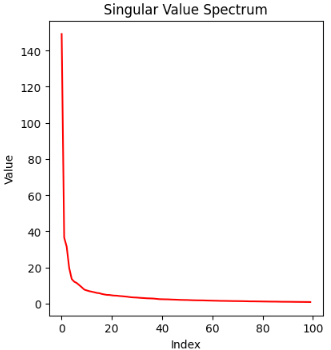
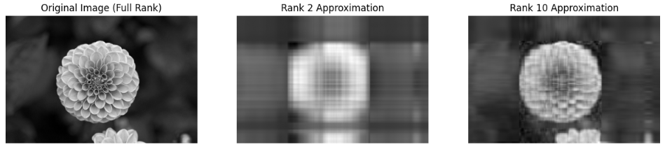
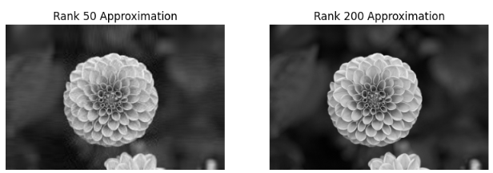

本日は、コンピュータ科学において　**「複雑で高次元なデータから、本質的なパターン（構造）を取り出す最強のツール」**　として活用されている特異値分解（Singular Value Decomposition, **SVD**）について説明します。

## 概要

特異値分解は、一言でいえば **「どんな形の行列でも、3つの意味のある行列の掛け算に分解する」** という数学的な処理です。

データ分析や画像圧縮、AIの分野で非常に重宝される手法で、「行列のDNAを取り出す」ような作業だとイメージすると分かりやすいです。


### 1. 数学的な定義

任意の $m \times n$ 行列 $A$ は、以下の3つの行列の積に分解できます。

$$A = U \Sigma V^T$$

それぞれの行列には以下の役割があります。

* $U$ (左特異ベクトル): 出力側の空間における「基底（軸）」を表します。データの「列」方向の特徴を捉えます。
* $\Sigma$ (特異値行列): 対角成分に「特異値」が並んだ行列です。特異値は**「その軸がどれだけ重要か（データの大きさ・情報の濃さ）」**を表します。
* $V^T$ (右特異ベクトル): 入力側の空間における「基底（軸）」を表します。データの「行」方向の特徴を捉えます。


### 2. 直感的なイメージ：多次元の回転と引き伸ばし

幾何学的には、SVDは行列による変換を **「回転 → 拡大縮小 → 回転」** という3つのステップに分解していると解釈できます。

1. $V^T$: データを回転させ、扱いやすい向きに揃える。
2. $\Sigma$: 重要な方向にデータを引き伸ばし、不要な方向を縮める。
3. $U$: 再び回転させ、元の空間に戻す。

どんなに複雑な行列の動きも、この3段階で説明できるというのがSVDの凄さです。


### 3. 主な用途（何に役立つのか？）

SVDが最も力を発揮するのは、 **「膨大なデータから本質的な情報だけを抜き出す（低ランク近似）」** ときです。

* **画像圧縮:** 特異値の大きなもの（重要な情報）だけを残し、小さなもの（ノイズや細かいディテール）を捨てて再構成すると、見た目を維持したままデータ量を大幅に削減できます。
* **推薦システム（レコメンド）:** 「ユーザー × 商品」の巨大な行列を分解することで、ユーザーの潜在的な「好み」や商品の「特徴」を抽出し、似た商品を勧めることができます。
* **次元圧縮 (PCAの基盤):** 多変量解析でよく使われる主成分分析（PCA）は、内部的にこのSVDと同じ計算を行っています。


### 4. 線形最適化とのつながり

前にお話しした「最適化」の観点では、SVDは **「最小二乗法」** や **「擬似逆行列」** の計算に使われます。行列  が正方行列でなかったり、逆行列を持たなかったりする場合でも、SVDを使えば「最も誤差が小さい解」を安定して求めることができます。

## 応用例

### 1. 機械学習とデータマイニング

SVDは「データの要約」において中心的な役割を果たします。

* **次元圧縮 (PCA):** 主成分分析（PCA）の計算の核心部分はSVDです。数千もの変数があるデータから、最も重要な数個の軸（主成分）を選び出し、データを可視化したり計算コストを下げたりします。
* **潜在意味解析 (LSA):** 自然言語処理の初期において、文書と単語の行列をSVDで分解し、「どの単語がどのトピック（潜在的な意味）に近いか」を計算するのに使われました。
* **レコメンデーション（推薦システム）:** NetflixやAmazonのような「ユーザー × 商品」の巨大な行列から、ユーザーの隠れた好みや商品の隠れた特徴を抽出するのに使われます。


### 2. 画像処理とコンピュータビジョン

画像は行列そのものであるため、SVDと非常に相性が良いです。

* **画像圧縮:** 特異値（$\Sigma$）は情報の重要度を表します。大きな特異値だけを残して小さな値をゼロにすることで、見た目をほとんど変えずにファイルサイズを劇的に小さくできます。
* **ノイズ除去:** 画像に含まれるランダムなノイズは、通常小さな特異値として現れます。これを取り除くことで、画像を滑らかに復元できます。
* **顔認識 (Eigenfaces):** 多数の顔画像をSVDで分解し、「顔の基本パーツ（固有顔）」を取り出すことで、少ないデータで個人を特定する技術に使われました。


### 3. 数値計算と信号処理

計算の安定性を高めるための「守護神」的な役割です。

* **擬似逆行列の計算:** 逆行列が存在しない（行列式が0の）行列に対しても、SVDを使えば「もっともらしい解」を導くための擬似逆行列（ムーア・ペンローズ逆行列）を求めることができます。
* **最小二乗法:** 線形回帰などで誤差を最小にするパラメータを求める際、行列の状態が悪い（数値的に不安定な）場合でも、SVDを使えば安定して解くことができます。


### 4. 検索エンジンと情報検索

情報の関連性を計算する基礎技術です。

* **PageRankの周辺技術:** GoogleのPageRankそのものは固有値計算に近いですが、Webサイト間のリンク構造を解析し、信頼性の高いハブサイトを見つける手法（HITSアルゴリズムなど）ではSVD的な考え方が使われます。

### 5. 量子計算（量子コンピュータ）

最先端の分野でもSVDは不可欠です。

* **量子もつれの解析:** 量子状態を表す行列をSVDで分解することで、粒子同士がどれだけ強く「もつれて」いるかを測定する「シュミット分解」という手法に直接使われます。


## なぜこれほど多用されるのか？

コンピュータ科学においてデータは「行列」として扱われます。SVDは、その行列がどんなにボロボロ（正方形でない、逆行列がない、ノイズだらけ）であっても、 **「ここが情報の核心だ」という部分を確実に抜き出してくれる** ため、あらゆるアルゴリズムの下支えとなっているのです。

### 行列から本質的な理由を抽出できる

SVDが「行列の本質」を引き出せると言われる理由は、行列が持つ複雑な変化を、「向き（回転）」と「強さ（拡大）」に完全に切り分け、重要度順に並べ替えるからです。


__1. 情報を「寄与度（エネルギー）」の順に並べる__
   
SVDの最大の特徴は、分解された中間行列 $\Sigma$（特異値行列）にあります。
- 特異値は必ず 値の大きい順（$\sigma_1 \ge \sigma_2 \ge \dots \ge 0$） に並びます。
- 特異値の大きさは、その成分が元の行列の「情報量（バリアンス）」をどれだけ保持しているかを表します。
 
つまり、**「大きな値＝本質的な構造」「小さな値＝ノイズや微細なディテール」**と数学的に明確にランク付けされるため、上位数個の成分だけを見ることで本質が見えるようになります。


__2. 「データの相関」を解消する（直交化）__

生のデータ（行列 $A$）は、各要素が互いに複雑に絡み合っています。SVDはこれを「直交するベクトル」に分解します。
- 右特異ベクトル $V$: 

入力データの「隠れたパターン（主成分）」を、互いに混ざり合わない（直交する）独立した軸として抽出します。
- 左特異ベクトル $U$: 
 
そのパターンが、出力結果（観測データ）においてどのような形状で現れるかを独立した軸で示します。

データ同士の「かぶり（冗長性）」を削ぎ落とし、純粋な要素だけにバラバラにするため、本質が浮き彫りになります。


__3. 低ランク近似（情報の取捨選択）__

SVDは、行列 $A$ を「1ランク行列（1つのベクトルと1つのベクトルの積）」の足し算として表現します。

$$A = \sigma_1 \mathbf{u}_1 \mathbf{v}_1^T + \sigma_2 \mathbf{u}_2 \mathbf{v}_2^T + \dots + \sigma_n \mathbf{u}_n \mathbf{v}_n^T$$

- 第一項（$\sigma_1$ の項）は、行列の中で最も支配的なパターン（大枠の形）です。
- 第二項、第三項と進むにつれて、細かい修正情報になります。
 
この性質により、「計算を途中で打ち切る」だけで、ノイズを除去した「最も本質に近い近似行列」を作ることが可能になります。これが画像圧縮やノイズ除去ができる理由です。

## 実験

実際にSVDを行うことで、ランクで分離→低ランクに画像の情報が凝縮されているということを実験してみようと思います。

```python
import numpy as np
import matplotlib.pyplot as plt
from sklearn.datasets import load_sample_image

# 1. サンプル画像の読み込みとグレースケール変換
# (行列として扱いやすくするため)
flower = load_sample_image("flower.jpg")
image = np.mean(flower, axis=2) / 255.0  # 0-1の範囲に正規化

# 2. 特異値分解 (SVD) の実行
# U: 左特異ベクトル, s: 特異値(重要度), Vh: 右特異ベクトル
U, s, Vh = np.linalg.svd(image, full_matrices=False)

# 3. 異なる「ランク（保持する特異値の数）」で画像を再構成
ranks = [2, 10, 50, 200]
plt.figure(figsize=(12, 8))

# 元の画像を表示
plt.subplot(2, 3, 1)
plt.imshow(image, cmap='gray')
plt.title("Original Image (Full Rank)")
plt.axis('off')

for i, k in enumerate(ranks):
    # 上位k個の特異値のみを使用して行列を再構成
    # A_approx = U[:, :k] @ diag(s[:k]) @ Vh[:k, :]
    image_approx = np.dot(U[:, :k] * s[:k], Vh[:k, :])
    
    plt.subplot(2, 3, i + 2)
    plt.imshow(image_approx, cmap='gray')
    plt.title(f"Rank {k} Approximation")
    plt.axis('off')

# 4. 特異値の減衰をプロット（情報の集中度を確認）
plt.subplot(2, 3, 6)
plt.plot(s[:100], color='red')
plt.title("Singular Value Spectrum")
plt.xlabel("Index")
plt.ylabel("Value")

plt.tight_layout()
plt.show()
```

### 実験結果

1. 情報の優先順位付け（Rank 2 vs Rank 200）

グラフの右下にある "Singular Value Spectrum" を見てください。特異値は最初が非常に大きく、急激に小さくなっています。これは、 **「最初の数個の成分に、画像の情報の大部分（輪郭や大きな明暗差）が集中している」** ことを示しています。




2. Rankの抽出結果

画像から Rank数が 2, 10, 50, 200　のものを特異値行列から再構成しました。

Rank 2: わずか2つの成分だけでも、なんとなく花の形がわかります。

Rank 50: 50個の成分があれば、人間にはほぼ元の画像と区別がつかないレベルになります。

つまり上位の特異値があれば、残り僅かな特異値の要素はなくても、ほぼ元の画像を復元しているということが分かります。







## 所感

本日は行列処理の中でも、中にある情報の本質を綺麗に並べ替える特異値分解を扱いました。

特異値分解は異常検知や、レコメンデーションシステムで活用され、重要な情報のピックアップという面で有用です。

数学を扱い、大きな情報を圧縮してみたい、本質に絞りたいという時に活用下さい。


