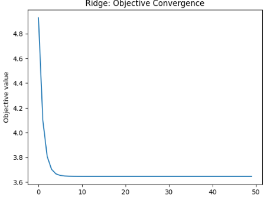
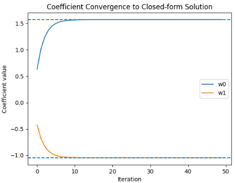
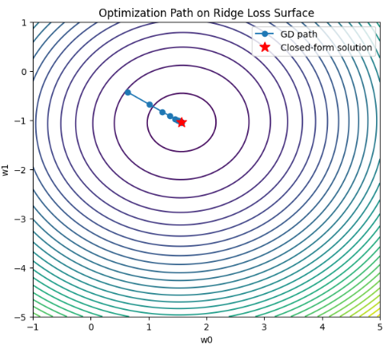

リッジ回帰は、最適化の視点で見ると **「不安定な逆問題を、数学的な小細工で『確実に解ける問題』に作り替える」** という、極めて実用的かつ基礎的な立ち位置にあります。

エンジニアやデータサイエンティストにとって、Ridgeは単なる「回帰の手法」ではなく、特定の数理構造を持つ最適化問題の代表例として扱われます。

本日は、Ridge回帰の前に最小２乗誤差の最小化についての説明を行い、その上でRidge回帰そのものについて説明を行います。

## 最小二乗法が微分可能
最小二乗法の誤差項  $\|Ax - b\|^2$ が微分可能（滑らか）である理由は、この式を分解してみると **「多項式（2次関数）」の組み合わせにすぎないから** です。

数学的な直感と、エンジニアがコードを書く際の視点の両方から解説します。

### 1. 数学的な構造：なぜ「カド」がないのか

$L_2$ ノルム（ユークリッド距離）の2乗である $\|Ax - b\|^2$ を展開すると、その正体がわかります。

$x$ を変数とする関数 $f(x)$ として展開すると：

$$f(x) = (Ax - b)^T (Ax - b)$$

$$f(x) = x^T A^T A x - 2b^T A x + b^T b$$

この式をよく見ると、以下の要素で構成されていることがわかります。

1. $x^T (A^T A) x$： $x$ の 2次項（放物線の多変数版）
2. $-2(A^T b)^T x$： $x$ の 1次項（直線）
3. $b^T b$： $x$ に関わらない 定数項

 $y = ax^2 + bx + c$ という放物線がどこでも滑らかに微分できるように、この式も $x$ の各成分について微分が可能です。

 **「2乗」という操作が、マイナスをプラスに反転させつつ、原点でカドを作らずになだらかに繋いでくれる**のです。


### 2. $L_1$ ノルム（絶対値）との決定的な違い

微分できない代表例である $L_1$ ノルム $\|x\|_1 = \sum |x_i|$ と比較すると、理由がより鮮明になります。

| 特徴 | $L_2$ | $L_1$  |
| --- | --- | --- |
| **グラフの形状** | 放物線（U字型） | V字型 |
| **原点 (0) での挙動** | **なだらか**。傾きが 0 に近づく。 | **急激**。折れ曲がっている。 |
| **微分 ($f'(x)$)** | $2x$（連続） | $1$ または $-1$ （不連続） |

$L_1$ ノルムは原点で「カド」があるため、そこで右から近づいたときの傾きと左から近づいたときの傾きが一致せず、微分が定義できません。
一方、最小二乗法の誤差項（$L_2$）は、2乗のおかげで原点付近でも非常に滑らかです。


### 3. 微分した結果（勾配）はどうなるか？

実際に微分（勾配 $\nabla f(x)$ を計算）すると、非常に綺麗な形になります。

$$\nabla f(x) = 2 A^T (Ax - b)$$

この結果も $x$ に関する線形（1次）の式であり、どこにも「不連続な点」や「定義できない場所」がありません。
エンジニアが勾配降下法を実装する際、`grad = 2 * A.T @ (A @ x - b)` と一行で書けるのは、この関数が全領域で微分可能だからです。


### 4. エンジニアにとっての「微分可能」のメリット

1. **勾配降下法がそのまま使える**:
「今の場所の傾き」が常に計算できるため、少しずつ坂を下るだけで最適解にたどり着けます。
2. **解析的に解ける（正規方程式）**:
微分した結果を「$= 0$」とおくことで、計算機で反復計算をしなくても $x = (A^T A)^{-1} A^T b$ という一発の行列計算で答えを出すことも可能です。

## Ridge回帰について
リッジ回帰（Ridge Regression）は、Lasso回帰と並んで「正則化」の代表格ですが、その目的は **「モデルの複雑さを抑え、過学習を防ぐこと」** に特化しています。

Lassoが「変数を0にして削る」のに対し、リッジは**「変数を0にせず、全体的に値を小さく抑える」**というアプローチを取ります。

### 1. リッジ回帰の数式

リッジ回帰の目的関数は、最小二乗誤差に **「重みの2乗和（$L_2$ノルム）」** を加えたものです。

$$\min_{x} \underbrace{\|Ax - b\|^2}_{\text{最小二乗誤差}} + \underbrace{\lambda \|x\|_2^2}_{\text{L2正則化項}}$$

* **第2項（L2正則化項）**: 重み $x$ の「大きさ」にペナルティを与えます。
* **$\lambda$（ラムダ）**: この値が大きいほど、重みはより小さく制限されます。

### 2. Lassoとの決定的な違い

最大の違いは、 **「微分可能かどうか」** と **「解の形」** です。

#### ① 数学的な性質：どこでも滑らか

リッジ回帰の $L_2$ 正則化項は、前述の通り「2乗の和」であるため、**全領域で微分可能**です。
そのため、Lassoのように近接写像（Proximal Mapping）を持ち出す必要はなく、通常の勾配降下法や行列計算（正規方程式）で非常に安定して解を求めることができます。

#### ② 幾何学的なイメージ：円と楕円

視覚的には、最小二乗法の誤差範囲（楕円形）が、 $L_2$ノルムの制約範囲（円形）と接触する場所を探します。

* **Lasso（ひし形）**: カド（軸上）で当たりやすいため、変数が0になる。
* **Ridge（円）**: カドがないため、軸上で当たるとは限らない。変数は0にはならず、**「小さな値」**として残り続けます。

### 3. リッジ回帰の強み：マルチコ（多重共線性）への耐性

エンジニアが現場でリッジ回帰を好む最大の理由は、 **相関が強い変数（マルチコ）** に非常に強い点です。

* **Lassoの場合**: 似たような意味を持つ変数AとBがあったとき、どちらか一方を0にして、もう一方だけを残すという極端な挙動をします。
* **Ridgeの場合**: 似たような変数AとBがあれば、両方に**バランスよく小さな重み**を割り振ります。

データの安定性を重視し、「どの変数も少しずつ予測に貢献させたい」という場合には、リッジ回帰の方が予測精度が安定する傾向にあります。

### 4. Lasso、Ridge、そしてElastic Net

これまでの内容を整理すると、以下のようになります。

| 特徴 | リッジ回帰 (Ridge) | Lasso回帰 |
| --- | --- | --- |
| **正則化項** | $L_2$ノルム（2乗和） | $L_1$ノルム（絶対値和） |
| **変数の数** | 減らない（すべて残る） | 減る（0になるものが出る） |
| **微分** | 可能（どこでも滑らか） | 不可能（原点でカドがある） |
| **得意な状況** | 変数同士の相関が強いとき | 重要な変数が一握りのとき |

### 両方のいいとこ取り：Elastic Net

「変数を削りつつ、相関が強い変数もバランスよく扱いたい」という欲張りなニーズに応えるのが **Elastic Net** です。これは $L_1$ と $L_2$ の両方を足し合わせたもので、現代の機械学習の実務では非常によく使われます。


## 実装

ここでは **Ridge回帰を解く代表的なアルゴリズムを3種類**、数値最適化の観点で実装します。

実務・研究での位置づけ：

1. **閉形式解（最も基本・高速）**
2. **勾配降下法（大規模データ向けの基礎）**
3. **確率的勾配降下（SGD）（超大規模向け）**

対象問題：

$$
\min_w ;
\frac{1}{2n}|y - Xw|^2 + \frac{\alpha}{2}|w|^2
$$

### 1. アルゴリズム①：閉形式解（Normal Equation）

理論解：

$$
w^* = (X^TX + n\alpha I)^{-1}X^Ty
$$

```python
def ridge_closed_form(X, y, alpha):
    n, d = X.shape
    I = np.eye(d)
    w = np.linalg.inv(X.T @ X + n * alpha * I) @ X.T @ y
    return w
```

使用：

```python
alpha = 1.0
w_closed = ridge_closed_form(X, y, alpha)
```

特徴：

* 計算量：O(d³)
* 小〜中規模で最速
* 数値的に安定（α>0）

### 2. アルゴリズム②：バッチ勾配降下法（Gradient Descent）

勾配：

$$
\nabla =
-\frac{1}{n}X^T(y - Xw) + \alpha w
$$

```python
def ridge_gradient_descent(X, y, alpha, lr=0.1, max_iter=1000, tol=1e-6):
    n, d = X.shape
    w = np.zeros(d)
    
    for _ in range(max_iter):
        grad = -(X.T @ (y - X @ w)) / n + alpha * w
        w_new = w - lr * grad
        
        # 収束判定
        if np.linalg.norm(w_new - w) < tol:
            break
        
        w = w_new
    
    return w
```

使用：

```python
w_gd = ridge_gradient_descent(X, y, alpha)
```

特徴：

* 大規模データ対応
* 学習率が重要
* 収束は線形

### 3. アルゴリズム③：確率的勾配降下（SGD）

1サンプルごとに更新：

```python
def ridge_sgd(X, y, alpha, lr=0.01, epochs=50):
    n, d = X.shape
    w = np.zeros(d)
    
    for _ in range(epochs):
        idx = np.random.permutation(n)
        
        for i in idx:
            xi = X[i]
            yi = y[i]
            
            # 勾配（1サンプル）
            grad = -(yi - xi @ w) * xi + alpha * w
            
            w = w - lr * grad
    
    return w
```

使用：

```python
w_sgd = ridge_sgd(X, y, alpha)
```

特徴：

* 超大規模データ対応
* ノイズありだが高速


SGDで実装した結果を示します。
実装コードは以下に保管しています。

https://github.com/Shinichi0713/recommendation-ai/tree/main/optimization/src/l2_opt








### まとめ

リッジ回帰は、 **「モデルをシンプルに保ちつつ、すべてのデータを大切に扱う」** ための手法です。

「精度は出したいけれど、変数を完全に消してしまうのは不安だ」「データの動きが激しいので安定させたい」という場面では、まずリッジ回帰を試すのがエンジニアとしての堅実な判断と言えます。


