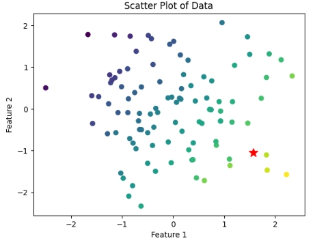
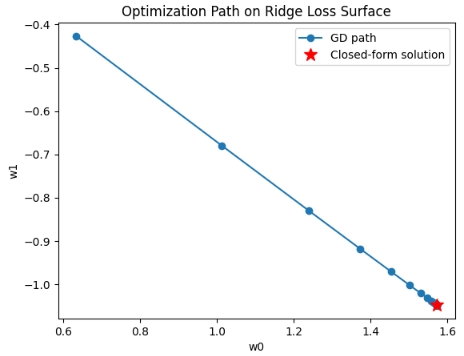

ご提示いただいたコードのその部分は、**「アルゴリズムが正しく動くか検証するための『実験用データ』を自前で作る（合成データ生成）」**という、エンジニアやデータサイエンティストが最初に行う非常に重要なステップです。

具体的に何をしているのか、4つのステップに分けて解説します。

---

### 1. 再現性の確保

**Python**

```
np.random.seed(0)
```

* **処理内容** : 乱数のシード（種）を固定しています。
* **意味** : 実行するたびに異なるデータが生成されると、アルゴリズムの修正前後で結果の比較ができなくなります。シードを固定することで、**誰がどこで実行しても同じランダムな数値が得られる**ようにしています。

### 2. 「正解」があるデータの作成

**Python**

```
n = 100 # サンプル数
d = 2   # 特徴数
X = np.random.randn(n, d)
true_w = np.array([3.0, -2.0]) # 理想的な重み
```

* **処理内容** : 100人分のデータ（身長と体重のようなイメージ）をランダムに作り、**「もしこの世界に完璧な法則があるなら、重みはこれ（3.0と-2.0）になるはずだ」**という正解をあらかじめ決めています。
* **エンジニアの視点** : あとでアルゴリズムが算出した値が `[3.0, -2.0]` に近ければ、「このプログラムは正解だ！」と判断するための基準（Ground Truth）を作っています。

### 3. 現実味を持たせる「ノイズ」の追加

**Python**

```
y = X @ true_w + 0.5 * np.random.randn(n)
```

* **処理内容** : 正解の式（**$y = Xw$**）に、**あえて少しの誤差（0.5 * 乱数）**を加えています。
* **意味** : 世の中のデータは完璧な数式通りには動きません。少しノイズを混ぜることで、**「ノイズに惑わされずに本質的な法則を見抜けるか？」**というリッジ回帰本来のテスト環境を作っています。

### 4. 計算を安定させる「標準化」

**Python**

```
X = (X - X.mean(axis=0)) / X.std(axis=0) # 平均0、分散1にする
y = y - y.mean()                         # yも中心を0に寄せる
```

* **処理内容** : データの数値を「扱いやすい形」に整えています。
* **理由** : 特徴量（X）の単位（例：cmとkg）がバラバラだと、勾配降下法がうまく進まなくなります。これを**「標準化（Standardization）」**と言います。
* **最適化におけるメリット** : 全ての変数が同じスケールになることで、**「お椀型の関数（コスト関数）」が綺麗な円形に近づき、勾配降下法が最短距離で中心（最適解）に向かえる**ようになります。

---

### まとめ：この処理の目的

一言でいうと、**「答えが分かっている練習問題を作成し、さらに解きやすいように数字を整えた」**状態です。

この準備があるからこそ、その後の `ridge_gradient_descent` 関数を実行したときに、計算された `w` が `true_w` に近い値になることを確認できるわけです。


その部分は、リッジ回帰の**「正規方程式（Normal Equation）」**と呼ばれる、反復計算（ループ）を使わずに一発で最適解を求める**解析解（Closed-form solution）**を計算しています。

エンジニアがアルゴリズムを自作する際、「ループで求めた答えが、理論上の正解と一致しているか」を確認するための**絶対的な基準値**を作るステップです。

---

### コードの各行の役割

#### 1. ハイパーパラメータの設定

```python
alpha = 1.0

```

* 正則化の強さを決める係数です。この値が大きいほど、重み `w` はより小さく（0に近く）抑えられます。

#### 2. 単位行列の作成

```python
I = np.eye(d)

```

* **処理内容**: （この場合は ）の単位行列  を作成します。
* **役割**: リッジ回帰の数式における「正則化項」を表現するために必要です。行列  の対角成分にだけ  を足し合わせるための「型」のようなものです。

#### 3. 解析解（正規方程式）の計算

```python
w_closed = np.linalg.inv(X.T @ X + n * alpha * I) @ X.T @ y

```

* **処理内容**: 次の数学的な公式をそのままコードに落とし込んでいます。

$$w = (X^T X + n\alpha I)^{-1} X^T y$$

* **ポイント**:
* `X.T @ X`: 特徴量同士の相関（分散共分散的な行列）を計算。
* `+ n * alpha * I`: ここがリッジ回帰の肝です。行列の対角成分に値を足すことで、**「逆行列が計算できない（不安定）」という事態を防ぎ、重みを抑制**します。
* `np.linalg.inv(...)`: 逆行列を計算します。
* `@ X.T @ y`: 最小二乗法でよく見る「データの当てはまり」を計算する部分です。


---

### なぜ `n * alpha` になっているのか？（ここが重要）

通常、理論的な教科書では  と書かれますが、このコードでは `n * alpha` となっています。

これは、目的関数の定義が **「平均」二乗誤差**（誤差を  で割る形）になっているためです。

* **合計**の誤差を最小化する場合   を使う
* **平均**の誤差を最小化する場合   を使う

この処理により、**データ数  が増えても正則化の効き具合が変わらないように調整**されています（`scikit-learn` の Ridge 実装などでも見られる工夫です）。

---

### エンジニア的な「立ち位置」のまとめ

この `w_closed` は、いわば**「模範解答」**です。

1. **比較用**: あとでループ（勾配降下法）で求めた `w` が、この `w_closed` とほぼ一致していれば、プログラムの実装が正しいと確信できます。
2. **効率**: データがそこまで大きくない（変数が数千個程度まで）なら、ループを回すよりこの一行を計算する方が圧倒的に速く、正確です。




リッジ回帰は、散らばった複数のデータ点に対して、**「データの傾向をしっかり捉えつつも、極端な予測をしない、バランスの取れた直線（または平面）」**の係数を算出しています。

具体的には、以下の**2つの相反する要素を同時に満たす「妥協点」**を最適値として導き出しています。

---

## 1. データへの適合（最小二乗法）

まず、手元にある複数の点（データ）のすぐ近くを通るように、直線の傾き（係数 ）を調整します。

* **目的**: 予測値と実際の値のズレ（残差）を最小にすること。
* **図解**: 各点から直線までの垂直な距離の2乗を合計し、それを最小化しようとします。

## 2. 極端な重みへのペナルティ（正則化）

ここがリッジ回帰の独自性です。単に点に合わせるだけでなく、**「係数  の値が大きくなりすぎないように」**ブレーキをかけます。

* **目的**: 特定のデータに過剰に反応（過学習）するのを防ぐこと。
* **理由**: 重みが大きすぎると、少しのノイズで予測結果が激しく上下する「脆いモデル」になってしまうからです。

---

## リッジ回帰が算出する「最適値」の正体

リッジ回帰が最終的に算出しているのは、以下の**「コスト関数」を最小にする係数 ** です。

### 何が最適なのか？

* **①だけを重視すると**: 全ての点に無理やり合わせようとして、グニャグニャに曲がった（複雑すぎる）モデルになります。
* **②だけを重視すると**: 重みがほぼゼロになり、何も予測できないモデルになります。

リッジ回帰は、この「ズレ」と「重みの大きさ」の**合計スコアが最も低くなる点**を最適値として算出します。これにより、**「多少のノイズは無視し、データ全体の大きな流れを捉えた、安定した直線」**が引けるようになります。

---

## 数学的なイメージ：お椀の底を探す

2次元（特徴量が2つ）の場合、このコスト関数は「綺麗なひずみのないお椀」のような形をしています。

リッジ回帰のアルゴリズム（勾配降下法など）は、このお椀の斜面を転がり落ちて、**「データとのフィット感」と「モデルのシンプルさ」が最高のバランスで保たれている「底（最小点）」**を見つけ出しているのです。

---

### まとめ

リッジ回帰が算出しているのは、単なる「平均的な値」ではなく、**「未知のデータに対しても高い精度を維持できる、安定感のある重みの組み合わせ」**です。

ということで回帰の結果は以下です。





SGD（確率的勾配降下法）や今回のバッチ勾配降下法の解が、リッジ回帰の理論値（解析解）と整合したのは、**リッジ回帰の目的関数が「綺麗な1つだけの谷を持つお椀型（強凸関数）」だから**です。

なぜ勾配を追うだけで理論上の正解にたどり着くのか、その数学的・直感的な理由を整理します。

---

## 1. 目的関数が「凸（Convex）」であるから

リッジ回帰のコスト関数  は、どこを切り取っても下に凸な形状をしています。

* **最小二乗項**：多変数の2次関数（お椀型）
* **L2正則化項**：同じく2次関数（お椀型）

この2つを足し合わせた関数には、**「局所最適解（偽の谷）が存在せず、谷底（大域的最適解）が世界に一つしかない」**という性質があります。そのため、どの地点からスタートしても、坂を下り続ければ必ず理論上の正解にたどり着きます。

---

## 2. 勾配が「正解への方向」を指し示しているから

コードの中で計算した `grad`（勾配）は、数学的に**「関数が最も急激に増加する方向」**を意味します。

```python
grad = -(X.T @ (y - X @ w)) / n + alpha * w

```

この勾配にマイナスをかけて更新する（`w = w - lr * grad`）ことは、常に**「最も効率的に谷底へ向かう方向」に歩みを進める**ことを意味します。理論値 `w_closed` はまさにその谷底の座標であるため、歩幅（学習率）さえ適切であれば、計算結果は理論値に吸い寄せられるように一致します。

---

## 3. 「強凸性」による収束の保証

リッジ回帰の場合、正則化項（）があるおかげで、お椀の底が平らにならず、非常にシャープな形状になります（これを**強凸性**と呼びます）。

* **通常の最小二乗法**: データによっては谷底が細長い「溝」のようになり、どこが正解かフラフラすることがあります。
* **リッジ回帰**: 正則化項が「中心（原点）に引き戻す力」として働くため、谷底が一点にビシッと定まります。

この「中心に引き戻す力」と「データに合わせる力」が完全に均衡する点が、数学的に導き出した `w_closed` と一致するのです。

---

## 4. 勾配降下法と解析解の「数学的な一致」

数学的に見ると、両者が一致するのは当然の結果と言えます。

* **解析解 (`w_closed`)**: 勾配が **「完全に 0」** になる地点を逆行列で一発で計算したもの。
* **勾配降下法 (`SGD`)**: 勾配が **「ほぼ 0」** になるまで、少しずつ  を動かしたもの。

つまり、ゴール（勾配  の地点）を目指して「計算で一気に行く」か「歩いて行く」かの違いだけであり、同じ目的地を目指しているため、結果は整合します。

---

### まとめ：なぜ整合したのか？

1. **迷路がない**: 偽の谷（局所解）がないため、必ず正解に辿り着ける。
2. **コンパスが正確**: 勾配が常に正解の方向を指している。
3. **目的地が明確**: 正則化によって「唯一の正解」が数学的に固定されている。

もし、この解が一致しなかったとしたら、それは**「学習率（lr）が大きすぎて谷を飛び越してしまった」**か、**「繰り返し回数が足りなくて途中で止まってしまった」**かのどちらかです。

次は、**学習率（lr）を変えると、この「正解へのたどり着き方」がどう変わるか**を実験してみますか？（小さすぎると遅く、大きすぎると発散する様子が見えて面白いですよ！）
