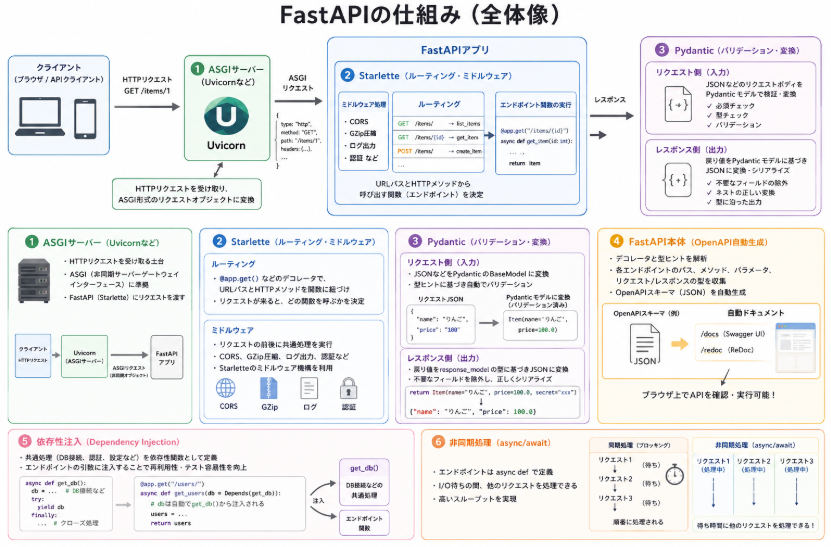

自分が作った機能を公開するときに、普段はWEBアプリで公開するということが多かったのですが、先日"それ、Web APIフレームワークで公開する"と言われ、Webアプリではないの？と感じました。

Web APIフレームワークって結局何なの？というような疑問が生じたわけです。

本日テーマ：
>Web APIフレームワークが何かを調べる

## 概要

Web APIフレームワークとは、**「Web APIサーバーを効率的に開発するための土台（フレームワーク）」** です。

### 1. Web APIとは

まず前提として、**Web API**とは：

- HTTP（HTTPS）を通じて  
- プログラム同士がデータをやり取りするための**インターフェース**

です。

例：
- モバイルアプリがサーバーから「ユーザー情報」を取得する  
- フロントエンド（Reactなど）がサーバーから「商品一覧」を取得する  
- 別のサービスが「決済情報」を送信する

このような**プログラム同士の通信**を実現するのがWeb APIです。

### 2. Web APIフレームワークの役割

Web APIフレームワークは、そのWeb APIサーバーを**楽に・安全に・高速に**作るための仕組みを提供します。

主な役割：

- **HTTPリクエストの受け取り・ルーティング**  
  - 例：`GET /users` というリクエストを「ユーザー一覧を返す関数」に紐づける
- **リクエストデータのバリデーション**  
  - 送られてきたJSONの形式が正しいか、必須項目があるかなどをチェック
- **レスポンスデータのシリアライズ**  
  - PythonオブジェクトなどをJSONに変換して返す
- **認証・認可のサポート**  
  - APIキー、JWTトークンなどによるアクセス制御
- **自動ドキュメント生成**  
  - Swagger UIなどで「どのAPIがあるか」「どう使うか」を自動で表示
- **エラーハンドリング**  
  - エラー時に適切なHTTPステータスコードとメッセージを返す

### 3. 代表的なWeb APIフレームワークの例

- **FastAPI（Python）**  
  - 型ヒントを活用した高速なAPIフレームワーク  
  - 自動ドキュメント生成が強力

- **Flask + Flask-RESTful（Python）**  
  - 軽量で柔軟なマイクロフレームワーク  
  - REST API構築用の拡張が豊富

- **Express.js（Node.js）**  
  - JavaScript/TypeScriptでWebサーバー・APIサーバーを構築  
  - ミドルウェア（認証、ログ、CORSなど）をプラグイン的に追加可能

- **Spring Boot（Java/Kotlin）**  
  - エンタープライズ向けの本格的なREST APIサーバー構築  
  - セキュリティ、トランザクション、監査などが充実

- **Ruby on Rails API mode（Ruby）**  
  - RailsをAPI専用サーバーとして使うモード  
  - モデル・マイグレーション・認証などをそのまま利用可能

### 4. Web APIフレームワークを使うメリット

__(1) 開発スピードが上がる__
- ルーティング、バリデーション、シリアライズを**ほぼ自動で**行ってくれる  
- ボイラープレート（毎回書く定型的なコード）が減る

__(2) 安全性・保守性が高まる__
- 入力チェックや型チェックをフレームワークが肩代わり  
- エラーハンドリングを共通化しやすい

__(3) ドキュメントが自動で整う__
- OpenAPI仕様に基づいた**インタラクティブなAPIドキュメント**を自動生成  
- フロントエンド開発者や他チームとの連携がスムーズになる

__(4) テストしやすい__
- 単体テスト・統合テスト用のユーティリティが用意されていることが多い  
- モックやテストクライアントを使いやすい

## WEBアプリケーションとの違い

「Web APIフレームワーク」と「Webアプリケーションフレームワーク」は、**目的**と**提供する機能**が異なります。

### 1. それぞれのざっくりした役割

__Webアプリケーションフレームワーク__
- **Webブラウザで見る「Webサイト」を作る**ためのフレームワーク
- 例：Django（Python）、Ruby on Rails（Ruby）、Laravel（PHP）、Spring MVC（Java）など
- 主な出力：**HTMLページ**（＋CSS、JavaScript）
- 主な利用者：**人間（エンドユーザー）**

__Web APIフレームワーク__
- **プログラム同士が通信するための「APIサーバー」を作る**ためのフレームワーク
- 例：FastAPI（Python）、Flask-RESTful（Python）、Express + JSON API（Node.js）、Spring Boot（REST API用途）など
- 主な出力：**JSONやXMLなどのデータ形式**
- 主な利用者：**別のプログラム（フロントエンド、モバイルアプリ、他サービスなど）**

### 2. 機能面での違い

__Webアプリケーションフレームワークがよく持つ機能__
- **テンプレートエンジン**（HTMLを動的に生成）
- **セッション管理**（ログイン状態の保持）
- **フォーム処理**（入力フォームのバリデーション、CSRF対策）
- **静的ファイル配信**（CSS、画像、JSファイル）
- **ページネーション**や**レイアウト機能**（サイトの見た目を整える）
- 多くの場合、**フルスタック**で、DB接続・認証・管理画面まで含む

__Web APIフレームワークがよく持つ機能__
- **JSON/XMLのシリアライズ・デシリアライズ**
- **HTTPステータスコード**や**ヘッダー制御**のサポート
- **認証トークン（JWTなど）**の扱い
- **CORS設定**（異なるドメインからのアクセス許可）
- **OpenAPI/Swagger**による自動ドキュメント生成
- 多くの場合、**テンプレートやHTML生成は最小限 or なし**

### 3. 典型的な使い分け

__Webアプリケーションフレームワークを使う場面__
- ブログ、ECサイト、社内管理画面など、**ブラウザで直接見るサイト**を作る
- サーバー側でHTMLを生成し、ブラウザに返す
- 例：Djangoで「商品一覧ページ」や「管理画面」を作る

__Web APIフレームワークを使う場面__
- フロントエンド（React/Vue/Angularなど）やモバイルアプリ（iOS/Android）が**データを取得・更新するためのバックエンド**を作る
- サーバーはJSONなどを返し、**UIの描画はクライアント側**で行う
- 例：FastAPIで「商品一覧API」「注文API」を作り、Reactアプリから呼び出す

### 4. 実際の開発スタイルの違い（例）

__Webアプリケーションフレームワーク（例：Django）__
```python
# views.py
from django.shortcuts import render
from .models import Product

def product_list(request):
    products = Product.objects.all()
    return render(request, "products/list.html", {"products": products})
```
- サーバー側でHTMLを組み立てて返す

__Web APIフレームワーク（例：FastAPI）__
```python
from fastapi import FastAPI
from pydantic import BaseModel

app = FastAPI()

class Product(BaseModel):
    id: int
    name: str

@app.get("/products/", response_model=list[Product])
async def get_products():
    # DBから取得してJSONで返す
    return [{"id": 1, "name": "商品A"}, {"id": 2, "name": "商品B"}]
```
- サーバーはJSONを返し、フロントエンドがそれを描画する

### 5. 最近のトレンド：分離（フロントエンドとバックエンドの分離）

近年は、

- **バックエンド**：Web APIフレームワーク（FastAPI、Spring Bootなど）
- **フロントエンド**：React / Vue / Angular / Svelte など

というように、**役割を分離**する構成が一般的です。

そのため、Webアプリケーションフレームワークの中にも「REST API機能」が追加され、  
Django REST framework や Rails API mode のように、**WebアプリケーションフレームワークをAPIサーバーとして使う**ケースも増えています。

## Web APIの仕組み

FastAPIの仕組みは、大きく分けて次の4つの要素で成り立っています。

1. **ASGIサーバー（Uvicornなど）** – HTTPリクエストを受け取る土台  
2. **Starlette** – 低レベルのWebフレームワーク（ルーティング・ミドルウェアなど）  
3. **Pydantic** – データのバリデーションとシリアライズ  
4. **FastAPI本体** – これらを統合し、型ヒントからAPI仕様を自動生成する層

順に説明します。

### 1. ASGIサーバーがHTTPリクエストを受け取る

FastAPIは**ASGI（Asynchronous Server Gateway Interface）** というPythonの標準インターフェースに準拠しています。

- ASGIサーバー（例：Uvicorn）が、HTTPリクエストを**Pythonの非同期オブジェクト**として受け取る  
- それをFastAPI（Starlette）に渡す

イメージ：
```
ブラウザ/クライアント
    ↓ HTTPリクエスト (GET /items/1)
ASGIサーバー (Uvicorn)
    ↓ ASGI形式のリクエストオブジェクト
FastAPIアプリ
```

### 2. Starletteがルーティングとミドルウェアを処理

FastAPIは内部で**Starlette**という軽量ASGIフレームワークを使っています。

__ルーティング__
- `@app.get("/items/")` のようなデコレータで、**URLパスとHTTPメソッド**を関数に紐づける  
- リクエストが来ると、Starletteが「どの関数を呼ぶか」を決定する

__ミドルウェア__
- CORS、GZip圧縮、ログ出力など、**リクエスト・レスポンスの前処理・後処理**を行う  
- Starletteのミドルウェア機構をFastAPIが利用している

### 3. Pydanticがリクエスト・レスポンスの型を検証・変換

FastAPIは**Pydantic**というライブラリを使って、データの**バリデーション**と**シリアライズ**を行います。

__リクエスト側__
- リクエストボディ（JSONなど）を、Pydanticの`BaseModel`に基づいて**Pythonオブジェクト**に変換  
- 型ヒントに基づき、自動でバリデーション（必須チェック、型チェックなど）を行う

例：
```python
from pydantic import BaseModel

class Item(BaseModel):
    name: str
    price: float

@app.post("/items/")
async def create_item(item: Item):
    # itemはすでにバリデーション済みのPythonオブジェクト
    return {"item": item}
```

__レスポンス側__
- 関数の戻り値を、`response_model`で指定した型に基づいて**JSONに変換**  
- 不要なフィールドを除外したり、ネストしたオブジェクトを正しくシリアライズ

### 4. FastAPIが型ヒントからOpenAPI仕様を自動生成

FastAPIの特徴的な仕組みとして、**Pythonの型ヒントからOpenAPI（Swagger）仕様を自動生成**する機能があります。

__仕組みの概要__
- デコレータ（`@app.get(...)`）と関数の型ヒントを解析  
- 各エンドポイントの
  - パス  
  - HTTPメソッド  
  - パラメータ（クエリ、パス、ボディ）  
  - レスポンスの型  
  を収集し、**OpenAPIスキーマ（JSON）**を構築

__自動ドキュメント__
- 生成されたOpenAPIスキーマを元に、`/docs`（Swagger UI）や`/redoc`で**インタラクティブなAPIドキュメント**を表示  
- ブラウザ上から直接APIを試せる

### 5. 依存性注入（Dependency Injection）

FastAPIは**依存性注入**の仕組みを持っています。

- DB接続、認証、設定など、「複数のエンドポイントで共通して使う処理」を**依存性関数**として定義  
- それをエンドポイントの引数に注入することで、**再利用とテスト容易性**を高める

例：
```python
async def get_db():
    # DB接続を返す
    ...

@app.get("/users/")
async def get_users(db = Depends(get_db)):
    # dbは自動でget_db()から注入される
    ...
```

### 6. 非同期処理（async/await）

FastAPIは**非同期処理（async/await）** を前提に設計されています。

- エンドポイント関数を`async def`で定義  
- I/O待ち（DBアクセス、外部API呼び出しなど）の間、**他のリクエストを処理できる**  
- これにより、**高いスループット**を実現


## 総括


Web APIフレームワークは、**プログラム同士がHTTPでデータをやり取りするためのAPIサーバーを、効率よく・安全に構築するための土台**です。

主な役割は次の通りです。

- **HTTPリクエストの受け取りとルーティング**  
  （例：`GET /users` を特定の関数に紐づける）
- **リクエストデータのバリデーション**  
  （JSONの形式や必須項目のチェック）
- **レスポンスデータのシリアライズ**  
  （PythonオブジェクトなどをJSONに変換）
- **認証・認可、エラーハンドリング、自動ドキュメント生成**などの共通機能提供

代表的な例として、Pythonの**FastAPI**、Node.jsの**Express.js**、Javaの**Spring Boot**などがあります。

### Webアプリケーションフレームワークとの違い

- **Webアプリケーションフレームワーク**  
  - ブラウザで見る**Webサイト**を作るためのもの  
  - 主な出力は**HTML**（＋CSS/JS）  
  - テンプレートエンジン、セッション管理、フォーム処理などが中心

- **Web APIフレームワーク**  
  - フロントエンドやモバイルアプリなど**別のプログラム**が使う**APIサーバー**を作るためのもの  
  - 主な出力は**JSON/XML**などのデータ形式  
  - JSONシリアライズ、HTTPステータス制御、CORS、OpenAPIドキュメントなどが中心

近年は、**バックエンド＝Web APIフレームワーク、フロントエンド＝React/Vueなど**という役割分離が一般的です。


### FastAPIの仕組み

FastAPIは、次の要素で構成されています。



1. **ASGIサーバー（Uvicornなど）**  
   - HTTPリクエストを受け取り、ASGI形式でFastAPIに渡す

2. **Starlette**  
   - ルーティング（`@app.get(...)`）とミドルウェア（CORS、ログなど）を担当

3. **Pydantic**  
   - リクエストボディ・レスポンスの**型チェックとバリデーション**  
   - Pythonオブジェクト ⇔ JSON の相互変換

4. **FastAPI本体**  
   - 型ヒントから**OpenAPI仕様を自動生成**し、`/docs`でインタラクティブなAPIドキュメントを提供  
   - **依存性注入**（DB接続や認証処理の共通化）  
   - **非同期処理（async/await）** を前提に設計され、I/O待ち中も他のリクエストを処理可能

これにより、FastAPIは「型安全」「自動ドキュメント」「高パフォーマンス」を兼ね備えたWeb APIフレームワークとして広く利用されています。